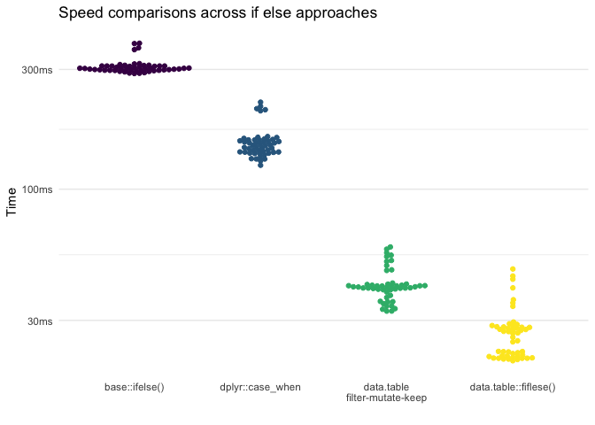

As I’ve spent time learning about different approaches to working with
data, I’ve seen several subtle, but important, differences in how to do
things. This very short post is presenting how one can perform
vectorized “if else” functions in `data.table` and how these relate to
the grammar of `dplyr`.

Why do this? Well, we are often making or adjusting a variable based on
values in another variable. This is often done using `base::ifelse()`,
`dplyr::if_else()`, `dplyr::case_when()`, or `data.table::fiflese()`.
But it turns out there is another way to do this in `data.table` that is
very quick.

For this post, we will use:

    # Core
    library(dplyr)

    ## 
    ## Attaching package: 'dplyr'

    ## The following objects are masked from 'package:stats':
    ## 
    ##     filter, lag

    ## The following objects are masked from 'package:base':
    ## 
    ##     intersect, setdiff, setequal, union

    library(data.table)

    ## 
    ## Attaching package: 'data.table'

    ## The following objects are masked from 'package:dplyr':
    ## 
    ##     between, first, last

    library(bench)
    # Helpers
    library(tidyr)
    library(ggbeeswarm)

    ## Loading required package: ggplot2

We’ll also create a ficticious data set with four variables: `grp`, `x`,
`y`, and `z`.

    dt <- data.table(
      grp = factor(sample(1L:3L, 1e6, replace = TRUE)),
      x = rnorm(1e6),
      y = rnorm(1e6),
      z = sample(c(1:10, NA), 1e6, replace = TRUE)
    )
    dt

    ##          grp          x           y  z
    ##       1:   1 -1.0023768 -0.44343189  6
    ##       2:   2  0.1188058  0.11153599  1
    ##       3:   3  0.7294123 -0.43541974 10
    ##       4:   2  0.6327726 -0.55820521  4
    ##       5:   2  0.2785144  0.22457811  9
    ##      ---                              
    ##  999996:   2  0.8129531 -0.85603723  2
    ##  999997:   1  1.7538627 -1.39715029 NA
    ##  999998:   3  1.5539279  0.06174332  8
    ##  999999:   1  0.9840561 -1.44498751  8
    ## 1000000:   3  1.4770956 -0.76660900  8

If Else
-------

Let’s say we want to create a new variable that is categorizing our `x`
variable. Below we walk through each approach to doing this.

### `base::ifelse()`, `dplyr::if_else()`, and `data.table::fiflese()`

Both `base::ifelse()`, `dplyr::if_else()`, and `data.table::fiflese()`
work the same way, but `if_else()` and `fifelse()` are more careful
about variable types and `fiflese()` is super fast. These are used with
the following general syntax:

    if_else(condition, true, false)

where:

1.  `condition` is something that can be true or false. For example, we
    could do `x > median(x)` to test if each individual point of `x` is
    greater than the median of `x` or not.
2.  `true` is what is supposed to happen when the condition is true.
3.  `false` is what is supposed to happen when the condition is false.

So with our example data, we can do:

    dt %>% 
      mutate(x_cat = if_else(x > median(x), "high", "low")) %>% 
      as_tibble()

    ## # A tibble: 1,000,000 x 5
    ##    grp         x       y     z x_cat
    ##    <fct>   <dbl>   <dbl> <int> <chr>
    ##  1 1     -1.00   -0.443      6 low  
    ##  2 2      0.119   0.112      1 high 
    ##  3 3      0.729  -0.435     10 high 
    ##  4 2      0.633  -0.558      4 high 
    ##  5 2      0.279   0.225      9 high 
    ##  6 2     -0.0469  0.0551     1 low  
    ##  7 2     -1.20   -1.53       2 low  
    ##  8 1     -0.931  -1.57       3 low  
    ##  9 3     -0.673  -2.44       8 low  
    ## 10 2     -0.957  -2.10       9 low  
    ## # … with 999,990 more rows

We could do this with `data.table` like below:

    dt[, x_cat := fiflese(x > median(x), "high", "low")]

### `dplyr::case_when()`

A newer, but fantastic, approach is using `dplyr::case_when()`. This
uses a unique syntax, but one that can avoid some issues. When there’s
more than 2 levels of the new variable (e.g., not just a “high” and
“low” but there is also a “moderate” level) then we use what is called
*nested ifelse statements*. These can get messy, with many parenthases.
For example, with just two three levels, we now need to use two
`if_else()` statements, where the second is in the `false` place of the
first.

    dt %>% 
      mutate(x_cat = if_else(x < -.5, "low",
                     if_else(x < .5 , "moderate", "high"))) %>% 
      as_tibble()

    ## # A tibble: 1,000,000 x 5
    ##    grp         x       y     z x_cat   
    ##    <fct>   <dbl>   <dbl> <int> <chr>   
    ##  1 1     -1.00   -0.443      6 low     
    ##  2 2      0.119   0.112      1 moderate
    ##  3 3      0.729  -0.435     10 high    
    ##  4 2      0.633  -0.558      4 high    
    ##  5 2      0.279   0.225      9 moderate
    ##  6 2     -0.0469  0.0551     1 moderate
    ##  7 2     -1.20   -1.53       2 low     
    ##  8 1     -0.931  -1.57       3 low     
    ##  9 3     -0.673  -2.44       8 low     
    ## 10 2     -0.957  -2.10       9 low     
    ## # … with 999,990 more rows

This is where `case_when()` is really awesome. Consider the same thing
we just did with `if_else()` but with `case_when()`.

    dt %>% 
      mutate(x_cat = case_when(x < -.5 ~ "low",
                               x <  .5 ~ "moderate",
                               x >= .5 ~ "high"))

    ##       grp             x             y  z    x_cat
    ## 1       1 -1.002377e+00 -4.434319e-01  6      low
    ## 2       2  1.188058e-01  1.115360e-01  1 moderate
    ## 3       3  7.294123e-01 -4.354197e-01 10     high
    ## 4       2  6.327726e-01 -5.582052e-01  4     high
    ## 5       2  2.785144e-01  2.245781e-01  9 moderate
    ## 6       2 -4.689539e-02  5.511923e-02  1 moderate
    ## 7       2 -1.196108e+00 -1.526927e+00  2      low
    ## 8       1 -9.313538e-01 -1.568029e+00  3      low
    ## 9       3 -6.727433e-01 -2.439345e+00  8      low
    ## 10      2 -9.572798e-01 -2.104600e+00  9      low
    ## 11      2 -9.117589e-02 -8.037771e-01 NA moderate
    ## 12      2 -1.283327e+00 -1.550127e+00  7      low
    ## 13      2  4.810022e-01 -2.399711e+00  6 moderate
    ## 14      3 -2.071286e-01 -7.877027e-01 10 moderate
    ## 15      2  1.494186e-01 -4.221415e-01  4 moderate
    ## 16      3  8.212217e-01 -1.051730e+00  1     high
    ## 17      2 -6.860079e-01  1.893475e+00  5      low
    ## 18      3  8.592615e-01 -2.449240e-01  2     high
    ## 19      2  2.541768e-01  9.531498e-01  5 moderate
    ## 20      3 -1.280903e+00  3.576879e-01  9      low
    ## 21      1 -1.287351e+00  9.687563e-01  9      low
    ## 22      2 -8.501132e-02 -1.263909e-01  7 moderate
    ## 23      1  2.095116e-01 -3.652510e-01  4 moderate
    ## 24      3  8.931345e-01  4.474796e-01  5     high
    ## 25      3  5.178356e-01 -7.168727e-01 NA     high
    ## 26      3 -4.017320e-01  2.303958e-01 10 moderate
    ## 27      3  3.470215e-02 -8.172070e-01  1 moderate
    ## 28      1  3.963449e-02 -6.030603e-01  4 moderate
    ## 29      1 -1.972184e+00 -1.202531e+00 NA      low
    ## 30      1  2.190780e+00 -1.142847e+00  3     high
    ## 31      1 -1.069803e+00 -8.110156e-02  8      low
    ## 32      3  8.072143e-01 -7.346679e-01 10     high
    ## 33      3  3.723207e-01  1.067083e+00  5 moderate
    ## 34      3  2.407264e-01 -1.725920e-01  4 moderate
    ## 35      3 -7.826640e-01  2.922485e-01  4      low
    ## 36      2  1.048088e+00 -9.195458e-01  4     high
    ## 37      3 -7.619249e-01  6.825616e-01 NA      low
    ## 38      2 -1.320062e+00 -1.345002e+00  9      low
    ## 39      1  5.934683e-01 -5.028214e-01  3     high
    ## 40      2  8.784077e-01  1.774083e-01  2     high
    ## 41      2 -2.437671e+00  7.812695e-02  6      low
    ## 42      1  5.384113e-01 -2.963285e-01  8     high
    ## 43      3  1.216485e+00  2.177292e+00  1     high
    ## 44      3  1.589008e-01  2.943972e-01  3 moderate
    ## 45      2 -1.210361e+00  1.206719e+00 10      low
    ## 46      3 -5.175439e-02  5.118575e-01  2 moderate
    ## 47      1  8.205446e-01  8.118829e-01 NA     high
    ## 48      2  7.646780e-01 -2.921851e-02 10     high
    ## 49      2 -4.352130e-01  5.653423e-01  6 moderate
    ## 50      2 -1.369820e-01 -8.457650e-01  7 moderate
    ## 51      2  9.922503e-01 -4.935915e-01  2     high
    ## 52      2 -1.178949e-01 -2.562348e-01  6 moderate
    ## 53      2 -1.429651e+00 -1.171855e+00  5      low
    ## 54      3  3.539368e-01  1.801310e+00  4 moderate
    ## 55      2  8.355099e-01 -2.704524e-01 NA     high
    ## 56      2 -2.618962e-02 -5.591642e-02 NA moderate
    ## 57      2 -1.715761e+00  9.063702e-02  5      low
    ## 58      2  5.837565e-02 -1.026976e+00  2 moderate
    ## 59      1  2.311387e-01 -7.200303e-01  8 moderate
    ## 60      1 -2.207659e-02 -6.044111e-01  1 moderate
    ## 61      1 -1.960831e-01  9.743376e-02  4 moderate
    ## 62      1 -1.346841e+00 -1.093620e+00  1      low
    ## 63      3  9.537072e-01  1.882532e+00  1     high
    ## 64      3  1.330421e+00 -1.819491e+00  2     high
    ## 65      3  1.927301e-01  1.717765e+00  6 moderate
    ## 66      2 -2.552373e-01  1.013237e+00  4 moderate
    ## 67      3  6.026847e-01 -9.839372e-01  7     high
    ## 68      2 -2.344569e-01 -1.107416e+00  4 moderate
    ## 69      3 -4.557214e-01 -5.138409e-01  3 moderate
    ## 70      3 -8.554457e-01 -5.564081e-01  2      low
    ## 71      1  1.293125e+00 -1.048845e+00 10     high
    ## 72      2  2.047239e+00 -1.563007e+00  9     high
    ## 73      3 -1.167745e+00  6.706677e-01  4      low
    ## 74      2  1.001193e+00  9.329289e-02  4     high
    ## 75      3 -4.638796e-01 -3.506573e-01  1 moderate
    ## 76      3  4.900825e-02  2.491998e-01  5 moderate
    ## 77      1  2.323986e-01  1.112375e+00  3 moderate
    ## 78      2 -6.585939e-01  4.388863e-01 10      low
    ## 79      1  6.892364e-01 -5.943374e-02  5     high
    ## 80      2 -4.061140e-01 -2.584492e+00  5 moderate
    ## 81      3 -8.268062e-01 -3.123295e-01  5      low
    ## 82      1  2.394384e+00 -1.113929e+00 10     high
    ## 83      3 -5.600777e-02 -1.597466e+00  8 moderate
    ## 84      2 -1.252411e+00  2.769292e+00  5      low
    ## 85      1 -9.970865e-01  3.887480e-01 10      low
    ## 86      1  1.037313e+00  1.419199e-01  4     high
    ## 87      1 -1.755113e-01 -6.787784e-01  3 moderate
    ## 88      3 -6.712267e-01 -1.614656e-01  4      low
    ## 89      3 -1.379560e+00  3.478901e-01 NA      low
    ## 90      3  2.512828e+00  1.024511e+00  4     high
    ## 91      3 -4.354560e-01  1.371231e+00  8 moderate
    ## 92      2 -1.350430e+00  5.289670e-02  2      low
    ## 93      1  9.659284e-01 -1.819734e+00  8     high
    ## 94      1  1.891658e-01  5.050429e-01  1 moderate
    ## 95      3  1.008897e+00 -2.655668e-01  5     high
    ## 96      3 -4.634117e-01  3.958601e-01  7 moderate
    ## 97      3  2.768602e-01  1.278690e+00  8 moderate
    ## 98      3  2.866591e-01 -5.598585e-01  1 moderate
    ## 99      2  1.652346e-01 -2.992196e-01  7 moderate
    ## 100     3 -7.810506e-01 -1.060130e+00  2      low
    ## 101     1  4.923609e-01 -8.019387e-02  5 moderate
    ## 102     2 -5.231963e-01 -1.317345e-01  1      low
    ## 103     3  7.541342e-01 -4.508428e-01 10     high
    ## 104     2 -5.623085e-01 -2.051321e+00  1      low
    ## 105     1  6.236982e-01  3.151819e-01  7     high
    ## 106     3 -3.115515e+00  4.386397e-01  3      low
    ## 107     1  1.246558e+00  6.475004e-01  6     high
    ## 108     3  4.347941e-01 -2.581670e-01  8 moderate
    ## 109     2 -8.881226e-01 -4.619447e-01  6      low
    ## 110     1 -2.160910e-01 -6.309506e-01  5 moderate
    ## 111     3 -7.679884e-01  2.387130e-01 10      low
    ## 112     2  2.337090e-01 -9.588488e-01  5 moderate
    ## 113     1  1.315244e+00  2.664077e-01  3     high
    ## 114     1 -7.608034e-01 -1.913714e+00  8      low
    ## 115     3  3.205906e-01  3.564776e-01  7 moderate
    ## 116     3 -3.430529e-01 -8.150890e-01  3 moderate
    ## 117     2 -4.829522e-01 -7.120234e-01 NA moderate
    ## 118     3  1.289088e+00 -1.694216e+00 10     high
    ## 119     2  2.425266e-01 -3.344252e-01  7 moderate
    ## 120     2  2.465790e-01 -4.956898e-01  9 moderate
    ## 121     3  1.443981e+00 -3.691153e-01  9     high
    ## 122     2 -1.528846e-01 -2.374476e-01  7 moderate
    ## 123     3  1.535456e+00 -9.069051e-01  4     high
    ## 124     3  8.412865e-01  3.215427e-01  1     high
    ## 125     2 -1.155144e-01  1.056826e+00 NA moderate
    ## 126     3  7.124149e-03 -1.163121e+00  1 moderate
    ## 127     2  2.214502e-01 -5.455058e-01 NA moderate
    ## 128     3  2.006993e+00  9.358189e-01  4     high
    ## 129     3 -1.220811e+00  4.442352e-01  2      low
    ## 130     2 -4.777221e-01 -1.378063e+00  9 moderate
    ## 131     2 -1.081805e+00 -4.747437e-01  6      low
    ## 132     2 -2.242956e-01  7.013929e-01  5 moderate
    ## 133     1 -5.643369e-01  1.132758e+00 NA      low
    ## 134     2 -3.598292e-01  2.280747e-01  4 moderate
    ## 135     3  6.329721e-01  2.963380e-01  6     high
    ## 136     2  2.461321e-01  1.386263e+00  8 moderate
    ## 137     2 -5.055383e-01  1.848779e+00  1      low
    ## 138     1  1.366648e-01 -6.068322e-01  8 moderate
    ## 139     2 -8.714869e-01 -5.437977e-01  8      low
    ## 140     1  1.374307e+00 -8.953946e-01 NA     high
    ## 141     3  7.069845e-01  1.732808e+00  7     high
    ## 142     1 -8.566277e-01 -1.248760e+00 NA      low
    ## 143     1  1.310861e+00  8.334147e-01 10     high
    ## 144     2 -3.507863e-01  4.710644e-01 10 moderate
    ## 145     1  1.329994e+00 -1.757929e+00  9     high
    ## 146     2 -2.194515e-01  1.114601e+00  3 moderate
    ## 147     2  2.516050e+00 -1.265310e+00 NA     high
    ## 148     3  8.919331e-01  1.067105e+00  2     high
    ## 149     1 -5.818318e-02 -4.955187e-01  3 moderate
    ## 150     3  1.132648e+00 -6.235110e-02  9     high
    ## 151     3 -1.411241e+00 -8.425540e-01  5      low
    ## 152     1 -6.195672e-01  4.160585e-01  3      low
    ## 153     3  8.183790e-02  1.576804e+00  3 moderate
    ## 154     2 -1.947597e+00  2.712337e+00  6      low
    ## 155     3 -7.165269e-01  6.873575e-01  8      low
    ## 156     1 -4.633393e-02 -1.660174e+00  5 moderate
    ## 157     3 -1.253547e+00 -1.245450e+00  6      low
    ## 158     3  7.003524e-01  1.301935e-01  6     high
    ## 159     3 -7.286709e-01 -6.479964e-01  1      low
    ## 160     1  1.758036e-01  7.471479e-01  1 moderate
    ## 161     3  4.129828e-01 -3.108880e-01  2 moderate
    ## 162     3 -7.601865e-01 -5.185418e-01  5      low
    ## 163     1  1.166636e+00  9.982061e-01  3     high
    ## 164     3  1.816896e+00  1.593878e+00  3     high
    ## 165     2 -7.723957e-01  1.928451e+00  1      low
    ## 166     1 -9.275395e-01  2.691522e-01  9      low
    ## 167     3  2.039498e-01 -3.057258e-01  8 moderate
    ## 168     1  2.850904e-01 -4.084590e-01  2 moderate
    ## 169     2  6.993435e-02  6.626750e-01 NA moderate
    ## 170     2 -2.580410e-01 -1.138429e+00  9 moderate
    ## 171     1  2.240672e+00 -3.021448e-01  8     high
    ## 172     2  7.461476e-01  1.765248e+00 10     high
    ## 173     2  2.743825e-01 -7.252920e-01  5 moderate
    ## 174     3 -2.221035e-01 -8.159914e-01  9 moderate
    ## 175     2  3.416935e-01 -1.180772e+00  8 moderate
    ## 176     3 -4.267660e-01 -5.955492e-01 NA moderate
    ## 177     1  4.503302e-01 -2.940415e-01  3 moderate
    ## 178     3  1.175591e+00 -6.512456e-01 10     high
    ## 179     2 -5.443078e-01 -1.419368e+00  9      low
    ## 180     2 -1.004025e+00 -6.454695e-01 NA      low
    ## 181     3 -1.810302e+00 -1.177420e+00  5      low
    ## 182     2  2.743456e-01  1.531140e+00  6 moderate
    ## 183     2 -1.996194e-01  1.100296e+00  7 moderate
    ## 184     2  2.146910e+00  2.099692e+00  5     high
    ## 185     3 -2.854288e-01  9.312735e-01  5 moderate
    ## 186     3  1.530990e+00 -1.322498e+00  1     high
    ## 187     3 -7.994934e-02  2.298497e-01  5 moderate
    ## 188     3 -1.188091e+00  1.052817e+00  9      low
    ## 189     3  9.804808e-01 -1.496766e-01  7     high
    ## 190     2 -8.368381e-01  1.183662e+00  8      low
    ## 191     1  1.813619e-01 -1.035622e+00  5 moderate
    ## 192     1  3.382725e-01  2.517644e-01 NA moderate
    ## 193     3  6.768557e-01 -6.635579e-01  6     high
    ## 194     2 -1.268240e+00  7.505660e-01  5      low
    ## 195     2  2.414649e-01 -3.896728e-01  4 moderate
    ## 196     3  4.109440e-01 -9.045529e-01  6 moderate
    ## 197     2  8.158676e-01 -3.658273e-01  4     high
    ## 198     2 -2.474427e-01 -9.924166e-01  9 moderate
    ## 199     3 -1.564140e+00  3.947798e-02 NA      low
    ## 200     1  1.923444e+00  5.780035e-01 NA     high
    ## 201     2  1.543208e+00 -7.150401e-01 10     high
    ## 202     3  3.168138e+00  3.617676e-01  1     high
    ## 203     1 -3.624599e-01 -1.071310e+00  1 moderate
    ## 204     3 -5.983456e-01 -4.450336e-02  1      low
    ## 205     3  3.886947e-01 -3.531170e-01 NA moderate
    ## 206     1 -6.374526e-01  2.613696e-01  9      low
    ## 207     3  7.301250e-01  2.334186e+00  7     high
    ## 208     1 -6.549377e-02  5.930591e-01  3 moderate
    ## 209     1  2.307743e+00  1.013747e+00  8     high
    ## 210     3 -7.826992e-01  1.402942e+00  3      low
    ## 211     2 -1.524795e+00 -6.926850e-01  9      low
    ## 212     2  4.580866e-01  8.832054e-01  6 moderate
    ## 213     2 -7.464071e-01 -1.290606e+00  5      low
    ## 214     3  4.239447e-01  1.004563e+00 10 moderate
    ## 215     1 -3.244250e-01  8.121846e-01  6 moderate
    ## 216     1 -3.103787e-01 -1.142913e+00  8 moderate
    ## 217     2 -9.374055e-01 -1.235894e+00  2      low
    ## 218     2  6.916007e-01  1.069690e-01  2     high
    ## 219     1  1.036992e+00  1.153635e+00 10     high
    ## 220     3 -7.258483e-01 -8.149049e-01  5      low
    ## 221     2  2.676924e-01  2.099836e+00  5 moderate
    ## 222     1 -1.722286e+00 -4.933492e-01  3      low
    ## 223     2  6.334121e-01  9.811781e-02 NA     high
    ## 224     3 -1.415850e+00 -7.219211e-01 NA      low
    ## 225     1 -7.895428e-01  1.152251e+00  1      low
    ## 226     3 -1.433100e+00 -8.100227e-01 10      low
    ## 227     1  1.210306e-01  9.537813e-03 NA moderate
    ## 228     2  4.624509e-01 -1.107660e-01  3 moderate
    ## 229     3  2.317151e+00 -3.421678e-01  7     high
    ## 230     1  1.252932e-01  2.653572e-02  1 moderate
    ## 231     2  5.933511e-01 -1.234181e+00  7     high
    ## 232     2  6.810934e-01  5.527516e-01  9     high
    ## 233     2 -3.630681e-01 -2.951737e-01  3 moderate
    ## 234     2  1.175115e+00  9.895687e-01  6     high
    ## 235     2 -7.002485e-01  1.344422e+00  7      low
    ## 236     1  3.417813e-01  1.385055e+00  2 moderate
    ## 237     1  1.712288e+00  1.655196e+00  5     high
    ## 238     2 -1.602564e+00  1.333113e-01  3      low
    ## 239     1  1.486828e+00 -2.190951e-01 NA     high
    ## 240     2 -1.772737e+00 -1.345457e+00  2      low
    ## 241     2  1.196326e+00 -3.808791e-01  4     high
    ## 242     3  1.503330e+00  3.538348e-01  6     high
    ## 243     2 -9.164735e-01 -4.818139e-01  9      low
    ## 244     2 -9.463675e-01 -1.777930e-01 10      low
    ## 245     1  1.914071e+00 -6.881382e-01  6     high
    ## 246     3  1.502993e-01  4.478759e-01  4 moderate
    ## 247     1 -1.496259e+00  1.682938e-01 NA      low
    ## 248     1 -3.408325e-01 -9.426704e-04  6 moderate
    ## 249     1  1.156358e-01  4.786811e-01 10 moderate
    ## 250     1 -5.763880e-01  3.348217e-01  4      low
    ## 251     1  4.396889e-01  1.138787e+00  4 moderate
    ## 252     3  8.922068e-01 -4.123862e-01  4     high
    ## 253     2  6.309699e-01  2.341972e+00  5     high
    ## 254     3  2.923284e-01 -1.181268e+00  2 moderate
    ## 255     2  1.094607e+00  7.395680e-01  8     high
    ## 256     2 -2.425824e-01 -3.297576e-01  2 moderate
    ## 257     1 -1.284459e-01  2.193153e-01  3 moderate
    ## 258     2 -1.387941e+00  1.028901e+00  6      low
    ## 259     1 -1.704676e-01 -1.273524e+00  4 moderate
    ## 260     3  1.056343e+00 -1.288567e+00  2     high
    ## 261     3  1.442942e+00  1.234378e+00 10     high
    ## 262     1 -7.636055e-01 -5.041241e-01  9      low
    ## 263     2  2.309733e-01  5.625095e-01 NA moderate
    ## 264     3 -1.597496e-01 -2.318309e-01  9 moderate
    ## 265     1  2.948135e-02  5.552103e-02  4 moderate
    ## 266     1 -1.507897e+00 -6.207822e-01  4      low
    ## 267     3  2.797862e-01  1.306864e+00  5 moderate
    ## 268     1  1.500641e-01  1.703315e+00 10 moderate
    ## 269     2  1.671691e+00  3.492604e-01 NA     high
    ## 270     1 -1.220148e+00 -2.725510e-01  6      low
    ## 271     3  1.207905e+00 -1.885536e+00  5     high
    ## 272     2  4.810565e-01 -8.537650e-01  5 moderate
    ## 273     1  5.884381e-01  1.019777e+00  9     high
    ## 274     3  1.856378e+00  4.019604e-01  6     high
    ## 275     3  7.395711e-01  8.174982e-01  6     high
    ## 276     1 -5.474242e-01 -1.156376e+00  1      low
    ## 277     1 -6.125659e-01 -1.826273e-01  1      low
    ## 278     2 -1.991490e-01  6.341137e-01  2 moderate
    ## 279     1 -3.324716e-01  6.548051e-01  1 moderate
    ## 280     2 -1.228641e+00  7.998899e-01 10      low
    ## 281     3 -2.048846e+00  2.692751e-01  6      low
    ## 282     2 -5.284322e-01 -6.452269e-02  6      low
    ## 283     3 -2.400819e+00 -1.134401e+00  6      low
    ## 284     2  1.822211e-01 -3.699181e-02 NA moderate
    ## 285     2 -2.179415e-01  9.601183e-01  6 moderate
    ## 286     1  1.006347e+00 -7.729353e-01  4     high
    ## 287     2  7.416824e-01 -9.238889e-01  6     high
    ## 288     1 -1.120440e-01  2.190271e-01  6 moderate
    ## 289     1  8.477232e-01 -7.623500e-01  3     high
    ## 290     1  5.211262e-01  4.293535e-01 10     high
    ## 291     1  4.239579e-02 -1.171512e+00  6 moderate
    ## 292     2 -8.749297e-01  8.395743e-01  8      low
    ## 293     1 -2.749661e-01 -5.584864e-01  1 moderate
    ## 294     2 -1.309670e-01 -4.348683e-01  3 moderate
    ## 295     2  1.687932e-01 -1.766804e-01  5 moderate
    ## 296     2 -1.296423e+00  5.194212e-01  9      low
    ## 297     2 -1.498480e+00 -9.443540e-02  8      low
    ## 298     1 -2.111032e-01  9.597654e-01  2 moderate
    ## 299     1  1.672624e+00 -1.467016e+00  9     high
    ## 300     2 -8.803350e-01 -3.078081e-01  2      low
    ## 301     3  5.691895e-02  1.522554e+00  5 moderate
    ## 302     1  6.434807e-01  4.649163e-01  8     high
    ## 303     3 -4.768245e-01  5.716384e-01  9 moderate
    ## 304     2 -2.490892e-01  3.004890e-01  2 moderate
    ## 305     1  9.645959e-01  1.861892e+00 NA     high
    ## 306     3  1.407863e-01 -1.588196e-01  3 moderate
    ## 307     1  1.424975e-01 -9.109968e-02  9 moderate
    ## 308     1 -8.664610e-01 -6.732755e-01  2      low
    ## 309     3 -6.816517e-01  2.915155e-01  1      low
    ## 310     1  7.780102e-01  3.041582e-02  8     high
    ## 311     3  5.165548e-01 -3.810769e-01  7     high
    ## 312     3  3.184245e-01  2.031827e+00 10 moderate
    ## 313     1  1.020505e+00  1.519991e+00  3     high
    ## 314     3  3.998562e-01  9.194375e-01  6 moderate
    ## 315     3 -5.526561e-01 -1.115933e+00  1      low
    ## 316     3  5.783604e-01 -2.130134e-02  9     high
    ## 317     1  2.571716e-01 -2.218399e-02  1 moderate
    ## 318     3  3.580431e-01 -4.872335e-01  1 moderate
    ## 319     3  1.023856e+00 -2.014663e-01  5     high
    ## 320     3  1.267446e+00 -7.361003e-01 NA     high
    ## 321     1  4.126750e-01 -2.408794e-01 NA moderate
    ## 322     3 -6.935617e-01 -3.519470e-01  5      low
    ## 323     1  1.876632e+00  1.004189e+00  2     high
    ## 324     2  9.541714e-01  1.288231e+00  4     high
    ## 325     3  1.598000e+00  1.032191e-01  7     high
    ## 326     3 -8.650257e-01 -2.599572e+00  5      low
    ## 327     1  7.614347e-02 -1.280718e-02  1 moderate
    ## 328     3  1.376388e-01  1.146846e+00  1 moderate
    ## 329     2  5.446790e-01 -2.271139e-01  1     high
    ## 330     3  4.387406e-01 -9.017807e-01  8 moderate
    ## 331     3  6.383048e-01  4.634029e-01  1     high
    ## 332     1  1.234874e+00  4.746203e-01  1     high
    ## 333     3 -6.834756e-01 -1.630261e+00 NA      low
    ## 334     2 -7.989471e-02  1.127793e+00  7 moderate
    ## 335     1 -4.777947e-01 -4.258135e-01  9 moderate
    ## 336     2  5.542122e-01  8.259909e-01  2     high
    ## 337     2 -9.497232e-01  1.524371e+00  8      low
    ## 338     1 -7.567538e-01  1.063290e+00  4      low
    ## 339     1 -3.143901e-01  1.685270e-01  7 moderate
    ## 340     3 -2.718205e-01 -1.434440e+00 NA moderate
    ## 341     3 -4.650466e-01 -7.708603e-01  5 moderate
    ## 342     2 -2.618242e-01 -1.859776e-01  2 moderate
    ## 343     3  8.954197e-01  2.532517e-01  8     high
    ## 344     3 -1.876366e+00  4.700254e-01  5      low
    ## 345     1  1.272082e+00  8.580352e-01  6     high
    ## 346     3 -6.970829e-01 -1.426518e+00  8      low
    ## 347     2  1.682978e-01 -3.794842e-01  7 moderate
    ## 348     2  2.283128e-01  7.637842e-01  4 moderate
    ## 349     3 -1.181835e+00  1.133618e+00  9      low
    ## 350     1  1.739889e-01 -3.901413e-02  4 moderate
    ## 351     3 -1.589901e+00 -1.049929e+00 NA      low
    ## 352     2  1.420046e+00  2.164167e-01  4     high
    ## 353     3 -6.006805e-02 -1.257881e+00 10 moderate
    ## 354     1 -1.385203e+00  5.706583e-01  2      low
    ## 355     1  1.181652e+00  1.776211e+00  3     high
    ## 356     1  1.782479e+00  4.480407e-01  3     high
    ## 357     3  1.028700e+00  5.949157e-01  1     high
    ## 358     1 -1.094648e+00  1.088175e+00  3      low
    ## 359     3 -8.178016e-01 -2.543974e+00  1      low
    ## 360     2 -1.746658e+00  5.182003e-01  8      low
    ## 361     1 -1.265071e+00  4.232200e-01  3      low
    ## 362     2 -8.448272e-02 -6.513957e-01 10 moderate
    ## 363     2  6.130070e-02 -9.177161e-01  9 moderate
    ## 364     2 -9.289192e-01 -2.359767e-01 NA      low
    ## 365     1 -4.591095e-01 -8.367915e-01  4 moderate
    ## 366     2 -7.368853e-02  1.735029e+00  9 moderate
    ## 367     3  1.587965e+00  2.923850e-01 NA     high
    ## 368     3 -7.804949e-01  6.023324e-01  8      low
    ## 369     3 -8.317114e-01 -2.409716e-02  9      low
    ## 370     2  4.061303e-01  8.856790e-01 10 moderate
    ## 371     1 -2.178897e+00 -5.919549e-02  2      low
    ## 372     3  9.237816e-01 -2.528416e+00  6     high
    ## 373     2  1.131765e+00  5.999229e-01  1     high
    ## 374     1  1.634791e+00 -1.794274e+00  2     high
    ## 375     1  1.772253e+00 -1.162402e+00  6     high
    ## 376     2  3.245192e-01 -2.338599e+00  6 moderate
    ## 377     2 -1.707556e+00  7.598423e-01  6      low
    ## 378     2 -9.597129e-01  1.599292e+00  4      low
    ## 379     2 -1.214641e+00 -1.864897e+00  3      low
    ## 380     2  2.934084e-01 -3.318071e-01  7 moderate
    ## 381     3  5.587823e-01  1.631756e+00  4     high
    ## 382     3 -7.660668e-01  3.481074e-01  1      low
    ## 383     2  4.973121e-02  7.690399e-01  4 moderate
    ## 384     1 -3.482712e-01  5.332834e-01  4 moderate
    ## 385     1 -5.290222e-01  4.562685e-01 10      low
    ## 386     2 -1.461111e+00 -3.924133e-01  7      low
    ## 387     2  5.389381e-01  1.590114e+00  4     high
    ## 388     3  1.751241e+00  1.411002e+00  3     high
    ## 389     2 -6.573599e-01  2.949285e-01  6      low
    ## 390     2 -2.827445e-01  1.424128e+00  9 moderate
    ## 391     2 -2.844529e-01 -9.846225e-02  4 moderate
    ## 392     2  9.728867e-01 -7.394003e-01 NA     high
    ## 393     3  5.923234e-02 -6.251197e-01  9 moderate
    ## 394     2  1.263956e+00  6.127461e-01 NA     high
    ## 395     2  5.757739e-01 -9.769543e-01  9     high
    ## 396     1  5.494475e-01 -7.691779e-01 NA     high
    ## 397     2  1.980979e+00 -6.412906e-01  6     high
    ## 398     2 -1.355752e+00 -4.687121e-01  1      low
    ## 399     1  3.115607e-01  1.151703e+00  2 moderate
    ## 400     3 -1.093725e-01  1.394292e+00  2 moderate
    ## 401     3 -3.268658e-01  1.734715e-01  5 moderate
    ## 402     3 -8.936215e-01 -1.019796e+00  8      low
    ## 403     3 -1.405890e+00 -1.155202e-01  4      low
    ## 404     1 -1.050007e-01 -2.572026e-01  3 moderate
    ## 405     3 -8.195997e-02 -9.760252e-01  9 moderate
    ## 406     2  1.882831e+00 -2.278603e-01  2     high
    ## 407     3  1.483207e-01 -1.250671e+00  4 moderate
    ## 408     1  1.457016e+00 -1.462950e+00  7     high
    ## 409     2  1.286084e+00  3.248945e-01  4     high
    ## 410     2  5.170969e-01 -1.107200e+00  1     high
    ## 411     1 -1.195968e+00  6.910763e-01  9      low
    ## 412     2  1.779029e-01  9.968579e-02  9 moderate
    ## 413     2 -1.276294e+00  6.143339e-02  5      low
    ## 414     1 -4.028500e-01 -1.131105e+00  6 moderate
    ## 415     2  5.977055e-01  1.345904e-02  3     high
    ## 416     3  9.586357e-02  3.470971e-01 NA moderate
    ## 417     1 -2.067137e+00 -1.598088e+00 10      low
    ## 418     2 -1.246675e+00 -7.295265e-01  3      low
    ## 419     1  9.911705e-01  1.157135e-01 NA     high
    ## 420     2  1.504956e+00 -2.597550e-04  4     high
    ## 421     1 -1.140661e-01 -6.608375e-01  2 moderate
    ## 422     3  7.569046e-01  1.783153e-01  3     high
    ## 423     1  3.936982e-01  3.581049e-01 10 moderate
    ## 424     3 -7.747735e-02 -1.828910e-02 NA moderate
    ## 425     2 -2.229228e+00 -1.808000e-01  9      low
    ## 426     1 -9.158130e-01 -3.476473e-01  3      low
    ## 427     3 -3.023405e-01  1.596772e+00  5 moderate
    ## 428     1 -1.145678e+00 -5.688320e-01  2      low
    ## 429     2 -2.070963e-01 -5.463484e-01  3 moderate
    ## 430     1 -1.483156e-01 -2.168941e-01 10 moderate
    ## 431     1  2.069607e+00  1.462296e+00  5     high
    ## 432     1 -6.832968e-01  1.174847e+00  6      low
    ## 433     2  2.395011e+00  1.726222e+00  7     high
    ## 434     2 -1.005607e+00 -5.302399e-01  5      low
    ## 435     3 -5.862914e-02  6.867514e-01  4 moderate
    ## 436     2  2.595066e-01  3.340857e-01  6 moderate
    ## 437     2  1.145752e-01 -1.385108e+00  6 moderate
    ## 438     3  5.142429e-01  1.141978e+00  7     high
    ## 439     1  1.331956e+00  1.944588e+00  2     high
    ## 440     3 -3.517992e-01 -1.039645e+00 10 moderate
    ## 441     2  7.599288e-01  6.755821e-01  3     high
    ## 442     1 -2.817877e-01 -3.218770e-01  3 moderate
    ## 443     2  2.794958e-01 -1.292962e+00  6 moderate
    ## 444     2  7.427740e-01  5.114850e-01 10     high
    ## 445     2  1.871028e+00  1.564966e-01  1     high
    ## 446     3 -9.603266e-03 -9.186088e-01  1 moderate
    ## 447     3  1.769875e+00  4.674265e-02  1     high
    ## 448     3 -1.266429e-01 -1.512482e+00  3 moderate
    ## 449     3  3.213015e-01  1.490564e-01  2 moderate
    ## 450     3  2.624066e+00 -1.650365e+00  9     high
    ## 451     2  1.616215e+00  7.436317e-01 NA     high
    ## 452     3  3.302504e-01  3.931182e-01  8 moderate
    ## 453     3  1.407199e-01 -6.022579e-01  9 moderate
    ## 454     3  7.956820e-01  2.262270e-01  2     high
    ## 455     2 -1.293217e+00 -7.094498e-02 10      low
    ## 456     1 -2.317492e+00  4.026786e-01  9      low
    ## 457     2  1.179478e+00  1.356951e-01  1     high
    ## 458     2  4.267463e-01 -1.741793e-01  7 moderate
    ## 459     2  8.646658e-02  6.548503e-01  4 moderate
    ## 460     1 -7.850490e-01  4.023347e-01  3      low
    ## 461     2 -1.212725e+00 -9.694133e-01  1      low
    ## 462     3  5.624398e-01  5.125857e-01  8     high
    ## 463     2 -8.909543e-01  5.931276e-01  7      low
    ## 464     1 -7.002968e-01 -3.733345e-01  2      low
    ## 465     2 -1.475620e-01  2.002569e+00  7 moderate
    ## 466     2  6.862479e-01 -1.731366e+00  2     high
    ## 467     1 -1.235492e+00 -2.050454e+00  8      low
    ## 468     2  1.514829e+00  3.080455e-01  3     high
    ## 469     2 -5.129006e-01  2.921087e-01  7      low
    ## 470     2 -1.988278e-01 -2.062529e-01 NA moderate
    ## 471     1  6.890935e-01 -3.438889e-01  1     high
    ## 472     3  1.466537e+00 -6.266028e-01  4     high
    ## 473     3 -8.720505e-01 -3.616308e-01  2      low
    ## 474     3  9.072299e-01  4.945128e-01  7     high
    ## 475     3 -5.287021e-01  1.030281e+00  9      low
    ## 476     2 -7.681775e-01  1.378100e-02  2      low
    ## 477     2  3.023127e-02  1.765404e-02  1 moderate
    ## 478     1  9.030312e-01  1.514052e+00 10     high
    ## 479     1  1.499671e+00  1.276929e+00  8     high
    ## 480     1  3.732045e-01 -7.120676e-01 NA moderate
    ## 481     3 -1.729964e+00  8.758452e-01  2      low
    ## 482     1  1.300643e+00  4.138685e-01  1     high
    ## 483     1 -1.333808e-01 -5.985818e-02  9 moderate
    ## 484     3  1.342158e+00 -2.226623e+00  5     high
    ## 485     3  1.782821e+00  1.185694e-01  5     high
    ## 486     2 -9.332652e-01 -1.126846e+00  4      low
    ## 487     3  3.019160e-01 -3.319394e-01  5 moderate
    ## 488     3 -9.935626e-01  8.337670e-01  3      low
    ## 489     1  8.547927e-02 -5.114864e-01  1 moderate
    ## 490     1 -4.359019e-01  1.275562e+00  6 moderate
    ## 491     3 -5.821648e-01 -1.628651e+00 NA      low
    ## 492     1 -6.851117e-01  1.658066e+00  7      low
    ## 493     1 -4.330178e-01 -1.665057e-01  2 moderate
    ## 494     1  4.090497e-01 -5.752727e-01  9 moderate
    ## 495     3  7.643902e-02  9.384512e-01  6 moderate
    ## 496     3 -2.222303e+00 -1.232330e+00  8      low
    ## 497     2  6.554374e-04  2.331058e+00  3 moderate
    ## 498     1 -2.495308e-02 -7.873532e-01 10 moderate
    ## 499     1  3.382424e-01  8.600527e-01 10 moderate
    ## 500     2 -2.092340e-01  6.283479e-01 NA moderate
    ## 501     2 -5.241849e-02  5.643074e-01 NA moderate
    ## 502     3 -4.375899e-01 -6.120723e-01  8 moderate
    ## 503     2 -2.349531e+00  9.953926e-01  1      low
    ## 504     1 -1.219625e+00 -2.789872e+00  6      low
    ## 505     3  9.799423e-02  5.286496e-01  2 moderate
    ## 506     2 -4.131169e-01 -9.411301e-01  6 moderate
    ## 507     2 -3.450785e-01 -2.103839e+00  4 moderate
    ## 508     2 -1.822504e+00 -1.615949e+00  4      low
    ## 509     2  5.494582e-01  1.320914e-01 10     high
    ## 510     1  1.689757e+00  3.163920e-01  3     high
    ## 511     2 -8.617543e-01 -9.141478e-01  6      low
    ## 512     1  1.320071e+00  9.812133e-01  2     high
    ## 513     3 -5.412796e-01  2.084870e-01  6      low
    ## 514     2  5.417709e-01  8.891748e-02 NA     high
    ## 515     3  2.522287e+00 -8.583584e-01  1     high
    ## 516     3 -1.226501e+00 -7.483057e-01  3      low
    ## 517     3  1.058297e+00 -8.773979e-01  5     high
    ## 518     3 -2.376343e+00  5.421954e-02  2      low
    ## 519     2  5.422385e-01  3.620276e-01  5     high
    ## 520     3 -9.602467e-01  2.597581e-01  7      low
    ## 521     1  3.765509e-01 -9.206198e-01  2 moderate
    ## 522     1 -1.496421e+00  8.879441e-01  2      low
    ## 523     1  7.856791e-01 -6.747108e-02  3     high
    ## 524     3  6.862273e-01 -4.183603e-02  1     high
    ## 525     2 -1.846184e+00  4.014280e-01  8      low
    ## 526     3  1.465473e+00  3.767711e-01  3     high
    ## 527     3 -1.264134e+00  5.619978e-01  8      low
    ## 528     3  2.170217e+00 -1.057855e+00  7     high
    ## 529     1 -7.590123e-01  1.585197e+00 10      low
    ## 530     3  1.422413e+00 -5.190938e-01  2     high
    ## 531     2 -6.677439e-01  2.006307e-01  5      low
    ## 532     1  5.500744e-01  1.162786e+00  8     high
    ## 533     1 -7.617286e-01 -2.321910e-01  2      low
    ## 534     3 -1.465502e+00  5.484598e-01  5      low
    ## 535     3 -1.115631e-01  1.003646e+00  6 moderate
    ## 536     1  1.086313e+00  4.903877e-01  9     high
    ## 537     2 -5.126845e-01  1.104147e+00  8      low
    ## 538     3  9.881082e-01  7.919303e-01  3     high
    ## 539     2  2.536359e-01 -1.013561e+00  2 moderate
    ## 540     3 -1.417067e+00 -3.381563e-01 NA      low
    ## 541     3 -3.862853e-01 -1.610614e+00  9 moderate
    ## 542     3  9.226723e-01  1.689199e+00  6     high
    ## 543     1  8.422884e-01 -1.455620e-01 NA     high
    ## 544     1 -1.154854e+00 -1.496736e-01  3      low
    ## 545     3  1.001005e+00 -7.116496e-01  5     high
    ## 546     2  4.379525e-01  1.528085e-01 10 moderate
    ## 547     1  1.627246e+00 -7.311242e-01  1     high
    ## 548     2  1.088436e+00  2.638683e-01  4     high
    ## 549     3  1.391477e-01 -2.666007e-01  3 moderate
    ## 550     3 -3.466503e-02  5.527522e-01  3 moderate
    ## 551     3 -6.397059e-01  1.191834e+00  1      low
    ## 552     3  8.635222e-01  2.680714e-01  3     high
    ## 553     3 -6.358386e-01 -2.760398e-01  4      low
    ## 554     2 -1.371986e+00 -6.238964e-01  7      low
    ## 555     1 -1.612722e-02 -2.896791e-01  2 moderate
    ## 556     3 -3.923345e-01 -2.669470e-01  2 moderate
    ## 557     1 -6.666793e-01 -7.169048e-01  3      low
    ## 558     1 -2.747674e-03 -6.980038e-01  1 moderate
    ## 559     2  9.129243e-01 -2.158116e-01  6     high
    ## 560     3  9.027963e-01 -1.593583e-01  8     high
    ## 561     2  6.796358e-02  2.210640e-01  9 moderate
    ## 562     2  6.975570e-01  1.434542e-01 10     high
    ## 563     3 -1.255548e+00 -2.528990e-01  1      low
    ## 564     2  1.070656e+00  1.946408e+00  6     high
    ## 565     2 -4.748733e-02 -1.120651e-01  4 moderate
    ## 566     1 -9.914095e-01  3.573916e-01  2      low
    ## 567     1 -7.995294e-01 -6.572549e-01  2      low
    ## 568     2  7.319107e-01  1.105016e+00  8     high
    ## 569     2 -6.489940e-02 -9.926241e-01  1 moderate
    ## 570     3 -1.325720e-02  1.661238e-01  2 moderate
    ## 571     2  1.836816e-01  1.036263e+00 10 moderate
    ## 572     3  1.659199e+00 -1.327927e+00  2     high
    ## 573     2  4.221467e-01 -5.456258e-01 10 moderate
    ## 574     3  3.503909e-01  7.639977e-01  9 moderate
    ## 575     3 -8.100990e-01  3.463974e-01  1      low
    ## 576     3  2.200942e-01 -4.311746e-01  5 moderate
    ## 577     2 -5.954751e-01  1.773514e+00  3      low
    ## 578     1 -1.662582e+00  2.029400e+00  5      low
    ## 579     3  9.169500e-01  7.534915e-01  9     high
    ## 580     3 -4.174065e-01  2.438727e-01  1 moderate
    ## 581     1 -2.614725e-01  1.141294e+00  7 moderate
    ## 582     2  1.711753e+00  6.905074e-01 NA     high
    ## 583     1  1.047414e+00 -4.109495e-02  7     high
    ## 584     3  1.099260e+00  2.455001e+00  7     high
    ## 585     1  5.453495e-01  1.460403e+00  9     high
    ## 586     2 -3.596692e-01  1.440091e+00  9 moderate
    ## 587     3  4.490725e-01 -3.006043e-01  3 moderate
    ## 588     1 -1.653827e+00 -1.580425e+00  9      low
    ## 589     3  1.773453e-01 -1.315127e+00  5 moderate
    ## 590     2  5.849463e-01 -1.151604e-01  2     high
    ## 591     2 -2.882872e-01 -7.278990e-01  6 moderate
    ## 592     1 -9.848695e-01  7.320102e-01  8      low
    ## 593     1 -8.322814e-01  7.127691e-01 NA      low
    ## 594     1  1.985338e-01  9.821337e-01  6 moderate
    ## 595     2 -9.618888e-01 -1.181682e-01  5      low
    ## 596     3 -1.252258e+00  1.795350e-01 NA      low
    ## 597     1 -1.462232e+00  5.671006e-01  7      low
    ## 598     3 -4.021268e-01 -1.226472e+00  5 moderate
    ## 599     1  7.523388e-01 -2.310365e-01  9     high
    ## 600     2 -5.351746e-01 -1.996692e-01  6      low
    ## 601     1 -5.213500e-01  1.000967e+00  6      low
    ## 602     1  1.042037e+00 -9.026012e-01  7     high
    ## 603     2 -4.409637e-01 -3.691959e-02  7 moderate
    ## 604     1  1.150029e+00  1.040162e-01  9     high
    ## 605     3  1.285765e-01 -1.152725e+00 10 moderate
    ## 606     3 -5.730745e-01  1.690060e+00  6      low
    ## 607     1  1.217806e+00  5.312121e-01  9     high
    ## 608     3  1.695010e-01 -1.096920e-01  6 moderate
    ## 609     1  2.165248e+00 -5.313303e-01  1     high
    ## 610     3  1.848881e+00 -1.586879e-01  1     high
    ## 611     2  2.717488e+00 -2.713861e-01  2     high
    ## 612     3 -2.606470e+00  5.793060e-01 10      low
    ## 613     2  7.826923e-01  1.869221e+00  7     high
    ## 614     1  8.406197e-01  2.640506e-01  6     high
    ## 615     3  2.145072e+00  2.965382e-02 10     high
    ## 616     2 -1.046655e+00  8.803586e-01  2      low
    ## 617     3 -1.211046e+00 -1.219832e+00  5      low
    ## 618     2 -1.037514e-01 -1.809656e+00 NA moderate
    ## 619     1 -9.846498e-01 -5.165583e-01  1      low
    ## 620     1  2.928457e-01 -5.828168e-01 10 moderate
    ## 621     2  5.030821e-01 -8.136932e-02  4     high
    ## 622     3 -1.000757e+00 -2.191677e-01  3      low
    ## 623     1  8.153307e-01 -6.184384e-01  6     high
    ## 624     1  4.073252e-01  8.959048e-01 NA moderate
    ## 625     1  2.347976e+00  6.040165e-01  5     high
    ## 626     2 -5.178150e-01  1.008151e-01 NA      low
    ## 627     1  1.123978e+00 -6.791561e-01  1     high
    ## 628     2  1.011719e+00 -6.440319e-01  4     high
    ## 629     1  7.541449e-01  2.282070e+00 10     high
    ## 630     1 -9.404170e-01  8.976758e-01  3      low
    ## 631     3  8.002619e-01  6.571406e-01  4     high
    ## 632     2  1.974550e-01 -3.471625e-01  3 moderate
    ## 633     1 -3.455906e-01  9.894948e-01 NA moderate
    ## 634     1  1.331885e-01 -2.325252e-01  3 moderate
    ## 635     2  5.658943e-01 -7.968144e-01  4     high
    ## 636     2  8.525054e-01 -3.690364e-01  8     high
    ## 637     2  6.538393e-01 -4.300323e-01 10     high
    ## 638     1  5.263383e-01 -7.334142e-01  1     high
    ## 639     2  2.558235e+00 -2.957508e+00 10     high
    ## 640     3 -4.240015e-01 -9.755899e-01 NA moderate
    ## 641     3 -1.575060e+00  6.086680e-01  1      low
    ## 642     2  8.878851e-01 -2.356943e-01  3     high
    ## 643     1  7.579526e-02 -4.406555e-01  5 moderate
    ## 644     3 -7.386169e-01 -8.931750e-01 NA      low
    ## 645     1 -4.224193e-01  1.024849e+00  8 moderate
    ## 646     2  1.029277e+00  1.241982e+00  8     high
    ## 647     2  7.881553e-01 -8.270884e-01  4     high
    ## 648     2  5.952554e-01  1.051627e+00  1     high
    ## 649     1 -1.487021e+00  3.426165e-01  3      low
    ## 650     3 -1.277454e+00  6.686973e-01  7      low
    ## 651     1  6.752155e-01 -4.992897e-01  1     high
    ## 652     3  4.763872e-01  8.657359e-01 NA moderate
    ## 653     2  1.837256e+00 -6.357038e-01  4     high
    ## 654     3  7.475564e-01  8.106279e-02  7     high
    ## 655     2 -4.067587e-01  6.600185e-01 10 moderate
    ## 656     1  1.422442e+00  1.610120e+00  1     high
    ## 657     1 -1.962171e-01 -2.397002e-01  5 moderate
    ## 658     1  2.469515e+00  5.863285e-01  2     high
    ## 659     1  9.792248e-01  3.509621e-01 10     high
    ## 660     2 -1.354700e+00  9.582881e-01  5      low
    ## 661     1 -1.947414e+00 -7.515620e-01  9      low
    ## 662     3  2.135173e-01  6.907129e-01  4 moderate
    ## 663     1  4.705792e-01 -3.479032e-01  1 moderate
    ## 664     2  9.389742e-01 -4.460429e-01 10     high
    ## 665     1 -6.598389e-01  1.843747e+00  5      low
    ## 666     1 -5.384728e-01 -1.022517e+00  1      low
    ## 667     3 -9.656342e-01  4.711276e-01  9      low
    ## 668     2  1.032716e+00 -6.539652e-01  8     high
    ## 669     1  4.168749e-01  8.707635e-01  6 moderate
    ## 670     1  7.447078e-01  4.908761e-02  5     high
    ## 671     2  5.843833e-01 -2.524445e-01  5     high
    ## 672     3 -2.041640e-01 -9.867319e-01  4 moderate
    ## 673     3 -5.380527e-01  1.711356e+00  4      low
    ## 674     1 -1.199514e+00  2.927543e-01  5      low
    ## 675     3 -3.355841e-01  1.718008e+00  1 moderate
    ## 676     3 -8.594994e-01  1.236995e+00  3      low
    ## 677     1  2.710487e-01  1.532694e-01  1 moderate
    ## 678     2 -2.811910e+00 -4.760697e-01  8      low
    ## 679     1  2.017037e-01  2.255082e-01  1 moderate
    ## 680     3  4.060066e-02  5.043759e-01  1 moderate
    ## 681     3 -1.076321e-01 -5.350863e-02  9 moderate
    ## 682     1 -4.881502e-01  4.843645e-01  5 moderate
    ## 683     3  5.380979e-01  1.550044e+00  3     high
    ## 684     3  8.055987e-01  1.219794e+00  6     high
    ## 685     1 -2.286252e+00 -1.888714e-01  6      low
    ## 686     1  1.303697e+00 -7.892805e-01  1     high
    ## 687     2 -2.360540e-01  5.403428e-01  1 moderate
    ## 688     1  1.506729e-01  1.491562e+00  7 moderate
    ## 689     1  2.078845e-01  2.202795e+00  1 moderate
    ## 690     2 -7.354744e-01  5.985079e-01  8      low
    ## 691     2  5.978743e-01  5.109195e-01  1     high
    ## 692     3  1.432773e+00 -1.535844e+00  2     high
    ## 693     1  2.937828e-01 -8.759440e-02 NA moderate
    ## 694     3 -2.045570e+00  7.544627e-01  2      low
    ## 695     2  3.410199e-01 -5.172311e-01 10 moderate
    ## 696     1 -1.486443e+00 -1.562780e+00  5      low
    ## 697     3 -1.469046e-01 -4.407885e-01 NA moderate
    ## 698     1  5.705572e-01 -3.652158e-01  4     high
    ## 699     3  1.387711e-01  1.488424e-01  3 moderate
    ## 700     2  1.293041e+00 -1.429904e+00  1     high
    ## 701     2 -1.449862e+00  9.096513e-02  6      low
    ## 702     3 -1.323882e+00 -2.358366e+00  7      low
    ## 703     2 -2.923974e-01 -1.394049e+00  9 moderate
    ## 704     1  7.525599e-01 -3.150086e-01 NA     high
    ## 705     2 -2.865935e-01  9.029466e-01  4 moderate
    ## 706     3  8.848925e-01 -1.239358e+00  9     high
    ## 707     1 -5.948626e-02 -6.382656e-01  3 moderate
    ## 708     2 -9.343568e-02  1.062758e+00 NA moderate
    ## 709     2  2.842366e-01 -8.562451e-02  6 moderate
    ## 710     2 -1.132590e-01  7.628289e-02  4 moderate
    ## 711     2  5.218442e-01 -1.057123e+00  9     high
    ## 712     1  1.944116e-01  1.718786e-01  2 moderate
    ## 713     1  1.362247e+00 -1.197172e+00  8     high
    ## 714     3 -1.195290e+00 -2.377204e-01  1      low
    ## 715     1  4.134345e-01  4.758715e-01  7 moderate
    ## 716     2  2.508197e-01  8.985987e-01  9 moderate
    ## 717     2 -1.075966e+00  9.087463e-01  5      low
    ## 718     3  3.085375e-01 -3.259099e-01 10 moderate
    ## 719     1  9.237834e-01  1.445833e+00  1     high
    ## 720     3  5.418065e-01 -2.244505e-01 NA     high
    ## 721     2  2.731600e-01  1.135890e+00  4 moderate
    ## 722     2  1.336760e-01 -6.729068e-01 NA moderate
    ## 723     2 -5.468432e-01  3.694056e-01  2      low
    ## 724     3  3.360689e-01 -1.417960e-01  8 moderate
    ## 725     2  4.331310e-02 -2.447959e+00 10 moderate
    ## 726     2  9.819804e-01  1.337711e+00  9     high
    ## 727     2 -1.777822e+00 -5.552604e-01  2      low
    ## 728     3 -4.845807e-01  1.198922e+00 10 moderate
    ## 729     1 -7.711746e-02 -5.371094e-01  7 moderate
    ## 730     2 -3.713851e-01 -5.710599e-01  3 moderate
    ## 731     2 -1.636465e+00 -4.441944e-01  2      low
    ## 732     2  1.847677e+00  1.668971e-01  1     high
    ## 733     1  1.437355e+00  8.829526e-01  6     high
    ## 734     2 -5.373280e-01  7.717010e-01  3      low
    ## 735     3  9.028362e-01  5.005895e-01  1     high
    ## 736     1  1.594819e+00  4.587269e-02  8     high
    ## 737     1 -1.658456e+00  1.711003e+00  3      low
    ## 738     2  1.760949e+00 -8.186706e-02  8     high
    ## 739     2  2.536868e+00  4.857476e-01  9     high
    ## 740     3  1.758230e-01 -7.066092e-02  5 moderate
    ## 741     1  5.946723e-01 -8.057976e-01  3     high
    ## 742     2 -1.091632e+00  1.328415e+00  5      low
    ## 743     1  1.820245e-01  3.778963e-01  8 moderate
    ## 744     1 -4.534935e-02 -2.348078e-01 NA moderate
    ## 745     3 -2.112976e-01  1.740924e-01 NA moderate
    ## 746     3  3.096588e-01  6.640167e-01  6 moderate
    ## 747     3  2.048276e+00  1.872649e+00 10     high
    ## 748     2  7.242325e-02  5.857403e-01  3 moderate
    ## 749     2 -1.554444e-01 -4.165156e-01  9 moderate
    ## 750     2  2.199900e+00  1.103374e+00  5     high
    ## 751     1 -2.173546e-01 -1.286650e+00  8 moderate
    ## 752     2  5.144935e-01  2.255444e-01  4     high
    ## 753     2  6.823601e-01  4.468403e-01 NA     high
    ## 754     1  3.328499e-01 -3.332015e-02 10 moderate
    ## 755     1  1.663769e-01  1.663503e+00  7 moderate
    ## 756     3  8.845475e-01  2.262014e-01  8     high
    ## 757     1  1.023318e-01  2.236334e+00  3 moderate
    ## 758     2  2.870520e-01  1.063356e+00  6 moderate
    ## 759     3  1.507477e+00 -8.072909e-01  5     high
    ## 760     2  5.937178e-02  6.704807e-01  5 moderate
    ## 761     1 -1.338115e+00 -8.082703e-01  3      low
    ## 762     1 -9.479088e-01  7.786526e-01  1      low
    ## 763     1 -4.795205e-02 -4.358707e-01  4 moderate
    ## 764     1  1.275754e+00  7.972897e-01  5     high
    ## 765     3  3.084662e-01 -3.336256e-01  4 moderate
    ## 766     1 -1.284717e+00 -9.986443e-01 10      low
    ## 767     2 -2.618971e-01  1.085030e+00  3 moderate
    ## 768     2  1.551920e+00 -1.026225e-02 10     high
    ## 769     1  6.205761e-01  1.278584e-01  4     high
    ## 770     2  4.995961e-01 -2.311654e+00  1 moderate
    ## 771     1  4.201809e-01 -1.823633e-01  8 moderate
    ## 772     1 -1.615074e-02  1.553639e-01  3 moderate
    ## 773     1 -6.403262e-01 -1.441399e+00  7      low
    ## 774     2 -3.365164e+00 -2.868668e-01  5      low
    ## 775     2 -1.421262e-01  6.903607e-01  4 moderate
    ## 776     1  2.421886e+00 -5.834775e-01  5     high
    ## 777     2 -7.962733e-01 -1.038019e+00  1      low
    ## 778     2  6.404104e-01  2.364846e-02 NA     high
    ## 779     3 -1.156741e+00 -3.779010e-01  8      low
    ## 780     2  8.832905e-01 -2.482085e-01  9     high
    ## 781     3  1.404326e+00 -7.184712e-01  5     high
    ## 782     2  2.927662e-02  5.259243e-01  4 moderate
    ## 783     3  1.012244e+00 -4.872171e-01  7     high
    ## 784     1  6.224993e-02 -8.222633e-01  7 moderate
    ## 785     1  2.399462e-01  1.476276e+00  4 moderate
    ## 786     1  9.089480e-01  1.224244e+00  2     high
    ## 787     3 -6.509356e-02 -4.364105e-01 10 moderate
    ## 788     1 -4.161994e-01  1.224604e+00  7 moderate
    ## 789     3 -9.625076e-01  6.632949e-01  1      low
    ## 790     3  1.867259e-01 -2.289657e-01  7 moderate
    ## 791     3 -2.849118e-01  6.456651e-01 NA moderate
    ## 792     3 -1.964895e+00  9.299972e-01  8      low
    ## 793     3 -5.266520e-01 -3.693747e-01  6      low
    ## 794     3 -3.953511e-01 -5.036043e-01  8 moderate
    ## 795     2 -1.429172e+00  9.063037e-01 NA      low
    ## 796     2  7.270972e-01 -1.340943e-01  1     high
    ## 797     2  5.706724e-01 -7.726581e-01  8     high
    ## 798     1 -7.398355e-01  1.751925e+00  2      low
    ## 799     1 -8.593552e-01 -1.234965e+00  6      low
    ## 800     2 -2.550003e-01 -1.292462e+00  9 moderate
    ## 801     1  1.910861e+00 -9.704897e-01  5     high
    ## 802     3 -1.419286e+00 -1.416399e+00  7      low
    ## 803     3 -3.902887e-01  4.544007e-01  1 moderate
    ## 804     2 -1.288230e+00  2.393058e+00  5      low
    ## 805     3 -4.043963e-01 -1.052341e+00  5 moderate
    ## 806     3 -1.581683e+00  5.692211e-01  2      low
    ## 807     1 -5.676569e-01  1.897810e-01  7      low
    ## 808     1  1.407680e+00 -9.597630e-01  6     high
    ## 809     3  6.050884e-01 -8.901444e-02 10     high
    ## 810     1  2.786370e+00  2.067650e-01  3     high
    ## 811     2 -1.522271e+00  8.666105e-01  6      low
    ## 812     3 -5.799599e-01 -1.090550e+00  1      low
    ## 813     1 -1.050776e+00  1.342004e+00  9      low
    ## 814     1  5.478498e-01 -5.356126e-01  2     high
    ## 815     2  1.155131e-01 -6.884753e-02  7 moderate
    ## 816     1 -2.249023e+00 -3.147669e-01  8      low
    ## 817     1 -1.697071e-01 -1.079333e+00  9 moderate
    ## 818     1  1.376010e+00  7.824821e-01  7     high
    ## 819     2  1.469495e+00  2.151384e+00  4     high
    ## 820     1  1.060788e+00  7.772441e-01  2     high
    ## 821     3  4.215200e-01 -7.143256e-01  6 moderate
    ## 822     1  2.294998e-01  6.428166e-01  5 moderate
    ## 823     3 -1.867393e-01  6.652045e-01  1 moderate
    ## 824     3 -1.587350e+00 -5.352526e-01  6      low
    ## 825     1 -5.110842e-01 -3.106737e-01  5      low
    ## 826     3 -4.297399e-01  1.737743e+00  5 moderate
    ## 827     1 -9.393520e-01 -1.418277e+00  3      low
    ## 828     1 -3.739891e-01 -6.577872e-01  4 moderate
    ## 829     3 -3.757954e-01 -6.241031e-01  8 moderate
    ## 830     3 -7.296282e-01 -1.603505e+00  1      low
    ## 831     2 -7.483078e-01  8.748649e-01  3      low
    ## 832     2 -5.541687e-01 -1.359281e+00  4      low
    ## 833     3  2.140812e+00  1.036254e+00  7     high
    ## 834     2  7.602777e-02 -4.606460e-01  3 moderate
    ## 835     2  6.243608e-01  9.052431e-01  3     high
    ## 836     3  4.118775e-01 -1.537361e+00  7 moderate
    ## 837     3  1.556098e+00 -1.131304e+00  4     high
    ## 838     3 -1.481065e+00  6.609501e-02  8      low
    ## 839     1  1.125584e+00 -1.163893e-01  9     high
    ## 840     3 -1.305510e+00  9.435705e-01  6      low
    ## 841     3  1.306739e+00 -4.728256e-01 10     high
    ## 842     1 -2.462257e-01  1.336046e+00  1 moderate
    ## 843     1  6.816574e-01 -1.825520e+00 NA     high
    ## 844     2 -1.230081e-01  1.475126e-01  6 moderate
    ## 845     3  7.487185e-03  4.375725e-01 NA moderate
    ## 846     2 -3.392201e-01  1.209436e+00  6 moderate
    ## 847     1 -7.125829e-01  7.814986e-01  5      low
    ## 848     3  1.654226e-01 -1.734979e+00  8 moderate
    ## 849     1  2.930152e-03 -7.650421e-01  4 moderate
    ## 850     3  2.728020e-01  5.256622e-01  5 moderate
    ## 851     2  6.941162e-01 -1.592258e+00  1     high
    ## 852     1  5.431657e-01  8.591220e-01  5     high
    ## 853     3  6.368822e-01  3.377902e-01  6     high
    ## 854     2 -2.997705e+00 -1.155183e+00  5      low
    ## 855     1 -3.515016e-01  1.114094e+00  4 moderate
    ## 856     1 -1.042562e+00 -7.852746e-01  3      low
    ## 857     3 -1.657824e+00  2.998569e-01  4      low
    ## 858     3  7.011662e-01 -1.164257e+00  2     high
    ## 859     1 -1.030252e-01 -2.144075e+00  8 moderate
    ## 860     2  1.281305e+00 -1.505616e-01  5     high
    ## 861     2  1.136233e+00 -1.307313e+00 NA     high
    ## 862     2  5.040524e-02 -1.804080e+00  1 moderate
    ## 863     1  7.840219e-01  9.161883e-01  8     high
    ## 864     3 -1.304978e+00  7.946050e-01  4      low
    ## 865     1  8.012725e-01  1.602184e+00  2     high
    ## 866     1 -1.377931e+00 -1.435467e-01 NA      low
    ## 867     1 -1.013377e+00 -4.391684e-01  8      low
    ## 868     2 -6.036328e-01 -2.161664e+00  9      low
    ## 869     2  1.393223e+00  1.421107e+00 10     high
    ## 870     1  8.837519e-01 -1.110923e+00  9     high
    ## 871     1  1.972958e+00 -7.513359e-01 10     high
    ## 872     1 -1.153985e+00 -1.298908e+00  6      low
    ## 873     3  6.992530e-01 -6.886828e-01  5     high
    ## 874     3  4.558079e-01  1.537782e+00  6 moderate
    ## 875     1 -1.631509e+00  1.764516e+00  8      low
    ## 876     1 -1.427000e-01  1.219759e+00  5 moderate
    ## 877     2 -5.696005e-02  1.504371e+00  2 moderate
    ## 878     3 -6.903470e-01  6.611408e-01 10      low
    ## 879     3  6.567424e-01  6.816957e-02  3     high
    ## 880     2  6.864870e-01  1.675020e+00  7     high
    ## 881     3 -6.727049e-01  1.402271e+00 10      low
    ## 882     3  9.150429e-01 -2.234585e+00  6     high
    ## 883     3  1.007296e+00 -6.259312e-01  4     high
    ## 884     3  1.102718e+00 -7.742490e-01  7     high
    ## 885     2 -2.721382e-01 -1.334605e+00  6 moderate
    ## 886     3  2.713900e-01 -5.874645e-01 10 moderate
    ## 887     3  1.075412e-01 -3.142952e-01  1 moderate
    ## 888     3  2.742558e-01  1.305283e+00 NA moderate
    ## 889     1  2.505281e-01  6.836936e-01  6 moderate
    ## 890     2  6.882535e-02  7.328200e-01 NA moderate
    ## 891     1 -1.193142e+00 -1.720590e+00  9      low
    ## 892     1 -3.070812e+00 -8.482738e-01  5      low
    ## 893     1 -4.764117e-01  4.407384e-01 NA moderate
    ## 894     2  4.326989e-01  2.027401e-01  4 moderate
    ## 895     1 -3.330540e-02 -2.110309e+00  5 moderate
    ## 896     1  4.026150e-01 -7.794902e-01 10 moderate
    ## 897     2 -2.313205e-01 -7.804934e-01  2 moderate
    ## 898     2  1.576439e+00  9.343649e-02  8     high
    ## 899     2 -1.586279e+00 -9.506636e-01  8      low
    ## 900     1 -4.427704e-02 -1.638766e+00 10 moderate
    ## 901     2 -8.358050e-01  1.562273e-01  7      low
    ## 902     2  1.167296e+00 -8.189664e-01  2     high
    ## 903     3  3.437614e-01  1.343211e+00  1 moderate
    ## 904     3 -7.281181e-01  2.095205e+00  4      low
    ## 905     2 -1.512943e+00 -3.836467e-01  3      low
    ## 906     3  6.926524e-03 -8.618519e-01  2 moderate
    ## 907     2 -1.971200e-01  5.246011e-01  8 moderate
    ## 908     3  1.577593e+00  5.094964e-01  7     high
    ## 909     3 -6.984557e-01  5.971828e-01  4      low
    ## 910     1  4.032427e-01 -4.517705e-01 NA moderate
    ## 911     3  3.942597e-02  3.215968e-01  9 moderate
    ## 912     3  7.323586e-02 -6.568806e-02  4 moderate
    ## 913     2  5.883920e-01  1.641323e+00  2     high
    ## 914     3  9.721674e-01 -7.831840e-02  7     high
    ## 915     2  3.792854e-01  5.934713e-01  9 moderate
    ## 916     1  7.407618e-02 -8.981308e-01  8 moderate
    ## 917     1 -6.500514e-01  2.530304e+00  6      low
    ## 918     3 -8.250071e-01  1.394096e+00  7      low
    ## 919     2 -1.091486e+00 -3.390746e-01  4      low
    ## 920     1 -6.405859e-01  7.246063e-01  1      low
    ## 921     2 -1.028046e-01  2.179695e+00  6 moderate
    ## 922     2  2.664823e+00 -1.075162e+00  7     high
    ## 923     3  7.069022e-01 -5.383581e-01 10     high
    ## 924     3 -5.534971e-01 -1.138742e+00  8      low
    ## 925     3 -1.844509e-01 -5.439878e-02  6 moderate
    ## 926     2 -1.566827e-01  8.648895e-01 10 moderate
    ## 927     2  6.754642e-01  1.137908e+00  6     high
    ## 928     2 -1.154967e+00  9.057288e-01  7      low
    ## 929     1  7.416205e-01  7.130209e-02  2     high
    ## 930     3  5.536366e-01 -1.318648e+00 NA     high
    ## 931     3  2.193832e+00  6.207448e-01  3     high
    ## 932     3 -5.260360e-01  8.089480e-01  3      low
    ## 933     2 -8.167535e-01 -1.408345e+00 10      low
    ## 934     2 -3.002256e-01 -2.511147e-01  7 moderate
    ## 935     3 -9.862494e-02  1.057624e+00  8 moderate
    ## 936     2 -1.731799e+00  2.097259e+00  7      low
    ## 937     3 -2.235380e-01  1.959200e+00  9 moderate
    ## 938     3 -9.810093e-01  1.141883e+00 10      low
    ## 939     2  7.702160e-01 -2.978948e-01  8     high
    ## 940     2  5.693341e-02  7.559156e-02  1 moderate
    ## 941     2  2.549944e-01  2.058251e+00  2 moderate
    ## 942     3  1.569438e+00  1.540122e+00  3     high
    ## 943     3  1.720694e+00 -2.909075e-01  5     high
    ## 944     1  8.814566e-01 -1.078879e+00 10     high
    ## 945     1 -1.418982e-01  1.255359e+00  3 moderate
    ## 946     1 -7.791382e-01 -8.783112e-01  4      low
    ## 947     2 -3.149510e-01 -8.419041e-01 NA moderate
    ## 948     1 -2.198653e-01  1.217659e+00 NA moderate
    ## 949     1  6.443038e-01 -7.754078e-01  7     high
    ## 950     2  1.776456e-01 -1.379268e+00  1 moderate
    ## 951     1  4.814697e-01 -8.966059e-02  5 moderate
    ## 952     2 -1.306421e+00 -5.548764e-01  5      low
    ## 953     2 -1.548590e+00 -1.318048e+00  2      low
    ## 954     1 -6.169453e-01 -4.014191e-02  5      low
    ## 955     3  1.804442e-01 -2.263304e+00  5 moderate
    ## 956     2 -1.278343e+00  6.142630e-01 NA      low
    ## 957     2 -1.282224e+00 -6.910211e-02 NA      low
    ## 958     2  1.621760e-01 -1.464026e-02  7 moderate
    ## 959     1 -6.434737e-01  5.076357e-01  8      low
    ## 960     2 -7.304441e-01  1.820281e+00  1      low
    ## 961     1  1.013628e+00  2.316675e+00  2     high
    ## 962     3 -7.712132e-03  1.507300e+00  9 moderate
    ## 963     1 -1.532168e+00  1.006178e+00  5      low
    ## 964     3  9.728046e-01  7.090205e-01  2     high
    ## 965     3 -6.725543e-01 -1.054598e+00  5      low
    ## 966     3  3.830446e-02  9.689437e-01  9 moderate
    ## 967     3  1.028582e+00 -7.977724e-01 NA     high
    ## 968     1 -1.024798e+00 -7.796066e-01  2      low
    ## 969     2 -5.281013e-01  2.986694e-02  8      low
    ## 970     3  9.853261e-01  1.130015e+00  1     high
    ## 971     2 -3.410923e-01 -4.578396e-02 10 moderate
    ## 972     3 -9.454766e-01 -7.885432e-01  6      low
    ## 973     3  4.040168e-01  9.020801e-03  9 moderate
    ## 974     2  3.809422e-01  1.513871e+00  3 moderate
    ## 975     3  2.368809e-01  6.696722e-01  9 moderate
    ## 976     3  4.665316e-01 -8.113502e-01  7 moderate
    ## 977     2  1.520563e-01 -5.776778e-01  4 moderate
    ## 978     3 -5.927045e-01 -3.521728e-01  3      low
    ## 979     2 -5.696145e-01  9.541670e-02  2      low
    ## 980     1 -5.296654e-01 -2.892325e-03  1      low
    ## 981     2 -3.034234e-02  2.865644e-01 NA moderate
    ## 982     3  6.242384e-02  5.254474e-01  6 moderate
    ## 983     1  2.138214e-01 -6.531656e-01  9 moderate
    ## 984     2  2.328026e-01  6.663341e-01  2 moderate
    ## 985     3 -4.272120e-01 -8.679225e-01  2 moderate
    ## 986     3 -1.998404e+00  4.961290e-01  6      low
    ## 987     2 -3.286866e-02  1.786042e+00  1 moderate
    ## 988     2  2.674596e-01  1.740783e+00  1 moderate
    ## 989     3  7.425109e-01 -1.703758e+00  9     high
    ## 990     3  1.081231e-01 -1.475250e+00  8 moderate
    ## 991     1 -9.404402e-03  1.863557e+00  8 moderate
    ## 992     1 -1.079031e+00  1.087878e+00  3      low
    ## 993     1  2.077388e+00 -1.358707e+00  7     high
    ## 994     3 -4.584079e-01 -3.329270e-01  1 moderate
    ## 995     1  1.164751e+00 -1.889763e-01 NA     high
    ## 996     3  1.333661e+00 -1.061519e+00  1     high
    ## 997     2  1.027726e+00  2.942320e-01  3     high
    ## 998     2 -9.766872e-01 -4.098878e-01  9      low
    ## 999     3 -1.134867e+00 -3.535135e-01  7      low
    ## 1000    2  1.367850e+00 -4.706388e-01 10     high
    ## 1001    3 -1.217622e+00 -1.371374e+00 NA      low
    ## 1002    1 -1.643579e+00 -2.443251e-01  4      low
    ## 1003    1  5.703895e-01 -1.076527e-01  9     high
    ## 1004    2  1.079530e-01 -1.618119e+00  1 moderate
    ## 1005    2 -1.180865e+00  3.692575e-01  5      low
    ## 1006    2 -1.991028e-01 -3.084748e-01 NA moderate
    ## 1007    2  8.653660e-01  1.766034e-01 NA     high
    ## 1008    1 -1.851555e+00 -5.670788e-01  3      low
    ## 1009    1 -5.399853e-01 -2.870944e-01  5      low
    ## 1010    1 -5.395056e-01  9.197359e-01  4      low
    ## 1011    2 -2.518740e+00  1.471642e-01  9      low
    ## 1012    2  1.123061e+00  6.508729e-01 10     high
    ## 1013    3 -1.547506e-01 -1.400983e-02  5 moderate
    ## 1014    1  1.511404e+00 -1.630075e-01  7     high
    ## 1015    3  1.018935e+00  7.894182e-01  9     high
    ## 1016    2 -8.143043e-01  1.163093e+00  6      low
    ## 1017    2 -1.191845e+00 -1.358353e+00  3      low
    ## 1018    3  1.376051e+00  7.750342e-01  3     high
    ## 1019    2 -4.285455e-01  9.502397e-01  5 moderate
    ## 1020    3 -6.517939e-01 -7.934184e-02  7      low
    ## 1021    3 -2.857986e-01  1.981232e+00  3 moderate
    ## 1022    2  5.065524e-01  8.539800e-01 10     high
    ## 1023    3  1.025891e+00  7.523400e-01  8     high
    ## 1024    2  2.014673e-01 -2.398547e+00  6 moderate
    ## 1025    1 -1.299584e-01 -3.481743e-01  3 moderate
    ## 1026    3 -1.125437e+00 -2.051449e+00  3      low
    ## 1027    1  2.596979e-01  5.730793e-01  5 moderate
    ## 1028    1 -1.988670e+00 -4.977937e-01  4      low
    ## 1029    1  3.183100e-01 -1.193746e+00  7 moderate
    ## 1030    3  3.361373e-01  1.836216e+00  3 moderate
    ## 1031    2  4.649528e-01 -4.911578e-02  8 moderate
    ## 1032    3 -2.398276e-01 -6.979377e-01  9 moderate
    ## 1033    1  9.472921e-01 -2.157517e-01  2     high
    ## 1034    3  1.657317e+00  2.458568e+00  2     high
    ## 1035    1  1.446536e-01  9.296497e-01 10 moderate
    ## 1036    3 -4.329621e-01 -2.735862e-01  6 moderate
    ## 1037    3 -8.475830e-01  1.316342e+00  5      low
    ## 1038    2 -1.728404e-01 -2.234956e+00  9 moderate
    ## 1039    1 -7.460746e-01 -1.422485e+00  5      low
    ## 1040    3  7.063114e-01  1.106473e+00 NA     high
    ## 1041    3 -1.688810e-01  6.081427e-01  9 moderate
    ## 1042    3 -1.856468e-01  1.107930e+00  7 moderate
    ## 1043    1  1.732194e+00 -7.975409e-02  6     high
    ## 1044    2 -8.928474e-01  7.747056e-02  9      low
    ## 1045    3  5.189065e-01  1.077111e-01  7     high
    ## 1046    2  1.412316e+00 -1.783482e+00 NA     high
    ## 1047    3 -4.072148e-01 -1.691087e+00  2 moderate
    ## 1048    3  5.853750e-01  1.249486e+00  2     high
    ## 1049    3  5.562037e-01 -4.791603e-01  6     high
    ## 1050    1  7.406754e-01  1.659468e+00  1     high
    ## 1051    1 -1.573896e-01  5.054092e-02  4 moderate
    ## 1052    1 -9.108098e-01 -1.344370e+00  1      low
    ## 1053    2 -2.961131e-01  3.699107e-01  6 moderate
    ## 1054    3 -8.941737e-01  3.189042e-02  9      low
    ## 1055    1 -7.751518e-01 -7.910869e-01 10      low
    ## 1056    2 -9.006815e-01  6.988963e-01  7      low
    ## 1057    1 -7.530571e-01  1.608937e+00  1      low
    ## 1058    2 -1.479681e+00 -4.183059e-01 10      low
    ## 1059    1  2.068325e-02  1.129749e+00 10 moderate
    ## 1060    3 -1.959072e+00 -1.335587e+00  2      low
    ## 1061    3  1.442389e+00  2.971958e-01  5     high
    ## 1062    2 -1.569237e+00  4.596551e-01  7      low
    ## 1063    1 -6.370084e-01 -7.718416e-01  4      low
    ## 1064    2 -3.399401e-01 -2.622899e-01  5 moderate
    ## 1065    2 -4.931496e-01  7.131211e-01  2 moderate
    ## 1066    1 -7.048394e-01 -7.071755e-01  8      low
    ## 1067    2  3.516586e-01 -4.022912e-01  8 moderate
    ## 1068    1 -3.653225e-01  7.086336e-01 NA moderate
    ## 1069    1  5.845041e-01  1.038054e+00  3     high
    ## 1070    1 -6.753679e-02 -1.149933e+00  8 moderate
    ## 1071    2 -3.736823e-01 -8.096529e-02  2 moderate
    ## 1072    3 -8.679245e-01 -6.395796e-01  6      low
    ## 1073    2  1.272862e+00  9.379188e-01  4     high
    ## 1074    3 -6.834419e-01  7.582218e-01  4      low
    ## 1075    2 -4.167605e-02  1.646553e+00 10 moderate
    ## 1076    2  1.023363e+00 -8.907754e-03  7     high
    ## 1077    1  1.109441e+00 -2.898393e-01  5     high
    ## 1078    2  5.503872e-01  1.646189e+00  5     high
    ## 1079    1  8.639474e-01 -9.650268e-01 NA     high
    ## 1080    3 -5.172356e-01  5.079227e-01  8      low
    ## 1081    3 -2.061305e-01  1.566405e-01  4 moderate
    ## 1082    1  1.088266e+00  3.342505e-04  2     high
    ## 1083    3 -7.788564e-01 -1.883885e+00  8      low
    ## 1084    3 -3.082684e-02  1.487176e+00 10 moderate
    ## 1085    3 -9.690671e-01 -1.738000e-01  8      low
    ## 1086    3  1.242116e-02  9.341814e-01  4 moderate
    ## 1087    1 -1.980188e+00  3.328982e-01 10      low
    ## 1088    2  2.941045e-01  1.247259e+00  2 moderate
    ## 1089    3  1.061620e+00  1.202577e+00 NA     high
    ## 1090    2 -2.571625e-02 -1.193902e+00  8 moderate
    ## 1091    2 -9.071146e-01 -6.591535e-01  8      low
    ## 1092    3 -6.137275e-01 -9.055057e-01  4      low
    ## 1093    3  1.469984e+00  1.694287e-02  1     high
    ## 1094    2  6.260716e-01 -3.146557e-01  4     high
    ## 1095    1 -1.482044e+00  4.458614e-01 10      low
    ## 1096    1 -6.657019e-01 -5.365573e-01  7      low
    ## 1097    1  2.104450e-01 -4.093536e-01  4 moderate
    ## 1098    1 -1.578478e+00  1.477712e+00  7      low
    ## 1099    3  7.392274e-01  1.841981e-02  3     high
    ## 1100    3 -6.252356e-01  1.145001e+00  1      low
    ## 1101    1 -1.006894e+00  1.158248e+00  7      low
    ## 1102    1 -2.352963e+00  3.587815e-01  5      low
    ## 1103    1  1.615853e+00 -8.205116e-01  4     high
    ## 1104    3  1.391819e+00 -1.003630e+00  1     high
    ## 1105    1  6.895577e-01  5.910915e-02  1     high
    ## 1106    2  9.376576e-01  7.774444e-01  9     high
    ## 1107    2 -6.544044e-01 -1.143358e+00 NA      low
    ## 1108    1  3.847535e-01  1.966949e-01  7 moderate
    ## 1109    1  1.164526e+00 -1.553122e+00 10     high
    ## 1110    3 -7.271214e-01 -1.381028e+00  8      low
    ## 1111    1  6.152012e-01  3.691516e-01  7     high
    ## 1112    2 -2.518211e-01 -3.562977e-01  5 moderate
    ## 1113    1 -1.123309e+00  1.717136e-01  3      low
    ## 1114    1 -6.005252e-01 -7.722465e-01 10      low
    ## 1115    3 -1.662873e+00  9.881495e-01 NA      low
    ## 1116    3  8.441075e-01  4.853386e-01  3     high
    ## 1117    3 -9.974862e-01  7.282622e-01 10      low
    ## 1118    1  1.106930e+00 -4.837666e-01  4     high
    ## 1119    1 -3.368170e-01  5.699057e-01  4 moderate
    ## 1120    1 -1.159817e+00  6.629190e-01  3      low
    ## 1121    2  2.371669e-01 -6.588238e-01 NA moderate
    ## 1122    3  1.500208e-01  4.117842e-01  2 moderate
    ## 1123    2  1.346315e-01  1.726623e+00  6 moderate
    ## 1124    3  1.619487e-01 -8.456606e-01  1 moderate
    ## 1125    3  3.931400e-01 -1.022598e+00 NA moderate
    ## 1126    1 -8.799810e-01  1.417478e+00 10      low
    ## 1127    2  1.108020e+00  9.361756e-01 NA     high
    ## 1128    3 -7.866210e-01  1.682589e+00  9      low
    ## 1129    3 -1.374495e-01 -5.058648e-01  2 moderate
    ## 1130    1  2.662249e-01  6.532235e-01  7 moderate
    ## 1131    1  4.545039e-02  1.444909e+00  8 moderate
    ## 1132    3 -4.794711e-01  1.742370e-01  6 moderate
    ## 1133    2 -1.386734e+00 -5.419196e-01  7      low
    ## 1134    2 -6.160311e-01 -4.034135e-01 NA      low
    ## 1135    3 -9.708703e-01  4.197485e-01  8      low
    ## 1136    3 -1.491077e+00 -4.524384e-01  8      low
    ## 1137    3 -1.692489e-01 -7.443086e-01  7 moderate
    ## 1138    3  1.348972e+00  2.287530e+00 10     high
    ## 1139    3  1.091639e+00  4.486514e-01 NA     high
    ## 1140    3 -3.088466e-01  1.000711e+00  1 moderate
    ## 1141    3 -1.040666e+00  3.846854e-01  1      low
    ## 1142    1 -6.225713e-01 -3.982570e-01  8      low
    ## 1143    3 -3.535480e-01 -2.350962e-01  8 moderate
    ## 1144    1  7.321264e-01 -8.227610e-01  8     high
    ## 1145    1  2.258408e+00  1.118960e+00  6     high
    ## 1146    3 -6.187235e-01 -9.609906e-01  5      low
    ## 1147    1 -1.112176e+00 -6.131525e-01  1      low
    ## 1148    1 -5.681410e-01  3.943232e-01  7      low
    ## 1149    3 -2.584984e-01 -7.165264e-01  9 moderate
    ## 1150    2 -9.877253e-01 -3.190649e-01  7      low
    ## 1151    1  7.305612e-01 -1.359135e+00  1     high
    ## 1152    2  7.150478e-01  1.379076e+00  6     high
    ## 1153    3 -8.565970e-01 -5.668340e-01  5      low
    ## 1154    1  3.832841e-01  2.227203e-02  3 moderate
    ## 1155    2  3.733915e-01 -3.413337e-01 NA moderate
    ## 1156    2 -5.654095e-01 -2.661666e-02  1      low
    ## 1157    1 -2.187291e+00 -7.857529e-01  2      low
    ## 1158    1 -7.453812e-01  1.931180e-02  5      low
    ## 1159    1  1.415525e+00 -2.374539e-02  4     high
    ## 1160    2  8.599476e-01  5.108847e-01 10     high
    ## 1161    2  4.790131e-01  7.495503e-01  4 moderate
    ## 1162    1 -2.116788e-01 -1.684552e-01 NA moderate
    ## 1163    3 -5.095460e-01 -4.602443e-01  3      low
    ## 1164    3  6.526940e-01  6.166129e-01  4     high
    ## 1165    2  1.443196e+00  2.514349e+00 10     high
    ## 1166    3  7.020145e-02  1.022425e+00  8 moderate
    ## 1167    2  1.284628e-01 -5.751110e-01  2 moderate
    ## 1168    3  1.701016e+00  3.810251e-02  7     high
    ## 1169    2  2.659386e-01  4.252317e-01  7 moderate
    ## 1170    1  9.821282e-01 -4.233279e-01  1     high
    ## 1171    1  1.135877e+00  1.107656e+00  1     high
    ## 1172    1  1.151166e-01  1.018087e+00  7 moderate
    ## 1173    3 -9.082954e-01 -3.078665e-01  4      low
    ## 1174    3  7.303838e-02  4.502875e-02  1 moderate
    ## 1175    1  1.601039e-01  1.176959e+00  4 moderate
    ## 1176    2 -6.895480e-01 -7.900025e-01  1      low
    ## 1177    2  3.843159e-01  3.966355e-01  2 moderate
    ## 1178    3 -1.414522e-01  1.206832e+00  3 moderate
    ## 1179    2 -6.731997e-01 -1.680655e+00 10      low
    ## 1180    3  1.487031e-01  1.922711e-01 10 moderate
    ## 1181    1  6.923597e-01  2.011046e+00  2     high
    ## 1182    3  7.739871e-01 -3.219218e-01  5     high
    ## 1183    3  2.595250e-02  7.653373e-01  5 moderate
    ## 1184    3 -1.998240e-01 -6.467383e-01  8 moderate
    ## 1185    2  1.744116e+00 -2.972889e-01  3     high
    ## 1186    1 -6.482566e-01 -6.094409e-01  8      low
    ## 1187    2 -1.275065e+00  9.226265e-01  7      low
    ## 1188    2 -2.584973e+00  2.120478e+00 10      low
    ## 1189    2  3.210919e-01 -1.849981e+00 NA moderate
    ## 1190    3  2.397399e-01  8.550566e-02  3 moderate
    ## 1191    2 -1.040700e+00 -3.864570e-01 NA      low
    ## 1192    3 -1.655313e-01  3.920902e-01  9 moderate
    ## 1193    1 -1.402038e+00  2.104428e+00  1      low
    ## 1194    3  1.020754e+00 -8.786428e-03  2     high
    ## 1195    3  3.697960e-01  4.635599e-01  3 moderate
    ## 1196    1  1.236753e+00  7.170101e-01  2     high
    ## 1197    1  6.682390e-01  2.756963e-01 NA     high
    ## 1198    1  5.209726e-02 -2.128362e-01  9 moderate
    ## 1199    3  3.005606e-01 -1.092999e+00  9 moderate
    ## 1200    3  6.130332e-01  8.451473e-01 10     high
    ## 1201    3  1.512005e+00  1.345797e+00  8     high
    ## 1202    1  3.508566e-01 -1.897377e+00  3 moderate
    ## 1203    3 -1.044839e+00  7.748607e-01  3      low
    ## 1204    2  3.301465e-01 -3.569128e-01  1 moderate
    ## 1205    2 -4.300252e-01  5.570442e-01  6 moderate
    ## 1206    3  2.675187e-01 -7.209667e-01  5 moderate
    ## 1207    3 -3.303759e-01  3.901629e-01  7 moderate
    ## 1208    2  4.584630e-01 -2.475139e+00  4 moderate
    ## 1209    2  3.584097e-01 -1.328031e+00  4 moderate
    ## 1210    1  8.982220e-02  1.210008e+00  9 moderate
    ## 1211    3 -1.186136e+00  1.611961e+00  4      low
    ## 1212    1  1.451643e+00  1.001270e+00  1     high
    ## 1213    2 -8.063790e-01 -1.385889e+00  6      low
    ## 1214    3 -8.774811e-01  5.304099e-01 10      low
    ## 1215    2 -3.571143e-01 -2.161777e+00  2 moderate
    ## 1216    2  1.168673e+00 -5.800842e-01  2     high
    ## 1217    2 -1.203307e+00 -5.120051e-01  5      low
    ## 1218    1 -1.243527e+00 -2.509892e-01 NA      low
    ## 1219    1  4.203926e-01 -1.873448e+00  2 moderate
    ## 1220    3  1.124816e+00 -2.322849e+00  6     high
    ## 1221    2  2.380462e-01  6.860136e-01  8 moderate
    ## 1222    3 -4.189786e-02 -1.655933e+00  8 moderate
    ## 1223    2 -1.466554e-01 -8.087662e-01  6 moderate
    ## 1224    2  5.184746e-02  1.008468e+00  5 moderate
    ## 1225    2  2.101379e-01  7.543861e-01  2 moderate
    ## 1226    1 -2.443355e+00  1.123747e+00  1      low
    ## 1227    2  1.517552e+00  1.671005e-03  7     high
    ## 1228    3 -1.101534e+00  4.625770e-01  3      low
    ## 1229    2  3.614369e-01  9.756220e-01  7 moderate
    ## 1230    2 -4.459333e-01  1.675337e+00 10 moderate
    ## 1231    2  3.897628e-01 -6.708467e-01  6 moderate
    ## 1232    2 -4.816905e-01  9.694697e-01 NA moderate
    ## 1233    1  4.571887e-01 -7.752287e-01  3 moderate
    ## 1234    1 -1.202387e-01 -2.176290e-01  6 moderate
    ## 1235    3  2.000906e+00  9.193074e-01  5     high
    ## 1236    1 -3.871789e-01 -2.178645e+00  6 moderate
    ## 1237    2 -3.093396e-01  1.045810e-01  8 moderate
    ## 1238    2 -1.527008e+00 -1.197334e+00  1      low
    ## 1239    3  5.138145e-01 -4.079990e-02  9     high
    ## 1240    1 -1.420917e-01 -5.420392e-01  9 moderate
    ## 1241    2  2.660409e-01  3.941502e-01  8 moderate
    ## 1242    3  3.316515e-01 -2.873312e-01 NA moderate
    ## 1243    1  2.604993e-03  1.520811e+00  2 moderate
    ## 1244    2  4.290937e-01  1.600121e-01  7 moderate
    ## 1245    1 -1.232918e+00  4.738606e-01  1      low
    ## 1246    3  2.559775e-01  2.575980e-01  8 moderate
    ## 1247    2  7.343693e-01 -6.888115e-01 10     high
    ## 1248    3  8.426097e-01 -2.349329e+00  2     high
    ## 1249    3 -3.206663e-01 -8.082566e-01  2 moderate
    ## 1250    1 -8.798304e-02  3.273878e-02  5 moderate
    ## 1251    2 -1.028166e+00 -1.497342e+00 NA      low
    ## 1252    2  1.885733e-01 -2.848004e-01 NA moderate
    ## 1253    3  1.312732e+00 -3.904314e-01  1     high
    ## 1254    3  4.666297e-01 -2.357717e-02  9 moderate
    ## 1255    1 -5.907952e-01 -6.805227e-01 NA      low
    ## 1256    3  6.931202e-01 -5.078576e-01  4     high
    ## 1257    2  6.397440e-01 -8.807024e-01  4     high
    ## 1258    1 -1.503969e+00 -1.709696e+00  3      low
    ## 1259    1 -2.246069e-01  5.735168e-01  9 moderate
    ## 1260    3  1.091333e+00  3.527600e-02  3     high
    ## 1261    1  1.419294e+00 -1.424520e+00  4     high
    ## 1262    2 -6.987750e-01 -4.967396e-01  3      low
    ## 1263    1 -1.335396e+00 -1.062612e+00  2      low
    ## 1264    3  5.692300e-01  2.411742e-01  1     high
    ## 1265    3  3.366679e-02  3.222870e-01 NA moderate
    ## 1266    1  4.854610e-01  1.909357e+00  4 moderate
    ## 1267    3 -3.600277e-01 -8.896083e-01  7 moderate
    ## 1268    2 -5.765173e-01  1.951896e-01  1      low
    ## 1269    1 -1.206122e+00  1.073786e+00 10      low
    ## 1270    2  4.105375e-01 -1.001911e+00  3 moderate
    ## 1271    2  3.178121e-01  8.792459e-02  3 moderate
    ## 1272    1 -3.151786e-01  6.860876e-01  5 moderate
    ## 1273    2  2.694176e-01  4.099912e-01 NA moderate
    ## 1274    3 -4.829709e-01 -1.061673e+00  2 moderate
    ## 1275    1  3.029737e-01 -1.088193e+00  9 moderate
    ## 1276    2  7.972085e-01 -3.049905e-01  9     high
    ## 1277    3 -1.612661e-01  1.674351e+00  7 moderate
    ## 1278    3  2.634218e-01  7.713799e-01  7 moderate
    ## 1279    3  1.454463e+00 -6.925983e-01  2     high
    ## 1280    2 -1.155413e+00  1.856988e-01  9      low
    ## 1281    1  6.137745e-03 -1.296934e+00 10 moderate
    ## 1282    1  1.014247e-01  4.316960e-01  4 moderate
    ## 1283    1 -2.733823e-01 -5.505968e-02  9 moderate
    ## 1284    3  1.915960e-01  1.508076e-01  4 moderate
    ## 1285    1 -2.260935e+00  2.791411e-01 10      low
    ## 1286    3  3.116985e-01  5.884423e-01  2 moderate
    ## 1287    2 -1.448363e+00  8.595484e-01  5      low
    ## 1288    3 -2.032840e-01  1.024730e-01  9 moderate
    ## 1289    1 -7.221404e-01 -8.674304e-01 10      low
    ## 1290    3 -1.498004e+00  8.276509e-01 10      low
    ## 1291    3 -8.317264e-01 -2.456224e-01  5      low
    ## 1292    3  9.467627e-01  2.755858e-01  5     high
    ## 1293    3  6.699722e-01 -5.993913e-01  8     high
    ## 1294    2 -6.663679e-01  7.486029e-01  6      low
    ## 1295    2  1.000698e+00 -1.177731e+00  6     high
    ## 1296    2 -7.408582e-01 -1.035357e+00  8      low
    ## 1297    1 -4.168690e-01  1.391385e+00  4 moderate
    ## 1298    3  2.380683e-01 -1.344330e+00  2 moderate
    ## 1299    3 -1.037913e+00  8.144945e-01  5      low
    ## 1300    2 -9.205291e-01  2.696848e-01  4      low
    ## 1301    1  1.552666e+00  9.071217e-02 NA     high
    ## 1302    3  1.774230e+00 -1.678713e-01  2     high
    ## 1303    3 -1.933300e+00  4.451509e-01  6      low
    ## 1304    2 -4.544196e-01 -5.347745e-01 NA moderate
    ## 1305    3 -5.123172e-01  1.898551e-01  8      low
    ## 1306    3 -1.712199e+00  2.842654e-01  4      low
    ## 1307    2  2.310708e+00 -1.762741e+00  2     high
    ## 1308    1 -1.070154e+00 -4.351050e-01 10      low
    ## 1309    3 -1.276868e-01  3.897678e-01  7 moderate
    ## 1310    3 -1.587556e-01  1.032905e+00  4 moderate
    ## 1311    2 -7.621562e-02  9.619473e-01  2 moderate
    ## 1312    3  9.195642e-01 -4.592328e-01  2     high
    ## 1313    3  1.422430e+00  4.729076e-01  3     high
    ## 1314    3  5.725000e-01  3.621866e-01  8     high
    ## 1315    2 -2.614887e-01  1.531194e+00  1 moderate
    ## 1316    3  5.062767e-02 -3.806686e-01  5 moderate
    ## 1317    2  9.186350e-01 -3.286861e-01  6     high
    ## 1318    1 -5.859646e-01  1.004124e+00  9      low
    ## 1319    2 -1.045083e+00  5.653314e-01 NA      low
    ## 1320    1 -7.668294e-01  1.322212e+00  4      low
    ## 1321    2 -3.405614e-01  1.656694e+00  4 moderate
    ## 1322    3 -2.146059e+00  6.742146e-01  8      low
    ## 1323    1  1.451906e+00  2.062473e-01  6     high
    ## 1324    3  2.074264e+00  4.563902e-03  4     high
    ## 1325    3 -2.366992e-01  7.830723e-01  1 moderate
    ## 1326    3  1.635195e+00  2.736319e-01  2     high
    ## 1327    3 -1.816585e-02  1.044568e-01  3 moderate
    ## 1328    3 -6.491142e-01  1.301036e+00  6      low
    ## 1329    1 -1.202822e+00 -1.352719e-01  4      low
    ## 1330    1  1.292658e-01  1.800556e+00  1 moderate
    ## 1331    3  2.422204e-01  2.706264e+00  4 moderate
    ## 1332    2 -9.368315e-01  6.339749e-01  2      low
    ## 1333    2  3.636787e-01  1.042423e+00  6 moderate
    ## 1334    3 -1.154016e+00 -1.448356e+00  7      low
    ## 1335    3  3.642924e-03 -3.233716e-01 NA moderate
    ## 1336    2  2.091916e-02 -1.541294e+00  2 moderate
    ## 1337    2  3.046520e-01  6.459771e-01  4 moderate
    ## 1338    3  5.914070e-01  1.097070e+00  2     high
    ## 1339    1  7.405582e-01 -4.468466e-02  7     high
    ## 1340    1 -1.961513e-01  3.403077e-01  2 moderate
    ## 1341    1  2.712644e-01 -5.434643e-01  1 moderate
    ## 1342    1 -1.690189e-01 -4.696090e-01  2 moderate
    ## 1343    1  7.271100e-01 -7.819045e-01  5     high
    ## 1344    1  2.602428e-01  1.194386e+00  1 moderate
    ## 1345    1  1.113474e+00  7.784732e-01  3     high
    ## 1346    2 -6.966237e-01  3.320421e-01  2      low
    ## 1347    3  1.240825e+00  1.359380e+00  1     high
    ## 1348    1  2.129678e-01 -1.337518e+00  7 moderate
    ## 1349    3  2.019270e+00  4.947733e-01 NA     high
    ## 1350    2  3.682924e-01  7.983002e-01 10 moderate
    ## 1351    3  9.346364e-01 -7.767863e-01  3     high
    ## 1352    1 -2.199002e+00 -1.360959e+00  2      low
    ## 1353    3  2.898320e+00  3.917910e-01  2     high
    ## 1354    3  4.140803e-01  1.774667e+00  7 moderate
    ## 1355    3 -1.381761e+00 -1.259288e+00  5      low
    ## 1356    2 -9.048023e-01  2.432903e-01  9      low
    ## 1357    2  9.392964e-01  5.749992e-02  1     high
    ## 1358    2  8.286673e-01 -2.786541e-02  6     high
    ## 1359    3 -1.107535e+00  1.421472e+00 10      low
    ## 1360    3  3.514647e-01 -1.050560e+00  1 moderate
    ## 1361    1 -5.266383e-01 -1.157256e-01  4      low
    ## 1362    2 -2.766125e-01  8.042485e-01 NA moderate
    ## 1363    3  3.841271e-01  1.333289e-01  8 moderate
    ## 1364    2 -4.515452e-01  3.441933e-01  4 moderate
    ## 1365    1  1.551243e+00  2.517121e-01  1     high
    ## 1366    2  5.229836e-02 -2.133860e+00  2 moderate
    ## 1367    3 -4.596268e-01 -1.170810e-01  4 moderate
    ## 1368    1 -1.500225e+00 -6.486787e-01  5      low
    ## 1369    1  4.813947e-01 -1.124620e+00  9 moderate
    ## 1370    3  8.668355e-01 -9.235597e-01  3     high
    ## 1371    1  2.372545e-01  1.586162e+00 10 moderate
    ## 1372    2 -7.866582e-01 -1.383784e+00  1      low
    ## 1373    3  1.074375e+00 -1.413318e+00  3     high
    ## 1374    2 -6.704279e-01 -9.369154e-01  9      low
    ## 1375    3 -1.248200e+00  6.780756e-01  3      low
    ## 1376    1  5.310144e-01 -1.124229e-01  8     high
    ## 1377    3 -1.447331e+00 -1.367083e+00  4      low
    ## 1378    2 -1.569976e+00  1.569651e+00  3      low
    ## 1379    3 -5.334510e-01 -3.011903e-01  8      low
    ## 1380    3  4.448525e-01  1.267712e-01  2 moderate
    ## 1381    1  2.055218e+00  3.208593e+00 10     high
    ## 1382    1  1.034680e-01 -1.734636e+00  3 moderate
    ## 1383    1 -9.515812e-01 -5.001570e-01  6      low
    ## 1384    3  1.483778e+00 -7.240657e-01  1     high
    ## 1385    1  1.137158e+00  1.418911e+00 10     high
    ## 1386    2 -1.160066e+00  3.118761e-01  6      low
    ## 1387    2 -4.506138e-01 -6.805124e-01  6 moderate
    ## 1388    2 -7.671380e-01 -1.766907e+00  2      low
    ## 1389    2 -1.401686e+00 -3.920543e-02  5      low
    ## 1390    1  1.547942e+00 -4.427516e-01  8     high
    ## 1391    2  2.883670e-01 -7.480970e-01  7 moderate
    ## 1392    1  9.894197e-02 -4.262259e-01  4 moderate
    ## 1393    1  1.249690e+00  7.545433e-02  1     high
    ## 1394    3 -7.646887e-01  1.132354e+00  3      low
    ## 1395    1  4.747483e-01  1.448213e+00  7 moderate
    ## 1396    1  4.694316e-01 -1.814819e+00  6 moderate
    ## 1397    2 -1.057999e+00 -6.233357e-01 10      low
    ## 1398    3 -1.116384e-01 -2.196916e-01 NA moderate
    ## 1399    3 -1.331072e-01  6.408154e-01  8 moderate
    ## 1400    2  5.650243e-01 -6.128722e-01 10     high
    ## 1401    3 -1.270058e+00 -2.360800e+00  5      low
    ## 1402    2 -8.760757e-01 -1.246714e+00 NA      low
    ## 1403    2 -1.932791e+00 -5.321085e-01  6      low
    ## 1404    1  1.205926e+00  1.764653e-01  7     high
    ## 1405    3 -1.527478e+00 -7.058931e-02  2      low
    ## 1406    2 -6.087131e-01  4.320837e-01  4      low
    ## 1407    1  8.052387e-01  2.770297e+00  7     high
    ## 1408    3 -1.418052e-01  8.065974e-01  8 moderate
    ## 1409    3  1.706249e+00 -7.472748e-01  1     high
    ## 1410    2 -7.001813e-01 -1.050099e-01  5      low
    ## 1411    3 -4.340471e-01 -7.495174e-01  6 moderate
    ## 1412    1  4.297740e-01  7.975505e-01  9 moderate
    ## 1413    2  1.032059e+00 -1.519319e+00  9     high
    ## 1414    1 -1.454436e+00  5.613954e-01  1      low
    ## 1415    3 -9.347319e-01 -1.467557e+00  7      low
    ## 1416    2  8.939897e-01 -1.315992e+00  2     high
    ## 1417    3  1.741852e+00 -2.733238e-01 NA     high
    ## 1418    1  1.319831e+00 -6.097764e-01  7     high
    ## 1419    1 -1.109283e+00  4.602021e-01  9      low
    ## 1420    2 -1.304865e+00  6.805900e-01  2      low
    ## 1421    1 -6.348796e-01 -1.562948e-01  1      low
    ## 1422    3  4.478097e-01 -1.088535e-01  7 moderate
    ## 1423    2 -1.068327e+00  4.287830e-01  4      low
    ## 1424    2 -2.588415e+00  9.044525e-01  3      low
    ## 1425    3  1.255155e-01  5.179485e-01  2 moderate
    ## 1426    3  1.011073e+00  1.447796e-01  1     high
    ## 1427    2  5.399487e-01  6.480932e-01  5     high
    ## 1428    1 -4.956719e-01 -2.517622e-01  3 moderate
    ## 1429    1 -1.274973e+00 -4.017204e-01  9      low
    ## 1430    2  1.456311e-01 -2.296887e-01  9 moderate
    ## 1431    3 -7.651812e-01  1.275796e+00  6      low
    ## 1432    2 -1.341858e+00  2.929336e-01  9      low
    ## 1433    3  3.573483e-01  5.618145e-01  1 moderate
    ## 1434    3 -7.653821e-01 -9.544447e-01  9      low
    ## 1435    3  5.634927e-01  4.776430e-01  3     high
    ## 1436    1  1.117461e+00 -1.002388e+00  3     high
    ## 1437    3 -1.383792e-02  6.903948e-01  9 moderate
    ## 1438    3 -1.367534e+00 -8.260153e-01  9      low
    ## 1439    3 -1.614445e-01 -5.482049e-01 NA moderate
    ## 1440    3 -2.731390e-01  1.571235e+00  8 moderate
    ## 1441    2  2.632062e-02  5.117396e-01  1 moderate
    ## 1442    2 -4.248188e-01 -1.232339e-01  8 moderate
    ## 1443    1 -3.809522e-01 -1.232551e+00  4 moderate
    ## 1444    2 -1.222307e+00  5.834664e-01  2      low
    ## 1445    2 -2.657548e-01  2.369952e-01  2 moderate
    ## 1446    1  1.412795e+00 -1.421690e+00 NA     high
    ## 1447    1 -6.354536e-01  7.225450e-01  8      low
    ## 1448    3 -1.434550e+00  4.505553e-02  3      low
    ## 1449    2 -6.092938e-01  7.348596e-01  8      low
    ## 1450    3 -6.900034e-01  6.719078e-01  8      low
    ## 1451    2  1.123406e-01  6.095593e-01  5 moderate
    ## 1452    1  8.028804e-01 -1.769373e-01  9     high
    ## 1453    2  1.013111e+00 -2.941750e-01  6     high
    ## 1454    3  1.784599e+00  1.642081e+00  6     high
    ## 1455    3 -1.958976e+00 -5.525087e-01 10      low
    ## 1456    3 -1.195502e+00  3.858182e-01  2      low
    ## 1457    3 -1.538122e+00 -9.956320e-01  8      low
    ## 1458    1  2.512141e+00  2.235032e+00 NA     high
    ## 1459    1  1.471284e+00 -9.071778e-01  1     high
    ## 1460    1 -1.574077e+00  5.319897e-01 NA      low
    ## 1461    1  1.330630e+00  3.679964e-02  4     high
    ## 1462    3  7.620291e-01  7.322350e-01  4     high
    ## 1463    1 -1.705849e+00 -7.973887e-01  4      low
    ## 1464    2 -2.014865e+00  5.661519e-01 NA      low
    ## 1465    3  1.516851e+00  7.419428e-01  8     high
    ## 1466    3  8.719960e-01 -2.492323e-01  9     high
    ## 1467    3  2.655497e-01  9.113948e-01  9 moderate
    ## 1468    2 -1.603090e+00 -6.395230e-03 NA      low
    ## 1469    1  8.597832e-01  1.122348e+00  9     high
    ## 1470    2  1.021002e+00  2.928846e-01  3     high
    ## 1471    2  9.218652e-01 -1.207034e+00  7     high
    ## 1472    3 -1.121573e+00 -8.048237e-01  2      low
    ## 1473    3  1.304625e+00  1.025776e+00  2     high
    ## 1474    3 -2.917063e-01 -5.993298e-01  1 moderate
    ## 1475    2  9.220737e-01  2.064010e-01  2     high
    ## 1476    1 -4.061671e-01 -1.192878e+00  1 moderate
    ## 1477    3 -5.420518e-01  1.178443e+00 10      low
    ## 1478    3  8.026712e-01 -5.912954e-01  3     high
    ## 1479    2 -2.026885e+00 -4.159379e-01 NA      low
    ## 1480    1 -1.521089e+00  1.517608e+00  8      low
    ## 1481    2  8.442712e-01 -7.075476e-01  6     high
    ## 1482    2 -6.273544e-01  7.172410e-02  5      low
    ## 1483    2  4.964584e-01  8.125479e-01  6 moderate
    ## 1484    2 -2.792063e-01 -1.245061e+00  1 moderate
    ## 1485    1 -7.800219e-01  6.027641e-01  1      low
    ## 1486    2  7.631234e-01 -4.959783e-01  5     high
    ## 1487    1  9.408497e-01  1.321515e+00  5     high
    ## 1488    3  5.684629e-01 -1.038943e+00  4     high
    ## 1489    2  5.853454e-01  1.072783e+00  7     high
    ## 1490    1 -9.351691e-01 -1.503382e+00 NA      low
    ## 1491    1 -1.458926e-01 -3.064096e-01  3 moderate
    ## 1492    1  5.725739e-01  5.661600e-01 NA     high
    ## 1493    2 -3.068055e-01 -9.100379e-01  5 moderate
    ## 1494    3  4.101344e-01 -5.174968e-01 NA moderate
    ## 1495    2  9.740285e-01 -5.781636e-01  5     high
    ## 1496    1 -2.242856e+00 -5.975036e-01  3      low
    ## 1497    2  1.723161e-01  1.554324e-01  3 moderate
    ## 1498    2  1.907914e+00 -1.408092e-02  4     high
    ## 1499    2  4.972901e-01 -2.648560e+00  5 moderate
    ## 1500    1  1.211835e+00  3.789127e-02  3     high
    ## 1501    1 -9.345167e-01  3.690848e-01  1      low
    ## 1502    3 -1.076280e+00  3.771765e-01 NA      low
    ## 1503    3  2.691795e-01 -1.036579e-01  2 moderate
    ## 1504    3 -1.546306e+00  8.388490e-01  1      low
    ## 1505    2  2.166254e+00 -6.670497e-01  3     high
    ## 1506    1 -1.889636e-01  1.996713e+00  8 moderate
    ## 1507    3 -2.460517e+00  1.934758e-01  8      low
    ## 1508    2  1.594034e-01  4.912018e-01  7 moderate
    ## 1509    3 -1.900720e-01 -2.210028e+00 NA moderate
    ## 1510    3 -2.225080e-01  8.007762e-01 NA moderate
    ## 1511    1 -5.997760e-01  9.406010e-01  6      low
    ## 1512    3 -1.227018e-02 -2.344090e-01 NA moderate
    ## 1513    1 -7.075500e-01 -9.256139e-01  1      low
    ## 1514    1  4.637061e-01  7.622344e-01 NA moderate
    ## 1515    3 -2.052765e-01 -1.264335e+00  9 moderate
    ## 1516    2  1.725946e+00 -8.423153e-01  5     high
    ## 1517    3  1.489592e+00  7.935752e-01  2     high
    ## 1518    2 -3.003783e+00  3.893970e-01 NA      low
    ## 1519    2  3.764754e-01 -4.514045e-01  9 moderate
    ## 1520    1 -1.819246e+00 -1.104988e+00  7      low
    ## 1521    3 -6.025169e-01 -3.749312e-01  4      low
    ## 1522    1 -4.582451e-01  9.355203e-02  5 moderate
    ## 1523    3  2.265674e-01 -8.589821e-01  5 moderate
    ## 1524    3 -9.220267e-01 -1.315549e+00  1      low
    ## 1525    1 -3.444830e-01  1.163552e+00  1 moderate
    ## 1526    2  3.911013e-01  5.774152e-01  9 moderate
    ## 1527    3 -1.471456e+00 -1.196226e+00  3      low
    ## 1528    3  1.009801e+00 -2.793208e-02  9     high
    ## 1529    3  2.215543e+00  7.812215e-01  6     high
    ## 1530    1  6.724319e-02  2.048135e-01  3 moderate
    ## 1531    3  1.360285e+00 -5.123695e-01  6     high
    ## 1532    1 -3.893042e-01  1.608492e+00  8 moderate
    ## 1533    3  8.311433e-01  1.296904e+00 NA     high
    ## 1534    2  5.649079e-01 -4.806219e-01  1     high
    ## 1535    3  1.319682e-01  4.640563e-02  9 moderate
    ## 1536    2 -1.079061e+00  1.123508e-01  8      low
    ## 1537    1  2.139118e+00  9.944464e-01  5     high
    ## 1538    1  7.798137e-01 -4.872600e-01  9     high
    ## 1539    2  1.116290e+00  7.472119e-01  4     high
    ## 1540    2 -1.060474e+00  7.990610e-01  1      low
    ## 1541    3  6.205491e-01 -7.830398e-01  5     high
    ## 1542    3 -1.113125e+00 -1.920491e-01  4      low
    ## 1543    2  5.750480e-01  3.260543e-01  2     high
    ## 1544    2  6.550994e-01 -2.083435e+00  1     high
    ## 1545    1 -1.865369e-01 -5.973210e-01  2 moderate
    ## 1546    2  2.338725e-01 -4.854409e-01  1 moderate
    ## 1547    3 -7.313421e-01  1.451085e+00 NA      low
    ## 1548    3 -7.378765e-01 -1.887054e+00  8      low
    ## 1549    2 -1.032280e+00 -1.949762e+00  8      low
    ## 1550    1 -9.702678e-01  7.232306e-01  3      low
    ## 1551    3  4.940040e-01 -3.606686e-03  7 moderate
    ## 1552    1  4.107801e-01  6.642691e-01 10 moderate
    ## 1553    2 -9.684191e-01  4.775150e-01  8      low
    ## 1554    3 -1.575025e-01 -1.260222e+00  7 moderate
    ## 1555    1 -1.003243e+00 -8.659335e-02 10      low
    ## 1556    3  2.092497e-01 -2.090328e-01  2 moderate
    ## 1557    3  1.335686e+00 -1.199605e+00  9     high
    ## 1558    1 -1.104569e+00 -1.343167e+00 10      low
    ## 1559    3  6.414771e-01 -2.409239e-01  7     high
    ## 1560    1  5.228158e-01 -3.113314e+00  3     high
    ## 1561    2 -2.851508e+00  3.709129e-01  5      low
    ## 1562    1 -1.240030e+00  2.043147e+00 10      low
    ## 1563    2  3.870066e-01 -1.104316e+00  4 moderate
    ## 1564    2 -1.145685e+00  5.828750e-01  8      low
    ## 1565    2 -1.521583e-01  8.427370e-01  3 moderate
    ## 1566    2 -1.914172e+00 -1.744594e-01  3      low
    ## 1567    3  1.110669e+00  1.259680e-02  7     high
    ## 1568    2  3.744985e-01 -2.056393e+00  3 moderate
    ## 1569    1 -8.949299e-02  8.114777e-01 10 moderate
    ## 1570    1  4.933983e-01 -6.107756e-01  2 moderate
    ## 1571    1  1.326396e+00 -4.303047e-01  2     high
    ## 1572    1  1.605937e+00  7.720885e-01  9     high
    ## 1573    1  7.389708e-01  1.137524e+00  9     high
    ## 1574    2 -1.946705e+00 -1.014729e+00  6      low
    ## 1575    2  1.566669e-02  4.703273e-01  8 moderate
    ## 1576    2 -1.171820e+00 -1.897465e+00  1      low
    ## 1577    1 -1.212778e+00 -2.686334e-01  3      low
    ## 1578    3  8.883794e-01 -8.732571e-02  6     high
    ## 1579    2 -9.275846e-01 -1.105287e+00  8      low
    ## 1580    2  2.427305e-01 -4.316747e-01  8 moderate
    ## 1581    3  3.408467e-01 -7.387350e-01  9 moderate
    ## 1582    2 -4.960712e-01 -1.401988e+00  8 moderate
    ## 1583    1 -1.588408e+00 -2.374039e-01  3      low
    ## 1584    1 -8.471231e-01 -2.200904e-01  4      low
    ## 1585    3 -1.671945e-01  2.063433e+00  9 moderate
    ## 1586    3  1.276665e+00  1.485903e+00  4     high
    ## 1587    2  2.535968e+00 -9.845923e-02  4     high
    ## 1588    3  3.257291e-01  3.447313e-01  3 moderate
    ## 1589    1  9.053028e-01  1.123819e-01  2     high
    ## 1590    3  1.273383e+00  1.755790e+00  2     high
    ## 1591    1 -1.015082e+00  1.475644e+00  6      low
    ## 1592    2 -1.628798e-01 -7.045129e-01  2 moderate
    ## 1593    1 -7.647279e-01  6.970745e-01  9      low
    ## 1594    2 -1.466247e+00  6.696360e-01  1      low
    ## 1595    1  1.812970e+00  9.225520e-01  8     high
    ## 1596    3 -1.684887e+00 -2.757955e-01  1      low
    ## 1597    3  1.519938e+00 -3.485316e-01 NA     high
    ## 1598    3 -1.178945e+00 -1.119602e+00  7      low
    ## 1599    2 -5.012482e-01  8.103050e-01  4      low
    ## 1600    1 -9.902454e-01 -9.670346e-01  1      low
    ## 1601    3 -2.462012e-01 -1.145889e+00 10 moderate
    ## 1602    2 -3.805145e-01 -1.978114e+00  2 moderate
    ## 1603    2 -9.189210e-01 -8.158028e-01  9      low
    ## 1604    1 -4.118054e-01  3.323798e-01  9 moderate
    ## 1605    1 -1.022956e+00 -1.904872e+00  8      low
    ## 1606    2 -1.151852e-01 -9.693373e-01  7 moderate
    ## 1607    1  1.034755e+00 -1.083872e+00  5     high
    ## 1608    3  2.068042e+00 -7.984268e-01  5     high
    ## 1609    1 -4.295213e-01 -2.178494e-01  5 moderate
    ## 1610    1  2.081233e-01  2.189385e-02  1 moderate
    ## 1611    1 -1.824284e-01  1.851077e+00  6 moderate
    ## 1612    2  1.190894e-01  1.609724e+00  5 moderate
    ## 1613    2 -8.526431e-01  1.678016e-01  3      low
    ## 1614    2  4.667921e-01  6.062887e-01  5 moderate
    ## 1615    1 -8.676795e-01  1.833193e+00  3      low
    ## 1616    2  1.138535e+00 -1.074769e-01  8     high
    ## 1617    1  2.460422e+00  2.450001e-01  6     high
    ## 1618    1 -7.087671e-01  2.069025e+00  9      low
    ## 1619    1 -6.235932e-01  6.447687e-02  8      low
    ## 1620    3  3.034985e-01 -1.474228e+00  3 moderate
    ## 1621    2  1.048872e+00 -8.786969e-01  8     high
    ## 1622    3 -2.290386e-01 -1.310403e-01  8 moderate
    ## 1623    1 -6.972651e-01 -4.520697e-02 NA      low
    ## 1624    1 -6.064041e-01 -7.847226e-01  7      low
    ## 1625    3 -1.035846e-01 -1.057669e-01  3 moderate
    ## 1626    2 -2.308239e+00  7.970218e-01  9      low
    ## 1627    1 -8.146975e-01  1.916508e-01  1      low
    ## 1628    1  3.685990e+00 -7.601849e-01  2     high
    ## 1629    3  1.833814e+00  1.928488e-01  4     high
    ## 1630    2  2.256812e+00  8.143085e-01  4     high
    ## 1631    3  1.970993e+00 -2.234756e+00  4     high
    ## 1632    1  2.740802e-01  6.168048e-01  6 moderate
    ## 1633    2  8.977375e-01  2.983643e-01  7     high
    ## 1634    3  3.729833e-01 -6.623131e-01  5 moderate
    ## 1635    3 -7.724502e-01 -1.249471e+00  4      low
    ## 1636    3  3.816161e-01 -4.942799e-01  5 moderate
    ## 1637    3 -2.299543e-01 -2.105339e-01  4 moderate
    ## 1638    1 -1.714815e-01  7.305399e-01  5 moderate
    ## 1639    1  1.062895e+00  6.383446e-01  3     high
    ## 1640    2 -4.154752e-01  1.006974e+00  8 moderate
    ## 1641    1 -7.229098e-01  6.960788e-01 NA      low
    ## 1642    1 -8.361457e-01  6.058192e-01  1      low
    ## 1643    3  4.792031e-01 -1.932408e+00  9 moderate
    ## 1644    2 -1.718988e+00 -1.666809e-02 NA      low
    ## 1645    3  2.918339e-01 -2.434081e-01  6 moderate
    ## 1646    2 -3.073691e-01  8.470293e-01  5 moderate
    ## 1647    1  9.113547e-01 -2.466354e-01  4     high
    ## 1648    3  1.250354e+00  6.502911e-01  5     high
    ## 1649    1 -1.045129e+00  1.874388e-01  3      low
    ## 1650    2 -2.580842e-01 -2.579636e-01  1 moderate
    ## 1651    3  1.239481e+00 -1.160150e+00  6     high
    ## 1652    3  1.366684e+00  5.375458e-02  4     high
    ## 1653    3 -4.805221e-01  1.439122e+00  9 moderate
    ## 1654    1 -6.843451e-01  6.669095e-01  2      low
    ## 1655    2  7.394891e-01 -1.088983e+00  7     high
    ## 1656    3  2.133103e-01  1.713356e-01  4 moderate
    ## 1657    3 -1.600687e+00 -9.332280e-01  5      low
    ## 1658    1  8.471780e-01  1.232695e+00  7     high
    ## 1659    1 -1.282447e+00 -7.740912e-01  6      low
    ## 1660    1 -9.647517e-01 -4.192408e-02  1      low
    ## 1661    3 -6.235231e-01  5.134952e-01  8      low
    ## 1662    3 -1.912751e-02  8.619805e-01  6 moderate
    ## 1663    1 -1.016014e+00 -1.092015e+00  8      low
    ## 1664    2 -5.858458e-02  1.827608e+00 10 moderate
    ## 1665    1  5.536738e-01 -2.816127e+00  2     high
    ## 1666    1  4.659483e-01  8.787959e-01  3 moderate
    ## 1667    3  1.830501e+00  2.464937e+00  6     high
    ## 1668    3  5.168989e-01 -2.345338e-01  5     high
    ## 1669    3  6.643529e-01 -2.240257e+00  5     high
    ## 1670    3 -3.232505e-01 -1.434542e+00  1 moderate
    ## 1671    2 -1.291473e+00 -1.679497e+00  8      low
    ## 1672    3  2.930941e-01 -3.940675e-01  1 moderate
    ## 1673    2 -5.685914e-01  2.445601e-01  2      low
    ## 1674    1  8.655023e-01  3.194315e-01  5     high
    ## 1675    2  1.577856e+00 -5.702298e-01  4     high
    ## 1676    1  1.201241e+00  1.770939e-01  4     high
    ## 1677    2 -5.968048e-01 -6.803094e-02  8      low
    ## 1678    2 -7.020144e-01 -4.509544e-02  3      low
    ## 1679    2 -2.237750e+00  9.936935e-02  9      low
    ## 1680    2  9.349203e-02 -1.134899e+00  9 moderate
    ## 1681    2  1.218442e+00  2.598317e-01  2     high
    ## 1682    2 -1.897787e+00  1.175320e+00 10      low
    ## 1683    3  6.759717e-01 -1.489714e+00  6     high
    ## 1684    1 -1.231241e+00  1.549768e-01  4      low
    ## 1685    1  2.852271e-01  8.223048e-01  7 moderate
    ## 1686    3  8.751882e-01  2.725287e-01  6     high
    ## 1687    3 -1.014530e+00 -9.076916e-01  5      low
    ## 1688    3  9.521393e-01 -2.188519e+00  3     high
    ## 1689    2  5.910844e-01 -1.733206e-02 NA     high
    ## 1690    1 -1.844602e+00 -2.900911e-01  9      low
    ## 1691    3 -5.012588e-02 -4.079632e-01  8 moderate
    ## 1692    2 -7.933270e-01  1.044836e-01  5      low
    ## 1693    3 -1.041122e+00 -1.122751e+00  4      low
    ## 1694    2 -4.196345e-01  1.789150e+00  7 moderate
    ## 1695    3  1.333125e+00  9.419908e-01  1     high
    ## 1696    3 -9.402622e-01  1.485489e+00  7      low
    ## 1697    3 -8.968334e-01  1.962455e-01  5      low
    ## 1698    1 -1.653279e+00 -8.088121e-01  3      low
    ## 1699    1  9.700848e-01 -5.146074e-01  9     high
    ## 1700    3 -1.875684e+00 -1.680030e-01  5      low
    ## 1701    3 -3.495467e-01  2.181224e-01  4 moderate
    ## 1702    2 -9.892184e-01 -4.308622e-01  1      low
    ## 1703    2 -6.602592e-01 -1.522868e+00  5      low
    ## 1704    3  1.003305e+00  9.478464e-03  8     high
    ## 1705    2  6.544419e-02  7.434138e-02  8 moderate
    ## 1706    2  1.224098e-02  1.082329e+00  4 moderate
    ## 1707    3 -3.810941e-01 -7.432061e-02  9 moderate
    ## 1708    2  1.399247e+00 -1.248309e+00  7     high
    ## 1709    1 -3.168392e-01  7.853137e-01  8 moderate
    ## 1710    3 -2.867037e-01 -8.918583e-01 NA moderate
    ## 1711    1 -1.954313e+00  1.374481e+00  6      low
    ## 1712    1  2.109660e+00  1.320880e+00  4     high
    ## 1713    3 -1.237051e-01 -7.217598e-01  4 moderate
    ## 1714    3 -1.688140e+00 -1.280933e+00  2      low
    ## 1715    1  5.414108e-01  1.311801e+00  4     high
    ## 1716    1  1.483641e-01  1.135627e+00  8 moderate
    ## 1717    3 -6.333729e-01  2.203468e+00 NA      low
    ## 1718    3 -1.038737e+00  6.860178e-01  7      low
    ## 1719    3  7.522853e-01  1.424470e+00  8     high
    ## 1720    2 -2.024996e-01 -1.505476e+00  2 moderate
    ## 1721    1 -1.076475e+00  7.312462e-01  9      low
    ## 1722    2  1.547539e-01 -5.549629e-01  4 moderate
    ## 1723    1  4.605143e-01 -2.605991e-01  8 moderate
    ## 1724    2  6.769478e-01  1.044453e+00  5     high
    ## 1725    2  6.928782e-01  1.286028e-01  8     high
    ## 1726    3 -5.940598e-01 -2.132272e-01  9      low
    ## 1727    1  4.173701e-01 -2.873757e-02  2 moderate
    ## 1728    2 -1.033316e+00  9.034580e-01  2      low
    ## 1729    2 -1.276905e+00  2.929813e-01 NA      low
    ## 1730    1  5.758864e-01 -9.913885e-01  1     high
    ## 1731    1 -5.672496e-01  3.408623e-01  4      low
    ## 1732    3 -2.141460e-01  5.189452e-01  9 moderate
    ## 1733    1  1.260995e+00  1.192945e+00  3     high
    ## 1734    1 -1.728981e-01 -2.402774e-01 10 moderate
    ## 1735    2 -9.762532e-01  4.006057e-01  3      low
    ## 1736    3 -1.807067e-02  1.299682e+00  1 moderate
    ## 1737    3  8.495737e-01  1.503423e+00  5     high
    ## 1738    1 -3.677021e-01 -2.145488e+00  6 moderate
    ## 1739    2 -6.320555e-01 -1.677963e+00  9      low
    ## 1740    2  5.007158e-01  7.740841e-01  2     high
    ## 1741    1  1.310072e+00 -7.738669e-02  4     high
    ## 1742    1  2.106682e-01 -1.224782e+00 NA moderate
    ## 1743    2  1.084663e+00  1.590457e+00  8     high
    ## 1744    2  1.020844e+00 -2.077640e-01  5     high
    ## 1745    1 -3.298803e-02 -1.071213e-01 10 moderate
    ## 1746    1  8.426168e-01  5.683159e-01  9     high
    ## 1747    1  2.046717e-01  1.856432e+00 NA moderate
    ## 1748    1 -1.532795e-01 -9.620227e-01 10 moderate
    ## 1749    2  1.952905e-02 -6.313625e-01  1 moderate
    ## 1750    1 -9.327958e-01  2.877880e-02  2      low
    ## 1751    1  5.142375e-01  2.614358e-01  2     high
    ## 1752    2  4.101502e-01 -1.060551e+00  2 moderate
    ## 1753    3 -1.672249e-01 -1.207526e+00  1 moderate
    ## 1754    3  5.137369e-01  1.268295e+00  5     high
    ## 1755    1  7.130393e-01  3.897024e-01  1     high
    ## 1756    2 -1.055545e+00 -5.142897e-01  2      low
    ## 1757    3  2.679476e-01 -4.593981e-01  6 moderate
    ## 1758    3 -5.433429e-02  6.532369e-01  1 moderate
    ## 1759    3  5.637742e-01  5.390479e-01  7     high
    ## 1760    3 -1.346316e+00  2.418083e-01  1      low
    ## 1761    1 -3.470643e-01 -7.453631e-01 10 moderate
    ## 1762    3 -6.058641e-02  8.145050e-01  7 moderate
    ## 1763    2  1.561643e+00 -1.090665e-01  1     high
    ## 1764    1  9.291628e-01 -4.452093e-01  7     high
    ## 1765    2  1.531951e+00  3.787741e-01  9     high
    ## 1766    3 -9.329938e-01  8.835864e-01 10      low
    ## 1767    3  9.477724e-01  7.068083e-01 10     high
    ## 1768    3  6.003682e-01 -1.156115e+00  7     high
    ## 1769    1 -3.645284e-01  8.178856e-01  5 moderate
    ## 1770    3 -5.230800e-01 -9.893193e-01  6      low
    ## 1771    1  8.294799e-01  1.324012e+00  9     high
    ## 1772    2  1.396410e+00 -8.792652e-01  7     high
    ## 1773    2 -1.265945e+00  1.383070e-01  5      low
    ## 1774    1  6.439482e-01  1.600925e-01  6     high
    ## 1775    1 -7.776544e-01  1.555840e+00 10      low
    ## 1776    2  1.108903e+00 -1.347469e-01  9     high
    ## 1777    1 -1.041637e+00 -7.438920e-01  8      low
    ## 1778    1  2.594756e-01  9.159457e-01  1 moderate
    ## 1779    1  4.551670e-01  1.051277e+00  3 moderate
    ## 1780    2  8.304241e-01  1.587187e+00  4     high
    ## 1781    2  9.738989e-01 -1.888891e+00  1     high
    ## 1782    1 -6.573016e-01  5.159811e-01  8      low
    ## 1783    2  3.981745e-01  1.145544e+00 10 moderate
    ## 1784    2  6.672714e-01  4.350325e-01  5     high
    ## 1785    2 -1.972539e-01  3.795833e-02  2 moderate
    ## 1786    3  7.880737e-01  7.773131e-01  2     high
    ## 1787    3 -2.076800e+00  1.372333e+00 NA      low
    ## 1788    2 -2.067848e+00  8.205420e-01  9      low
    ## 1789    3 -6.865410e-01 -8.314732e-02  3      low
    ## 1790    1  6.165357e-01  8.622461e-01  4     high
    ## 1791    1 -2.188643e-01  3.357828e-01  2 moderate
    ## 1792    2 -5.958727e-01 -1.449000e-01  1      low
    ## 1793    2  3.742456e-01  6.768259e-01  4 moderate
    ## 1794    2  1.210025e-01  1.365300e+00  1 moderate
    ## 1795    3  4.075743e-01 -2.689194e-01  4 moderate
    ## 1796    1  7.629857e-02  4.384721e-01 NA moderate
    ## 1797    1  9.061354e-01 -1.138403e-01  5     high
    ## 1798    2 -1.531177e-01  9.340830e-01  5 moderate
    ## 1799    2  1.012515e+00 -6.938566e-01  5     high
    ## 1800    2 -1.520305e+00 -2.716305e-01  7      low
    ## 1801    2 -9.284189e-01 -6.962212e-01  7      low
    ## 1802    3  4.981917e-01  8.948536e-01  8 moderate
    ## 1803    3  2.639685e-01 -3.762398e-01 NA moderate
    ## 1804    1  9.173006e-03  9.064330e-01 10 moderate
    ## 1805    1  7.692815e-01 -3.364760e-01 NA     high
    ## 1806    3 -1.574522e+00 -1.331436e+00  5      low
    ## 1807    2 -7.855794e-01 -6.506092e-01 NA      low
    ## 1808    2  2.142114e+00  3.845628e-02  8     high
    ## 1809    2  8.264119e-01 -7.435233e-02  3     high
    ## 1810    3  2.619596e-02 -7.562249e-01 NA moderate
    ## 1811    1  1.887549e-01  1.277287e+00  5 moderate
    ## 1812    2 -7.530495e-02 -1.303922e+00  7 moderate
    ## 1813    1  3.316818e-02 -2.832279e-01  7 moderate
    ## 1814    1 -7.550898e-02 -7.852783e-02 NA moderate
    ## 1815    1  6.508278e-01  6.847653e-01  1     high
    ## 1816    3 -1.060138e-01  8.429537e-01  9 moderate
    ## 1817    2  1.207651e+00 -9.798808e-01  8     high
    ## 1818    2 -1.225508e+00 -1.503838e+00  5      low
    ## 1819    3  1.360296e+00  2.392860e-01  4     high
    ## 1820    3 -1.212483e+00  2.766706e-01  7      low
    ## 1821    1  1.243678e+00 -6.335488e-02  2     high
    ## 1822    1  4.844966e-01  9.676080e-01  3 moderate
    ## 1823    2 -2.106479e+00  1.868086e+00  9      low
    ## 1824    2 -4.350578e-01  5.361740e-01  2 moderate
    ## 1825    3  9.450758e-01 -5.014586e-01  7     high
    ## 1826    3 -1.257908e+00  9.916140e-01  5      low
    ## 1827    1 -1.364109e-01  1.420461e-01  7 moderate
    ## 1828    3  1.033244e+00  2.979564e-01  7     high
    ## 1829    3  3.151426e-01 -3.520382e-01  2 moderate
    ## 1830    2 -6.259811e-01 -8.790137e-01  2      low
    ## 1831    3 -1.966791e+00 -6.820919e-02 10      low
    ## 1832    2 -1.812655e+00 -1.712904e+00  8      low
    ## 1833    3 -6.661849e-02 -1.078670e+00  5 moderate
    ## 1834    3 -1.251504e+00 -2.144880e-01  3      low
    ## 1835    1  3.497898e-01  1.721831e+00  8 moderate
    ## 1836    3 -3.257277e-01  1.076350e+00  5 moderate
    ## 1837    3  4.336931e-01 -1.237122e-01  6 moderate
    ## 1838    3 -3.684259e-01  9.706022e-01 10 moderate
    ## 1839    3 -1.150213e+00 -2.528085e-02  4      low
    ## 1840    3  1.240401e+00  1.273149e+00  1     high
    ## 1841    1  5.395531e-01 -9.633250e-01  2     high
    ## 1842    2 -3.115872e-01 -1.693677e+00  8 moderate
    ## 1843    1  2.278384e+00 -1.081239e+00  8     high
    ## 1844    2  2.042458e+00 -6.232306e-01  7     high
    ## 1845    1  8.134442e-01  1.849202e+00 NA     high
    ## 1846    2 -2.215872e+00  8.200006e-01  7      low
    ## 1847    1  3.795586e-01  1.782451e-01  4 moderate
    ## 1848    3  7.519025e-01  3.741621e-01  8     high
    ## 1849    2  5.937463e-01 -1.420800e+00  2     high
    ## 1850    3  5.252855e-01  1.742621e-01  4     high
    ## 1851    2 -1.999410e+00  8.886563e-02  9      low
    ## 1852    2 -1.045080e+00 -3.260617e-01  7      low
    ## 1853    2 -7.633996e-01 -1.718226e+00  1      low
    ## 1854    1 -3.741389e-01 -6.629154e-01 10 moderate
    ## 1855    3 -2.582586e+00 -2.967551e-01 NA      low
    ## 1856    3 -1.703451e+00  2.083189e+00  7      low
    ## 1857    2  9.000775e-01 -4.924876e-01 10     high
    ## 1858    3 -1.663297e+00  9.488863e-01  3      low
    ## 1859    2  6.369447e-01 -6.853657e-01 NA     high
    ## 1860    3  6.789147e-02  8.134496e-01  8 moderate
    ## 1861    2 -7.320902e-02  4.161443e-01 10 moderate
    ## 1862    3 -1.251728e+00  3.950133e-01  8      low
    ## 1863    1 -2.832161e-01  8.644409e-01  7 moderate
    ## 1864    2  8.053393e-02 -2.913155e-01  8 moderate
    ## 1865    2  2.450348e-01 -1.396667e+00  7 moderate
    ## 1866    1  4.714654e-01 -6.150448e-01  3 moderate
    ## 1867    1  1.626129e+00 -1.871287e+00  9     high
    ## 1868    3  7.370074e-01  9.395126e-01  2     high
    ## 1869    1 -2.998862e-01 -1.441811e+00 NA moderate
    ## 1870    1  2.120933e+00 -2.708380e-01  5     high
    ## 1871    1  7.793306e-01 -5.243173e-01  4     high
    ## 1872    3 -1.340110e+00  6.973596e-01  8      low
    ## 1873    1 -1.444037e-01 -6.756511e-01  6 moderate
    ## 1874    2  1.452135e+00  1.627676e+00  1     high
    ## 1875    1 -3.025650e-01  1.462419e+00  3 moderate
    ## 1876    3  2.295361e-01  8.158406e-02  3 moderate
    ## 1877    1 -1.072320e-01 -2.357628e-02  3 moderate
    ## 1878    3 -1.500994e-01  1.453408e-01  6 moderate
    ## 1879    1 -9.944007e-02  7.692523e-01  2 moderate
    ## 1880    3  3.053528e-01 -9.134514e-01  8 moderate
    ## 1881    2  4.918707e-01  8.124746e-01  1 moderate
    ## 1882    2  4.185347e-01 -6.962896e-01  8 moderate
    ## 1883    3  1.582300e+00  8.634211e-01 NA     high
    ## 1884    3  5.281549e-01 -1.143940e-01  9     high
    ## 1885    2 -1.060655e+00  3.712424e-01  2      low
    ## 1886    3 -4.752654e-01 -1.170227e+00  3 moderate
    ## 1887    1 -1.022652e+00  7.263758e-01  3      low
    ## 1888    3  3.161594e-01 -1.185339e+00  7 moderate
    ## 1889    2  6.092537e-01 -1.219074e+00  3     high
    ## 1890    1  3.683518e-01 -1.632805e-01  1 moderate
    ## 1891    2  1.604621e+00 -9.848675e-01  9     high
    ## 1892    1  1.390402e+00 -7.336302e-01 10     high
    ## 1893    1  6.018914e-01 -9.488169e-01  4     high
    ## 1894    3 -5.480974e-01 -1.791369e+00  8      low
    ## 1895    1  8.313597e-01 -1.449765e+00  1     high
    ## 1896    3 -1.702436e-02  7.778241e-01  5 moderate
    ## 1897    3 -6.092753e-02  8.640671e-01  2 moderate
    ## 1898    1 -5.806126e-01  1.427493e+00  7      low
    ## 1899    1  2.332841e-01 -4.437896e-02  1 moderate
    ## 1900    3  8.739620e-01 -7.680863e-02  4     high
    ## 1901    1  1.061679e+00  9.861505e-02  6     high
    ## 1902    2  8.599321e-01 -1.486847e+00  7     high
    ## 1903    1  7.820418e-01  4.050634e-01 10     high
    ## 1904    3 -7.177815e-03  6.644285e-01  2 moderate
    ## 1905    1  3.742459e-01  7.110534e-01  9 moderate
    ## 1906    1  8.702138e-01  1.338437e+00 NA     high
    ## 1907    3  6.756768e-01 -1.305788e+00  2     high
    ## 1908    1  8.604136e-01 -9.211933e-01  6     high
    ## 1909    2  3.824599e-01  1.056922e+00  6 moderate
    ## 1910    1  6.083819e-01  2.471144e+00 10     high
    ## 1911    1 -1.030249e+00  1.459537e+00  6      low
    ## 1912    2  8.997645e-01 -5.842913e-01 NA     high
    ## 1913    3  1.333286e+00  1.299189e+00  3     high
    ## 1914    2  1.036784e+00 -1.749354e+00 NA     high
    ## 1915    3  7.678993e-01 -1.053202e-01  6     high
    ## 1916    3  1.516644e+00 -7.895831e-01  2     high
    ## 1917    2  7.978775e-01 -6.302177e-01 NA     high
    ## 1918    2  7.464666e-01  2.082789e-01  2     high
    ## 1919    2  9.995807e-02 -4.576669e-02  2 moderate
    ## 1920    3  5.731803e-01 -5.804053e-01  4     high
    ## 1921    3  1.778418e+00 -1.215489e-01  9     high
    ## 1922    2 -1.883364e+00 -5.919169e-01  3      low
    ## 1923    2  3.302555e-01  5.586797e-01  8 moderate
    ## 1924    1 -6.192220e-01 -3.966526e-02  8      low
    ## 1925    2 -1.065558e+00 -4.095769e-01  7      low
    ## 1926    2 -1.133784e-02 -1.461247e-01 10 moderate
    ## 1927    2 -8.285527e-01 -5.404287e-01  6      low
    ## 1928    2 -4.751261e-01  8.446819e-01  1 moderate
    ## 1929    2  1.958492e-01  4.402723e-01  7 moderate
    ## 1930    3  1.562114e+00  6.592191e-01  1     high
    ## 1931    3 -4.817927e-01  1.178112e+00  2 moderate
    ## 1932    1 -1.840620e+00 -8.041675e-01  7      low
    ## 1933    2  2.414882e-01  9.003662e-02  5 moderate
    ## 1934    1 -7.493522e-01  2.819935e+00  4      low
    ## 1935    2  8.073822e-01  7.758167e-01 10     high
    ## 1936    3 -1.881107e-01  4.986915e-01  3 moderate
    ## 1937    3  1.087674e-01 -7.585729e-01  7 moderate
    ## 1938    1 -1.335616e-01  3.468716e-01  7 moderate
    ## 1939    2 -6.989699e-01 -3.618143e-01  4      low
    ## 1940    2 -7.958920e-01  3.289759e-01 10      low
    ## 1941    3  1.207063e+00 -2.268040e-02  1     high
    ## 1942    3 -8.950071e-01  3.212554e-01  6      low
    ## 1943    2  1.853973e+00 -8.520259e-03  2     high
    ## 1944    3 -7.570465e-01 -7.450096e-01  9      low
    ## 1945    3 -1.555189e+00  7.086767e-01 NA      low
    ## 1946    1 -8.172698e-03  7.704926e-01 NA moderate
    ## 1947    2 -9.084184e-01  5.295367e-01 10      low
    ## 1948    1  2.566498e-01  2.469833e-01  2 moderate
    ## 1949    2  5.389835e-01  2.479978e-01  6     high
    ## 1950    2  8.970454e-01 -7.332225e-01  7     high
    ## 1951    3  4.017018e-01 -8.505422e-01  7 moderate
    ## 1952    1  5.771793e-01  7.532597e-01  7     high
    ## 1953    1  4.969647e-01 -1.451532e+00 10 moderate
    ## 1954    3 -9.202854e-01 -1.080407e+00  5      low
    ## 1955    3 -6.886546e-01  2.259603e+00  2      low
    ## 1956    2 -8.544924e-01  8.814016e-02  8      low
    ## 1957    3 -8.361310e-01 -1.073224e+00  2      low
    ## 1958    1 -1.727964e+00  8.703664e-01  5      low
    ## 1959    3 -1.183535e+00  3.386866e-01  2      low
    ## 1960    2 -1.496758e+00 -1.849367e+00  6      low
    ## 1961    2  1.344601e+00  5.640674e-01  7     high
    ## 1962    1 -5.827964e-01  7.828491e-01  8      low
    ## 1963    2  8.808538e-01  1.236111e+00  8     high
    ## 1964    1 -1.469392e-01 -9.820698e-02 NA moderate
    ## 1965    3 -1.723130e+00  9.104953e-01  6      low
    ## 1966    1 -2.542468e+00 -6.897783e-01 NA      low
    ## 1967    3  1.028249e-03 -9.342070e-01  7 moderate
    ## 1968    1  1.149757e+00 -1.724962e+00  1     high
    ## 1969    2  2.838895e-01  1.621557e+00 NA moderate
    ## 1970    2  2.889130e-01 -1.374711e+00  9 moderate
    ## 1971    3 -4.995894e-01  7.039328e-01 10 moderate
    ## 1972    1  1.348558e-01  3.580058e-01  6 moderate
    ## 1973    2 -1.545219e+00 -4.658284e-01  4      low
    ## 1974    2 -8.195300e-01 -3.426036e-01  2      low
    ## 1975    2 -4.572301e-02  2.133195e-01  9 moderate
    ## 1976    2  1.116812e+00  1.105470e-01  1     high
    ## 1977    2 -1.517321e+00 -5.462309e-01  3      low
    ## 1978    3 -1.192328e+00  6.987823e-01 NA      low
    ## 1979    3 -4.371391e-01  1.020792e+00 10 moderate
    ## 1980    2  1.930740e+00 -8.390199e-01 NA     high
    ## 1981    3  2.370007e-01  8.167971e-01  9 moderate
    ## 1982    1  1.104035e+00 -1.703358e+00 NA     high
    ## 1983    3  4.736623e-02 -8.305223e-01  2 moderate
    ## 1984    3 -2.195515e-01  6.928296e-01  6 moderate
    ## 1985    3  3.963987e-01 -2.577682e-01  5 moderate
    ## 1986    2  1.010512e+00  2.566475e+00  5     high
    ## 1987    2  2.394372e-01 -2.424082e+00  4 moderate
    ## 1988    1  5.202417e-02  2.454240e-01  4 moderate
    ## 1989    3  6.812356e-01 -2.954933e-01  1     high
    ## 1990    1 -4.403715e-02  2.066363e+00  2 moderate
    ## 1991    1 -1.082678e+00 -1.418360e+00  5      low
    ## 1992    1  3.407399e-01 -3.512182e-02 NA moderate
    ## 1993    2  5.733181e-01  2.350831e-01  1     high
    ## 1994    2  5.374878e-02  1.933442e+00  8 moderate
    ## 1995    2 -1.560899e+00 -1.313425e+00  7      low
    ## 1996    1  4.583682e-01 -6.585943e-01  7 moderate
    ## 1997    3  1.354735e-01  5.677019e-01  6 moderate
    ## 1998    3  1.660622e+00 -1.813673e+00  1     high
    ## 1999    3 -4.291605e-01 -1.325023e+00 NA moderate
    ## 2000    1 -1.267135e+00 -4.232504e-01  4      low
    ## 2001    1 -4.915238e-02 -2.907315e-01  5 moderate
    ## 2002    3  9.282032e-02  5.674138e-01  7 moderate
    ## 2003    1 -4.075299e-01 -1.307662e-01  3 moderate
    ## 2004    1  5.167612e-01  2.120657e-01 NA     high
    ## 2005    2  1.745137e-02 -3.037560e-01  4 moderate
    ## 2006    3  1.334116e-01  2.734476e-02 10 moderate
    ## 2007    3  9.693545e-01 -1.384622e+00  3     high
    ## 2008    2 -5.145415e-01  4.118867e-01 10      low
    ## 2009    3 -1.034245e+00 -2.161427e-02  9      low
    ## 2010    3 -7.333734e-01  1.840434e-01 NA      low
    ## 2011    3 -1.973164e-01  1.283989e+00  1 moderate
    ## 2012    1 -1.432533e-01 -1.289910e-01 10 moderate
    ## 2013    2 -1.147517e-01 -1.238673e+00 10 moderate
    ## 2014    2  1.519544e+00  5.821510e-02  8     high
    ## 2015    3 -6.686536e-01  8.412245e-01  1      low
    ## 2016    2  7.008584e-02 -1.387075e+00  4 moderate
    ## 2017    1 -8.123753e-01 -5.927611e-01  5      low
    ## 2018    1 -5.514905e-01 -8.052460e-01  5      low
    ## 2019    3  6.705864e-01  2.530025e-01  8     high
    ## 2020    2 -7.396171e-01  7.516793e-01  8      low
    ## 2021    3  1.528296e-01  7.680580e-01 NA moderate
    ## 2022    1  1.125968e+00 -1.331359e+00  9     high
    ## 2023    3  7.254403e-01  1.706552e-01 10     high
    ## 2024    1 -3.511899e-01  1.444298e+00 10 moderate
    ## 2025    2 -1.001062e+00 -9.355385e-01  9      low
    ## 2026    3 -4.003767e-01 -2.037033e+00  2 moderate
    ## 2027    2 -1.456377e-01 -1.721902e+00  6 moderate
    ## 2028    3  1.816432e+00  5.461459e-01  5     high
    ## 2029    2  1.405961e+00  1.009659e+00  2     high
    ## 2030    2 -1.242170e+00 -1.180867e+00  5      low
    ## 2031    3 -5.343751e-01 -9.309659e-01  1      low
    ## 2032    3  7.638769e-02 -1.457398e+00  6 moderate
    ## 2033    2  2.009551e-01  7.886008e-04  8 moderate
    ## 2034    3 -9.926030e-01 -1.050688e+00  1      low
    ## 2035    1  4.789000e-02 -8.336732e-01  5 moderate
    ## 2036    2 -1.933679e+00  7.824943e-02 NA      low
    ## 2037    3 -1.801138e-01  4.893146e-01  1 moderate
    ## 2038    3  1.499773e+00  3.020397e-01  3     high
    ## 2039    1  6.916662e-01  1.230253e+00  3     high
    ## 2040    2  1.564965e+00  5.207869e-01 10     high
    ## 2041    2 -5.636047e-01 -1.101979e+00  6      low
    ## 2042    3  1.575336e+00 -9.863552e-01 NA     high
    ## 2043    3  1.635589e+00  4.869381e-02  5     high
    ## 2044    3  1.073138e+00  1.859655e+00 10     high
    ## 2045    2  1.102926e+00  1.486311e+00  6     high
    ## 2046    2  9.304192e-01 -6.911953e-01  3     high
    ## 2047    1 -7.928915e-01  1.237015e+00  1      low
    ## 2048    1  1.085849e+00  9.720067e-01 10     high
    ## 2049    3 -6.995881e-01 -3.340897e-01  2      low
    ## 2050    2 -9.089445e-01 -1.352266e+00  5      low
    ## 2051    3 -7.012267e-01  3.054388e-01  5      low
    ## 2052    2  1.465368e+00 -1.331811e+00  8     high
    ## 2053    1  5.201102e-01 -1.153047e+00 NA     high
    ## 2054    1 -1.708804e+00  1.316463e-01  2      low
    ## 2055    3 -1.704251e+00  2.129435e-02  9      low
    ## 2056    3  8.062109e-01  2.455802e+00 10     high
    ## 2057    1  9.307792e-01 -7.436999e-02 10     high
    ## 2058    1  1.529738e-01  3.540291e-01  8 moderate
    ## 2059    2 -2.086516e-01  1.080118e-02  2 moderate
    ## 2060    2 -2.167127e-01  1.985005e+00  1 moderate
    ## 2061    2  5.394348e-02 -8.851956e-01  2 moderate
    ## 2062    3  1.111184e+00 -3.046710e-01 10     high
    ## 2063    2 -6.219356e-02 -2.114026e+00  7 moderate
    ## 2064    1  4.335072e-02  5.597610e-01 NA moderate
    ## 2065    2 -1.033872e+00 -2.085828e+00  9      low
    ## 2066    3 -1.758128e+00  3.836413e-01  6      low
    ## 2067    3  1.000218e+00  8.168227e-01  1     high
    ## 2068    2 -7.819919e-02  7.918654e-01  9 moderate
    ## 2069    1  7.116669e-01  1.445971e+00  5     high
    ## 2070    2  1.538244e+00  3.002625e-01  5     high
    ## 2071    1  1.381964e-01  6.459617e-01  2 moderate
    ## 2072    3 -5.787993e-01 -1.368591e+00 10      low
    ## 2073    1  1.311063e+00  1.195062e-01 10     high
    ## 2074    2 -2.386009e-01 -3.027350e-01  6 moderate
    ## 2075    1 -2.141138e+00  5.195173e-01 10      low
    ## 2076    1  4.821509e-01  7.436934e-01  9 moderate
    ## 2077    3 -8.553300e-01 -2.491708e+00  2      low
    ## 2078    2  1.020581e-01  1.406835e-01  5 moderate
    ## 2079    3  4.703832e-01  5.735165e-01  3 moderate
    ## 2080    1  1.389975e+00  2.131519e-01 10     high
    ## 2081    3 -3.116358e-01  1.900063e-01  9 moderate
    ## 2082    3 -1.211132e+00 -7.258327e-01  9      low
    ## 2083    2  2.362844e-01  3.901817e-01  2 moderate
    ## 2084    2 -8.324586e-01  1.455603e+00  8      low
    ## 2085    2  1.346827e-01 -6.792861e-01  8 moderate
    ## 2086    3 -6.028943e-01 -6.939821e-01  2      low
    ## 2087    2  8.743636e-01  1.811005e-01 NA     high
    ## 2088    2 -2.754029e-02  2.303180e+00  3 moderate
    ## 2089    1  7.906403e-01  4.233155e-01  2     high
    ## 2090    3  2.203934e-01 -3.439916e-01  2 moderate
    ## 2091    3  3.065756e-01  2.772481e+00  9 moderate
    ## 2092    1 -1.842898e-01 -1.196787e+00  8 moderate
    ## 2093    1 -1.489313e+00 -2.046055e-01 10      low
    ## 2094    2 -4.525146e-01 -4.575864e-01  1 moderate
    ## 2095    2  2.276920e-01  1.758434e-01 NA moderate
    ## 2096    2 -4.431844e-01 -8.694471e-01  8 moderate
    ## 2097    1  2.759262e-01 -1.986389e-01  1 moderate
    ## 2098    3  1.757761e+00 -3.309681e-01  5     high
    ## 2099    3 -8.663766e-01 -1.613824e+00  7      low
    ## 2100    2  9.720267e-01  1.949781e-01  2     high
    ## 2101    3 -2.272927e+00 -1.252993e+00  7      low
    ## 2102    2 -9.749625e-01  6.425505e-02 10      low
    ## 2103    3  1.234126e+00 -3.301282e+00  9     high
    ## 2104    3  4.981153e-01 -2.120144e+00  6 moderate
    ## 2105    2  7.933616e-01  7.782178e-01  8     high
    ## 2106    2  1.107890e+00 -1.731227e+00 10     high
    ## 2107    1  2.428243e-01  1.078782e+00  5 moderate
    ## 2108    2  1.299967e+00 -1.917732e+00  2     high
    ## 2109    2  4.294956e-01  1.011408e+00  1 moderate
    ## 2110    2  2.374582e-01  1.268767e-01 10 moderate
    ## 2111    1 -3.674312e-01 -4.261860e-01  9 moderate
    ## 2112    3 -3.613681e+00 -2.613276e-03  6      low
    ## 2113    1  1.849634e-01 -1.211981e+00  3 moderate
    ## 2114    3  4.378036e-01 -1.460218e+00  9 moderate
    ## 2115    3  2.814056e-01 -1.452921e+00  5 moderate
    ## 2116    1 -3.431909e-01 -3.695757e-01  7 moderate
    ## 2117    3  1.181116e-01  2.092730e-01  6 moderate
    ## 2118    2  2.183591e-01 -1.421656e+00 10 moderate
    ## 2119    1 -2.489225e-02  1.853540e-01  9 moderate
    ## 2120    2 -1.568552e+00 -3.224612e-02 NA      low
    ## 2121    1 -4.533656e-01  2.221106e-01  8 moderate
    ## 2122    3 -5.565232e-01 -2.452771e+00  7      low
    ## 2123    3 -1.525402e+00 -1.443917e+00  2      low
    ## 2124    2 -4.128251e-01  1.400985e+00 NA moderate
    ## 2125    2 -1.980380e-02 -5.207078e-01  3 moderate
    ## 2126    2 -1.492959e+00 -1.556820e-02 10      low
    ## 2127    3 -1.583842e+00 -2.212876e+00 NA      low
    ## 2128    2  8.140771e-01 -2.834147e-01  5     high
    ## 2129    2 -3.991342e-01 -1.415021e+00  9 moderate
    ## 2130    2 -4.481509e-01  1.075778e+00  1 moderate
    ## 2131    3  5.938582e-01  2.649230e-01  6     high
    ## 2132    3 -7.749899e-01  1.137908e+00  8      low
    ## 2133    3 -9.476972e-02 -1.637944e+00 10 moderate
    ## 2134    1 -1.492695e+00 -2.879815e-01  6      low
    ## 2135    3  6.981528e-01 -5.984526e-01  7     high
    ## 2136    1 -1.249731e+00 -8.213582e-01  9      low
    ## 2137    1 -3.671379e-01  1.979066e+00  5 moderate
    ## 2138    2 -9.695416e-01 -1.216331e-01  4      low
    ## 2139    1 -1.261595e-01  3.873121e-01  2 moderate
    ## 2140    1 -6.963231e-01 -9.191988e-01  4      low
    ## 2141    2 -4.309688e-01  1.362233e+00  4 moderate
    ## 2142    3 -7.943511e-01 -1.265500e+00  9      low
    ## 2143    1  1.896597e+00 -1.071580e+00  2     high
    ## 2144    1 -6.745570e-01  1.451754e+00  3      low
    ## 2145    2  4.517183e-02  4.266352e-01  4 moderate
    ## 2146    1  1.204436e+00 -1.608490e+00  7     high
    ## 2147    1  2.757879e-01 -7.000626e-01  7 moderate
    ## 2148    1  1.076249e+00 -7.364496e-01 NA     high
    ## 2149    2  6.218432e-01 -4.993213e-01 NA     high
    ## 2150    2  9.246963e-01  7.149099e-01  9     high
    ## 2151    3  4.727474e-01 -1.192333e-01 NA moderate
    ## 2152    3  9.527087e-01 -8.682904e-01  1     high
    ## 2153    1 -7.688372e-01  5.002340e-01  1      low
    ## 2154    3 -5.094856e-01  4.973668e-02  6      low
    ## 2155    3 -7.632416e-01  4.450668e-01 NA      low
    ## 2156    1  7.192426e-01 -6.662045e-01 NA     high
    ## 2157    2  2.557652e-01 -1.599859e+00  3 moderate
    ## 2158    3 -4.168982e-02 -9.065743e-01  3 moderate
    ## 2159    3  8.044391e-01  7.701605e-01  6     high
    ## 2160    2 -1.450992e+00 -1.847139e+00  4      low
    ## 2161    3 -1.042125e+00 -2.107898e-01  2      low
    ## 2162    2  7.678181e-01 -1.269160e+00  7     high
    ## 2163    1 -8.404954e-01 -3.565082e-01  1      low
    ## 2164    3 -1.773123e+00  2.616636e-01  1      low
    ## 2165    1 -1.070211e-03  2.012072e+00  9 moderate
    ## 2166    2  2.964888e-01  2.066694e+00 NA moderate
    ## 2167    1  7.368807e-01  1.306487e+00  5     high
    ## 2168    2  2.563475e-01  8.960708e-02  6 moderate
    ## 2169    3  7.604518e-01 -7.374891e-01  7     high
    ## 2170    2 -5.419639e-01 -2.658232e+00  6      low
    ## 2171    1 -6.562602e-01  1.680774e-01  4      low
    ## 2172    2 -1.148725e+00  1.341845e+00  4      low
    ## 2173    3  8.419307e-01 -1.206786e+00  2     high
    ## 2174    1 -1.124944e-01  2.329653e-01  4 moderate
    ## 2175    1 -1.312739e+00 -9.710906e-01  8      low
    ## 2176    2 -8.879650e-01  4.050120e-01 NA      low
    ## 2177    3 -8.715235e-01 -2.992364e-01 NA      low
    ## 2178    1  1.079383e+00  7.573657e-01 10     high
    ## 2179    3 -7.562618e-01 -5.137829e-01 NA      low
    ## 2180    2 -1.237936e+00 -2.419412e-01  4      low
    ## 2181    1 -1.365436e+00 -1.330675e+00  4      low
    ## 2182    1  7.727921e-01 -3.858006e-01 NA     high
    ## 2183    3  6.432892e-01  1.796683e-01  3     high
    ## 2184    2 -2.986898e-01 -1.662305e+00 10 moderate
    ## 2185    1 -1.933047e-02 -3.123299e-01  1 moderate
    ## 2186    3  5.097662e-01 -5.781545e-01  5     high
    ## 2187    2  9.000748e-01 -7.222405e-02 10     high
    ## 2188    2 -2.344706e-01 -6.562335e-01  6 moderate
    ## 2189    3 -5.379483e-01 -4.602818e-02  6      low
    ## 2190    2 -1.062040e+00  4.846415e-01  4      low
    ## 2191    3  1.134175e-01  5.985488e-01  1 moderate
    ## 2192    1  7.404395e-01 -9.655945e-01  1     high
    ## 2193    3  4.834289e-01 -5.492461e-02  1 moderate
    ## 2194    2  2.009406e-01  1.801884e-01  7 moderate
    ## 2195    3  4.081534e-01  1.196437e-01 10 moderate
    ## 2196    1  6.033468e-01 -7.161022e-01  6     high
    ## 2197    2 -7.925524e-02 -5.702047e-01  8 moderate
    ## 2198    2 -2.195914e+00 -5.439948e-01  8      low
    ## 2199    3 -5.058021e-01 -1.416704e+00 10      low
    ## 2200    3 -1.510732e+00  2.031615e+00  8      low
    ## 2201    1  7.791681e-01  7.739708e-02  6     high
    ## 2202    3 -1.203780e-01  2.152109e-01  8 moderate
    ## 2203    3 -8.453490e-01  2.291009e-01  5      low
    ## 2204    3 -2.194293e+00 -1.548674e+00  6      low
    ## 2205    3 -3.291984e-01  2.085851e+00  1 moderate
    ## 2206    2  6.294740e-01 -3.104727e-01  6     high
    ## 2207    2 -2.252484e-01 -1.200894e+00 10 moderate
    ## 2208    3 -2.731691e-02 -3.155913e-01  5 moderate
    ## 2209    1 -5.413839e-01 -1.250140e+00  8      low
    ## 2210    1  1.221561e-01  1.785647e+00  3 moderate
    ## 2211    3 -1.355660e+00  6.434428e-01  6      low
    ## 2212    3 -2.897201e-01 -2.920557e-01 10 moderate
    ## 2213    2 -4.422380e-01  3.191192e+00  3 moderate
    ## 2214    2 -5.598799e-01  1.337350e-01  5      low
    ## 2215    3  2.117854e-01 -1.991006e-01  6 moderate
    ## 2216    1 -7.707439e-01  6.949596e-01  7      low
    ## 2217    1  7.800578e-01 -7.620847e-01  6     high
    ## 2218    1  1.074910e-01 -4.054794e-01 NA moderate
    ## 2219    1 -6.630515e-01 -8.562463e-01  2      low
    ## 2220    3  2.941618e-01 -9.393209e-01  9 moderate
    ## 2221    3 -1.411155e+00  6.579201e-01 NA      low
    ## 2222    2 -2.006895e-01  1.963047e-02 10 moderate
    ## 2223    2  3.312412e-01 -3.531468e-01  1 moderate
    ## 2224    3  1.587040e-01  3.991796e-01  8 moderate
    ## 2225    3 -1.355366e+00 -1.047909e+00  4      low
    ## 2226    3 -1.579547e+00 -3.499768e-01 NA      low
    ## 2227    2 -3.509461e-01  4.159663e-01 NA moderate
    ## 2228    2 -7.033406e-01  1.185711e+00  3      low
    ## 2229    1 -3.729475e-01 -1.199669e+00  4 moderate
    ## 2230    3 -3.788190e+00 -8.417244e-01  3      low
    ## 2231    1  1.097496e+00  1.292326e+00  2     high
    ## 2232    1  1.588824e+00 -5.767149e-01 NA     high
    ## 2233    3  9.552359e-01  3.168201e-04  6     high
    ## 2234    1  7.397313e-02  1.234987e+00  2 moderate
    ## 2235    3 -4.005167e-01 -7.878254e-01 NA moderate
    ## 2236    3 -5.982698e-01 -4.712388e-01  2      low
    ## 2237    2 -2.393082e+00 -7.684265e-01 NA      low
    ## 2238    1 -8.978991e-01 -1.540764e+00  7      low
    ## 2239    1 -1.677914e+00  1.053690e+00  3      low
    ## 2240    2  1.557589e+00  1.068607e+00  6     high
    ## 2241    2  3.438286e-01 -3.420496e-01  5 moderate
    ## 2242    1  6.282768e-01  4.769874e-01  2     high
    ## 2243    2  4.219585e-01 -2.259201e-01  4 moderate
    ## 2244    1 -9.365430e-01 -3.987852e-01  3      low
    ## 2245    3 -1.678110e+00 -4.957299e-02 10      low
    ## 2246    3  3.838468e-01 -2.438352e-01  1 moderate
    ## 2247    1 -2.520257e+00 -8.453269e-01  2      low
    ## 2248    3 -4.208269e-01  9.037580e-01  6 moderate
    ## 2249    1  9.017853e-01  7.733693e-01 10     high
    ## 2250    1  1.494859e+00 -5.173706e-01  1     high
    ## 2251    2  1.297680e+00 -7.270579e-01  9     high
    ## 2252    3 -4.167182e-01  1.249245e+00  8 moderate
    ## 2253    3 -4.072579e-01  8.518381e-01  9 moderate
    ## 2254    1  2.344141e-01  1.201118e+00  4 moderate
    ## 2255    1 -7.972892e-01  1.199832e-01  3      low
    ## 2256    1  9.490696e-02 -9.831873e-02 10 moderate
    ## 2257    3  4.300560e-01  2.995622e-01 NA moderate
    ## 2258    3  1.591239e-01 -8.451639e-03  9 moderate
    ## 2259    1  5.187232e-01  4.999365e-01  7     high
    ## 2260    3  4.161350e-01 -4.260511e-01  7 moderate
    ## 2261    2 -9.560256e-01 -7.526333e-01  8      low
    ## 2262    2  1.152502e-01 -4.090780e-01  4 moderate
    ## 2263    1 -1.369116e+00  5.404293e-01  2      low
    ## 2264    1  1.029000e+00  2.603801e-02 NA     high
    ## 2265    3  3.797960e-01 -1.525816e+00  6 moderate
    ## 2266    3  1.767233e+00 -2.187516e+00  3     high
    ## 2267    3  1.994433e-01  4.225214e-01 10 moderate
    ## 2268    1  7.995577e-01 -2.378499e-01 NA     high
    ## 2269    3 -1.218698e-01 -1.114897e+00  7 moderate
    ## 2270    2 -8.123313e-01  4.421242e-01  3      low
    ## 2271    1 -1.406164e+00 -2.608328e-01  2      low
    ## 2272    1 -4.872317e-01 -9.661691e-01  4 moderate
    ## 2273    3 -1.113349e+00 -1.662350e+00  2      low
    ## 2274    3 -2.065735e+00 -4.254941e-02  5      low
    ## 2275    3  1.166957e-01  1.092300e+00  5 moderate
    ## 2276    2  1.051473e+00 -7.427533e-01  7     high
    ## 2277    2 -8.845564e-03  1.072195e+00  4 moderate
    ## 2278    1 -1.817026e+00 -1.634997e+00 10      low
    ## 2279    1  8.181097e-02 -1.196649e+00  4 moderate
    ## 2280    2  3.320257e+00  1.634894e-01  1     high
    ## 2281    1 -7.619788e-01  9.662774e-01  3      low
    ## 2282    1 -6.867317e-01  4.068739e-01  7      low
    ## 2283    1  1.159754e+00  2.702026e-01 NA     high
    ## 2284    3  4.562833e-01 -1.004603e+00  4 moderate
    ## 2285    3  1.543300e-01 -1.228536e+00 10 moderate
    ## 2286    2 -1.319386e+00  7.991947e-01  3      low
    ## 2287    2  1.601965e+00  4.226671e-01  1     high
    ## 2288    3  1.726345e+00  5.921881e-01 NA     high
    ## 2289    1  7.777592e-02  7.787636e-01  2 moderate
    ## 2290    1 -2.126721e+00 -1.016845e+00  9      low
    ## 2291    2  2.415074e-01 -5.563801e-01  5 moderate
    ## 2292    1  1.009339e-01 -3.008117e-01  2 moderate
    ## 2293    1  8.047866e-01  1.083814e-01  6     high
    ## 2294    3 -7.012148e-01  5.319468e-01  4      low
    ## 2295    2  5.319339e-01 -5.428834e-01 10     high
    ## 2296    3 -3.370480e-02  1.523868e+00 NA moderate
    ## 2297    2  4.368576e-01  1.645410e+00  9 moderate
    ## 2298    2 -1.524350e-01  1.902319e+00  6 moderate
    ## 2299    2 -1.199374e+00  5.581971e-01  2      low
    ## 2300    2  1.178583e+00  2.175146e+00  9     high
    ## 2301    2  1.406053e-01  2.533172e+00 NA moderate
    ## 2302    3  4.178072e-01  9.859898e-01  8 moderate
    ## 2303    2 -3.766239e-01  5.680495e-01  8 moderate
    ## 2304    3  7.188768e-01 -8.077949e-01 10     high
    ## 2305    3  2.353668e-01  5.231670e-01  4 moderate
    ## 2306    1 -6.982549e-01 -6.793182e-01  8      low
    ## 2307    3 -2.993201e-01 -7.692572e-01  2 moderate
    ## 2308    1  2.313982e-01 -1.698424e+00  6 moderate
    ## 2309    3 -1.388672e+00 -1.658542e-01  1      low
    ## 2310    3  1.296736e+00  6.649141e-01  1     high
    ## 2311    1  4.878014e-02 -3.008925e-01  7 moderate
    ## 2312    1  6.205323e-01 -5.569564e-01  3     high
    ## 2313    1 -9.990349e-02 -1.300425e-01  1 moderate
    ## 2314    3  5.151287e-01 -1.801911e-01  5     high
    ## 2315    1 -4.639151e-02 -3.391655e-01  1 moderate
    ## 2316    2 -1.622102e+00 -6.925727e-02  6      low
    ## 2317    1 -1.748404e+00 -2.037271e-01 10      low
    ## 2318    2 -8.570146e-01  2.857999e-01  3      low
    ## 2319    3  5.316445e-03  2.996760e-01 NA moderate
    ## 2320    3  1.580337e+00  1.135891e+00  8     high
    ## 2321    2  9.103896e-01 -7.221256e-01  8     high
    ## 2322    2  1.179640e+00  7.518355e-01  3     high
    ## 2323    3  1.017795e+00 -1.118960e+00  1     high
    ## 2324    2 -3.341872e-01 -1.563612e+00  8 moderate
    ## 2325    3  7.048960e-01  1.405120e+00  2     high
    ## 2326    2 -2.654033e-01  2.228603e-01  6 moderate
    ## 2327    3 -3.970564e-01  3.132606e-01  2 moderate
    ## 2328    3 -9.274808e-01  1.388587e-01  1      low
    ## 2329    2 -9.777607e-01 -1.571801e+00  5      low
    ## 2330    2 -9.892309e-01 -7.975265e-01  3      low
    ## 2331    2 -2.885380e-01 -1.388477e+00  9 moderate
    ## 2332    1 -2.228632e+00  2.198244e+00  2      low
    ## 2333    2 -3.648831e-01 -8.162884e-01  6 moderate
    ## 2334    3 -7.714346e-01  2.328452e-01 NA      low
    ## 2335    2 -2.751199e-01  1.052082e+00  9 moderate
    ## 2336    2 -8.740405e-01 -1.883093e-01  9      low
    ## 2337    3  6.862308e-01 -6.913769e-01 10     high
    ## 2338    1  4.135825e-01 -8.136143e-01 10 moderate
    ## 2339    3  1.081450e+00 -1.797658e+00  2     high
    ## 2340    3 -7.300814e-01  1.228831e+00  4      low
    ## 2341    2 -1.719024e-01 -9.234243e-01  5 moderate
    ## 2342    3  3.828087e-02 -1.117247e+00  5 moderate
    ## 2343    1 -1.576615e-01  5.138101e-01  2 moderate
    ## 2344    2 -6.508952e-02 -1.153922e-01  7 moderate
    ## 2345    2 -1.778033e+00  9.255295e-01  2      low
    ## 2346    1  7.758813e-01  1.140733e+00  1     high
    ## 2347    3 -3.267494e-01 -2.351002e-01  8 moderate
    ## 2348    2 -5.614738e-01 -2.997595e-01  8      low
    ## 2349    2  1.734309e+00  1.113159e+00  7     high
    ## 2350    3 -1.778297e+00 -2.179582e-01  2      low
    ## 2351    2 -2.666712e-01 -9.184216e-01  3 moderate
    ## 2352    2  4.891623e-01  7.501828e-01  9 moderate
    ## 2353    2 -1.262470e+00  1.702699e+00  1      low
    ## 2354    2 -7.638862e-01 -7.364767e-01  5      low
    ## 2355    2 -1.873735e-01 -1.696230e+00 10 moderate
    ## 2356    1 -2.408180e+00  8.288559e-02  3      low
    ## 2357    1 -6.872426e-01  9.395726e-01 NA      low
    ## 2358    1 -1.994519e+00  4.658884e-01  9      low
    ## 2359    1  6.769044e-01 -9.157734e-01  1     high
    ## 2360    1  6.102991e-01  7.495869e-01  9     high
    ## 2361    1  1.226693e+00  1.324922e+00  7     high
    ## 2362    3  8.303366e-01  1.972325e+00  9     high
    ## 2363    1 -4.679297e-01 -3.092067e-01  6 moderate
    ## 2364    1 -1.015009e+00  2.378615e-01  6      low
    ## 2365    2 -1.248262e+00 -3.766112e-01  8      low
    ## 2366    2  9.649732e-01  8.665615e-01  9     high
    ## 2367    3  2.735991e-01 -8.715001e-02  4 moderate
    ## 2368    1 -8.326332e-01 -7.099287e-01  4      low
    ## 2369    3 -7.602806e-01 -1.200898e+00  8      low
    ## 2370    2 -1.423724e-01  1.210523e+00  4 moderate
    ## 2371    3 -1.540473e-01  3.890105e-01 NA moderate
    ## 2372    2  1.622460e-01 -1.382017e+00  3 moderate
    ## 2373    3  1.023269e+00 -3.964053e-01 10     high
    ## 2374    2 -9.843305e-02 -3.241543e-01  2 moderate
    ## 2375    1  5.782015e-01 -1.746310e-01  3     high
    ## 2376    2  1.819095e+00 -8.498886e-01  1     high
    ## 2377    3 -1.157364e+00  1.941801e+00  9      low
    ## 2378    3  1.531663e+00 -1.494362e-01  5     high
    ## 2379    3 -1.899811e+00  4.150642e-01  8      low
    ## 2380    1 -6.755777e-02 -9.986239e-01  7 moderate
    ## 2381    3  1.583618e+00  4.407023e-01  6     high
    ## 2382    2  1.249144e+00  8.678381e-01 NA     high
    ## 2383    1 -4.108536e-01 -1.450712e+00  9 moderate
    ## 2384    3  7.261643e-01 -4.011461e-01  2     high
    ## 2385    3 -3.928564e-01  1.907261e+00  5 moderate
    ## 2386    1 -4.170560e-01 -6.735301e-02  4 moderate
    ## 2387    1 -1.059843e+00 -6.308649e-01  8      low
    ## 2388    3  4.006868e-01 -2.275062e+00  9 moderate
    ## 2389    3 -1.718757e+00 -1.707136e-01  3      low
    ## 2390    2 -7.655270e-02  1.150167e+00  7 moderate
    ## 2391    2 -6.636503e-01 -4.980421e-01  4      low
    ## 2392    3  1.236415e+00 -1.142218e+00 10     high
    ## 2393    2 -1.433580e+00 -5.768596e-01  1      low
    ## 2394    1 -1.457178e+00 -3.792784e-01  1      low
    ## 2395    2  3.119975e-01  6.749004e-01  1 moderate
    ## 2396    3 -6.860356e-01 -4.986000e-01  2      low
    ## 2397    2  1.191091e+00  5.871666e-01  9     high
    ## 2398    1 -9.566052e-01  3.916685e-01  7      low
    ## 2399    2 -8.614892e-02  8.774043e-01  1 moderate
    ## 2400    2 -8.660375e-01  4.077761e-01 10      low
    ## 2401    1  1.975679e-01 -3.417534e+00  8 moderate
    ## 2402    1  3.806140e-01  3.009418e-01  5 moderate
    ## 2403    1 -6.485567e-01 -1.162662e+00  5      low
    ## 2404    2 -1.208611e+00  1.284773e+00  1      low
    ## 2405    1 -1.275787e+00  1.922939e+00  9      low
    ## 2406    2  6.139508e-01 -2.134458e-01  9     high
    ## 2407    3 -1.157173e+00  1.481657e+00  6      low
    ## 2408    3  2.917230e-01  8.140836e-02  8 moderate
    ## 2409    3  5.473394e-01 -1.548364e+00  2     high
    ## 2410    3 -8.882658e-01  6.976707e-01  4      low
    ## 2411    3  3.607973e-01  9.528375e-01 NA moderate
    ## 2412    1  1.573148e-01 -2.923949e-01 10 moderate
    ## 2413    2  1.597122e-01  1.344081e+00  6 moderate
    ## 2414    3  1.462865e+00  6.410005e-01  9     high
    ## 2415    3  9.329505e-01 -4.920768e-01 NA     high
    ## 2416    1 -4.064396e-01 -8.018819e-01  5 moderate
    ## 2417    1 -1.289649e+00 -3.287786e-01  5      low
    ## 2418    1 -1.304050e+00  1.984417e-01  5      low
    ## 2419    2  8.190634e-01 -5.087784e-01  5     high
    ## 2420    2 -7.226287e-01 -5.916164e-01  6      low
    ## 2421    1  1.069297e+00 -1.525904e+00  2     high
    ## 2422    1 -6.252306e-01  2.057696e-02  5      low
    ## 2423    3  8.584387e-01 -4.706790e-02  9     high
    ## 2424    1  3.405758e-01  1.072787e+00 NA moderate
    ## 2425    2 -1.739219e+00  9.861712e-01  9      low
    ## 2426    1  3.452653e-02 -4.773802e-01 NA moderate
    ## 2427    1 -1.418963e+00  2.684462e-01  2      low
    ## 2428    2 -6.740197e-02  3.672958e-01  2 moderate
    ## 2429    3  4.742030e-03  1.060086e+00 NA moderate
    ## 2430    3  3.622723e-01  2.983491e+00  1 moderate
    ## 2431    2 -6.524325e-01  1.087013e+00  5      low
    ## 2432    1 -1.733930e+00  2.041499e+00  6      low
    ## 2433    3 -1.255041e+00  5.756715e-01  2      low
    ## 2434    3  1.156174e+00  6.839397e-01  3     high
    ## 2435    3  2.513140e-01  6.648623e-02  5 moderate
    ## 2436    3  7.510636e-01 -1.593603e+00  1     high
    ## 2437    1 -1.290020e-01 -2.722453e+00  8 moderate
    ## 2438    1 -7.768515e-01 -3.342183e-01  7      low
    ## 2439    1 -1.718784e+00 -1.175657e+00  8      low
    ## 2440    2 -1.891948e-01  8.480643e-01  4 moderate
    ## 2441    2 -3.429800e-01 -5.845176e-01  7 moderate
    ## 2442    2 -7.751838e-01  2.045114e-01  5      low
    ## 2443    1  6.716879e-01 -4.976354e-01  7     high
    ## 2444    1  1.370183e-01 -5.849481e-01 NA moderate
    ## 2445    1  1.755312e+00  8.658218e-01  5     high
    ## 2446    1  3.620320e-01 -1.006017e-01  5 moderate
    ## 2447    3 -1.624235e-01 -9.067653e-01  4 moderate
    ## 2448    2 -1.466585e-01 -5.699579e-01  2 moderate
    ## 2449    3 -1.107131e+00  1.133160e+00  7      low
    ## 2450    3  1.122315e-01 -6.204423e-01 NA moderate
    ## 2451    3 -1.357666e-01 -2.983005e-01 10 moderate
    ## 2452    3 -3.738952e-01  1.168632e+00  5 moderate
    ## 2453    1  1.518029e+00 -2.117840e-01 10     high
    ## 2454    1 -1.626691e+00 -8.055624e-02  4      low
    ## 2455    3 -1.485796e+00  6.224274e-02  6      low
    ## 2456    1  6.048222e-01  1.956514e+00 NA     high
    ## 2457    2 -2.382446e-01  9.413332e-01  8 moderate
    ## 2458    3 -2.539268e+00  1.354074e+00  6      low
    ## 2459    2 -1.215617e+00  1.356657e+00 NA      low
    ## 2460    2 -3.166059e-01 -9.180658e-01  5 moderate
    ## 2461    3  8.905947e-03  6.580574e-01  9 moderate
    ## 2462    3  6.710992e-01 -8.329980e-01 10     high
    ## 2463    2  1.634702e+00  6.423374e-02  6     high
    ## 2464    3 -7.420692e-01  4.485725e-03  2      low
    ## 2465    3 -1.543750e+00 -7.712999e-01 10      low
    ## 2466    2  1.125458e+00  9.176644e-01  9     high
    ## 2467    1 -7.438088e-01  9.042103e-01  5      low
    ## 2468    1 -1.275431e-01 -7.399410e-01  5 moderate
    ## 2469    3  8.692308e-01  1.003610e+00  2     high
    ## 2470    2 -2.374739e+00 -9.266549e-01  5      low
    ## 2471    3  2.070235e-01  4.329789e-01  1 moderate
    ## 2472    1 -2.067824e-01  1.697439e+00  1 moderate
    ## 2473    3  5.360711e-01  1.540374e-01  1     high
    ## 2474    1 -3.840570e-01  1.285487e-01  2 moderate
    ## 2475    2  1.699854e+00 -1.105652e+00  5     high
    ## 2476    2  4.106877e-01 -2.297793e-01  3 moderate
    ## 2477    3  7.410363e-01  5.010688e-01  6     high
    ## 2478    1  2.478511e+00  1.023595e+00  8     high
    ## 2479    1  1.209237e-01  1.456657e+00  2 moderate
    ## 2480    1 -4.570913e-01 -4.508387e-01  9 moderate
    ## 2481    1  6.959566e-02 -1.083628e-01  5 moderate
    ## 2482    2 -1.653718e-01  9.835263e-01  5 moderate
    ## 2483    1 -2.317792e+00 -1.127617e+00 10      low
    ## 2484    1 -1.046047e+00  4.840170e-01 NA      low
    ## 2485    1 -7.994305e-01 -8.475016e-01  6      low
    ## 2486    1  1.825536e+00 -3.384477e-01  6     high
    ## 2487    2 -9.189278e-03  2.357084e-01  9 moderate
    ## 2488    3 -5.516238e-01  3.143926e-01  6      low
    ## 2489    2  1.594782e-01  1.277570e+00  4 moderate
    ## 2490    1 -2.154988e+00  2.955563e-01 10      low
    ## 2491    2 -5.584182e-01 -1.175149e-01  8      low
    ## 2492    1 -4.280240e-01 -6.091115e-01 NA moderate
    ## 2493    1  1.454558e+00 -1.239698e+00  3     high
    ## 2494    3  1.354755e+00 -2.375483e+00  5     high
    ## 2495    1 -7.237004e-01  7.753633e-01  6      low
    ## 2496    1 -8.563615e-01  9.426733e-01  7      low
    ## 2497    1  7.496846e-02 -4.709665e-01  8 moderate
    ## 2498    2 -6.242971e-01 -4.714476e-01  6      low
    ## 2499    3  1.347152e+00 -4.636906e-01  3     high
    ## 2500    1  6.515976e-01  1.754838e+00 NA     high
    ## 2501    3 -6.215482e-01 -1.044140e+00  5      low
    ## 2502    1  9.495435e-01 -6.002607e-01 10     high
    ## 2503    2  3.227888e-01 -7.385476e-01 NA moderate
    ## 2504    1 -1.300633e+00 -5.551733e-01  4      low
    ## 2505    2 -6.296874e-01  1.451799e+00  6      low
    ## 2506    2 -1.972839e+00 -8.200166e-01  5      low
    ## 2507    1  1.235662e+00 -8.810504e-02 NA     high
    ## 2508    1 -8.378736e-01 -4.936954e-01  1      low
    ## 2509    3  1.055892e-01 -3.261449e-01  6 moderate
    ## 2510    1  5.014749e-01 -1.141828e+00  4     high
    ## 2511    1  4.755070e-01  1.220135e+00 NA moderate
    ## 2512    2 -1.095554e+00  1.092491e+00  5      low
    ## 2513    1  4.666673e-01 -1.296968e+00  3 moderate
    ## 2514    2 -4.051939e-01  1.533264e-01  2 moderate
    ## 2515    1  5.282807e-01 -1.907854e-01 NA     high
    ## 2516    2 -2.268749e+00  1.051087e+00 10      low
    ## 2517    2  2.573108e-01  2.450807e-01 NA moderate
    ## 2518    2 -8.922782e-01  1.575332e+00 10      low
    ## 2519    3 -1.059785e+00 -1.007676e+00  8      low
    ## 2520    3  1.526268e+00  2.287240e+00  2     high
    ## 2521    3  1.556275e+00  6.080328e-01  1     high
    ## 2522    3  3.740518e-01 -3.183192e-01  7 moderate
    ## 2523    1  5.426408e-01 -3.347116e-01  8     high
    ## 2524    3  8.164792e-02 -2.906322e-01  3 moderate
    ## 2525    2  4.289615e-01 -9.231499e-01 10 moderate
    ## 2526    2  2.484488e-02 -5.149244e-01 NA moderate
    ## 2527    2 -1.555650e+00  3.425697e-01  1      low
    ## 2528    3  7.577627e-01  2.642271e-01  3     high
    ## 2529    2 -1.014802e-01  3.529638e-01  7 moderate
    ## 2530    2 -3.666008e-01 -4.087255e-01  7 moderate
    ## 2531    3 -1.516953e+00  2.971309e-01  9      low
    ## 2532    2 -4.515533e-01  3.109342e-01  4 moderate
    ## 2533    1  9.579879e-01 -4.668574e-01  9     high
    ## 2534    1  3.379584e-02  5.326586e-01  6 moderate
    ## 2535    2 -6.750236e-01 -8.764883e-02  6      low
    ## 2536    3  1.988193e-01  1.109866e+00  5 moderate
    ## 2537    2  1.375817e+00  1.309583e+00  6     high
    ## 2538    2 -2.108097e+00 -1.169626e+00  1      low
    ## 2539    1  1.189390e+00 -7.253048e-01  9     high
    ## 2540    1 -1.948988e+00 -1.074413e+00  5      low
    ## 2541    2  6.813552e-02 -2.103634e+00  3 moderate
    ## 2542    1 -4.395838e-02  2.314176e-01  6 moderate
    ## 2543    2 -8.720693e-01 -1.840780e+00  1      low
    ## 2544    2 -9.925773e-01  1.525487e-01  9      low
    ## 2545    2  5.121555e-01 -1.791945e-01  5     high
    ## 2546    3 -1.300214e+00  6.421220e-01  1      low
    ## 2547    1 -1.359113e+00  1.330452e+00  3      low
    ## 2548    3  6.020155e-01  5.448320e-02 10     high
    ## 2549    1 -1.716176e+00  1.261852e+00 NA      low
    ## 2550    1 -8.398511e-01 -2.698419e-01  3      low
    ## 2551    2 -7.947426e-01  5.816883e-01  7      low
    ## 2552    1  8.518472e-01  2.061025e+00  4     high
    ## 2553    2  2.443799e-01  7.555389e-01  6 moderate
    ## 2554    3  7.754854e-01  8.936167e-01  3     high
    ## 2555    1 -4.373660e-01 -1.407685e+00 NA moderate
    ## 2556    3  7.483364e-01  5.057284e-01 10     high
    ## 2557    2 -8.776731e-01  2.997379e-01  9      low
    ## 2558    1 -1.422473e-01  8.358041e-01  4 moderate
    ## 2559    3 -9.929992e-01  7.173316e-01  4      low
    ## 2560    1 -9.936334e-01  9.595495e-01  2      low
    ## 2561    1  2.080500e+00  7.147902e-02  4     high
    ## 2562    3 -3.177280e-01 -2.655247e-01  5 moderate
    ## 2563    1  1.565209e+00 -3.143364e-01  8     high
    ## 2564    2  1.249302e+00 -6.498559e-01 NA     high
    ## 2565    1  7.568059e-02 -6.727046e-01  7 moderate
    ## 2566    1  2.515837e-01 -6.799692e-01  1 moderate
    ## 2567    1 -1.798042e-02 -3.853088e-02 NA moderate
    ## 2568    3 -3.276372e-02  1.357597e+00  9 moderate
    ## 2569    2 -2.909072e-01  9.742456e-01  7 moderate
    ## 2570    2 -2.106922e-01  1.185795e+00  4 moderate
    ## 2571    1 -4.036805e-03 -8.781731e-01  2 moderate
    ## 2572    2  4.620692e-01 -8.118511e-01  2 moderate
    ## 2573    2  1.802399e+00  9.555209e-01  6     high
    ## 2574    2 -9.598673e-01 -1.643768e-01  8      low
    ## 2575    1  1.174679e+00  2.414318e-01 NA     high
    ## 2576    2 -9.330952e-02 -1.249949e-02  4 moderate
    ## 2577    2 -1.194833e+00  4.946036e-02  5      low
    ## 2578    1 -1.092676e+00 -2.280119e-01  6      low
    ## 2579    3 -2.206498e-01 -4.746759e-02  5 moderate
    ## 2580    2  4.537874e-01  4.456156e-01 10 moderate
    ## 2581    2  1.304623e+00 -5.934574e-01  5     high
    ## 2582    2 -5.752392e-01 -4.591186e-01 10      low
    ## 2583    3  1.671379e+00 -7.360663e-01  9     high
    ## 2584    3  7.219993e-02 -7.698066e-01  6 moderate
    ## 2585    2  5.212804e-01  2.928690e-02  8     high
    ## 2586    3 -8.146672e-02 -6.964290e-01  8 moderate
    ## 2587    2  4.817565e-01 -4.915809e-01 10 moderate
    ## 2588    3  2.287406e+00  1.467945e+00  5     high
    ## 2589    2 -9.097057e-01 -1.226801e-01  6      low
    ## 2590    3  6.418865e-01 -2.982009e-01  4     high
    ## 2591    2  1.635876e+00  3.684816e-01  2     high
    ## 2592    3 -1.435146e-02  1.472566e+00 10 moderate
    ## 2593    1 -3.082488e-01 -4.974390e-01  7 moderate
    ## 2594    3  3.106514e-01  6.249013e-01  7 moderate
    ## 2595    2 -7.767718e-01 -1.281497e+00  9      low
    ## 2596    1 -8.147708e-01  7.369764e-01  6      low
    ## 2597    2  1.352094e+00 -9.209898e-01  6     high
    ## 2598    1  7.063239e-01  4.975834e-02  4     high
    ## 2599    3 -5.065264e-01 -4.038715e-01  5      low
    ## 2600    2 -3.234241e-01  2.205234e-01 10 moderate
    ## 2601    3 -1.431967e+00 -3.922790e-01  2      low
    ## 2602    3 -5.002323e-01  1.649660e+00  4      low
    ## 2603    3  8.990287e-01  1.969369e+00  4     high
    ## 2604    3  1.864749e+00  5.538389e-01  7     high
    ## 2605    2 -8.585397e-01 -9.129166e-01  4      low
    ## 2606    2  1.945850e+00 -3.925768e-01 10     high
    ## 2607    2  1.266990e+00  9.966174e-01  7     high
    ## 2608    1 -1.479543e-01 -8.379675e-01  8 moderate
    ## 2609    1  5.068725e-01  8.526657e-01  1     high
    ## 2610    2  8.020623e-01 -1.211741e-01  8     high
    ## 2611    1 -9.167172e-01  7.622638e-01 10      low
    ## 2612    1 -1.608368e+00  9.782891e-01  6      low
    ## 2613    1 -1.761180e-01  1.145425e-02  7 moderate
    ## 2614    2  6.386673e-01 -3.006889e-01  7     high
    ## 2615    3  5.383045e-01  9.187186e-03  7     high
    ## 2616    1  8.621339e-01  1.930512e+00  9     high
    ## 2617    2  1.201900e+00  8.677297e-01  7     high
    ## 2618    2  7.138921e-01  9.446534e-02  3     high
    ## 2619    1 -8.909788e-01 -3.476586e-01  7      low
    ## 2620    2 -9.266490e-01  3.235591e-01  1      low
    ## 2621    1 -1.244742e-02 -3.688439e-01  7 moderate
    ## 2622    3 -6.978527e-01  6.091144e-01  2      low
    ## 2623    2 -7.047594e-01 -6.033277e-01  9      low
    ## 2624    3 -6.437515e-01  9.465898e-01  2      low
    ## 2625    1  1.587926e+00 -5.300288e-01  6     high
    ## 2626    1 -1.129601e+00 -5.413425e-01  2      low
    ## 2627    2 -4.594322e-01  9.386162e-01  2 moderate
    ## 2628    3  7.441880e-01  8.314230e-01  3     high
    ## 2629    1  1.027289e+00  1.190492e+00  1     high
    ## 2630    2  3.970651e-01  3.772661e-01  8 moderate
    ## 2631    3 -2.999065e-01 -6.191217e-01  8 moderate
    ## 2632    2 -2.713516e-01 -2.413095e+00  8 moderate
    ## 2633    3 -5.276185e-01 -2.422147e-01  7      low
    ## 2634    1 -7.655679e-02  6.806808e-01  1 moderate
    ## 2635    3  1.268481e+00  2.956605e-02  3     high
    ## 2636    3 -2.683562e-01  6.867276e-01  9 moderate
    ## 2637    3  2.509121e+00  8.357590e-01  3     high
    ## 2638    2 -1.700466e+00  1.871696e-01  8      low
    ## 2639    2 -8.095466e-01  4.297433e-01  7      low
    ## 2640    1 -2.336376e-01 -3.155777e-01  5 moderate
    ## 2641    1  6.282534e-01 -7.730463e-01  4     high
    ## 2642    1 -1.246368e+00  5.550432e-01 NA      low
    ## 2643    1  1.671517e+00  1.022875e+00  3     high
    ## 2644    2  2.024259e-01 -1.107208e+00  5 moderate
    ## 2645    2 -5.012374e-01  7.357138e-01 NA      low
    ## 2646    3 -4.782079e-01 -4.935917e-01  3 moderate
    ## 2647    1  8.101159e-01  7.885899e-02  9     high
    ## 2648    3  5.211190e-01  1.923402e+00  3     high
    ## 2649    2  4.480475e-01  1.795631e+00  1 moderate
    ## 2650    2  1.504616e+00 -1.212100e+00  4     high
    ## 2651    1  8.692212e-02 -1.375244e-01  2 moderate
    ## 2652    2  1.475705e-01 -3.347766e-01  1 moderate
    ## 2653    2  1.295538e+00  1.112080e+00  3     high
    ## 2654    1 -1.279736e+00  7.006088e-01  2      low
    ## 2655    2 -5.467472e-01 -2.416943e-01  5      low
    ## 2656    1 -1.266259e+00 -8.316952e-01  4      low
    ## 2657    3  3.511754e-01 -9.609389e-01  9 moderate
    ## 2658    1  2.260163e+00 -8.783578e-02  4     high
    ## 2659    3  1.780932e+00  8.490059e-01  2     high
    ## 2660    1  1.444268e+00 -6.584876e-01  9     high
    ## 2661    3  6.324591e-01 -1.123788e+00  8     high
    ## 2662    3 -1.429006e+00 -1.725797e+00  1      low
    ## 2663    1  1.039196e-01 -1.234602e+00  9 moderate
    ## 2664    3  1.477053e-01 -6.228509e-01  7 moderate
    ## 2665    1  1.600869e-01  1.093370e+00  4 moderate
    ## 2666    3  7.351364e-01 -1.213212e+00  8     high
    ## 2667    2 -1.109633e+00 -4.799319e-01  1      low
    ## 2668    3  1.363689e+00 -8.588546e-01  8     high
    ## 2669    2 -7.666596e-01 -1.757976e+00  6      low
    ## 2670    1  7.378856e-01  1.244645e+00 NA     high
    ## 2671    1 -2.349702e-01 -1.267179e+00  6 moderate
    ## 2672    1  7.490595e-01 -6.306707e-01 NA     high
    ## 2673    1  2.729951e-01 -9.758453e-01 NA moderate
    ## 2674    3  7.447384e-01 -2.728565e-01 10     high
    ## 2675    2 -4.306787e-02 -7.693911e-01  5 moderate
    ## 2676    3  6.347992e-01 -6.493905e-01  8     high
    ## 2677    1 -1.701725e-01  3.950909e-01  9 moderate
    ## 2678    2 -8.180834e-01 -1.319289e+00 10      low
    ## 2679    3 -5.727061e-01 -4.650607e-01  4      low
    ## 2680    1  2.298449e+00 -1.074627e+00  3     high
    ## 2681    3 -4.752113e-01 -3.020364e-01  6 moderate
    ## 2682    2  1.558876e+00 -6.040136e-01  7     high
    ## 2683    1 -7.128253e-01  6.634891e-01  8      low
    ## 2684    2  1.325508e+00 -9.161693e-01 NA     high
    ## 2685    1 -6.107607e-01 -2.437984e+00  2      low
    ## 2686    3 -7.371546e-01  1.769597e+00 10      low
    ## 2687    1 -1.811871e-02 -7.624165e-01  9 moderate
    ## 2688    3  3.391485e-01  1.088634e+00  8 moderate
    ## 2689    3 -1.775631e+00 -3.410733e-01  7      low
    ## 2690    3 -1.810277e+00 -5.014972e-01  8      low
    ## 2691    2 -2.380665e-01 -1.271725e+00  3 moderate
    ## 2692    1  5.906250e-02  1.657710e+00  4 moderate
    ## 2693    2  8.967490e-01 -1.274922e+00  9     high
    ## 2694    3 -8.385532e-01  7.149714e-01  9      low
    ## 2695    2  1.044911e+00 -7.625349e-01  8     high
    ## 2696    2  7.332183e-01  7.062827e-02 10     high
    ## 2697    3 -1.172044e-01  1.946908e+00  4 moderate
    ## 2698    2  8.505157e-01 -1.667879e+00  8     high
    ## 2699    2 -1.371019e-01  8.821551e-02  6 moderate
    ## 2700    1  9.530326e-01  2.870788e-01  6     high
    ## 2701    2 -1.233397e+00 -1.173063e+00  3      low
    ## 2702    3 -5.665907e-01 -2.524789e-01  2      low
    ## 2703    3  2.738191e-02 -1.205140e+00  2 moderate
    ## 2704    2 -3.153622e-01 -5.021401e-01  5 moderate
    ## 2705    1 -4.361678e-01 -8.573668e-01  9 moderate
    ## 2706    3 -1.625313e+00  1.629325e+00  3      low
    ## 2707    2  5.628950e-02 -1.479853e+00 10 moderate
    ## 2708    1 -7.854464e-01 -1.421805e-01  1      low
    ## 2709    3 -4.868222e-02 -8.812279e-01  1 moderate
    ## 2710    1 -1.908211e+00  3.925797e-01  8      low
    ## 2711    2 -1.008390e+00  6.026404e-01  2      low
    ## 2712    1 -6.315675e-01  8.695987e-01  6      low
    ## 2713    1  1.882905e+00 -1.038885e+00  8     high
    ## 2714    2 -1.733496e-01 -1.289642e+00  9 moderate
    ## 2715    2  1.331807e+00 -1.172655e-01  1     high
    ## 2716    3  1.827199e+00  6.622014e-01  9     high
    ## 2717    2  7.888241e-01  1.429915e-01  6     high
    ## 2718    3  6.220753e-01 -7.646676e-02  3     high
    ## 2719    1 -1.336272e+00  1.650599e+00  5      low
    ## 2720    1 -9.092038e-01 -6.777076e-01  7      low
    ## 2721    3  1.475633e+00 -7.020900e-01  4     high
    ## 2722    3 -7.004734e-01 -5.767432e-01 NA      low
    ## 2723    2 -9.356381e-01  1.367287e-01  1      low
    ## 2724    2 -4.455931e-02  6.813659e-02  9 moderate
    ## 2725    2  4.563254e-01  5.776361e-01  7 moderate
    ## 2726    3  1.657497e-01 -2.837711e-01 NA moderate
    ## 2727    3  1.140774e-01  5.967179e-01  8 moderate
    ## 2728    2  1.002156e+00 -8.105520e-01  4     high
    ## 2729    3  1.792142e+00 -5.550427e-01  9     high
    ## 2730    1 -1.186800e+00  1.901258e+00  2      low
    ## 2731    1  1.025515e+00 -1.284769e+00  4     high
    ## 2732    3 -2.712964e-01 -2.584164e-01  9 moderate
    ## 2733    1  1.378900e+00  1.994579e+00  6     high
    ## 2734    3  8.422117e-01  4.743859e-01  5     high
    ## 2735    2  2.816199e-01 -7.284350e-02  3 moderate
    ## 2736    2 -8.171687e-01 -1.480810e+00  7      low
    ## 2737    2  5.286077e-01 -3.861747e-01  6     high
    ## 2738    3  1.963004e+00  2.458361e-01  4     high
    ## 2739    1 -1.577724e+00 -3.333817e-01 10      low
    ## 2740    1  1.799735e-01 -7.437251e-01  9 moderate
    ## 2741    1 -1.277468e+00 -9.318456e-01  4      low
    ## 2742    1 -8.905574e-01 -2.057382e-01  6      low
    ## 2743    1  2.366083e-01  2.034233e+00  6 moderate
    ## 2744    2  8.647631e-01 -7.288722e-01  9     high
    ## 2745    2 -7.627085e-01 -1.150027e-01  6      low
    ## 2746    3  1.301769e+00  1.538279e-01  4     high
    ## 2747    2  9.423826e-01 -9.062564e-02  1     high
    ## 2748    1 -5.560409e-01 -5.463865e-01  1      low
    ## 2749    3 -3.429652e-01  2.604850e-01  2 moderate
    ## 2750    1  1.518613e+00  1.572441e+00  7     high
    ## 2751    3 -4.046708e-02 -1.347498e+00  4 moderate
    ## 2752    3  1.560594e+00  3.008973e-01  4     high
    ## 2753    1  1.658283e+00  4.054667e-01 10     high
    ## 2754    3  1.166353e+00 -3.249138e-01  6     high
    ## 2755    2  1.287079e+00  1.699910e+00  1     high
    ## 2756    1  6.162313e-01 -2.528015e-01  3     high
    ## 2757    1 -2.144111e-01  1.058168e+00  6 moderate
    ## 2758    2  1.369411e-01 -8.631364e-02  7 moderate
    ## 2759    2 -2.191642e+00  8.759536e-01 NA      low
    ## 2760    2  3.884115e-01  2.685692e-01  1 moderate
    ## 2761    2  4.649604e-01 -5.517590e-01  9 moderate
    ## 2762    1 -3.452835e+00 -9.728044e-03 10      low
    ## 2763    1  6.583444e-01 -2.815934e-01  1     high
    ## 2764    1 -7.970671e-01 -7.067320e-01 10      low
    ## 2765    3 -3.932408e-01 -6.658144e-02  2 moderate
    ## 2766    2  4.942863e-01 -4.877952e-01 10 moderate
    ## 2767    1 -2.483558e-01  4.343642e-01 NA moderate
    ## 2768    1  3.546546e-01  1.796232e-01  3 moderate
    ## 2769    2  2.442481e-01 -6.679889e-01 10 moderate
    ## 2770    2  2.738609e-01  4.090721e-02  6 moderate
    ## 2771    3 -2.454276e-01  2.470652e-01  1 moderate
    ## 2772    2 -7.362401e-01 -2.220031e-01  9      low
    ## 2773    1 -2.513663e-02 -2.648381e-01  1 moderate
    ## 2774    3  2.203419e-01  2.990127e-01  4 moderate
    ## 2775    1  1.586713e-01 -6.689819e-01  9 moderate
    ## 2776    3  3.067859e-01 -3.111899e-01  9 moderate
    ## 2777    1 -5.586795e-01  8.677644e-02  4      low
    ## 2778    3 -7.782476e-01 -7.084825e-01 10      low
    ## 2779    3  1.058085e+00 -1.714429e+00  8     high
    ## 2780    1  2.126825e-01 -3.030162e-01  7 moderate
    ## 2781    2  1.005757e-01 -2.287331e-01 10 moderate
    ## 2782    2  1.726215e+00 -5.208273e-01  2     high
    ## 2783    1 -2.030925e-01 -1.114980e+00 NA moderate
    ## 2784    2  7.066816e-01  9.549987e-01  4     high
    ## 2785    2 -1.400130e+00  3.573205e-01  8      low
    ## 2786    3  9.938843e-01 -1.555925e-01 NA     high
    ## 2787    3 -9.033690e-01  1.945282e-01  7      low
    ## 2788    2  4.469686e-01 -1.939962e+00  2 moderate
    ## 2789    2 -1.402293e+00 -1.571310e-01 NA      low
    ## 2790    1 -8.208479e-01  1.345610e+00 NA      low
    ## 2791    1  1.520851e+00  5.284701e-02  4     high
    ## 2792    2 -5.560861e-01 -1.327347e-02 10      low
    ## 2793    2  1.490339e-01 -1.159697e+00  2 moderate
    ## 2794    2  5.612312e-01 -1.158150e+00 NA     high
    ## 2795    2 -3.698648e-01 -7.167488e-01  7 moderate
    ## 2796    1 -2.894358e+00  9.887648e-01 10      low
    ## 2797    3  2.309533e-01  1.134061e+00  2 moderate
    ## 2798    1 -1.578163e-01 -1.002702e+00  2 moderate
    ## 2799    2  2.088515e+00 -7.390598e-01  8     high
    ## 2800    3  3.736787e-01 -1.300829e-01  9 moderate
    ## 2801    1 -3.976187e-01  2.463562e-01  3 moderate
    ## 2802    1 -4.346628e-01  1.835156e+00 10 moderate
    ## 2803    1  1.117777e+00  2.932827e-01  4     high
    ## 2804    3 -1.787316e-01 -2.514144e+00  2 moderate
    ## 2805    1  6.345330e-01 -2.638072e-01  4     high
    ## 2806    2  1.083429e+00  7.286649e-01 NA     high
    ## 2807    1  9.263286e-02 -3.312561e-01 10 moderate
    ## 2808    2  7.023611e-01  6.415177e-01 10     high
    ## 2809    3  1.115531e+00  1.239037e+00  7     high
    ## 2810    3 -6.540887e-01 -1.386152e+00 10      low
    ## 2811    1 -1.309991e+00  4.778089e-01  5      low
    ## 2812    3 -7.957370e-01  1.137950e+00 10      low
    ## 2813    1  2.148507e-01  8.533194e-01  4 moderate
    ## 2814    1  5.525555e-01  1.020967e+00  7     high
    ## 2815    1 -8.660964e-01 -5.988249e-01  2      low
    ## 2816    3 -9.750034e-01  4.386382e-01  8      low
    ## 2817    2  7.689516e-01 -8.004474e-01  8     high
    ## 2818    2  2.061954e-01  1.089949e+00  6 moderate
    ## 2819    1  9.299890e-01 -8.019273e-01  8     high
    ## 2820    2 -2.476632e-01  9.264921e-01  3 moderate
    ## 2821    1  8.635721e-01  1.191361e+00  7     high
    ## 2822    1 -3.208499e-01 -1.584496e+00  9 moderate
    ## 2823    2 -6.855141e-01 -1.237864e-01 NA      low
    ## 2824    1 -3.207157e-01 -8.612837e-01  7 moderate
    ## 2825    2  1.625965e+00 -9.048209e-01  7     high
    ## 2826    2  6.513875e-01  7.938825e-01 NA     high
    ## 2827    2 -3.012288e-01  1.808807e+00  2 moderate
    ## 2828    3  1.765200e+00 -4.910060e-01  2     high
    ## 2829    2  2.119719e-01  2.336343e-01  4 moderate
    ## 2830    1  2.885742e-01  4.583218e-01  3 moderate
    ## 2831    3 -1.858890e+00 -7.458662e-02  8      low
    ## 2832    1 -1.118512e-01  1.391067e+00 10 moderate
    ## 2833    3 -3.352194e-01 -1.053518e+00  1 moderate
    ## 2834    1  5.352830e-02  8.205005e-01  3 moderate
    ## 2835    2 -1.638620e-01  9.982705e-01 NA moderate
    ## 2836    3 -2.887224e-01 -6.729692e-01  5 moderate
    ## 2837    2 -6.187929e-01  1.779794e+00 10      low
    ## 2838    2  1.065992e-01 -1.039050e+00  3 moderate
    ## 2839    1  7.358624e-01 -1.368454e+00  1     high
    ## 2840    2  4.191655e-01  4.004474e-01 10 moderate
    ## 2841    3 -3.297641e-01 -1.183589e+00  8 moderate
    ## 2842    1 -1.676538e+00 -7.673553e-03  9      low
    ## 2843    1 -1.743625e-01  2.886053e-01  8 moderate
    ## 2844    3  9.799428e-01 -7.137588e-01  3     high
    ## 2845    3  3.287526e-01  1.644162e-01  6 moderate
    ## 2846    1 -4.970147e-01  6.810343e-01  3 moderate
    ## 2847    2 -7.244666e-02  1.309534e-01 NA moderate
    ## 2848    1  5.096239e-01  7.807696e-01 NA     high
    ## 2849    2  6.232644e-03 -4.379741e-01  4 moderate
    ## 2850    2 -1.133025e+00  1.330081e+00  4      low
    ## 2851    1 -9.977104e-01 -5.873407e-01  7      low
    ## 2852    1 -1.919388e+00 -6.118362e-01  2      low
    ## 2853    1  1.279897e+00  1.057099e+00  2     high
    ## 2854    2 -1.843158e+00  1.943078e+00 NA      low
    ## 2855    1 -4.781778e-01 -1.555841e-01  4 moderate
    ## 2856    3  4.017219e-01 -1.715188e+00  1 moderate
    ## 2857    2 -3.239560e-01 -2.254837e-01  6 moderate
    ## 2858    1  3.781430e-01  7.619696e-01  7 moderate
    ## 2859    2  1.255477e+00 -2.222221e-01  4     high
    ## 2860    3  1.340256e-01 -2.729280e-01  4 moderate
    ## 2861    3  7.741693e-01  2.246725e+00  3     high
    ## 2862    1 -1.611676e-01 -6.619890e-01  2 moderate
    ## 2863    2 -8.805907e-01 -3.505461e-01 10      low
    ## 2864    3  1.379264e-01  2.367585e-01 10 moderate
    ## 2865    1 -3.461385e-01  4.480898e-01  8 moderate
    ## 2866    1 -4.877733e-01  1.549273e-01 10 moderate
    ## 2867    3  6.413149e-01  9.092938e-01  4     high
    ## 2868    2  4.726566e-02 -1.918627e+00  8 moderate
    ## 2869    2 -9.652909e-01 -1.215966e-01  9      low
    ## 2870    2  7.620779e-01 -5.115926e-01  6     high
    ## 2871    1  1.381163e+00  1.636785e+00  4     high
    ## 2872    3 -1.086258e+00  6.032711e-01  4      low
    ## 2873    2  6.921467e-01  2.555487e-01  4     high
    ## 2874    1  2.444322e-01  7.283050e-01  2 moderate
    ## 2875    2  1.935864e+00 -1.359444e-02  7     high
    ## 2876    2  4.877240e-01  7.918222e-01  5 moderate
    ## 2877    3  9.108103e-01  1.293975e+00  4     high
    ## 2878    1  1.710887e+00 -2.402752e-01  9     high
    ## 2879    3 -6.458655e-01  1.996774e+00  8      low
    ## 2880    1 -4.925901e-01 -3.004264e-01  3 moderate
    ## 2881    3 -2.410275e-02  8.368040e-01  7 moderate
    ## 2882    1 -8.999886e-02 -1.753764e+00  2 moderate
    ## 2883    2  1.692793e+00 -2.392209e-01  8     high
    ## 2884    2 -5.981204e-01 -1.068983e-01  5      low
    ## 2885    2 -1.324470e-01  9.468964e-01  6 moderate
    ## 2886    1 -2.013700e-01  1.047628e+00  4 moderate
    ## 2887    3 -1.969552e+00 -1.008803e+00  8      low
    ## 2888    3  1.270629e-01 -1.764376e-01  1 moderate
    ## 2889    1 -2.392493e-01 -2.982458e-01  4 moderate
    ## 2890    1  5.536502e-01 -8.471049e-01  4     high
    ## 2891    2  1.847405e+00 -6.234128e-01  6     high
    ## 2892    1  5.105206e-01  2.481417e-01  8     high
    ## 2893    3  2.622512e-02  1.881698e+00 NA moderate
    ## 2894    1  3.556669e-01 -9.357675e-02  6 moderate
    ## 2895    1  7.850319e-01 -3.229440e-02  1     high
    ## 2896    2  3.821789e-01  1.182090e+00  2 moderate
    ## 2897    1 -2.688935e+00  3.604544e-01  4      low
    ## 2898    3 -7.766328e-02 -2.317746e-01  1 moderate
    ## 2899    1  5.334765e-01  7.907928e-01  2     high
    ## 2900    1 -1.564202e+00 -2.844777e-01  5      low
    ## 2901    2 -4.199087e-01 -5.730229e-01  2 moderate
    ## 2902    1  2.293927e+00  1.438159e+00 NA     high
    ## 2903    2  1.721768e+00 -1.174135e-01  5     high
    ## 2904    3 -6.912664e-01  2.177879e-01  5      low
    ## 2905    1  1.212543e-03  1.406942e-01 NA moderate
    ## 2906    1 -6.365412e-01 -7.591557e-01  8      low
    ## 2907    1  9.196178e-01  9.911904e-01  2     high
    ## 2908    3 -8.820089e-01 -3.794966e-01  1      low
    ## 2909    3 -2.350770e-01  2.897433e-01  2 moderate
    ## 2910    2  1.073296e-01  2.924786e-02  3 moderate
    ## 2911    1 -5.640929e-01  5.918434e-01  4      low
    ## 2912    3  8.916979e-02  3.786426e-01  1 moderate
    ## 2913    1  8.023279e-01  1.801186e+00  1     high
    ## 2914    1  1.369881e+00  1.101275e+00  2     high
    ## 2915    3 -8.532137e-01 -2.390977e-01  6      low
    ## 2916    1 -3.565757e-01 -1.697819e+00  2 moderate
    ## 2917    1 -3.600891e-01 -5.398258e-01 10 moderate
    ## 2918    2  3.692711e-01  1.266499e+00 10 moderate
    ## 2919    2 -1.522371e+00  5.543462e-01  1      low
    ## 2920    2 -1.563365e-01  1.898069e+00  2 moderate
    ## 2921    1 -5.485195e-01 -1.343494e+00  4      low
    ## 2922    2 -1.455428e+00  3.943889e-01  9      low
    ## 2923    2 -1.463525e+00  1.099502e+00  3      low
    ## 2924    1 -1.625431e-01 -8.132387e-01  8 moderate
    ## 2925    1  3.073863e-02  3.167931e-01  6 moderate
    ## 2926    2  1.460963e+00 -6.866131e-01  3     high
    ## 2927    2 -1.122112e+00 -9.496110e-01  9      low
    ## 2928    3 -7.623885e-01  3.140722e-01  5      low
    ## 2929    3  2.643234e-02  1.517417e+00  6 moderate
    ## 2930    3  7.816157e-02  6.938787e-01  1 moderate
    ## 2931    3 -3.072962e-01  7.779999e-02  2 moderate
    ## 2932    1  3.393572e-02 -1.653642e+00  8 moderate
    ## 2933    3 -1.119335e-01 -8.171417e-01 10 moderate
    ## 2934    3 -9.181933e-01  1.185663e+00  9      low
    ## 2935    2  8.985374e-01 -1.039968e-01  7     high
    ## 2936    3 -1.164872e+00  1.402248e-01  9      low
    ## 2937    1 -6.696857e-01  1.155987e+00  4      low
    ## 2938    1 -7.674523e-01 -1.412785e+00  5      low
    ## 2939    2 -9.056874e-01  7.734549e-03  5      low
    ## 2940    1 -1.008644e+00  2.677207e-01  8      low
    ## 2941    3  1.205362e+00  9.434839e-01  2     high
    ## 2942    1 -2.111500e-01  2.297201e-01  1 moderate
    ## 2943    1  4.586121e-01  1.249664e-01  4 moderate
    ## 2944    2 -7.713155e-01  4.498968e-01  6      low
    ## 2945    2  8.028451e-01 -1.762106e+00  7     high
    ## 2946    3  1.510924e+00 -1.751523e-01  2     high
    ## 2947    1  7.672884e-01 -6.360462e-01  3     high
    ## 2948    1  5.026701e-03 -6.469235e-01  6 moderate
    ## 2949    3  1.030289e+00  5.832893e-01 NA     high
    ## 2950    3 -1.638232e+00 -1.060717e+00  2      low
    ## 2951    2 -3.412679e-01 -6.730256e-01  2 moderate
    ## 2952    1 -9.338023e-01 -9.636423e-01  2      low
    ## 2953    2  5.800961e-01  9.011517e-01  3     high
    ## 2954    1  1.391134e+00 -3.691046e-01  3     high
    ## 2955    3  1.284751e+00  6.709607e-01  7     high
    ## 2956    3 -1.017592e+00  2.057552e+00 NA      low
    ## 2957    3 -1.206569e+00  2.778711e+00 10      low
    ## 2958    1  1.607900e+00 -5.183754e-01  8     high
    ## 2959    3  1.570731e+00 -8.519737e-01  5     high
    ## 2960    2 -1.455946e+00 -8.854671e-01  4      low
    ## 2961    3 -1.755701e+00 -1.096016e+00 NA      low
    ## 2962    2 -4.401745e-01 -1.543679e-01  9 moderate
    ## 2963    3  2.704021e+00  1.309893e+00 10     high
    ## 2964    2 -7.153960e-01  1.639145e+00  7      low
    ## 2965    3 -8.221210e-01 -1.524525e-01  7      low
    ## 2966    1  2.136280e-01  7.629578e-01 NA moderate
    ## 2967    3  5.924315e-01  8.917482e-02  6     high
    ## 2968    2  2.419027e-02 -8.580546e-01  3 moderate
    ## 2969    3  2.154640e+00  1.078455e+00 10     high
    ## 2970    2  8.186090e-01  9.297220e-01  5     high
    ## 2971    1 -1.812860e+00 -1.228276e+00  7      low
    ## 2972    2  7.439526e-01  2.784840e-01 10     high
    ## 2973    2 -1.774705e-01  2.012484e-01  9 moderate
    ## 2974    1  1.081410e+00 -1.143286e+00  8     high
    ## 2975    3  1.520842e+00 -2.988038e-01  8     high
    ## 2976    2 -6.653085e-01  7.569122e-01  4      low
    ## 2977    2  7.963242e-01 -4.992829e-01  9     high
    ## 2978    1  5.675050e-01  1.573542e-01  4     high
    ## 2979    3  9.159926e-01 -1.216154e+00  3     high
    ## 2980    3  5.863900e-01 -4.201621e-01  7     high
    ## 2981    3  1.045396e-01 -1.286863e+00  7 moderate
    ## 2982    1  2.692233e+00  3.108739e-01  9     high
    ## 2983    2  5.812939e-02 -1.134279e+00  5 moderate
    ## 2984    1  9.807680e-01 -5.085441e-01  4     high
    ## 2985    2 -1.047128e+00 -1.551490e+00  5      low
    ## 2986    1 -1.441273e+00  1.064838e-02  8      low
    ## 2987    1  9.318696e-01  7.725775e-02  1     high
    ## 2988    3  1.083308e+00 -7.398447e-01  1     high
    ## 2989    1  1.256157e+00 -1.401663e-01  1     high
    ## 2990    2  5.615687e-01 -2.103031e+00  2     high
    ## 2991    1  4.180779e-01 -1.316182e+00  6 moderate
    ## 2992    1 -6.489011e-01 -4.665102e-01  6      low
    ## 2993    1  1.338449e+00 -2.393567e-01 10     high
    ## 2994    3  6.716802e-01 -1.299371e-01  5     high
    ## 2995    2  2.856474e-01 -1.016376e+00  7 moderate
    ## 2996    2 -3.330048e-01  2.748930e-01  7 moderate
    ## 2997    2 -6.266449e-01  1.190054e+00  8      low
    ## 2998    3  5.223158e-02  1.537355e-01  9 moderate
    ## 2999    2  3.177154e-01 -7.977655e-01  4 moderate
    ## 3000    3  1.328183e-01  1.244382e+00  3 moderate
    ## 3001    1 -5.722753e-01 -4.480673e-01  6      low
    ## 3002    2  9.118568e-01  4.989871e-01  1     high
    ## 3003    2 -1.021051e+00  1.165805e+00  2      low
    ## 3004    1 -1.040785e+00  1.645862e+00  3      low
    ## 3005    1  5.536814e-01  1.700018e+00  7     high
    ## 3006    3 -1.318304e-01 -3.409085e-01  7 moderate
    ## 3007    3  1.128964e+00 -6.107783e-01  2     high
    ## 3008    2 -4.142336e-01  5.602873e-01  9 moderate
    ## 3009    2  1.482420e+00 -2.969224e-01  2     high
    ## 3010    1 -2.635963e-01 -3.393576e-01  1 moderate
    ## 3011    1  3.196439e-02  2.454022e-01  4 moderate
    ## 3012    3  2.834253e-01 -4.458470e-01  7 moderate
    ## 3013    2 -8.416066e-01 -1.332228e+00  5      low
    ## 3014    3  9.710531e-01  3.872595e-01  1     high
    ## 3015    1 -8.304043e-01  7.823276e-01  9      low
    ## 3016    1 -1.784524e+00  1.851104e+00 10      low
    ## 3017    3  1.203771e-01 -4.660826e-01  3 moderate
    ## 3018    1 -2.751923e+00  5.338912e-01  2      low
    ## 3019    3 -2.174052e-01  4.251343e-01  7 moderate
    ## 3020    1 -9.820734e-01 -1.396413e+00  6      low
    ## 3021    2 -5.693799e-01 -5.376164e-01  4      low
    ## 3022    2  3.164815e-01 -1.172645e-01 10 moderate
    ## 3023    2  9.093590e-01  1.441679e+00  1     high
    ## 3024    3 -8.318497e-02 -7.254004e-01  1 moderate
    ## 3025    2 -3.110839e-01  6.320214e-01  4 moderate
    ## 3026    3  1.003595e+00  1.485315e-01  6     high
    ## 3027    3 -5.130552e-01  2.996403e-01 NA      low
    ## 3028    3 -7.466466e-01  1.298067e+00  7      low
    ## 3029    2  9.409135e-02 -1.703604e+00  1 moderate
    ## 3030    1  1.221007e+00 -1.701414e+00 NA     high
    ## 3031    2  7.246858e-01 -1.413373e+00 NA     high
    ## 3032    3  1.569664e+00  9.214940e-02 10     high
    ## 3033    3  5.618458e-01 -1.802367e+00  8     high
    ## 3034    1 -1.442379e+00  7.629984e-01  3      low
    ## 3035    1 -1.459449e+00 -1.406856e+00  7      low
    ## 3036    3 -8.716074e-01  1.011075e+00  1      low
    ## 3037    2  6.976263e-01 -2.491914e+00  3     high
    ## 3038    2 -1.976190e+00  6.399696e-01 NA      low
    ## 3039    1 -1.475602e+00 -4.591324e-01  2      low
    ## 3040    3  2.482004e-03 -4.967611e-01 NA moderate
    ## 3041    3  1.145333e+00 -4.157812e-01  1     high
    ## 3042    2  1.990954e-01 -1.431604e-01  6 moderate
    ## 3043    3 -1.131078e+00  3.612991e-02 NA      low
    ## 3044    3 -5.000477e-01 -8.021432e-01  7      low
    ## 3045    1 -1.787179e+00  1.052917e-01  6      low
    ## 3046    2 -1.461051e+00  1.469078e+00 NA      low
    ## 3047    2  8.325929e-02 -3.694004e-01  7 moderate
    ## 3048    3  4.591294e-02 -5.219107e-02  6 moderate
    ## 3049    1  3.870867e-01  3.683583e-02  1 moderate
    ## 3050    2 -5.667532e-01  3.945268e-01  1      low
    ## 3051    3  3.579189e-01  1.596967e-01 10 moderate
    ## 3052    1 -8.178986e-04  4.017002e-01  2 moderate
    ## 3053    3 -1.285482e+00  1.384055e+00  5      low
    ## 3054    3  1.134017e+00  1.600097e+00  4     high
    ## 3055    2 -9.447518e-02 -8.790457e-01  7 moderate
    ## 3056    3  7.728684e-01  8.552876e-01 10     high
    ## 3057    2  9.083607e-01 -4.048612e-01  7     high
    ## 3058    1  7.201666e-01 -1.308503e+00  8     high
    ## 3059    2  7.804030e-01  2.162554e+00  1     high
    ## 3060    1  1.132886e+00  7.504214e-01 NA     high
    ## 3061    2 -7.873491e-01 -8.277325e-01  1      low
    ## 3062    2  1.114789e+00 -7.750034e-01 10     high
    ## 3063    1  9.955082e-01  7.303844e-02  4     high
    ## 3064    2  9.385194e-01 -4.326735e+00 10     high
    ## 3065    3  2.982683e-01  5.754570e-02  3 moderate
    ## 3066    1 -7.414744e-01  9.455045e-01  3      low
    ## 3067    2  1.315975e+00  1.579241e+00  8     high
    ## 3068    2 -6.874049e-01 -3.404335e-01  1      low
    ## 3069    1 -5.314258e-01  5.088797e-01  5      low
    ## 3070    2  6.540761e-01  1.178226e+00  2     high
    ## 3071    2  6.296995e-01 -4.731578e-01 NA     high
    ## 3072    1 -2.735111e-01  1.082522e+00 10 moderate
    ## 3073    2  1.049960e+00 -1.676826e-01 NA     high
    ## 3074    1  6.878489e-01 -9.467284e-01  5     high
    ## 3075    2 -4.973426e-01  1.045543e+00  9 moderate
    ## 3076    2  1.021224e+00 -3.831256e-01  5     high
    ## 3077    3 -2.196991e-01 -1.701329e-01  8 moderate
    ## 3078    3 -7.545567e-01 -1.934238e+00  5      low
    ## 3079    3  1.791271e-01 -2.581788e-01  1 moderate
    ## 3080    3 -4.459243e-02  1.542199e-01 NA moderate
    ## 3081    2  4.324474e-02  1.408330e+00  5 moderate
    ## 3082    1  8.363369e-01  8.136443e-01  6     high
    ## 3083    1 -4.056895e-02 -2.111131e-01  6 moderate
    ## 3084    1 -1.752832e+00 -9.741307e-01  4      low
    ## 3085    2 -4.922011e-01  2.804846e-01  5 moderate
    ## 3086    1  2.827293e-01  6.860286e-01  3 moderate
    ## 3087    1  4.990890e-01 -5.584650e-02  5 moderate
    ## 3088    3 -6.790349e-01  8.515021e-01  2      low
    ## 3089    1 -8.146217e-01  1.430064e+00  7      low
    ## 3090    2  1.539132e+00  1.318576e+00  6     high
    ## 3091    1 -1.571195e+00 -1.068100e+00  8      low
    ## 3092    2 -1.155746e+00 -8.376041e-01 NA      low
    ## 3093    2 -9.049309e-01 -1.124638e+00 10      low
    ## 3094    3 -3.753310e-01  2.476138e-01  8 moderate
    ## 3095    1 -1.021683e+00 -1.580875e-01  9      low
    ## 3096    2  1.753053e+00  1.795488e+00  9     high
    ## 3097    2 -1.524979e+00  2.939212e-02  2      low
    ## 3098    1 -7.431977e-01 -1.443211e-01  1      low
    ## 3099    2 -5.966052e-01 -5.882526e-01  4      low
    ## 3100    2  6.037835e-01 -4.632034e-01  4     high
    ## 3101    2  2.228876e-01 -1.172203e+00  1 moderate
    ## 3102    1  3.684575e-01  7.768927e-01  3 moderate
    ## 3103    3 -7.211704e-01 -3.232049e-01  2      low
    ## 3104    3  4.615962e-01  1.238911e-01  1 moderate
    ## 3105    2  3.333186e-01  2.123442e+00  5 moderate
    ## 3106    2 -1.949005e+00 -2.579917e+00 NA      low
    ## 3107    1  2.687944e-01 -6.788447e-01  6 moderate
    ## 3108    1 -1.875059e+00  2.971461e-01  2      low
    ## 3109    2  1.293392e+00  7.855515e-01 10     high
    ## 3110    3  1.244580e+00  1.031779e+00  8     high
    ## 3111    2  6.532419e-01  1.916792e+00  1     high
    ## 3112    1  5.607332e-01 -1.488828e-01 NA     high
    ## 3113    3 -1.042776e+00  3.717737e-01 10      low
    ## 3114    2 -1.928854e+00  3.781027e-01  4      low
    ## 3115    3  1.264796e+00  9.024378e-01  7     high
    ## 3116    1  1.297212e+00  2.026747e+00  2     high
    ## 3117    2 -1.477629e-01  8.250109e-01  5 moderate
    ## 3118    1 -7.392652e-01 -1.803558e+00  7      low
    ## 3119    1  1.733968e+00  2.172799e-01  3     high
    ## 3120    3  2.510471e-01 -7.028934e-01  9 moderate
    ## 3121    3  1.758776e-01  8.610011e-01  1 moderate
    ## 3122    1 -1.365527e+00  2.723191e-01  7      low
    ## 3123    3 -3.481249e-02 -3.647489e-01  2 moderate
    ## 3124    3 -1.064041e+00 -3.097962e-01  6      low
    ## 3125    3  6.899660e-02  5.517695e-01 NA moderate
    ## 3126    1 -5.997742e-01 -5.732683e-01 NA      low
    ## 3127    2  2.049756e-01 -2.883546e-01 10 moderate
    ## 3128    2  1.621982e-01  2.860998e+00  1 moderate
    ## 3129    3  9.920908e-01  9.529716e-01  3     high
    ## 3130    1  1.312475e-01 -3.570678e-01  3 moderate
    ## 3131    2  3.668361e-01  3.209619e-01  2 moderate
    ## 3132    1  1.391816e+00 -2.494412e-01  8     high
    ## 3133    3 -2.856997e-01 -1.822059e+00 10 moderate
    ## 3134    2  3.919051e-01  3.791085e-01  8 moderate
    ## 3135    1  8.597155e-01 -8.463249e-02  9     high
    ## 3136    3 -1.125567e+00  9.952991e-02  7      low
    ## 3137    3  1.029752e-01 -1.743527e+00  2 moderate
    ## 3138    3 -8.336166e-01  2.554411e-01  6      low
    ## 3139    1 -1.115162e+00 -5.335485e-01  5      low
    ## 3140    1  2.637665e-01 -6.355126e-01  2 moderate
    ## 3141    1  6.887274e-01  2.539164e-01  7     high
    ## 3142    2  8.680917e-02  1.241041e-01  7 moderate
    ## 3143    1  7.432928e-01  9.101826e-01 NA     high
    ## 3144    2 -8.798469e-01 -1.747181e-01  6      low
    ## 3145    3 -7.137304e-01 -1.194486e+00  1      low
    ## 3146    2  7.839686e-01 -8.364103e-01  7     high
    ## 3147    3  1.016414e+00 -1.563670e-01 NA     high
    ## 3148    1  1.135157e+00 -1.617026e+00  9     high
    ## 3149    3  8.791066e-01  5.843741e-01  2     high
    ## 3150    2 -6.897460e-01 -4.754506e-01  5      low
    ## 3151    3  3.097009e+00 -6.782636e-01  6     high
    ## 3152    2  9.364594e-02  5.341298e-01 10 moderate
    ## 3153    1 -1.562770e+00 -2.157140e-02  6      low
    ## 3154    3  5.367570e-01 -1.165724e+00 10     high
    ## 3155    2 -1.347180e-01 -1.317663e+00  7 moderate
    ## 3156    1  2.028017e+00 -5.033583e-02  3     high
    ## 3157    2 -4.764847e-01  5.324778e-01 NA moderate
    ## 3158    1  3.946196e-01 -1.019337e+00  5 moderate
    ## 3159    1  9.333086e-01 -1.397425e+00  6     high
    ## 3160    3  9.061810e-01  4.652623e-01  3     high
    ## 3161    1 -9.103133e-01 -9.656108e-01  6      low
    ## 3162    1 -5.689070e-01  1.769804e-01  6      low
    ## 3163    3 -1.013079e+00  9.418622e-01  6      low
    ## 3164    3 -6.776633e-01  1.194540e+00  5      low
    ## 3165    3 -1.567176e+00 -1.001694e+00 10      low
    ## 3166    3  9.633617e-01  6.463510e-01 NA     high
    ## 3167    1  6.282845e-01 -2.955533e-01  1     high
    ## 3168    2 -1.082744e+00 -9.935290e-01 NA      low
    ## 3169    3 -6.952672e-01 -1.549700e+00  4      low
    ## 3170    1 -6.808218e-01 -1.045558e+00  5      low
    ## 3171    3  1.359081e-01 -9.906358e-01  3 moderate
    ## 3172    3 -4.873466e-01 -8.781870e-01  9 moderate
    ## 3173    3  4.784254e-02  3.661145e-01 NA moderate
    ## 3174    3 -2.141664e+00  4.018896e-01  3      low
    ## 3175    2 -1.000782e+00 -9.889440e-01  4      low
    ## 3176    3  1.038060e+00  2.483199e-01  9     high
    ## 3177    1  1.320271e+00 -2.702458e-01  3     high
    ## 3178    2  1.552791e-01 -7.096335e-01  9 moderate
    ## 3179    1 -6.128484e-02  1.085538e+00 10 moderate
    ## 3180    2  1.173500e+00 -5.614571e-01  4     high
    ## 3181    2 -7.597328e-01 -8.429085e-01  7      low
    ## 3182    2  8.953927e-01 -1.531853e-01  5     high
    ## 3183    1 -7.273178e-01  1.857207e-01  4      low
    ## 3184    2  6.154764e-01  8.206095e-01  1     high
    ## 3185    1  8.914070e-01  1.582851e+00  3     high
    ## 3186    3 -2.083735e-01  6.884437e-01  9 moderate
    ## 3187    1  2.801716e-01  1.056332e+00  8 moderate
    ## 3188    1  1.893611e-01 -3.626995e-01  4 moderate
    ## 3189    1  1.250717e+00  6.027345e-01 10     high
    ## 3190    3  7.516468e-01 -9.735950e-01  5     high
    ## 3191    3 -5.958315e-01  9.011972e-01  9      low
    ## 3192    2 -3.788976e-03  1.048370e+00  3 moderate
    ## 3193    2  1.235054e+00  2.700246e-01  7     high
    ## 3194    3 -5.877892e-01  9.220153e-01  3      low
    ## 3195    2  5.520064e-01  5.205402e-01  4     high
    ## 3196    2  1.160002e-01  2.390171e-01  5 moderate
    ## 3197    1  1.307773e+00 -4.834663e-01  8     high
    ## 3198    2 -1.784592e+00 -1.199531e+00  6      low
    ## 3199    3  1.508489e+00 -2.818234e-01  4     high
    ## 3200    2 -1.407440e+00 -1.752961e+00 10      low
    ## 3201    3 -1.399216e+00  7.120021e-01  9      low
    ## 3202    1  1.604432e-01 -8.382228e-01  8 moderate
    ## 3203    3 -1.390519e+00 -3.968369e-01  8      low
    ## 3204    3  7.097502e-01 -1.892727e+00 NA     high
    ## 3205    2 -8.590000e-01 -8.540162e-02  5      low
    ## 3206    2 -4.192171e-01 -7.182678e-01  5 moderate
    ## 3207    1 -3.876582e-01 -4.567220e-01 NA moderate
    ## 3208    2 -1.407088e+00  4.716917e-01  9      low
    ## 3209    3  1.919403e-01  9.275876e-01  3 moderate
    ## 3210    1  5.067365e-01 -4.308485e-01  9     high
    ## 3211    1 -1.440285e-01 -8.497939e-01  9 moderate
    ## 3212    1 -3.452519e-03  2.539676e-01  8 moderate
    ## 3213    1 -6.207160e-01  1.554543e+00  4      low
    ## 3214    2  8.499403e-01 -6.222827e-01  9     high
    ## 3215    2  2.208422e-01  1.394170e+00  9 moderate
    ## 3216    1  2.394903e-01  4.520217e-01 10 moderate
    ## 3217    2 -1.919401e-01  1.093437e+00  2 moderate
    ## 3218    2  8.152120e-01 -9.886243e-01  9     high
    ## 3219    1  1.377306e+00  7.293385e-01  7     high
    ## 3220    2  1.107233e+00 -3.889155e-01  9     high
    ## 3221    3 -4.536470e-01 -1.145282e+00  4 moderate
    ## 3222    1 -6.308292e-01 -2.194340e+00  9      low
    ## 3223    2  7.189393e-01  1.687943e+00  8     high
    ## 3224    3  1.535211e-02  3.421835e-01  9 moderate
    ## 3225    1 -8.380742e-01  1.666359e+00  3      low
    ## 3226    2 -1.050390e+00 -9.010784e-01  8      low
    ## 3227    3  1.538829e+00  1.788241e-01  7     high
    ## 3228    2 -1.133963e+00  1.451566e+00  3      low
    ## 3229    3  1.093255e-01  8.779513e-01  2 moderate
    ## 3230    3  9.062738e-02  1.835577e-01 NA moderate
    ## 3231    2  1.632504e-01 -1.437726e+00  1 moderate
    ## 3232    2 -4.371131e-01  1.736276e+00  9 moderate
    ## 3233    3  3.023615e-02  2.376296e-01 NA moderate
    ## 3234    3 -1.156854e+00 -2.530004e-01  4      low
    ## 3235    2 -1.579353e-01 -6.685151e-01  3 moderate
    ## 3236    3 -7.234880e-01 -1.833846e+00  5      low
    ## 3237    3  1.299820e+00 -6.880773e-01  7     high
    ## 3238    1  3.442950e-01  7.734373e-01 NA moderate
    ## 3239    1 -2.347726e+00  3.113263e-01  6      low
    ## 3240    2  2.093949e+00  1.220129e+00  7     high
    ## 3241    2  2.356395e+00  7.709216e-01  7     high
    ## 3242    1 -6.014163e-01  3.253520e-01  3      low
    ## 3243    3 -6.409436e-01  1.784946e+00  8      low
    ## 3244    1 -4.367974e-01  4.335514e-01  5 moderate
    ## 3245    1 -1.121226e-01 -5.371046e-01  2 moderate
    ## 3246    2  4.198172e-01  1.538461e-01  2 moderate
    ## 3247    1  6.289924e-01  4.517906e-01 10     high
    ## 3248    2 -4.602376e-01  1.445907e+00 NA moderate
    ## 3249    1 -6.047440e-01 -1.656504e+00  3      low
    ## 3250    1  1.518250e+00 -1.082894e+00  5     high
    ## 3251    3  1.874131e-01 -6.847877e-02  5 moderate
    ## 3252    3 -7.226396e-01 -2.728985e-01 NA      low
    ## 3253    3  6.305707e-01  3.835139e-01  8     high
    ## 3254    3 -8.962050e-02 -1.979338e+00  1 moderate
    ## 3255    3 -4.539846e-01  9.550508e-01  4 moderate
    ## 3256    3  3.891616e-01  4.939202e-01  6 moderate
    ## 3257    3  5.236284e-01  6.708200e-01 NA     high
    ## 3258    2 -1.714861e+00  3.630797e-01  5      low
    ## 3259    1  5.845778e-01  2.447955e+00  4     high
    ## 3260    3  1.347571e+00 -1.954168e-01  5     high
    ## 3261    2 -5.927945e-01 -5.499578e-01  5      low
    ## 3262    2 -5.480530e-01  9.331607e-02  7      low
    ## 3263    3  1.359996e+00 -2.388097e-01  6     high
    ## 3264    2  9.469625e-01 -5.300891e-01 NA     high
    ## 3265    3  1.360289e-01 -1.416638e+00  4 moderate
    ## 3266    2  6.668381e-01 -8.504219e-01  7     high
    ## 3267    2 -3.446386e-01  5.521954e-01 NA moderate
    ## 3268    1  1.338357e+00 -5.909657e-01  1     high
    ## 3269    1  1.131744e+00  5.193392e-02 10     high
    ## 3270    3  2.395388e+00  9.949329e-01  6     high
    ## 3271    3  1.342064e-01 -1.460032e-01  9 moderate
    ## 3272    2 -6.069070e-01  2.537875e-01  2      low
    ## 3273    3  7.558007e-02  3.360120e-01 10 moderate
    ## 3274    2 -6.722416e-01 -1.452343e-02 NA      low
    ## 3275    1 -1.628275e-01  4.861916e-01  9 moderate
    ## 3276    2  1.092322e+00  1.719751e+00  9     high
    ## 3277    1 -2.380475e-01 -5.960856e-01  5 moderate
    ## 3278    3 -2.860370e-01 -3.398482e-01  9 moderate
    ## 3279    3 -1.699455e+00  1.477022e-02  5      low
    ## 3280    1 -6.180443e-01 -4.768662e-01  6      low
    ## 3281    2  3.907151e-01  1.897506e-01 10 moderate
    ## 3282    2 -4.229424e-01  2.737344e-01 10 moderate
    ## 3283    2  2.070342e+00 -1.085157e+00  3     high
    ## 3284    2  1.901993e-01  7.818650e-01 NA moderate
    ## 3285    2 -8.563059e-02 -1.699465e+00  7 moderate
    ## 3286    1  3.483799e-01  9.533272e-01 10 moderate
    ## 3287    1 -8.490505e-01 -7.930082e-02  9      low
    ## 3288    3 -1.896924e+00  9.445111e-01  5      low
    ## 3289    3  5.337757e-01 -1.447680e-01  1     high
    ## 3290    3 -1.725643e-01  1.705950e+00  2 moderate
    ## 3291    3 -3.759995e-01  9.363160e-01  6 moderate
    ## 3292    1  3.448700e-01 -1.020634e-01  9 moderate
    ## 3293    3 -9.850052e-01  7.429681e-01  6      low
    ## 3294    3 -1.742515e+00  1.450246e+00 10      low
    ## 3295    2 -1.682204e+00  1.943473e-02  4      low
    ## 3296    2 -6.372176e-01  1.606940e+00  2      low
    ## 3297    1 -1.476163e+00 -1.286678e+00 10      low
    ## 3298    1 -1.249517e+00 -8.209913e-01  6      low
    ## 3299    1  8.349798e-02 -1.681656e-01  6 moderate
    ## 3300    2  1.959765e+00  9.259010e-01  1     high
    ## 3301    1  1.174587e+00  6.866990e-01  4     high
    ## 3302    1 -1.036675e+00 -3.152111e-02 10      low
    ## 3303    1  5.671637e-02 -3.330213e-02  3 moderate
    ## 3304    3  8.774829e-01 -2.251994e+00  5     high
    ## 3305    2  7.438137e-01 -1.779394e+00  4     high
    ## 3306    1 -7.104054e-01 -1.541097e-01  5      low
    ## 3307    1 -9.288581e-01  4.910321e-01  6      low
    ## 3308    3 -1.006086e+00 -1.642149e-01  3      low
    ## 3309    1 -4.954410e-02  5.383480e-01  5 moderate
    ## 3310    3  3.327954e-01 -6.549679e-01  5 moderate
    ## 3311    2 -2.910639e-01  3.934730e-01  4 moderate
    ## 3312    1 -6.439084e-01  1.945528e-01  1      low
    ## 3313    3  8.298184e-01  1.763198e+00  2     high
    ## 3314    2  5.560459e-01 -5.855143e-01  9     high
    ## 3315    1 -5.009971e-02  1.241066e+00 10 moderate
    ## 3316    1  1.391151e+00 -4.787503e-01  1     high
    ## 3317    2 -7.964314e-02 -1.997781e+00 10 moderate
    ## 3318    3  9.863430e-01  2.257248e+00 10     high
    ## 3319    3 -3.516076e-01  1.955070e-01  7 moderate
    ## 3320    1  6.621432e-01 -1.399471e+00  8     high
    ## 3321    3  1.206479e-01 -1.482341e+00  2 moderate
    ## 3322    2  1.080020e+00 -4.359307e-01  4     high
    ## 3323    2 -3.592925e-02 -7.190867e-01  5 moderate
    ## 3324    3 -1.027485e-01 -8.928420e-02 NA moderate
    ## 3325    2 -1.582478e-01  1.117962e+00  9 moderate
    ## 3326    3 -6.442288e-01  4.974245e-02  3      low
    ## 3327    2  5.894112e-01  3.927165e-01  6     high
    ## 3328    1  2.871823e-01  6.592163e-01  6 moderate
    ## 3329    3 -5.978455e-01  1.066322e+00  4      low
    ## 3330    1  1.932087e+00 -1.234616e+00 NA     high
    ## 3331    1 -1.365359e+00 -1.184033e+00  8      low
    ## 3332    3  3.162788e-01  2.114718e+00 NA moderate
    ## 3333    2  2.378131e+00 -2.370705e-01  4     high
    ## 3334    3  1.366664e+00  1.187275e+00  6     high
    ## 3335    2 -5.676976e-01  1.018323e+00  8      low
    ## 3336    2 -1.285417e+00 -3.471138e-01  2      low
    ## 3337    2 -1.331658e+00 -1.589071e+00  7      low
    ## 3338    1 -2.038836e+00  1.190334e+00 10      low
    ## 3339    2  9.175881e-01 -5.753479e-01  2     high
    ## 3340    2 -7.042392e-01 -9.270481e-01  1      low
    ## 3341    3  8.136760e-01 -1.560343e-01  4     high
    ## 3342    1 -1.434556e-01  1.970424e+00  3 moderate
    ## 3343    1  8.559320e-01 -1.521493e+00  8     high
    ## 3344    2 -1.424466e+00  6.059436e-01  9      low
    ## 3345    1  4.266607e-02 -2.617819e-01 NA moderate
    ## 3346    1 -2.206275e-01 -1.094402e+00  7 moderate
    ## 3347    2  8.016328e-01 -5.099866e-01  3     high
    ## 3348    2 -1.052862e+00  3.960283e-01  3      low
    ## 3349    2  9.292994e-02 -1.023136e+00  2 moderate
    ## 3350    2  6.183313e-01  2.010895e+00  3     high
    ## 3351    2  2.237734e-01  1.150984e+00  8 moderate
    ## 3352    3 -6.721096e-01 -7.581082e-01  8      low
    ## 3353    2 -5.701843e-02 -6.258999e-01  3 moderate
    ## 3354    2  1.450768e+00 -2.220842e+00  3     high
    ## 3355    2  6.226288e-01  6.956890e-01  6     high
    ## 3356    2 -2.909476e-01 -3.008822e-01  5 moderate
    ## 3357    2 -1.278957e+00  2.112339e+00  4      low
    ## 3358    2  1.393154e+00 -5.831039e-01  3     high
    ## 3359    3 -8.010014e-01  3.215192e-01  3      low
    ## 3360    1  1.960975e+00 -2.528433e-01  7     high
    ## 3361    2 -4.604633e-01  7.795122e-01  6 moderate
    ## 3362    1 -6.497424e-01  9.790334e-01 10      low
    ## 3363    2 -4.510784e-01  5.070861e-01  5 moderate
    ## 3364    3 -1.235886e+00 -5.564531e-01  6      low
    ## 3365    3  3.597059e-01 -7.878201e-01 NA moderate
    ## 3366    3 -1.414392e+00  1.462145e-01  2      low
    ## 3367    3 -3.349441e-01  1.481911e-01  7 moderate
    ## 3368    3  3.197024e-01  1.200123e-01  5 moderate
    ## 3369    2  3.556194e-01 -2.045844e+00 10 moderate
    ## 3370    1  1.755517e-01  4.153629e-01  4 moderate
    ## 3371    3  1.278904e+00 -1.165345e+00 NA     high
    ## 3372    1  6.512360e-01 -2.510391e-01 NA     high
    ## 3373    3  1.195696e-01  7.389793e-01  7 moderate
    ## 3374    1  1.389984e+00  3.000779e+00  2     high
    ## 3375    1 -1.153984e+00  1.532000e+00  6      low
    ## 3376    1 -4.142864e-01  2.526345e+00 10 moderate
    ## 3377    3  5.477474e-01 -1.127707e+00  9     high
    ## 3378    1 -1.527078e-01 -9.295792e-01  6 moderate
    ## 3379    3  8.349104e-01  1.580043e+00 10     high
    ## 3380    3 -4.199628e-01  5.555347e-01  5 moderate
    ## 3381    3  1.642356e+00 -9.236238e-01  9     high
    ## 3382    3  2.899823e-01  1.845988e+00  9 moderate
    ## 3383    1 -8.081694e-02  2.137184e-01  7 moderate
    ## 3384    3  1.029720e+00 -6.631595e-01  4     high
    ## 3385    1  1.758413e+00  9.350169e-01  3     high
    ## 3386    3 -3.541424e-01  1.954125e+00  4 moderate
    ## 3387    1  8.082836e-01  1.690149e+00  3     high
    ## 3388    1 -9.047082e-01 -7.169452e-01  1      low
    ## 3389    3  1.094165e+00  1.300343e+00  8     high
    ## 3390    1  1.141005e+00 -6.027312e-01 10     high
    ## 3391    3 -2.078695e+00  2.316409e+00  5      low
    ## 3392    1 -5.989957e-01 -1.971922e+00 10      low
    ## 3393    3 -8.016089e-01  2.191102e+00  4      low
    ## 3394    1 -3.330840e-01  1.402340e+00  4 moderate
    ## 3395    3  5.832661e-01 -5.184834e-02 10     high
    ## 3396    2  5.826074e-03 -1.213875e-01 NA moderate
    ## 3397    1 -6.046549e-02 -2.567269e-01  2 moderate
    ## 3398    3 -1.434094e+00  1.196685e-01  8      low
    ## 3399    3 -2.026356e-01  3.680910e-01  5 moderate
    ## 3400    1 -2.276541e+00  6.568217e-01  9      low
    ## 3401    3  6.620495e-01  3.957920e-01  9     high
    ## 3402    3 -1.059856e+00 -1.120293e+00  5      low
    ## 3403    3 -1.840043e-01  9.453516e-02 10 moderate
    ## 3404    1 -1.362939e+00 -8.387801e-01  2      low
    ## 3405    2  1.172512e-01  2.669321e+00  9 moderate
    ## 3406    1  8.259981e-01  8.187996e-01  1     high
    ## 3407    2  2.425438e-01 -5.145874e-01  1 moderate
    ## 3408    2 -7.679124e-02  1.080814e+00  3 moderate
    ## 3409    2 -1.288978e-01  7.849514e-02 10 moderate
    ## 3410    1 -7.201165e-01 -3.439004e-01 NA      low
    ## 3411    1  6.607990e-02 -9.089842e-02 NA moderate
    ## 3412    2  4.512409e-01  2.276824e+00 NA moderate
    ## 3413    2 -9.195290e-01 -3.309367e-01  6      low
    ## 3414    2  8.015374e-01  6.672724e-01  3     high
    ## 3415    2  2.946382e-01 -9.921294e-01  6 moderate
    ## 3416    1  1.056662e+00  1.669561e+00  3     high
    ## 3417    3 -1.509815e+00 -1.009084e+00  7      low
    ## 3418    1 -9.459040e-01 -1.597432e+00  3      low
    ## 3419    2 -1.117594e+00 -1.186669e+00 10      low
    ## 3420    1 -1.721520e+00  1.057396e+00  9      low
    ## 3421    2  1.145808e+00  6.654944e-03  9     high
    ## 3422    2 -1.513115e-01 -2.954518e-01  9 moderate
    ## 3423    2  6.659558e-01  3.763504e-01 NA     high
    ## 3424    1 -5.550446e-01 -1.745663e-01  3      low
    ## 3425    3  3.559927e-01 -9.676801e-01  8 moderate
    ## 3426    1 -2.409088e-02  5.515639e-01  8 moderate
    ## 3427    3  3.876573e-01 -8.041690e-01  8 moderate
    ## 3428    2 -5.019189e-01  8.481416e-01  3      low
    ## 3429    1 -1.261291e+00  4.809183e-01  3      low
    ## 3430    2  8.456114e-01 -3.452926e-03 NA     high
    ## 3431    3 -1.853256e+00 -1.912105e+00  2      low
    ## 3432    2 -1.228655e+00 -7.681122e-01  6      low
    ## 3433    3  8.910262e-01  8.703883e-01  8     high
    ## 3434    1 -7.302466e-01 -1.020936e+00  4      low
    ## 3435    3  8.153227e-01  5.198017e-01  1     high
    ## 3436    2 -5.688226e-01  2.628853e-01  6      low
    ## 3437    3 -1.988035e-01  1.460580e+00  5 moderate
    ## 3438    1 -1.443338e-01  1.582064e-01 NA moderate
    ## 3439    2  1.371296e+00 -2.899016e-01  2     high
    ## 3440    2 -1.413796e-01 -1.524019e+00  1 moderate
    ## 3441    2  1.480888e+00 -2.448655e-01  6     high
    ## 3442    3 -5.839931e-01  1.728279e-01  8      low
    ## 3443    3 -2.282724e+00 -1.438723e-01  6      low
    ## 3444    1 -9.635920e-01  1.513436e-02  2      low
    ## 3445    1  6.233336e-02 -3.096277e-01  8 moderate
    ## 3446    3  6.677360e-02 -6.309901e-01  1 moderate
    ## 3447    1 -1.885673e+00  1.045239e+00  9      low
    ## 3448    1 -2.529868e-01 -2.790052e-01 10 moderate
    ## 3449    2 -1.192728e+00 -1.306366e-01 NA      low
    ## 3450    2 -9.194870e-01  1.114032e+00  8      low
    ## 3451    1 -2.822961e-01  5.801975e-01  3 moderate
    ## 3452    3 -6.921485e-02  5.158327e-01 NA moderate
    ## 3453    2  8.883520e-01  2.378993e-01  7     high
    ## 3454    1  9.278536e-02  1.893998e-01  6 moderate
    ## 3455    1  5.143857e-01  5.220734e-01  7     high
    ## 3456    3 -9.732902e-01  6.443276e-01  2      low
    ## 3457    1  8.338230e-01  3.293209e-01  9     high
    ## 3458    3  1.033990e+00  3.380831e-01  4     high
    ## 3459    3  9.249079e-01  2.588483e-01  6     high
    ## 3460    2  1.865228e+00 -3.044615e-01  3     high
    ## 3461    1  1.945565e-01 -3.876781e-01 10 moderate
    ## 3462    1 -5.517317e-01 -1.089035e+00  1      low
    ## 3463    3 -1.496345e+00  4.650787e-01  7      low
    ## 3464    1  6.758949e-01  7.983745e-01 NA     high
    ## 3465    1 -2.575985e-01 -2.812392e-02 10 moderate
    ## 3466    1 -2.006995e-01  2.253992e-01  8 moderate
    ## 3467    2  1.725361e-01  1.152205e+00  5 moderate
    ## 3468    3  1.184943e+00  6.279353e-01  5     high
    ## 3469    3  4.294287e-01  1.470495e-01 NA moderate
    ## 3470    2 -6.084394e-01  7.419976e-01  5      low
    ## 3471    1  4.614516e-01 -4.588578e-01  3 moderate
    ## 3472    3 -8.635317e-02 -9.084827e-01  1 moderate
    ## 3473    1  2.975328e-01  2.233837e+00  3 moderate
    ## 3474    3 -8.979280e-01 -2.372718e+00  2      low
    ## 3475    3  7.592705e-01  5.190941e-01  8     high
    ## 3476    3 -1.901924e+00 -5.582334e-01 10      low
    ## 3477    2 -7.913035e-01 -6.777842e-01 NA      low
    ## 3478    3  3.527572e-01  4.188971e-01  9 moderate
    ## 3479    2 -1.945095e+00  1.062993e+00  9      low
    ## 3480    1 -3.450925e-01 -2.712076e-01  4 moderate
    ## 3481    3  5.709171e-01 -1.830423e-01  5     high
    ## 3482    1 -3.139372e-01  2.158613e+00 NA moderate
    ## 3483    1  8.371822e-01  1.227284e+00  8     high
    ## 3484    2 -5.493237e-01 -2.054038e+00  2      low
    ## 3485    2 -6.934112e-01  8.600729e-01 10      low
    ## 3486    1  9.673719e-01 -1.573115e+00  8     high
    ## 3487    3 -2.149067e+00  9.089354e-01 NA      low
    ## 3488    3 -1.732059e+00 -7.607412e-01  8      low
    ## 3489    1  1.253780e+00 -7.274338e-01 10     high
    ## 3490    3  5.759420e-01  3.037926e-02  4     high
    ## 3491    2  2.949652e-01 -9.194822e-01  9 moderate
    ## 3492    3  5.615763e-01  2.528932e-01  2     high
    ## 3493    2  6.517087e-01 -1.301081e-01  3     high
    ## 3494    2 -1.314576e-01  1.834908e+00  5 moderate
    ## 3495    2 -5.217415e-01 -9.528489e-01  6      low
    ## 3496    2  7.162423e-01  6.746404e-01  9     high
    ## 3497    3 -4.127252e-01 -1.728521e-01  8 moderate
    ## 3498    2 -1.712111e-01 -1.117867e+00  2 moderate
    ## 3499    3  4.763998e-01 -1.585788e+00 NA moderate
    ## 3500    2 -1.010403e+00 -1.102744e+00  6      low
    ## 3501    3  3.351485e-03  2.212019e-01  3 moderate
    ## 3502    1  3.934245e-01 -1.642513e+00  9 moderate
    ## 3503    3 -7.749545e-01 -5.317522e-01  8      low
    ## 3504    1 -6.644661e-01 -7.074095e-01  8      low
    ## 3505    3  1.179317e-01 -8.458433e-01  7 moderate
    ## 3506    3 -8.125606e-01  1.582554e+00  3      low
    ## 3507    3  1.581053e+00  5.072779e-01 NA     high
    ## 3508    1  6.280753e-01 -1.267645e+00 10     high
    ## 3509    2  7.478206e-01 -9.354367e-01  6     high
    ## 3510    2 -1.307113e+00 -6.560547e-01  7      low
    ## 3511    3 -8.149073e-01 -8.180821e-01  1      low
    ## 3512    2 -2.058204e-01 -4.654518e-01  2 moderate
    ## 3513    3  1.505873e+00  1.082459e-02 10     high
    ## 3514    2 -3.176933e-01 -2.352233e+00  6 moderate
    ## 3515    3  8.346717e-01  5.285416e-01 NA     high
    ## 3516    1 -1.970064e+00 -2.486340e-01  3      low
    ## 3517    3 -9.142755e-01  2.393350e-01  3      low
    ## 3518    3 -3.868625e-01 -5.606395e-01 NA moderate
    ## 3519    1  2.178420e-01  9.393241e-01 10 moderate
    ## 3520    1  1.303064e+00 -5.012665e-01  5     high
    ## 3521    2  1.577364e-01 -1.257346e+00 10 moderate
    ## 3522    2 -1.050265e+00  1.022913e+00  6      low
    ## 3523    2 -1.307391e-02 -4.343141e-01 NA moderate
    ## 3524    3  1.346853e+00  2.610766e+00  1     high
    ## 3525    3  9.618670e-01 -5.041481e-01  1     high
    ## 3526    2  6.404390e-01  1.934394e-01  1     high
    ## 3527    2  2.977249e+00  1.235056e+00  7     high
    ## 3528    3 -8.047219e-01 -2.853986e-01  7      low
    ## 3529    3 -1.746455e+00  7.045390e-01  7      low
    ## 3530    3 -6.052499e-02  2.214092e-01  1 moderate
    ## 3531    2 -1.428032e+00  4.765909e-01  2      low
    ## 3532    1 -1.768745e-01 -6.328420e-01  4 moderate
    ## 3533    3 -8.178428e-01 -4.538859e-01 10      low
    ## 3534    1  4.509719e-01  2.020952e+00  6 moderate
    ## 3535    2  1.053806e-01  2.129121e+00  6 moderate
    ## 3536    3 -7.045157e-01  5.348031e-01  4      low
    ## 3537    1  6.531034e-02 -2.674188e+00  7 moderate
    ## 3538    3  1.059405e+00  1.169331e+00  3     high
    ## 3539    2 -4.665068e-01 -7.469366e-01  2 moderate
    ## 3540    1 -8.528161e-01 -2.260679e+00 10      low
    ## 3541    3 -7.103432e-01 -1.066289e+00  6      low
    ## 3542    3  1.639957e+00  1.342811e+00  9     high
    ## 3543    1  1.041723e+00  7.290066e-01  8     high
    ## 3544    3  2.046831e+00 -1.118161e+00  8     high
    ## 3545    3  1.284307e+00  1.328667e+00  5     high
    ## 3546    2 -7.827629e-01 -4.065987e-01 10      low
    ## 3547    3 -6.193079e-01 -3.041099e-01  2      low
    ## 3548    2  1.670911e+00 -2.155937e+00 10     high
    ## 3549    1  2.163483e-01 -1.133369e+00  7 moderate
    ## 3550    3  1.316639e+00  9.978414e-01  5     high
    ## 3551    2 -8.226704e-01  1.802299e-01  3      low
    ## 3552    2  1.623425e+00  1.034482e+00  9     high
    ## 3553    2  6.133515e-01 -1.330710e+00  9     high
    ## 3554    3  2.787356e-01  8.766060e-01  7 moderate
    ## 3555    3 -1.439336e+00 -7.288713e-01  8      low
    ## 3556    2 -2.075912e+00 -5.050842e-01  5      low
    ## 3557    3 -2.047055e-01 -6.379873e-01  5 moderate
    ## 3558    1 -2.224925e-01 -1.002220e+00  7 moderate
    ## 3559    1  1.139372e+00 -5.476783e-01 NA     high
    ## 3560    2  3.491022e-02  1.543306e+00 NA moderate
    ## 3561    3 -9.983490e-01 -1.000485e+00  8      low
    ## 3562    1 -6.309517e-01 -2.640714e-02  8      low
    ## 3563    1  1.622920e-01  1.320628e+00 NA moderate
    ## 3564    1  2.884763e-01  1.160469e+00 NA moderate
    ## 3565    2  1.645105e+00 -5.015161e-01  3     high
    ## 3566    3 -4.368217e-01  1.172199e+00  6 moderate
    ## 3567    2 -2.675462e-01  4.437196e-01  1 moderate
    ## 3568    1 -1.232944e-01  4.350643e-01  8 moderate
    ## 3569    1  1.166127e-01 -8.092689e-01  3 moderate
    ## 3570    1 -1.346765e+00 -1.785631e-01  1      low
    ## 3571    1 -6.483616e-01  6.308326e-01  7      low
    ## 3572    2  6.533275e-01  1.739555e+00 10     high
    ## 3573    1  1.466893e+00 -6.130118e-01  8     high
    ## 3574    2 -4.710929e-01  1.001466e-01 10 moderate
    ## 3575    2  3.405962e-01 -1.014742e+00  1 moderate
    ## 3576    2 -1.058867e+00 -3.518035e-01  3      low
    ## 3577    1 -1.146335e-01  8.331272e-02  3 moderate
    ## 3578    3 -2.194821e-02  9.692242e-01  8 moderate
    ## 3579    1 -5.541042e-02  5.828600e-01  9 moderate
    ## 3580    2 -1.608437e+00 -3.665848e-01  7      low
    ## 3581    1 -1.508035e+00 -1.689406e+00  2      low
    ## 3582    3 -5.954333e-01 -1.534413e+00  4      low
    ## 3583    2  4.835164e-01  3.233615e-02  6 moderate
    ## 3584    2 -1.303631e-03  5.256655e-01 10 moderate
    ## 3585    1 -1.077373e+00  1.272543e+00  5      low
    ## 3586    2 -5.416268e-01  1.300640e+00  4      low
    ## 3587    3  1.070832e-01  5.950061e-01 10 moderate
    ## 3588    3  1.110762e+00  1.913795e+00 10     high
    ## 3589    3 -1.475350e+00 -1.341027e-01  1      low
    ## 3590    1 -4.635555e-01 -8.946494e-02 10 moderate
    ## 3591    1 -2.273056e-01  5.033495e-01  6 moderate
    ## 3592    1  1.922249e-01 -2.289032e-01  9 moderate
    ## 3593    2  9.415531e-01  4.912809e-01  9     high
    ## 3594    2  7.223718e-01  6.692665e-01  4     high
    ## 3595    1  4.614136e-01 -1.335696e-01  9 moderate
    ## 3596    3 -4.002035e-01  7.575400e-02  2 moderate
    ## 3597    3  2.231881e-01  3.327718e-01  2 moderate
    ## 3598    2  4.283652e-02 -6.709354e-02  6 moderate
    ## 3599    1  5.312423e-01  5.754527e-01 NA     high
    ## 3600    3  1.791812e-01  1.209956e+00  5 moderate
    ## 3601    3 -1.239722e+00  4.003540e-01  9      low
    ## 3602    3 -5.851108e-01  1.030622e+00  8      low
    ## 3603    1 -1.983186e+00 -2.621316e+00 NA      low
    ## 3604    3  7.812603e-01 -3.848605e-01  6     high
    ## 3605    1 -8.564860e-01  7.816531e-01  1      low
    ## 3606    3 -7.279094e-01  5.498725e-01  6      low
    ## 3607    2  1.107478e+00  4.806225e-01  9     high
    ## 3608    3  6.462552e-01 -1.037898e+00  8     high
    ## 3609    2 -2.139308e+00  1.659467e+00  8      low
    ## 3610    1  4.846097e-01  4.364703e-01  5 moderate
    ## 3611    3  1.024183e+00 -1.260751e+00  5     high
    ## 3612    3  1.537234e+00 -1.068705e+00  2     high
    ## 3613    2 -5.335511e-02 -5.353630e-02  6 moderate
    ## 3614    1  9.589954e-01 -1.660051e+00  7     high
    ## 3615    1  1.190836e+00  1.851563e-02 10     high
    ## 3616    1  1.689369e+00 -1.426920e+00  6     high
    ## 3617    1 -1.038908e+00  2.924290e-01  2      low
    ## 3618    3  1.154122e-01  2.085430e+00  7 moderate
    ## 3619    3 -3.159529e-01 -1.450368e-02 10 moderate
    ## 3620    3  7.515219e-01  4.577774e-01  2     high
    ## 3621    1  1.730214e+00 -4.754099e-01  7     high
    ## 3622    3 -8.441298e-01 -8.191574e-01  7      low
    ## 3623    1  1.142595e-01  1.162222e+00 10 moderate
    ## 3624    3 -7.092461e-01 -3.210364e-01  4      low
    ## 3625    1  9.472888e-01  1.695994e+00  2     high
    ## 3626    3  7.085914e-01 -2.123102e+00  3     high
    ## 3627    2 -1.299523e+00 -7.354510e-02  1      low
    ## 3628    2  1.831894e-01 -6.657893e-01  2 moderate
    ## 3629    2 -6.929234e-01  1.351239e+00  9      low
    ## 3630    2 -3.815445e-01  4.848802e-01  7 moderate
    ## 3631    2 -1.361710e+00 -2.268432e-01  8      low
    ## 3632    3  2.369353e-01  7.027959e-01  6 moderate
    ## 3633    2 -1.591555e-03  9.721676e-02  1 moderate
    ## 3634    1  1.467123e-01  1.043164e+00  6 moderate
    ## 3635    3 -4.319466e-01 -9.374514e-01 10 moderate
    ## 3636    2 -8.527346e-01 -2.466347e-01  4      low
    ## 3637    1  1.493877e+00  4.816441e-01  2     high
    ## 3638    2 -2.736624e-01 -1.165655e-01  4 moderate
    ## 3639    3  7.736411e-01  5.270865e-01 NA     high
    ## 3640    3 -9.333966e-01  1.102887e+00 NA      low
    ## 3641    1 -6.986744e-01 -2.582291e-01  5      low
    ## 3642    3  5.947301e-01  2.452225e+00  8     high
    ## 3643    1 -7.605551e-01 -8.823891e-01  6      low
    ## 3644    2 -5.269255e-01  1.113476e+00  6      low
    ## 3645    2 -8.486188e-01 -1.346004e+00  9      low
    ## 3646    2  1.948448e-01  5.311366e-01  9 moderate
    ## 3647    3  5.979956e-01 -4.400811e-02  7     high
    ## 3648    2  5.862219e-01 -3.713121e-01  7     high
    ## 3649    3  2.979358e+00 -2.360704e-01 NA     high
    ## 3650    3  1.603740e+00 -1.712601e-01  7     high
    ## 3651    2 -1.802217e+00  1.588145e+00  4      low
    ## 3652    1 -1.056320e+00  3.795746e-01  5      low
    ## 3653    1  1.217982e+00  7.301365e-01  2     high
    ## 3654    2  7.066934e-01  6.966610e-01  5     high
    ## 3655    3 -8.447766e-01  1.211663e+00  4      low
    ## 3656    2  8.790619e-01 -3.509392e-01  1     high
    ## 3657    1 -7.551961e-01 -1.368516e-01  4      low
    ## 3658    1 -9.574586e-01 -4.233788e-01  4      low
    ## 3659    2  3.183797e-01  5.192476e-01  3 moderate
    ## 3660    2  4.818719e-02 -9.640885e-02  8 moderate
    ## 3661    3  9.406084e-01 -1.017875e+00  1     high
    ## 3662    2  2.044420e-01  1.127127e-01  4 moderate
    ## 3663    2 -1.407847e+00  9.195171e-01  2      low
    ## 3664    2 -1.521314e-01  5.898124e-01 10 moderate
    ## 3665    3 -7.309747e-01  4.150045e-01  4      low
    ## 3666    2  2.166679e-01  2.127381e+00 NA moderate
    ## 3667    3  1.140872e-01 -4.566386e-01  2 moderate
    ## 3668    3  4.970482e-01 -4.752971e-01  6 moderate
    ## 3669    3  4.546907e-01  1.048968e+00  7 moderate
    ## 3670    2 -1.037453e+00  9.699567e-03  5      low
    ## 3671    1  1.093206e+00 -1.288896e+00  2     high
    ## 3672    2 -6.915936e-01 -1.101841e+00  3      low
    ## 3673    2  2.285728e+00 -5.635164e-01  8     high
    ## 3674    2  1.259823e+00 -3.018418e-01  1     high
    ## 3675    1  1.515381e+00  2.185320e-01 NA     high
    ## 3676    2 -7.843673e-01  1.433422e+00  7      low
    ## 3677    1 -1.720561e+00 -5.693928e-01  9      low
    ## 3678    1  3.071611e-01 -4.119528e-01 10 moderate
    ## 3679    3  4.489541e-02 -4.708004e-01 10 moderate
    ## 3680    1  9.273210e-01  5.377651e-01  2     high
    ## 3681    3  2.049341e+00  1.599573e+00  1     high
    ## 3682    1  1.028219e+00 -2.459762e+00 NA     high
    ## 3683    1  1.256293e+00 -7.208296e-01  2     high
    ## 3684    3 -8.627579e-02  1.290814e+00  7 moderate
    ## 3685    2  1.397116e+00  1.046319e+00  4     high
    ## 3686    1  1.150594e+00 -3.858778e-01  3     high
    ## 3687    1 -1.277909e+00  9.414941e-01 10      low
    ## 3688    2 -8.274031e-01 -1.144055e-01  8      low
    ## 3689    1  5.143736e-01  1.071496e-01  2     high
    ## 3690    1  4.436185e-01  5.009504e-01  4 moderate
    ## 3691    3 -2.872967e-01 -5.786442e-01 10 moderate
    ## 3692    2  1.999186e+00 -9.431643e-01  7     high
    ## 3693    1 -4.472491e-01 -7.666901e-01  1 moderate
    ## 3694    1 -5.107534e-01 -8.499418e-01  2      low
    ## 3695    2 -1.846659e+00 -1.398230e+00  2      low
    ## 3696    1  8.312445e-01 -5.500023e-01  2     high
    ## 3697    1 -1.244592e-01  1.403743e+00  2 moderate
    ## 3698    1  9.241450e-02  2.066839e-01  2 moderate
    ## 3699    1 -2.108743e+00  1.141088e+00  2      low
    ## 3700    2  1.802059e+00  1.537081e+00  7     high
    ## 3701    2 -5.295117e-01 -1.780983e+00  8      low
    ## 3702    1  1.675330e+00  2.635898e-01 10     high
    ## 3703    2 -2.606322e-01 -1.167488e+00  4 moderate
    ## 3704    1  7.619694e-01  6.894960e-01  9     high
    ## 3705    3 -8.441376e-02 -1.188996e-01  4 moderate
    ## 3706    1  8.623681e-02  1.419715e+00  5 moderate
    ## 3707    1 -7.944803e-01  1.322220e+00  6      low
    ## 3708    1  6.288481e-01 -1.577422e+00 10     high
    ## 3709    3 -7.222390e-02 -5.498088e-01  8 moderate
    ## 3710    1 -6.321289e-01  1.512971e-01  6      low
    ## 3711    1  6.986779e-01  1.667857e-01  6     high
    ## 3712    1 -1.772709e+00  1.392026e-01  1      low
    ## 3713    3  6.557876e-01 -7.980688e-01  6     high
    ## 3714    1  4.274459e-01 -1.178003e+00  3 moderate
    ## 3715    2  1.827917e+00 -8.174179e-01  9     high
    ## 3716    1  4.183381e-01 -5.044233e-01  1 moderate
    ## 3717    3  5.386098e-01 -8.379400e-01  4     high
    ## 3718    3  9.731701e-01 -5.749434e-01  5     high
    ## 3719    2 -1.295488e-01  1.017695e+00  7 moderate
    ## 3720    1  4.669091e-01  1.491970e-01  9 moderate
    ## 3721    3  3.565591e-01  2.252933e-02  9 moderate
    ## 3722    1  8.305834e-03  7.703866e-01  3 moderate
    ## 3723    1 -1.153515e+00 -9.073317e-01 NA      low
    ## 3724    1 -2.037036e-01  4.067205e-01  4 moderate
    ## 3725    1  5.079906e-01  2.141267e-01  1     high
    ## 3726    3  1.998557e+00 -2.097965e+00  4     high
    ## 3727    2 -1.179535e+00 -5.569958e-01 10      low
    ## 3728    1 -1.441494e+00 -1.201008e+00  4      low
    ## 3729    1  1.486503e+00 -4.154394e-01  8     high
    ## 3730    1 -1.103280e+00  8.726139e-01  8      low
    ## 3731    3  8.554277e-01 -1.126926e+00  5     high
    ## 3732    1  6.225447e-01  7.294747e-01  2     high
    ## 3733    3  3.542822e-01 -2.167940e-01  5 moderate
    ## 3734    3 -8.552561e-01 -2.380066e+00  8      low
    ## 3735    1 -2.362061e-01 -1.475018e+00  2 moderate
    ## 3736    1 -6.376840e-01  6.086471e-01  3      low
    ## 3737    3  1.639676e-01  1.132581e-01  3 moderate
    ## 3738    1  6.017051e-01  8.147926e-01  9     high
    ## 3739    3  1.227906e+00 -8.260525e-01  4     high
    ## 3740    3  4.038461e-01 -2.486816e-01  7 moderate
    ## 3741    3 -6.844514e-01  8.892624e-01  2      low
    ## 3742    2 -4.583694e-01 -6.351140e-02  4 moderate
    ## 3743    2  1.045034e+00 -4.747896e-01  4     high
    ## 3744    3  5.570825e-01  6.635666e-02 10     high
    ## 3745    2  9.648187e-01 -9.663381e-01 NA     high
    ## 3746    1  1.836242e+00 -4.844161e-01  2     high
    ## 3747    1 -3.685091e-01 -3.849117e-01  5 moderate
    ## 3748    1  4.788312e-01  3.124441e+00  8 moderate
    ## 3749    3 -8.887746e-01 -2.079217e-01 NA      low
    ## 3750    1 -1.173218e+00 -1.083809e+00  6      low
    ## 3751    3  7.310931e-01  1.880032e+00  3     high
    ## 3752    1  1.721880e+00 -1.498808e+00 NA     high
    ## 3753    1  4.830734e-01 -1.003500e-01  2 moderate
    ## 3754    2 -4.110741e-01 -1.092205e+00  7 moderate
    ## 3755    2  8.593658e-01 -1.115168e+00  3     high
    ## 3756    2 -6.734656e-01  1.793293e+00 NA      low
    ## 3757    1 -5.878726e-01  2.092049e-01 NA      low
    ## 3758    2 -8.975978e-02 -1.400621e+00  8 moderate
    ## 3759    2 -7.442935e-01 -8.320665e-02  1      low
    ## 3760    1 -1.883307e+00  8.155616e-01  9      low
    ## 3761    2  5.391549e-01 -1.307741e+00  2     high
    ## 3762    3  4.728721e-01 -1.780082e+00  9 moderate
    ## 3763    1  9.603524e-01 -6.820535e-01 10     high
    ## 3764    2  3.268390e-01  1.107217e+00  4 moderate
    ## 3765    1  6.375911e-02 -1.777750e+00  1 moderate
    ## 3766    1  5.453315e-01 -2.662255e+00  4     high
    ## 3767    3 -1.700631e+00  3.114770e-01  4      low
    ## 3768    1 -6.230659e-02  1.948583e-01  1 moderate
    ## 3769    2 -6.689817e-01 -3.303022e-01  9      low
    ## 3770    2 -5.963616e-02 -4.568204e-01 10 moderate
    ## 3771    3  7.865668e-01  5.066310e-01  8     high
    ## 3772    1  5.740267e-01  1.429303e+00  4     high
    ## 3773    2 -1.168392e+00  8.954433e-01  6      low
    ## 3774    1  1.043113e+00  2.561215e+00  2     high
    ## 3775    1  1.032827e+00 -6.154334e-01 NA     high
    ## 3776    1  3.367668e-01  1.269795e+00 NA moderate
    ## 3777    2  6.761633e-01  3.799261e-01  1     high
    ## 3778    1  8.042829e-01  1.469124e-01  2     high
    ## 3779    2 -1.320479e+00 -5.497166e-01  7      low
    ## 3780    2  2.305541e+00 -2.597799e-01  3     high
    ## 3781    1  4.661164e-01  3.854527e-02  6 moderate
    ## 3782    1  4.209461e-01  1.730849e+00  6 moderate
    ## 3783    2 -1.732576e+00  1.543221e+00  6      low
    ## 3784    2 -2.589105e-01 -2.559284e+00  9 moderate
    ## 3785    2 -1.142125e+00  1.564123e+00 NA      low
    ## 3786    2 -2.042244e+00 -4.363688e-01  4      low
    ## 3787    1  9.842033e-01  1.856118e-01  8     high
    ## 3788    2 -1.486528e+00 -1.609070e+00  9      low
    ## 3789    2  9.113929e-02  1.554606e+00  5 moderate
    ## 3790    3 -1.056474e+00 -1.451169e-01  3      low
    ## 3791    3 -9.629726e-01  2.560246e+00  4      low
    ## 3792    3 -5.638741e-01  9.925188e-01  1      low
    ## 3793    3 -1.378996e+00 -1.286330e+00  3      low
    ## 3794    1  1.032830e+00  5.674356e-01  1     high
    ## 3795    3 -5.587907e-02 -6.336115e-01 10 moderate
    ## 3796    1  1.385387e+00 -1.065561e+00  9     high
    ## 3797    1 -1.153601e+00  1.378762e+00  6      low
    ## 3798    1 -2.404322e-02 -2.417051e-01  9 moderate
    ## 3799    2  1.460419e+00 -1.488016e+00  4     high
    ## 3800    3  1.077385e+00  3.281249e-01  4     high
    ## 3801    1  8.497006e-01  1.226716e+00  8     high
    ## 3802    1 -1.465370e+00  4.747849e-02  8      low
    ## 3803    1 -9.417620e-01 -1.622388e+00  2      low
    ## 3804    3 -3.790374e-01 -5.852735e-02  5 moderate
    ## 3805    3  6.788649e-01 -1.213016e+00 10     high
    ## 3806    1  1.497342e+00  7.502612e-01  6     high
    ## 3807    1 -1.443218e-01  6.444744e-02 NA moderate
    ## 3808    2  3.336895e-01  3.710660e-01  9 moderate
    ## 3809    2 -1.460572e-01  1.901331e-01  6 moderate
    ## 3810    3 -1.557978e+00  7.735668e-01  2      low
    ## 3811    1  8.719292e-01  8.052646e-01  8     high
    ## 3812    3  6.323822e-01 -1.496532e-01  4     high
    ## 3813    1 -1.001441e+00  6.331485e-01  1      low
    ## 3814    1 -8.917984e-01 -1.283810e+00  7      low
    ## 3815    1 -4.699480e-03  1.226255e+00  7 moderate
    ## 3816    3  2.525058e+00 -1.903184e-01  9     high
    ## 3817    2 -1.464982e+00  1.083019e+00  3      low
    ## 3818    2  6.473686e-01 -9.262452e-01  4     high
    ## 3819    2 -3.485836e-01  2.949990e-01  2 moderate
    ## 3820    3 -1.062350e+00  1.100425e+00  6      low
    ## 3821    3 -5.300881e-01 -5.566461e-02  9      low
    ## 3822    1 -1.986801e+00  7.483857e-01  9      low
    ## 3823    1  9.400376e-02 -7.730175e-01  8 moderate
    ## 3824    3 -7.180005e-01 -4.924091e-01  1      low
    ## 3825    1  5.986922e-01  5.929923e-01  9     high
    ## 3826    1  6.064017e-01  5.960525e-01 NA     high
    ## 3827    2  1.924745e+00 -2.112146e-01  6     high
    ## 3828    1 -3.182730e-01 -8.331678e-01  9 moderate
    ## 3829    2  5.441855e-01  1.745544e+00  3     high
    ## 3830    1  1.177717e+00 -5.631680e-01  9     high
    ## 3831    3  1.825605e+00 -2.545204e-01  7     high
    ## 3832    1 -1.347141e+00  1.488472e+00  4      low
    ## 3833    1  5.454898e-01  3.585170e-01  8     high
    ## 3834    2  1.785935e+00  9.193151e-01  1     high
    ## 3835    2 -2.573278e-01  3.283418e-01  1 moderate
    ## 3836    1 -2.993232e-01  1.322683e+00  4 moderate
    ## 3837    2 -4.971065e-01  5.814914e-01  3 moderate
    ## 3838    3  1.490546e+00  4.048008e-01  1     high
    ## 3839    2 -1.536076e-01  7.903579e-01  7 moderate
    ## 3840    2  9.412891e-01  2.575595e-01  9     high
    ## 3841    1 -1.147619e-01  1.222636e+00  5 moderate
    ## 3842    3  9.134032e-01  6.051779e-01  9     high
    ## 3843    1  8.306611e-01  6.136601e-01  7     high
    ## 3844    2  1.301394e+00  6.721440e-01 NA     high
    ## 3845    1  1.093098e+00  5.131911e-01  4     high
    ## 3846    3  5.199023e-01 -5.208816e-01  5     high
    ## 3847    3  1.780543e-01  8.011046e-01  2 moderate
    ## 3848    1 -1.834814e+00 -1.533161e+00  2      low
    ## 3849    3  4.715919e-01 -1.057316e+00  1 moderate
    ## 3850    1  1.391153e+00 -1.886031e+00  3     high
    ## 3851    3 -1.716169e-01 -1.692940e+00  8 moderate
    ## 3852    2  1.611279e-01  6.784383e-01  8 moderate
    ## 3853    1  2.359227e+00 -4.726417e-01  5     high
    ## 3854    1 -1.435466e+00 -3.645815e-01  3      low
    ## 3855    1  8.842437e-02  2.671535e-01  7 moderate
    ## 3856    2 -1.330391e+00 -1.034900e+00  7      low
    ## 3857    2 -1.934854e+00  2.685798e-01 10      low
    ## 3858    3  5.371289e-01 -1.171333e+00  1     high
    ## 3859    1 -1.182347e+00  1.230711e+00  5      low
    ## 3860    3  2.295715e-01  1.017369e+00 NA moderate
    ## 3861    2 -1.343526e+00  4.642580e-01  4      low
    ## 3862    1  2.406170e+00  2.810889e-01 10     high
    ## 3863    2  8.771990e-01 -1.199651e-01 NA     high
    ## 3864    1 -2.338062e+00 -1.032176e+00  4      low
    ## 3865    2 -1.676389e+00  8.544044e-01  7      low
    ## 3866    2  1.475836e+00  1.502939e+00 10     high
    ## 3867    3 -1.058280e-01 -8.298376e-01  3 moderate
    ## 3868    2 -2.058963e+00 -4.378746e-01  2      low
    ## 3869    2  1.181178e+00 -1.291994e+00  4     high
    ## 3870    2  1.170822e+00  8.300759e-01 10     high
    ## 3871    2  8.546661e-01  3.371065e-01  3     high
    ## 3872    3  5.967448e-01  3.016160e+00  9     high
    ## 3873    1 -1.141325e+00  3.911191e-01  9      low
    ## 3874    1  9.940431e-01  2.311294e+00  2     high
    ## 3875    2 -4.335151e-01 -1.434265e+00  7 moderate
    ## 3876    2 -2.164183e+00 -9.612375e-02  1      low
    ## 3877    3 -1.326351e+00  1.652923e+00  5      low
    ## 3878    1 -2.580084e-01 -3.306179e-01  2 moderate
    ## 3879    3  1.017880e+00  5.138343e-01  9     high
    ## 3880    2 -1.306640e-01 -8.402845e-02 10 moderate
    ## 3881    2 -4.295885e-01 -8.364425e-01 10 moderate
    ## 3882    2  2.198229e-01 -4.729862e-01 10 moderate
    ## 3883    1 -5.034550e-01  2.430139e+00  8      low
    ## 3884    2 -7.892083e-01  1.039577e+00 10      low
    ## 3885    2  1.339321e+00  4.040179e-02  3     high
    ## 3886    2 -5.187891e-01 -2.870017e+00  7      low
    ## 3887    3  1.424153e+00 -5.210884e-01  3     high
    ## 3888    3  9.771201e-01 -1.662549e+00  4     high
    ## 3889    2 -2.454888e+00  3.810121e-01 NA      low
    ## 3890    2 -1.158746e+00 -1.293293e+00  1      low
    ## 3891    2  1.552456e+00 -4.266908e-02 NA     high
    ## 3892    2  3.642388e-01 -1.081203e+00  7 moderate
    ## 3893    2 -1.285382e-01 -6.124090e-01  5 moderate
    ## 3894    2 -1.900526e+00 -1.924837e+00  1      low
    ## 3895    3  1.421225e+00 -2.005255e-01  9     high
    ## 3896    3  9.751794e-01  4.376176e-02 NA     high
    ## 3897    3 -1.573520e+00 -4.071721e-01 10      low
    ## 3898    2 -6.008378e-01 -9.818878e-01  9      low
    ## 3899    3  7.378062e-01  1.261011e+00  7     high
    ## 3900    1 -6.681668e-01 -6.186093e-01  3      low
    ## 3901    3 -3.279454e-03 -9.704508e-01  5 moderate
    ## 3902    1  2.384931e-01 -7.360585e-01  8 moderate
    ## 3903    1 -7.554122e-01 -3.552527e-02 10      low
    ## 3904    2 -9.014459e-02 -6.349331e-01  6 moderate
    ## 3905    1 -5.759781e-01 -2.668463e-01  9      low
    ## 3906    3 -7.732837e-01 -5.723680e-02 10      low
    ## 3907    1 -2.053579e-01 -5.016246e-01  4 moderate
    ## 3908    3  6.263550e-01  4.956050e-01  6     high
    ## 3909    3 -8.325380e-01  1.142197e+00  4      low
    ## 3910    3  1.147105e+00  1.580095e+00 NA     high
    ## 3911    1  1.065326e+00  4.701984e-01  1     high
    ## 3912    1 -6.549887e-01 -5.320940e-01  4      low
    ## 3913    1  3.327047e-01  1.959626e-01 10 moderate
    ## 3914    3 -4.521162e-01 -7.779966e-01  2 moderate
    ## 3915    1 -6.524489e-01 -1.054875e+00  6      low
    ## 3916    3  3.770536e-01  6.053980e-01 10 moderate
    ## 3917    2 -5.842649e-01  2.339427e-01 10      low
    ## 3918    2 -3.696547e-01 -1.097510e+00 10 moderate
    ## 3919    3  1.953474e+00  1.989435e+00 NA     high
    ## 3920    1  3.882093e-01 -3.772294e-01  7 moderate
    ## 3921    3  6.518671e-01 -5.393889e-02 10     high
    ## 3922    2  1.014639e+00  3.030792e-01  4     high
    ## 3923    2  1.903115e+00 -1.561131e+00  4     high
    ## 3924    3 -1.588225e-01 -3.486540e-01  7 moderate
    ## 3925    2  2.694653e-01 -7.268713e-01  3 moderate
    ## 3926    2 -1.111624e+00 -9.320328e-01  1      low
    ## 3927    2 -2.663464e-02  9.575421e-01  2 moderate
    ## 3928    2  1.524982e+00 -5.235776e-01  9     high
    ## 3929    3 -1.745874e+00  9.087395e-01 NA      low
    ## 3930    1 -2.184015e+00 -7.053893e-01  3      low
    ## 3931    3  4.037744e-01  1.671839e+00 NA moderate
    ## 3932    2  1.084596e+00  8.802638e-01  6     high
    ## 3933    1 -9.039280e-03  1.480243e+00  6 moderate
    ## 3934    2 -5.487026e-02  5.170942e-01 NA moderate
    ## 3935    1 -1.290067e+00  5.473031e-01  5      low
    ## 3936    1  3.115147e-01  3.346563e-01  4 moderate
    ## 3937    3  1.476916e+00  3.954867e-01  5     high
    ## 3938    2 -1.301522e+00 -1.103846e+00 NA      low
    ## 3939    3 -1.310588e-01  9.332551e-01  5 moderate
    ## 3940    1 -9.930700e-02  1.070255e+00  1 moderate
    ## 3941    1  4.341615e-01 -6.203321e-01 NA moderate
    ## 3942    3 -6.333319e-02 -1.009013e+00  4 moderate
    ## 3943    3  5.074319e-01  2.545184e-01  5     high
    ## 3944    1 -3.289030e-01  4.713353e-01 NA moderate
    ## 3945    3 -1.453225e+00 -1.199370e+00  1      low
    ## 3946    1  1.221160e+00 -1.880224e+00  5     high
    ## 3947    3  1.811630e-01  1.366031e+00  2 moderate
    ## 3948    2 -5.985239e-01 -2.886336e-01  6      low
    ## 3949    1 -1.299484e+00 -1.240980e+00  2      low
    ## 3950    2  5.727928e-01  5.008803e-01 NA     high
    ## 3951    1 -1.057158e+00  5.750416e-01  3      low
    ## 3952    2  4.484483e-01  6.579482e-01 NA moderate
    ## 3953    2  1.666681e+00 -8.134154e-01  1     high
    ## 3954    2  5.162042e-02 -7.404935e-01 10 moderate
    ## 3955    3  3.827296e-01  1.567087e+00  1 moderate
    ## 3956    2  3.740851e-01  5.581242e-02 NA moderate
    ## 3957    1 -2.405044e+00  1.905168e-01  5      low
    ## 3958    2 -1.168400e-01  7.184473e-01  4 moderate
    ## 3959    3  6.766079e-01  1.785291e+00  6     high
    ## 3960    3 -1.964965e+00 -7.630754e-01  5      low
    ## 3961    3 -1.465801e-01  1.298175e-01  1 moderate
    ## 3962    2  2.745967e+00  6.623086e-01  9     high
    ## 3963    1  1.415285e+00 -1.444455e+00  3     high
    ## 3964    1 -8.028733e-02  1.506508e+00  8 moderate
    ## 3965    2 -1.947609e-01 -3.180168e-02 NA moderate
    ## 3966    3 -1.113048e+00  1.283532e+00  7      low
    ## 3967    3  2.716925e-01  2.661110e-01 10 moderate
    ## 3968    3 -1.090716e-01 -3.599566e-01  1 moderate
    ## 3969    1 -2.842292e-01 -6.763399e-02  3 moderate
    ## 3970    2  5.152754e-01 -8.027215e-01  8     high
    ## 3971    3  4.661756e-01  1.113307e+00  2 moderate
    ## 3972    1  8.803270e-02 -4.373481e-01 NA moderate
    ## 3973    2 -6.118381e-01 -8.538184e-01  4      low
    ## 3974    2 -2.058996e+00  1.844676e+00  8      low
    ## 3975    2 -1.042407e+00 -1.344261e-01  4      low
    ## 3976    3 -1.033762e+00  1.771223e+00  5      low
    ## 3977    1  4.515739e-01  1.359136e+00  8 moderate
    ## 3978    3 -2.533005e-02  4.307233e-01 NA moderate
    ## 3979    1 -2.849216e-01 -5.986319e-01  1 moderate
    ## 3980    2  1.712434e-01 -3.891818e-02  6 moderate
    ## 3981    2 -2.882153e-02 -1.816405e+00  3 moderate
    ## 3982    1  4.654143e-01 -3.871925e-01  4 moderate
    ## 3983    2 -5.012907e-01  6.816190e-01  1      low
    ## 3984    1  7.723276e-01  9.183456e-01  3     high
    ## 3985    3 -1.925127e+00 -1.720466e-02 10      low
    ## 3986    1 -2.148370e-01 -7.205965e-01  7 moderate
    ## 3987    2  9.343028e-01 -1.861058e+00  7     high
    ## 3988    3  2.111031e+00 -4.809039e-01  8     high
    ## 3989    1  2.768230e-01  8.671719e-01  7 moderate
    ## 3990    3 -7.808268e-01 -9.179732e-01  4      low
    ## 3991    1 -1.612983e+00  7.581101e-01  2      low
    ## 3992    2  3.012332e-01  6.523663e-01  1 moderate
    ## 3993    3  6.175375e-02 -8.232765e-01  4 moderate
    ## 3994    1 -5.647316e-01 -8.994650e-01 10      low
    ## 3995    1  4.892220e-01  1.660131e+00  7 moderate
    ## 3996    1  1.894706e-01 -9.550509e-01  6 moderate
    ## 3997    3 -2.687356e-01  8.855767e-01  8 moderate
    ## 3998    3  3.952393e-01  1.356864e+00  6 moderate
    ## 3999    1 -4.831031e-01  6.077879e-01  6 moderate
    ## 4000    2  1.899395e-01 -4.503743e-01  9 moderate
    ## 4001    2  6.354368e-02  3.130428e-01  2 moderate
    ## 4002    1 -3.060878e-01 -1.828356e+00  8 moderate
    ## 4003    2  2.260755e+00  3.470996e-02  4     high
    ## 4004    1  4.239053e-01 -1.009384e+00  7 moderate
    ## 4005    3  6.994664e-01  1.043796e+00  7     high
    ## 4006    3  3.699670e-01  4.847887e-01 NA moderate
    ## 4007    1 -4.954083e-01  6.018927e-02  3 moderate
    ## 4008    3  7.731120e-02 -6.303289e-01  4 moderate
    ## 4009    3 -2.706707e-01  1.505092e+00  8 moderate
    ## 4010    2 -3.211285e-01 -1.548367e+00  6 moderate
    ## 4011    3 -9.394371e-01 -2.251808e-01 NA      low
    ## 4012    2  1.099276e-01  8.840714e-01  1 moderate
    ## 4013    2  7.748260e-01 -8.723936e-01  7     high
    ## 4014    2  3.334737e-01  1.597588e+00 NA moderate
    ## 4015    2 -4.256681e-01  8.173655e-01  4 moderate
    ## 4016    1  2.510530e+00  1.565927e+00  9     high
    ## 4017    1 -4.685882e-01  1.050920e+00  9 moderate
    ## 4018    3 -3.744025e-01 -1.586708e-01 NA moderate
    ## 4019    3  9.840030e-01  1.069009e-01  7     high
    ## 4020    1  1.722936e+00 -7.633353e-01  2     high
    ## 4021    2  9.294431e-01 -7.577299e-01 10     high
    ## 4022    2 -7.238657e-02 -6.096024e-01 NA moderate
    ## 4023    3 -5.955784e-01 -5.420202e-01 NA      low
    ## 4024    2  9.711619e-01  6.450705e-01  1     high
    ## 4025    1  8.766709e-02 -1.311597e+00  5 moderate
    ## 4026    3  2.161236e-01  1.650000e-01  8 moderate
    ## 4027    3  2.110364e-01  5.488007e-01  5 moderate
    ## 4028    2 -6.149193e-01  1.097098e+00 NA      low
    ## 4029    2  3.381785e-01  1.742549e+00  1 moderate
    ## 4030    1  4.432417e-01  2.212258e+00  5 moderate
    ## 4031    2 -1.130317e+00 -8.709824e-01  1      low
    ## 4032    2  1.333807e-01  6.556264e-01  8 moderate
    ## 4033    1 -1.011884e+00  7.157456e-01  8      low
    ## 4034    3 -6.692138e-01 -4.555372e-01  8      low
    ## 4035    3  5.547993e-01  1.438296e+00  5     high
    ## 4036    3  2.586679e-01  7.046471e-01  2 moderate
    ## 4037    1  7.161373e-01 -2.255752e+00  7     high
    ## 4038    2  1.723372e-01 -6.781402e-01  9 moderate
    ## 4039    2  1.049909e+00  1.154738e+00  1     high
    ## 4040    3  9.124652e-01  1.114012e+00  7     high
    ## 4041    3 -1.137752e+00 -6.837415e-01  9      low
    ## 4042    3 -1.433469e-01 -1.247666e+00  5 moderate
    ## 4043    1 -1.218866e+00 -5.021416e-01  7      low
    ## 4044    1  1.262378e+00 -1.107909e+00  8     high
    ## 4045    3 -3.974500e-01  1.884965e+00  8 moderate
    ## 4046    2  7.193165e-01 -5.008965e-01  2     high
    ## 4047    3  1.619804e-01 -2.737311e-01  2 moderate
    ## 4048    1  9.113293e-01 -1.949162e+00 NA     high
    ## 4049    3 -7.355439e-01  1.730006e+00  5      low
    ## 4050    2  6.954086e-01  1.433736e+00  8     high
    ## 4051    1 -9.970305e-01  1.821549e+00 NA      low
    ## 4052    1  5.302736e-01  1.788848e+00  1     high
    ## 4053    3  6.726171e-01  5.432847e-01  6     high
    ## 4054    3 -1.070815e-02 -1.751399e+00  6 moderate
    ## 4055    2 -7.682301e-01  9.206413e-02 NA      low
    ## 4056    1  3.400262e-01 -5.312038e-01  4 moderate
    ## 4057    1  1.641142e+00 -1.792692e+00 10     high
    ## 4058    2  1.235159e+00 -6.926371e-01 10     high
    ## 4059    2 -1.393866e+00 -9.094346e-02 10      low
    ## 4060    1  5.277878e-01  9.134740e-02  6     high
    ## 4061    2  4.577518e-01 -5.924693e-02  8 moderate
    ## 4062    1  8.288931e-01  7.668601e-01  3     high
    ## 4063    3 -4.752964e-01  2.729327e+00  8 moderate
    ## 4064    1  3.348288e-01 -1.777695e+00  6 moderate
    ## 4065    3 -8.821085e-02  5.272933e-02  7 moderate
    ## 4066    1  1.389413e+00 -2.992738e-01 NA     high
    ## 4067    3 -5.840280e-01 -1.895010e-01  3      low
    ## 4068    3  1.616025e-01 -7.207273e-02 10 moderate
    ## 4069    3 -1.835869e+00  1.149878e+00  7      low
    ## 4070    1 -1.857775e-01  4.903818e-02  3 moderate
    ## 4071    1 -6.670237e-01 -6.762534e-01 NA      low
    ## 4072    3 -1.018470e+00 -1.740814e-02  3      low
    ## 4073    2 -2.052851e-01  4.015779e-01  1 moderate
    ## 4074    2 -3.721181e-01  1.325240e+00 NA moderate
    ## 4075    2  1.323678e+00  5.339867e-02  6     high
    ## 4076    3  1.096166e+00  7.640241e-01 10     high
    ## 4077    3  7.421428e-01 -3.574466e-01  7     high
    ## 4078    1 -8.093567e-01  5.332794e-01  9      low
    ## 4079    2 -1.680537e+00 -8.810388e-01 NA      low
    ## 4080    3 -3.897624e-01 -1.098745e+00 NA moderate
    ## 4081    1 -3.614105e-02 -7.480440e-01  6 moderate
    ## 4082    1 -5.488055e-01 -1.184483e+00  2      low
    ## 4083    3 -6.279379e-03 -5.666443e-01  3 moderate
    ## 4084    2  1.100944e+00 -4.706176e-01  1     high
    ## 4085    1  1.772362e+00  6.933425e-01  3     high
    ## 4086    2 -1.579649e+00  1.721252e+00  4      low
    ## 4087    2 -9.240344e-03  4.946579e-02 10 moderate
    ## 4088    1 -3.073670e-01 -2.308326e+00  7 moderate
    ## 4089    2 -8.756632e-01 -2.937409e-01  2      low
    ## 4090    3 -2.152351e-01  1.803026e+00  1 moderate
    ## 4091    3 -1.430080e+00  1.265362e-01  7      low
    ## 4092    3  1.062337e+00  4.165870e-01  8     high
    ## 4093    3  1.444507e-01 -1.325876e+00  8 moderate
    ## 4094    3 -3.865094e-01  1.312638e+00  3 moderate
    ## 4095    2  1.247149e+00  6.132919e-01  4     high
    ## 4096    2 -1.512123e+00 -8.201355e-01  4      low
    ## 4097    1 -7.656022e-01 -3.985972e-01  3      low
    ## 4098    3 -4.423675e-01  1.818170e-01  1 moderate
    ## 4099    1 -3.760017e-02 -1.681602e-01  9 moderate
    ## 4100    1 -2.071597e+00 -6.037706e-01  6      low
    ## 4101    3 -4.050282e-01  7.675438e-01 NA moderate
    ## 4102    3 -1.256035e+00 -9.822692e-01  6      low
    ## 4103    3  1.574842e-01 -6.744670e-01  6 moderate
    ## 4104    3  6.130816e-01  9.069247e-01 10     high
    ## 4105    2  1.634150e+00 -2.170803e-01  1     high
    ## 4106    1 -1.811907e-01  3.607863e-01  9 moderate
    ## 4107    3 -7.302768e-01  1.875622e-01 10      low
    ## 4108    2  2.394295e+00  2.638235e-01  4     high
    ## 4109    2  6.063172e-01  2.863768e-01  5     high
    ## 4110    1  1.034782e+00 -5.041159e-01  1     high
    ## 4111    3  2.937304e-01  4.100402e-01  1 moderate
    ## 4112    3  8.149105e-01 -1.788539e+00  6     high
    ## 4113    2  1.623704e+00 -6.725594e-01  5     high
    ## 4114    1  8.509158e-01  5.956573e-01  8     high
    ## 4115    3 -3.434719e-01 -1.506198e+00  5 moderate
    ## 4116    3 -1.997042e+00  3.117087e-01  3      low
    ## 4117    2 -1.491645e+00 -8.824475e-01 10      low
    ## 4118    1  1.118318e+00 -4.243970e-01  5     high
    ## 4119    2 -2.810041e-01 -1.034453e+00  3 moderate
    ## 4120    3 -1.677002e+00 -4.249782e-01  8      low
    ## 4121    3  4.269892e-01  3.185109e-01  8 moderate
    ## 4122    3 -1.813693e-01  2.067387e+00  1 moderate
    ## 4123    1  7.879421e-01  1.751364e+00  5     high
    ## 4124    2 -2.268156e-01  1.682816e+00 NA moderate
    ## 4125    3 -3.038334e-01  1.094669e+00 NA moderate
    ## 4126    3 -1.081920e+00  7.763300e-01  9      low
    ## 4127    1 -1.534806e-01  1.877791e+00  4 moderate
    ## 4128    2  1.450551e-01 -4.452519e-01  5 moderate
    ## 4129    1 -4.014091e-01 -5.556884e-01  7 moderate
    ## 4130    1 -2.319605e-01  8.516668e-01  6 moderate
    ## 4131    2  5.611736e-01  6.215068e-01  6     high
    ## 4132    1  1.451768e-02  2.072609e-01  3 moderate
    ## 4133    2  8.927245e-01 -1.180653e-01  8     high
    ## 4134    3  7.428203e-01  1.519064e+00  5     high
    ## 4135    2  6.773828e-02  8.209609e-01  7 moderate
    ## 4136    3 -1.309928e+00  8.909660e-02  1      low
    ## 4137    1 -8.479247e-02 -8.932527e-01  7 moderate
    ## 4138    1 -1.082640e+00 -5.576017e-01  2      low
    ## 4139    1 -1.412399e+00  1.252945e+00  9      low
    ## 4140    1  9.573722e-01 -4.624397e-01  3     high
    ## 4141    2 -8.521643e-01  1.236132e+00  8      low
    ## 4142    3  2.430054e-01  1.152756e+00  6 moderate
    ## 4143    2  4.816080e-01  2.140585e-01 NA moderate
    ## 4144    1  1.121493e+00  2.252528e-01  1     high
    ## 4145    3  2.592659e-01 -6.908157e-01  7 moderate
    ## 4146    1 -6.298240e-02 -7.993565e-02  2 moderate
    ## 4147    2  6.802464e-01 -9.738257e-01 NA     high
    ## 4148    2  1.416480e-01  6.241202e-01  7 moderate
    ## 4149    1  1.986973e-01  1.162863e+00 NA moderate
    ## 4150    3 -6.476159e-01 -7.909848e-01  2      low
    ## 4151    3  7.055222e-01 -1.066727e+00  3     high
    ## 4152    3 -2.577662e+00  1.013283e+00  3      low
    ## 4153    2  9.958534e-03  5.549343e-01  2 moderate
    ## 4154    2 -8.749384e-01 -3.733023e-02  2      low
    ## 4155    2 -4.032935e-02  5.619936e-01 NA moderate
    ## 4156    3  1.067571e+00 -1.496530e+00 NA     high
    ## 4157    3 -2.187885e-01 -6.808817e-01  9 moderate
    ## 4158    2  4.523699e-01  4.534171e-01 NA moderate
    ## 4159    1  6.124025e-01  6.795788e-01  9     high
    ## 4160    1 -2.644017e-01 -2.263297e-01  9 moderate
    ## 4161    3 -5.865033e-01  1.051760e+00  4      low
    ## 4162    1  2.249993e-01  6.839734e-01 10 moderate
    ## 4163    2  1.430347e+00 -9.318917e-01 NA     high
    ## 4164    2 -9.156281e-01 -6.589151e-01 NA      low
    ## 4165    1 -1.060506e+00  1.286246e+00  3      low
    ## 4166    1 -2.160718e-01  5.398430e-01  4 moderate
    ## 4167    3 -1.019732e+00  1.635694e+00  3      low
    ## 4168    2  3.862993e-01  5.068675e-01  9 moderate
    ## 4169    1 -1.381221e+00  5.049053e-01  7      low
    ## 4170    1  5.114783e-01  5.177100e-01  4     high
    ## 4171    3 -1.306934e+00  9.503094e-01  1      low
    ## 4172    2  4.878458e-01 -2.933180e-01 10 moderate
    ## 4173    2  3.030761e-01 -2.662693e-01 NA moderate
    ## 4174    1 -5.928840e-01  9.635337e-02  2      low
    ## 4175    1  1.279364e+00 -1.624041e-01  9     high
    ## 4176    1  5.295518e-01 -5.990886e-01  3     high
    ## 4177    1  7.276270e-01 -1.299449e+00  5     high
    ## 4178    2  2.992891e-01 -8.309493e-01  6 moderate
    ## 4179    3  1.058090e-01  3.173750e-01  8 moderate
    ## 4180    1 -3.514063e-02  4.615238e-02  8 moderate
    ## 4181    1 -1.169039e+00 -3.277748e-01  5      low
    ## 4182    3  9.315831e-01  1.414271e+00 NA     high
    ## 4183    3  9.977864e-01  3.988319e-01  4     high
    ## 4184    1 -2.616317e+00 -4.920191e-01  7      low
    ## 4185    2 -1.706092e+00  1.003190e+00 10      low
    ## 4186    1 -4.369388e-01  7.949624e-01  2 moderate
    ## 4187    2 -7.697095e-01 -1.381081e+00  5      low
    ## 4188    1 -6.153574e-01  8.511175e-01  7      low
    ## 4189    3  5.158015e-01 -5.862844e-01 10     high
    ## 4190    1 -4.916795e-01 -1.503200e+00  9 moderate
    ## 4191    2 -5.118138e-01 -1.463613e+00  4      low
    ## 4192    3  5.096228e-01  5.845420e-01  1     high
    ## 4193    3  1.926911e+00  5.080170e-02  2     high
    ## 4194    2  9.968490e-01 -5.023141e-01 10     high
    ## 4195    1  3.453954e-01  2.558922e-01  3 moderate
    ## 4196    2  5.101548e-01  1.535412e+00  6     high
    ## 4197    3 -5.762850e-01  1.588506e+00  7      low
    ## 4198    3 -1.391602e+00 -5.548425e-01 NA      low
    ## 4199    1  4.015984e-01  1.553289e+00  4 moderate
    ## 4200    1  8.830659e-01  1.154199e+00  2     high
    ## 4201    3 -6.339628e-01 -6.841230e-01  7      low
    ## 4202    1  6.815524e-02  1.386304e+00  5 moderate
    ## 4203    3  4.533657e-02 -4.357662e-03  3 moderate
    ## 4204    1  5.947696e-01  3.748761e-01  3     high
    ## 4205    2  1.604080e+00  1.131559e-01  5     high
    ## 4206    1 -1.574909e+00 -1.133003e-01  8      low
    ## 4207    1 -1.392553e-01  9.261693e-02  5 moderate
    ## 4208    3  2.864538e-01 -6.281537e-01  7 moderate
    ## 4209    2  2.713070e-02  3.103852e-02  6 moderate
    ## 4210    2  9.361259e-01  5.990036e-01  6     high
    ## 4211    2 -9.274740e-01 -2.746143e-01  8      low
    ## 4212    2 -8.675760e-01 -8.357596e-02  3      low
    ## 4213    3  2.324323e-01  3.317760e-01  7 moderate
    ## 4214    2  7.286215e-01  5.590253e-01  6     high
    ## 4215    1  8.413247e-01  3.134202e-01  8     high
    ## 4216    1 -9.215826e-01  2.371185e-01  2      low
    ## 4217    2  2.062693e-01 -5.553137e-01 NA moderate
    ## 4218    2 -2.272965e-01  9.306045e-01  9 moderate
    ## 4219    2  2.502685e-01  3.954658e-01  1 moderate
    ## 4220    1  8.043247e-01 -1.149063e+00  8     high
    ## 4221    1 -1.813675e-01  9.074868e-01  8 moderate
    ## 4222    2 -6.717287e-01 -5.083544e-01 10      low
    ## 4223    1 -2.118079e+00  1.315488e-01  1      low
    ## 4224    3  1.040446e+00 -8.159415e-01  2     high
    ## 4225    3  1.157168e-01  5.799109e-01  4 moderate
    ## 4226    1 -4.163340e-01 -5.506298e-01  7 moderate
    ## 4227    3 -8.743150e-01  1.149213e+00 NA      low
    ## 4228    1  9.404251e-02  7.380288e-01 NA moderate
    ## 4229    1 -7.248670e-02 -3.656912e-01  6 moderate
    ## 4230    2  5.146626e-02 -1.422230e+00  7 moderate
    ## 4231    1  1.040380e+00 -8.655792e-01  3     high
    ## 4232    3  1.220538e+00  1.262133e+00  9     high
    ## 4233    2 -2.634398e-01  5.040792e-01  9 moderate
    ## 4234    3  1.003737e+00  2.915291e-01  4     high
    ## 4235    1 -2.654779e-01 -5.784195e-01  2 moderate
    ## 4236    3 -9.337066e-01 -1.009318e+00  8      low
    ## 4237    3  5.508444e-02 -1.158770e+00  4 moderate
    ## 4238    1  1.475140e-01 -2.962934e-01  6 moderate
    ## 4239    1  8.788627e-01  1.512332e+00  2     high
    ## 4240    1 -1.538051e-01  1.942780e+00  2 moderate
    ## 4241    2  1.691227e+00  1.211047e+00  9     high
    ## 4242    2  1.590692e+00 -1.858737e+00  1     high
    ## 4243    1  5.172016e-01 -5.765289e-01  7     high
    ## 4244    1  1.550962e+00 -1.365168e+00  6     high
    ## 4245    3  9.206542e-01  1.856511e-01  4     high
    ## 4246    3 -1.088454e+00  7.456251e-01  5      low
    ## 4247    2 -1.073277e+00 -7.541279e-01  5      low
    ## 4248    1  1.203307e+00  7.406709e-01  1     high
    ## 4249    1 -1.975934e+00  8.947268e-01 10      low
    ## 4250    1 -1.339941e+00 -1.845799e+00  8      low
    ## 4251    1 -1.155485e-01  2.061587e+00  3 moderate
    ## 4252    3 -1.955324e-01  6.529405e-01  5 moderate
    ## 4253    3  2.262792e-01  1.317421e+00  9 moderate
    ## 4254    2  4.918556e-02 -5.949997e-01  4 moderate
    ## 4255    3  2.123087e+00  3.680770e-02  5     high
    ## 4256    1  2.680239e-01 -4.005767e-01  4 moderate
    ## 4257    2 -6.023942e-01  1.942092e-01 NA      low
    ## 4258    1 -1.425375e+00  1.214478e+00  6      low
    ## 4259    2 -1.467234e+00 -2.028138e-01 NA      low
    ## 4260    1  2.461231e-01  1.010280e+00  3 moderate
    ## 4261    3  9.031858e-01  6.750090e-03  3     high
    ## 4262    2  9.337967e-01  9.489274e-01 NA     high
    ## 4263    2 -1.717532e+00  2.095974e-01  6      low
    ## 4264    1 -1.728279e+00  7.363420e-01  9      low
    ## 4265    2 -9.289547e-01  1.732897e+00  3      low
    ## 4266    1 -6.467602e-01  1.461498e-01  5      low
    ## 4267    2 -1.741545e-01  3.715117e-01  1 moderate
    ## 4268    1 -1.269423e+00 -8.443049e-01  1      low
    ## 4269    3  1.673232e+00 -8.796856e-02 10     high
    ## 4270    3  9.640304e-02  8.723316e-01  1 moderate
    ## 4271    3 -3.164165e-01 -8.047073e-01  5 moderate
    ## 4272    3 -6.026412e-01 -6.573767e-01  3      low
    ## 4273    3  3.331451e-01 -1.430650e+00  5 moderate
    ## 4274    3  1.631074e+00  1.818239e-01  8     high
    ## 4275    2 -6.492330e-01  7.600665e-01  3      low
    ## 4276    2 -2.580729e-01 -1.201206e-01  9 moderate
    ## 4277    1 -1.012895e+00  1.555300e-01  6      low
    ## 4278    2  1.810429e-01 -1.951379e+00 NA moderate
    ## 4279    3 -8.277715e-01 -8.519848e-01 10      low
    ## 4280    2  6.001036e-01 -1.239277e-02 10     high
    ## 4281    2 -2.289512e-01  2.863831e-01  8 moderate
    ## 4282    2  4.111677e-01 -1.787691e+00 10 moderate
    ## 4283    3 -2.436455e-01 -4.483594e-01  3 moderate
    ## 4284    3  7.695159e-02 -1.189054e+00  4 moderate
    ## 4285    1  1.917999e+00 -2.765332e-01  8     high
    ## 4286    3  1.413206e+00  4.399203e-01  7     high
    ## 4287    1  1.416143e-02 -6.894245e-01 NA moderate
    ## 4288    3 -2.262402e+00  9.974101e-02  3      low
    ## 4289    1 -1.618042e+00 -1.417248e-01  3      low
    ## 4290    3 -1.633619e-01 -6.455449e-01  2 moderate
    ## 4291    3 -7.184471e-01  1.078160e+00  5      low
    ## 4292    1 -4.467525e-01  1.433270e-01  8 moderate
    ## 4293    1  1.610768e+00  1.347286e+00  9     high
    ## 4294    1 -4.766209e-02  8.977111e-01  2 moderate
    ## 4295    1  1.795840e+00  9.381408e-01  1     high
    ## 4296    2  3.098164e-01  2.482737e-01  1 moderate
    ## 4297    1  1.611345e-01 -8.099569e-01  5 moderate
    ## 4298    1 -7.262260e-01 -6.621327e-02 10      low
    ## 4299    3  9.490411e-01  1.456765e+00  4     high
    ## 4300    1 -3.701971e-01  1.531879e-01  2 moderate
    ## 4301    3 -9.303015e-01 -9.288924e-01 NA      low
    ## 4302    3 -8.988520e-01  4.736942e-01 NA      low
    ## 4303    2 -2.119217e-01 -1.938998e+00  8 moderate
    ## 4304    1 -2.701923e-01  2.951614e-02 NA moderate
    ## 4305    2 -9.662377e-01  1.655142e-02 10      low
    ## 4306    1  5.548501e-01  1.760401e+00  2     high
    ## 4307    3 -6.375704e-01 -2.897767e-02  3      low
    ## 4308    3  1.681804e+00  6.113574e-01  4     high
    ## 4309    3  3.015284e-01 -8.236021e-01  4 moderate
    ## 4310    3  5.407378e-01 -1.133809e+00  7     high
    ## 4311    2 -7.867137e-01 -5.992335e-02  9      low
    ## 4312    3 -4.668692e-02  1.026310e+00  6 moderate
    ## 4313    3  8.980109e-02 -4.099766e-01 10 moderate
    ## 4314    3 -8.438366e-01  3.434937e-01  2      low
    ## 4315    1 -5.739098e-01  4.021389e-01  4      low
    ## 4316    2 -1.818962e+00  5.221982e-02  4      low
    ## 4317    2  5.147400e-01 -8.655663e-02  4     high
    ## 4318    2  1.416441e+00  1.379730e+00 10     high
    ## 4319    2  2.006375e+00  3.360308e-01  1     high
    ## 4320    2 -3.483000e-01  3.521736e-01 NA moderate
    ## 4321    3  1.270465e+00 -1.158497e+00 NA     high
    ## 4322    3  1.394906e+00  1.342259e+00  5     high
    ## 4323    1 -1.985667e+00  3.650511e-01  5      low
    ## 4324    3  2.263526e-01 -2.106544e+00  9 moderate
    ## 4325    2 -8.124126e-01 -1.613881e+00  1      low
    ## 4326    2 -2.152842e+00  3.833373e-01  4      low
    ## 4327    1 -7.425260e-01 -3.188540e+00  3      low
    ## 4328    1  2.595102e-01  8.814700e-01  4 moderate
    ## 4329    3  2.131714e-01  5.686533e-01  9 moderate
    ## 4330    3 -1.456492e+00  1.104344e+00  6      low
    ## 4331    3 -1.059166e+00  3.277890e-02  8      low
    ## 4332    1  1.854773e-01  3.740889e-01  5 moderate
    ## 4333    2  2.150202e+00  2.904622e-01  2     high
    ## 4334    2  6.974789e-01  5.046019e-01  7     high
    ## 4335    1 -1.377287e+00 -1.379975e+00  3      low
    ## 4336    2 -1.242173e+00  2.564069e-01 10      low
    ## 4337    3 -1.004658e+00  4.842729e-01 NA      low
    ## 4338    2 -6.717099e-01  2.654457e-01  9      low
    ## 4339    2 -1.058690e+00 -1.033148e+00  5      low
    ## 4340    1 -1.367240e-01  6.118847e-01  8 moderate
    ## 4341    1  4.382828e-01 -1.511910e+00  3 moderate
    ## 4342    3 -6.057481e-01  1.033964e+00  9      low
    ## 4343    3  1.285067e+00  3.093872e+00  9     high
    ## 4344    3  4.147859e-01 -8.609619e-01  1 moderate
    ## 4345    2 -4.951190e-01  1.135503e+00 10 moderate
    ## 4346    3 -1.224932e-01 -4.444119e-01  9 moderate
    ## 4347    2 -7.583897e-02 -9.450878e-01  5 moderate
    ## 4348    1 -7.270608e-01  1.749785e-02  6      low
    ## 4349    3 -7.661425e-01  5.772719e-01  8      low
    ## 4350    2 -1.505648e+00 -3.091901e-01 10      low
    ## 4351    2 -1.219272e+00 -6.982542e-01 10      low
    ## 4352    3  6.919542e-01  5.378602e-01  8     high
    ## 4353    3 -1.399467e-01 -3.179079e-01  3 moderate
    ## 4354    2 -6.270275e-03  9.342634e-01  2 moderate
    ## 4355    2 -4.811629e-02 -8.288146e-01  5 moderate
    ## 4356    3  1.452233e+00 -1.615552e-01  7     high
    ## 4357    3  2.852809e-01 -5.717881e-01  4 moderate
    ## 4358    2  1.575292e+00  5.783933e-01  9     high
    ## 4359    1 -2.868441e-01 -1.046187e+00  1 moderate
    ## 4360    3  1.543404e+00  2.302982e-01  6     high
    ## 4361    1 -6.234388e-01 -1.134189e+00  2      low
    ## 4362    2 -4.430551e-01  6.493534e-01  1 moderate
    ## 4363    3 -1.876802e+00  2.054296e-01  4      low
    ## 4364    2 -2.081250e+00  1.011720e+00  5      low
    ## 4365    2  5.791283e-01  3.753120e-01  5     high
    ## 4366    2 -2.782859e+00 -7.208881e-01  2      low
    ## 4367    3  2.767814e-01  2.096101e-01  2 moderate
    ## 4368    1 -1.727986e+00  1.096173e+00  1      low
    ## 4369    3  1.354225e+00  6.303707e-01 NA     high
    ## 4370    1  5.882480e-02 -7.113799e-01  2 moderate
    ## 4371    3 -2.029155e-01 -3.286857e-02  8 moderate
    ## 4372    3  2.850066e+00 -1.542857e+00 10     high
    ## 4373    1 -8.181505e-02 -7.874804e-01  5 moderate
    ## 4374    1 -1.731789e+00  1.912890e-01  6      low
    ## 4375    2  2.175967e+00  4.707017e-02  2     high
    ## 4376    1 -4.389342e-01  7.880938e-01  1 moderate
    ## 4377    2  2.231994e-01  7.463999e-02  9 moderate
    ## 4378    2  8.508188e-02 -4.984640e-01 10 moderate
    ## 4379    3 -4.652814e-01  5.629836e-01  3 moderate
    ## 4380    3 -6.375526e-01  6.419711e-02  3      low
    ## 4381    3 -6.506444e-02 -6.765850e-01  3 moderate
    ## 4382    2  5.152719e-01 -7.118258e-01  1     high
    ## 4383    1 -2.477557e+00  5.862726e-02  9      low
    ## 4384    2  1.318584e-01 -7.624222e-01  1 moderate
    ## 4385    2 -8.179044e-01 -8.904004e-01 NA      low
    ## 4386    2 -3.331750e-01  5.573624e-01 10 moderate
    ## 4387    1  7.256663e-01  1.767691e+00  4     high
    ## 4388    2  1.229711e+00 -1.130787e-01  6     high
    ## 4389    2  7.304160e-01 -2.848179e-01 10     high
    ## 4390    2  2.276134e+00  9.662655e-01  9     high
    ## 4391    1 -1.464640e+00 -7.217135e-01  2      low
    ## 4392    1 -1.450332e-01 -1.021224e-01 NA moderate
    ## 4393    1  4.184637e-01 -7.308420e-01  8 moderate
    ## 4394    1  5.237308e-01 -2.315157e+00  6     high
    ## 4395    3 -2.207415e-02  1.089574e+00 NA moderate
    ## 4396    3 -1.146896e+00  3.340922e-01 NA      low
    ## 4397    1 -1.623503e-01 -9.551202e-01  9 moderate
    ## 4398    2  1.602152e+00  2.617820e-01  8     high
    ## 4399    3  8.635815e-01  9.146445e-02  5     high
    ## 4400    3  1.687103e+00  9.726926e-01  9     high
    ## 4401    3 -1.146195e+00 -7.197760e-01 10      low
    ## 4402    3  7.650598e-01 -4.609193e-01  4     high
    ## 4403    3 -8.497106e-01 -8.941871e-01 10      low
    ## 4404    1 -3.120505e-01 -5.614690e-01  8 moderate
    ## 4405    1 -9.889529e-01 -1.199701e+00 10      low
    ## 4406    3 -4.603373e-01 -3.471482e-01  2 moderate
    ## 4407    1  1.538691e+00  1.139162e+00  2     high
    ## 4408    3 -6.465477e-01 -7.479728e-01  5      low
    ## 4409    1  4.178883e-01 -3.471658e-02  9 moderate
    ## 4410    3  6.835703e-01 -1.068002e+00  2     high
    ## 4411    2  2.594207e-01 -7.217759e-01  8 moderate
    ## 4412    1  1.317379e+00 -4.476712e-01  5     high
    ## 4413    1  6.351979e-01 -1.633731e+00  8     high
    ## 4414    2  5.156004e-01 -1.757697e-01  7     high
    ## 4415    3  4.294209e-02  2.785998e-01  8 moderate
    ## 4416    2  1.782055e+00 -3.485907e-02  1     high
    ## 4417    1  4.813045e-01 -3.891789e-01  1 moderate
    ## 4418    2 -1.220108e+00  1.146773e+00  7      low
    ## 4419    1  8.101937e-01  1.316749e+00  9     high
    ## 4420    2 -1.069981e+00  3.911798e-01  1      low
    ## 4421    3  6.576007e-01 -2.407825e+00  6     high
    ## 4422    2  7.554940e-01 -1.292723e+00  7     high
    ## 4423    2 -3.095736e-01 -1.119559e-01  1 moderate
    ## 4424    2  4.070300e-01  3.831957e-01  5 moderate
    ## 4425    3  1.185217e-02 -7.135121e-01  3 moderate
    ## 4426    3 -3.145091e-01  1.515466e+00 10 moderate
    ## 4427    3  6.347493e-01 -1.495548e-02  6     high
    ## 4428    3 -1.210907e+00 -7.913525e-01  1      low
    ## 4429    1  9.746076e-01 -4.317146e-01  7     high
    ## 4430    3 -1.650266e+00 -5.020429e-01  8      low
    ## 4431    2  2.897129e-01 -1.596108e+00  4 moderate
    ## 4432    1  1.551635e+00  9.425382e-01  4     high
    ## 4433    2  2.132707e+00  8.940193e-01  7     high
    ## 4434    3 -5.698837e-02  9.279760e-01  5 moderate
    ## 4435    3  4.913346e-01 -5.182370e-01 NA moderate
    ## 4436    3  1.641631e+00  1.154553e+00  2     high
    ## 4437    2  3.871547e-01 -2.431394e+00  7 moderate
    ## 4438    2 -1.273631e+00 -1.606009e-01  2      low
    ## 4439    1 -2.849459e-02  1.218120e+00  9 moderate
    ## 4440    3 -1.042987e+00 -5.362367e-01  2      low
    ## 4441    1  3.646839e-01  5.756048e-01  6 moderate
    ## 4442    1 -1.049549e+00  1.179523e+00  7      low
    ## 4443    1 -9.042025e-01  5.142080e-02  5      low
    ## 4444    2  1.493840e-01  7.696454e-01  8 moderate
    ## 4445    2  5.862911e-01 -7.843262e-01 NA     high
    ## 4446    2  2.562190e-01  8.008014e-01  4 moderate
    ## 4447    2 -1.439501e+00  7.086215e-01  9      low
    ## 4448    1 -3.234869e-01  1.511493e-01  9 moderate
    ## 4449    3  9.335977e-01  6.867911e-01  3     high
    ## 4450    2 -9.184907e-01 -2.890821e-01  8      low
    ## 4451    2  5.374652e-01 -4.005293e-01  8     high
    ## 4452    3  5.709685e-01 -7.208885e-01  4     high
    ## 4453    2  3.717644e-01  1.322515e+00 10 moderate
    ## 4454    3  1.485884e+00 -5.033757e-01  9     high
    ## 4455    1 -9.001050e-01  1.618228e-01 NA      low
    ## 4456    3  8.992190e-01 -2.016231e-01 10     high
    ## 4457    3 -1.321186e+00  3.936391e-01 10      low
    ## 4458    3 -9.851200e-02  2.555638e-02  8 moderate
    ## 4459    2  3.784195e-01 -1.046483e-01  1 moderate
    ## 4460    2 -5.607667e-01 -7.469605e-01  8      low
    ## 4461    2 -1.270744e+00  1.841771e+00  2      low
    ## 4462    2 -3.004774e-01 -2.169462e-01  4 moderate
    ## 4463    3 -2.380026e-01  8.186307e-01  3 moderate
    ## 4464    1 -8.704187e-01  1.505760e+00  9      low
    ## 4465    1 -2.120708e+00 -2.139916e-01  6      low
    ## 4466    2  1.141821e+00 -5.734446e-01 10     high
    ## 4467    2  1.160774e+00 -8.138804e-01  7     high
    ## 4468    3  2.245355e+00 -2.586347e-01  4     high
    ## 4469    2  1.602406e+00 -3.256906e-01  8     high
    ## 4470    1 -1.094673e+00  1.873699e+00 10      low
    ## 4471    2 -9.185559e-02 -1.217805e+00  9 moderate
    ## 4472    1  4.398833e-01  5.769062e-02  1 moderate
    ## 4473    2 -7.645117e-01 -1.526159e+00 NA      low
    ## 4474    2 -7.408594e-01  5.279396e-01  8      low
    ## 4475    3 -5.541365e-01 -4.840827e-01  5      low
    ## 4476    3  3.767236e-02 -1.687409e-01  7 moderate
    ## 4477    1 -1.939916e-01  1.151715e+00 NA moderate
    ## 4478    1 -3.386086e-02 -7.013285e-01  9 moderate
    ## 4479    2  1.474444e+00  1.314812e+00  6     high
    ## 4480    2  1.298159e-01 -6.685562e-01  6 moderate
    ## 4481    1 -5.120094e-01 -7.250212e-01  7      low
    ## 4482    1  2.405261e+00  6.115091e-01 10     high
    ## 4483    3 -1.779273e-01 -8.056677e-01  3 moderate
    ## 4484    2  7.412476e-01 -6.199604e-01  6     high
    ## 4485    2  7.407621e-01  6.468546e-01  8     high
    ## 4486    1  1.731631e-01 -6.017793e-01 NA moderate
    ## 4487    3  4.028133e-01  3.616284e-01  8 moderate
    ## 4488    2 -7.838311e-01  4.496785e-01  2      low
    ## 4489    1  2.414884e-01  5.215720e-01  7 moderate
    ## 4490    2 -2.088477e+00  3.177889e-01  8      low
    ## 4491    1  8.872644e-01 -1.163158e+00  9     high
    ## 4492    3 -2.861075e-01  2.333705e-01  7 moderate
    ## 4493    2  5.459664e-01 -7.233043e-01  9     high
    ## 4494    2 -2.886050e+00  1.165277e-01  7      low
    ## 4495    2  1.251314e+00  1.694048e+00  4     high
    ## 4496    3  5.342153e-01 -2.287494e+00  9     high
    ## 4497    3  1.487760e+00  1.514965e+00  1     high
    ## 4498    1  5.011089e-01 -6.435429e-01  4     high
    ## 4499    1  2.509429e-02 -1.392957e-01  8 moderate
    ## 4500    3  9.921064e-01 -4.631860e-01  1     high
    ## 4501    1 -1.601424e+00 -8.659647e-01  6      low
    ## 4502    3 -1.800744e+00  4.738024e-01  9      low
    ## 4503    1 -3.752196e-01 -1.198438e+00  8 moderate
    ## 4504    1 -4.899309e-01  1.553658e+00  7 moderate
    ## 4505    3 -8.458070e-01 -9.280273e-01 NA      low
    ## 4506    3 -1.621176e+00 -2.002760e+00  4      low
    ## 4507    2  7.311787e-01  4.984966e-01  2     high
    ## 4508    3 -3.532527e-01 -1.214934e+00  4 moderate
    ## 4509    2 -8.762462e-02 -1.427459e+00  9 moderate
    ## 4510    3 -3.721643e-02  8.137203e-01 10 moderate
    ## 4511    3 -1.001755e+00 -8.781941e-01 NA      low
    ## 4512    1 -1.175270e+00 -1.214729e+00 NA      low
    ## 4513    1  7.389595e-01 -1.953722e-01  4     high
    ## 4514    2  1.337266e+00  9.303724e-01 NA     high
    ## 4515    1  1.181690e+00  9.279804e-01 NA     high
    ## 4516    2 -2.249722e+00 -2.559320e+00  1      low
    ## 4517    2  5.089660e-01  1.334824e+00  3     high
    ## 4518    2  9.315111e-01 -2.075973e-01  6     high
    ## 4519    2  1.680913e+00 -1.238868e+00  2     high
    ## 4520    2  1.750389e-01  1.049824e-01 NA moderate
    ## 4521    3  6.233334e-02  4.844461e-01  2 moderate
    ## 4522    2  1.074510e-02  5.344302e-02 10 moderate
    ## 4523    2  1.385677e+00  2.049347e-01 10     high
    ## 4524    1 -1.014088e+00  1.455140e+00  6      low
    ## 4525    2  4.853556e-01  7.673959e-01  1 moderate
    ## 4526    2  2.986969e-01 -5.112479e-01  5 moderate
    ## 4527    3 -6.258607e-01  1.131089e+00  1      low
    ## 4528    1 -2.149308e+00  3.830171e-02  1      low
    ## 4529    3 -1.427933e+00  4.648255e-01 NA      low
    ## 4530    1  1.165201e-01 -8.606331e-01 NA moderate
    ## 4531    2  5.804564e-01 -9.319629e-02 10     high
    ## 4532    3  8.133773e-02 -3.112748e-01 10 moderate
    ## 4533    2  8.529228e-01 -9.703422e-01 NA     high
    ## 4534    2 -1.048656e+00 -1.362961e+00  4      low
    ## 4535    3  1.304110e+00  7.127458e-01  4     high
    ## 4536    2 -4.495293e-01 -1.131017e+00  5 moderate
    ## 4537    3  5.947785e-01  1.627255e+00  5     high
    ## 4538    3 -1.612884e+00  1.895201e+00  2      low
    ## 4539    1  1.908844e+00 -6.493140e-01  4     high
    ## 4540    2 -1.291227e-01 -3.474980e-01 10 moderate
    ## 4541    2  1.230241e+00 -1.841892e-01  2     high
    ## 4542    3  3.237435e-01 -2.786171e-01  7 moderate
    ## 4543    1 -8.017319e-01  4.169735e-01  5      low
    ## 4544    2 -1.262231e-01 -4.727811e-01  3 moderate
    ## 4545    2  1.251735e+00  8.698258e-01  3     high
    ## 4546    3  2.669389e-01  6.529445e-01  3 moderate
    ## 4547    3  6.317154e-01  3.793477e-01  8     high
    ## 4548    2 -6.996156e-01 -2.320180e+00  6      low
    ## 4549    3  1.346754e+00 -1.420434e+00 10     high
    ## 4550    3 -5.697935e-01  1.085253e-01  6      low
    ## 4551    3  4.092429e-01 -5.661800e-01  9 moderate
    ## 4552    3  1.536221e-01  1.819009e-01  2 moderate
    ## 4553    2  1.236012e+00 -5.280795e-01  6     high
    ## 4554    3  1.820761e+00 -7.096146e-01  5     high
    ## 4555    3 -3.959574e-01 -3.551602e-01  9 moderate
    ## 4556    2  1.042386e+00 -3.721471e-01  1     high
    ## 4557    2 -1.407316e+00  1.542653e-01  4      low
    ## 4558    2 -8.582912e-01 -2.298700e-01  6      low
    ## 4559    3  2.270302e-02  9.282747e-01  8 moderate
    ## 4560    1 -8.326226e-01  1.103848e+00  4      low
    ## 4561    2 -1.034143e-01 -1.009984e+00 10 moderate
    ## 4562    2 -5.178978e-01  1.205486e+00  7      low
    ## 4563    3 -5.594146e-01  9.465459e-01  5      low
    ## 4564    2  6.398556e-01 -1.189796e+00  7     high
    ## 4565    1  1.061255e+00  1.969820e+00  5     high
    ## 4566    3  1.225623e+00 -2.472477e+00 NA     high
    ## 4567    2  1.872544e+00  9.689310e-01  8     high
    ## 4568    2  1.236197e+00  6.956874e-02  2     high
    ## 4569    2 -1.262638e-01  1.850406e+00  4 moderate
    ## 4570    2  1.103070e+00  9.120463e-01  6     high
    ## 4571    3  1.280602e+00  9.130719e-01  7     high
    ## 4572    3  1.291119e+00  4.446700e-01  2     high
    ## 4573    1 -9.104862e-01  5.608368e-01  2      low
    ## 4574    3 -1.114786e+00 -4.846507e-02  8      low
    ## 4575    2  5.932195e-01 -1.056537e+00  6     high
    ## 4576    2  1.040226e+00  3.857054e-01  4     high
    ## 4577    3 -1.032459e+00 -2.157037e-01  2      low
    ## 4578    3 -1.640714e-01 -1.043251e+00 NA moderate
    ## 4579    3 -1.061058e+00 -2.936196e+00  5      low
    ## 4580    2 -1.377790e+00  3.063645e-01  9      low
    ## 4581    1 -1.179135e+00 -1.138450e+00 NA      low
    ## 4582    3 -2.260670e-02 -4.328326e-01  1 moderate
    ## 4583    3  6.178754e-01 -8.378803e-01  9     high
    ## 4584    3 -8.270845e-01 -4.133758e-01  3      low
    ## 4585    2 -1.264141e+00 -1.746520e-01  5      low
    ## 4586    1  1.524436e+00 -1.024622e+00  9     high
    ## 4587    3 -1.613784e+00 -3.628926e-01  1      low
    ## 4588    3  5.886069e-01 -1.676181e+00  5     high
    ## 4589    2  4.194014e-01  4.357621e-01 10 moderate
    ## 4590    2  3.717621e-01  6.235383e-01  5 moderate
    ## 4591    3 -4.737651e-01  9.919951e-01  1 moderate
    ## 4592    1 -1.445744e-01  4.501793e-01  2 moderate
    ## 4593    1 -1.480851e-01  9.658421e-02  8 moderate
    ## 4594    2  2.674791e-01 -5.529138e-02 NA moderate
    ## 4595    2 -1.630480e+00  1.570693e+00  8      low
    ## 4596    3 -3.594970e-01  1.163705e+00  4 moderate
    ## 4597    2 -1.042518e+00  4.257565e-01  4      low
    ## 4598    1 -6.269245e-02  1.845242e+00  8 moderate
    ## 4599    1  2.397703e-01 -1.171484e+00  8 moderate
    ## 4600    1 -1.664162e+00  1.311279e+00  5      low
    ## 4601    1 -8.201555e-01 -4.723381e-01  2      low
    ## 4602    3  3.035526e-01  4.540632e-01  8 moderate
    ## 4603    2 -4.170851e-01  1.074349e+00  5 moderate
    ## 4604    1  4.126123e-01  7.004512e-01 NA moderate
    ## 4605    1 -9.511044e-02 -1.090229e+00  3 moderate
    ## 4606    1 -1.295371e+00 -3.626831e-01  2      low
    ## 4607    1 -4.219942e-01 -9.820183e-01  2 moderate
    ## 4608    1  2.518487e-01 -3.353173e+00  3 moderate
    ## 4609    3  3.807045e-01  1.160458e+00  1 moderate
    ## 4610    2  6.069389e-01  6.447982e-01  1     high
    ## 4611    2  4.409633e-01 -4.137760e-01  1 moderate
    ## 4612    3  4.297149e-01 -3.109316e-01  8 moderate
    ## 4613    3 -5.021969e-01  5.564311e-01 NA      low
    ## 4614    3  5.791360e-01 -5.364191e-01  3     high
    ## 4615    3  1.106883e+00 -1.922858e-01  8     high
    ## 4616    1 -3.101820e-01  1.325922e-01  2 moderate
    ## 4617    1  7.264228e-01  1.898774e+00 10     high
    ## 4618    2 -1.176465e+00 -3.636012e-01  3      low
    ## 4619    3  6.074182e-01 -2.249144e+00  8     high
    ## 4620    3  1.329039e+00 -1.392104e+00  8     high
    ## 4621    3 -3.738910e-01 -6.323866e-01  9 moderate
    ## 4622    1 -2.391870e-01 -1.050888e+00  3 moderate
    ## 4623    2 -4.599376e-01  2.104369e-01  8 moderate
    ## 4624    2 -1.586577e-01 -8.348679e-01  8 moderate
    ## 4625    1  8.276910e-01  5.441018e-01  1     high
    ## 4626    2  4.092479e-01 -8.738087e-01 NA moderate
    ## 4627    3  5.854591e-01  1.328020e+00  1     high
    ## 4628    2  1.415232e+00 -2.436057e+00  7     high
    ## 4629    3  7.144927e-01 -9.400971e-01 10     high
    ## 4630    2 -1.009190e+00  2.880440e-02  1      low
    ## 4631    2  3.972705e-01  1.118435e+00  4 moderate
    ## 4632    2 -1.100902e-01  5.499681e-01 NA moderate
    ## 4633    2  1.416064e-01 -4.060658e-01  1 moderate
    ## 4634    3 -2.365803e-01  1.077414e+00  1 moderate
    ## 4635    1  4.043632e-01  1.007949e-01  6 moderate
    ## 4636    2 -1.024022e+00  2.440730e-01  8      low
    ## 4637    1  1.471766e+00  1.003802e+00 NA     high
    ## 4638    3 -4.181450e-01  4.421788e-01  9 moderate
    ## 4639    2 -4.929375e-01  8.855408e-01  5 moderate
    ## 4640    3 -2.389140e-01  3.656291e-01  9 moderate
    ## 4641    3 -2.173908e+00  6.981518e-01  7      low
    ## 4642    3 -8.388016e-01  2.209919e-01  4      low
    ## 4643    2  3.479676e-01  5.013263e-02 NA moderate
    ## 4644    2 -1.531611e-01  1.125623e+00  8 moderate
    ## 4645    2  5.096364e-02  5.005437e-01  9 moderate
    ## 4646    3  2.369114e-01  3.045536e-01  4 moderate
    ## 4647    3  1.042074e-01  4.394754e-01  7 moderate
    ## 4648    3 -2.350920e-01  7.963404e-01  2 moderate
    ## 4649    1 -5.710449e-01 -1.204741e+00  7      low
    ## 4650    1  7.504710e-01  8.669348e-02  8     high
    ## 4651    1 -2.484259e-01 -5.005922e-01  8 moderate
    ## 4652    2 -3.473758e-01 -1.561594e-01 10 moderate
    ## 4653    3 -1.955884e-01 -9.845428e-01  2 moderate
    ## 4654    1 -1.204126e+00 -1.322297e+00 10      low
    ## 4655    1 -1.630749e+00 -2.528170e-01  7      low
    ## 4656    2  4.022433e-01 -1.069433e+00 10 moderate
    ## 4657    3  8.977031e-01  7.627344e-01  8     high
    ## 4658    2 -2.641995e+00 -6.077941e-01  6      low
    ## 4659    2  2.454811e+00  5.360403e-02 NA     high
    ## 4660    3 -6.320901e-01 -6.413569e-01  7      low
    ## 4661    3  2.202642e-01  2.207879e-01  6 moderate
    ## 4662    3 -1.082690e+00  1.600814e+00  3      low
    ## 4663    1  7.513036e-01 -2.381671e+00  9     high
    ## 4664    1 -2.276583e-01  6.310894e-01  1 moderate
    ## 4665    1  8.824904e-01  6.317281e-02  8     high
    ## 4666    3  1.757195e+00 -6.034717e-01 10     high
    ## 4667    1 -1.009747e+00 -2.103820e-01  1      low
    ## 4668    3  1.281390e+00 -1.964531e-01  6     high
    ## 4669    2 -3.639039e-02 -4.787619e-01  8 moderate
    ## 4670    2  3.305684e-01  1.421467e-01  8 moderate
    ## 4671    1 -1.559952e+00 -3.939286e-01  7      low
    ## 4672    3 -4.108888e-01  1.928835e-01  7 moderate
    ## 4673    3  4.106995e-01 -4.280014e-02 10 moderate
    ## 4674    1 -2.072836e-01  1.652494e-01  7 moderate
    ## 4675    2 -3.173501e-01  2.042344e+00  1 moderate
    ## 4676    1 -1.217403e-01 -6.546165e-02  3 moderate
    ## 4677    2 -8.466131e-01 -6.262784e-02 10      low
    ## 4678    1 -4.283396e-01 -1.427123e-01  4 moderate
    ## 4679    2 -1.452936e+00 -1.151870e+00 NA      low
    ## 4680    2 -4.678117e-01  2.979996e-01  5 moderate
    ## 4681    3  2.210980e-01 -1.775151e+00  9 moderate
    ## 4682    3 -1.416413e+00  2.581788e-01 NA      low
    ## 4683    3  8.566780e-01  1.700484e+00 10     high
    ## 4684    1  7.315041e-01  1.996695e-01  7     high
    ## 4685    3  1.082649e+00 -1.939948e-01 10     high
    ## 4686    1 -4.142654e-01 -6.406481e-01  7 moderate
    ## 4687    1  7.497009e-01  4.441033e-01  1     high
    ## 4688    1 -2.444563e+00  2.131255e-01  8      low
    ## 4689    3 -8.501020e-01 -1.917571e+00  6      low
    ## 4690    1  1.849437e-01  5.919719e-01  4 moderate
    ## 4691    3 -3.805040e-02  1.120702e+00  5 moderate
    ## 4692    2  1.144106e+00 -1.093320e+00  9     high
    ## 4693    1  6.215965e-01  4.716784e-01  8     high
    ## 4694    2 -2.071467e+00 -1.696943e+00  7      low
    ## 4695    3 -2.320294e-01 -3.467073e-01  3 moderate
    ## 4696    3 -3.386375e-02  1.963605e+00 10 moderate
    ## 4697    1 -1.289845e+00  1.778851e+00  1      low
    ## 4698    3 -7.355010e-01  1.446828e+00 NA      low
    ## 4699    3 -1.302503e+00  6.637682e-02  4      low
    ## 4700    2  2.969270e-01 -1.686593e+00  5 moderate
    ## 4701    1 -3.262107e-01 -2.155828e-01  6 moderate
    ## 4702    3  7.511584e-01  1.438413e+00  5     high
    ## 4703    2  3.836161e-01  6.972747e-01  5 moderate
    ## 4704    2 -8.815179e-02 -1.675992e+00  6 moderate
    ## 4705    2 -8.842964e-01  1.642201e+00  5      low
    ## 4706    2  8.809979e-01 -3.664126e-01  4     high
    ## 4707    3  1.440497e+00  8.190874e-01  5     high
    ## 4708    1  2.090734e+00 -5.059884e-01  7     high
    ## 4709    2 -7.195422e-01  3.829009e-01 10      low
    ## 4710    3  4.610209e-01  1.107071e+00  4 moderate
    ## 4711    2 -4.411541e-01 -1.036524e+00  5 moderate
    ## 4712    2  6.369639e-01 -3.995231e-01  2     high
    ## 4713    3  7.040498e-01  2.702955e-01  3     high
    ## 4714    3 -2.216468e-01  1.589301e+00  9 moderate
    ## 4715    1 -8.202922e-01 -1.185303e+00  6      low
    ## 4716    2 -1.071787e-01 -8.860665e-01  9 moderate
    ## 4717    3 -2.033880e+00 -9.583522e-01  5      low
    ## 4718    3  5.747119e-01 -2.368536e-01  6     high
    ## 4719    3  2.445141e-01  2.515194e+00  7 moderate
    ## 4720    3 -3.016250e-01 -2.345850e+00  4 moderate
    ## 4721    3 -1.363806e+00 -1.341163e+00 10      low
    ## 4722    3  8.270661e-01 -9.728462e-01  2     high
    ## 4723    2  1.243620e-01  1.093123e+00  7 moderate
    ## 4724    1  7.002023e-02  1.274828e+00  1 moderate
    ## 4725    2 -1.639763e+00  2.053641e-01  1      low
    ## 4726    1 -1.434941e+00 -2.057714e-01  4      low
    ## 4727    2 -9.634208e-01 -3.635666e-01  6      low
    ## 4728    3  4.577727e-01 -4.056608e-01  3 moderate
    ## 4729    2 -1.843802e+00  1.105851e+00  8      low
    ## 4730    1 -3.798569e-01  6.014160e-01  5 moderate
    ## 4731    3 -3.486065e-01  1.771516e+00  1 moderate
    ## 4732    1  3.173126e-02  1.919678e+00  5 moderate
    ## 4733    2  4.318453e-01  1.750770e+00  5 moderate
    ## 4734    1  1.290701e+00  8.274914e-01  3     high
    ## 4735    2 -1.438755e+00  6.331681e-01 NA      low
    ## 4736    1 -8.747501e-01  7.542142e-01  5      low
    ## 4737    3  1.045099e+00 -5.857034e-01  8     high
    ## 4738    1 -9.634773e-01  8.357474e-02  4      low
    ## 4739    2 -6.034785e-01  3.697045e-01  1      low
    ## 4740    3 -9.468165e-01  8.773050e-01  7      low
    ## 4741    2  9.747245e-01 -4.149658e-01  7     high
    ## 4742    3  4.514313e-01  2.767886e-01  7 moderate
    ## 4743    1  4.663686e-01  1.683994e+00  4 moderate
    ## 4744    1 -6.518047e-02 -4.841932e-01 10 moderate
    ## 4745    3 -7.791850e-01  8.322445e-01  4      low
    ## 4746    2 -1.318293e-01  1.285254e+00  2 moderate
    ## 4747    1  9.084461e-01  1.082160e+00  1     high
    ## 4748    1  2.671258e-01 -4.094077e-02  3 moderate
    ## 4749    2 -1.380626e+00 -5.922923e-01  4      low
    ## 4750    1 -1.184809e-01 -2.956057e-01  4 moderate
    ## 4751    2 -1.022998e+00 -5.068257e-01  5      low
    ## 4752    3  2.926196e-01 -2.552121e-02 NA moderate
    ## 4753    1  1.190272e+00 -4.350434e-01  2     high
    ## 4754    2  1.321533e+00 -5.067478e-01  5     high
    ## 4755    2 -8.810193e-01  1.349901e+00 10      low
    ## 4756    3 -1.566727e-01  1.499033e-01  7 moderate
    ## 4757    3  3.172382e-01  1.470091e-01 10 moderate
    ## 4758    1  6.483392e-01 -2.026269e+00  6     high
    ## 4759    1  4.067531e-01 -2.087935e+00 NA moderate
    ## 4760    1 -7.667723e-02 -1.954894e-01  2 moderate
    ## 4761    3 -8.677515e-01 -3.630795e-01  4      low
    ## 4762    2 -1.688515e+00  1.163315e+00  2      low
    ## 4763    3 -9.045398e-01 -8.583683e-01 NA      low
    ## 4764    3 -1.541311e+00 -1.387012e+00 10      low
    ## 4765    3  7.160271e-01  8.768815e-01  2     high
    ## 4766    3 -2.196993e-01 -1.449299e+00 NA moderate
    ## 4767    1  1.045898e+00  1.039152e-01  7     high
    ## 4768    3  1.307572e+00 -1.547461e+00  5     high
    ## 4769    3  9.449840e-01  9.504126e-01  8     high
    ## 4770    1  5.687979e-01  8.458332e-01  8     high
    ## 4771    2  1.337715e+00  5.651071e-01  8     high
    ## 4772    2  6.500100e-02  1.423484e+00 NA moderate
    ## 4773    3 -4.919183e-01 -1.351827e+00  5 moderate
    ## 4774    1 -3.815230e-01  6.791353e-01  7 moderate
    ## 4775    2 -3.369790e-01 -4.643053e-02  2 moderate
    ## 4776    2 -2.104832e+00 -8.248758e-02  5      low
    ## 4777    2  4.201356e-03 -7.364165e-01  4 moderate
    ## 4778    1  1.286891e+00  1.216309e+00 10     high
    ## 4779    3  7.747179e-01 -1.242533e+00  9     high
    ## 4780    1  1.511645e-01  9.363082e-01  4 moderate
    ## 4781    2 -3.760972e-01  6.515454e-01  4 moderate
    ## 4782    3 -1.129494e+00 -7.358595e-01  8      low
    ## 4783    3 -1.102964e+00 -8.189524e-01  9      low
    ## 4784    3  4.142106e-01 -3.484700e-01 10 moderate
    ## 4785    2 -1.176194e-01  1.144884e+00  8 moderate
    ## 4786    1 -7.990611e-01  5.461294e-01  8      low
    ## 4787    2  1.950492e+00 -1.896694e-01 10     high
    ## 4788    3 -9.587748e-01  1.206853e+00  4      low
    ## 4789    1 -1.992640e+00  8.126676e-01  2      low
    ## 4790    3  8.306014e-01  1.682361e+00 NA     high
    ## 4791    1 -3.290935e-01 -9.977446e-01  3 moderate
    ## 4792    1 -1.897941e-01  4.210293e-01  5 moderate
    ## 4793    3  1.350834e+00  6.646214e-01  8     high
    ## 4794    1  1.214048e+00  5.085157e-01  6     high
    ## 4795    3  1.234926e+00 -7.542653e-01  4     high
    ## 4796    3 -5.236548e-01 -6.324773e-01  3      low
    ## 4797    1 -3.369553e-01  1.438161e+00  8 moderate
    ## 4798    1 -6.840013e-01 -7.867806e-02  6      low
    ## 4799    1  2.191764e+00 -1.195115e+00 NA     high
    ## 4800    1  3.119026e-03  1.233532e-01  9 moderate
    ## 4801    3 -9.604071e-01 -1.616024e-01  9      low
    ## 4802    2  8.331584e-01 -6.954261e-01  1     high
    ## 4803    3  2.156070e-01  8.928121e-02  1 moderate
    ## 4804    2 -2.581676e+00  1.438285e-01  7      low
    ## 4805    1  1.817401e+00  4.396086e-01  3     high
    ## 4806    3  4.908620e-01 -8.469974e-01  6 moderate
    ## 4807    1  3.016314e-01 -3.504221e-01  8 moderate
    ## 4808    2  6.244875e-02  2.084171e-01  9 moderate
    ## 4809    1  3.141426e-01  6.424005e-01  8 moderate
    ## 4810    3 -3.959032e-01  7.004534e-01  6 moderate
    ## 4811    1  4.711292e-01  2.254642e+00  5 moderate
    ## 4812    2 -7.264855e-01 -7.820795e-01 10      low
    ## 4813    3  1.362313e+00 -5.671551e-01  2     high
    ## 4814    3  1.278016e+00  1.295279e-01 10     high
    ## 4815    3 -3.649377e-01  2.075157e-02 NA moderate
    ## 4816    1 -1.360442e+00 -3.614828e-02  4      low
    ## 4817    2 -2.374472e+00  1.190868e-02  9      low
    ## 4818    2 -3.354743e-01 -1.189427e+00  9 moderate
    ## 4819    2 -7.850785e-01  7.478087e-01  8      low
    ## 4820    2  2.721951e-01  3.021439e-01  8 moderate
    ## 4821    1 -1.202321e+00 -8.419116e-01  9      low
    ## 4822    2 -1.524693e+00 -4.731918e-01  5      low
    ## 4823    2  8.358027e-01 -6.452908e-01  8     high
    ## 4824    1 -9.361059e-01  1.940875e-01  9      low
    ## 4825    3 -4.221710e-01 -5.191411e-01  3 moderate
    ## 4826    3 -1.636656e+00 -5.044571e-01 NA      low
    ## 4827    3 -1.289459e+00 -6.256824e-01 10      low
    ## 4828    2  7.430123e-01 -1.134504e+00  1     high
    ## 4829    1  2.639083e-01  5.896224e-01 NA moderate
    ## 4830    2 -5.279371e-03  1.026273e+00  4 moderate
    ## 4831    2  1.155115e+00 -1.294900e+00  9     high
    ## 4832    2  9.393624e-01 -5.721428e-01  9     high
    ## 4833    1  1.343550e+00  4.986801e-01  8     high
    ## 4834    3 -1.759232e+00  4.152770e-02 NA      low
    ## 4835    3  5.811771e-01 -2.915527e-01  8     high
    ## 4836    2 -4.052454e-01 -4.710371e-01  1 moderate
    ## 4837    1 -9.144059e-01 -1.501625e+00 NA      low
    ## 4838    3  1.974509e-01 -4.191664e-01 10 moderate
    ## 4839    3 -3.175409e-01  4.956200e-01  1 moderate
    ## 4840    3 -8.123272e-01  2.276878e+00  6      low
    ## 4841    3 -9.419456e-01  3.814671e-01  5      low
    ## 4842    1  1.716681e-01 -1.367353e+00 NA moderate
    ## 4843    3 -6.029538e-01  7.060697e-01  4      low
    ## 4844    2 -4.016430e-01 -6.816119e-01  3 moderate
    ## 4845    2 -4.859322e-02 -3.339875e-01  5 moderate
    ## 4846    1 -3.224062e-01 -6.156781e-01  7 moderate
    ## 4847    1 -7.957555e-01 -1.474001e-01  8      low
    ## 4848    3 -3.613923e-01 -9.728209e-01  8 moderate
    ## 4849    3  4.404633e-01  1.468456e+00  2 moderate
    ## 4850    3  5.089940e-01  2.065632e-01  5     high
    ## 4851    3 -1.747038e-01 -1.681384e+00  6 moderate
    ## 4852    2  9.001183e-01  1.336861e+00  7     high
    ## 4853    3 -1.317301e-01  1.547120e+00 NA moderate
    ## 4854    3 -6.864058e-01  4.757718e-01 NA      low
    ## 4855    3 -8.319719e-01  1.853598e-01  7      low
    ## 4856    3 -1.448465e+00  9.439062e-01 NA      low
    ## 4857    3  4.631419e-01 -7.886960e-02  8 moderate
    ## 4858    1  1.490536e-01  6.401391e-01  4 moderate
    ## 4859    2  2.525991e-01  1.763006e+00  8 moderate
    ## 4860    1 -5.441863e-01  1.396725e+00  6      low
    ## 4861    2  8.239952e-01  7.531738e-01 10     high
    ## 4862    1 -6.081643e-01 -1.259616e+00  3      low
    ## 4863    1 -5.050943e-01  7.393217e-01  2      low
    ## 4864    3 -8.503452e-01  2.643798e+00  3      low
    ## 4865    2  1.037336e+00 -2.864986e-01 NA     high
    ## 4866    2 -1.280175e+00  3.743787e-02  6      low
    ## 4867    3 -2.391003e+00  1.529385e+00  6      low
    ## 4868    1  5.889030e-01  1.378743e+00  1     high
    ## 4869    3  1.060365e+00  1.286855e+00  3     high
    ## 4870    1 -6.751637e-01  5.919740e-01  5      low
    ## 4871    3 -2.153912e-01  1.977859e-01  8 moderate
    ## 4872    3 -1.929929e+00  1.234533e+00  4      low
    ## 4873    1 -4.478844e-01  1.818021e-01  5 moderate
    ## 4874    3 -1.333675e-02  1.503115e+00 NA moderate
    ## 4875    1  3.250176e-01  9.615991e-02  9 moderate
    ## 4876    3  1.597431e+00  3.589297e-03  8     high
    ## 4877    3 -1.273753e+00 -6.676740e-01  6      low
    ## 4878    1  1.165465e-01 -1.226492e+00  5 moderate
    ## 4879    1  8.370066e-01  5.122956e-01  9     high
    ## 4880    3  1.292477e-01 -3.489756e-01  2 moderate
    ## 4881    1 -8.342458e-01 -2.576892e-02  3      low
    ## 4882    3  5.299408e-01 -1.545553e-01  5     high
    ## 4883    3 -3.820307e-01  6.717808e-01  9 moderate
    ## 4884    3  3.728684e-01 -3.413913e-01  1 moderate
    ## 4885    3  4.164479e-01 -4.732742e-01 10 moderate
    ## 4886    3  3.092000e-01 -1.104237e+00  5 moderate
    ## 4887    3  9.094591e-02  1.544369e+00 NA moderate
    ## 4888    2  7.167565e-01 -1.196881e+00  1     high
    ## 4889    1  1.674638e+00  2.896419e-01 NA     high
    ## 4890    1  4.218133e-01  8.925057e-02  2 moderate
    ## 4891    3 -1.440517e+00 -2.889000e-01  7      low
    ## 4892    2 -2.396156e-01  8.228327e-01  2 moderate
    ## 4893    3  1.829394e+00 -5.127701e-01  9     high
    ## 4894    1  2.309680e-01 -4.454972e-02  7 moderate
    ## 4895    1 -8.636071e-01 -7.124081e-01 10      low
    ## 4896    2  2.161928e+00  9.903493e-01  9     high
    ## 4897    2  4.291036e-01  7.752489e-01  7 moderate
    ## 4898    2  7.505198e-01  5.928075e-01  2     high
    ## 4899    2 -8.811022e-01 -2.022660e+00  9      low
    ## 4900    1  6.346809e-01 -4.228163e-02  5     high
    ## 4901    2 -4.610026e-01  9.022325e-01  7 moderate
    ## 4902    1 -1.911943e-02 -7.462323e-01  9 moderate
    ## 4903    2  1.924207e-01 -1.794682e-02  8 moderate
    ## 4904    2  2.178455e+00  1.375555e+00  3     high
    ## 4905    2 -1.084448e+00  1.747468e+00  7      low
    ## 4906    2  6.952803e-01 -1.500867e+00  6     high
    ## 4907    3  6.808548e-01 -4.675258e-01  9     high
    ## 4908    3  9.574229e-01  1.039560e+00  8     high
    ## 4909    2 -1.425206e+00 -1.665802e+00 NA      low
    ## 4910    3  7.824910e-01 -9.964953e-01  6     high
    ## 4911    2 -1.210360e+00  4.893763e-01  4      low
    ## 4912    1 -3.547769e-01  1.491834e+00  4 moderate
    ## 4913    3 -8.269360e-01 -5.654008e-01  2      low
    ## 4914    3  1.004818e+00  9.809962e-01 NA     high
    ## 4915    2 -2.170589e+00 -2.450167e-01  8      low
    ## 4916    3  7.927965e-02 -2.400775e+00  9 moderate
    ## 4917    2 -2.357556e+00  8.864669e-01  1      low
    ## 4918    3  7.588695e-02 -7.350971e-01  8 moderate
    ## 4919    3  4.822195e-01  6.460233e-01 10 moderate
    ## 4920    1 -1.260138e-01 -4.979166e-01  6 moderate
    ## 4921    3 -4.451011e-01 -7.269475e-01  2 moderate
    ## 4922    2  1.305404e-01  2.825798e-01  9 moderate
    ## 4923    1 -3.875916e-01 -9.271286e-01 NA moderate
    ## 4924    3 -1.193232e+00 -9.767671e-01  5      low
    ## 4925    1  1.011258e+00 -9.798493e-01  1     high
    ## 4926    3 -2.687245e-01  7.698296e-01  3 moderate
    ## 4927    3  8.812938e-01 -3.233277e+00  8     high
    ## 4928    1  4.857145e-01  1.596524e-01  2 moderate
    ## 4929    2 -3.603868e-01  1.162709e+00  2 moderate
    ## 4930    1  1.104449e+00 -9.879621e-01  6     high
    ## 4931    1 -1.253139e-01 -1.707686e-01  7 moderate
    ## 4932    2 -1.198572e+00  4.292934e-01  5      low
    ## 4933    2 -9.349790e-01  4.299676e-01  9      low
    ## 4934    1 -1.305508e+00  9.038651e-02  9      low
    ## 4935    1 -1.711396e+00 -3.514304e-01  1      low
    ## 4936    3  4.939757e-01  4.163049e-02  9 moderate
    ## 4937    1 -7.922014e-01 -2.519337e-01  5      low
    ## 4938    1 -6.688644e-01 -5.218906e-01  5      low
    ## 4939    1 -1.570864e+00 -4.306260e-01  6      low
    ## 4940    3  2.005434e-01 -3.593930e-02  7 moderate
    ## 4941    3 -1.674271e-01 -2.467398e+00  4 moderate
    ## 4942    3 -4.635926e-01  9.712511e-01 NA moderate
    ## 4943    3  4.161632e-01  7.041912e-01  6 moderate
    ## 4944    1  4.006634e-03 -3.155256e-01  7 moderate
    ## 4945    1 -2.484085e-01 -6.077486e-01  7 moderate
    ## 4946    2  3.368568e-01  1.178712e-01  3 moderate
    ## 4947    1  5.264854e-01 -1.447133e+00  7     high
    ## 4948    1  1.673957e-01  9.455480e-01 10 moderate
    ## 4949    3 -5.485700e-01  1.291991e+00  4      low
    ## 4950    1 -5.993697e-01 -7.579800e-01  1      low
    ## 4951    3 -2.596693e-01  9.239463e-01  4 moderate
    ## 4952    3  3.348546e-01 -5.310584e-01  1 moderate
    ## 4953    2  1.141399e+00  1.336428e+00  6     high
    ## 4954    3 -5.816393e-01  1.250784e+00 NA      low
    ## 4955    1 -1.221421e+00  4.565794e-01 10      low
    ## 4956    3  4.496308e-01 -1.812110e-01  5 moderate
    ## 4957    2 -1.079105e+00  8.180209e-01  3      low
    ## 4958    2 -1.207256e+00 -9.382809e-01  8      low
    ## 4959    1 -8.585474e-02  1.728077e+00 NA moderate
    ## 4960    1 -3.922436e-01 -2.180116e-01 NA moderate
    ## 4961    2  1.349890e+00  5.164154e-01  8     high
    ## 4962    3  8.898911e-02 -3.033604e-01  1 moderate
    ## 4963    2  6.408670e-01 -7.546237e-02  9     high
    ## 4964    1 -1.404791e+00 -5.623096e-01  2      low
    ## 4965    2  4.002713e-02  4.331443e-01  6 moderate
    ## 4966    3 -1.116188e+00  3.778656e-01  7      low
    ## 4967    2  3.738654e-02 -9.563913e-02  4 moderate
    ## 4968    3  7.396005e-01  6.242385e-01  1     high
    ## 4969    1 -3.925374e-01 -9.082494e-01 10 moderate
    ## 4970    3 -1.679987e-01 -1.780353e+00  4 moderate
    ## 4971    2  3.647902e-01  1.728497e+00  6 moderate
    ## 4972    3 -6.923664e-01 -1.015881e+00 NA      low
    ## 4973    2  1.041595e+00  2.205548e+00 10     high
    ## 4974    3 -5.189724e-01  8.684582e-01  8      low
    ## 4975    1 -6.268159e-02 -9.913362e-01  8 moderate
    ## 4976    1  7.610240e-01 -7.748727e-01  7     high
    ## 4977    2 -7.355225e-01  1.852725e+00 10      low
    ## 4978    1 -5.846310e-01  1.332895e+00  4      low
    ## 4979    3 -9.199484e-01 -1.543824e+00  1      low
    ## 4980    2 -1.246754e-01 -7.015223e-01  3 moderate
    ## 4981    2 -1.275981e+00  6.003273e-01  6      low
    ## 4982    1  7.313957e-02  1.154728e+00  1 moderate
    ## 4983    2 -9.414675e-02  1.012833e+00 NA moderate
    ## 4984    2 -7.215420e-01  2.284176e+00  7      low
    ## 4985    2 -5.242156e-01  2.510139e-01 NA      low
    ## 4986    2  1.989663e+00  4.727330e-02  1     high
    ## 4987    3 -5.147898e-01  1.607935e+00  8      low
    ## 4988    3 -9.079672e-01 -2.920710e-02  7      low
    ## 4989    2 -2.076614e-01  3.313551e-01  7 moderate
    ## 4990    3  1.415600e+00 -1.371225e+00  4     high
    ## 4991    1  4.441649e-01 -1.837406e+00  3 moderate
    ## 4992    2 -1.006077e+00  2.493688e-02  6      low
    ## 4993    1  1.762246e+00  1.647538e+00  5     high
    ## 4994    1 -3.852207e-01  2.934207e-01  5 moderate
    ## 4995    1  2.094222e-01 -4.732202e-01  2 moderate
    ## 4996    2 -1.573994e+00 -3.159849e-01  5      low
    ## 4997    3 -6.323658e-01 -1.384127e+00  8      low
    ## 4998    1  2.793046e-01  1.086178e-01  6 moderate
    ## 4999    2 -5.904325e-01 -1.355994e+00  9      low
    ## 5000    3  1.486735e+00 -9.199123e-01 NA     high
    ## 5001    3  9.987697e-01 -4.311058e-01  3     high
    ## 5002    2 -4.181194e-01  1.133093e+00 10 moderate
    ## 5003    1  1.210512e+00 -9.010932e-01  3     high
    ## 5004    3 -1.612567e+00  3.929092e-01  3      low
    ## 5005    2  1.247982e+00 -4.232420e-01 10     high
    ## 5006    3  1.183160e+00  6.292857e-01  6     high
    ## 5007    1 -1.403665e-01  4.232900e-01  2 moderate
    ## 5008    1  9.235621e-01  2.319184e+00  3     high
    ## 5009    1 -5.079353e-01 -6.976129e-01 NA      low
    ## 5010    1 -1.574333e+00  9.395098e-01  2      low
    ## 5011    1  7.582218e-02 -5.487237e-01  1 moderate
    ## 5012    2 -1.852032e-01 -3.408389e-02 10 moderate
    ## 5013    3 -7.565501e-01  2.828917e-01  7      low
    ## 5014    1 -8.820682e-02 -4.631290e-01  7 moderate
    ## 5015    1 -3.870444e-01 -5.189912e-01  2 moderate
    ## 5016    3  1.084320e+00  2.119430e+00  6     high
    ## 5017    1  1.243110e+00  1.481100e-01  7     high
    ## 5018    3  2.147380e+00  1.330872e-01  1     high
    ## 5019    1  8.415205e-01  7.557782e-01  5     high
    ## 5020    2  1.051378e+00 -1.646097e+00  8     high
    ## 5021    2  3.039470e-01  5.649576e-02  3 moderate
    ## 5022    1  1.730833e-01 -4.058432e-01 10 moderate
    ## 5023    2 -1.527033e+00  1.091599e-01  8      low
    ## 5024    2  3.096724e-01  9.986880e-01  3 moderate
    ## 5025    2  4.919508e-02 -8.223585e-01  9 moderate
    ## 5026    2 -2.501810e+00  6.581768e-01  5      low
    ## 5027    2  4.029609e-01 -5.663072e-01  5 moderate
    ## 5028    1  5.897489e-01  1.734845e-01  2     high
    ## 5029    2  7.425209e-01 -2.241888e+00  4     high
    ## 5030    3 -2.146448e-01  1.173900e-01 NA moderate
    ## 5031    2 -1.633139e+00 -1.534956e+00 NA      low
    ## 5032    2 -1.353818e-01  3.042428e-02  2 moderate
    ## 5033    3 -1.067685e+00  8.164877e-01  8      low
    ## 5034    3 -5.695433e-01  2.880751e+00  4      low
    ## 5035    2  1.475094e-02 -1.363045e+00  6 moderate
    ## 5036    2 -1.515964e+00 -1.625270e+00  9      low
    ## 5037    2 -7.307108e-01  2.658667e+00  3      low
    ## 5038    2 -6.938071e-02  8.414889e-01  3 moderate
    ## 5039    3  5.728758e-01 -2.084819e-01  2     high
    ## 5040    2  1.324648e+00  6.613332e-02  1     high
    ## 5041    3 -1.659283e-01 -1.002136e+00  7 moderate
    ## 5042    3 -5.038895e-01  2.484036e+00  5      low
    ## 5043    2 -5.270014e-01  5.677705e-01  6      low
    ## 5044    1 -1.707203e+00  7.951055e-01 10      low
    ## 5045    1  5.141429e-01  3.745908e-01  6     high
    ## 5046    2 -7.777534e-01 -5.946357e-01 NA      low
    ## 5047    2  7.418495e-01  1.533394e-01  6     high
    ## 5048    1 -1.589123e+00  8.730568e-01  6      low
    ## 5049    1  2.144272e+00  3.088679e-01  5     high
    ## 5050    2 -2.086857e-01 -7.100673e-01  7 moderate
    ## 5051    3 -7.294718e-01  9.456115e-01  3      low
    ## 5052    2  4.785141e-01 -3.452767e-01  3 moderate
    ## 5053    2  1.288651e+00  1.382135e-01  6     high
    ## 5054    2 -6.404849e-01 -9.629466e-01 NA      low
    ## 5055    3  7.780114e-01 -1.323912e+00  6     high
    ## 5056    1 -1.886587e-01 -3.209567e-01  1 moderate
    ## 5057    1  1.463263e+00 -3.063318e+00  9     high
    ## 5058    1  1.537839e-02 -8.620330e-01  3 moderate
    ## 5059    3  6.973134e-01  7.101367e-01  7     high
    ## 5060    2  9.835146e-01  1.692987e-03  5     high
    ## 5061    3 -1.360067e+00  1.265616e+00  8      low
    ## 5062    3  1.420621e+00  8.327618e-01 10     high
    ## 5063    2  7.031487e-01 -4.710518e-01  9     high
    ## 5064    3  8.369813e-01 -1.260547e+00  5     high
    ## 5065    2  2.132238e+00 -1.154453e+00 NA     high
    ## 5066    2 -1.091875e+00  7.055442e-01  5      low
    ## 5067    3  1.244819e-01  1.838933e-01 NA moderate
    ## 5068    3  1.093786e+00 -5.488165e-01  8     high
    ## 5069    3  1.232458e+00  7.321580e-01  6     high
    ## 5070    1  1.141293e-01 -1.710219e-01  5 moderate
    ## 5071    1  1.143350e+00 -8.187579e-01  1     high
    ## 5072    2  1.768154e-01  8.032906e-01  2 moderate
    ## 5073    1  1.165155e-01  1.841276e-01  6 moderate
    ## 5074    3  1.054315e+00  1.647755e+00  2     high
    ## 5075    2  1.020102e+00  8.662549e-01  4     high
    ## 5076    1  2.240526e-01 -1.958047e-01  4 moderate
    ## 5077    2  1.602948e+00  1.438457e-01  9     high
    ## 5078    1 -1.621800e+00 -3.971867e-01 10      low
    ## 5079    3 -4.572724e-01 -1.359187e-01  1 moderate
    ## 5080    2  1.743265e+00  4.199996e-01  6     high
    ## 5081    2 -7.027965e-01 -4.153600e-01  7      low
    ## 5082    1 -1.012444e+00 -1.000438e+00  7      low
    ## 5083    2  2.518870e-01  1.126960e+00 NA moderate
    ## 5084    2  2.917975e-01  2.851908e-01  2 moderate
    ## 5085    2 -2.391966e+00  7.532070e-02  7      low
    ## 5086    2  1.244183e+00  1.384731e+00  7     high
    ## 5087    1  7.666982e-01  1.766129e+00  2     high
    ## 5088    1  6.754186e-01  4.702379e-02  3     high
    ## 5089    3 -1.625453e+00  1.038209e+00 NA      low
    ## 5090    3 -1.547045e+00  8.681829e-01  9      low
    ## 5091    3 -1.473221e-01 -2.290630e-01  3 moderate
    ## 5092    1 -4.111068e-01  1.002448e+00 10 moderate
    ## 5093    1  1.734183e+00 -5.456984e-04  8     high
    ## 5094    2 -5.671647e-01  5.765514e-01  5      low
    ## 5095    2 -1.180941e+00 -8.547071e-01  9      low
    ## 5096    1 -1.215115e+00  4.566357e-01  7      low
    ## 5097    2 -4.252001e-01 -9.638472e-01  7 moderate
    ## 5098    3  3.896671e-02 -5.628156e-01 10 moderate
    ## 5099    2  2.292813e-01  6.501034e-01 NA moderate
    ## 5100    3  1.926094e-01  5.510745e-01  5 moderate
    ## 5101    2  1.852202e-01 -4.484881e-01  1 moderate
    ## 5102    3 -9.286870e-01  2.612547e+00  3      low
    ## 5103    1 -5.138140e-01 -1.234864e+00  7      low
    ## 5104    3  7.266545e-01 -1.198782e+00  7     high
    ## 5105    3  7.669156e-01  8.419599e-01  1     high
    ## 5106    3 -7.500315e-01 -7.621127e-01  4      low
    ## 5107    2  1.299710e+00 -6.605431e-01  1     high
    ## 5108    1  5.856000e-01 -3.025691e-01  2     high
    ## 5109    1 -4.234961e-02  1.746343e+00  5 moderate
    ## 5110    3 -1.272940e+00  9.079879e-01  5      low
    ## 5111    3  1.900928e-01 -3.695529e-01  2 moderate
    ## 5112    2  1.142799e+00 -1.205682e+00  5     high
    ## 5113    1 -3.225973e-01  1.030864e+00  9 moderate
    ## 5114    3 -1.104675e+00 -5.386495e-01 NA      low
    ## 5115    3 -2.906829e-01  1.416514e+00  8 moderate
    ## 5116    2 -3.077546e+00  6.743559e-01 NA      low
    ## 5117    3 -3.029616e-01 -1.227924e+00  7 moderate
    ## 5118    3  1.327977e+00  7.306615e-01  8     high
    ## 5119    3  1.093501e+00 -2.820690e-02  4     high
    ## 5120    3  8.168106e-01  3.679120e-01  6     high
    ## 5121    3 -8.801519e-01  1.532736e+00  4      low
    ## 5122    1 -1.436962e+00 -1.201045e+00  5      low
    ## 5123    3 -1.275469e-01 -1.726876e-01  9 moderate
    ## 5124    2  1.058157e+00 -4.117254e-01  5     high
    ## 5125    1  1.671422e+00  1.639547e+00  2     high
    ## 5126    3  6.558136e-01 -1.673024e+00  9     high
    ## 5127    1 -5.861295e-01  4.417815e-02 10      low
    ## 5128    2 -1.693845e+00  4.371142e-01  6      low
    ## 5129    1  1.415704e+00  1.915768e-01  3     high
    ## 5130    1 -1.988776e-01  2.408811e+00  8 moderate
    ## 5131    1  1.563263e+00  7.842856e-01  7     high
    ## 5132    1 -1.640716e-01 -2.006537e+00  8 moderate
    ## 5133    1 -1.125700e+00  1.630516e+00  6      low
    ## 5134    3  2.140499e-01  3.492362e-01  2 moderate
    ## 5135    1 -2.818646e-01  2.159262e+00 10 moderate
    ## 5136    2  6.882969e-01 -1.994791e+00  4     high
    ## 5137    2  1.805771e-01  7.605355e-01  8 moderate
    ## 5138    2 -7.096797e-01 -2.019993e+00  5      low
    ## 5139    1  1.418274e+00  1.240445e+00  2     high
    ## 5140    1  1.852573e+00  1.247110e+00  8     high
    ## 5141    1  9.376373e-01  2.050740e+00  4     high
    ## 5142    3 -1.230174e+00 -1.357903e+00  9      low
    ## 5143    3 -2.902260e-01  1.241826e+00  2 moderate
    ## 5144    2 -3.560966e-01  7.227036e-01  9 moderate
    ## 5145    1 -1.236777e+00 -2.110658e+00  7      low
    ## 5146    2  1.995914e+00  7.563068e-02  2     high
    ## 5147    1 -6.467486e-02  1.518207e+00 NA moderate
    ## 5148    2 -2.186902e-01 -6.293263e-01  9 moderate
    ## 5149    1 -1.261640e+00 -7.651275e-01  3      low
    ## 5150    2 -1.917321e-01  1.086564e+00  9 moderate
    ## 5151    1 -2.638029e+00 -1.175353e+00  9      low
    ## 5152    3  1.640299e-02 -1.213548e-01  6 moderate
    ## 5153    3  2.082310e+00  6.120571e-02  4     high
    ## 5154    1 -7.501598e-01  1.086504e+00  9      low
    ## 5155    3 -1.389978e+00 -8.012155e-01 10      low
    ## 5156    3 -3.360248e-01 -1.604036e+00  8 moderate
    ## 5157    1 -4.153546e-01  3.381203e-01  9 moderate
    ## 5158    3 -3.563383e-01  7.658526e-01  1 moderate
    ## 5159    1 -2.502062e-01 -1.384729e+00  6 moderate
    ## 5160    2 -5.917914e-01 -1.865871e-01 NA      low
    ## 5161    1 -3.876141e-01  2.317764e-01  8 moderate
    ## 5162    2  1.024164e-01  9.300039e-01  3 moderate
    ## 5163    1  1.125794e-01 -1.329425e+00 10 moderate
    ## 5164    2  1.040277e+00 -4.793378e-01  8     high
    ## 5165    1  1.254683e+00 -1.147192e+00  4     high
    ## 5166    1  6.199192e-01 -2.712845e-01  7     high
    ## 5167    2 -3.167346e-01 -2.292326e+00  2 moderate
    ## 5168    1 -1.515363e+00 -4.709984e-01  7      low
    ## 5169    3 -7.575305e-01  7.155412e-01  7      low
    ## 5170    3 -1.112843e+00  2.143765e-01  1      low
    ## 5171    1 -5.596117e-02  2.659088e+00  1 moderate
    ## 5172    1 -1.916079e+00  5.976608e-01  5      low
    ## 5173    3  2.652510e+00 -1.685717e+00  5     high
    ## 5174    2  2.180171e+00 -2.649776e-01  6     high
    ## 5175    1 -7.233027e-01 -5.974258e-01  7      low
    ## 5176    2  6.018992e-01  5.895765e-01  6     high
    ## 5177    2 -3.404518e-01 -3.006140e-01  4 moderate
    ## 5178    3  3.157485e-01  1.742104e+00  9 moderate
    ## 5179    3  9.423450e-01 -1.394715e+00  7     high
    ## 5180    3  2.668322e-01  2.089804e+00  4 moderate
    ## 5181    2 -5.304101e-01  7.557201e-01  5      low
    ## 5182    2  1.907017e-02  1.141385e-01  5 moderate
    ## 5183    3 -1.233468e+00  7.672909e-01  5      low
    ## 5184    1 -1.083373e-01 -9.497828e-01 NA moderate
    ## 5185    3 -1.286683e+00  8.178335e-01 NA      low
    ## 5186    2 -1.070208e-01  4.963121e-01  2 moderate
    ## 5187    3 -9.367508e-01 -2.549777e-01  7      low
    ## 5188    1 -9.548697e-02  2.512555e+00 NA moderate
    ## 5189    2  1.716517e-01 -8.886706e-01 NA moderate
    ## 5190    3 -1.123154e+00  4.725084e-01  1      low
    ## 5191    2  5.647828e-01  1.184282e-01  6     high
    ## 5192    1 -1.325946e+00  3.489274e-01  5      low
    ## 5193    2  4.345690e-01 -3.885350e-01 10 moderate
    ## 5194    3  1.257139e+00  1.354643e+00  2     high
    ## 5195    2  1.129696e+00  1.218457e-01  4     high
    ## 5196    2  7.273450e-02  1.521497e+00  5 moderate
    ## 5197    2  8.808392e-01 -1.690611e+00  9     high
    ## 5198    1 -7.841400e-01  1.164047e+00  5      low
    ## 5199    2  9.933009e-01 -2.005420e-01  2     high
    ## 5200    1  9.073557e-01 -9.441545e-01  5     high
    ## 5201    3  8.755496e-01  3.234309e-01  2     high
    ## 5202    2 -5.052124e-01 -5.372318e-01  4      low
    ## 5203    1  1.645129e+00 -5.037638e-02  8     high
    ## 5204    1  3.236521e-01  9.434364e-01  2 moderate
    ## 5205    1  3.089581e-01  1.301378e-01  5 moderate
    ## 5206    3 -3.305954e-01 -1.760189e+00  8 moderate
    ## 5207    3  1.516381e+00 -8.027512e-01  1     high
    ## 5208    1  9.436623e-01  1.343108e+00 10     high
    ## 5209    2 -3.281648e-01 -8.044765e-02  9 moderate
    ## 5210    3 -2.011691e-01  1.672239e-01  9 moderate
    ## 5211    3 -9.714087e-02  1.878856e+00  1 moderate
    ## 5212    3  1.097720e+00  1.604477e-01  1     high
    ## 5213    1  4.152992e-01  1.476612e+00  5 moderate
    ## 5214    2  4.895998e-01 -1.710635e+00  1 moderate
    ## 5215    1 -7.206915e-01  6.856641e-01  4      low
    ## 5216    1  1.643765e-01  2.158886e+00  5 moderate
    ## 5217    2  4.021988e-01  1.412634e+00  6 moderate
    ## 5218    3  5.544950e-01  1.743830e-01  1     high
    ## 5219    3 -8.009207e-01  4.161556e-01 10      low
    ## 5220    1  1.538048e+00 -2.539062e-01  2     high
    ## 5221    3  8.085606e-01  2.394985e-01  6     high
    ## 5222    2  1.407925e+00 -2.346895e+00 NA     high
    ## 5223    2 -4.576000e-01  8.610682e-01  4 moderate
    ## 5224    3 -4.883934e-01 -5.224694e-01  6 moderate
    ## 5225    1  1.979915e+00 -9.431464e-03  9     high
    ## 5226    1 -2.010008e+00  6.343622e-01  1      low
    ## 5227    3  1.462494e-01 -1.541816e+00 10 moderate
    ## 5228    3  8.537706e-01 -1.658770e+00 10     high
    ## 5229    2 -1.571138e-01  1.131318e+00  3 moderate
    ## 5230    1  8.007769e-01  8.529537e-01  5     high
    ## 5231    1 -6.721352e-01  1.016750e+00  4      low
    ## 5232    2  2.558767e-01  3.757356e-02  2 moderate
    ## 5233    2 -7.510245e-01  7.733117e-01  6      low
    ## 5234    1  1.383540e+00 -1.050968e+00 NA     high
    ## 5235    3  1.538949e+00 -5.668408e-02 10     high
    ## 5236    3  2.213205e+00  5.451611e-01  2     high
    ## 5237    2  2.214580e+00 -2.330072e+00  3     high
    ## 5238    3 -1.159635e+00 -2.262533e+00  4      low
    ## 5239    2  9.673411e-01 -1.028672e+00  6     high
    ## 5240    2  1.071903e+00 -1.475969e+00  8     high
    ## 5241    2  1.786222e+00 -1.306784e-01  8     high
    ## 5242    3  5.522327e-01 -2.210026e+00  5     high
    ## 5243    3  1.243056e+00  2.254565e-01  7     high
    ## 5244    1  9.552389e-02 -1.419711e-01 NA moderate
    ## 5245    2  7.299126e-01 -3.117003e-01 10     high
    ## 5246    2  5.413804e-01 -7.688502e-01  4     high
    ## 5247    1  1.226116e+00 -2.199512e-01  5     high
    ## 5248    2  1.412979e+00 -5.218355e-01  8     high
    ## 5249    1 -3.644680e-01  1.795605e+00 NA moderate
    ## 5250    3  1.505626e-01  2.602859e+00  4 moderate
    ## 5251    2  4.369429e-01 -9.414291e-01  9 moderate
    ## 5252    2  1.105659e+00 -4.569200e-01  6     high
    ## 5253    3  1.386934e+00 -8.837354e-02 NA     high
    ## 5254    3 -1.021100e-01 -6.161354e-02  9 moderate
    ## 5255    3 -6.915472e-01  8.621509e-01  2      low
    ## 5256    2  3.217505e-01 -2.845557e-01  3 moderate
    ## 5257    1  2.663649e-01 -1.393530e+00 NA moderate
    ## 5258    2 -7.660707e-01 -3.066311e-01  6      low
    ## 5259    3 -2.068711e+00  4.753364e-01  3      low
    ## 5260    3 -6.061490e-01 -8.911596e-01  1      low
    ## 5261    1  3.013063e-01  1.101955e+00  6 moderate
    ## 5262    3  1.602639e+00 -8.793119e-02  9     high
    ## 5263    3  4.246576e-01  7.982089e-01  1 moderate
    ## 5264    2 -4.131898e-01 -8.146758e-01  8 moderate
    ## 5265    2 -5.708610e-01 -1.210657e+00  5      low
    ## 5266    1  4.585119e-01  6.344967e-01  5 moderate
    ## 5267    2 -5.505294e-01 -4.628394e-01 10      low
    ## 5268    1 -6.077953e-02 -6.788701e-04 10 moderate
    ## 5269    1  1.138674e+00 -9.669002e-01  4     high
    ## 5270    3  3.619615e-01 -3.535293e-01 NA moderate
    ## 5271    3  1.009180e-01  2.305937e-01  9 moderate
    ## 5272    3 -7.937949e-03 -8.792749e-01  1 moderate
    ## 5273    3 -9.473164e-01  5.575919e-01  1      low
    ## 5274    1 -1.099523e+00 -2.898179e-01  3      low
    ## 5275    3 -1.595586e-02 -9.766528e-01  9 moderate
    ## 5276    3 -3.255846e-01 -1.136013e+00  3 moderate
    ## 5277    3  3.121360e-01 -2.272625e+00  8 moderate
    ## 5278    2 -9.819359e-01  6.149399e-01  7      low
    ## 5279    1  4.521140e-01 -7.721738e-01 NA moderate
    ## 5280    2 -9.751844e-01  3.074995e-02  4      low
    ## 5281    2  2.941805e-01 -8.816334e-01  7 moderate
    ## 5282    1 -2.969407e-01  6.879632e-01  8 moderate
    ## 5283    3  3.485398e-01 -1.915882e-02  3 moderate
    ## 5284    2 -5.884564e-01  1.142114e+00  5      low
    ## 5285    2 -6.273922e-01 -1.918922e+00  2      low
    ## 5286    1 -3.587081e-01 -6.985382e-01  6 moderate
    ## 5287    1  8.370186e-01 -1.654699e-01  8     high
    ## 5288    1  2.648392e-02 -1.328526e+00  7 moderate
    ## 5289    2 -1.255828e+00 -1.486026e+00  1      low
    ## 5290    1 -7.900500e-01  7.022920e-02  6      low
    ## 5291    1 -5.482406e-02  1.575413e+00  6 moderate
    ## 5292    3 -8.304116e-01 -2.503072e-01  7      low
    ## 5293    3 -2.730366e-01 -3.270537e-01  5 moderate
    ## 5294    2 -5.913901e-01 -4.854974e-01  2      low
    ## 5295    1 -8.949223e-02 -2.321173e+00  4 moderate
    ## 5296    3 -1.278274e+00  1.310552e+00  3      low
    ## 5297    1  1.387993e+00 -1.227828e+00  1     high
    ## 5298    1 -1.268070e+00  1.027805e+00  5      low
    ## 5299    3  8.916318e-02 -3.580844e-01 NA moderate
    ## 5300    3  1.014208e+00  1.036511e+00  8     high
    ## 5301    3 -2.006992e-01 -1.692908e-01  8 moderate
    ## 5302    1  3.252912e-01  1.670924e+00  8 moderate
    ## 5303    1 -1.654497e+00  2.647311e-02  6      low
    ## 5304    3 -7.028615e-01 -1.178833e+00  6      low
    ## 5305    2  1.466447e+00  6.905391e-01  6     high
    ## 5306    3  3.253587e-01 -1.253560e+00  3 moderate
    ## 5307    1 -2.024376e+00  1.807145e+00  2      low
    ## 5308    2 -6.271768e-01  2.442268e+00 10      low
    ## 5309    1  9.461563e-02 -6.837719e-01  9 moderate
    ## 5310    2  1.758714e-02  2.378490e-01  8 moderate
    ## 5311    1  1.095320e+00  1.433804e+00  9     high
    ## 5312    3 -3.779321e-01 -1.890094e+00 NA moderate
    ## 5313    1 -6.498428e-01  6.044550e-01  9      low
    ## 5314    1  1.100418e+00 -5.659876e-01  4     high
    ## 5315    1 -1.788304e+00  1.980814e+00  3      low
    ## 5316    1  1.366658e+00  1.872934e+00 NA     high
    ## 5317    1 -2.913126e-01 -9.635022e-01  8 moderate
    ## 5318    2  2.635411e+00  4.387511e-01  4     high
    ## 5319    3  2.299539e+00  1.336129e+00 10     high
    ## 5320    1 -2.715619e-02 -1.012854e+00  9 moderate
    ## 5321    3  3.396346e-01  5.954331e-01  9 moderate
    ## 5322    1  1.272061e+00 -7.502294e-01 10     high
    ## 5323    2  1.004595e+00 -9.925949e-03 10     high
    ## 5324    2  2.110531e+00  2.235341e+00  1     high
    ## 5325    2 -1.210787e+00  9.859204e-01  7      low
    ## 5326    1 -2.800629e-01  1.579454e+00  8 moderate
    ## 5327    2  7.420432e-01  1.222861e+00  6     high
    ## 5328    1  1.772438e+00 -1.796452e+00  1     high
    ## 5329    3 -1.210245e+00 -1.850371e+00 10      low
    ## 5330    3 -5.850160e-02  1.695853e-01  4 moderate
    ## 5331    2  7.542400e-02 -1.226288e+00  9 moderate
    ## 5332    1 -4.866036e-02  1.487349e-01  4 moderate
    ## 5333    3  1.663481e+00 -1.580552e+00  8     high
    ## 5334    3 -1.605111e-01  3.875078e-01 10 moderate
    ## 5335    2 -6.906163e-01 -1.280658e+00 10      low
    ## 5336    3  6.959515e-01  7.752137e-01  6     high
    ## 5337    1  6.246950e-01  4.201956e-01 10     high
    ## 5338    2  1.041870e+00  2.237368e-01  6     high
    ## 5339    1  5.820590e-01 -2.216034e-02  3     high
    ## 5340    3 -4.708191e-01 -2.023893e+00 10 moderate
    ## 5341    1 -2.581550e-01 -6.111444e-01  5 moderate
    ## 5342    1 -9.106222e-01  5.258291e-01  6      low
    ## 5343    2  1.342329e+00  9.549699e-01 10     high
    ## 5344    2 -4.612157e-01 -2.837605e-01  8 moderate
    ## 5345    3 -1.471126e+00  1.110645e+00 10      low
    ## 5346    1  2.385726e-01  4.788763e-01 NA moderate
    ## 5347    2  5.364976e-02  1.385215e-01  6 moderate
    ## 5348    2 -1.943278e-01 -7.874405e-01  1 moderate
    ## 5349    3 -8.441464e-01 -1.673862e-01  5      low
    ## 5350    3 -2.362962e+00  6.182305e-01  1      low
    ## 5351    1  7.698730e-01 -7.434403e-01  2     high
    ## 5352    3 -7.907721e-01  4.654141e-01  9      low
    ## 5353    2 -1.785520e-01 -4.133643e-01  3 moderate
    ## 5354    2 -1.385657e-01  1.659042e+00 10 moderate
    ## 5355    2  6.131770e-01 -2.010967e+00  3     high
    ## 5356    1 -3.030226e-01 -1.538637e+00 NA moderate
    ## 5357    2 -1.016895e+00  1.160764e-01  1      low
    ## 5358    3  1.735210e+00  2.844390e-01  2     high
    ## 5359    2  1.115727e+00  8.534484e-01  6     high
    ## 5360    1 -1.321502e+00  4.026585e-01 10      low
    ## 5361    2 -8.405382e-01 -5.518430e-01  3      low
    ## 5362    1  6.162073e-01 -7.361755e-01  2     high
    ## 5363    3  1.359416e+00  1.497898e-01  8     high
    ## 5364    1  1.161102e+00 -7.822559e-01  4     high
    ## 5365    3  3.202867e-01 -1.502327e+00 NA moderate
    ## 5366    3 -1.065515e-01  3.571528e-01  6 moderate
    ## 5367    1 -1.542764e+00  1.100503e+00  4      low
    ## 5368    3 -3.662067e-01  9.747980e-01  2 moderate
    ## 5369    2 -9.420487e-01 -2.024368e-01  1      low
    ## 5370    1 -1.534097e+00  2.420192e+00  9      low
    ## 5371    1 -2.369235e-01  3.776316e-01  1 moderate
    ## 5372    1  9.197527e-01 -1.464322e-01  5     high
    ## 5373    1 -3.807614e-01  2.228244e+00 10 moderate
    ## 5374    1  1.873420e+00 -1.273343e+00  5     high
    ## 5375    2  5.392664e-01  1.055025e+00  5     high
    ## 5376    1  1.873988e+00  5.817456e-01  2     high
    ## 5377    3  6.079231e-01 -2.015085e+00  7     high
    ## 5378    3 -6.761109e-01 -6.234242e-01  6      low
    ## 5379    3 -1.111214e+00 -1.144618e+00  7      low
    ## 5380    2 -6.601456e-01  8.272097e-01 NA      low
    ## 5381    2 -5.505765e-01 -1.203069e+00  7      low
    ## 5382    1  4.065132e-01  6.603611e-01  1 moderate
    ## 5383    1 -1.822392e+00  1.025454e+00  5      low
    ## 5384    2 -6.552690e-01 -1.823384e-01  1      low
    ## 5385    1 -3.579003e-01 -3.205648e-01  5 moderate
    ## 5386    3 -3.605457e-01  1.071954e-01  2 moderate
    ## 5387    3 -7.343091e-01  2.372873e-01 10      low
    ## 5388    1  8.947352e-02  7.037701e-01  3 moderate
    ## 5389    2 -1.478588e-01  3.028281e-01  6 moderate
    ## 5390    3 -2.010076e+00  9.686804e-01  4      low
    ## 5391    2 -2.537420e-02  1.354954e+00  1 moderate
    ## 5392    1 -1.270543e+00  6.033051e-01  8      low
    ## 5393    1 -3.444749e-01  6.079048e-01  8 moderate
    ## 5394    2 -2.193434e+00 -6.073139e-01  9      low
    ## 5395    3  1.622690e-01 -2.300419e-01  6 moderate
    ## 5396    2 -1.377764e+00 -2.265018e-01 10      low
    ## 5397    3  1.090033e+00 -1.280536e+00  2     high
    ## 5398    3  8.259938e-01  2.344471e-01 NA     high
    ## 5399    1  1.277754e+00  1.185875e+00  6     high
    ## 5400    3 -1.896017e+00 -2.785234e+00  9      low
    ## 5401    2 -5.843985e-01 -9.739223e-01  4      low
    ## 5402    1  8.150483e-02  1.310141e+00  6 moderate
    ## 5403    1 -2.470649e-01 -6.657866e-01  6 moderate
    ## 5404    2  2.896774e-01  2.244487e-01  6 moderate
    ## 5405    2 -1.308569e+00 -9.510016e-01  5      low
    ## 5406    3 -3.062647e-02 -2.226380e+00 NA moderate
    ## 5407    3  1.468073e-01 -5.532043e-01  2 moderate
    ## 5408    1  7.795038e-01  2.569371e+00  8     high
    ## 5409    3 -6.226778e-01 -6.946332e-01  7      low
    ## 5410    2 -1.376937e+00  2.528759e-01  4      low
    ## 5411    3 -1.083299e+00 -3.998928e-01  4      low
    ## 5412    3 -5.186468e-01  1.411882e-01  7      low
    ## 5413    3  1.477797e+00 -2.908301e-01  5     high
    ## 5414    2  1.915261e-01  4.635086e-01  9 moderate
    ## 5415    3  3.416084e-01 -9.798410e-01  9 moderate
    ## 5416    1  1.008857e+00  4.111160e-03  8     high
    ## 5417    3 -3.116279e-01  1.892135e-02  2 moderate
    ## 5418    1 -8.117976e-01 -6.070574e-01  4      low
    ## 5419    2  3.577503e-01  1.619807e+00  2 moderate
    ## 5420    2 -1.541373e+00  4.232931e-01  6      low
    ## 5421    2 -1.732673e-01 -2.497288e-01  8 moderate
    ## 5422    2 -1.598594e+00 -1.118343e+00  7      low
    ## 5423    3 -1.079622e+00  5.378004e-01 10      low
    ## 5424    3 -6.400982e-01 -2.937100e-01  9      low
    ## 5425    1 -3.216385e-01 -1.044726e+00  3 moderate
    ## 5426    1  3.077196e-03  1.088577e+00 10 moderate
    ## 5427    3  2.348931e+00 -1.141505e+00  9     high
    ## 5428    3 -1.093393e+00  2.471382e-02  6      low
    ## 5429    3  9.858787e-01  1.057796e+00  3     high
    ## 5430    3 -2.612703e-01 -2.280590e+00  6 moderate
    ## 5431    1 -4.823037e-01 -1.313117e+00  7 moderate
    ## 5432    1  5.276462e-01 -8.740428e-01  2     high
    ## 5433    3  8.371082e-01  2.574305e-01  1     high
    ## 5434    3  7.156763e-01 -1.646581e+00  4     high
    ## 5435    2  4.210573e-01  5.963702e-01  1 moderate
    ## 5436    2  3.303871e-02 -2.138716e+00  1 moderate
    ## 5437    2  7.573664e-02  3.236446e-01  1 moderate
    ## 5438    3 -1.052420e+00 -9.949104e-01  9      low
    ## 5439    1 -8.435410e-01  2.178624e+00  7      low
    ## 5440    3 -1.385068e+00 -6.765999e-01  3      low
    ## 5441    2  1.271558e+00  1.650312e+00  3     high
    ## 5442    1 -3.303632e-01  2.325900e-02  5 moderate
    ## 5443    2  9.641521e-01 -2.501529e+00  6     high
    ## 5444    1  7.989148e-01  2.349831e+00  6     high
    ## 5445    1 -5.808561e-01  9.098366e-02 10      low
    ## 5446    1  9.285509e-01  6.768206e-01  1     high
    ## 5447    3  2.097509e-01 -2.424164e-02  7 moderate
    ## 5448    3  1.809230e+00  1.014707e-01  8     high
    ## 5449    2 -6.383710e-01  1.797699e+00 10      low
    ## 5450    1 -1.954083e-01  3.284636e-01  7 moderate
    ## 5451    1 -3.316173e-01  1.264298e+00  1 moderate
    ## 5452    1 -5.234575e-01  1.222770e+00 10      low
    ## 5453    3  9.143291e-01  5.353657e-01  3     high
    ## 5454    2  2.409712e-01 -5.688362e-03  5 moderate
    ## 5455    2  1.449258e+00 -6.016370e-01  2     high
    ## 5456    2  8.461866e-02 -5.820379e-01  3 moderate
    ## 5457    3 -7.425811e-01 -7.927951e-01  5      low
    ## 5458    1  6.301275e-01 -5.480818e-01  4     high
    ## 5459    3  2.761423e-01 -1.048047e+00  2 moderate
    ## 5460    1  1.079737e-01  4.233540e-01  8 moderate
    ## 5461    3  1.897379e+00  1.539206e+00  4     high
    ## 5462    1  9.271950e-01  1.808288e+00  5     high
    ## 5463    1  1.133308e+00  1.229816e+00  1     high
    ## 5464    1  6.131834e-01 -1.680106e+00  4     high
    ## 5465    1  1.363222e+00  5.847649e-01  2     high
    ## 5466    2 -2.757074e-01 -2.853872e-01  5 moderate
    ## 5467    2 -6.668789e-01 -5.497243e-01  1      low
    ## 5468    3 -7.989169e-01 -1.063225e+00 10      low
    ## 5469    2  1.388085e+00  1.594032e-01  3     high
    ## 5470    3 -1.252661e-01 -2.788137e+00  5 moderate
    ## 5471    3 -1.304949e+00  8.090436e-01  2      low
    ## 5472    3  1.198923e+00 -6.472324e-01  6     high
    ## 5473    1  1.174027e-01 -2.927275e-01  3 moderate
    ## 5474    1 -1.254551e+00  1.468621e+00 10      low
    ## 5475    1  6.695233e-01 -2.069241e+00  3     high
    ## 5476    1  2.146302e-02  5.028898e-01 10 moderate
    ## 5477    2  7.449980e-01 -1.991377e+00  8     high
    ## 5478    1 -6.089159e-01  7.544584e-03  1      low
    ## 5479    3  3.420957e-01  1.309069e-01  9 moderate
    ## 5480    3 -9.175102e-01 -1.287922e+00  6      low
    ## 5481    2  8.033036e-01 -5.247014e-01  6     high
    ## 5482    2  9.042289e-01  1.480720e+00  7     high
    ## 5483    1  2.927454e+00  2.695634e-01  4     high
    ## 5484    3  1.271340e+00  1.209382e+00  5     high
    ## 5485    1  1.489118e+00  1.707633e+00 10     high
    ## 5486    3 -1.287867e+00 -6.163433e-01 NA      low
    ## 5487    3  9.488158e-02 -6.085435e-01  5 moderate
    ## 5488    1 -4.625901e-01  2.658516e-01  3 moderate
    ## 5489    1 -9.045022e-01 -2.023272e-01 10      low
    ## 5490    2 -6.183927e-01  7.873101e-01  7      low
    ## 5491    2 -6.750374e-01  1.553522e-01 NA      low
    ## 5492    1 -7.275731e-02  8.297857e-01 NA moderate
    ## 5493    1 -3.048015e-01  1.365270e-01  4 moderate
    ## 5494    1 -1.855156e+00  9.070959e-01 NA      low
    ## 5495    2  2.079111e-01  1.238068e+00 NA moderate
    ## 5496    3 -1.206484e+00  3.878079e-01  5      low
    ## 5497    2  9.655268e-01 -1.202832e+00  3     high
    ## 5498    2 -4.179262e-01 -6.431258e-01  1 moderate
    ## 5499    1  1.706540e+00  1.359892e+00 10     high
    ## 5500    2 -6.811368e-01 -3.641843e-01  1      low
    ## 5501    2  1.845121e+00  1.674488e-01 NA     high
    ## 5502    2  2.248323e+00  5.488910e-01 10     high
    ## 5503    3  6.550266e-02 -3.840497e-01  9 moderate
    ## 5504    1  8.169187e-01  6.003599e-01  6     high
    ## 5505    1  1.060521e+00  1.323551e-01  8     high
    ## 5506    2 -1.891033e-01  8.995343e-01 10 moderate
    ## 5507    3  8.845943e-01 -1.299026e+00  4     high
    ## 5508    1  1.932453e+00  5.353112e-01  9     high
    ## 5509    3 -9.120020e-02  1.974460e-02  8 moderate
    ## 5510    1  6.137828e-01 -8.887605e-02 10     high
    ## 5511    3  4.402367e-02  1.538771e+00  4 moderate
    ## 5512    2 -3.141137e-01  8.786234e-02  6 moderate
    ## 5513    2  6.437679e-01  1.807432e+00  1     high
    ## 5514    3 -5.171352e-02 -7.651371e-01  5 moderate
    ## 5515    2 -6.285634e-01 -2.248483e-01  7      low
    ## 5516    3 -2.459129e+00  6.341667e-01  6      low
    ## 5517    2  5.912265e-01  7.273416e-01  8     high
    ## 5518    3 -2.136739e-01 -4.226118e-02  8 moderate
    ## 5519    1  7.208413e-01  1.185621e+00 10     high
    ## 5520    3  5.900127e-02 -1.395683e+00  8 moderate
    ## 5521    2 -2.626240e+00 -4.941541e-01  6      low
    ## 5522    3 -2.369163e+00  1.905597e-01  7      low
    ## 5523    2 -9.861749e-02  6.799114e-01  5 moderate
    ## 5524    3 -5.918689e-02  1.542459e+00 NA moderate
    ## 5525    2 -2.028988e-01 -2.270279e+00 10 moderate
    ## 5526    3 -1.385804e-01 -9.212913e-01  9 moderate
    ## 5527    3 -7.368343e-03 -1.108727e+00  5 moderate
    ## 5528    1  8.895383e-01 -1.698227e-01  3     high
    ## 5529    3 -6.556102e-01 -9.464290e-01  3      low
    ## 5530    3  1.375630e+00 -1.552736e+00  4     high
    ## 5531    1 -3.014460e-01 -2.033119e-01  3 moderate
    ## 5532    3  1.116236e+00 -3.850791e-01  6     high
    ## 5533    2 -3.551807e-01 -1.524327e+00  3 moderate
    ## 5534    1 -1.800664e+00 -3.490494e-01 10      low
    ## 5535    2  1.047186e+00  5.871246e-01  9     high
    ## 5536    3 -1.101229e-01  7.154576e-01 10 moderate
    ## 5537    2 -5.580768e-01 -8.909936e-01  3      low
    ## 5538    1 -1.275160e+00  9.421665e-01  2      low
    ## 5539    2 -6.816257e-02  6.256605e-01  4 moderate
    ## 5540    2  8.252471e-01 -1.952466e-01  4     high
    ## 5541    1  6.533764e-01 -1.081783e+00  2     high
    ## 5542    3 -9.095768e-01 -3.962830e-01  6      low
    ## 5543    1  5.101132e-01 -9.162409e-01 10     high
    ## 5544    3  2.530225e-01 -1.076580e+00  6 moderate
    ## 5545    3 -3.951868e-01  3.245989e-01  8 moderate
    ## 5546    1  2.490052e-01 -1.001993e+00  8 moderate
    ## 5547    1 -4.191782e-01  1.876205e-01  4 moderate
    ## 5548    3  1.757500e+00  1.248400e+00  3     high
    ## 5549    3  1.189391e+00 -2.848559e+00  5     high
    ## 5550    1 -1.312629e-01  7.139532e-01  8 moderate
    ## 5551    3  1.416171e+00 -2.106471e+00  3     high
    ## 5552    2 -1.450121e+00 -1.796754e+00 NA      low
    ## 5553    1 -7.454933e-01 -2.279164e-01  6      low
    ## 5554    1 -2.237217e-01 -1.348585e+00  5 moderate
    ## 5555    2  1.111853e+00 -4.598569e-01  1     high
    ## 5556    2  6.262356e-01  1.953810e+00 10     high
    ## 5557    2 -2.077721e+00 -1.363667e-01  2      low
    ## 5558    2  1.178230e+00 -4.849817e-01 NA     high
    ## 5559    2 -3.227533e-01 -1.906053e-01  8 moderate
    ## 5560    2  3.276075e-01 -1.767084e-01  8 moderate
    ## 5561    2 -8.217398e-02  8.275419e-01  9 moderate
    ## 5562    2 -5.364349e-01 -4.076159e-01  7      low
    ## 5563    1 -2.427222e+00 -2.945234e-01  9      low
    ## 5564    2 -8.372086e-01 -1.603668e+00  7      low
    ## 5565    2 -1.564718e-01 -1.698534e+00  5 moderate
    ## 5566    3 -3.511298e-01 -1.652272e+00  8 moderate
    ## 5567    1  7.267757e-01  7.386243e-01  5     high
    ## 5568    3  1.027157e+00 -4.872341e-01  2     high
    ## 5569    3  1.227812e-02  6.236016e-01  7 moderate
    ## 5570    3  1.384528e+00  1.245641e-02  7     high
    ## 5571    1  9.650972e-02  1.079061e+00  4 moderate
    ## 5572    2 -1.716449e-01 -9.868299e-01  4 moderate
    ## 5573    2 -1.095745e+00 -5.347564e-01  6      low
    ## 5574    2 -4.689605e-01  9.763954e-01  3 moderate
    ## 5575    2  1.023611e+00  2.556008e-01  1     high
    ## 5576    1  1.194646e+00  2.689308e-01  6     high
    ## 5577    1  5.809682e-01 -7.836429e-01  4     high
    ## 5578    2  6.196128e-01 -1.523256e-01  9     high
    ## 5579    2 -5.172525e-01 -4.020500e-01  2      low
    ## 5580    3 -7.413500e-02  5.632296e-01  2 moderate
    ## 5581    3  9.432732e-02 -3.452586e-02  3 moderate
    ## 5582    2  1.233368e-01  3.055163e-02  4 moderate
    ## 5583    1 -5.738497e-01 -1.404622e+00  6      low
    ## 5584    2  6.230806e-01 -8.799664e-01  1     high
    ## 5585    3 -5.438258e-01 -2.409734e+00  4      low
    ## 5586    1  8.232819e-01 -3.588595e-01  7     high
    ## 5587    3  1.001131e+00  4.479560e-01  8     high
    ## 5588    1 -6.653928e-02 -2.082124e+00  1 moderate
    ## 5589    2 -8.506710e-01 -8.397849e-01  2      low
    ## 5590    3 -1.686426e+00 -1.778228e+00  1      low
    ## 5591    3  1.205920e+00  1.929216e+00  5     high
    ## 5592    3  6.558489e-01 -1.431914e+00  3     high
    ## 5593    3  1.609195e+00 -1.442184e+00  9     high
    ## 5594    3 -5.107366e-01  8.529307e-01  7      low
    ## 5595    2  9.079959e-01  9.291202e-01  8     high
    ## 5596    2 -9.796005e-01  9.770776e-01  8      low
    ## 5597    1  8.418543e-02 -5.484331e-01  4 moderate
    ## 5598    2 -1.096881e+00 -8.626838e-01  7      low
    ## 5599    3 -1.503937e-01  7.341919e-01  6 moderate
    ## 5600    2 -1.054362e-01  1.365830e-01  3 moderate
    ## 5601    2  5.721558e-01 -9.010969e-01 10     high
    ## 5602    2 -1.045791e+00  9.705640e-01  8      low
    ## 5603    1  2.906741e-02  5.454936e-02  2 moderate
    ## 5604    3  2.440466e+00 -1.460906e-03 10     high
    ## 5605    1  4.096987e-01  8.755205e-01  7 moderate
    ## 5606    2 -1.028315e-01 -2.749724e-01  3 moderate
    ## 5607    2  8.883149e-02  9.319336e-01  6 moderate
    ## 5608    2  1.718961e+00  1.063267e+00  1     high
    ## 5609    3 -1.719605e+00 -8.809814e-01  6      low
    ## 5610    1 -3.926787e-01 -3.007549e-01  2 moderate
    ## 5611    3 -8.768858e-02  1.566116e-01  6 moderate
    ## 5612    3  4.983403e-01 -4.591306e-01  5 moderate
    ## 5613    2 -6.702416e-02  2.193152e-01 10 moderate
    ## 5614    1  4.223094e-01  2.086024e+00  3 moderate
    ## 5615    3 -1.021301e+00 -1.865572e+00  5      low
    ## 5616    2  7.844046e-01  7.562368e-01 10     high
    ## 5617    2  2.898361e-01 -2.082899e+00  4 moderate
    ## 5618    3  1.274560e+00  8.432822e-03  8     high
    ## 5619    1 -9.668798e-01 -3.077067e-01  4      low
    ## 5620    3 -5.389272e-01  3.800231e-01  1      low
    ## 5621    3 -5.273493e-01 -1.946144e+00 NA      low
    ## 5622    1  1.120391e+00  1.347209e+00  5     high
    ## 5623    1 -3.834270e-01  8.857572e-01  7 moderate
    ## 5624    3  6.238844e-01  4.700533e-01  9     high
    ## 5625    2  8.221604e-01  7.559438e-01 10     high
    ## 5626    3  1.871183e-02  6.006910e-01  4 moderate
    ## 5627    1  2.738714e-01  1.041626e+00  2 moderate
    ## 5628    3  6.337917e-02 -2.146289e+00  2 moderate
    ## 5629    1 -7.226532e-01  3.767654e-01  4      low
    ## 5630    1  1.465981e-01  8.523716e-01  6 moderate
    ## 5631    3  2.388421e-01  1.265149e+00  5 moderate
    ## 5632    3 -2.676164e-01  1.274700e+00 NA moderate
    ## 5633    3  1.947377e-01  2.083124e-01  5 moderate
    ## 5634    3  4.069860e-01  5.755217e-01  8 moderate
    ## 5635    1 -9.868870e-01 -3.571598e-01  5      low
    ## 5636    3 -1.459869e+00  1.535185e+00  3      low
    ## 5637    2 -2.462488e+00 -7.494091e-01 NA      low
    ## 5638    2 -1.126060e-01  8.850317e-01  3 moderate
    ## 5639    3  4.597427e-01 -6.474691e-01  5 moderate
    ## 5640    3  1.550652e+00  8.487432e-02  7     high
    ## 5641    2  5.946183e-01  2.886852e-01  2     high
    ## 5642    2 -5.417642e-01  1.839352e+00  9      low
    ## 5643    2 -6.822271e-01 -1.331987e+00 10      low
    ## 5644    1  1.714129e-01  3.659669e-01  4 moderate
    ## 5645    3  6.958031e-01 -2.215930e-01  7     high
    ## 5646    3 -3.959421e-01  3.919239e-01  5 moderate
    ## 5647    2  8.589974e-02  1.494704e+00  8 moderate
    ## 5648    2 -2.790215e-01  8.187000e-01  9 moderate
    ## 5649    3 -8.934194e-01  1.021925e+00  1      low
    ## 5650    3 -1.306191e-01  7.199283e-01  7 moderate
    ## 5651    2  9.247486e-01  1.985065e-01  7     high
    ## 5652    2  1.013729e+00  4.099182e-01  7     high
    ## 5653    3  3.462920e-01 -2.439250e-01  4 moderate
    ## 5654    2 -1.712929e-01 -8.417706e-01 NA moderate
    ## 5655    3 -1.028252e+00 -6.082429e-01  9      low
    ## 5656    2 -2.667425e-01 -5.362916e-01  5 moderate
    ## 5657    2  4.401243e-01 -2.364187e+00 10 moderate
    ## 5658    1  7.576594e-01 -4.417551e-01  2     high
    ## 5659    2 -2.216631e-01 -2.125581e-01  6 moderate
    ## 5660    3 -5.048835e-01 -3.944867e-01  7      low
    ## 5661    2 -8.256847e-01  1.280398e+00 NA      low
    ## 5662    3  9.243737e-01  9.083304e-01  4     high
    ## 5663    3  1.304402e+00  4.881426e-01  1     high
    ## 5664    3 -3.227769e-01  9.110981e-01  4 moderate
    ## 5665    1  1.627127e+00  1.191705e+00  6     high
    ## 5666    2 -3.444340e-01 -9.602261e-01  5 moderate
    ## 5667    2  1.047012e+00  1.238851e+00  8     high
    ## 5668    3  8.576322e-01 -1.099730e-01  5     high
    ## 5669    2  1.570586e+00  1.445066e+00  1     high
    ## 5670    3  1.101977e+00 -1.302797e-01  2     high
    ## 5671    3 -8.362675e-02 -1.004400e+00  4 moderate
    ## 5672    3  5.377397e-01 -9.467314e-03  7     high
    ## 5673    2  2.080282e-01  8.678931e-02  4 moderate
    ## 5674    1 -2.216035e-01 -3.148052e-01  9 moderate
    ## 5675    2 -4.763139e-01 -9.681984e-01  2 moderate
    ## 5676    1 -2.798519e-01  1.862722e-01  9 moderate
    ## 5677    2  2.252335e+00 -3.034476e+00  7     high
    ## 5678    3  4.668683e-02 -5.880062e-01  1 moderate
    ## 5679    3  1.171860e-01  2.733914e-01  2 moderate
    ## 5680    1 -4.489200e-01 -1.964731e-01  9 moderate
    ## 5681    2 -4.031979e-01 -3.812716e-01  5 moderate
    ## 5682    1  9.757309e-01  1.170791e+00 NA     high
    ## 5683    3 -8.590073e-02  1.855514e+00  3 moderate
    ## 5684    3 -1.725471e-01 -1.131758e-01  4 moderate
    ## 5685    3  1.435321e+00 -8.339320e-01  2     high
    ## 5686    2  8.742683e-01 -5.356940e-01  1     high
    ## 5687    3 -7.816151e-01  1.444470e+00  1      low
    ## 5688    3 -1.470044e+00  3.828827e-01 NA      low
    ## 5689    2  2.585974e-01 -7.882126e-02 10 moderate
    ## 5690    3  1.126028e+00 -1.796486e+00  9     high
    ## 5691    3  3.314613e-01 -1.795005e-01  2 moderate
    ## 5692    3 -3.122061e-01  2.345908e+00 NA moderate
    ## 5693    3 -1.848051e-03 -9.807026e-01  1 moderate
    ## 5694    2 -1.025302e+00 -7.031574e-01 NA      low
    ## 5695    1 -9.598498e-01  2.590156e-01  8      low
    ## 5696    3  1.038174e+00 -7.037443e-01  4     high
    ## 5697    2  7.691545e-01 -1.274520e+00  4     high
    ## 5698    3 -5.116096e-01  1.425642e+00  4      low
    ## 5699    2 -7.388772e-01 -4.435132e-01  3      low
    ## 5700    3 -6.415017e-01  1.150245e+00 10      low
    ## 5701    2  8.211277e-01 -8.524926e-01  3     high
    ## 5702    1  1.996104e+00 -9.068768e-01  7     high
    ## 5703    1  5.547422e-01  1.930473e-01  6     high
    ## 5704    2 -1.839450e-01  2.904722e-01  2 moderate
    ## 5705    2  1.817633e+00  5.064671e-01  7     high
    ## 5706    3 -1.184390e+00 -1.123832e+00  1      low
    ## 5707    2  3.165597e-01 -4.544936e-02  5 moderate
    ## 5708    1 -6.893753e-01 -3.875197e-01  2      low
    ## 5709    1  2.918689e+00  5.040039e-01 10     high
    ## 5710    2  9.514340e-01  9.969955e-01  3     high
    ## 5711    2  1.301703e-01  1.606257e+00  6 moderate
    ## 5712    3 -3.522490e-01  2.308452e+00  9 moderate
    ## 5713    1 -2.523006e-01 -1.930951e-01  9 moderate
    ## 5714    1  4.621065e-01 -2.151790e+00  6 moderate
    ## 5715    3  9.223330e-01  7.857842e-01  5     high
    ## 5716    3  9.592090e-02  1.171493e+00  6 moderate
    ## 5717    1 -2.711333e-01  5.855043e-01  8 moderate
    ## 5718    1 -9.359849e-01  1.890002e+00  5      low
    ## 5719    3  1.490078e+00 -8.643564e-01  6     high
    ## 5720    3  6.501406e-01  1.681802e+00  5     high
    ## 5721    3 -4.522732e-01 -4.467705e-01  5 moderate
    ## 5722    1 -5.287250e-01 -7.805075e-02  9      low
    ## 5723    2 -2.198604e+00  3.543304e-01  9      low
    ## 5724    2  4.548549e-01 -5.980378e-01  4 moderate
    ## 5725    3  4.796971e-01 -1.057903e+00  8 moderate
    ## 5726    3  2.215659e-01 -8.166319e-01  3 moderate
    ## 5727    3  1.016760e-01  4.013481e-01 10 moderate
    ## 5728    1 -2.162218e-01  2.887430e-01  3 moderate
    ## 5729    3  3.995078e-02 -2.404573e-01  4 moderate
    ## 5730    2  4.849180e-01  7.329892e-01  8 moderate
    ## 5731    1  2.101514e-02  1.328035e+00 10 moderate
    ## 5732    3  1.371800e+00 -1.829895e-02  3     high
    ## 5733    2 -4.319833e-01 -6.814976e-01  8 moderate
    ## 5734    2 -3.514162e-01 -7.042037e-02  8 moderate
    ## 5735    3 -6.487810e-01  1.273096e+00  7      low
    ## 5736    1 -5.843023e-02  1.615080e+00 10 moderate
    ## 5737    2 -7.696327e-01  2.863894e-01  1      low
    ## 5738    2 -3.882629e-01  2.153109e-01  6 moderate
    ## 5739    2  9.344998e-01 -3.805882e-01  3     high
    ## 5740    3  9.275807e-01  1.363930e+00 NA     high
    ## 5741    3 -9.908799e-01  2.826455e-01  3      low
    ## 5742    2 -5.754970e-01 -2.133159e-01  3      low
    ## 5743    3 -4.355517e-01 -1.307821e+00 NA moderate
    ## 5744    3 -1.610921e+00  1.509014e+00  4      low
    ## 5745    3  4.599506e-01 -9.770313e-01  1 moderate
    ## 5746    1  1.649778e-01  4.638384e-01  2 moderate
    ## 5747    2  8.862720e-01 -6.553418e-01  9     high
    ## 5748    1 -2.724057e-01  9.224097e-01  7 moderate
    ## 5749    2 -1.451205e-01  7.848914e-01  7 moderate
    ## 5750    1 -1.778398e+00 -8.976748e-01  4      low
    ## 5751    2  1.293421e+00  4.852410e-01  8     high
    ## 5752    1 -1.034584e+00 -2.563865e-01  7      low
    ## 5753    2  8.021660e-01 -5.026606e-01  9     high
    ## 5754    1 -4.764444e-01 -4.174179e-01  8 moderate
    ## 5755    1  8.465352e-01 -8.262484e-01  1     high
    ## 5756    3 -8.716245e-01 -3.212564e-01  6      low
    ## 5757    1 -4.796234e-01 -7.439087e-01  9 moderate
    ## 5758    1 -4.487200e-02  2.631179e-02  5 moderate
    ## 5759    2  1.367725e+00 -2.177849e+00  7     high
    ## 5760    1 -6.121967e-01  7.315100e-01 NA      low
    ## 5761    2 -1.668012e+00 -1.874599e-01  2      low
    ## 5762    2 -1.228190e-01 -8.155790e-01  4 moderate
    ## 5763    2  1.102297e+00 -1.604810e+00 10     high
    ## 5764    3 -4.545364e-01  4.078779e-01  1 moderate
    ## 5765    1  1.703540e-02  2.476693e-01 10 moderate
    ## 5766    1 -1.278005e-02 -7.435039e-01  1 moderate
    ## 5767    1  2.417642e-01 -3.714310e-01  4 moderate
    ## 5768    2 -1.583404e+00  2.683904e+00  9      low
    ## 5769    3 -1.515389e+00 -3.093273e-01  6      low
    ## 5770    2 -6.516614e-01 -6.332248e-01  3      low
    ## 5771    2 -9.499068e-01  6.330901e-01  5      low
    ## 5772    3  2.722632e+00  1.215475e+00  8     high
    ## 5773    2 -8.285517e-01  7.440644e-01  1      low
    ## 5774    2 -1.568226e+00  5.268527e-01 NA      low
    ## 5775    3 -2.091114e-02  1.080381e+00 NA moderate
    ## 5776    2 -1.671898e-01  4.207343e-01  2 moderate
    ## 5777    2  6.717092e-02 -1.724386e-01  9 moderate
    ## 5778    3  1.703950e+00  3.649013e-01  7     high
    ## 5779    3  4.939558e-01  1.389146e+00  5 moderate
    ## 5780    3  8.227786e-01  2.810619e-01  9     high
    ## 5781    2 -5.519432e-01  1.581743e+00  8      low
    ## 5782    3  4.554657e-01 -1.926569e+00  3 moderate
    ## 5783    3 -1.018464e+00 -1.708239e+00  5      low
    ## 5784    1  3.927937e-01  5.689722e-01  5 moderate
    ## 5785    2  9.929914e-01  1.206710e+00  5     high
    ## 5786    2  1.749252e-01  9.177108e-01  4 moderate
    ## 5787    2 -1.144039e+00  1.578048e+00  5      low
    ## 5788    3  2.291160e+00 -6.091028e-01  9     high
    ## 5789    2  8.957080e-01  1.027657e+00  1     high
    ## 5790    1 -4.042790e-01  1.009654e+00  6 moderate
    ## 5791    2  1.180477e+00 -7.951252e-01  2     high
    ## 5792    3 -1.326178e+00  2.365431e-01  6      low
    ## 5793    2 -8.038187e-01  1.262861e+00  5      low
    ## 5794    3  2.576825e-01 -1.427404e+00  4 moderate
    ## 5795    1 -7.631285e-01  9.536836e-01  8      low
    ## 5796    3 -6.441626e-01 -7.465067e-01  3      low
    ## 5797    3  5.544181e-01  4.766998e-01  2     high
    ## 5798    1  1.221457e+00 -5.551278e-01 NA     high
    ## 5799    2 -5.621320e-01  2.996942e-02  1      low
    ## 5800    1  7.133771e-01 -4.936022e-01  4     high
    ## 5801    3 -1.278308e+00 -2.172357e+00  8      low
    ## 5802    1 -9.247178e-01 -2.796603e-01  1      low
    ## 5803    2  3.969946e-01  9.248062e-01  8 moderate
    ## 5804    1 -2.283732e-01  7.727727e-01  2 moderate
    ## 5805    3 -5.181321e-01  2.149676e-01 10      low
    ## 5806    2  3.087235e-01 -3.469919e-01 NA moderate
    ## 5807    1  1.933833e+00 -1.611098e+00  7     high
    ## 5808    2  2.279466e+00  3.685862e-01  7     high
    ## 5809    2  3.325809e-01  5.166182e-01  9 moderate
    ## 5810    1  1.945929e+00  1.197360e+00  9     high
    ## 5811    3 -1.003105e+00  3.628007e-01  8      low
    ## 5812    3 -1.769063e+00  6.098692e-01  9      low
    ## 5813    3 -8.433650e-01  1.321537e+00  9      low
    ## 5814    2 -1.259934e+00  6.060040e-01  9      low
    ## 5815    1  2.088291e-02 -1.408123e+00 NA moderate
    ## 5816    3  7.761235e-01  1.236855e+00  6     high
    ## 5817    2 -2.906384e-01  1.781255e+00  4 moderate
    ## 5818    3  2.816613e-01 -1.250709e+00  3 moderate
    ## 5819    3  1.480777e-01 -2.198650e-01  4 moderate
    ## 5820    1 -1.358135e+00  5.984744e-01  7      low
    ## 5821    2  6.937863e-01 -6.196461e-02  8     high
    ## 5822    2  8.832922e-01  4.247127e-01  2     high
    ## 5823    1  1.561717e+00 -1.344098e+00  2     high
    ## 5824    2  3.487211e-01 -8.313868e-01 10 moderate
    ## 5825    3  1.436593e+00  9.307393e-01  4     high
    ## 5826    2 -2.421922e-01 -5.714914e-01  9 moderate
    ## 5827    3  2.108847e+00  1.785068e+00  7     high
    ## 5828    1 -1.042464e+00  6.028699e-01  4      low
    ## 5829    2 -8.788508e-01  2.124547e-01 10      low
    ## 5830    1  8.112827e-01 -9.550628e-01  1     high
    ## 5831    3  6.872397e-01 -6.431546e-01  7     high
    ## 5832    2  1.823432e+00  4.670450e-01 10     high
    ## 5833    3 -3.995539e-01  4.859212e-01  9 moderate
    ## 5834    1 -1.857815e+00  1.982319e-01  5      low
    ## 5835    1 -2.335887e-01  4.964456e-01  1 moderate
    ## 5836    2  1.321597e-02 -1.347935e+00  3 moderate
    ## 5837    1 -4.971134e-01  1.995056e-01  1 moderate
    ## 5838    2 -5.215634e-01  1.357745e+00 10      low
    ## 5839    1 -2.362719e+00  4.785529e-01  3      low
    ## 5840    3 -9.431004e-01  6.777694e-01  6      low
    ## 5841    1  4.231877e-01 -1.512962e-01  2 moderate
    ## 5842    1 -1.203019e+00 -1.182772e+00  2      low
    ## 5843    2 -2.270069e-01  3.078877e-01  9 moderate
    ## 5844    3 -1.278951e+00 -1.014000e+00 NA      low
    ## 5845    1  1.400260e+00 -2.015430e-01  9     high
    ## 5846    1  8.198311e-02  7.149721e-01  6 moderate
    ## 5847    1 -1.253199e+00  1.090670e+00  7      low
    ## 5848    2 -1.025972e+00  8.339163e-01  3      low
    ## 5849    1 -4.305386e-01  2.319126e-01  7 moderate
    ## 5850    3 -1.107183e+00  5.429118e-01  1      low
    ## 5851    1  1.202351e+00  3.504281e-01  4     high
    ## 5852    1  1.027048e-01  6.731823e-01  9 moderate
    ## 5853    2  1.708526e+00  8.063136e-02  6     high
    ## 5854    1  7.092761e-01 -4.669766e-01  5     high
    ## 5855    3  3.453345e-01 -8.977476e-01 10 moderate
    ## 5856    2 -1.325553e-01 -1.075696e+00  2 moderate
    ## 5857    3  3.397545e-01 -3.224466e-01  7 moderate
    ## 5858    3 -2.408832e-01  2.180627e-01  7 moderate
    ## 5859    3  1.320634e+00 -5.883881e-02  4     high
    ## 5860    2  5.503612e-01  2.427560e-01  8     high
    ## 5861    2 -1.212908e+00 -3.299112e-01  2      low
    ## 5862    2 -2.118705e+00  9.553779e-01  5      low
    ## 5863    3  1.019559e-01  1.325323e-01  9 moderate
    ## 5864    3 -1.044130e-01 -1.090387e+00  4 moderate
    ## 5865    2 -6.462006e-01  4.774668e-01 NA      low
    ## 5866    3  5.246015e-01  5.204329e-01  2     high
    ## 5867    1 -2.273082e-01  2.012101e-01  4 moderate
    ## 5868    2 -9.241538e-01 -2.241650e+00  8      low
    ## 5869    2 -1.281156e+00 -2.392739e-01  2      low
    ## 5870    3  1.510843e+00 -7.210325e-01  3     high
    ## 5871    1 -2.882873e-01 -4.216821e-01  5 moderate
    ## 5872    1 -9.954468e-01 -4.935879e-01  4      low
    ## 5873    1 -1.192488e+00 -1.415756e-01  2      low
    ## 5874    2 -6.160617e-02  2.970222e-01  4 moderate
    ## 5875    1  6.400866e-01 -9.702790e-02  4     high
    ## 5876    1  2.403448e+00  7.189796e-01  9     high
    ## 5877    3  8.739428e-01 -7.207169e-01  1     high
    ## 5878    1  1.814701e+00 -1.999011e-01 NA     high
    ## 5879    1 -8.786910e-01 -8.554214e-01  5      low
    ## 5880    2 -1.075191e+00 -1.065263e+00 NA      low
    ## 5881    2 -7.255920e-01  1.098772e-01 NA      low
    ## 5882    2 -7.168391e-01  1.360475e+00  6      low
    ## 5883    3  1.909603e+00  8.995788e-01  8     high
    ## 5884    3  3.110324e-01 -1.269639e+00 NA moderate
    ## 5885    1  1.736159e-01  7.594146e-01  9 moderate
    ## 5886    1 -4.421006e-02 -5.406428e-01  1 moderate
    ## 5887    1  1.093742e+00 -3.821574e-01  3     high
    ## 5888    1 -7.131978e-01  5.257753e-01 NA      low
    ## 5889    3 -6.758437e-01 -1.516519e+00  9      low
    ## 5890    3  1.349283e-01 -3.511539e-01 10 moderate
    ## 5891    2 -4.492246e-01  1.731682e+00  1 moderate
    ## 5892    2 -1.675621e+00  6.538156e-01  8      low
    ## 5893    1 -8.889682e-02  2.117534e-01 NA moderate
    ## 5894    3  5.669580e-02 -9.700762e-01  1 moderate
    ## 5895    1  2.421370e+00  5.602480e-01  7     high
    ## 5896    1  5.693886e-02  6.772897e-01  1 moderate
    ## 5897    3  3.589293e-01  5.179632e-01  4 moderate
    ## 5898    1  4.150590e-01 -5.511867e-01  9 moderate
    ## 5899    1 -1.359614e+00  4.652781e-02  8      low
    ## 5900    1 -1.188808e+00 -1.494081e+00  6      low
    ## 5901    2 -9.286297e-01 -8.142829e-01  3      low
    ## 5902    1 -4.020058e-01 -9.846680e-02  7 moderate
    ## 5903    1 -5.314505e-01 -1.262382e+00  6      low
    ## 5904    3  8.856710e-02 -1.830516e-01  5 moderate
    ## 5905    3 -6.505376e-01  5.208422e-02  2      low
    ## 5906    3 -4.186986e-01 -7.864286e-01  2 moderate
    ## 5907    3  6.067837e-01  4.719452e-01  1     high
    ## 5908    1  4.473618e-01 -4.042568e-01  2 moderate
    ## 5909    1 -9.622047e-01  4.651463e-01  9      low
    ## 5910    3 -1.834144e+00  9.922022e-01  2      low
    ## 5911    1  4.485282e-01 -3.221593e-01  6 moderate
    ## 5912    1 -2.387587e-01 -4.933289e-01  4 moderate
    ## 5913    2  3.677303e-01  9.539000e-03  5 moderate
    ## 5914    2  6.678732e-01  1.500438e+00  8     high
    ## 5915    2  2.326552e-01  4.605191e-01  9 moderate
    ## 5916    1 -1.234982e+00 -2.024127e+00  4      low
    ## 5917    1  6.270016e-01  1.063109e+00  3     high
    ## 5918    3 -3.129586e-01  9.875485e-01  2 moderate
    ## 5919    3  6.046599e-01  7.582579e-01  8     high
    ## 5920    1  9.904774e-01 -3.443344e-02  6     high
    ## 5921    3 -1.037657e+00  3.144048e-01  3      low
    ## 5922    2  4.495657e-01  1.049872e+00  1 moderate
    ## 5923    3  1.757084e+00  3.413181e-01  9     high
    ## 5924    3  9.680208e-02 -4.971381e-01  6 moderate
    ## 5925    3 -6.160118e-01 -1.465339e+00  4      low
    ## 5926    1  9.385554e-01 -5.593827e-01  6     high
    ## 5927    2 -1.876518e-01  4.946501e-01  2 moderate
    ## 5928    3 -1.178904e+00  4.704134e-01  1      low
    ## 5929    2 -7.209184e-01  7.269252e-01 10      low
    ## 5930    3  1.012876e-01 -7.777553e-01  2 moderate
    ## 5931    1  6.267805e-02 -1.004561e+00  2 moderate
    ## 5932    1  2.060512e+00 -4.101064e-02  6     high
    ## 5933    3  6.272625e-01  8.930021e-01  5     high
    ## 5934    1 -1.732154e+00 -1.456035e+00  5      low
    ## 5935    3 -4.277167e-01 -1.427349e-01  4 moderate
    ## 5936    3 -9.199494e-01  1.768039e+00  9      low
    ## 5937    3  8.268817e-01 -2.982670e-01  6     high
    ## 5938    1 -1.257909e+00 -3.273164e-01  6      low
    ## 5939    2  6.824427e-01 -7.244184e-01  4     high
    ## 5940    1  8.781383e-01  5.226981e-01  2     high
    ## 5941    3  6.671910e-01  1.148074e+00  4     high
    ## 5942    1  1.382945e+00  6.704687e-01 10     high
    ## 5943    2  3.668025e-01 -7.604597e-01 NA moderate
    ## 5944    1 -6.442763e-02 -1.197789e-01 NA moderate
    ## 5945    3 -5.811990e-01 -4.546106e-01  4      low
    ## 5946    1 -1.034165e+00 -2.468190e-01  8      low
    ## 5947    3 -1.036168e+00 -1.784289e+00  7      low
    ## 5948    3  1.293247e-01 -4.574163e-01  9 moderate
    ## 5949    2  6.840732e-01  1.214369e-01  4     high
    ## 5950    2  1.841291e-01 -1.174635e+00  1 moderate
    ## 5951    3 -2.038229e-01  2.954019e-01  3 moderate
    ## 5952    3  9.088879e-01  1.745604e+00  3     high
    ## 5953    1 -1.214582e+00 -1.614677e+00  8      low
    ## 5954    2  8.109100e-01 -1.381293e+00  6     high
    ## 5955    3 -1.065353e+00 -1.849690e+00  6      low
    ## 5956    1  3.703140e-02 -1.911943e+00  9 moderate
    ## 5957    1  2.408566e+00 -5.218321e-01 10     high
    ## 5958    2 -4.110374e-02  6.248225e-01 NA moderate
    ## 5959    1 -3.421238e-01 -2.830340e-01  1 moderate
    ## 5960    2 -1.088494e+00  1.248638e+00  4      low
    ## 5961    1  2.467708e-01 -1.821742e-01  2 moderate
    ## 5962    2 -2.771560e-01  9.933765e-01  4 moderate
    ## 5963    2  5.971516e-01 -1.552234e+00  2     high
    ## 5964    3  2.061092e+00 -8.199722e-01  1     high
    ## 5965    3 -2.526154e+00 -5.073923e-02  9      low
    ## 5966    3 -2.885448e-01 -4.266689e-01  8 moderate
    ## 5967    1  5.047134e-01  7.944948e-01  4     high
    ## 5968    3 -1.249753e+00  4.447840e-01  2      low
    ## 5969    3 -8.245577e-01 -6.905662e-02  6      low
    ## 5970    3 -6.727672e-01 -1.600313e-01 10      low
    ## 5971    2 -2.536244e-01 -4.627810e-01  3 moderate
    ## 5972    2  9.348816e-01 -1.288500e-01  1     high
    ## 5973    2  1.192061e+00 -2.134699e+00 10     high
    ## 5974    1  9.782287e-02 -6.255593e-01  5 moderate
    ## 5975    1 -1.757855e-01  1.893738e+00  8 moderate
    ## 5976    1  2.071439e+00 -3.937088e-01  8     high
    ## 5977    2 -2.698441e-01 -4.537566e-02  3 moderate
    ## 5978    3 -8.905468e-01 -5.473293e-02  9      low
    ## 5979    3 -2.502345e-01 -1.071416e+00  7 moderate
    ## 5980    3 -7.076782e-01  1.843622e+00 10      low
    ## 5981    1  1.182615e+00 -9.594547e-01  3     high
    ## 5982    2 -3.939339e-01 -1.558023e-01 10 moderate
    ## 5983    2  7.318413e-02 -9.444176e-01  3 moderate
    ## 5984    1 -1.038391e+00 -2.350613e-01 10      low
    ## 5985    2  7.682492e-01 -2.376843e-01  9     high
    ## 5986    2  5.059956e-01 -1.775508e+00  3     high
    ## 5987    3 -6.073242e-01  6.878788e-01  6      low
    ## 5988    2 -1.205202e-01 -4.892353e-01  4 moderate
    ## 5989    3  9.664598e-01  1.987018e-01  4     high
    ## 5990    3 -1.027292e+00 -4.778411e-01  8      low
    ## 5991    1  8.493292e-01 -6.086664e-02  1     high
    ## 5992    1  3.525433e-01  2.911008e-01  6 moderate
    ## 5993    3 -1.959787e+00 -1.910449e+00  1      low
    ## 5994    1  9.346043e-01  1.192185e+00  5     high
    ## 5995    2 -1.056365e+00 -1.274602e+00  3      low
    ## 5996    3  2.181273e-01  4.778870e-01 NA moderate
    ## 5997    1 -1.112314e+00  1.074423e+00  8      low
    ## 5998    1  7.789955e-01  7.376865e-01  7     high
    ## 5999    1 -4.423669e-01  2.036035e+00  3 moderate
    ## 6000    3  4.602210e-01 -1.278439e+00 10 moderate
    ## 6001    2 -1.247949e+00 -4.152294e-01  7      low
    ## 6002    3 -2.092343e-01 -5.087423e-01  1 moderate
    ## 6003    1  5.502301e-01 -1.062289e+00  9     high
    ## 6004    1  1.833436e-02 -1.246065e+00 10 moderate
    ## 6005    2 -8.613546e-02  2.859883e-01 NA moderate
    ## 6006    1 -1.356984e+00 -2.639756e-02  9      low
    ## 6007    2  6.379070e-02  8.039255e-01 10 moderate
    ## 6008    3 -5.947059e-01 -9.307146e-01  5      low
    ## 6009    3  2.592919e-01  8.776321e-01  4 moderate
    ## 6010    3  2.467178e-01 -1.328754e+00  3 moderate
    ## 6011    3  9.797970e-01 -4.642918e-01  1     high
    ## 6012    2  1.421911e-01  5.081133e-01  9 moderate
    ## 6013    1 -7.024527e-01 -1.980838e+00 NA      low
    ## 6014    3 -2.508227e-01  1.083419e+00  8 moderate
    ## 6015    1  7.537939e-01 -6.641382e-01  3     high
    ## 6016    3 -7.146087e-01  1.758847e+00  8      low
    ## 6017    2 -4.127361e-01  1.450197e+00  6 moderate
    ## 6018    2 -8.723492e-01  2.544855e+00  8      low
    ## 6019    1 -4.299651e-01  2.630569e+00  3 moderate
    ## 6020    2 -3.846676e-01 -1.473331e+00  7 moderate
    ## 6021    3  3.286490e-01  1.461946e+00 10 moderate
    ## 6022    3  1.019781e+00 -1.768633e+00  1     high
    ## 6023    2  6.656486e-01 -9.389631e-01  1     high
    ## 6024    1  9.291959e-01 -6.289208e-01  1     high
    ## 6025    3 -7.759153e-01 -6.592014e-02  9      low
    ## 6026    1  1.090954e+00 -1.908930e-01  3     high
    ## 6027    1  1.460759e+00 -7.119433e-01  2     high
    ## 6028    1  1.571674e-01 -2.280096e+00  8 moderate
    ## 6029    3 -1.515073e+00 -1.157599e+00 NA      low
    ## 6030    3 -1.763774e-01 -8.057203e-01 10 moderate
    ## 6031    1  5.105280e-01  2.276280e-01  4     high
    ## 6032    1  7.345724e-01  1.802419e+00  8     high
    ## 6033    3  3.257653e-01 -9.321691e-02  2 moderate
    ## 6034    1  1.768438e-01  1.450674e+00  9 moderate
    ## 6035    1 -1.480495e+00  5.437893e-01  4      low
    ## 6036    3  9.380534e-01  5.719030e-01  7     high
    ## 6037    1 -9.497808e-01 -4.874935e-01  2      low
    ## 6038    3 -4.883837e-01 -1.188049e+00  1 moderate
    ## 6039    1  1.813049e-01 -2.282420e-01 10 moderate
    ## 6040    3  1.074379e-01 -6.945448e-02  5 moderate
    ## 6041    2 -8.135976e-01 -3.504450e-01  9      low
    ## 6042    1 -2.106829e-01  2.722306e-01  2 moderate
    ## 6043    1 -1.557823e+00 -1.013771e-01  8      low
    ## 6044    3 -1.849609e-01  1.557965e+00 10 moderate
    ## 6045    3 -1.968148e-01 -7.132371e-02 NA moderate
    ## 6046    1  4.268095e-01 -1.738313e+00  3 moderate
    ## 6047    2  7.498159e-01  4.166656e-01  2     high
    ## 6048    3  3.485453e-01 -8.809469e-01 NA moderate
    ## 6049    1  7.377393e-01  3.479669e-02  9     high
    ## 6050    3  4.221130e-01  1.326259e-01  9 moderate
    ## 6051    3 -1.168521e+00 -1.384487e+00  6      low
    ## 6052    1  1.572846e-01 -1.231208e+00  5 moderate
    ## 6053    1  1.253314e+00  8.205253e-01  8     high
    ## 6054    3 -2.729043e+00 -7.148433e-01 NA      low
    ## 6055    3 -1.859631e+00  7.720946e-01  2      low
    ## 6056    2 -4.230647e-02  3.343565e-01  4 moderate
    ## 6057    3 -1.256458e-02 -4.069309e-01 NA moderate
    ## 6058    1  1.139254e+00  1.619007e+00 NA     high
    ## 6059    2  1.464564e+00  4.973439e-02  4     high
    ## 6060    1 -5.370264e-01 -6.440753e-01  7      low
    ## 6061    2  2.307941e-01 -1.480370e+00  6 moderate
    ## 6062    2  7.461724e-01 -3.551541e-01  8     high
    ## 6063    2 -9.232965e-01  2.607735e+00  1      low
    ## 6064    3 -2.556087e+00  1.797945e+00  7      low
    ## 6065    3 -2.595514e+00 -4.923070e-01  6      low
    ## 6066    3  1.294526e+00  6.332222e-01 10     high
    ## 6067    2 -2.275342e-01  5.529714e-01  6 moderate
    ## 6068    3  7.790239e-01  8.728711e-01  5     high
    ## 6069    3  5.955334e-01 -9.130205e-01  4     high
    ## 6070    3  1.268282e-01  4.696887e-01  4 moderate
    ## 6071    3 -1.742389e-01 -5.963210e-01  8 moderate
    ## 6072    3  4.258060e-01  1.852006e-02  1 moderate
    ## 6073    1 -7.970840e-02 -2.418584e-01  2 moderate
    ## 6074    2 -4.548532e-01  3.418639e-01  2 moderate
    ## 6075    3  1.987470e-01 -1.689661e+00 10 moderate
    ## 6076    1 -1.141534e-01  1.275090e-01  2 moderate
    ## 6077    1 -2.592826e-01  9.077391e-01  8 moderate
    ## 6078    1  1.196602e+00  3.995236e-01  9     high
    ## 6079    1 -6.479389e-01  1.243861e-01  6      low
    ## 6080    1 -3.147928e-01 -2.015812e+00  6 moderate
    ## 6081    2 -1.318683e-01 -4.674937e-01  8 moderate
    ## 6082    2  1.165669e-01  7.774487e-01  7 moderate
    ## 6083    1  2.509303e-01 -9.036892e-01  1 moderate
    ## 6084    2 -3.296366e-01 -1.055556e+00  9 moderate
    ## 6085    1 -1.085349e+00 -2.299610e-01  3      low
    ## 6086    1 -1.027080e-01 -1.168809e+00  7 moderate
    ## 6087    1  8.684883e-01 -5.191009e-01  2     high
    ## 6088    2  1.131602e+00  6.989183e-02  9     high
    ## 6089    1  1.147975e+00 -4.134882e-01  9     high
    ## 6090    2  1.080252e+00  7.354532e-02  8     high
    ## 6091    1  1.182928e+00 -1.117873e+00  3     high
    ## 6092    1  4.872574e-01  2.810667e-01  3 moderate
    ## 6093    2 -1.619975e-02  1.386276e+00  4 moderate
    ## 6094    1 -5.112286e-01  6.052441e-01  7      low
    ## 6095    2 -7.163870e-01  9.634795e-01 NA      low
    ## 6096    1  8.773012e-01  6.396046e-01  5     high
    ## 6097    1 -7.897747e-01  1.144788e+00  8      low
    ## 6098    3  9.938585e-01  1.066569e+00  1     high
    ## 6099    3  7.446280e-01  2.228982e-01  2     high
    ## 6100    3  8.159620e-01  3.493677e-01  3     high
    ## 6101    3 -7.469969e-01  1.136688e+00  5      low
    ## 6102    3 -1.224713e+00 -3.725949e-01  9      low
    ## 6103    1  1.100823e+00  1.288930e+00  4     high
    ## 6104    3 -2.126948e+00 -1.599968e+00  7      low
    ## 6105    2 -5.855121e-01  4.982556e-01  3      low
    ## 6106    2  1.038114e+00  4.993015e-01 NA     high
    ## 6107    2  1.017085e+00  1.343406e+00  3     high
    ## 6108    2  6.601436e-01 -9.212331e-02  1     high
    ## 6109    3 -6.364800e-01  9.634873e-01  1      low
    ## 6110    2  6.174242e-01 -1.089563e+00  4     high
    ## 6111    3 -1.871289e+00  7.290825e-01  2      low
    ## 6112    2  3.395618e-02 -5.311018e-02  9 moderate
    ## 6113    1 -2.253669e-02  8.167145e-01 10 moderate
    ## 6114    1  4.584044e-01 -5.121230e-01  3 moderate
    ## 6115    1 -1.410333e+00  1.491700e-01  2      low
    ## 6116    1  1.126100e+00 -3.450156e-01  7     high
    ## 6117    2  2.696796e-01 -9.095401e-01  4 moderate
    ## 6118    3 -3.025167e-01  6.335564e-01  7 moderate
    ## 6119    2 -1.031945e-01  7.137422e-01  7 moderate
    ## 6120    3 -3.607083e-01 -1.188189e+00  7 moderate
    ## 6121    1  2.391023e-01  9.045130e-01 NA moderate
    ## 6122    1  5.964894e-01 -1.530372e-01  9     high
    ## 6123    1  1.392288e+00  1.266097e+00  6     high
    ## 6124    3  1.956522e+00  8.042670e-01  2     high
    ## 6125    2 -1.404866e+00  1.634354e+00  4      low
    ## 6126    2  1.395098e-01 -1.262162e+00  3 moderate
    ## 6127    3 -1.289304e+00 -2.054310e+00  9      low
    ## 6128    2 -2.237177e-01  7.060710e-01  4 moderate
    ## 6129    1  9.132162e-01 -6.552326e-01  3     high
    ## 6130    2 -4.712860e-01 -1.139967e+00  4 moderate
    ## 6131    1  3.419666e-01  4.074323e-01 NA moderate
    ## 6132    2  7.861686e-01 -6.561970e-01 NA     high
    ## 6133    2  7.979957e-01  8.866823e-01  3     high
    ## 6134    2 -1.065783e+00  1.231386e+00  9      low
    ## 6135    1  2.041388e-01  2.640311e+00  6 moderate
    ## 6136    3  7.014588e-01  1.427672e-01 NA     high
    ## 6137    2 -1.298874e+00 -1.879198e-01 NA      low
    ## 6138    3 -2.050383e-01  1.142834e+00 10 moderate
    ## 6139    2  2.802377e-01  6.398000e-01  5 moderate
    ## 6140    3 -2.975819e-01  9.086598e-01 NA moderate
    ## 6141    3 -6.669271e-01 -1.643266e+00 NA      low
    ## 6142    2 -8.031636e-01 -7.959682e-01  1      low
    ## 6143    2  1.173946e+00 -5.276097e-01  6     high
    ## 6144    2  8.042028e-01 -8.305384e-01  4     high
    ## 6145    1  8.095917e-01 -1.428874e+00  3     high
    ## 6146    1  7.450357e-01  4.239005e-01  6     high
    ## 6147    3  2.008668e+00  3.925616e-01  1     high
    ## 6148    1  5.878308e-02  1.230087e+00 10 moderate
    ## 6149    2  4.654252e-01  2.188478e-01  2 moderate
    ## 6150    1 -7.340309e-01 -7.139383e-01  6      low
    ## 6151    2 -9.840843e-01 -4.549830e-01 NA      low
    ## 6152    2  9.695353e-01 -8.103569e-01  2     high
    ## 6153    3  1.959226e+00 -1.313637e+00  6     high
    ## 6154    1 -1.113199e+00  1.923351e+00  1      low
    ## 6155    2 -4.510085e-01 -9.281663e-01  2 moderate
    ## 6156    3  2.423315e+00 -5.066343e-01 NA     high
    ## 6157    2  8.454944e-01  9.374146e-01  5     high
    ## 6158    3  1.588442e+00 -8.936205e-01  3     high
    ## 6159    2 -1.760718e+00 -9.528309e-01  8      low
    ## 6160    1 -2.991917e-01  4.124680e-02  1 moderate
    ## 6161    3 -2.316078e-01 -1.143869e+00  9 moderate
    ## 6162    1  3.130666e-01  1.588024e+00  6 moderate
    ## 6163    2  4.037310e-01 -3.611075e-01  9 moderate
    ## 6164    3  1.177021e-02  1.150447e-01  9 moderate
    ## 6165    1 -8.701851e-01  9.406060e-01 NA      low
    ## 6166    3 -4.290630e-01  1.217354e+00  8 moderate
    ## 6167    1 -6.811057e-02 -3.000923e+00  2 moderate
    ## 6168    3  1.108779e+00 -1.653239e+00  1     high
    ## 6169    1  2.058076e-01 -4.651149e-01  7 moderate
    ## 6170    1  9.171297e-01 -1.101838e+00  7     high
    ## 6171    1  1.779760e+00 -5.627837e-01  5     high
    ## 6172    3  1.911876e-01  1.132386e+00  1 moderate
    ## 6173    3 -2.159343e-02  5.803902e-01  7 moderate
    ## 6174    2  4.430188e-01  9.403801e-01  3 moderate
    ## 6175    2  7.768564e-01  4.619357e-03 10     high
    ## 6176    3 -3.507684e-01 -4.996321e-01 NA moderate
    ## 6177    1 -5.045375e-01 -1.555959e+00  2      low
    ## 6178    1 -6.638058e-02  3.320616e-01  6 moderate
    ## 6179    1 -2.876805e-01  2.427368e-01  1 moderate
    ## 6180    3  2.084961e-01  8.340759e-01  4 moderate
    ## 6181    2  5.102736e-01 -1.634245e+00 10     high
    ## 6182    3 -2.905074e-01 -9.049712e-01 NA moderate
    ## 6183    3  7.112634e-01  9.502292e-01  4     high
    ## 6184    3  2.087443e+00 -1.492921e+00  2     high
    ## 6185    3  2.538495e-01 -3.366455e-01 NA moderate
    ## 6186    1 -9.964394e-01  8.282146e-01  2      low
    ## 6187    1  1.654250e-01 -1.696527e+00  3 moderate
    ## 6188    2  7.905028e-01  1.029683e+00  5     high
    ## 6189    2 -3.432400e-01 -9.348491e-01  8 moderate
    ## 6190    3  2.670420e+00 -9.662970e-02  7     high
    ## 6191    2  4.084560e-01 -4.704146e-01  8 moderate
    ## 6192    1  2.562990e-01  4.211630e-01  5 moderate
    ## 6193    1 -8.749901e-01 -1.670096e+00  4      low
    ## 6194    1 -1.599128e+00  1.823860e-01  9      low
    ## 6195    1  7.090236e-01 -5.513613e-01  4     high
    ## 6196    2 -3.405915e-01 -7.426533e-01  8 moderate
    ## 6197    1 -3.614647e-01  4.872506e-01  7 moderate
    ## 6198    2 -1.107142e+00 -1.604243e-01  2      low
    ## 6199    1  6.823731e-01  1.235348e+00  8     high
    ## 6200    2  6.483730e-02 -2.284028e-01  3 moderate
    ## 6201    1 -7.547508e-01 -1.219424e+00  1      low
    ## 6202    1  2.044119e+00 -4.429757e-01  8     high
    ## 6203    2  7.663585e-01 -2.001140e+00 10     high
    ## 6204    3  8.267012e-01 -1.367021e+00  2     high
    ## 6205    2 -1.689554e+00  1.828294e+00 NA      low
    ## 6206    1  2.758766e+00 -3.637492e-01  5     high
    ## 6207    1  1.012148e+00 -6.845653e-01  4     high
    ## 6208    2  9.148259e-02 -9.420120e-01 10 moderate
    ## 6209    3 -7.160543e-01  1.149506e+00  7      low
    ## 6210    3  8.883165e-01  5.886025e-01 10     high
    ## 6211    1  1.841651e+00  1.260227e+00  7     high
    ## 6212    1 -8.641274e-01  5.223369e-01  6      low
    ## 6213    3 -1.935643e-01 -7.439732e-01  3 moderate
    ## 6214    3  1.170627e+00 -1.004379e-01  8     high
    ## 6215    2 -8.096794e-01 -1.629613e+00  3      low
    ## 6216    3  2.892318e-01  1.260902e-01  5 moderate
    ## 6217    1  3.210158e-01 -1.100091e+00  1 moderate
    ## 6218    3  4.207643e-01  9.138279e-01 NA moderate
    ## 6219    3 -4.094387e-01 -1.800433e+00 10 moderate
    ## 6220    3  1.451453e+00  3.555593e-01  7     high
    ## 6221    3 -1.341227e+00  2.588017e-01  8      low
    ## 6222    3 -1.998000e-01 -3.124455e-01  5 moderate
    ## 6223    3 -8.298002e-02  2.807045e-01 10 moderate
    ## 6224    2 -1.210799e+00 -1.292340e-01  9      low
    ## 6225    3 -5.048620e-01  1.919100e+00 NA      low
    ## 6226    2 -1.151473e+00 -2.467674e+00  2      low
    ## 6227    3  3.394998e-01 -9.348677e-01 NA moderate
    ## 6228    1  5.507225e-01 -1.185222e+00  8     high
    ## 6229    2 -2.546804e-01 -6.328371e-02  1 moderate
    ## 6230    3 -1.178085e+00 -5.812135e-02  9      low
    ## 6231    1 -4.467375e-02  4.830311e-01  5 moderate
    ## 6232    2  8.004203e-01  1.090978e+00  8     high
    ## 6233    1  5.542528e-01  1.606494e+00  8     high
    ## 6234    1  9.854500e-01  2.920352e-01 10     high
    ## 6235    3 -3.377051e-01  4.632879e-01 NA moderate
    ## 6236    2  1.326013e-01  4.832098e-01 10 moderate
    ## 6237    2  1.474363e+00  3.469734e-01  7     high
    ## 6238    3 -1.061474e-01 -1.595105e+00  6 moderate
    ## 6239    3  5.875284e-01 -3.312579e-01  8     high
    ## 6240    2  5.167833e-01  1.721566e+00  9     high
    ## 6241    2  6.856071e-02  8.567068e-01  7 moderate
    ## 6242    1  3.979612e-01 -5.829768e-01  4 moderate
    ## 6243    2  6.625715e-01  6.362625e-01  1     high
    ## 6244    3 -2.975424e-01  7.383659e-01  9 moderate
    ## 6245    1  5.607398e-01  4.333366e-01  4     high
    ## 6246    3  4.269562e-01  2.319696e-01 10 moderate
    ## 6247    1  9.548866e-01  7.273706e-01  6     high
    ## 6248    1  1.527075e+00 -2.151281e+00  5     high
    ## 6249    2 -3.933576e-01 -4.028069e-01  1 moderate
    ## 6250    3 -3.148988e-01 -3.914297e-01  4 moderate
    ## 6251    3 -1.321179e+00  3.924104e-02 NA      low
    ## 6252    2 -2.902731e-01  1.060868e-01  7 moderate
    ## 6253    2 -2.522498e+00  3.971546e-01  5      low
    ## 6254    3 -1.242824e+00  9.890095e-01  9      low
    ## 6255    1 -9.407488e-01 -1.608794e+00  1      low
    ## 6256    2 -1.223463e+00 -1.378264e+00  6      low
    ## 6257    2  1.037149e+00 -8.365835e-02  1     high
    ## 6258    3 -6.854952e-01  1.943358e+00  6      low
    ## 6259    2  3.083084e-01 -6.169903e-01  8 moderate
    ## 6260    2 -9.288940e-01  3.102833e-01  4      low
    ## 6261    2 -2.024283e-01 -2.529730e-01  3 moderate
    ## 6262    2  9.438337e-02 -1.750341e+00  4 moderate
    ## 6263    2 -8.343822e-01 -4.639341e-02  5      low
    ## 6264    2 -7.847150e-01  4.211043e-01  3      low
    ## 6265    3 -3.450321e-01 -1.008600e+00  1 moderate
    ## 6266    3  1.018928e+00 -9.251788e-02  6     high
    ## 6267    3  7.028105e-01  1.240469e+00  1     high
    ## 6268    3  8.801214e-01 -9.062060e-01  5     high
    ## 6269    1  8.657691e-01 -2.763870e+00 10     high
    ## 6270    1 -2.355613e+00  3.887060e-02  1      low
    ## 6271    1  8.244399e-01 -1.666386e-01  3     high
    ## 6272    1 -4.934731e-01  7.704083e-01 NA moderate
    ## 6273    1  2.773959e-01 -3.598379e-01  6 moderate
    ## 6274    2 -2.383960e+00  4.576217e-02  2      low
    ## 6275    3 -5.002795e-01  3.211807e-01  5      low
    ## 6276    1  5.893042e-01  4.196070e-01  2     high
    ## 6277    2  1.220969e+00  3.030031e-01  1     high
    ## 6278    2  1.697291e+00 -5.738517e-01  1     high
    ## 6279    1 -1.218662e+00 -1.278130e+00  9      low
    ## 6280    2  1.189744e+00 -1.541650e+00 10     high
    ## 6281    3  7.612127e-01  8.996522e-01  1     high
    ## 6282    1 -2.271859e-01  7.547279e-01  2 moderate
    ## 6283    3 -3.111216e-01 -1.281106e+00  1 moderate
    ## 6284    1  6.580323e-01  1.269140e+00  2     high
    ## 6285    1  1.369608e+00  8.769107e-02  6     high
    ## 6286    3  1.305625e+00 -3.751119e-01  3     high
    ## 6287    2 -1.084598e+00 -1.104006e-01  8      low
    ## 6288    2  2.776540e-01  1.626221e+00  4 moderate
    ## 6289    3 -2.717508e+00 -7.883472e-01 10      low
    ## 6290    2 -1.226639e+00 -4.686241e-01 10      low
    ## 6291    3  2.025013e+00 -5.756528e-01  6     high
    ## 6292    2 -5.915685e-01 -1.235175e-01 10      low
    ## 6293    2 -2.044571e+00 -1.879511e+00  8      low
    ## 6294    1 -3.587919e-01  7.842182e-01  1 moderate
    ## 6295    3 -5.135522e-01  2.080414e+00  6      low
    ## 6296    3  8.429347e-01 -6.574639e-01  6     high
    ## 6297    2  1.265579e+00  8.402032e-01  9     high
    ## 6298    2  8.771853e-01  6.643268e-01  8     high
    ## 6299    3 -2.703812e-01 -4.096907e-01  4 moderate
    ## 6300    2 -6.138235e-01  9.322652e-01  9      low
    ## 6301    1 -2.626061e-01 -7.871949e-01  2 moderate
    ## 6302    3 -1.214944e+00 -3.687505e-01 10      low
    ## 6303    3 -1.653943e+00 -1.020563e-01  6      low
    ## 6304    2 -1.720541e-01  1.458138e+00  4 moderate
    ## 6305    2 -3.296772e-01  7.199595e-01  9 moderate
    ## 6306    1 -2.502190e-01 -1.298626e+00  3 moderate
    ## 6307    2  7.716544e-01  1.034403e+00  9     high
    ## 6308    2  5.321126e-02  1.190291e+00  7 moderate
    ## 6309    3 -6.732474e-02 -8.143667e-01  6 moderate
    ## 6310    1 -9.869331e-01 -2.379027e+00 NA      low
    ## 6311    2 -1.181202e-01 -1.394937e+00  4 moderate
    ## 6312    1 -4.596788e-01  4.847228e-01  5 moderate
    ## 6313    2 -1.013917e+00  1.333881e+00 10      low
    ## 6314    1  4.833990e-01 -7.927404e-01  5 moderate
    ## 6315    1 -1.119205e+00 -3.927967e-01  9      low
    ## 6316    2  3.952334e-01  2.297467e+00  8 moderate
    ## 6317    1  8.524710e-01  5.893722e-01  7     high
    ## 6318    3 -3.925680e-01  1.016649e+00  5 moderate
    ## 6319    3  1.059392e+00  2.018435e-01  9     high
    ## 6320    3 -1.167822e+00 -5.686228e-01  4      low
    ## 6321    1 -7.455666e-01  7.318868e-01  6      low
    ## 6322    2  3.210401e-02  4.674808e-01  3 moderate
    ## 6323    1  2.642321e+00 -8.481351e-01  8     high
    ## 6324    3 -3.979055e-02 -2.511657e-01  2 moderate
    ## 6325    1 -5.376131e-01 -1.980206e-01  7      low
    ## 6326    2  3.896502e-03 -7.983562e-01  9 moderate
    ## 6327    3  6.372368e-01 -1.005027e+00 10     high
    ## 6328    1 -1.451336e-01  9.397722e-01  7 moderate
    ## 6329    3 -2.992699e-02 -4.857142e-01  3 moderate
    ## 6330    1  1.889026e-01 -2.392594e-01  2 moderate
    ## 6331    1 -5.729358e-01 -3.440120e-01 NA      low
    ## 6332    2  9.548009e-01 -1.434298e+00  7     high
    ## 6333    3 -1.787979e+00  7.433276e-01  1      low
    ## 6334    3  8.259031e-01 -1.009627e+00  1     high
    ## 6335    1  7.572211e-01  7.889996e-01  8     high
    ## 6336    3  4.347106e-01 -3.394097e-01  8 moderate
    ## 6337    1 -4.561206e-02 -2.088031e+00  3 moderate
    ## 6338    2 -2.056699e-01 -4.266539e-02  4 moderate
    ## 6339    2 -1.595320e+00  2.119125e+00 NA      low
    ## 6340    1 -3.289559e-01  6.929235e-01 NA moderate
    ## 6341    3 -1.541534e-01 -9.764648e-02  6 moderate
    ## 6342    1  3.860912e-01 -3.904547e-01 10 moderate
    ## 6343    1 -1.313729e+00 -8.882523e-01  1      low
    ## 6344    1  3.785270e-01  2.284518e-01  2 moderate
    ## 6345    3  1.250538e+00  1.438366e+00 NA     high
    ## 6346    2 -6.850659e-01  5.440636e-01  4      low
    ## 6347    1  2.184772e+00 -7.837279e-02 10     high
    ## 6348    1 -1.157289e+00  5.942049e-01 NA      low
    ## 6349    2 -1.559261e+00  5.925469e-01 NA      low
    ## 6350    1  8.381381e-01 -7.169232e-01 10     high
    ## 6351    2 -1.437800e+00 -5.620205e-01  3      low
    ## 6352    2  1.302698e-01  8.753738e-02  3 moderate
    ## 6353    1 -3.941519e-01  1.323422e+00  4 moderate
    ## 6354    2  1.084153e+00  3.619032e+00  8     high
    ## 6355    2 -1.339522e+00  3.807503e-01 10      low
    ## 6356    3  1.101742e+00 -8.802942e-02 NA     high
    ## 6357    2  9.212537e-01 -1.982718e+00  9     high
    ## 6358    1 -7.373938e-01  4.018853e-01  5      low
    ## 6359    2 -2.218391e-01 -2.571861e+00  4 moderate
    ## 6360    3  1.191388e+00  2.952934e-01  5     high
    ## 6361    3 -8.313405e-02  4.715515e-01  4 moderate
    ## 6362    3 -1.939938e+00  9.453573e-01  6      low
    ## 6363    3  4.406251e-01  1.303798e+00  1 moderate
    ## 6364    1  1.102075e+00  5.161703e-01  3     high
    ## 6365    1 -1.111855e-01 -3.270735e-01  8 moderate
    ## 6366    3  1.655346e+00  7.346601e-02  3     high
    ## 6367    1  1.130714e+00  1.209849e+00  9     high
    ## 6368    1  6.570996e-01 -1.603341e+00  2     high
    ## 6369    3 -1.085674e-01 -3.887067e-01  9 moderate
    ## 6370    3  4.782617e-01  2.077891e+00  2 moderate
    ## 6371    3  6.627598e-01 -7.259457e-01  4     high
    ## 6372    1 -3.598707e-01  4.849191e-01  3 moderate
    ## 6373    1  8.610977e-01  1.124610e+00  1     high
    ## 6374    1 -1.021381e+00  6.663640e-01  5      low
    ## 6375    2 -1.782334e+00  3.136849e+00  9      low
    ## 6376    3 -2.312410e-01  2.746823e-01  8 moderate
    ## 6377    1 -2.713953e-01 -2.420564e-01  5 moderate
    ## 6378    1  1.275503e+00  1.611096e+00 NA     high
    ## 6379    2 -1.898320e-01 -7.339220e-01  8 moderate
    ## 6380    1  6.917190e-01 -5.345053e-01  9     high
    ## 6381    2  3.171523e-01 -2.094303e-01  1 moderate
    ## 6382    1 -1.769847e-02 -1.767923e+00  5 moderate
    ## 6383    1 -7.812504e-02 -2.027322e+00  3 moderate
    ## 6384    1  1.237738e+00 -2.920625e-01  5     high
    ## 6385    1 -8.717327e-01 -1.270449e+00  3      low
    ## 6386    2  8.917517e-01  1.416307e+00  3     high
    ## 6387    1 -1.051385e+00 -3.594040e-01  9      low
    ## 6388    3  8.486663e-01  3.991671e-01  9     high
    ## 6389    2  7.674758e-01  8.207436e-01  5     high
    ## 6390    1 -1.186108e+00  1.945731e+00 10      low
    ## 6391    2  6.488652e-01 -2.803661e-01  9     high
    ## 6392    2 -5.696396e-01 -1.624608e-01 NA      low
    ## 6393    2  3.791407e-01 -2.608903e+00  3 moderate
    ## 6394    3 -1.157981e+00 -8.331291e-02 NA      low
    ## 6395    1  4.542303e-01 -6.771591e-01 NA moderate
    ## 6396    3  2.206160e+00  1.642457e+00  8     high
    ## 6397    2  4.490935e-01 -1.453610e-01  2 moderate
    ## 6398    3 -9.012648e-01  2.207970e-01  7      low
    ## 6399    1 -1.012448e+00 -1.730138e+00  7      low
    ## 6400    3 -1.894439e+00  7.388926e-01 NA      low
    ## 6401    3  1.485740e-01 -7.686578e-01 10 moderate
    ## 6402    1  1.752440e-01 -1.230683e+00  9 moderate
    ## 6403    3 -3.846541e-01 -5.883860e-01  2 moderate
    ## 6404    1 -1.112994e-01 -9.960078e-02 NA moderate
    ## 6405    1  3.547458e-01  6.946225e-01  2 moderate
    ## 6406    1 -1.467775e+00 -1.082813e+00 10      low
    ## 6407    3 -1.499589e-01 -9.651338e-01  5 moderate
    ## 6408    3  2.716602e-01  1.504555e-01  5 moderate
    ## 6409    2  5.454577e-01 -1.854795e+00  6     high
    ## 6410    1  1.948713e-01  2.246185e+00  6 moderate
    ## 6411    2  1.656875e+00  9.204991e-02  6     high
    ## 6412    2  1.258749e+00  1.223592e+00 10     high
    ## 6413    2  1.092230e+00 -3.536813e-01  3     high
    ## 6414    3 -3.042838e-01 -1.595460e+00  1 moderate
    ## 6415    1 -1.527108e-01  5.734442e-01  4 moderate
    ## 6416    3  4.968968e-01 -1.094842e+00  2 moderate
    ## 6417    3 -1.204154e+00 -1.880983e+00  9      low
    ## 6418    1 -7.798499e-01  1.388267e+00 NA      low
    ## 6419    1  1.178750e+00 -3.536420e-01  4     high
    ## 6420    3 -5.861035e-01  1.831867e+00  2      low
    ## 6421    1 -1.090564e+00 -2.128128e+00  7      low
    ## 6422    3  1.461684e+00 -1.669540e+00  9     high
    ## 6423    2  4.891240e-02 -1.294906e-01  8 moderate
    ## 6424    2 -1.424309e+00  3.204028e-01 10      low
    ## 6425    3 -3.434904e-01  2.061883e+00 10 moderate
    ## 6426    1 -6.626518e-01 -4.473097e-01 NA      low
    ## 6427    1 -1.140347e+00  5.673431e-02  3      low
    ## 6428    3 -1.252391e+00  3.014070e+00  5      low
    ## 6429    1  1.095198e+00  1.716054e+00  4     high
    ## 6430    1 -1.501614e+00 -5.298329e-01  2      low
    ## 6431    2 -1.422569e+00 -2.840470e-01  5      low
    ## 6432    3 -7.649066e-01  8.183118e-02  8      low
    ## 6433    3  3.851369e-01 -4.948836e-01  9 moderate
    ## 6434    2 -4.383330e-01 -4.558207e-01  8 moderate
    ## 6435    2  1.407285e-01  1.756889e+00  4 moderate
    ## 6436    1  1.811885e+00  4.854534e-02  3     high
    ## 6437    1  1.239780e+00 -8.978562e-01  2     high
    ## 6438    1 -1.407981e+00  1.359607e+00  6      low
    ## 6439    3 -9.314803e-01  5.022437e-01  7      low
    ## 6440    3  4.282645e-01  5.008546e-01  1 moderate
    ## 6441    2 -9.630872e-01  2.864079e-01 NA      low
    ## 6442    3  1.032617e+00  6.910184e-01  3     high
    ## 6443    3 -1.351888e+00 -3.490894e-01  4      low
    ## 6444    1  7.970905e-01 -1.338658e+00  6     high
    ## 6445    2  7.856166e-01  1.275911e+00  7     high
    ## 6446    3 -1.465438e+00 -3.265552e-01  9      low
    ## 6447    3  8.019341e-01 -1.181369e+00  3     high
    ## 6448    3 -4.347242e-01 -1.008800e-01  2 moderate
    ## 6449    3 -7.987762e-02  5.341548e-01  4 moderate
    ## 6450    2  5.205514e-01 -2.279070e+00  9     high
    ## 6451    2 -1.267654e+00 -1.949316e+00  5      low
    ## 6452    3 -2.151512e-01  7.279829e-02  9 moderate
    ## 6453    1 -7.458385e-01  1.506724e+00  2      low
    ## 6454    3 -1.457590e-01  8.711680e-01  5 moderate
    ## 6455    2 -1.578841e+00 -1.415743e+00 10      low
    ## 6456    1 -2.710624e-02  3.471798e-02  5 moderate
    ## 6457    1  8.642682e-01  2.191957e+00 10     high
    ## 6458    2 -1.242226e+00  2.015319e+00  9      low
    ## 6459    1 -8.190329e-01  1.055903e-01  7      low
    ## 6460    1 -7.023821e-01  3.014145e-01  9      low
    ## 6461    1 -1.296584e+00  2.485418e-01  6      low
    ## 6462    1  1.318270e+00  6.541463e-01  3     high
    ## 6463    3  8.655274e-02 -2.038661e-01  8 moderate
    ## 6464    2  2.002285e+00  8.913707e-01  2     high
    ## 6465    1 -1.858517e+00 -2.055636e-01  6      low
    ## 6466    1 -1.100506e+00  7.127133e-01  2      low
    ## 6467    2  1.651836e+00 -9.635359e-02  6     high
    ## 6468    1  6.677752e-01 -1.272621e+00  8     high
    ## 6469    3 -2.091792e-01  6.346801e-01  7 moderate
    ## 6470    2 -9.366655e-01 -5.200387e-01  6      low
    ## 6471    1  7.451180e-01  4.551950e-01  5     high
    ## 6472    1  6.900234e-01 -9.811430e-01  5     high
    ## 6473    3 -2.426265e-01  4.460272e-01 NA moderate
    ## 6474    1  1.464020e+00 -7.910087e-01 NA     high
    ## 6475    2 -9.176351e-01  1.188709e+00  1      low
    ## 6476    2  2.527553e+00 -8.052664e-01  7     high
    ## 6477    1 -9.045178e-01  4.272068e-02  2      low
    ## 6478    1 -5.130399e-01  7.987216e-01  4      low
    ## 6479    3  1.231605e+00  1.940160e+00  4     high
    ## 6480    3  1.712214e+00 -1.140695e+00  5     high
    ## 6481    2 -4.408149e-01 -1.031329e+00  2 moderate
    ## 6482    1 -5.268105e-01 -8.112551e-01  8      low
    ## 6483    1  4.153621e-01  3.155893e-01  2 moderate
    ## 6484    1 -7.899250e-02  8.417617e-01 10 moderate
    ## 6485    3 -7.601580e-01  9.612256e-01  2      low
    ## 6486    2  1.662832e-01  3.451430e-01 10 moderate
    ## 6487    1 -4.000816e-01  4.839536e-01  5 moderate
    ## 6488    3 -1.262976e+00  1.035059e+00  8      low
    ## 6489    2  1.103631e+00  1.761485e+00  5     high
    ## 6490    2 -8.776311e-01 -1.952874e-01  1      low
    ## 6491    2  1.561397e+00 -6.729831e-01  4     high
    ## 6492    3  1.087239e-01  1.163753e+00  5 moderate
    ## 6493    3 -9.000168e-01 -2.913415e-01  8      low
    ## 6494    2  1.038955e+00 -1.225859e+00  9     high
    ## 6495    2  1.110544e-01  8.128270e-01  7 moderate
    ## 6496    1 -2.207408e-01 -1.780567e+00  5 moderate
    ## 6497    2  4.585354e-01 -2.254429e-01  3 moderate
    ## 6498    3  1.197649e+00 -5.682287e-01 NA     high
    ## 6499    3  8.103874e-02 -6.375728e-01  3 moderate
    ## 6500    3 -5.948650e-01  1.687299e-01  8      low
    ## 6501    3  2.622907e-01 -1.042080e+00  5 moderate
    ## 6502    3  6.520354e-01  1.308550e-01  4     high
    ## 6503    3 -1.451978e+00  1.657384e+00  3      low
    ## 6504    3 -1.049393e-01  2.839574e-01 10 moderate
    ## 6505    2 -1.636022e+00  8.466701e-01  3      low
    ## 6506    1  8.009592e-01  1.071245e+00  8     high
    ## 6507    3 -1.099163e+00 -5.415248e-01  2      low
    ## 6508    3  1.198602e+00  9.366761e-01 10     high
    ## 6509    2  2.640176e-01 -2.110160e+00 10 moderate
    ## 6510    2 -4.821683e-01 -1.518662e-01  4 moderate
    ## 6511    3  2.060716e+00  1.207865e+00  3     high
    ## 6512    3  3.877678e-01  3.550610e-01  9 moderate
    ## 6513    2 -1.766358e+00  3.028243e-01  1      low
    ## 6514    1 -2.602403e-01 -1.151358e+00 10 moderate
    ## 6515    1  1.572662e+00 -4.436010e-01  1     high
    ## 6516    2 -1.551545e+00  1.237152e+00 10      low
    ## 6517    3  6.400775e-01  1.836612e-01  5     high
    ## 6518    2  7.684466e-01  2.421617e-01  2     high
    ## 6519    2 -1.276453e+00  4.974904e-01 10      low
    ## 6520    1 -2.229517e+00 -3.050892e+00  8      low
    ## 6521    3  2.048410e+00  7.300554e-01  7     high
    ## 6522    1 -1.570295e+00  6.540828e-01  8      low
    ## 6523    2 -4.223957e-01  2.854683e+00  6 moderate
    ## 6524    2  9.834808e-01 -1.486590e-01  7     high
    ## 6525    1  4.389568e-01 -8.426279e-01  7 moderate
    ## 6526    1 -3.857346e-01  1.543127e+00 10 moderate
    ## 6527    1 -1.734665e+00  6.103755e-02  2      low
    ## 6528    3  1.227151e+00  1.311812e+00  3     high
    ## 6529    2  3.709844e-01  3.015698e-01  5 moderate
    ## 6530    1  7.508867e-01  8.093158e-01  5     high
    ## 6531    1  8.422837e-01  1.560097e-01  7     high
    ## 6532    3  4.012174e-01 -3.504021e-01  3 moderate
    ## 6533    1 -2.816991e-01 -3.434949e-01  5 moderate
    ## 6534    1 -6.704759e-01 -2.560548e-01  1      low
    ## 6535    1  1.432903e+00  1.472145e+00  1     high
    ## 6536    1 -1.491429e+00 -1.197178e+00  3      low
    ## 6537    2 -6.302649e-01  6.111465e-01  4      low
    ## 6538    3 -4.875531e-01 -3.133056e-01  3 moderate
    ## 6539    2  2.827502e-03 -1.062614e+00 10 moderate
    ## 6540    2  7.349857e-01  7.399273e-01 NA     high
    ## 6541    2 -9.133457e-01  3.092061e-01  8      low
    ## 6542    2  8.032440e-01 -1.991584e+00  4     high
    ## 6543    2  1.019027e-01 -1.695589e+00  4 moderate
    ## 6544    3 -1.418824e+00 -3.348183e-01  4      low
    ## 6545    2 -1.532733e-01 -1.020483e+00 10 moderate
    ## 6546    1  6.913190e-01 -2.505409e-02  7     high
    ## 6547    1  2.481483e-01 -9.756254e-01  9 moderate
    ## 6548    2 -4.680204e-01 -2.561602e-01  7 moderate
    ## 6549    2  2.365013e-01  1.463836e+00 10 moderate
    ## 6550    2 -8.644524e-01 -1.192190e+00  6      low
    ## 6551    3 -5.732898e-01 -7.217221e-01  4      low
    ## 6552    2 -1.040590e+00 -8.357976e-01  2      low
    ## 6553    3 -1.034644e+00  7.793006e-01  9      low
    ## 6554    3  1.023001e+00 -1.220132e+00  1     high
    ## 6555    3  7.062376e-01  2.294730e-01  3     high
    ## 6556    2  1.914585e+00  2.912376e-01  3     high
    ## 6557    3  1.186927e+00 -1.133336e+00  6     high
    ## 6558    2  2.614298e-01  1.026423e+00  4 moderate
    ## 6559    1  1.908259e-01  4.640535e-02  3 moderate
    ## 6560    2 -7.731332e-01  1.458332e+00 10      low
    ## 6561    2  1.569029e+00  1.120448e+00  2     high
    ## 6562    3  1.225396e+00  6.426402e-01 10     high
    ## 6563    3  2.617562e-01 -1.914346e+00 10 moderate
    ## 6564    1 -4.482209e-01 -3.335549e-01  9 moderate
    ## 6565    1 -2.698011e-01  9.189453e-01  2 moderate
    ## 6566    1  3.171453e-01 -9.684701e-01  4 moderate
    ## 6567    1  9.020279e-01 -6.123176e-01  6     high
    ## 6568    1  8.569321e-01 -3.854348e-01  9     high
    ## 6569    1 -1.371705e+00 -5.584313e-01  9      low
    ## 6570    3  7.136119e-01 -4.793135e-01  7     high
    ## 6571    2 -1.147849e+00 -1.551581e+00  2      low
    ## 6572    3  6.876676e-01  1.029493e+00  6     high
    ## 6573    2  8.882654e-01 -9.597359e-01  1     high
    ## 6574    1 -1.365223e+00  2.654941e-01  8      low
    ## 6575    2  8.311761e-01  1.128962e+00  1     high
    ## 6576    3 -1.338428e+00  4.714587e-01  8      low
    ## 6577    1 -1.706157e+00  7.309276e-01  5      low
    ## 6578    2 -3.963461e-01  6.710555e-01  6 moderate
    ## 6579    2  1.715542e+00  8.715951e-01  9     high
    ## 6580    1  1.554893e-01  2.861928e-04  9 moderate
    ## 6581    2  3.565791e-01 -1.854512e-01 10 moderate
    ## 6582    1 -3.177460e-01  6.677808e-01  1 moderate
    ## 6583    3 -8.974020e-01 -1.095473e-02  2      low
    ## 6584    1 -6.148191e-01 -1.662699e+00  4      low
    ## 6585    2 -1.158755e-01 -1.765445e+00  1 moderate
    ## 6586    1 -1.469630e+00  1.004119e+00  9      low
    ## 6587    2  4.559304e-01  2.644831e-02  4 moderate
    ## 6588    3 -7.588277e-03  4.652871e-02  6 moderate
    ## 6589    2 -4.999971e-01 -1.895527e+00  6 moderate
    ## 6590    2  1.424864e+00  5.138114e-01  9     high
    ## 6591    1  5.358002e-01  4.933603e-01  8     high
    ## 6592    2 -8.735139e-01 -1.270486e+00 10      low
    ## 6593    1 -3.165545e-01  7.359719e-02  9 moderate
    ## 6594    3 -1.062382e+00  1.172138e+00  9      low
    ## 6595    3  8.708483e-01 -1.187733e+00 NA     high
    ## 6596    3 -7.575266e-02 -1.621497e+00  8 moderate
    ## 6597    1  1.441687e+00 -4.643816e-01  9     high
    ## 6598    1 -7.943601e-03  1.149276e-01  6 moderate
    ## 6599    1  3.683633e-01  1.593708e-01  4 moderate
    ## 6600    2  7.639874e-01 -8.978045e-01  2     high
    ## 6601    3 -3.210758e-01 -5.587573e-01 10 moderate
    ## 6602    3 -4.708687e-01  1.798384e+00  9 moderate
    ## 6603    2  2.017599e+00 -9.367387e-02  8     high
    ## 6604    2  1.661218e+00  7.149974e-01 NA     high
    ## 6605    2 -1.480513e+00  5.371385e-01  4      low
    ## 6606    1 -6.176968e-02  1.070037e+00 NA moderate
    ## 6607    1  1.035133e-01  7.909244e-03  5 moderate
    ## 6608    3 -3.642477e-01 -6.889168e-01  7 moderate
    ## 6609    3 -1.417849e-01  6.228680e-01 10 moderate
    ## 6610    1  6.829401e-02  1.630991e+00 10 moderate
    ## 6611    1  4.280898e-01 -5.314980e-01  9 moderate
    ## 6612    2  1.342367e-01  1.187543e+00  9 moderate
    ## 6613    1  3.057055e-01 -4.382532e-01  2 moderate
    ## 6614    3  9.901558e-01 -4.266364e-01  9     high
    ## 6615    1  1.345253e-01 -3.163619e-01  4 moderate
    ## 6616    2 -9.561559e-01 -1.108708e+00  5      low
    ## 6617    3  1.043442e+00 -1.627888e-01  3     high
    ## 6618    2  1.099403e+00 -4.173692e-01  5     high
    ## 6619    1 -4.798774e-01 -1.051837e+00  6 moderate
    ## 6620    3  3.206235e+00  6.723846e-01 NA     high
    ## 6621    3  1.441001e+00  6.375224e-01  1     high
    ## 6622    1  6.288856e-02  1.057356e+00  8 moderate
    ## 6623    3  7.163170e-01 -6.527964e-01  2     high
    ## 6624    3  8.581259e-01  1.204390e-01  6     high
    ## 6625    2 -8.496150e-01  9.970169e-01  9      low
    ## 6626    2 -1.825202e+00  2.061052e-02  5      low
    ## 6627    3 -7.365250e-01  4.280067e-02  6      low
    ## 6628    1 -9.231619e-01 -3.922714e-02  4      low
    ## 6629    3  1.588511e+00 -1.055455e-01  9     high
    ## 6630    1 -9.235861e-01  9.331639e-01  5      low
    ## 6631    3  1.550756e+00 -1.147885e-01  4     high
    ## 6632    1  7.478589e-01 -3.526096e-01 NA     high
    ## 6633    1  4.647026e-01  2.766829e-01  4 moderate
    ## 6634    1  1.496411e+00  4.325821e-01 10     high
    ## 6635    1  1.267840e-01  3.003562e-01  5 moderate
    ## 6636    2  2.232879e+00 -3.872041e-01  9     high
    ## 6637    2 -1.311636e+00  4.472153e-01  4      low
    ## 6638    2  1.099517e+00  1.102020e+00  4     high
    ## 6639    3 -1.637781e-01 -9.749941e-02  1 moderate
    ## 6640    1 -8.773383e-01  2.122997e+00  9      low
    ## 6641    3 -9.817239e-02  6.750150e-01  2 moderate
    ## 6642    2  3.766562e-01  1.047797e+00  2 moderate
    ## 6643    1 -7.117724e-01 -3.826378e-01  1      low
    ## 6644    3 -6.560973e-01  9.216549e-01  7      low
    ## 6645    2  2.204875e-01  1.310414e+00  4 moderate
    ## 6646    2  2.384890e-02 -4.618115e-01 10 moderate
    ## 6647    1  1.063625e+00  3.723037e-01  8     high
    ## 6648    3  1.909188e+00 -1.070337e-01  9     high
    ## 6649    3 -1.186983e+00  5.667598e-01  6      low
    ## 6650    3  3.921324e-02  5.541244e-01  2 moderate
    ## 6651    1 -1.174785e+00 -1.174321e-01  5      low
    ## 6652    2  7.360580e-02  6.919036e-01  9 moderate
    ## 6653    2  2.559194e-01  9.347306e-02  7 moderate
    ## 6654    3  1.056157e+00 -9.431554e-01  2     high
    ## 6655    3  1.431649e+00  4.888042e-01  5     high
    ## 6656    1 -1.149461e+00  2.594164e-01 NA      low
    ## 6657    1  7.120557e-01  3.583905e-01  2     high
    ## 6658    2  1.280087e+00 -1.363597e+00  5     high
    ## 6659    3 -6.757472e-02 -1.955186e-01 10 moderate
    ## 6660    2  5.787193e-01 -1.992141e+00  1     high
    ## 6661    3 -7.813071e-01 -5.608672e-01  8      low
    ## 6662    1  1.055895e+00  6.261217e-01 10     high
    ## 6663    1  1.399528e-01 -5.253271e-03  1 moderate
    ## 6664    3  5.650126e-01 -9.032276e-01  9     high
    ## 6665    1  6.938052e-01 -5.892128e-01 NA     high
    ## 6666    1 -1.178247e+00  2.984523e-02 10      low
    ## 6667    2 -5.827571e-01 -7.171288e-01  7      low
    ## 6668    2 -1.134883e+00  1.856065e-01 NA      low
    ## 6669    2 -1.099875e+00 -2.621994e+00 10      low
    ## 6670    1 -1.729596e-01  1.308865e-01  7 moderate
    ## 6671    1 -8.132457e-01  1.408103e+00  1      low
    ## 6672    3  3.251063e-01  8.601283e-01  7 moderate
    ## 6673    1 -1.080675e-01 -3.451479e-02  5 moderate
    ## 6674    1  4.792651e-01  1.186672e+00  9 moderate
    ## 6675    2  1.644943e+00  5.145258e-01  7     high
    ## 6676    3 -1.301423e+00 -3.844993e-01  8      low
    ## 6677    3  1.032830e+00 -1.583138e-01  6     high
    ## 6678    1  6.108248e-01 -5.266807e-01  3     high
    ## 6679    3  2.439742e-01  1.618481e+00  7 moderate
    ## 6680    3  1.039609e+00 -2.311132e-01  5     high
    ## 6681    2 -2.236121e-01 -1.676901e-01  9 moderate
    ## 6682    1  7.617075e-01 -1.319524e-01  5     high
    ## 6683    1  7.379079e-02 -9.925777e-01 NA moderate
    ## 6684    3  6.644397e-01 -8.614024e-01  6     high
    ## 6685    2  1.621406e+00 -1.435649e+00  6     high
    ## 6686    3  2.265994e+00  1.112220e+00  2     high
    ## 6687    2 -5.245241e-01 -2.127383e-01 NA      low
    ## 6688    3 -2.016781e+00 -6.450695e-01  3      low
    ## 6689    2 -2.251661e-01  1.438671e+00  5 moderate
    ## 6690    3  1.303279e+00  1.671314e-01  7     high
    ## 6691    1  1.194289e+00  5.072964e-01  5     high
    ## 6692    1  3.444035e-01  9.417178e-01 NA moderate
    ## 6693    1  1.052392e+00  1.117429e+00  7     high
    ## 6694    1 -1.492057e+00 -5.143345e-02 10      low
    ## 6695    3  1.120097e+00  7.431209e-02 10     high
    ## 6696    1 -5.873933e-01  3.925886e-01  5      low
    ## 6697    2  2.639294e-01 -3.677867e-01 NA moderate
    ## 6698    1  9.990423e-01  3.558350e-01  5     high
    ## 6699    1 -1.290892e+00 -6.306157e-01  6      low
    ## 6700    1  3.659021e-01 -1.108337e+00  8 moderate
    ## 6701    2 -3.424701e-01 -3.400449e-01  9 moderate
    ## 6702    1 -7.608218e-01 -2.191556e-01  1      low
    ## 6703    2  2.128602e+00 -8.147947e-02  8     high
    ## 6704    2 -1.839858e-01 -1.856273e-01 10 moderate
    ## 6705    1 -1.844756e+00 -1.152219e+00  4      low
    ## 6706    1 -1.715885e+00 -2.801202e-01  1      low
    ## 6707    3 -8.829337e-01  5.319589e-01  4      low
    ## 6708    3 -9.523934e-01 -4.102822e+00  8      low
    ## 6709    1 -1.219428e-01  6.048914e-01  6 moderate
    ## 6710    1  1.388052e+00 -6.374403e-01  4     high
    ## 6711    1 -5.755546e-01 -4.358718e-01  7      low
    ## 6712    3 -8.634495e-01 -6.776645e-02  8      low
    ## 6713    2  4.831253e-01 -4.232214e-01 NA moderate
    ## 6714    3  4.835412e-01 -7.284221e-01  9 moderate
    ## 6715    3 -6.462635e-01  2.021503e-02  3      low
    ## 6716    1 -9.458676e-01 -1.323623e+00  8      low
    ## 6717    3  8.912676e-01 -3.785662e-01  7     high
    ## 6718    1  5.299592e-02 -1.208844e+00  9 moderate
    ## 6719    2 -5.448501e-01 -1.929154e+00  3      low
    ## 6720    1  2.977045e+00  7.345268e-01  3     high
    ## 6721    2  3.506767e-01 -2.366897e+00 10 moderate
    ## 6722    3 -6.791851e-01 -6.785481e-02  5      low
    ## 6723    3 -1.679977e-01  8.123616e-01  5 moderate
    ## 6724    2 -4.120332e-01 -2.577189e-01  1 moderate
    ## 6725    3 -8.913972e-01  1.319720e+00  9      low
    ## 6726    2 -1.770642e+00 -7.691932e-01  2      low
    ## 6727    2  1.607305e-02  1.631056e-02  8 moderate
    ## 6728    1  6.255185e-01 -1.013618e+00  2     high
    ## 6729    2 -1.060502e+00 -2.500481e-01 NA      low
    ## 6730    3 -6.120442e-01  1.678499e+00  1      low
    ## 6731    3  2.292812e-01  5.712901e-01  3 moderate
    ## 6732    2 -1.203971e+00 -7.465970e-01  9      low
    ## 6733    3 -7.999489e-01 -1.251730e+00  4      low
    ## 6734    2  9.648799e-01  8.939852e-01 10     high
    ## 6735    2  1.362800e-01 -2.963586e-01  9 moderate
    ## 6736    3  1.559532e+00 -1.022780e+00 NA     high
    ## 6737    1  6.841093e-01  1.483370e+00  8     high
    ## 6738    1 -5.781299e-01  3.865629e-01  6      low
    ## 6739    1  4.338070e-01  1.165482e+00  5 moderate
    ## 6740    3 -1.552306e+00 -1.084914e-02 10      low
    ## 6741    1 -8.179967e-01 -5.191085e-01 NA      low
    ## 6742    2 -9.557667e-01  1.078659e+00  9      low
    ## 6743    3 -1.149842e+00  2.158026e-01  9      low
    ## 6744    2  8.861859e-01  1.089818e+00  9     high
    ## 6745    3  1.974165e+00 -4.350795e-02  6     high
    ## 6746    1 -1.536891e+00 -2.411126e-01  9      low
    ## 6747    1  1.022834e+00  3.685286e-02  9     high
    ## 6748    1  6.906172e-01  1.854936e+00  9     high
    ## 6749    2  1.077802e+00  2.249585e-01  7     high
    ## 6750    2  6.753852e-01 -9.548622e-01  3     high
    ## 6751    3 -1.814909e-01  1.435369e+00  7 moderate
    ## 6752    2  2.005721e-01  1.419522e+00  3 moderate
    ## 6753    2 -7.578779e-01 -3.166755e-01  6      low
    ## 6754    2 -1.113530e+00 -8.667963e-02  7      low
    ## 6755    3  2.513102e-01  8.102525e-01  5 moderate
    ## 6756    1 -2.443317e-01 -9.336326e-01  5 moderate
    ## 6757    1  9.194744e-01  2.419098e+00  2     high
    ## 6758    1 -6.630412e-01  5.120820e-01  2      low
    ## 6759    2 -8.933882e-02  5.656123e-01  8 moderate
    ## 6760    3  7.713492e-02  1.185880e+00 NA moderate
    ## 6761    3 -9.210138e-01  1.461148e-01  1      low
    ## 6762    3 -2.764355e+00  5.034000e-01  3      low
    ## 6763    2 -4.201063e-01  6.305102e-01 NA moderate
    ## 6764    2  8.691136e-01 -3.198154e-02  1     high
    ## 6765    1 -1.682805e+00  1.228613e+00  5      low
    ## 6766    1 -1.297165e+00 -5.079208e-01  6      low
    ## 6767    1  2.366675e-01  5.892889e-01  3 moderate
    ## 6768    3 -1.837992e-01  1.566924e+00  5 moderate
    ## 6769    2 -2.100404e+00 -1.059871e+00  6      low
    ## 6770    3  1.506661e+00 -4.947180e-01 10     high
    ## 6771    3  7.668621e-02 -1.806197e+00 10 moderate
    ## 6772    2 -7.100201e-01  4.002175e-02  1      low
    ## 6773    3  8.473625e-01  1.527212e-01 10     high
    ## 6774    2  9.222805e-02 -1.328051e+00  9 moderate
    ## 6775    1 -1.094725e+00  9.492867e-01  8      low
    ## 6776    3  6.943362e-01 -2.130951e+00  5     high
    ## 6777    1 -1.015541e-01 -2.703201e-01  5 moderate
    ## 6778    1  4.876268e-01  1.955737e-01  4 moderate
    ## 6779    1  1.009575e+00  5.704532e-01  9     high
    ## 6780    2  2.877259e-01  1.460181e-01 10 moderate
    ## 6781    1 -5.549996e-01  1.594457e+00  1      low
    ## 6782    2  9.587419e-01 -3.777563e-01 NA     high
    ## 6783    2  4.692291e-01  8.704417e-01  8 moderate
    ## 6784    1  2.656778e-02  2.663989e-01 10 moderate
    ## 6785    1  1.148854e+00 -1.372985e+00  1     high
    ## 6786    3  3.984139e-01  1.658457e-01  8 moderate
    ## 6787    1  1.606056e+00  6.093124e-01  7     high
    ## 6788    2 -1.710025e-01  8.377039e-01 10 moderate
    ## 6789    1 -1.935062e+00 -1.187515e-01 NA      low
    ## 6790    3 -3.072616e-02 -1.136523e+00  5 moderate
    ## 6791    2  3.778913e-01 -1.154244e+00  1 moderate
    ## 6792    2  9.748178e-01 -2.471851e-01  9     high
    ## 6793    2  1.089744e+00  1.079798e+00 10     high
    ## 6794    1  1.355516e-01  6.904116e-01  5 moderate
    ## 6795    2  2.592609e-01  5.618685e-01  2 moderate
    ## 6796    3  1.331636e-01 -6.632834e-01  1 moderate
    ## 6797    1 -1.022380e+00 -6.975655e-01  4      low
    ## 6798    3 -1.613083e-01 -1.364936e+00 10 moderate
    ## 6799    3  1.582591e+00  2.174839e-02 10     high
    ## 6800    2 -1.261244e+00 -5.943033e-02  6      low
    ## 6801    3  1.299534e+00  1.150072e+00  6     high
    ## 6802    2 -1.472161e-01  2.074076e-01 10 moderate
    ## 6803    1  1.246948e+00 -2.092013e-01  2     high
    ## 6804    3 -9.339770e-01  2.980095e-01 10      low
    ## 6805    2 -3.759675e-01  1.332780e+00  4 moderate
    ## 6806    1  3.705718e-01 -1.303163e+00 10 moderate
    ## 6807    3  5.050515e-01 -8.080181e-01  8     high
    ## 6808    3  5.577781e-01 -3.001099e-02  4     high
    ## 6809    3 -4.572296e-01 -1.099002e+00  4 moderate
    ## 6810    3 -5.123223e-01  1.179112e+00  8      low
    ## 6811    3 -9.012668e-01 -2.913347e-01 NA      low
    ## 6812    1  1.187948e+00 -1.994649e+00 NA     high
    ## 6813    3  1.468013e+00 -1.549496e+00  2     high
    ## 6814    1  3.309124e-01  3.939601e-01  1 moderate
    ## 6815    1  3.881326e-01 -2.846668e-01  7 moderate
    ## 6816    2  1.274871e+00 -3.511882e-01  1     high
    ## 6817    2 -1.515403e+00 -1.290147e+00  9      low
    ## 6818    1  4.614595e-01  1.535897e+00  2 moderate
    ## 6819    1  5.077445e-01 -2.828443e-01  6     high
    ## 6820    3  1.478952e-01  2.302887e+00  8 moderate
    ## 6821    1 -1.142699e+00 -1.865692e-01 10      low
    ## 6822    2 -1.090165e+00 -1.564725e-01  1      low
    ## 6823    2  8.390115e-02 -1.918323e+00  9 moderate
    ## 6824    1 -1.013109e+00 -4.753312e-02  8      low
    ## 6825    3 -5.969889e-01  1.884759e-01  2      low
    ## 6826    1 -9.819203e-01 -8.711523e-02  7      low
    ## 6827    3  6.495663e-01  1.466210e-01 NA     high
    ## 6828    2 -2.033956e+00  2.050639e-01 NA      low
    ## 6829    2 -1.244956e+00 -1.155173e+00 10      low
    ## 6830    2 -8.623329e-02  1.408790e-01 10 moderate
    ## 6831    3 -9.630894e-02  9.393998e-01  9 moderate
    ## 6832    3 -7.097641e-01 -2.447858e+00  3      low
    ## 6833    3 -1.235321e+00 -9.217678e-01  1      low
    ## 6834    2  2.136021e-01 -7.465798e-01 NA moderate
    ## 6835    1 -1.034974e+00 -5.204101e-01  9      low
    ## 6836    1  3.406368e-01 -9.776902e-01  6 moderate
    ## 6837    3 -6.389181e-01 -1.673023e+00  7      low
    ## 6838    1 -7.246012e-02  6.566407e-01  3 moderate
    ## 6839    1 -5.259999e-01  9.645938e-01  4      low
    ## 6840    1 -1.283277e+00 -6.026117e-01  4      low
    ## 6841    2 -1.554277e-01  9.755778e-01 10 moderate
    ## 6842    2  1.337231e+00 -5.980928e-01 NA     high
    ## 6843    2 -1.013903e+00 -7.310359e-01  3      low
    ## 6844    1  4.756346e-01  8.632512e-01 10 moderate
    ## 6845    1 -1.299510e+00  8.227998e-01  5      low
    ## 6846    2 -5.122590e-01 -3.925608e-01 10      low
    ## 6847    1  2.674219e-01 -1.266031e+00  6 moderate
    ## 6848    3  1.875715e+00  2.332161e-01  9     high
    ## 6849    2  1.115284e+00  1.217727e+00  8     high
    ## 6850    3  2.734242e+00  9.734187e-01  8     high
    ## 6851    3  9.048868e-04 -3.222191e-01  5 moderate
    ## 6852    2 -1.583562e+00  5.551219e-01 10      low
    ## 6853    1 -4.781190e-02 -1.135385e+00  6 moderate
    ## 6854    3 -1.068346e+00  1.494321e+00  3      low
    ## 6855    2  2.328070e-01 -9.982712e-01  4 moderate
    ## 6856    1 -8.855999e-01  1.492724e-01 NA      low
    ## 6857    3 -2.887043e-02  1.620008e-01  9 moderate
    ## 6858    1  9.981259e-01 -1.639768e+00  1     high
    ## 6859    3  5.792908e-01 -1.206596e-01  8     high
    ## 6860    1 -1.600242e-01 -5.322985e-01  4 moderate
    ## 6861    3 -7.298764e-01 -4.704007e-01  4      low
    ## 6862    2 -1.098720e+00 -1.016800e-01  8      low
    ## 6863    2  1.166079e+00 -9.472450e-01  5     high
    ## 6864    2  5.497891e-01  2.173819e-01  8     high
    ## 6865    2 -2.056749e+00 -6.583864e-01  4      low
    ## 6866    3  5.726780e-01  1.777110e+00  5     high
    ## 6867    2  1.633032e-01 -3.783394e-01  2 moderate
    ## 6868    2 -1.765367e-02 -3.823819e-01  5 moderate
    ## 6869    3 -9.360139e-01 -3.545365e-01  9      low
    ## 6870    1  8.254392e-01 -1.638781e+00  8     high
    ## 6871    2  9.090713e-01 -1.564863e-01  5     high
    ## 6872    2  3.425713e-01  1.406294e-01  7 moderate
    ## 6873    2 -1.206583e+00 -2.969347e-01  9      low
    ## 6874    1  1.433913e-01 -1.261794e+00  6 moderate
    ## 6875    2  1.135882e+00 -1.429708e-02  7     high
    ## 6876    2 -7.537394e-01  8.276357e-01 NA      low
    ## 6877    2 -6.511395e-01 -1.478867e+00  4      low
    ## 6878    1  6.398748e-01 -9.705878e-01  5     high
    ## 6879    1  8.757033e-01 -4.073890e-01  6     high
    ## 6880    2 -5.564543e-01  1.362231e-01 10      low
    ## 6881    2  1.151340e+00 -7.659884e-01  3     high
    ## 6882    2  1.629819e-01 -6.404589e-01  9 moderate
    ## 6883    2 -8.158234e-01 -6.680181e-01  6      low
    ## 6884    3  1.865409e+00  1.693477e+00  5     high
    ## 6885    3  1.902036e+00  2.339455e+00  4     high
    ## 6886    1  8.206133e-01 -1.505700e+00  8     high
    ## 6887    2 -6.812164e-01  7.301919e-01  3      low
    ## 6888    1 -3.190311e+00 -1.668690e+00  2      low
    ## 6889    3 -1.380597e+00 -5.338993e-01  7      low
    ## 6890    3 -2.686780e-01  2.375394e-01  5 moderate
    ## 6891    1  9.244588e-01  4.916890e-01  1     high
    ## 6892    3  8.279471e-01  9.187803e-01  5     high
    ## 6893    3  9.655707e-01  3.510497e-01  5     high
    ## 6894    2  8.333795e-01 -1.497020e+00  7     high
    ## 6895    1  2.600312e-01 -7.352039e-01  7 moderate
    ## 6896    3  1.345752e+00 -1.148722e+00  3     high
    ## 6897    2  5.372952e-01  5.464437e-01  6     high
    ## 6898    1  9.131902e-01 -1.735204e-01  9     high
    ## 6899    1 -6.191794e-02  1.670086e+00  4 moderate
    ## 6900    2 -2.097867e-01  1.077138e+00 10 moderate
    ## 6901    2 -2.192133e+00  1.481945e+00 10      low
    ## 6902    3  5.080820e-01  1.236756e+00  2     high
    ## 6903    2  5.851848e-01 -1.691838e-01  7     high
    ## 6904    2 -1.414632e+00  4.052445e-01  2      low
    ## 6905    2 -1.685045e+00 -2.839678e-01 10      low
    ## 6906    1 -1.483174e+00 -6.535676e-01  9      low
    ## 6907    1  7.261574e-01  1.193065e-01  4     high
    ## 6908    2  8.806380e-01  9.509388e-02  8     high
    ## 6909    1  1.093257e+00 -2.068516e-01  8     high
    ## 6910    2 -1.871197e+00 -1.090958e+00  4      low
    ## 6911    3 -2.775111e+00 -1.550518e-01  2      low
    ## 6912    3  1.010279e+00  3.240860e-01  9     high
    ## 6913    1 -3.092725e-01  1.534862e-01 10 moderate
    ## 6914    2 -3.750975e-01  4.811401e-01  1 moderate
    ## 6915    3  1.645341e+00 -2.837374e+00  3     high
    ## 6916    2  2.825652e-01 -5.741858e-01 10 moderate
    ## 6917    1 -1.062408e+00 -4.263148e-01  5      low
    ## 6918    2 -1.019426e+00 -3.001946e+00 10      low
    ## 6919    1  3.717546e-01 -2.003706e+00  3 moderate
    ## 6920    2  3.849739e-02 -1.265348e+00  6 moderate
    ## 6921    2 -1.305984e-01  1.964097e+00  4 moderate
    ## 6922    3  9.267079e-01 -2.265501e-01  8     high
    ## 6923    1  1.772314e-01  1.329126e-02  3 moderate
    ## 6924    2  2.112853e-01 -6.829392e-01 NA moderate
    ## 6925    1  4.559370e-01 -7.762116e-01  1 moderate
    ## 6926    3  2.550511e-02  8.047825e-01  9 moderate
    ## 6927    1 -1.146389e+00  8.860351e-01  3      low
    ## 6928    2  1.357944e-01  1.366983e+00  8 moderate
    ## 6929    2 -1.050870e+00 -2.256364e-01  8      low
    ## 6930    3 -2.096227e-02  1.099826e+00  5 moderate
    ## 6931    1  2.030939e+00 -1.310229e+00  3     high
    ## 6932    3  1.644406e+00 -3.804114e-01 NA     high
    ## 6933    2 -4.056073e-01  9.566708e-01 10 moderate
    ## 6934    3 -1.145782e+00  1.783849e-01  5      low
    ## 6935    1 -2.046030e+00 -1.010278e+00  5      low
    ## 6936    2 -6.543296e-01  1.001311e+00  3      low
    ## 6937    1  1.143821e+00  1.136727e+00  8     high
    ## 6938    2 -1.210089e+00  1.012466e+00 10      low
    ## 6939    3 -4.984176e-01  1.511008e+00  4 moderate
    ## 6940    2 -1.167518e+00 -8.019303e-01  1      low
    ## 6941    2  2.324026e+00  6.067628e-01 NA     high
    ## 6942    1  7.366919e-01  5.928976e-01 10     high
    ## 6943    2 -2.879333e-01 -1.825576e+00 NA moderate
    ## 6944    3 -1.120961e-01 -1.259305e+00  6 moderate
    ## 6945    3  3.826054e-01  3.254333e-01  6 moderate
    ## 6946    1  1.819287e-01  1.322101e+00 NA moderate
    ## 6947    1 -1.793416e+00  1.327226e+00 NA      low
    ## 6948    1 -5.852319e-01 -8.903386e-01  5      low
    ## 6949    3  7.261969e-01  1.027076e+00  4     high
    ## 6950    3 -3.448917e-01 -3.852838e-01  2 moderate
    ## 6951    2 -2.264286e+00 -1.999303e+00 NA      low
    ## 6952    3  5.106794e-01 -5.200176e-01  3     high
    ## 6953    2 -1.399927e-01 -2.038662e+00  9 moderate
    ## 6954    1 -8.617311e-01  2.173847e+00  3      low
    ## 6955    3 -5.847757e-01 -4.356016e-01  3      low
    ## 6956    3 -6.971477e-01 -4.538733e-01 NA      low
    ## 6957    1  2.046691e-01 -3.025949e-01  4 moderate
    ## 6958    3 -2.934163e-02 -1.042680e-01 NA moderate
    ## 6959    3 -3.854578e-02 -9.235743e-01  5 moderate
    ## 6960    3  3.948018e-01  1.116862e+00  2 moderate
    ## 6961    1 -1.302260e+00  1.761740e+00  6      low
    ## 6962    1  2.471680e+00 -2.141674e-01  6     high
    ## 6963    2  5.292059e-01  2.535364e+00  6     high
    ## 6964    2  7.355545e-01  1.353168e-01  8     high
    ## 6965    3  3.196776e-01 -1.479244e+00  4 moderate
    ## 6966    1 -3.486496e-01 -1.416055e+00  2 moderate
    ## 6967    2 -1.151413e+00  1.674072e+00  8      low
    ## 6968    2 -6.089713e-01 -1.785538e-01  7      low
    ## 6969    1  4.512636e-01  1.344741e+00  8 moderate
    ## 6970    2  1.365044e-01 -4.886111e-01  6 moderate
    ## 6971    2  1.224248e+00  7.897787e-01  7     high
    ## 6972    1 -1.796323e+00  4.337815e-01  6      low
    ## 6973    2  1.183694e+00 -1.076822e+00  9     high
    ## 6974    3  7.037371e-01 -4.204422e-01  6     high
    ## 6975    3  2.434840e-01  5.489938e-01  1 moderate
    ## 6976    1 -5.807650e-01 -5.456583e-01  4      low
    ## 6977    1  9.777627e-01  2.540121e-01 NA     high
    ## 6978    3 -2.570726e-01 -1.153512e+00  6 moderate
    ## 6979    2  3.937587e-01 -1.156518e+00  2 moderate
    ## 6980    2  1.640987e+00 -9.616895e-01  8     high
    ## 6981    3  6.002581e-01  3.153810e-01  5     high
    ## 6982    2 -2.149273e+00  6.816004e-01 10      low
    ## 6983    1 -1.929734e-01  3.091638e-02  7 moderate
    ## 6984    2 -1.779588e+00  6.721889e-01  7      low
    ## 6985    2 -1.528276e-02  4.877327e-01  1 moderate
    ## 6986    2  7.769254e-01  1.209620e+00  8     high
    ## 6987    2  1.227242e-01  1.023347e+00 10 moderate
    ## 6988    2  5.790702e-01  5.738523e-01  7     high
    ## 6989    1 -1.592888e+00 -5.910810e-01  4      low
    ## 6990    2  1.154776e+00  4.427721e-01 NA     high
    ## 6991    2 -1.216187e-01  2.837991e-01  5 moderate
    ## 6992    2 -3.232044e-01 -2.856386e-01  1 moderate
    ## 6993    3 -8.513854e-01  4.667868e-01  9      low
    ## 6994    3 -1.419007e-01 -8.593922e-02  6 moderate
    ## 6995    2  8.472075e-01  9.641603e-01  7     high
    ## 6996    1 -4.483169e-01 -5.800085e-01  2 moderate
    ## 6997    1  5.190619e-01  1.047305e-01  3     high
    ## 6998    2  4.783242e-01 -4.182435e-01  6 moderate
    ## 6999    3  1.678299e+00 -3.675706e-01  1     high
    ## 7000    2  1.408419e+00 -4.179291e-02  2     high
    ## 7001    3  7.521205e-01 -1.098573e+00  3     high
    ## 7002    1  8.257505e-01 -2.628750e-01  1     high
    ## 7003    2 -9.615782e-01 -1.771321e+00  8      low
    ## 7004    3  1.245936e+00  3.961262e-02  9     high
    ## 7005    3 -8.937406e-02 -1.013023e+00  4 moderate
    ## 7006    3  1.693515e+00 -7.271419e-01 10     high
    ## 7007    2 -6.955764e-01  5.052815e-01  8      low
    ## 7008    2 -4.956574e-01 -1.392005e+00 NA moderate
    ## 7009    2  6.822222e-01  1.666655e-01  8     high
    ## 7010    3  5.878701e-01  6.841496e-01  7     high
    ## 7011    3  1.332757e+00 -1.273468e+00  5     high
    ## 7012    1 -4.766730e-02  2.318832e-01 NA moderate
    ## 7013    3 -5.019207e-01 -1.130926e+00  5      low
    ## 7014    2  1.351579e+00 -3.439832e-01  4     high
    ## 7015    1 -5.782691e-01  1.443817e-01  6      low
    ## 7016    1 -3.807499e-01 -1.190039e+00  7 moderate
    ## 7017    2  6.036050e-01  1.047801e-04  3     high
    ## 7018    1  6.838079e-01 -6.210766e-01  3     high
    ## 7019    3 -1.399850e-01  1.446468e+00  6 moderate
    ## 7020    3 -1.982913e+00 -5.196970e-01 10      low
    ## 7021    2  1.642614e+00 -1.309362e+00  2     high
    ## 7022    1 -6.589633e-01  1.000531e+00  5      low
    ## 7023    1 -2.416978e-02  6.468866e-01  4 moderate
    ## 7024    3  6.787861e-01 -4.515742e-01  3     high
    ## 7025    1 -3.147266e-01 -2.289979e-01  3 moderate
    ## 7026    3  1.460232e+00 -6.444890e-01  6     high
    ## 7027    3 -7.129230e-02  1.092482e+00  3 moderate
    ## 7028    1  3.143664e-01  9.056869e-01  9 moderate
    ## 7029    1  2.004964e+00 -1.477832e+00  3     high
    ## 7030    1  4.577461e-01  1.092258e+00  9 moderate
    ## 7031    1  1.058020e+00  1.707582e+00 10     high
    ## 7032    2 -7.117394e-01 -1.511243e+00 10      low
    ## 7033    1  1.342826e-01  1.642567e+00  2 moderate
    ## 7034    2 -1.480343e+00  6.648115e-01  5      low
    ## 7035    2  1.408761e+00 -8.302002e-01  2     high
    ## 7036    1  4.776192e-01  1.849513e-01  3 moderate
    ## 7037    3 -1.551917e+00 -7.111147e-01 10      low
    ## 7038    3  8.405656e-01 -5.399722e-01  8     high
    ## 7039    1  1.378267e+00 -8.155452e-01  6     high
    ## 7040    3 -1.237327e+00 -7.713099e-01 NA      low
    ## 7041    1 -3.278716e-01  4.625220e-01  4 moderate
    ## 7042    2 -1.085073e+00  5.986754e-01  6      low
    ## 7043    3 -1.180651e+00  5.755875e-01 10      low
    ## 7044    1 -8.952497e-01  1.328811e+00  3      low
    ## 7045    2  9.592501e-01 -9.001810e-01  1     high
    ## 7046    1  8.860474e-01 -8.180029e-01  4     high
    ## 7047    3  1.683860e+00  2.061451e-01  9     high
    ## 7048    3  3.028516e-01 -1.521996e+00  3 moderate
    ## 7049    3 -1.883439e+00  4.160550e-01  5      low
    ## 7050    1 -2.148835e+00 -5.004601e-01  5      low
    ## 7051    2  1.849817e+00 -8.874153e-01  3     high
    ## 7052    2 -9.481427e-01  2.410202e-01  5      low
    ## 7053    2  6.776955e-01  1.405397e+00  4     high
    ## 7054    3 -5.232361e-03  1.560018e-01  4 moderate
    ## 7055    3  7.460328e-01  1.714271e-01  5     high
    ## 7056    3  6.346435e-01  1.724507e+00  6     high
    ## 7057    1  2.450330e+00 -9.204667e-01  6     high
    ## 7058    1  3.068356e-01 -5.546207e-01  3 moderate
    ## 7059    1 -5.519507e-02  1.538314e-01  6 moderate
    ## 7060    2  1.082422e+00 -6.601131e-01  7     high
    ## 7061    3 -7.348899e-01  2.125431e+00  2      low
    ## 7062    1  6.781116e-01  1.949315e+00  8     high
    ## 7063    1 -7.965518e-01  1.087459e+00  6      low
    ## 7064    2 -1.008994e+00  2.887949e-01  4      low
    ## 7065    1  1.278814e+00 -7.114647e-01 NA     high
    ## 7066    3 -1.118274e+00  9.885942e-01 10      low
    ## 7067    1  7.403479e-01 -7.447405e-01  3     high
    ## 7068    3 -4.875293e-01 -1.568127e+00  8 moderate
    ## 7069    2 -3.684262e-01 -4.604158e-01  9 moderate
    ## 7070    1  9.453268e-01  1.246506e+00  4     high
    ## 7071    3  1.286430e+00 -1.200977e+00  9     high
    ## 7072    1 -1.150234e-01 -4.952742e-01  7 moderate
    ## 7073    1 -8.794601e-01  6.491275e-01  8      low
    ## 7074    3 -6.935271e-01 -4.411158e-01  5      low
    ## 7075    1  1.023255e+00  1.296531e+00 10     high
    ## 7076    3 -1.263592e+00  4.535414e-01  6      low
    ## 7077    1 -1.861798e+00  3.848405e-01 10      low
    ## 7078    1 -1.924903e+00  1.508421e+00 10      low
    ## 7079    2  2.230449e+00 -7.476317e-01  1     high
    ## 7080    2  1.085515e-01  2.711757e+00  7 moderate
    ## 7081    2 -5.157040e-02  3.035671e-01  3 moderate
    ## 7082    3 -1.248842e+00  1.444125e+00  7      low
    ## 7083    1 -1.162800e+00  5.340678e-01  2      low
    ## 7084    1  6.323755e-01 -5.822645e-01  9     high
    ## 7085    3  3.163641e-02  3.332087e-01 10 moderate
    ## 7086    3 -2.006800e-01  4.099749e-01 NA moderate
    ## 7087    3  8.017799e-01  2.063235e+00  9     high
    ## 7088    3  2.162414e+00 -1.523908e+00  3     high
    ## 7089    1  1.761318e+00  1.061904e+00  8     high
    ## 7090    1  1.079637e+00 -2.669493e+00  7     high
    ## 7091    3  4.437410e-01 -5.493622e-01  8 moderate
    ## 7092    1 -1.273445e+00  1.713471e+00  7      low
    ## 7093    1  1.786674e+00 -7.561165e-02 NA     high
    ## 7094    2 -3.114099e-01  1.752021e+00 10 moderate
    ## 7095    1 -1.172568e+00 -1.160833e+00 NA      low
    ## 7096    3 -3.353167e-01  3.146387e-01  9 moderate
    ## 7097    3 -5.198584e-01 -1.664663e+00  1      low
    ## 7098    1 -4.127322e-01  4.149802e-01  8 moderate
    ## 7099    1 -7.630521e-02  4.629322e-01  9 moderate
    ## 7100    3  1.433121e+00 -1.146574e+00  7     high
    ## 7101    1  2.403798e-01 -5.382957e-01  5 moderate
    ## 7102    2  7.387297e-01  1.620621e+00  2     high
    ## 7103    3  1.832465e-01  5.406010e-01  1 moderate
    ## 7104    3  2.219362e+00 -1.253780e+00  8     high
    ## 7105    2 -1.965977e-01 -6.054230e-01  2 moderate
    ## 7106    1  5.061468e-01  4.545708e-01 NA     high
    ## 7107    3 -4.090045e-01  2.462676e+00  1 moderate
    ## 7108    2  1.861360e+00 -2.673971e+00 NA     high
    ## 7109    3  1.361434e+00 -1.684936e+00  5     high
    ## 7110    2  1.508251e+00 -2.038162e+00  2     high
    ## 7111    2  3.198640e-01  1.032270e+00  3 moderate
    ## 7112    1  5.511958e-01 -2.950995e-01  6     high
    ## 7113    2 -9.003073e-01 -1.855617e+00  6      low
    ## 7114    1 -3.323028e-01 -1.272353e+00  5 moderate
    ## 7115    2  3.449073e-01  2.517323e-01  5 moderate
    ## 7116    2  7.211131e-01  1.285352e+00  2     high
    ## 7117    1 -5.391245e-01  1.288095e+00  8      low
    ## 7118    2  1.359886e-02 -3.042303e-01  7 moderate
    ## 7119    3 -1.294548e+00 -6.409489e-01  9      low
    ## 7120    1 -1.286729e-01 -1.185599e+00  6 moderate
    ## 7121    3  1.294443e+00  1.025153e+00  9     high
    ## 7122    2 -2.390789e-01 -3.467306e-01  7 moderate
    ## 7123    3  8.039357e-01  3.048543e-01  2     high
    ## 7124    3  1.585000e-01  1.454467e-01  4 moderate
    ## 7125    1  1.731087e-01 -5.098792e-01 10 moderate
    ## 7126    1 -1.108761e+00 -1.769057e+00 10      low
    ## 7127    2  9.390405e-01  8.398789e-02 NA     high
    ## 7128    3 -8.063082e-01  7.383796e-01 NA      low
    ## 7129    2 -7.631433e-01  1.783694e+00 NA      low
    ## 7130    2  8.128810e-01 -1.442424e+00  9     high
    ## 7131    3 -1.148628e-01  8.887164e-01  3 moderate
    ## 7132    3 -8.169932e-01  1.081144e+00  9      low
    ## 7133    3  6.426150e-02  7.537098e-01  5 moderate
    ## 7134    2  1.183911e+00 -5.667037e-01 NA     high
    ## 7135    2  5.405872e-01  1.919852e-01 NA     high
    ## 7136    3 -8.021989e-01 -8.154375e-01  3      low
    ## 7137    1  1.138514e+00  5.271432e-01  4     high
    ## 7138    1 -2.598497e-01  3.883818e-01  3 moderate
    ## 7139    2 -2.438483e-01 -2.869240e-01  3 moderate
    ## 7140    3  1.978293e-01  1.285025e+00  3 moderate
    ## 7141    1  2.900858e-01  1.084417e+00 NA moderate
    ## 7142    3  2.918282e-01  9.396084e-01  7 moderate
    ## 7143    1  1.436541e+00 -1.665189e+00  9     high
    ## 7144    3  3.146063e-01 -7.146494e-01  3 moderate
    ## 7145    1 -3.446423e-01 -6.782924e-01  3 moderate
    ## 7146    3 -5.503160e-01  1.100365e+00  5      low
    ## 7147    2  8.148899e-01  2.803046e-01  2     high
    ## 7148    2 -4.341878e-01 -6.064619e-01  7 moderate
    ## 7149    3  1.150378e+00  7.294337e-01  7     high
    ## 7150    2  5.141952e-01 -2.653003e-01  1     high
    ## 7151    1 -1.255888e+00  5.642817e-01  9      low
    ## 7152    2 -1.853264e-02  2.775405e+00  8 moderate
    ## 7153    1  5.982021e-01 -5.906140e-01  4     high
    ## 7154    1  3.470225e-01  6.309097e-01  8 moderate
    ## 7155    2 -2.561347e-01  2.115366e-01  8 moderate
    ## 7156    3 -1.683905e+00  1.395018e+00  9      low
    ## 7157    3  1.337353e+00  4.801734e-01  1     high
    ## 7158    3  5.812331e-01 -5.232030e-01  2     high
    ## 7159    3  1.679884e+00  1.559724e+00  1     high
    ## 7160    3 -4.046098e-01  6.943824e-01  3 moderate
    ## 7161    1  1.348204e+00 -6.557112e-01  7     high
    ## 7162    2 -1.094637e-01  8.914888e-02 10 moderate
    ## 7163    1 -5.350728e-01  4.874501e-01  4      low
    ## 7164    1  2.003821e+00  1.249726e+00  6     high
    ## 7165    2 -7.502512e-01  6.897372e-01  4      low
    ## 7166    3 -1.490200e-01 -2.117074e-01  8 moderate
    ## 7167    2 -1.246844e+00  5.034113e-01 10      low
    ## 7168    2 -2.707353e-01  1.180976e+00 NA moderate
    ## 7169    1  6.924025e-01 -1.812246e-01 10     high
    ## 7170    1  9.794368e-01 -3.780302e-01  6     high
    ## 7171    1 -5.486302e-01  5.742001e-01  9      low
    ## 7172    2 -9.207505e-01 -7.988758e-01  6      low
    ## 7173    3 -6.605179e-01 -7.333765e-01 NA      low
    ## 7174    3  1.637341e-01 -1.994643e+00  4 moderate
    ## 7175    1 -1.210083e-01 -2.856909e-03  1 moderate
    ## 7176    1  1.586089e-02  3.019642e-02  9 moderate
    ## 7177    1 -7.683748e-01 -4.625033e-01  3      low
    ## 7178    1 -1.076801e+00  1.964688e+00  6      low
    ## 7179    1  1.468768e-01  7.239827e-02  4 moderate
    ## 7180    3  1.397794e-01 -8.974181e-01  4 moderate
    ## 7181    1  9.091386e-01  4.826379e-01  4     high
    ## 7182    3 -2.000487e-01 -1.101127e+00  4 moderate
    ## 7183    1  1.246951e+00 -2.012888e+00  9     high
    ## 7184    1 -7.625758e-01 -3.158826e-01  3      low
    ## 7185    2  1.157707e+00  6.021200e-01  6     high
    ## 7186    1 -1.337318e-01  2.193644e-02  9 moderate
    ## 7187    3 -8.246464e-01  5.145619e-02  7      low
    ## 7188    1 -2.382365e-01 -6.604891e-01  7 moderate
    ## 7189    1 -2.650076e-01 -4.566883e-01  3 moderate
    ## 7190    3  1.457621e+00  8.392874e-01  4     high
    ## 7191    3 -4.215549e-01 -1.784832e+00 NA moderate
    ## 7192    2  1.291777e+00 -1.387555e+00  8     high
    ## 7193    2 -5.496361e-01 -7.849085e-01  5      low
    ## 7194    1  2.166942e-01  2.654388e-02  7 moderate
    ## 7195    3  3.020528e-01  1.320892e+00 NA moderate
    ## 7196    1  1.419597e+00 -1.524542e+00 10     high
    ## 7197    2  5.162468e-01  1.615558e+00  4     high
    ## 7198    3 -1.783848e+00  1.218611e-02 10      low
    ## 7199    3 -3.900100e-01  1.705787e+00  7 moderate
    ## 7200    1  9.107722e-01 -8.231828e-01  3     high
    ## 7201    2 -4.200384e-01 -2.169131e-01 NA moderate
    ## 7202    1  6.622819e-01  1.809254e+00  7     high
    ## 7203    3 -1.109681e+00 -9.834974e-01  5      low
    ## 7204    2  8.144164e-01  1.199287e+00  2     high
    ## 7205    3  5.457261e-01 -6.173856e-01 NA     high
    ## 7206    1 -5.491325e-01  1.647943e+00 10      low
    ## 7207    2  1.239895e+00  1.574475e+00  3     high
    ## 7208    3 -1.218289e+00  4.925186e-01 NA      low
    ## 7209    3  2.939016e-01  9.461247e-01  9 moderate
    ## 7210    1 -1.999991e-01 -1.138181e+00 10 moderate
    ## 7211    3 -1.330782e-01 -1.125886e+00  9 moderate
    ## 7212    1  1.039842e-01 -4.645375e-01  2 moderate
    ## 7213    2 -6.245605e-01  1.115887e+00 10      low
    ## 7214    2  2.391822e-01 -6.040926e-01  4 moderate
    ## 7215    3  1.507338e-02 -3.937522e-02 NA moderate
    ## 7216    1 -3.246721e-01  1.514701e-01  5 moderate
    ## 7217    1  7.024145e-01  6.885855e-01  8     high
    ## 7218    2  6.700401e-01  5.411215e-01  2     high
    ## 7219    2 -7.718069e-01  1.174156e+00  2      low
    ## 7220    3 -1.678757e+00 -6.791582e-01  1      low
    ## 7221    2 -2.558202e-02  3.885380e-01  9 moderate
    ## 7222    2 -1.586235e+00  7.455868e-02 NA      low
    ## 7223    3 -1.308942e+00 -2.360034e+00  1      low
    ## 7224    2 -3.857321e-01 -2.643452e-01 NA moderate
    ## 7225    3  1.220977e+00 -2.887594e-01  9     high
    ## 7226    2 -3.245718e-01 -1.882236e-02 NA moderate
    ## 7227    3  9.475406e-01  1.157847e+00  5     high
    ## 7228    3 -3.671194e-01 -4.159684e-01 NA moderate
    ## 7229    1 -2.737840e-01  1.591041e+00  9 moderate
    ## 7230    1  6.814591e-01  1.582162e-01  6     high
    ## 7231    2 -3.091703e-01 -1.191525e+00  9 moderate
    ## 7232    2 -6.564062e-01  5.931561e-01  1      low
    ## 7233    3  4.462455e-01 -1.665250e-01  9 moderate
    ## 7234    1 -7.376390e-01  5.305455e-01  3      low
    ## 7235    2  1.155626e-01  7.872672e-01  2 moderate
    ## 7236    2 -4.457885e-01 -1.229470e-01  2 moderate
    ## 7237    1 -1.918351e-01  1.756633e+00 NA moderate
    ## 7238    1 -2.004071e-01  1.524251e-01  1 moderate
    ## 7239    3 -1.135783e+00  1.307592e+00  6      low
    ## 7240    3 -2.928675e-01 -1.705097e+00 NA moderate
    ## 7241    1  2.854323e-01  3.138088e-01  1 moderate
    ## 7242    2  1.481619e-01  8.500555e-01  6 moderate
    ## 7243    1 -3.633020e-01 -2.287844e-02  3 moderate
    ## 7244    3  9.640428e-01  1.635080e+00  5     high
    ## 7245    3  3.907018e-01 -3.959549e-01  9 moderate
    ## 7246    2  8.380795e-01 -5.385013e-01 NA     high
    ## 7247    1 -2.006721e+00  2.775201e-01  5      low
    ## 7248    1 -8.121574e-01  2.191630e+00  1      low
    ## 7249    3  1.310255e+00  1.307592e+00  8     high
    ## 7250    3  1.457569e-01  2.721228e-02  5 moderate
    ## 7251    1 -1.735898e+00  1.102655e+00  4      low
    ## 7252    3  2.145567e+00  1.073659e+00  7     high
    ## 7253    2  5.990390e-01 -8.086577e-01  6     high
    ## 7254    1 -1.770767e-01 -9.146316e-01  2 moderate
    ## 7255    3  5.921242e-01 -6.922045e-01  6     high
    ## 7256    1  1.244918e+00  1.471418e+00  2     high
    ## 7257    3 -5.538581e-01  2.058177e+00  4      low
    ## 7258    1  1.375150e+00  5.678062e-01  2     high
    ## 7259    1 -3.855043e-01  2.602008e-01  2 moderate
    ## 7260    1 -1.125107e+00  1.342511e-01  1      low
    ## 7261    1  1.329721e+00  6.501004e-01 NA     high
    ## 7262    1 -1.781028e+00 -1.743419e+00 NA      low
    ## 7263    3 -2.057336e+00  2.076158e+00  6      low
    ## 7264    2  2.306259e-02  5.837546e-01  9 moderate
    ## 7265    2  6.069639e-01 -1.465164e-01  8     high
    ## 7266    3  9.031934e-01 -1.089054e+00  4     high
    ## 7267    2 -9.403937e-01  2.599339e-01  7      low
    ## 7268    1  2.625199e-02  9.331762e-01  5 moderate
    ## 7269    2  8.674098e-01 -1.538348e-01  7     high
    ## 7270    3  6.737084e-01  3.029801e-01  6     high
    ## 7271    1 -1.848713e+00  2.282623e-01  9      low
    ## 7272    3  8.702993e-01 -8.416114e-01  6     high
    ## 7273    1 -1.593432e-01  4.591889e-01  2 moderate
    ## 7274    1 -9.853398e-01  1.922088e+00  7      low
    ## 7275    1  1.335802e-01 -4.960806e-01  3 moderate
    ## 7276    1 -9.926893e-03 -1.124745e+00  5 moderate
    ## 7277    1 -6.813290e-01 -1.952464e-01  5      low
    ## 7278    3 -1.394886e+00  6.563000e-01  6      low
    ## 7279    2  2.861212e-01  2.473151e-01  1 moderate
    ## 7280    3  2.350764e-01  4.092972e-02 NA moderate
    ## 7281    2 -1.346197e+00 -4.420917e-01 10      low
    ## 7282    2 -1.063064e+00 -1.722091e+00  8      low
    ## 7283    1 -4.428929e-01  1.262697e+00  7 moderate
    ## 7284    2  3.985906e-01 -1.475451e+00  9 moderate
    ## 7285    2 -1.312671e-01 -2.889715e-01  3 moderate
    ## 7286    3  4.309948e-01  2.964142e-01  2 moderate
    ## 7287    3  2.023056e-01  3.480528e-01  1 moderate
    ## 7288    1 -1.580065e+00  8.146712e-01  6      low
    ## 7289    3  3.303391e-01 -2.533495e-01 10 moderate
    ## 7290    3 -1.569532e+00  1.600630e+00 NA      low
    ## 7291    1  1.042363e+00  3.344990e-01  8     high
    ## 7292    3  1.622868e+00  1.452538e+00  3     high
    ## 7293    2 -1.943127e+00 -1.269972e+00  4      low
    ## 7294    3 -3.487583e-01  9.414581e-01  3 moderate
    ## 7295    1  4.818450e-01  1.520874e+00  9 moderate
    ## 7296    2 -1.191944e-01  1.419672e+00  2 moderate
    ## 7297    3  1.945651e+00  1.057810e-01  8     high
    ## 7298    2  1.585183e+00 -1.501479e+00 NA     high
    ## 7299    1  4.274619e-01  1.856652e-01  5 moderate
    ## 7300    3  3.187278e-01  1.381647e+00  4 moderate
    ## 7301    1 -1.514635e-01 -7.868352e-01  2 moderate
    ## 7302    3 -3.388077e-01  3.398621e-01  6 moderate
    ## 7303    2  5.986336e-01 -1.682195e+00  1     high
    ## 7304    2 -4.015196e-01  6.120591e-01  3 moderate
    ## 7305    3 -9.144308e-01  1.589205e+00 10      low
    ## 7306    3 -1.072585e+00 -1.728890e-01  6      low
    ## 7307    2 -5.330565e-01 -1.192325e+00  9      low
    ## 7308    2  1.580497e-01  9.693899e-01 NA moderate
    ## 7309    2 -3.285298e-01 -1.290313e+00  1 moderate
    ## 7310    3 -5.296066e-01  2.823529e+00  5      low
    ## 7311    2  3.966103e-01 -8.829747e-02  1 moderate
    ## 7312    1 -1.149921e+00  9.897849e-01  3      low
    ## 7313    1  1.248439e+00 -1.628408e-01  6     high
    ## 7314    1  6.240727e-01 -5.092982e-01  6     high
    ## 7315    2  5.998746e-01  2.717627e-01  6     high
    ## 7316    2  5.966862e-01 -6.464099e-01  1     high
    ## 7317    3 -1.014367e-01  1.147918e-01  2 moderate
    ## 7318    1 -1.362519e+00 -2.542682e-01  5      low
    ## 7319    1 -4.378792e-01 -5.810934e-01  1 moderate
    ## 7320    2 -9.437287e-01  1.775865e-02  3      low
    ## 7321    2  8.260475e-01  7.802259e-01  4     high
    ## 7322    1 -3.933218e-01  6.825789e-01  1 moderate
    ## 7323    1  1.187310e+00  5.957619e-01  9     high
    ## 7324    1  1.676502e-01 -1.421185e+00  9 moderate
    ## 7325    3  2.165414e-01 -1.865227e-01  3 moderate
    ## 7326    3  1.862750e+00 -2.098265e-01  6     high
    ## 7327    1  6.207746e-01  3.946390e-01  8     high
    ## 7328    2 -4.905859e-01 -6.092786e-01  2 moderate
    ## 7329    2 -9.847551e-02  9.253628e-01  1 moderate
    ## 7330    2 -1.614491e-01  5.672128e-01  2 moderate
    ## 7331    1  1.499663e+00  6.124248e-01  6     high
    ## 7332    3 -2.699717e-01  1.011093e+00  6 moderate
    ## 7333    2 -8.547050e-01  2.059739e-01  7      low
    ## 7334    1 -5.480658e-02  5.227096e-01  9 moderate
    ## 7335    1  1.140708e-01  2.112362e+00  8 moderate
    ## 7336    2 -8.456430e-01  1.759528e+00  2      low
    ## 7337    2 -1.591034e-01 -1.289502e+00  5 moderate
    ## 7338    2  5.841707e-01 -3.922420e-02 10     high
    ## 7339    2  1.751911e+00 -6.166309e-01  9     high
    ## 7340    1 -1.826753e-01  5.700919e-01  6 moderate
    ## 7341    2  5.998356e-01  1.176474e+00  5     high
    ## 7342    1 -5.633902e-01  1.547903e-01 NA      low
    ## 7343    3 -3.411038e-01 -6.924000e-01  7 moderate
    ## 7344    2 -8.729970e-01  9.294349e-01  8      low
    ## 7345    1 -4.697828e-01 -2.095204e-01  2 moderate
    ## 7346    2  4.959405e-01  9.635201e-02 NA moderate
    ## 7347    2  6.093363e-01  4.257675e-01 NA     high
    ## 7348    2  3.668202e-01 -2.507517e-01  4 moderate
    ## 7349    3  6.938754e-01 -3.790690e-01  8     high
    ## 7350    1  1.251935e-01 -1.558023e+00  5 moderate
    ## 7351    3  2.611243e-01 -1.304930e+00  9 moderate
    ## 7352    1 -1.033842e+00 -6.026770e-01  1      low
    ## 7353    1 -3.382716e+00 -1.105987e-01  2      low
    ## 7354    2  1.982458e+00 -1.306207e+00  1     high
    ## 7355    2  3.959750e-01  3.399277e-01  7 moderate
    ## 7356    2 -1.687228e+00 -4.874534e-02  9      low
    ## 7357    1  1.150073e+00 -1.553497e+00  2     high
    ## 7358    2 -2.281489e+00 -7.375184e-01  1      low
    ## 7359    3 -3.421752e-01 -1.095518e-01  2 moderate
    ## 7360    3 -1.791767e+00 -9.096225e-02  2      low
    ## 7361    1 -5.457758e-01 -9.428721e-01  7      low
    ## 7362    1 -3.429187e-01 -3.018264e-01 NA moderate
    ## 7363    1 -1.788996e+00 -1.303636e+00  1      low
    ## 7364    2 -2.448564e+00 -4.318793e-01 10      low
    ## 7365    3 -4.456311e-01 -5.757480e-01  7 moderate
    ## 7366    1  1.912576e-01  4.158266e-02  6 moderate
    ## 7367    2 -2.565831e+00 -8.968936e-01  7      low
    ## 7368    2 -6.988458e-01  1.061503e+00  7      low
    ## 7369    1 -1.104780e-01  7.017115e-01  1 moderate
    ## 7370    3  2.062288e+00  6.732665e-01  3     high
    ## 7371    1 -1.920355e+00  1.259763e+00 NA      low
    ## 7372    2 -1.606085e+00  9.020038e-01  5      low
    ## 7373    3 -5.618407e-01  4.541346e-01  8      low
    ## 7374    1 -7.383544e-01  3.972049e-01  3      low
    ## 7375    1 -1.568333e+00 -2.183460e-01  9      low
    ## 7376    3 -9.053772e-01  1.442258e+00  6      low
    ## 7377    3 -1.043626e+00 -2.386085e+00  7      low
    ## 7378    3  4.730458e-02  5.826478e-01  9 moderate
    ## 7379    3  1.242956e+00  1.648116e+00  4     high
    ## 7380    3  6.593839e-01 -4.250927e-01  8     high
    ## 7381    2 -1.007260e+00  3.411166e-01  4      low
    ## 7382    1  1.062309e-01 -7.121400e-02  7 moderate
    ## 7383    3 -1.609675e+00  1.013731e+00  5      low
    ## 7384    1 -1.058610e+00  1.961764e-01 10      low
    ## 7385    1  1.783495e+00 -1.492965e-01  6     high
    ## 7386    1  1.514988e-01 -1.202599e-01  3 moderate
    ## 7387    2  3.632159e-01  1.538861e+00  1 moderate
    ## 7388    2 -1.001200e+00 -8.361709e-01  5      low
    ## 7389    1 -1.808592e-02 -7.312844e-01  4 moderate
    ## 7390    3 -1.210311e+00  2.040156e+00  4      low
    ## 7391    2 -1.914280e+00 -3.196850e+00  9      low
    ## 7392    2 -1.115401e+00 -7.552215e-01 NA      low
    ## 7393    2  5.070757e-02  1.116421e+00  7 moderate
    ## 7394    1  1.701586e+00 -3.726349e-01 10     high
    ## 7395    3  6.975026e-01  1.034921e-01  6     high
    ## 7396    2  1.500579e+00 -1.521410e+00  3     high
    ## 7397    1  7.762192e-01 -6.691134e-01  9     high
    ## 7398    2  5.115642e-01 -4.360932e-01  5     high
    ## 7399    1  6.390944e-02 -1.285807e+00  5 moderate
    ## 7400    1  4.824072e-01 -7.722723e-01  5 moderate
    ## 7401    3 -7.084242e-01  1.818630e+00  2      low
    ## 7402    1 -5.649688e-01  6.718412e-01  6      low
    ## 7403    1 -7.365457e-01 -6.701081e-01  2      low
    ## 7404    1  7.992930e-01  1.231355e+00  1     high
    ## 7405    2  3.142123e-01  1.491085e-01 NA moderate
    ## 7406    3  1.429347e+00  6.902257e-01  3     high
    ## 7407    1  1.616293e+00  2.371691e-01  5     high
    ## 7408    3  5.116134e-01  8.934510e-01  4     high
    ## 7409    2 -6.117267e-02 -1.598898e-01  1 moderate
    ## 7410    1  4.256393e-02 -5.433041e-01  2 moderate
    ## 7411    2  1.264934e+00  1.126426e-01  4     high
    ## 7412    1  1.356544e+00  1.394790e+00  2     high
    ## 7413    2 -1.720282e+00  5.383406e-01  7      low
    ## 7414    3 -2.342527e-01 -9.531048e-01  6 moderate
    ## 7415    3 -2.849633e-01 -1.805755e-01  4 moderate
    ## 7416    1 -1.972705e+00  1.254729e+00  1      low
    ## 7417    1  2.023706e+00 -2.998363e-01  7     high
    ## 7418    2  2.880862e-01  2.238355e-01  2 moderate
    ## 7419    2 -1.083930e-01 -2.962183e-01  6 moderate
    ## 7420    3 -1.939360e+00  9.137244e-01  9      low
    ## 7421    2  7.294738e-01 -1.142464e-01  9     high
    ## 7422    2 -3.346761e-01 -8.127743e-01 NA moderate
    ## 7423    2 -3.758638e-01 -5.173125e-01  4 moderate
    ## 7424    3 -3.684352e-01  7.074659e-01  3 moderate
    ## 7425    1  1.084020e+00  3.140797e-01  6     high
    ## 7426    2  2.582753e-01  9.468030e-01  2 moderate
    ## 7427    1 -3.385062e-01 -3.019067e-01 10 moderate
    ## 7428    3  1.789077e+00 -3.803486e-01 NA     high
    ## 7429    1  1.571234e+00 -7.578936e-01  4     high
    ## 7430    3  8.367341e-01  1.122840e-01  8     high
    ## 7431    1  1.345943e+00 -9.085482e-01  1     high
    ## 7432    1  1.383114e+00  4.771603e-01  7     high
    ## 7433    3 -4.489628e-01  1.627747e+00  9 moderate
    ## 7434    1 -7.326064e-01 -4.929315e-01  4      low
    ## 7435    2  7.669643e-01 -6.307047e-01 NA     high
    ## 7436    2  9.659889e-01 -4.410939e-01  6     high
    ## 7437    3 -1.009150e+00 -1.958061e-01  3      low
    ## 7438    1 -1.103366e+00 -1.386008e+00 10      low
    ## 7439    2 -4.320427e-01  1.442312e+00  2 moderate
    ## 7440    2 -2.197787e-01  1.971492e+00  5 moderate
    ## 7441    1  3.192976e-01 -1.717238e+00  1 moderate
    ## 7442    3 -6.669042e-01  8.663302e-01  2      low
    ## 7443    2 -1.405207e+00  1.712637e-01  4      low
    ## 7444    3 -9.444459e-01 -1.012411e+00  7      low
    ## 7445    2 -2.493244e-01  1.924134e+00  1 moderate
    ## 7446    2 -1.384117e-01  2.805412e-01  4 moderate
    ## 7447    2  1.629389e+00  3.351469e-01  9     high
    ## 7448    1 -1.451864e-01 -1.336772e+00  8 moderate
    ## 7449    2 -4.058056e-01 -6.064362e-01  8 moderate
    ## 7450    1 -9.111334e-01  1.966714e-01 10      low
    ## 7451    1 -7.901992e-01 -4.658431e-01  8      low
    ## 7452    2 -1.893160e+00 -1.222562e+00 NA      low
    ## 7453    3  1.739296e-01  2.649351e-01  4 moderate
    ## 7454    3 -7.739464e-01 -4.300732e-04  7      low
    ## 7455    1  3.582770e-01  7.967609e-02  9 moderate
    ## 7456    3 -7.121609e-01  1.019800e+00  7      low
    ## 7457    2 -9.233811e-01  4.856477e-01  8      low
    ## 7458    1 -1.265906e-01  5.827457e-01  8 moderate
    ## 7459    1 -8.187463e-02  1.075339e+00  8 moderate
    ## 7460    3  2.187046e-01  1.015382e+00  4 moderate
    ## 7461    2  1.858476e-01  1.461554e+00  7 moderate
    ## 7462    3  1.430624e-01 -6.937926e-01 10 moderate
    ## 7463    3  7.652567e-01  4.642427e-01  2     high
    ## 7464    2 -1.119263e+00  5.284308e-01  7      low
    ## 7465    2 -1.610730e+00 -8.921200e-01  8      low
    ## 7466    2 -1.360235e+00 -1.725851e+00  6      low
    ## 7467    3  6.975081e-01 -3.218657e-01  3     high
    ## 7468    1 -1.137041e+00 -1.060759e+00  8      low
    ## 7469    1 -3.537629e-01 -1.326279e-01  3 moderate
    ## 7470    2  3.947600e-03 -1.654189e-01  1 moderate
    ## 7471    3 -6.210335e-01  2.671363e+00  8      low
    ## 7472    1 -1.169552e+00 -1.383374e+00  4      low
    ## 7473    2  1.119570e+00 -1.655700e+00  2     high
    ## 7474    2 -6.847952e-01  9.507554e-01  3      low
    ## 7475    3  1.056980e-01 -7.499757e-01  8 moderate
    ## 7476    2 -9.342189e-02 -2.154332e-01 NA moderate
    ## 7477    2  1.297023e+00  1.265822e-01 NA     high
    ## 7478    3  7.778780e-02 -2.978661e-01  5 moderate
    ## 7479    3  2.003517e+00  1.348946e+00  5     high
    ## 7480    1  1.232287e+00  6.504435e-01  9     high
    ## 7481    2 -3.518644e-01 -5.287059e-01  3 moderate
    ## 7482    2  2.896537e+00 -1.541870e+00  7     high
    ## 7483    1 -1.482168e-01  1.275002e+00  3 moderate
    ## 7484    3  1.300650e+00  4.508287e-01  5     high
    ## 7485    2  1.722507e+00  8.289332e-01  6     high
    ## 7486    3  1.266684e+00 -1.237736e+00  6     high
    ## 7487    1 -4.589267e-02  2.755208e-01  1 moderate
    ## 7488    1  1.326742e+00 -6.650685e-01  1     high
    ## 7489    1 -2.085290e+00 -7.347009e-01  5      low
    ## 7490    1  2.053506e-01 -1.281850e-01  5 moderate
    ## 7491    1  1.119803e+00  1.631652e+00  4     high
    ## 7492    2  1.187535e+00 -3.073869e-01  4     high
    ## 7493    3  2.271109e-01 -5.177342e-01  8 moderate
    ## 7494    2  6.674864e-01 -2.082441e+00  3     high
    ## 7495    3 -9.101576e-01 -7.335047e-01  2      low
    ## 7496    3  9.458496e-01 -9.025374e-02  5     high
    ## 7497    1 -2.303624e-02 -1.246308e+00  2 moderate
    ## 7498    3 -3.506236e-01 -1.628517e+00  4 moderate
    ## 7499    2 -5.985445e-01  5.206528e-01  2      low
    ## 7500    3  4.889836e-02 -1.714734e+00  2 moderate
    ## 7501    1 -1.040975e+00  5.606928e-01 10      low
    ## 7502    1  9.685785e-01 -4.059951e-01  5     high
    ## 7503    3 -8.023771e-01 -6.342949e-02  5      low
    ## 7504    2 -1.141322e+00 -1.037652e-01  3      low
    ## 7505    1 -7.729483e-01  1.201266e+00  5      low
    ## 7506    2 -1.780809e-01  2.818711e-01  8 moderate
    ## 7507    1  3.173984e-01 -6.958268e-01  7 moderate
    ## 7508    1 -3.709068e-01  1.322087e+00 NA moderate
    ## 7509    1 -1.474658e+00 -2.995898e-01  4      low
    ## 7510    3  1.259764e+00  3.944798e-01 NA     high
    ## 7511    2 -4.423113e-01  2.238978e-01  4 moderate
    ## 7512    2  9.725263e-01 -8.773204e-01  6     high
    ## 7513    2 -6.188160e-01  1.060179e+00  5      low
    ## 7514    1 -2.720367e-01 -2.458923e+00 NA moderate
    ## 7515    2  3.444860e-02  3.606590e-01  8 moderate
    ## 7516    2  1.558902e-01 -1.703627e-01  7 moderate
    ## 7517    1 -1.460086e+00  3.675538e-01  1      low
    ## 7518    2  7.345008e-01 -6.484455e-02  6     high
    ## 7519    2 -2.116292e-02 -5.962014e-01  3 moderate
    ## 7520    3 -9.502220e-01 -1.097998e+00  6      low
    ## 7521    3 -1.155320e+00 -2.345726e-01  4      low
    ## 7522    2  1.167253e-01  1.032945e+00  6 moderate
    ## 7523    1 -1.356156e+00  2.965421e+00  8      low
    ## 7524    3  4.615087e-01  1.359626e+00  5 moderate
    ## 7525    1 -1.138646e+00  6.188582e-01  4      low
    ## 7526    1  5.631012e-01  3.698713e-01 10     high
    ## 7527    3  5.200402e-01 -6.492080e-01  9     high
    ## 7528    3 -1.571267e-02 -2.746339e-01 10 moderate
    ## 7529    2  6.768551e-01  3.659056e-01  8     high
    ## 7530    2 -5.858755e-02 -1.243111e+00  5 moderate
    ## 7531    2 -1.793577e+00 -3.577519e-01  5      low
    ## 7532    2 -5.775575e-01 -8.326743e-01  3      low
    ## 7533    3  1.085714e+00  7.508071e-01  6     high
    ## 7534    3 -1.303320e+00  3.301580e+00  9      low
    ## 7535    1 -1.280652e-01 -1.328481e+00  6 moderate
    ## 7536    2  7.876209e-01 -2.747041e-01 10     high
    ## 7537    3  3.721095e-01 -6.002973e-01  8 moderate
    ## 7538    1 -1.644323e+00  7.983693e-01 10      low
    ## 7539    1  2.201058e-01  3.353716e-01  7 moderate
    ## 7540    1 -5.554585e-01  1.323685e+00  3      low
    ## 7541    1  8.587107e-01 -2.199755e-03  7     high
    ## 7542    2  2.228167e+00  9.424150e-01  6     high
    ## 7543    1  6.222110e-01 -1.860946e-01 10     high
    ## 7544    3 -5.943460e-01 -3.174598e-01  9      low
    ## 7545    3 -4.011285e-01 -2.300656e+00  4 moderate
    ## 7546    3 -8.488714e-01  9.712313e-01 10      low
    ## 7547    1 -3.904659e-01  6.414598e-02 10 moderate
    ## 7548    2 -8.935100e-01 -1.587009e-01  4      low
    ## 7549    3 -1.142868e+00 -2.749201e-01  8      low
    ## 7550    2  9.443590e-01  1.524134e+00 NA     high
    ## 7551    3 -4.328217e-02 -8.489239e-01  1 moderate
    ## 7552    2 -6.023835e-01 -1.055653e+00  4      low
    ## 7553    2 -4.990475e-01  7.876551e-01  3 moderate
    ## 7554    1 -5.366162e-01 -2.445966e-01  7      low
    ## 7555    2  5.358103e-01  6.709982e-01 NA     high
    ## 7556    1 -4.698755e-01  1.241947e+00  7 moderate
    ## 7557    3  4.552527e-01 -1.552471e+00 10 moderate
    ## 7558    1  5.456880e-01  1.557821e+00  6     high
    ## 7559    2 -2.062129e-01 -1.420899e+00  5 moderate
    ## 7560    2 -1.797581e+00 -8.987521e-01  9      low
    ## 7561    1  2.295115e-01 -5.194443e-01  9 moderate
    ## 7562    1  1.300754e-01  1.156839e+00  9 moderate
    ## 7563    3  1.140573e-01  1.965615e-02  4 moderate
    ## 7564    2  1.414795e-01  1.666524e-01  8 moderate
    ## 7565    1  6.417418e-01  1.183585e+00  8     high
    ## 7566    3 -1.127294e+00 -6.451741e-01  4      low
    ## 7567    1 -1.863309e+00  1.204074e+00  1      low
    ## 7568    2 -1.910680e+00 -2.871375e+00 NA      low
    ## 7569    3 -7.163138e-02  2.332424e-01  2 moderate
    ## 7570    2 -1.614671e+00 -3.697535e-01  4      low
    ## 7571    3 -9.876208e-01  1.335239e+00  7      low
    ## 7572    1  8.308190e-01 -4.563346e-01 10     high
    ## 7573    3  1.012783e-01 -2.834147e-02 10 moderate
    ## 7574    3  2.149977e-01 -1.110465e+00  2 moderate
    ## 7575    2  2.781264e-01  6.470579e-01  3 moderate
    ## 7576    3 -9.454033e-01  2.213659e-01 10      low
    ## 7577    2 -8.709056e-01  1.530961e-01  3      low
    ## 7578    3  1.356904e+00  1.355112e-02  6     high
    ## 7579    1 -2.106667e+00  1.715572e+00  5      low
    ## 7580    2 -5.063642e-01  3.907405e-01  6      low
    ## 7581    2  4.274410e-01  4.904776e-01  1 moderate
    ## 7582    1 -5.740943e-01  1.865220e-01 10      low
    ## 7583    1  3.494200e-01  2.426359e+00 10 moderate
    ## 7584    3  2.349101e-01  2.863033e-03  7 moderate
    ## 7585    2  2.278339e-01  8.637895e-02 10 moderate
    ## 7586    2 -9.011093e-01 -2.285650e-01  2      low
    ## 7587    2 -4.434097e-01  1.077714e+00  2 moderate
    ## 7588    3 -8.563625e-02  6.338934e-01  5 moderate
    ## 7589    3  1.500929e+00 -9.928100e-02  3     high
    ## 7590    1 -7.091211e-02 -2.651868e-01  9 moderate
    ## 7591    3 -6.277196e-01  1.133579e+00  7      low
    ## 7592    3  3.593163e-01 -6.952132e-01  4 moderate
    ## 7593    2 -5.015142e-01 -7.046201e-02  4      low
    ## 7594    2 -5.682899e-01  8.868528e-01  4      low
    ## 7595    2 -1.834780e+00  3.220894e-01 10      low
    ## 7596    3 -6.919813e-01 -6.712010e-01  2      low
    ## 7597    2  1.757431e+00  1.048167e-01  2     high
    ## 7598    3 -8.688472e-01  2.470586e+00  2      low
    ## 7599    2  6.738909e-01  5.492344e-01 10     high
    ## 7600    2 -2.140496e-01 -3.798374e-02  4 moderate
    ## 7601    2 -3.748384e-01 -2.785922e-01  7 moderate
    ## 7602    1 -5.718621e-01  6.040747e-01  7      low
    ## 7603    1  1.917610e+00 -9.807146e-02  8     high
    ## 7604    1  1.524577e-02 -2.870170e-02  1 moderate
    ## 7605    1  8.837904e-01  2.399610e-01  4     high
    ## 7606    1 -1.209387e+00 -4.098257e-01  4      low
    ## 7607    1  3.545890e-01  3.737712e-01  6 moderate
    ## 7608    2  3.067427e-01  1.459591e+00  6 moderate
    ## 7609    2  2.852332e-01 -1.744104e-01  4 moderate
    ## 7610    3  1.732007e+00  7.278687e-01 10     high
    ## 7611    3  6.407886e-01  1.599370e+00  4     high
    ## 7612    1 -2.045928e+00 -1.081132e+00  3      low
    ## 7613    1 -3.961981e-01 -4.434936e-01  7 moderate
    ## 7614    2 -9.109709e-01 -6.965617e-01 10      low
    ## 7615    2  4.430205e-01  1.335495e+00  8 moderate
    ## 7616    1 -2.630518e-02 -3.570641e-01  9 moderate
    ## 7617    2 -8.936677e-01  2.130410e-01  9      low
    ## 7618    3 -3.692468e-01  1.292450e+00  2 moderate
    ## 7619    3 -7.250092e-01  2.745695e-01  5      low
    ## 7620    3 -2.280040e-01 -2.981530e-01  4 moderate
    ## 7621    3  2.067948e+00  1.001777e+00  8     high
    ## 7622    3 -5.677391e-01 -1.617983e+00  9      low
    ## 7623    1 -1.687834e+00  2.527504e-01 10      low
    ## 7624    2 -3.666123e-01  5.567215e-01  3 moderate
    ## 7625    1  6.512597e-02 -4.140825e-01  1 moderate
    ## 7626    1  1.696853e-01  1.778768e+00 NA moderate
    ## 7627    2 -2.532904e-01  5.509335e-01  1 moderate
    ## 7628    1  1.049009e+00 -2.403491e+00  1     high
    ## 7629    2 -1.761370e+00  2.483555e+00  6      low
    ## 7630    3 -9.020180e-01 -1.172961e+00 NA      low
    ## 7631    1  9.385727e-02 -1.376093e+00  2 moderate
    ## 7632    2  1.233400e+00  3.899676e-01  9     high
    ## 7633    2  2.737769e-01  3.869751e-01 NA moderate
    ## 7634    1  1.906680e+00  3.509860e-02  1     high
    ## 7635    1  1.330051e+00  5.369225e-01  1     high
    ## 7636    2 -2.180734e+00  5.021899e-01  4      low
    ## 7637    2  2.753507e+00  2.319287e+00  1     high
    ## 7638    3  5.124796e-01 -5.639987e-01  5     high
    ## 7639    3  8.287919e-02 -1.853181e-01  6 moderate
    ## 7640    3  2.229716e+00 -1.750452e-01  8     high
    ## 7641    2  3.012238e-01 -1.147428e+00  4 moderate
    ## 7642    3 -2.130969e+00 -2.327902e+00  1      low
    ## 7643    2  9.139320e-01  2.848644e-01  8     high
    ## 7644    2  1.659784e-01  8.974619e-02  2 moderate
    ## 7645    2  9.163345e-01 -1.567773e+00 NA     high
    ## 7646    2  8.755267e-01 -1.341991e+00 10     high
    ## 7647    3  1.311204e+00 -4.585947e-01  7     high
    ## 7648    2  5.583399e-01  6.315878e-01  7     high
    ## 7649    1 -2.844180e-01  9.212025e-01  4 moderate
    ## 7650    3 -8.621426e-01 -7.289053e-01  7      low
    ## 7651    2  2.072401e+00 -1.966864e+00 10     high
    ## 7652    1  6.016690e-01 -2.056108e+00  8     high
    ## 7653    1  1.316422e-02 -6.091200e-01 10 moderate
    ## 7654    3 -7.182855e-01  4.631491e-01  1      low
    ## 7655    3  1.407958e-01  1.947285e-01  5 moderate
    ## 7656    2 -8.902284e-02  1.371299e+00  3 moderate
    ## 7657    3 -1.168216e+00  1.234530e+00  8      low
    ## 7658    2 -1.199821e-01  5.706437e-01  8 moderate
    ## 7659    3  2.720682e-01  7.557956e-01  1 moderate
    ## 7660    2  9.305962e-01  1.926737e+00  9     high
    ## 7661    2  5.904380e-01 -3.319510e-01  4     high
    ## 7662    3  5.675564e-01  2.203605e+00  4     high
    ## 7663    3  1.466605e-01  1.296391e+00 NA moderate
    ## 7664    3 -2.110911e-03  1.306884e+00  7 moderate
    ## 7665    1 -1.358400e+00 -1.038261e+00  5      low
    ## 7666    2 -1.130847e-01  6.419389e-01  3 moderate
    ## 7667    2 -3.441211e-01 -4.341916e-01  8 moderate
    ## 7668    1  1.743093e-01 -9.870883e-01  8 moderate
    ## 7669    1  1.043865e+00 -1.542560e+00  2     high
    ## 7670    2  1.474854e-02  5.369350e-01 10 moderate
    ## 7671    2 -8.258253e-01 -4.926170e-01  1      low
    ## 7672    3 -1.781738e+00 -9.742818e-01  2      low
    ## 7673    3 -1.121247e+00 -7.451380e-01  7      low
    ## 7674    3 -2.322963e+00 -6.968432e-01  3      low
    ## 7675    3 -2.072002e+00  1.767545e-01  7      low
    ## 7676    3 -2.223119e-01  1.944777e-01 NA moderate
    ## 7677    3  1.958455e-01 -1.801547e+00 10 moderate
    ## 7678    1 -1.056676e-01  9.368541e-01  7 moderate
    ## 7679    3 -9.700605e-01 -1.034862e-01  6      low
    ## 7680    2 -5.836781e-01  3.456581e-01  5      low
    ## 7681    3  1.385805e+00 -7.298599e-01  9     high
    ## 7682    2 -2.740500e+00  1.120305e-01  5      low
    ## 7683    1  4.296135e-01 -6.551265e-02 NA moderate
    ## 7684    2 -6.026201e-02 -1.665623e+00  6 moderate
    ## 7685    3  1.789825e+00 -4.651866e-01  4     high
    ## 7686    2 -2.987341e-01 -1.822124e+00 NA moderate
    ## 7687    3 -3.925097e-01 -8.129816e-01 10 moderate
    ## 7688    1 -1.964658e-01 -1.421891e+00  2 moderate
    ## 7689    1  5.635350e-01 -6.982973e-01 NA     high
    ## 7690    2 -3.040911e-01 -1.594219e+00  2 moderate
    ## 7691    1  1.262893e+00 -8.525044e-01  5     high
    ## 7692    1 -9.152240e-01 -5.499758e-01  5      low
    ## 7693    2  1.190246e-01 -1.934625e-01  9 moderate
    ## 7694    1  6.950260e-01 -1.570424e+00 NA     high
    ## 7695    3  1.044545e+00  5.233005e-01  8     high
    ## 7696    2  1.171910e+00  1.044950e+00  3     high
    ## 7697    2 -1.953622e-01  7.480621e-01  7 moderate
    ## 7698    3 -5.425177e-01 -1.226620e-02  4      low
    ## 7699    1  6.569964e-01 -3.736254e-01  1     high
    ## 7700    3 -1.271309e-01  1.251547e-01  3 moderate
    ## 7701    2  2.859212e-01 -9.460834e-01 NA moderate
    ## 7702    2  1.179376e+00  1.110327e+00 10     high
    ## 7703    3  4.681945e-01 -1.456551e-01  6 moderate
    ## 7704    3 -8.743007e-01  8.605491e-01  4      low
    ## 7705    2  2.784109e-01 -8.416926e-01  4 moderate
    ## 7706    2 -6.589280e-01 -7.162368e-02 NA      low
    ## 7707    2 -1.076762e+00 -2.343918e-01  9      low
    ## 7708    1  6.089979e-01 -8.719536e-01  9     high
    ## 7709    2  2.461277e+00 -1.713504e+00  5     high
    ## 7710    1  2.234414e+00  7.394682e-01  2     high
    ## 7711    1  5.395823e-01 -2.055221e+00  1     high
    ## 7712    2 -3.694994e-01  8.731679e-01  5 moderate
    ## 7713    1 -1.268657e+00 -1.108537e+00  2      low
    ## 7714    2  8.733771e-02 -7.871835e-01 10 moderate
    ## 7715    2  9.946237e-01 -6.788262e-01  8     high
    ## 7716    3  9.372971e-01  1.803011e-01  2     high
    ## 7717    3 -2.129271e+00  1.112664e-01  1      low
    ## 7718    2 -2.207629e-02 -6.474689e-01 NA moderate
    ## 7719    3  1.400028e+00 -1.109783e+00  4     high
    ## 7720    2  9.713589e-01  1.909997e-02  1     high
    ## 7721    3  3.161230e-01  5.148662e-01  5 moderate
    ## 7722    1 -6.652606e-01  1.542741e+00  5      low
    ## 7723    2  4.933049e-02 -1.156311e+00  3 moderate
    ## 7724    3 -2.152506e-01 -7.167588e-01  8 moderate
    ## 7725    1 -1.377403e-01 -3.648174e-01  5 moderate
    ## 7726    1 -1.636807e+00  2.957057e-03  3      low
    ## 7727    2 -1.088351e+00  9.068133e-01  5      low
    ## 7728    3  6.641974e-01  2.146389e-01  4     high
    ## 7729    2 -4.847203e-01 -5.062917e-01  5 moderate
    ## 7730    3 -1.226580e-01 -8.052716e-02  6 moderate
    ## 7731    2  5.083733e-01 -8.716774e-03  5     high
    ## 7732    1 -2.860311e-01  9.101288e-01  5 moderate
    ## 7733    2  2.331144e-02 -1.334179e+00  5 moderate
    ## 7734    2  3.070164e-01 -4.640981e-01  6 moderate
    ## 7735    1 -4.965696e-02 -1.185532e-01  2 moderate
    ## 7736    1  4.582423e-01  2.357051e-01  5 moderate
    ## 7737    1  1.797634e+00 -7.105290e-01  9     high
    ## 7738    2  9.124426e-01 -1.284056e+00  2     high
    ## 7739    1 -1.512912e+00 -3.574659e-01  4      low
    ## 7740    3 -1.641967e-01  2.451433e-01  4 moderate
    ## 7741    1 -5.918622e-02 -7.661207e-01  9 moderate
    ## 7742    2  5.535549e-01  6.409525e-01  4     high
    ## 7743    3  1.540408e-01  1.967930e-01  4 moderate
    ## 7744    2 -1.542321e+00 -9.994019e-01  9      low
    ## 7745    2  2.155147e-01 -1.315075e+00  3 moderate
    ## 7746    2 -8.213287e-01  1.351444e-02 10      low
    ## 7747    2  6.022645e-03  6.489117e-01  6 moderate
    ## 7748    2  2.123150e-01 -2.475832e-01  5 moderate
    ## 7749    2 -5.991280e-01  4.171723e-01  7      low
    ## 7750    3  7.612826e-02 -1.080845e+00 10 moderate
    ## 7751    2 -1.281022e+00 -4.527447e-01  4      low
    ## 7752    3  2.555369e-01 -9.044786e-01  4 moderate
    ## 7753    3 -9.653243e-01 -1.099168e+00  2      low
    ## 7754    1 -1.463263e+00  2.587870e-01 NA      low
    ## 7755    1  1.729579e+00  4.334828e-02  2     high
    ## 7756    3  1.443186e+00  6.494716e-01  3     high
    ## 7757    2  5.325239e-01  1.157845e+00  5     high
    ## 7758    2  3.157033e-02  1.355611e+00  6 moderate
    ## 7759    2  2.558893e-01 -3.674292e-02 10 moderate
    ## 7760    2 -1.057080e+00  7.053210e-01  5      low
    ## 7761    1  1.338122e+00  1.013216e+00  2     high
    ## 7762    1  1.564500e+00 -5.470660e-01 10     high
    ## 7763    3  1.121589e+00 -9.695876e-01  5     high
    ## 7764    2 -1.038600e+00  8.673185e-01 NA      low
    ## 7765    1 -1.172835e+00  1.288481e+00  9      low
    ## 7766    2 -1.099839e+00 -1.560880e+00  3      low
    ## 7767    2 -9.503470e-01  2.268648e+00  9      low
    ## 7768    2  3.912198e-01  5.878259e-01  9 moderate
    ## 7769    3 -3.867820e-01 -5.020910e-01  5 moderate
    ## 7770    1 -1.041181e+00 -5.182528e-01  3      low
    ## 7771    2 -7.579492e-01  1.234990e+00 NA      low
    ## 7772    2  3.620993e-01  2.917719e-01  7 moderate
    ## 7773    1 -2.474436e+00  3.412302e-01  9      low
    ## 7774    1 -1.001579e-01 -3.007212e-01  7 moderate
    ## 7775    3 -1.351056e-01  1.561563e-01  6 moderate
    ## 7776    3 -1.429165e-01 -4.230572e-01  6 moderate
    ## 7777    3  8.779265e-02  1.055723e+00  4 moderate
    ## 7778    2  4.146965e-02 -5.633901e-01  7 moderate
    ## 7779    2 -3.269631e-01  1.828710e+00 10 moderate
    ## 7780    2  6.594868e-01 -1.014936e+00  6     high
    ## 7781    1 -1.054782e-01 -9.004075e-01 10 moderate
    ## 7782    2  6.545846e-01 -9.013330e-01 10     high
    ## 7783    1 -1.258652e+00  1.211484e+00  5      low
    ## 7784    3  9.684773e-01  8.187635e-01  3     high
    ## 7785    2  3.733008e-01 -1.354026e+00 10 moderate
    ## 7786    3  2.583134e+00  1.141543e+00  8     high
    ## 7787    3 -8.426730e-01  5.066577e-01  1      low
    ## 7788    2  1.160795e-01  1.021587e+00  2 moderate
    ## 7789    3  2.120590e+00 -1.165762e+00  4     high
    ## 7790    1 -8.682977e-01 -4.411061e-01 10      low
    ## 7791    2 -1.419523e+00 -5.692952e-01  4      low
    ## 7792    2  9.310003e-01  2.188564e+00 NA     high
    ## 7793    2 -2.446821e+00  4.071291e-01 10      low
    ## 7794    1  3.277257e-02  2.313217e-01  2 moderate
    ## 7795    1 -6.261068e-01 -2.371189e-01  1      low
    ## 7796    1  7.631963e-02 -6.036801e-01  2 moderate
    ## 7797    2 -1.667501e+00  1.420900e+00  6      low
    ## 7798    3  1.547747e+00 -1.095860e+00  4     high
    ## 7799    3  3.818905e-01 -1.214102e+00  8 moderate
    ## 7800    1 -1.557836e+00 -1.238742e+00  5      low
    ## 7801    1  5.160666e-01 -1.499655e-01  2     high
    ## 7802    2  7.450004e-01  2.696466e-01  7     high
    ## 7803    2  3.363801e-02  1.134921e+00  1 moderate
    ## 7804    1 -4.056630e-01 -1.401850e+00  4 moderate
    ## 7805    2  1.190546e+00  1.047791e-02  6     high
    ## 7806    1 -3.014619e-01  1.369516e+00 NA moderate
    ## 7807    2  1.077504e+00  7.217707e-03  3     high
    ## 7808    1  8.939641e-01 -2.340717e+00  6     high
    ## 7809    2 -4.790280e-01 -1.065324e-02  1 moderate
    ## 7810    3 -6.994392e-01  1.018056e-01  3      low
    ## 7811    3  2.120038e-01  1.404614e-02  7 moderate
    ## 7812    1 -1.928416e+00  5.683946e-01  4      low
    ## 7813    2  9.924815e-02  1.374277e+00 NA moderate
    ## 7814    2 -1.794199e+00  8.123149e-01  7      low
    ## 7815    3  8.413431e-01  1.435682e+00  6     high
    ## 7816    2  6.882261e-01  6.148315e-01  9     high
    ## 7817    3 -6.280504e-01  1.067239e+00 10      low
    ## 7818    1 -6.907558e-01 -7.868810e-01  6      low
    ## 7819    2  2.306319e+00 -6.965213e-01  4     high
    ## 7820    1 -8.345022e-02 -9.292233e-02  2 moderate
    ## 7821    3 -1.593303e+00  9.823296e-01  1      low
    ## 7822    2  1.462716e+00 -2.434270e-01  1     high
    ## 7823    1 -5.255225e-01  1.180065e-01  7      low
    ## 7824    1 -1.764351e-01  1.019350e+00  6 moderate
    ## 7825    2 -4.397351e-01  1.260311e+00  5 moderate
    ## 7826    2 -4.797550e-01  9.808806e-01  9 moderate
    ## 7827    1 -5.458976e-02  2.922692e-01  3 moderate
    ## 7828    1  1.010213e+00 -2.650969e+00  3     high
    ## 7829    3  6.656859e-01  1.637903e+00  8     high
    ## 7830    3 -1.378847e-01  7.561440e-01  6 moderate
    ## 7831    1 -2.099881e-01  8.905642e-01 10 moderate
    ## 7832    1 -9.949485e-01  5.910611e-01  2      low
    ## 7833    3  4.184853e-01  1.833333e+00  3 moderate
    ## 7834    2  1.957968e+00 -2.563698e-01  8     high
    ## 7835    1 -6.050614e-01  2.815928e-01  1      low
    ## 7836    1 -8.098576e-01  5.741767e-01  3      low
    ## 7837    3  2.832129e-01 -3.354772e-01  1 moderate
    ## 7838    1 -9.942516e-01  8.338887e-01  3      low
    ## 7839    2 -3.220862e-01 -6.791087e-01 NA moderate
    ## 7840    1 -1.164173e-01 -3.570388e-02 10 moderate
    ## 7841    3  1.890432e+00  1.166146e-01  1     high
    ## 7842    1  1.927152e+00 -5.929108e-01  5     high
    ## 7843    2  3.529066e-01 -4.432786e-01  3 moderate
    ## 7844    3 -3.278151e-01  1.119248e+00  9 moderate
    ## 7845    1 -6.114103e-02 -6.742244e-01  4 moderate
    ## 7846    3 -2.807476e+00  2.530181e-01  6      low
    ## 7847    3 -6.941928e-02 -1.145271e+00  3 moderate
    ## 7848    1 -1.236359e+00 -3.226770e-02  9      low
    ## 7849    3  8.418315e-01  1.447725e-01  3     high
    ## 7850    1 -4.774465e-01  7.567626e-01  9 moderate
    ## 7851    2 -1.592212e-01 -6.978248e-01  2 moderate
    ## 7852    1  9.195593e-01  1.105070e+00 NA     high
    ## 7853    3 -1.414555e-01  6.911169e-01  1 moderate
    ## 7854    2  7.260996e-01 -6.978652e-01  8     high
    ## 7855    2  5.782143e-01  1.454890e+00 10     high
    ## 7856    3 -4.286353e-01 -1.168407e+00 10 moderate
    ## 7857    3  4.439679e-01  4.290400e-01  9 moderate
    ## 7858    1 -3.945873e-01  1.023730e-01  4 moderate
    ## 7859    2 -9.607498e-01 -1.128166e+00  1      low
    ## 7860    3  6.911843e-01 -2.666116e-02  5     high
    ## 7861    1  1.117721e+00 -5.835050e-01 NA     high
    ## 7862    3 -1.083899e+00 -8.086362e-01  3      low
    ## 7863    3 -1.810510e-01 -1.030596e+00 10 moderate
    ## 7864    2 -1.536005e+00 -1.005742e-01  3      low
    ## 7865    1  4.221307e-02 -4.257771e-01  9 moderate
    ## 7866    3  1.989495e-01  8.772959e-01  8 moderate
    ## 7867    2 -3.811269e-01 -6.323643e-01  8 moderate
    ## 7868    2 -3.975872e-01 -3.760383e-01  6 moderate
    ## 7869    3 -5.544543e-01  2.496466e-02  8      low
    ## 7870    3 -6.658609e-01  1.008714e+00 NA      low
    ## 7871    1 -3.669023e-01 -1.225917e+00  3 moderate
    ## 7872    1  6.949660e-01  8.763243e-01  1     high
    ## 7873    3 -4.325778e-01  8.870741e-02 10 moderate
    ## 7874    2  1.670284e+00 -1.579882e+00  4     high
    ## 7875    3 -1.218015e+00  4.014334e-01  3      low
    ## 7876    2  1.501475e+00 -4.054864e-01  5     high
    ## 7877    3  7.605581e-01 -3.972236e-01  6     high
    ## 7878    3 -1.820030e+00  1.010440e+00  9      low
    ## 7879    2 -1.483785e+00 -1.436837e+00  5      low
    ## 7880    1  8.487546e-01 -2.153347e-01  8     high
    ## 7881    1  5.806027e-01  5.662017e-01  1     high
    ## 7882    3 -6.223903e-01  7.262953e-01  9      low
    ## 7883    3  1.341041e-01 -1.535045e+00  9 moderate
    ## 7884    2  1.893703e+00  1.672525e-01  8     high
    ## 7885    3  3.815377e-01 -1.887790e-01  2 moderate
    ## 7886    2  9.760420e-01  1.566075e+00  4     high
    ## 7887    3  1.717295e+00  9.409517e-01  3     high
    ## 7888    2 -3.666436e-02  1.719633e-01  6 moderate
    ## 7889    1  4.524743e-01 -2.523548e-02  3 moderate
    ## 7890    2 -6.272462e-01  1.935458e+00 10      low
    ## 7891    2  3.400501e-01 -7.314484e-01  3 moderate
    ## 7892    1 -4.897657e-01  1.191902e-01  7 moderate
    ## 7893    2 -1.195208e+00  6.136020e-01 10      low
    ## 7894    1 -1.538157e-01 -1.204753e+00  3 moderate
    ## 7895    1  1.303396e+00  5.643781e-02  7     high
    ## 7896    3 -1.798117e+00 -3.779080e-01  6      low
    ## 7897    3 -5.374137e-01 -8.799188e-01  7      low
    ## 7898    2  7.465974e-01  3.322462e-01  9     high
    ## 7899    3 -1.180770e+00  5.528895e-01  4      low
    ## 7900    1  1.557103e+00 -6.171318e-01  5     high
    ## 7901    3 -7.275890e-01  5.957570e-01  1      low
    ## 7902    2 -3.971722e-01  3.688436e-01 10 moderate
    ## 7903    3  2.105214e+00 -1.600751e+00  3     high
    ## 7904    1  1.076109e+00 -1.716704e+00  1     high
    ## 7905    2 -3.090167e-01 -3.390464e+00  1 moderate
    ## 7906    1  6.747993e-01 -1.220319e+00  8     high
    ## 7907    2 -8.761845e-01  2.007899e-01  1      low
    ## 7908    3  2.849679e-01  8.123754e-02  6 moderate
    ## 7909    3 -3.599011e-01  6.730622e-01  2 moderate
    ## 7910    1  8.269159e-01 -5.344957e-01  6     high
    ## 7911    2  1.821620e-01 -6.936316e-02  3 moderate
    ## 7912    3 -5.805329e-01 -9.363590e-01 10      low
    ## 7913    1  1.156510e+00  1.225644e+00  7     high
    ## 7914    3  9.554410e-01 -2.078072e-01  6     high
    ## 7915    3  6.321571e-01  4.625897e-01 NA     high
    ## 7916    3 -2.572025e-01 -2.206102e+00  7 moderate
    ## 7917    2 -1.568821e-01 -5.040279e-01  9 moderate
    ## 7918    3 -7.532979e-01  2.551227e+00  6      low
    ## 7919    2 -5.948361e-03  1.713516e+00  8 moderate
    ## 7920    2 -9.160258e-02  1.081770e+00 NA moderate
    ## 7921    2  3.883902e-01 -6.914262e-01 10 moderate
    ## 7922    2  5.771858e-01 -1.005618e+00  4     high
    ## 7923    2  2.620646e-01  4.603178e-01  6 moderate
    ## 7924    3 -2.976697e-01 -9.690352e-01  7 moderate
    ## 7925    1  4.463506e-02  5.699775e-01  1 moderate
    ## 7926    1  1.334173e+00  5.535742e-01  4     high
    ## 7927    3 -1.713869e+00  1.421844e+00  3      low
    ## 7928    2 -1.191941e+00  1.133663e+00  1      low
    ## 7929    1 -9.894410e-01 -1.128049e+00  1      low
    ## 7930    3 -2.888912e+00  7.792671e-01  2      low
    ## 7931    2  3.434792e-01  9.522740e-01  7 moderate
    ## 7932    2  1.513869e+00  5.417094e-01 10     high
    ## 7933    2  1.404387e+00 -9.614084e-01 10     high
    ## 7934    1 -9.988929e-02 -4.392267e-01  4 moderate
    ## 7935    1 -1.585043e+00 -7.062023e-01  4      low
    ## 7936    3 -5.201852e-01  5.162199e-01  3      low
    ## 7937    1 -4.050756e-01  1.362132e+00  1 moderate
    ## 7938    3 -7.414997e-02 -1.355088e+00  3 moderate
    ## 7939    2  2.168976e+00  1.297116e+00  9     high
    ## 7940    1  1.199358e+00  8.460278e-01  2     high
    ## 7941    1  1.768560e-01  1.625536e+00  2 moderate
    ## 7942    3 -5.505517e-01 -6.831790e-02  7      low
    ## 7943    1 -9.671962e-01  6.522829e-01  2      low
    ## 7944    2  1.085240e+00 -1.794107e+00  9     high
    ## 7945    2 -2.608463e-01  1.039930e+00  7 moderate
    ## 7946    1  5.543238e-01  1.585724e-01  1     high
    ## 7947    2 -7.593200e-01 -1.864336e+00  5      low
    ## 7948    1  8.093630e-02  4.855887e-01  4 moderate
    ## 7949    3  1.045100e-01  3.075462e-01  1 moderate
    ## 7950    3  6.446996e-01 -3.105510e-01  8     high
    ## 7951    1  1.412230e-01  9.766702e-01  1 moderate
    ## 7952    3  1.017232e+00 -5.330119e-01  7     high
    ## 7953    1 -1.087886e+00 -9.485001e-01  5      low
    ## 7954    3  1.655379e+00 -7.029387e-02  9     high
    ## 7955    3 -2.710163e-01 -1.708850e+00  5 moderate
    ## 7956    1 -5.960758e-01 -3.648726e-01  2      low
    ## 7957    1 -2.282533e-01  4.456129e-01  4 moderate
    ## 7958    3  8.009460e-01 -1.694842e+00  9     high
    ## 7959    1 -5.956591e-01  7.047192e-01  8      low
    ## 7960    1  4.922753e-01  1.218874e+00  3 moderate
    ## 7961    1  9.575240e-02  1.423797e-01  2 moderate
    ## 7962    3  8.599923e-01 -7.910397e-01  1     high
    ## 7963    2  2.146002e+00  1.304687e+00 NA     high
    ## 7964    3  6.175693e-01  1.502124e-01  7     high
    ## 7965    3  2.391235e-03  8.545657e-02 10 moderate
    ## 7966    2 -7.845994e-01 -1.805187e+00  5      low
    ## 7967    1 -2.392641e-01  8.308763e-01  1 moderate
    ## 7968    1  2.221689e-01  9.373221e-01  1 moderate
    ## 7969    2  4.370347e-01 -4.859866e-01  2 moderate
    ## 7970    3 -7.046129e-01  1.937067e-01  4      low
    ## 7971    2 -2.589563e-01 -1.495479e+00  3 moderate
    ## 7972    2 -9.759131e-01 -1.474830e+00  3      low
    ## 7973    3 -8.929551e-01 -1.160358e+00  7      low
    ## 7974    1  1.411270e+00 -1.000919e+00  2     high
    ## 7975    3  7.969367e-01 -1.170788e+00  5     high
    ## 7976    2 -6.791227e-02 -1.394130e+00  1 moderate
    ## 7977    3 -5.333583e-01 -4.868970e-01  9      low
    ## 7978    1 -1.578718e+00 -1.250095e+00  6      low
    ## 7979    2 -7.946623e-01  1.548788e-02  2      low
    ## 7980    2  6.425699e-01  1.761695e-01  6     high
    ## 7981    1  2.373835e-01 -3.217339e-01 10 moderate
    ## 7982    2 -1.838865e+00 -4.159332e-02  1      low
    ## 7983    1 -2.170188e-01  6.940077e-01  4 moderate
    ## 7984    2 -1.179884e+00  1.272289e+00  5      low
    ## 7985    1 -1.995302e-01  9.276869e-01  9 moderate
    ## 7986    1  9.018911e-01 -1.443628e+00  4     high
    ## 7987    3 -7.374460e-01 -2.207079e-01 10      low
    ## 7988    1  1.667338e+00 -2.287987e-01  4     high
    ## 7989    3 -1.381185e+00 -1.833763e-01  5      low
    ## 7990    3 -2.043009e+00 -8.477505e-01  8      low
    ## 7991    1 -7.627454e-01  1.592498e-02  4      low
    ## 7992    1  5.233243e-01 -9.729737e-02  5     high
    ## 7993    1 -6.920710e-01 -7.908571e-01  8      low
    ## 7994    1 -3.389551e-01 -6.008799e-02  2 moderate
    ## 7995    1  4.978668e-01 -6.036597e-01  6 moderate
    ## 7996    2  8.335801e-01 -1.101142e+00  6     high
    ## 7997    2 -1.535233e+00  1.134044e+00  5      low
    ## 7998    2 -1.951469e-02 -5.294346e-01 10 moderate
    ## 7999    2 -2.263384e-01  4.460602e-02  4 moderate
    ## 8000    2 -6.633449e-01 -1.661657e-01 10      low
    ## 8001    2 -1.746193e-02  7.526248e-01  2 moderate
    ## 8002    2 -1.568425e-01 -4.570059e-02  4 moderate
    ## 8003    2  1.647546e+00  1.923128e-01 10     high
    ## 8004    2 -1.204059e+00  2.628285e-01 10      low
    ## 8005    3  1.968257e-01  3.310194e-01  6 moderate
    ## 8006    2 -8.405554e-01 -1.631056e+00  6      low
    ## 8007    1 -1.276134e-02 -9.575320e-02 NA moderate
    ## 8008    1 -2.135860e-01 -4.645064e-02  1 moderate
    ## 8009    2  8.337857e-01  6.403958e-01  2     high
    ## 8010    3 -1.086898e-01 -6.748046e-02 NA moderate
    ## 8011    2  8.974939e-01  1.165035e+00  3     high
    ## 8012    1 -9.183016e-01  1.730432e+00 NA      low
    ## 8013    1  4.431051e-01  8.235871e-01 10 moderate
    ## 8014    2  9.011103e-01  1.820207e+00  1     high
    ## 8015    3  3.396680e-02 -1.153405e-01  5 moderate
    ## 8016    2 -5.161410e-01  7.000171e-01  5      low
    ## 8017    2  1.710662e+00  8.451759e-01  1     high
    ## 8018    1  1.202387e+00 -1.384226e+00  2     high
    ## 8019    3 -1.532419e+00 -6.421160e-01  9      low
    ## 8020    2  5.822631e-01  1.495490e+00  4     high
    ## 8021    3 -1.606651e+00  2.899877e-01  3      low
    ## 8022    1  7.143111e-01 -7.324247e-01  9     high
    ## 8023    3 -3.245504e-01  1.466960e+00  3 moderate
    ## 8024    1 -1.334691e-02  8.979968e-01  3 moderate
    ## 8025    3 -1.172363e+00  8.149220e-01  9      low
    ## 8026    3  9.191998e-01  9.035008e-01  4     high
    ## 8027    1  3.428246e-01 -6.610640e-01  4 moderate
    ## 8028    2  1.282163e-01 -4.250777e-01  8 moderate
    ## 8029    3 -1.207657e+00 -1.195283e+00  1      low
    ## 8030    1 -8.727530e-01  9.221334e-01  5      low
    ## 8031    3 -2.230342e-01 -4.172357e-01  7 moderate
    ## 8032    1  1.434234e+00 -4.569385e-01  5     high
    ## 8033    2 -9.669497e-01  2.994175e-01  7      low
    ## 8034    2  6.566654e-01 -4.618752e-01  5     high
    ## 8035    1 -4.164589e-01 -4.218105e-01  5 moderate
    ## 8036    1  8.479146e-01 -4.447896e-01  3     high
    ## 8037    3  3.443314e-01  1.150564e+00  9 moderate
    ## 8038    1  9.431692e-01  1.747890e+00 NA     high
    ## 8039    2 -8.216967e-01  1.029935e+00  6      low
    ## 8040    3  1.424930e-01 -1.224153e+00  1 moderate
    ## 8041    2  4.461676e-01 -4.385204e-01  9 moderate
    ## 8042    1 -4.932999e-01  2.987577e-01  6 moderate
    ## 8043    3 -7.145696e-01 -7.384284e-01  9      low
    ## 8044    3 -8.296252e-01 -7.310392e-01  1      low
    ## 8045    3  1.242050e+00  8.777098e-01  6     high
    ## 8046    2 -5.899952e-01 -1.246738e+00  7      low
    ## 8047    1  2.753216e-01 -5.379410e-01  7 moderate
    ## 8048    2 -1.184262e+00 -6.745035e-01  9      low
    ## 8049    1  1.612974e+00 -2.098627e-01  4     high
    ## 8050    3  9.548652e-01  1.334935e-01  8     high
    ## 8051    1  3.285586e-01 -5.977702e-01 NA moderate
    ## 8052    1 -6.418266e-01 -4.263762e-01 10      low
    ## 8053    3  1.058388e+00 -3.994483e-01  1     high
    ## 8054    2 -1.804930e+00  9.887158e-01  3      low
    ## 8055    1  4.732360e-01  1.398209e+00  7 moderate
    ## 8056    1  1.552941e-01  7.226522e-01  8 moderate
    ## 8057    1  9.535212e-02  1.497369e+00  9 moderate
    ## 8058    1  2.365238e+00 -1.788354e+00  3     high
    ## 8059    1  2.153938e+00 -1.597489e-01  2     high
    ## 8060    1 -5.167581e-01 -3.879060e-01  9      low
    ## 8061    3  3.033244e-01 -4.849903e-01  3 moderate
    ## 8062    2 -1.544291e-01 -2.382214e-01  5 moderate
    ## 8063    1  7.227864e-01 -3.918020e-01  3     high
    ## 8064    2 -2.200102e+00  6.211375e-01  6      low
    ## 8065    2 -1.259843e+00  8.402123e-01  9      low
    ## 8066    2  3.938843e-01 -1.434015e+00 NA moderate
    ## 8067    1 -1.666792e-01 -1.396324e+00  9 moderate
    ## 8068    1 -1.921557e+00 -1.135365e+00 10      low
    ## 8069    3  2.450035e+00  4.949973e-01  8     high
    ## 8070    3 -4.914546e-01  9.935130e-01  9 moderate
    ## 8071    2  1.257978e+00  3.182708e-01  6     high
    ## 8072    3 -1.964208e+00 -3.244390e-01  7      low
    ## 8073    1  3.874525e-01 -1.598272e+00  1 moderate
    ## 8074    3 -3.488784e-01  1.306701e+00  7 moderate
    ## 8075    2 -1.505128e+00 -5.353072e-01  1      low
    ## 8076    1  9.033418e-02 -2.383275e-01  9 moderate
    ## 8077    1 -8.807654e-01  6.223559e-01  7      low
    ## 8078    1 -4.902050e-01 -1.625476e-01  9 moderate
    ## 8079    1  4.905536e-01  2.035094e+00  2 moderate
    ## 8080    3  1.764054e-01  5.168964e-01  7 moderate
    ## 8081    2 -1.887966e-02  1.072054e+00  9 moderate
    ## 8082    3 -3.886143e-01 -5.407747e-01  9 moderate
    ## 8083    1  1.556541e-01 -1.998092e+00  8 moderate
    ## 8084    3 -3.924624e-01  4.747208e-01  4 moderate
    ## 8085    2 -4.708857e-01 -4.011755e-01  9 moderate
    ## 8086    3  2.295854e+00 -7.596829e-01  1     high
    ## 8087    1 -9.839659e-01  3.423936e-01  3      low
    ## 8088    2  1.672172e+00 -8.806654e-02  8     high
    ## 8089    2 -4.777366e-01  1.051936e+00  7 moderate
    ## 8090    3 -4.300340e-01  2.948357e-01  6 moderate
    ## 8091    1  8.628094e-01 -4.976422e-01  7     high
    ## 8092    3 -5.890035e-01 -2.653472e-01  6      low
    ## 8093    2 -7.379418e-01  1.402326e+00  1      low
    ## 8094    3  5.779354e-01 -1.383599e+00  9     high
    ## 8095    3  7.300835e-01  4.262487e-01  4     high
    ## 8096    3 -4.438854e-01 -5.363532e-01  3 moderate
    ## 8097    2 -1.153606e+00 -9.743682e-01  2      low
    ## 8098    2 -1.464940e+00  6.462195e-01 10      low
    ## 8099    1 -1.370396e+00 -5.394295e-01  8      low
    ## 8100    1 -8.841744e-01 -1.094037e+00  5      low
    ## 8101    1 -6.824737e-02 -5.942379e-01  4 moderate
    ## 8102    2 -6.066518e-02 -3.177771e-01  7 moderate
    ## 8103    1  1.582307e-01  8.563162e-01  8 moderate
    ## 8104    3 -6.468552e-01  1.413530e+00  5      low
    ## 8105    3 -8.797915e-01  2.383909e+00  4      low
    ## 8106    3 -9.821496e-02 -1.570643e+00  3 moderate
    ## 8107    3 -8.579195e-01 -5.153623e-01  1      low
    ## 8108    2 -1.572587e+00  2.344828e+00  9      low
    ## 8109    2 -3.519804e-01  1.939014e-01  4 moderate
    ## 8110    3 -2.950599e-02  1.341294e+00  3 moderate
    ## 8111    1  2.073201e-01 -8.060208e-01  1 moderate
    ## 8112    2  6.829148e-01  5.233437e-01 NA     high
    ## 8113    3  1.049204e-01 -1.606747e+00  5 moderate
    ## 8114    3  1.749885e-01 -7.200050e-01 10 moderate
    ## 8115    1 -4.634301e-01  1.859373e-01  9 moderate
    ## 8116    1  5.173922e-01  8.740656e-02  8     high
    ## 8117    2 -8.476838e-02  3.270192e-01  8 moderate
    ## 8118    3  9.749367e-01  1.171486e+00  2     high
    ## 8119    1  2.076807e+00  3.646264e-01  9     high
    ## 8120    2  3.233827e-01 -4.407983e-02 NA moderate
    ## 8121    1 -3.518240e-01 -3.017701e-01  4 moderate
    ## 8122    3  3.218765e-01  1.355173e+00  4 moderate
    ## 8123    3  7.589728e-01 -1.191986e-01 NA     high
    ## 8124    3 -8.702756e-01 -9.189679e-01  7      low
    ## 8125    3 -1.449597e+00  1.201242e+00 NA      low
    ## 8126    3 -5.711616e-01 -4.859356e-01  9      low
    ## 8127    2 -9.397086e-01  1.185589e+00  4      low
    ## 8128    3 -1.227061e-02  1.995547e+00  3 moderate
    ## 8129    2  2.078772e-01 -3.444181e-01 10 moderate
    ## 8130    2 -6.869166e-01  1.362035e-01  9      low
    ## 8131    1 -6.090533e-02 -4.001310e-01  1 moderate
    ## 8132    3 -5.425956e-01  1.202242e+00  1      low
    ## 8133    3 -1.489743e+00  6.310593e-01  1      low
    ## 8134    3  8.644678e-02  7.580738e-01  3 moderate
    ## 8135    2 -3.596555e-02  1.185063e+00  5 moderate
    ## 8136    1 -5.431079e-01 -1.634214e-01  4      low
    ## 8137    2  1.181113e-01  1.656158e+00  4 moderate
    ## 8138    2  1.860890e-01 -2.800229e-01 10 moderate
    ## 8139    3  1.313352e+00  3.619806e-01  6     high
    ## 8140    2  7.838682e-01  8.156909e-01  4     high
    ## 8141    1  1.139027e+00  5.294669e-01 10     high
    ## 8142    3 -7.203450e-01  4.056732e-01  9      low
    ## 8143    1 -2.236381e+00  1.012991e+00  1      low
    ## 8144    2 -5.565582e-01  1.264095e+00  5      low
    ## 8145    1 -1.009686e+00  2.338616e+00  6      low
    ## 8146    2 -1.320625e-02  2.182544e-01  9 moderate
    ## 8147    1  1.211516e+00  3.109848e-01  5     high
    ## 8148    2 -1.212438e+00  1.677918e+00  4      low
    ## 8149    1  5.885461e-02  3.181340e-01  9 moderate
    ## 8150    1 -1.283148e+00  2.042141e-01  7      low
    ## 8151    3  1.203574e+00  6.817966e-01  1     high
    ## 8152    2 -6.666717e-01 -1.433228e+00  3      low
    ## 8153    2 -2.088956e-01 -8.530486e-01  1 moderate
    ## 8154    3 -9.243860e-01 -6.476866e-01  9      low
    ## 8155    1 -1.347531e+00 -3.968063e-01  3      low
    ## 8156    1  2.017270e+00 -1.084161e+00  5     high
    ## 8157    1  1.283138e+00  3.480327e-01  4     high
    ## 8158    3  4.709325e-01 -7.019730e-01  2 moderate
    ## 8159    3  8.876069e-01  8.027511e-01 10     high
    ## 8160    2 -2.006306e-01 -1.696854e-01  3 moderate
    ## 8161    3 -1.575040e+00  8.544689e-01  1      low
    ## 8162    2 -5.031480e-01 -4.954539e-01 NA      low
    ## 8163    1 -1.312123e+00  7.718650e-01  5      low
    ## 8164    3  8.342084e-01  7.416781e-01  5     high
    ## 8165    3 -2.885776e-01 -8.695910e-01 10 moderate
    ## 8166    3 -6.112059e-01  3.907854e-01  4      low
    ## 8167    2  1.949301e+00 -1.367728e+00  8     high
    ## 8168    2 -8.957217e-01 -9.888082e-01  1      low
    ## 8169    1  1.164046e+00  1.208418e+00 10     high
    ## 8170    1  8.941130e-01 -6.987411e-01  6     high
    ## 8171    1 -3.729751e-01  2.488279e-01  6 moderate
    ## 8172    2 -2.292875e-01 -4.088043e-01  6 moderate
    ## 8173    1  4.291393e-01 -1.747453e+00  8 moderate
    ## 8174    2 -1.139905e+00 -1.083189e+00  7      low
    ## 8175    1 -1.127077e+00 -2.057242e+00 NA      low
    ## 8176    2  6.277810e-01  2.144295e-01  1     high
    ## 8177    3 -1.170080e-01 -6.457121e-01  6 moderate
    ## 8178    2  2.033722e-01 -2.908724e+00  8 moderate
    ## 8179    3 -8.790372e-01 -1.383617e-01  2      low
    ## 8180    2  5.474665e-01 -1.679632e+00  6     high
    ## 8181    1  3.433178e-01  1.670164e+00 NA moderate
    ## 8182    2 -6.086921e-01 -1.419599e+00 NA      low
    ## 8183    1  6.946995e-01 -1.874408e+00  5     high
    ## 8184    2 -1.668779e+00 -1.266222e+00  5      low
    ## 8185    1  2.371043e+00 -2.510043e+00  5     high
    ## 8186    2 -2.826021e+00  1.420570e+00  4      low
    ## 8187    3  2.280719e-01 -2.566372e-01  5 moderate
    ## 8188    3  2.446186e-01  9.716569e-01  2 moderate
    ## 8189    2  6.595163e-01 -4.531867e-01  5     high
    ## 8190    1 -5.228812e-01  1.464076e-01  9      low
    ## 8191    3  5.617849e-01  2.656256e-01  7     high
    ## 8192    3  8.179651e-01 -2.178767e+00  3     high
    ## 8193    3  1.024185e+00 -2.457313e-01  9     high
    ## 8194    3  1.332990e+00  1.072349e+00  8     high
    ## 8195    1  2.650031e+00  1.570961e+00  3     high
    ## 8196    1  6.054143e-01  1.116056e+00  4     high
    ## 8197    2 -9.872105e-02 -6.083978e-01 10 moderate
    ## 8198    1 -1.239628e+00 -9.710844e-01  7      low
    ## 8199    1  1.597991e+00  4.773785e-02  3     high
    ## 8200    1 -5.502785e-01  6.528435e-02  3      low
    ## 8201    2  5.169492e-01 -8.503109e-01  5     high
    ## 8202    3  5.732379e-02 -5.431114e-02 10 moderate
    ## 8203    1  2.200156e-01 -3.258924e-01  5 moderate
    ## 8204    3  1.112809e+00  1.244734e+00 NA     high
    ## 8205    2 -1.304083e-01 -1.326590e-01  5 moderate
    ## 8206    2 -4.835901e-01  1.169623e+00  1 moderate
    ## 8207    2  2.343520e+00 -1.152738e+00  2     high
    ## 8208    1  1.529531e-01 -1.510389e+00  5 moderate
    ## 8209    3 -1.613206e+00 -1.600435e-01  1      low
    ## 8210    1  1.767162e-01 -2.751866e-01  4 moderate
    ## 8211    3 -5.825989e-01 -1.919950e+00  7      low
    ## 8212    1  1.798873e+00  1.779476e+00  1     high
    ## 8213    3 -1.429833e-01  1.001155e+00  3 moderate
    ## 8214    2 -1.912053e+00 -7.085171e-02  9      low
    ## 8215    3  4.025785e-01  6.671216e-01  7 moderate
    ## 8216    1  2.041489e+00 -2.236183e-01  2     high
    ## 8217    2  3.269410e-01 -2.219867e+00  6 moderate
    ## 8218    3  1.579345e-01 -1.281526e-01  5 moderate
    ## 8219    3  2.627415e-02 -4.837363e-01  3 moderate
    ## 8220    1  9.213816e-03  5.125558e-01 10 moderate
    ## 8221    2  1.439898e+00 -7.243766e-01 10     high
    ## 8222    3  1.165667e+00  1.877114e+00 10     high
    ## 8223    3 -1.499545e+00  1.219438e+00  1      low
    ## 8224    1 -1.792658e+00 -8.665256e-01  8      low
    ## 8225    2 -1.346197e+00 -4.441194e-01  6      low
    ## 8226    2 -2.168962e-01  9.216064e-01  4 moderate
    ## 8227    2  3.118445e-01  9.108204e-01 NA moderate
    ## 8228    2 -1.254779e+00  9.572871e-01 NA      low
    ## 8229    3 -3.447914e-01 -3.655436e-01  8 moderate
    ## 8230    1  6.680622e-02  6.172464e-01 NA moderate
    ## 8231    1 -4.441669e-01  7.279521e-01  8 moderate
    ## 8232    3  3.875338e-01  4.721973e-01 10 moderate
    ## 8233    2 -1.294596e+00  4.236064e-01 10      low
    ## 8234    1  1.014197e+00 -1.057985e+00  2     high
    ## 8235    2  5.633646e-02  1.678008e+00  9 moderate
    ## 8236    2  1.497671e-01  1.008373e+00  5 moderate
    ## 8237    2  8.152503e-01 -9.620409e-01 NA     high
    ## 8238    2  1.083627e+00  6.569221e-02  2     high
    ## 8239    2 -1.857911e+00  5.847345e-01  5      low
    ## 8240    1  1.016462e+00  9.021479e-02  7     high
    ## 8241    1 -9.575361e-01  1.643912e+00  6      low
    ## 8242    2 -2.150764e-01  1.235001e+00  4 moderate
    ## 8243    2  6.776322e-01 -8.016938e-01  5     high
    ## 8244    2  5.559666e-02  4.683184e-01  4 moderate
    ## 8245    1  3.129987e-01 -3.487076e-01  1 moderate
    ## 8246    2 -4.518571e-01 -4.664041e-01  8 moderate
    ## 8247    3  9.616282e-01  1.612770e+00  6     high
    ## 8248    1 -2.022954e+00  1.447534e+00  7      low
    ## 8249    2 -5.228810e-01 -1.739386e+00  6      low
    ## 8250    3 -3.681163e-01 -1.083926e+00  7 moderate
    ## 8251    2 -1.369696e+00 -6.010132e-01 NA      low
    ## 8252    3  3.538236e-01  3.070817e-01  8 moderate
    ## 8253    3  1.156307e+00  8.186779e-01  8     high
    ## 8254    1 -3.075004e-01  1.083503e-01  5 moderate
    ## 8255    1  1.361540e-01  4.558797e-01 10 moderate
    ## 8256    1 -1.196724e+00 -7.680052e-01  1      low
    ## 8257    2  9.110169e-01 -5.432507e-01  1     high
    ## 8258    2  1.347562e+00  2.432740e+00  5     high
    ## 8259    2  6.741081e-01 -1.395591e+00 10     high
    ## 8260    2  1.044191e+00  5.449283e-01  7     high
    ## 8261    3 -1.222817e+00 -1.896004e-01  4      low
    ## 8262    1  5.814392e-01  4.822290e-01 10     high
    ## 8263    1 -4.188533e-01 -5.544787e-01  9 moderate
    ## 8264    2  2.196138e+00 -8.253752e-01  5     high
    ## 8265    1  1.996186e-01  8.190802e-01  1 moderate
    ## 8266    2  8.080187e-01 -1.066321e+00 10     high
    ## 8267    3  9.870727e-01  1.242913e+00  2     high
    ## 8268    1 -1.767679e+00  3.376706e-01 10      low
    ## 8269    2  1.022242e+00  2.160460e-01  8     high
    ## 8270    2  1.525960e+00 -1.664973e+00 NA     high
    ## 8271    1  2.885445e-01  1.045507e+00 NA moderate
    ## 8272    1  3.735130e-01  1.079224e+00  2 moderate
    ## 8273    1 -6.606083e-01 -1.482585e+00  1      low
    ## 8274    2  1.738266e-01  6.842928e-01  9 moderate
    ## 8275    1  1.100221e+00  1.235996e+00 10     high
    ## 8276    1 -2.219562e-01  8.282520e-01  7 moderate
    ## 8277    2  1.268885e+00 -3.349065e+00  5     high
    ## 8278    3 -3.022949e+00  1.036368e+00  3      low
    ## 8279    3  8.951174e-02  5.002477e-01  5 moderate
    ## 8280    1  8.977300e-01  7.394120e-01  9     high
    ## 8281    1 -9.855771e-01 -9.639594e-01  7      low
    ## 8282    1  6.026082e-02  5.387683e-01  5 moderate
    ## 8283    2  7.449819e-01  8.174282e-02 10     high
    ## 8284    2 -7.117926e-01 -1.252561e+00 10      low
    ## 8285    2  1.224141e+00  8.688506e-01 10     high
    ## 8286    1 -9.184105e-01 -5.208581e-01  5      low
    ## 8287    2 -7.888705e-01  2.888618e+00 10      low
    ## 8288    2 -1.175852e+00 -9.073988e-01  9      low
    ## 8289    3 -1.510830e+00 -2.859221e-01 NA      low
    ## 8290    1 -1.124883e+00 -1.371396e+00  3      low
    ## 8291    2  2.126897e+00 -4.628224e-01  2     high
    ## 8292    2 -7.217840e-01  1.184959e+00  5      low
    ## 8293    3 -1.307937e+00  3.876128e-01  5      low
    ## 8294    3  6.660753e-01  1.131788e+00  1     high
    ## 8295    3  9.344671e-01 -4.524410e-01  2     high
    ## 8296    2 -1.483905e+00 -5.210733e-01 10      low
    ## 8297    2 -2.008782e+00 -1.192288e+00  5      low
    ## 8298    3  2.476345e-01 -1.676463e+00  8 moderate
    ## 8299    1  1.017278e+00 -1.861839e-01  2     high
    ## 8300    3 -1.305922e+00  1.024705e-01  4      low
    ## 8301    2 -9.658740e-01 -3.654110e-01  2      low
    ## 8302    2 -6.787431e-01  5.203411e-01  1      low
    ## 8303    3  1.746867e+00 -8.072061e-01  5     high
    ## 8304    3 -1.070025e+00  2.117418e+00 10      low
    ## 8305    3 -3.078931e-01 -1.384907e+00  1 moderate
    ## 8306    2 -1.635270e+00  4.256892e-01  2      low
    ## 8307    2  5.288103e-01  8.982236e-01  1     high
    ## 8308    3  1.755136e+00 -1.507292e+00  2     high
    ## 8309    3 -9.144613e-03 -2.126983e+00  5 moderate
    ## 8310    3  7.073719e-01  5.618568e-01  3     high
    ## 8311    3 -1.230433e+00 -5.962794e-01  1      low
    ## 8312    1  1.277118e-01 -1.580892e-01 NA moderate
    ## 8313    2  1.019007e+00  3.427688e-01  4     high
    ## 8314    3  1.979315e-01 -8.327169e-01 10 moderate
    ## 8315    1 -1.549642e+00  1.164412e-01 10      low
    ## 8316    3 -1.019432e+00  2.722112e-01  9      low
    ## 8317    1  6.153904e-01 -1.453227e+00  5     high
    ## 8318    2 -2.099436e+00  4.552454e-01 10      low
    ## 8319    3 -2.180678e-01 -1.684056e+00 10 moderate
    ## 8320    2 -3.521352e-01  4.850676e-01 NA moderate
    ## 8321    3 -5.891212e-01 -8.465577e-01  6      low
    ## 8322    1  1.224309e+00 -3.720776e-02  6     high
    ## 8323    1  3.567747e-02 -1.167703e+00  2 moderate
    ## 8324    1 -7.790212e-01 -2.257516e-01  3      low
    ## 8325    2  1.784588e+00  1.058992e+00  4     high
    ## 8326    3  6.874648e-02 -1.906241e-01  2 moderate
    ## 8327    1 -2.385758e-02 -1.058490e+00 10 moderate
    ## 8328    3 -2.069922e-01  8.370409e-01  1 moderate
    ## 8329    3 -2.204943e-01 -2.234939e+00  1 moderate
    ## 8330    3 -4.920924e-01  3.059857e-01  8 moderate
    ## 8331    1 -6.441059e-01  3.042666e-02  3      low
    ## 8332    2  1.186204e+00  4.018351e-01  9     high
    ## 8333    2  8.707988e-01  2.692559e-02  4     high
    ## 8334    2 -5.400417e-01 -4.137126e-01  6      low
    ## 8335    2  2.597574e-02  4.057294e-01  2 moderate
    ## 8336    2 -6.370144e-01  9.403263e-01  6      low
    ## 8337    1  1.889904e+00  3.049994e-01  9     high
    ## 8338    2  9.249116e-01  2.167680e-01  5     high
    ## 8339    1 -9.958306e-01 -3.769127e-01 10      low
    ## 8340    2  4.932364e-01  4.959848e-01  9 moderate
    ## 8341    1  7.435521e-02 -1.335258e+00  8 moderate
    ## 8342    3  4.364367e-02 -1.134097e+00  7 moderate
    ## 8343    2  3.556179e-01 -2.955680e-01  7 moderate
    ## 8344    2  2.564664e-01 -8.953667e-01 10 moderate
    ## 8345    2 -6.048024e-01 -7.046388e-01  8      low
    ## 8346    3  1.034628e-01 -1.036018e+00  6 moderate
    ## 8347    3  5.419005e-01  7.815514e-01  1     high
    ## 8348    1  1.535633e+00 -1.873883e+00  5     high
    ## 8349    1  5.440366e-01 -2.503995e-01  8     high
    ## 8350    2  1.584134e-02  3.059464e-01 NA moderate
    ## 8351    1  1.089177e+00  1.448558e+00 10     high
    ## 8352    1  1.191497e+00 -8.607303e-02  4     high
    ## 8353    2 -2.356154e-01 -3.505119e-01  6 moderate
    ## 8354    3  1.073756e+00 -1.139912e+00  1     high
    ## 8355    2 -1.037105e+00  1.177714e+00  2      low
    ## 8356    1 -2.490523e-01  1.879591e+00  2 moderate
    ## 8357    3 -3.841341e-01 -3.922529e-01  5 moderate
    ## 8358    1  4.831702e-01  5.022937e-01  5 moderate
    ## 8359    3  8.052759e-01 -1.419611e-01  4     high
    ## 8360    2  2.988415e-01  1.072715e+00  9 moderate
    ## 8361    1  1.185625e-01 -1.415187e-02  5 moderate
    ## 8362    3 -1.320808e-01  3.093244e-01  2 moderate
    ## 8363    2  1.790180e-01  3.522791e-01  4 moderate
    ## 8364    2  1.107956e+00 -6.782472e-01 10     high
    ## 8365    3 -7.462424e-01 -8.571862e-01  8      low
    ## 8366    2  4.084468e-02  5.694140e-01 NA moderate
    ## 8367    1 -4.173921e-01 -4.323266e-01  9 moderate
    ## 8368    1  1.189054e+00 -2.011031e+00 10     high
    ## 8369    1 -4.452231e-01  1.753019e+00  5 moderate
    ## 8370    1  8.925064e-01  2.275018e+00 NA     high
    ## 8371    1  1.008022e+00  2.389524e+00  9     high
    ## 8372    2 -1.680027e+00  3.093638e-01  1      low
    ## 8373    1 -8.923664e-01  1.196750e+00 NA      low
    ## 8374    1 -8.696511e-01 -1.549183e+00 NA      low
    ## 8375    3 -3.894556e-01  1.749267e+00  4 moderate
    ## 8376    3  1.485786e+00  1.558137e+00  6     high
    ## 8377    1  1.111583e+00 -1.191209e-01  4     high
    ## 8378    2  2.799306e+00  2.463957e-01  6     high
    ## 8379    3 -6.753270e-01  5.442392e-01  4      low
    ## 8380    1 -2.254433e+00 -1.790473e+00  2      low
    ## 8381    3  6.983823e-01  4.394883e-01  7     high
    ## 8382    2 -2.128486e+00 -2.470274e-01  7      low
    ## 8383    3 -2.865180e-01 -1.285304e+00 NA moderate
    ## 8384    2  2.000838e+00 -5.715802e-02  4     high
    ## 8385    2 -5.282568e-02  3.585227e-01  1 moderate
    ## 8386    3  1.278779e+00  8.341766e-01  4     high
    ## 8387    2 -8.612286e-01 -9.499102e-01  8      low
    ## 8388    2 -3.172790e-02  2.152716e-01  5 moderate
    ## 8389    2 -8.618715e-02 -1.436059e+00 10 moderate
    ## 8390    2  4.288036e-02 -6.207718e-01  6 moderate
    ## 8391    1  5.088142e-01  5.668710e-01  1     high
    ## 8392    3  7.526281e-02  1.913761e+00  5 moderate
    ## 8393    3 -2.449841e+00  1.909503e-01  5      low
    ## 8394    2  8.288901e-01 -9.136069e-01  6     high
    ## 8395    1  3.204794e-01  2.179280e+00  7 moderate
    ## 8396    2 -1.317336e+00 -8.534862e-02 NA      low
    ## 8397    3 -1.390848e+00  6.667703e-01 NA      low
    ## 8398    1  1.199376e-01 -3.504569e-02  3 moderate
    ## 8399    3  6.791680e-01  7.683975e-01 NA     high
    ## 8400    2  1.076226e+00 -1.925044e+00  4     high
    ## 8401    3 -1.407635e+00 -9.007857e-01  3      low
    ## 8402    3 -1.134963e+00  1.309971e+00  9      low
    ## 8403    2  2.872865e-01 -5.140728e-01  4 moderate
    ## 8404    2 -4.078860e-03 -4.840255e-01  3 moderate
    ## 8405    2 -5.747920e-01  6.479570e-01  6      low
    ## 8406    3 -8.600910e-01 -2.205554e-01  1      low
    ## 8407    1 -7.371135e-01  6.296228e-01  1      low
    ## 8408    3  2.095827e+00  7.918776e-01  8     high
    ## 8409    1  1.399045e-03  1.207239e+00  5 moderate
    ## 8410    1  3.863397e-01 -5.064853e-01  4 moderate
    ## 8411    1  8.099549e-01  1.631606e+00  6     high
    ## 8412    2  4.723475e-01 -4.243714e-01  4 moderate
    ## 8413    1  1.683086e+00  2.517455e-01  2     high
    ## 8414    3 -3.863356e-01  2.972644e-01  7 moderate
    ## 8415    3 -2.484404e-01 -1.051182e+00  2 moderate
    ## 8416    3  4.506179e-01 -1.311163e+00  9 moderate
    ## 8417    2  3.024935e-01  4.644477e-01 10 moderate
    ## 8418    1  5.327798e-01  3.473241e-01 NA     high
    ## 8419    3 -6.349129e-01  8.369466e-01  9      low
    ## 8420    1  5.662423e-01  2.318433e-01 NA     high
    ## 8421    3 -2.472799e-01 -1.006061e-01 10 moderate
    ## 8422    1 -5.403049e-01  2.647523e-01  6      low
    ## 8423    3  1.422155e+00  4.005206e-01  9     high
    ## 8424    3  6.216741e-01  7.090274e-01 10     high
    ## 8425    2 -2.368328e-01 -6.229832e-02  4 moderate
    ## 8426    3  4.658751e-02  1.604420e+00  7 moderate
    ## 8427    3  9.772754e-01 -7.992279e-01 10     high
    ## 8428    2 -7.727137e-01  1.859876e+00 NA      low
    ## 8429    1  1.443928e+00  2.015632e+00  3     high
    ## 8430    2 -8.299430e-01 -1.678900e-01 10      low
    ## 8431    3 -2.416464e-01 -5.853748e-01  8 moderate
    ## 8432    2  5.528493e-01  8.738876e-01  5     high
    ## 8433    3  1.628302e-01 -3.220957e+00  5 moderate
    ## 8434    3 -1.198205e+00  4.929486e-01  5      low
    ## 8435    3  9.102849e-01  1.094111e-01 NA     high
    ## 8436    1 -2.550732e-01  1.569037e+00  3 moderate
    ## 8437    2 -1.086924e+00 -2.040917e-01  5      low
    ## 8438    3 -1.009396e+00  1.536342e+00  4      low
    ## 8439    3  9.282056e-01  6.815399e-01  5     high
    ## 8440    1  9.178550e-01 -4.942803e-01 10     high
    ## 8441    2 -9.988629e-01 -8.371015e-01  5      low
    ## 8442    1  2.288455e-01  1.430617e+00  1 moderate
    ## 8443    2 -1.291893e+00 -3.075415e-01  8      low
    ## 8444    2 -9.788128e-01  9.229023e-01  8      low
    ## 8445    1 -8.131543e-01  1.329725e+00  6      low
    ## 8446    3 -1.521752e+00  8.220313e-01  3      low
    ## 8447    3  1.065851e+00 -9.610028e-01  1     high
    ## 8448    3  1.615710e+00  6.937804e-01 10     high
    ## 8449    3  6.827186e-01  4.894738e-01  3     high
    ## 8450    3  5.434032e-01  1.929153e-01  3     high
    ## 8451    2  1.115277e+00  1.029762e+00  2     high
    ## 8452    1 -1.414376e+00  1.462094e+00 NA      low
    ## 8453    2  7.894310e-01  1.561573e+00  9     high
    ## 8454    2 -3.197675e-01 -6.128641e-01  5 moderate
    ## 8455    1 -5.882159e-01 -5.751388e-02  6      low
    ## 8456    2 -9.848754e-01  5.245526e-01  7      low
    ## 8457    1 -1.268148e+00 -7.553463e-01  9      low
    ## 8458    2  2.106601e+00 -6.303978e-01  4     high
    ## 8459    2 -5.691868e-01 -2.166628e+00  5      low
    ## 8460    2 -6.070297e-02 -2.948199e-01  4 moderate
    ## 8461    3  1.175616e+00  1.611637e-01  8     high
    ## 8462    3 -2.914211e-01 -8.152283e-01  3 moderate
    ## 8463    2 -8.122247e-01 -3.299321e-01  9      low
    ## 8464    1 -6.713115e-01 -3.544042e-01  7      low
    ## 8465    1 -6.440991e-01 -8.537917e-01  6      low
    ## 8466    3  1.086485e+00  2.228244e+00 NA     high
    ## 8467    2  2.626875e-01 -3.169011e-01  4 moderate
    ## 8468    1  1.883202e+00  3.656939e-01  3     high
    ## 8469    1  6.525908e-01  7.147465e-01  7     high
    ## 8470    2  6.090133e-01  6.052048e-01  3     high
    ## 8471    3  1.469704e+00  5.171813e-01  6     high
    ## 8472    1  1.887634e-01  5.255701e-03  3 moderate
    ## 8473    1  1.413935e+00 -6.287896e-01  8     high
    ## 8474    1  3.667009e-01  2.580825e-01  7 moderate
    ## 8475    1  9.905800e-01  8.283295e-01 NA     high
    ## 8476    3  1.048640e+00 -7.230280e-01  8     high
    ## 8477    1 -8.350891e-01 -4.546691e-01  8      low
    ## 8478    1  1.003737e-01  8.126925e-01 10 moderate
    ## 8479    1  5.582422e-04  4.331128e-01  5 moderate
    ## 8480    3  8.564985e-02  1.103651e+00  1 moderate
    ## 8481    3 -1.322307e+00 -1.010993e+00 NA      low
    ## 8482    1 -7.324364e-02  7.563463e-01  8 moderate
    ## 8483    3  9.967760e-01 -3.004305e-01  3     high
    ## 8484    1 -1.218067e+00 -1.097531e-01  9      low
    ## 8485    1 -3.161347e-02 -1.689707e+00  6 moderate
    ## 8486    3  1.308414e+00  5.364133e-01 10     high
    ## 8487    3  8.980581e-02  7.599581e-01  3 moderate
    ## 8488    1 -1.624298e-02  3.558707e-01  2 moderate
    ## 8489    3 -1.666702e+00 -1.095570e+00 10      low
    ## 8490    2 -2.605086e-01  1.972747e+00 10 moderate
    ## 8491    3  3.901469e-01 -2.638012e-01  9 moderate
    ## 8492    3  8.512274e-01  1.710609e+00  8     high
    ## 8493    3 -2.219355e+00 -7.649091e-01  1      low
    ## 8494    1 -2.067402e+00  2.358015e+00  5      low
    ## 8495    1 -2.186867e+00 -4.993155e-01  1      low
    ## 8496    1  6.530441e-01  1.035832e+00  8     high
    ## 8497    2 -1.507882e+00 -4.185752e-01 NA      low
    ## 8498    1  7.997276e-01 -1.324784e-01  2     high
    ## 8499    3  5.374003e-01  1.370594e-01  9     high
    ## 8500    3  1.744835e+00  1.962262e+00  8     high
    ## 8501    3  3.577646e-01 -8.366920e-01  3 moderate
    ## 8502    3  1.982328e-01 -1.161074e+00  9 moderate
    ## 8503    1 -1.459180e+00  3.352498e-01  1      low
    ## 8504    3 -6.637062e-01 -4.788832e-01  5      low
    ## 8505    1 -3.913707e-01  1.628328e+00  4 moderate
    ## 8506    3 -9.873385e-01 -5.238881e-01  5      low
    ## 8507    2  3.592815e-01  3.265573e-01  7 moderate
    ## 8508    2  9.987568e-01  3.486928e-01  4     high
    ## 8509    2  4.518482e-01 -1.535308e+00 NA moderate
    ## 8510    3 -2.418492e-01  4.485432e-01  8 moderate
    ## 8511    1  3.134745e-01  1.001684e+00 10 moderate
    ## 8512    2 -5.377141e-01  7.227994e-01  1      low
    ## 8513    1 -6.850589e-01  1.700631e+00  6      low
    ## 8514    2 -4.043060e-01  4.933854e-01  7 moderate
    ## 8515    3 -5.939876e-01 -5.591385e-01  4      low
    ## 8516    1  5.985523e-01 -1.416242e+00  5     high
    ## 8517    3 -2.645120e+00 -6.364054e-01 NA      low
    ## 8518    3  3.366109e-01 -9.256398e-01  4 moderate
    ## 8519    3  7.995370e-01 -2.061047e+00  2     high
    ## 8520    3  8.806657e-01 -3.354518e-01 NA     high
    ## 8521    1 -2.072689e+00  1.368126e+00  5      low
    ## 8522    3  2.908233e-01  1.585585e-01  5 moderate
    ## 8523    2  4.688937e-03 -1.124595e-01  1 moderate
    ## 8524    2 -2.023982e-01 -5.752940e-02  8 moderate
    ## 8525    2 -7.799934e-01  1.007738e-01 NA      low
    ## 8526    3  8.587517e-01 -5.828888e-01  1     high
    ## 8527    1  3.025748e-01 -2.371160e+00 10 moderate
    ## 8528    3 -6.691902e-01 -2.839663e-01 NA      low
    ## 8529    3 -4.899727e-01 -1.777080e+00  1 moderate
    ## 8530    3  3.037137e-01  2.130834e-01  3 moderate
    ## 8531    1 -3.204628e-01  4.472829e-01  6 moderate
    ## 8532    2 -1.077847e-01 -1.033101e+00  1 moderate
    ## 8533    2  5.895389e-01  3.187496e-01  9     high
    ## 8534    3  3.533785e-01 -9.752513e-01  3 moderate
    ## 8535    2  9.145418e-01  1.164941e+00  3     high
    ## 8536    2 -1.415853e-01  5.413231e-01  7 moderate
    ## 8537    1  1.115402e-01  6.427744e-01  8 moderate
    ## 8538    1  2.119657e-01  8.822406e-01 10 moderate
    ## 8539    3 -9.436297e-01  9.144981e-01  2      low
    ## 8540    1  2.914004e-01 -1.515630e+00  9 moderate
    ## 8541    2 -1.446318e-01 -1.465958e+00  5 moderate
    ## 8542    2 -9.742485e-01 -1.497044e+00  7      low
    ## 8543    1 -2.554693e-01 -6.479818e-01  1 moderate
    ## 8544    3 -1.086972e+00 -5.633201e-02  9      low
    ## 8545    3 -3.944934e-01 -6.746426e-01  6 moderate
    ## 8546    2 -1.118047e+00  2.062710e-01  5      low
    ## 8547    1 -5.536566e-01  2.521321e-01  2      low
    ## 8548    1 -4.262261e-01  4.012420e-01  7 moderate
    ## 8549    3 -2.291067e+00 -1.451314e-01 NA      low
    ## 8550    3  3.790912e-01 -1.127858e+00 NA moderate
    ## 8551    3  3.065300e-01 -9.793622e-01  4 moderate
    ## 8552    3 -1.361658e+00 -9.650231e-02  3      low
    ## 8553    2  2.215614e+00  1.880691e-03  3     high
    ## 8554    2  4.727538e-01 -3.875933e-01  8 moderate
    ## 8555    1  1.740231e+00 -1.733424e-01  6     high
    ## 8556    1  3.750947e-01 -1.185639e+00 10 moderate
    ## 8557    3 -2.159517e+00  1.185850e+00  8      low
    ## 8558    2  9.458843e-01  1.533634e+00  3     high
    ## 8559    1  2.134867e+00  2.326341e+00  9     high
    ## 8560    2 -2.711132e-01 -9.343233e-01 10 moderate
    ## 8561    3 -1.033857e+00 -1.228077e+00  7      low
    ## 8562    2 -2.652172e-02 -5.130266e-02  2 moderate
    ## 8563    2 -6.651882e-01 -1.070346e-01 NA      low
    ## 8564    1  1.926262e-01 -1.068215e+00  8 moderate
    ## 8565    1 -8.320718e-01  4.971233e-01 NA      low
    ## 8566    2 -5.486758e-01  1.158504e+00 NA      low
    ## 8567    2  1.182981e+00 -5.946327e-01  3     high
    ## 8568    3 -2.276618e+00 -1.971062e-01  6      low
    ## 8569    2  2.520121e-01  1.341961e+00  1 moderate
    ## 8570    3  1.008077e+00 -7.004393e-01 10     high
    ## 8571    1 -1.425563e+00  3.727234e-02  8      low
    ## 8572    1  4.476995e-01 -1.224840e-01  9 moderate
    ## 8573    3 -1.270637e+00  1.030080e-01  9      low
    ## 8574    2  1.483176e+00  1.193506e+00  2     high
    ## 8575    1 -1.098579e+00 -7.623049e-01  5      low
    ## 8576    1  2.786447e-01  4.531221e-01 10 moderate
    ## 8577    2 -1.444135e+00  5.366872e-01  8      low
    ## 8578    2  2.048013e-01  1.539886e+00  9 moderate
    ## 8579    2 -1.191242e+00 -6.308391e-01  2      low
    ## 8580    1 -5.351427e-01  2.789545e-03  6      low
    ## 8581    3 -5.836172e-01 -2.088085e-02  4      low
    ## 8582    2  5.247539e-01  4.114792e-01  2     high
    ## 8583    1 -4.210713e-02 -1.323390e+00  3 moderate
    ## 8584    1  1.002691e+00 -7.300605e-01  1     high
    ## 8585    1 -4.245366e-01  3.304900e-01  3 moderate
    ## 8586    1  9.278037e-01 -5.489535e-01 10     high
    ## 8587    1 -1.704902e+00 -1.597868e+00  2      low
    ## 8588    2 -1.642494e+00 -8.276156e-01  9      low
    ## 8589    2  7.901275e-01  1.074478e+00  4     high
    ## 8590    3  8.096377e-02  9.601427e-01  8 moderate
    ## 8591    3 -2.162836e+00  3.446295e-01 10      low
    ## 8592    2 -1.253870e+00 -2.154093e-01  1      low
    ## 8593    1 -1.277036e+00 -5.054493e-01  5      low
    ## 8594    3  9.495559e-01 -1.278499e+00  2     high
    ## 8595    2 -2.058429e+00 -5.417090e-02  2      low
    ## 8596    2  6.949313e-01  2.184890e-01  7     high
    ## 8597    2  1.103652e+00 -6.506696e-01  9     high
    ## 8598    2 -6.433720e-01  3.471100e-01 NA      low
    ## 8599    1 -1.387105e+00 -1.121706e+00  4      low
    ## 8600    2 -1.171551e+00  2.513457e+00  3      low
    ## 8601    3 -8.292882e-01 -4.468164e-01  1      low
    ## 8602    3  8.787349e-01  4.561874e-01 NA     high
    ## 8603    2  2.839701e-01  1.636716e+00  7 moderate
    ## 8604    3 -1.477145e+00  1.020822e+00  4      low
    ## 8605    3  3.040479e-01 -2.219866e+00  7 moderate
    ## 8606    2  6.155214e-01  3.647287e-01  6     high
    ## 8607    1  6.231384e-01 -3.668044e-01  6     high
    ## 8608    1  4.641374e-01  5.978964e-01  5 moderate
    ## 8609    1 -5.905794e-01  6.092704e-01  6      low
    ## 8610    1 -6.230958e-02  1.287623e+00  2 moderate
    ## 8611    1 -9.974759e-01 -2.495132e-01  5      low
    ## 8612    1  2.568915e-01  1.791326e+00 NA moderate
    ## 8613    2 -1.741493e+00 -6.405333e-01  3      low
    ## 8614    1  4.482720e-01  1.211388e+00  2 moderate
    ## 8615    2  2.080085e+00  6.379421e-01  4     high
    ## 8616    2  8.849252e-01  1.254017e+00  5     high
    ## 8617    1 -1.406181e-01  2.923646e-01  9 moderate
    ## 8618    3 -5.998741e-01 -5.143827e-02  5      low
    ## 8619    1 -9.094662e-01 -1.786416e-01  6      low
    ## 8620    1 -6.265154e-01  1.445645e-01  9      low
    ## 8621    2  2.992529e-01  7.229407e-01  2 moderate
    ## 8622    1 -5.966176e-01  2.572921e-01  8      low
    ## 8623    1 -8.377518e-01  1.261109e+00  6      low
    ## 8624    2 -6.292961e-01 -1.286750e+00  5      low
    ## 8625    3  3.126215e-01  1.347663e+00  5 moderate
    ## 8626    2  7.546339e-01  3.106121e-01  3     high
    ## 8627    1 -6.860660e-01 -1.456853e+00  5      low
    ## 8628    1 -5.949079e-01  1.639803e+00  2      low
    ## 8629    3  6.875714e-01  4.571885e-01  1     high
    ## 8630    2 -7.260568e-01 -8.587879e-01  9      low
    ## 8631    2 -2.070773e-01 -1.545610e+00 NA moderate
    ## 8632    3  2.403620e+00 -1.045994e+00  9     high
    ## 8633    2 -1.419357e+00 -4.870033e-01  4      low
    ## 8634    3  1.923175e+00 -5.962805e-01  7     high
    ## 8635    3  1.409587e+00 -3.360081e-01  6     high
    ## 8636    2  3.115040e-01 -5.422064e-01 NA moderate
    ## 8637    1  2.308189e-01 -1.165227e+00 10 moderate
    ## 8638    3 -1.553035e+00  3.326228e-02 NA      low
    ## 8639    1  1.808081e+00  2.911359e-01  3     high
    ## 8640    2 -6.538690e-01  1.461146e-01  1      low
    ## 8641    3 -3.218131e-01 -4.493324e-01 NA moderate
    ## 8642    2  1.045101e+00 -5.594441e-01  2     high
    ## 8643    2  8.741171e-01  9.135547e-01  4     high
    ## 8644    1  1.399356e+00  2.238009e+00  3     high
    ## 8645    1 -3.915520e-01  4.913737e-01  2 moderate
    ## 8646    3 -1.241674e+00 -1.156601e+00  4      low
    ## 8647    3 -3.966133e-01 -4.017079e-01  4 moderate
    ## 8648    1 -2.454443e+00  2.386767e-01  8      low
    ## 8649    1 -1.317381e+00  3.890240e-01  1      low
    ## 8650    1  1.048538e+00  4.505714e-01  6     high
    ## 8651    3 -9.078475e-02 -9.021624e-01  5 moderate
    ## 8652    1  4.411743e-01  4.092969e-01  9 moderate
    ## 8653    1  6.384624e-01  1.171631e+00  1     high
    ## 8654    1  1.281003e+00 -3.721355e-01  9     high
    ## 8655    1  6.243402e-01  2.210779e+00  4     high
    ## 8656    3  1.216400e-01  1.180986e-01  1 moderate
    ## 8657    3  1.759794e+00 -3.550097e-02  6     high
    ## 8658    3  7.360686e-01 -9.318369e-02  2     high
    ## 8659    1 -3.087745e-01  4.934354e-01  8 moderate
    ## 8660    3  6.131957e-01  6.159908e-01 10     high
    ## 8661    3 -4.615152e-01 -1.727766e+00 10 moderate
    ## 8662    3 -7.755058e-01 -2.038383e+00 NA      low
    ## 8663    1 -1.137123e+00 -6.174200e-01  8      low
    ## 8664    2  4.367476e-01 -4.578374e-01  4 moderate
    ## 8665    2  1.389500e+00  2.677797e-01  5     high
    ## 8666    3 -2.595185e+00  2.352976e-01  8      low
    ## 8667    1  1.830398e+00  1.788723e-01  1     high
    ## 8668    1 -2.296903e-01 -3.043093e-01 10 moderate
    ## 8669    2 -8.193679e-01  4.034011e-01  5      low
    ## 8670    1  1.207664e-01  1.016539e+00  6 moderate
    ## 8671    2  2.849265e-01 -3.559734e-01  8 moderate
    ## 8672    3  3.469811e-01 -1.641502e-01  9 moderate
    ## 8673    2  6.151815e-01  7.037257e-01  5     high
    ## 8674    3 -1.551427e-01 -4.409991e-01  6 moderate
    ## 8675    1 -9.279011e-01 -2.050058e+00  2      low
    ## 8676    1 -4.719357e-01  4.578709e-01  3 moderate
    ## 8677    1  7.995898e-01  7.129601e-01  6     high
    ## 8678    3  1.606453e-01  1.403891e-01  2 moderate
    ## 8679    3  9.130129e-01  1.629744e+00  6     high
    ## 8680    3  1.251044e-01 -3.790790e-01  8 moderate
    ## 8681    1 -5.562663e-01 -1.669163e+00  1      low
    ## 8682    3 -5.491534e-01  2.458214e+00 10      low
    ## 8683    2  1.272030e+00 -1.136895e+00  6     high
    ## 8684    1 -4.999158e-01  4.708846e-02  7 moderate
    ## 8685    3  9.336579e-01 -1.931951e+00  9     high
    ## 8686    2  2.801646e-01 -9.983505e-02 NA moderate
    ## 8687    2 -1.491439e-01 -1.426802e+00  8 moderate
    ## 8688    3 -9.547518e-01 -1.057585e+00 NA      low
    ## 8689    2 -3.791591e-02  3.274796e-02  5 moderate
    ## 8690    3 -2.464672e+00  3.392309e+00  4      low
    ## 8691    2  7.623913e-01  2.070222e+00 10     high
    ## 8692    1  1.063544e+00  1.244782e-02  7     high
    ## 8693    2 -2.145705e-01  9.588338e-01  7 moderate
    ## 8694    3  1.062050e+00  1.975501e+00  8     high
    ## 8695    1 -1.310022e+00 -1.050863e+00  6      low
    ## 8696    3 -7.452211e-01 -1.392572e+00  1      low
    ## 8697    1 -4.683874e-01 -1.193540e+00  6 moderate
    ## 8698    3  9.759716e-01  5.145744e-02  7     high
    ## 8699    2 -3.419717e-01  8.393992e-01  7 moderate
    ## 8700    2  1.881604e-01 -4.317718e-01  9 moderate
    ## 8701    3 -3.091740e-01  6.638469e-01  9 moderate
    ## 8702    3 -9.102782e-01 -6.353466e-01  8      low
    ## 8703    3 -1.770299e+00 -3.164869e-01 NA      low
    ## 8704    2 -2.943583e-01 -5.158880e-01 NA moderate
    ## 8705    1 -3.943731e-01  1.251566e+00  9 moderate
    ## 8706    2 -4.958472e-01  1.060233e+00 NA moderate
    ## 8707    3 -9.158115e-02 -2.790914e-01  8 moderate
    ## 8708    3  9.769945e-01 -1.715403e+00  4     high
    ## 8709    3  1.602181e+00  7.978436e-01  3     high
    ## 8710    3 -5.344160e-01 -8.346632e-02  9      low
    ## 8711    3  9.422167e-01 -3.763336e-01  6     high
    ## 8712    1 -4.132243e-01  6.850981e-01  7 moderate
    ## 8713    3 -1.006838e-01  8.868369e-01  5 moderate
    ## 8714    2  1.862575e+00  1.228875e+00  1     high
    ## 8715    1 -2.136482e+00 -2.685978e+00  8      low
    ## 8716    3 -9.234342e-02 -7.698230e-01 NA moderate
    ## 8717    3  1.101647e+00  4.647026e-01  1     high
    ## 8718    1 -1.242735e+00  1.090741e-01  3      low
    ## 8719    3 -3.905691e-01 -1.556836e+00  7 moderate
    ## 8720    3 -7.747727e-01  7.354242e-01  5      low
    ## 8721    1 -5.244019e-01 -3.320992e-01  3      low
    ## 8722    2 -9.660360e-02  1.650040e+00  5 moderate
    ## 8723    1 -1.168360e+00  8.692260e-01  8      low
    ## 8724    1  2.004996e+00 -5.556520e-01  3     high
    ## 8725    1  7.323201e-01 -4.034420e-02  5     high
    ## 8726    3  6.145835e-01 -4.774219e-01  9     high
    ## 8727    2 -2.711337e-01  8.367624e-01 10 moderate
    ## 8728    3 -3.180195e-02  1.578113e+00  1 moderate
    ## 8729    2 -2.001559e-01 -7.342949e-01  4 moderate
    ## 8730    1 -7.962410e-01 -1.854494e-01  7      low
    ## 8731    1  3.251149e-01 -4.980378e-01  2 moderate
    ## 8732    2  8.886309e-01 -1.427829e+00 10     high
    ## 8733    2  3.773711e-01  8.861755e-01 10 moderate
    ## 8734    1  7.250873e-01  1.010740e+00  3     high
    ## 8735    2 -5.215079e-03 -1.608106e+00  4 moderate
    ## 8736    1 -2.572033e+00 -1.043086e+00  6      low
    ## 8737    2 -5.915928e-01 -7.887439e-01  6      low
    ## 8738    2 -1.407803e+00  9.498431e-01  6      low
    ## 8739    2 -8.050273e-01  2.516829e-01 10      low
    ## 8740    2  4.299340e-01 -2.993149e-01  3 moderate
    ## 8741    1  1.625374e+00 -1.027012e+00  2     high
    ## 8742    3 -6.270612e-01 -1.194310e-01  2      low
    ## 8743    2 -4.486609e-01 -1.981884e-01  3 moderate
    ## 8744    3  1.810217e-01 -4.602115e-02  9 moderate
    ## 8745    2 -1.248887e+00  1.257354e+00  1      low
    ## 8746    3 -4.086801e-01  6.786489e-01  3 moderate
    ## 8747    2 -7.773487e-01 -9.069227e-01  9      low
    ## 8748    3 -9.907112e-01  2.006388e+00  1      low
    ## 8749    1 -4.980817e-01 -4.933663e-01  7 moderate
    ## 8750    1 -6.683069e-01 -5.592717e-02  2      low
    ## 8751    2  9.951404e-02 -2.072814e-01  5 moderate
    ## 8752    1  2.056947e-01 -1.631738e+00 10 moderate
    ## 8753    3  2.454529e-01 -1.533487e+00  3 moderate
    ## 8754    3 -8.129627e-01 -4.058253e-01  5      low
    ## 8755    3 -6.138687e-01 -1.749504e+00  8      low
    ## 8756    1 -1.351487e+00  6.631977e-01  1      low
    ## 8757    1  9.846315e-02 -1.482140e+00 10 moderate
    ## 8758    2 -3.263513e-01 -7.307495e-01  3 moderate
    ## 8759    3  3.290948e-01  1.135347e-02  3 moderate
    ## 8760    2 -8.169299e-01 -6.624189e-01 10      low
    ## 8761    1  6.593471e-01 -1.142863e+00  3     high
    ## 8762    1 -8.303887e-01  6.832382e-01 10      low
    ## 8763    3 -9.348215e-01  9.465377e-01  5      low
    ## 8764    1 -1.619956e+00 -1.532553e+00  7      low
    ## 8765    2  2.877963e-01  1.745922e+00  2 moderate
    ## 8766    3  6.183886e-01  9.875890e-01 10     high
    ## 8767    3 -4.043541e-01 -9.628189e-01  9 moderate
    ## 8768    2 -1.622454e+00  1.073829e+00  4      low
    ## 8769    2  3.574774e-01  8.864214e-02  9 moderate
    ## 8770    2  1.074806e+00  2.347965e+00  6     high
    ## 8771    2  3.071181e-01 -6.118300e-01  4 moderate
    ## 8772    3 -2.785874e-01 -1.850191e-01  4 moderate
    ## 8773    2 -1.755695e-01  6.109747e-01  8 moderate
    ## 8774    2 -1.268336e-01 -1.355696e+00  8 moderate
    ## 8775    3 -1.867219e+00 -7.715332e-01  3      low
    ## 8776    2  8.578433e-02 -1.278681e+00  8 moderate
    ## 8777    1 -6.588911e-02  4.213760e-01  4 moderate
    ## 8778    3  1.101050e-01 -6.597586e-01  3 moderate
    ## 8779    3  5.974116e-02 -5.674999e-01  2 moderate
    ## 8780    1  3.505115e-01 -9.748058e-01 10 moderate
    ## 8781    2  3.931014e-02  9.185492e-01  4 moderate
    ## 8782    2  6.859210e-01 -4.914049e-01 10     high
    ## 8783    1  6.350150e-02 -1.413241e+00  1 moderate
    ## 8784    3  3.861350e-01 -6.594702e-01  2 moderate
    ## 8785    2  1.586998e+00  1.690563e-01  5     high
    ## 8786    2  9.600544e-01  1.634932e+00  9     high
    ## 8787    2 -1.494102e+00  5.059474e-01  2      low
    ## 8788    1 -2.637773e-01 -1.241783e+00  4 moderate
    ## 8789    3  1.216596e+00  4.652395e-01 NA     high
    ## 8790    2  1.872907e+00 -1.068021e-01 NA     high
    ## 8791    3  1.807654e-01 -1.021069e+00  2 moderate
    ## 8792    2  5.875211e-02 -8.735865e-01  6 moderate
    ## 8793    1  3.438599e-01 -2.663266e+00  3 moderate
    ## 8794    2  5.082011e-01  1.642899e+00 NA     high
    ## 8795    1  1.158939e+00 -7.518450e-01  6     high
    ## 8796    2 -4.967264e-02 -6.871440e-03  2 moderate
    ## 8797    2  4.577422e-01 -5.334959e-01 10 moderate
    ## 8798    1 -2.126547e+00  1.189415e-01  8      low
    ## 8799    3  5.927116e-01  7.271610e-02  9     high
    ## 8800    2 -4.548757e-01 -4.940044e-01  2 moderate
    ## 8801    3 -6.438527e-01  1.598833e+00  9      low
    ## 8802    3  3.024685e-01  6.729607e-01  6 moderate
    ## 8803    2 -8.249586e-02  7.108445e-01  6 moderate
    ## 8804    3  7.759793e-01  3.912699e-01  5     high
    ## 8805    2  5.592883e-01  4.976481e-01  2     high
    ## 8806    2  3.955526e-01 -4.295255e-01  1 moderate
    ## 8807    1 -1.616530e-02  7.122899e-01 10 moderate
    ## 8808    1 -1.177530e+00  3.399547e-01  1      low
    ## 8809    1 -1.022899e+00 -1.562452e-01  9      low
    ## 8810    3 -5.648143e-01 -6.928758e-01  7      low
    ## 8811    2 -6.529971e-01  2.024626e-01 NA      low
    ## 8812    3 -3.507615e-01 -1.189453e-01  7 moderate
    ## 8813    1 -6.093859e-01  1.062398e+00  5      low
    ## 8814    2  1.607350e+00 -8.796331e-01  3     high
    ## 8815    1 -2.697347e-01  2.305139e+00  8 moderate
    ## 8816    3 -8.019931e-01  1.582786e-01  4      low
    ## 8817    2  1.441014e+00 -2.267299e+00 NA     high
    ## 8818    1  1.644759e+00  9.894914e-01  1     high
    ## 8819    1  5.839624e-01 -3.599547e-01  2     high
    ## 8820    2 -4.718322e-01 -4.069748e-01  9 moderate
    ## 8821    2 -4.220793e-01 -1.054450e+00 NA moderate
    ## 8822    3  1.552990e-01  1.923502e-01  8 moderate
    ## 8823    3  1.205011e+00 -2.569211e+00  6     high
    ## 8824    2 -4.839612e-02 -2.384579e-01  6 moderate
    ## 8825    1 -2.505242e-01 -4.915295e-01  5 moderate
    ## 8826    1  3.143179e-01 -1.105343e+00  7 moderate
    ## 8827    3 -3.468428e-01 -8.278692e-01  9 moderate
    ## 8828    2 -2.070983e+00  3.827137e-01  1      low
    ## 8829    1  5.631603e-01 -1.714419e+00  2     high
    ## 8830    1 -1.438692e-01 -5.529902e-01 NA moderate
    ## 8831    3  9.844370e-02  6.923120e-01 NA moderate
    ## 8832    3  8.828892e-01 -1.522843e+00  8     high
    ## 8833    3 -1.402972e+00 -2.125322e-01  4      low
    ## 8834    2 -5.674381e-01  6.067395e-01  1      low
    ## 8835    1 -3.133185e-01 -8.135833e-02  9 moderate
    ## 8836    3 -8.865945e-02 -2.244614e+00 10 moderate
    ## 8837    3  1.953383e+00 -3.726630e-01  4     high
    ## 8838    3  3.472899e-01 -7.578224e-01  3 moderate
    ## 8839    2  7.402650e-01  1.195190e-01 10     high
    ## 8840    2 -5.471954e-01 -1.283484e-01  9      low
    ## 8841    2  8.447558e-01  5.477555e-01  7     high
    ## 8842    3  4.662590e-01  9.097580e-01 10 moderate
    ## 8843    3 -2.735636e-01 -3.704054e-01  8 moderate
    ## 8844    1  1.465541e-02 -1.307900e+00  1 moderate
    ## 8845    2  3.213023e-01 -6.642314e-01  1 moderate
    ## 8846    2  2.954765e-01  2.233120e-01  2 moderate
    ## 8847    1 -1.171916e+00  7.608282e-01  6      low
    ## 8848    3  5.058718e-01  7.252482e-01 NA     high
    ## 8849    2  9.866388e-01 -1.377528e+00  7     high
    ## 8850    2 -8.936761e-01  1.224049e+00  1      low
    ## 8851    2 -3.494686e-01 -1.353630e+00  8 moderate
    ## 8852    3  9.479637e-01 -1.334112e-01  2     high
    ## 8853    2 -4.263113e-01 -1.206524e-01  3 moderate
    ## 8854    2  4.289883e-01  8.189952e-01 NA moderate
    ## 8855    1  2.292433e-01  6.779895e-01  4 moderate
    ## 8856    2 -1.031648e+00 -1.937650e+00  8      low
    ## 8857    2 -1.606099e-01  1.040084e+00  9 moderate
    ## 8858    3  7.664730e-01  4.583886e-01 10     high
    ## 8859    1  1.084759e+00  2.183831e+00  8     high
    ## 8860    3 -1.802832e-01  6.644855e-01  1 moderate
    ## 8861    2  2.111949e+00  7.198189e-01  3     high
    ## 8862    3 -1.387894e+00  8.293678e-01  4      low
    ## 8863    2  3.299954e-01 -5.454108e-01  1 moderate
    ## 8864    2  1.874091e+00 -1.137171e+00  7     high
    ## 8865    1  6.840789e-01 -6.164436e-01  8     high
    ## 8866    1  4.492416e-01 -2.422936e-01  8 moderate
    ## 8867    2 -1.017085e+00 -3.558268e-01 NA      low
    ## 8868    3  1.575354e+00 -9.638105e-03  6     high
    ## 8869    3 -1.319742e+00 -5.465191e-01 NA      low
    ## 8870    3 -1.217195e+00 -4.617795e-02  2      low
    ## 8871    2 -1.106846e+00  9.999543e-01  8      low
    ## 8872    3 -1.093954e+00 -1.650702e+00  1      low
    ## 8873    2  1.993050e+00  4.029832e-01  3     high
    ## 8874    2  3.405977e-01  7.006268e-01  4 moderate
    ## 8875    1  3.390252e-01 -1.068919e+00  3 moderate
    ## 8876    1  9.111629e-01  7.439586e-01  9     high
    ## 8877    2  1.665123e+00  9.423537e-01  5     high
    ## 8878    2 -1.688965e+00 -5.398364e-01  2      low
    ## 8879    2  9.754163e-01 -4.244740e-01  9     high
    ## 8880    2  2.740592e-01 -1.215886e+00 10 moderate
    ## 8881    1  4.210754e-01  8.959349e-01 NA moderate
    ## 8882    1 -1.954733e+00  1.046125e+00  8      low
    ## 8883    3  2.998860e-01 -5.593342e-01 NA moderate
    ## 8884    2 -1.442408e+00  1.087233e-01  1      low
    ## 8885    1  2.428653e-01 -1.812109e+00  9 moderate
    ## 8886    3 -2.665410e-01  6.617096e-02  9 moderate
    ## 8887    2 -1.338005e+00 -2.220248e+00  7      low
    ## 8888    2  5.248051e-01  7.758021e-01  7     high
    ## 8889    2 -1.496321e-02 -1.454108e+00 10 moderate
    ## 8890    1  3.638006e-02  1.196769e+00  4 moderate
    ## 8891    2 -1.169709e+00 -3.395244e-01  1      low
    ## 8892    2  4.723536e-01 -5.699040e-01  3 moderate
    ## 8893    1  1.273022e+00  2.606918e-02  2     high
    ## 8894    3 -1.417317e+00 -2.848603e-01  1      low
    ## 8895    3  7.160357e-01  1.572345e+00  3     high
    ## 8896    2 -1.444119e+00 -1.172066e-01 10      low
    ## 8897    2  5.503513e-01 -2.453503e-01  5     high
    ## 8898    2 -1.194794e+00  1.518529e-01  3      low
    ## 8899    1 -1.346704e-01 -8.141870e-03  3 moderate
    ## 8900    2  1.401527e+00  1.830767e-01  2     high
    ## 8901    1 -2.217903e-01  5.662809e-02  7 moderate
    ## 8902    2 -4.114022e-01  1.916330e-01  6 moderate
    ## 8903    1  9.259878e-01  1.403391e-01 10     high
    ## 8904    1  4.687843e-01 -1.131082e+00  7 moderate
    ## 8905    3  3.559492e-01 -4.057762e-01  9 moderate
    ## 8906    3  5.438188e-01 -3.078390e-01  8     high
    ## 8907    1 -5.385470e-01  3.737841e-01 10      low
    ## 8908    1 -2.791926e-01  5.327871e-01  7 moderate
    ## 8909    3  1.152546e+00  4.272649e-01 10     high
    ## 8910    1  1.547342e+00  3.596112e-02  1     high
    ## 8911    3 -1.837279e+00  6.973930e-02 NA      low
    ## 8912    3  7.600305e-02  3.029256e-01  2 moderate
    ## 8913    3  4.346282e-01  1.782678e+00  5 moderate
    ## 8914    3  5.388067e-02  3.118939e-01 NA moderate
    ## 8915    2 -2.551103e+00  5.987151e-01  9      low
    ## 8916    2  5.483128e-01  1.151641e-01  5     high
    ## 8917    1  1.014112e+00 -1.360146e+00 10     high
    ## 8918    1 -1.476588e+00  2.573007e-01  5      low
    ## 8919    3  1.174327e-01 -1.414411e+00  4 moderate
    ## 8920    2 -7.969644e-01  1.344665e+00  8      low
    ## 8921    3  2.275541e+00 -9.664407e-01  6     high
    ## 8922    1 -3.245436e-04 -1.561130e+00  1 moderate
    ## 8923    3 -2.574779e-01 -2.614595e-01  1 moderate
    ## 8924    3  3.552683e-01  2.077968e+00 10 moderate
    ## 8925    1 -2.918484e-01  1.412765e+00  6 moderate
    ## 8926    3  2.909226e-01  1.485785e-01  2 moderate
    ## 8927    1 -6.125055e-01  1.498150e+00 10      low
    ## 8928    3  4.927067e-01  8.588775e-01  4 moderate
    ## 8929    3  1.091466e+00  1.150294e+00  5     high
    ## 8930    1 -7.417442e-01  2.529656e-01  1      low
    ## 8931    3  1.085370e+00 -5.049051e-01 10     high
    ## 8932    1 -3.715986e-01  1.070711e+00 NA moderate
    ## 8933    1 -4.595875e-01  2.353138e+00  1 moderate
    ## 8934    3 -1.211181e-01 -1.164497e+00 NA moderate
    ## 8935    3 -5.899747e-01 -1.544238e-01 NA      low
    ## 8936    2 -4.072601e-01 -6.445670e-01  3 moderate
    ## 8937    1  1.288794e+00  1.015414e+00  3     high
    ## 8938    1 -3.405424e-01  1.637525e+00  9 moderate
    ## 8939    2  6.585292e-01 -1.388921e+00  2     high
    ## 8940    1  4.475454e-01 -2.731036e+00 NA moderate
    ## 8941    1  1.186384e+00  1.381314e+00  5     high
    ## 8942    2  2.345341e-01  1.133292e+00  6 moderate
    ## 8943    2 -2.045880e-01  1.240081e+00  7 moderate
    ## 8944    3  4.164920e-02 -5.435955e-01  1 moderate
    ## 8945    2  7.374269e-01 -1.716494e+00 NA     high
    ## 8946    1  5.564861e-01 -5.597178e-01  9     high
    ## 8947    3 -1.291841e+00  8.777810e-01  5      low
    ## 8948    2  2.695699e-01 -1.112135e+00 10 moderate
    ## 8949    1  3.581089e-01  3.879967e-01  7 moderate
    ## 8950    3 -2.199728e-01 -3.960253e-01  7 moderate
    ## 8951    2  7.384238e-01 -5.398838e-01  5     high
    ## 8952    1  2.128959e+00  3.583586e-01  9     high
    ## 8953    3  2.224305e+00  1.763372e+00  6     high
    ## 8954    1 -2.545043e+00  8.909074e-01  6      low
    ## 8955    3  3.145251e-01  1.346271e+00  7 moderate
    ## 8956    1  2.482419e-02  1.297909e+00 10 moderate
    ## 8957    3  1.059989e+00  4.823379e-01  6     high
    ## 8958    3 -6.744562e-01 -1.220969e-01  3      low
    ## 8959    3  1.164340e+00  5.564807e-01  2     high
    ## 8960    3  3.025489e-01 -2.521454e+00  4 moderate
    ## 8961    3  3.590678e-01  1.694347e-01  7 moderate
    ## 8962    3  8.504043e-02  2.415020e-01  1 moderate
    ## 8963    2 -8.997990e-01  6.824080e-02  9      low
    ## 8964    2 -2.072978e-01  3.073030e-01 NA moderate
    ## 8965    2  1.872646e-01  6.439431e-01  6 moderate
    ## 8966    2  2.649753e-01  1.875413e-01  6 moderate
    ## 8967    3 -1.184711e+00 -1.339879e+00  1      low
    ## 8968    3  2.707905e-01 -1.268199e+00  6 moderate
    ## 8969    2 -1.268490e+00 -8.505828e-01  5      low
    ## 8970    3  8.638102e-01 -9.577605e-01  9     high
    ## 8971    1 -5.470335e-02  2.280098e-01  1 moderate
    ## 8972    3 -1.249998e+00  1.305050e+00  3      low
    ## 8973    2  3.572275e-02 -1.779099e-01  5 moderate
    ## 8974    2  6.434221e-01 -9.006786e-03  2     high
    ## 8975    1  1.393013e+00  1.248508e+00  9     high
    ## 8976    2  3.797961e-01  1.961048e-01  6 moderate
    ## 8977    1 -4.047322e-01 -8.397765e-02  5 moderate
    ## 8978    3  1.344940e-01  3.428625e-01  6 moderate
    ## 8979    3 -7.310441e-01  6.334049e-01  2      low
    ## 8980    3 -5.199772e-01 -1.480540e+00  6      low
    ## 8981    1  1.163797e+00 -9.083940e-01  7     high
    ## 8982    2 -5.058998e-01  9.265043e-01  3      low
    ## 8983    2 -1.247001e+00 -5.636232e-01  2      low
    ## 8984    1  1.496831e+00  2.139104e-01  3     high
    ## 8985    3 -9.091453e-01 -4.782690e-01  3      low
    ## 8986    1 -6.259964e-01 -8.614722e-02  3      low
    ## 8987    2  2.400183e+00  3.294506e-01  2     high
    ## 8988    1 -9.006628e-01  7.020003e-01  1      low
    ## 8989    2  3.242505e-01 -4.984702e-01  7 moderate
    ## 8990    1  9.812271e-04  3.338443e-01  1 moderate
    ## 8991    2 -1.329935e+00 -2.060903e+00  4      low
    ## 8992    2 -4.515920e-01  1.218863e+00  2 moderate
    ## 8993    3  2.608007e-01  3.684497e-01  3 moderate
    ## 8994    2 -5.140720e-01  1.357171e+00 10      low
    ## 8995    1 -2.145154e+00 -1.120472e+00  6      low
    ## 8996    1  9.784307e-01 -4.666760e-01  8     high
    ## 8997    3 -6.238115e-01 -3.918744e-01  1      low
    ## 8998    3  2.134723e+00  6.551237e-02  8     high
    ## 8999    3 -5.794568e-01 -1.425884e+00 NA      low
    ## 9000    3  6.773026e-01 -1.363637e+00  5     high
    ## 9001    2  2.403947e-01 -3.855062e-01  4 moderate
    ## 9002    1  8.974471e-02 -3.712704e-01  5 moderate
    ## 9003    3 -1.414503e+00 -1.023776e-01  1      low
    ## 9004    3  2.227848e+00  8.044351e-01  2     high
    ## 9005    3 -5.521979e-01 -8.367112e-01 10      low
    ## 9006    2  6.064568e-01 -2.743244e-01  3     high
    ## 9007    3 -1.454418e+00  4.094057e-01  1      low
    ## 9008    3  1.038979e+00 -3.058811e-01  3     high
    ## 9009    3 -3.286206e-03 -2.344342e-01 NA moderate
    ## 9010    2 -7.634959e-01  1.047626e+00 10      low
    ## 9011    3  2.079890e+00 -9.420157e-01  2     high
    ## 9012    1 -1.119378e+00  1.995067e+00 10      low
    ## 9013    2 -7.096972e-02  1.320704e+00  9 moderate
    ## 9014    3 -1.291172e+00  2.181145e+00  6      low
    ## 9015    3  5.287071e-01 -6.334939e-01  9     high
    ## 9016    1 -1.005161e+00 -7.341389e-01 10      low
    ## 9017    2 -2.241996e+00 -3.307046e-01  5      low
    ## 9018    3  1.304344e+00 -1.358641e+00  4     high
    ## 9019    3  1.792171e-01 -6.614500e-02  1 moderate
    ## 9020    3 -1.720594e+00 -1.200297e+00 10      low
    ## 9021    2 -1.585596e+00  2.751718e-01 10      low
    ## 9022    2  2.301277e-02  4.168137e-01  2 moderate
    ## 9023    1 -1.431325e+00 -2.145793e+00  4      low
    ## 9024    1 -1.946391e+00 -1.032813e-01 10      low
    ## 9025    3  1.052277e+00 -5.427666e-01  7     high
    ## 9026    1  7.884001e-01  7.284637e-01  9     high
    ## 9027    3 -2.264678e-06 -3.002303e+00  7 moderate
    ## 9028    2  1.356627e+00  1.270768e+00  7     high
    ## 9029    3 -8.333338e-01 -7.772789e-01 NA      low
    ## 9030    2  1.088123e+00  1.279867e+00  7     high
    ## 9031    2  7.530185e-02 -4.838915e-02 10 moderate
    ## 9032    3 -6.421721e-01  4.836447e-02  6      low
    ## 9033    1  4.311304e-01  5.500841e-01  8 moderate
    ## 9034    3  1.559112e-01  1.299341e+00  9 moderate
    ## 9035    3 -1.319094e+00 -9.725118e-01  1      low
    ## 9036    2  1.083269e+00  6.315717e-02  9     high
    ## 9037    2  9.379339e-01  1.522843e+00  2     high
    ## 9038    1  8.712885e-01 -3.781196e-01  8     high
    ## 9039    1 -1.851163e-01  9.303592e-01 NA moderate
    ## 9040    1  6.360808e-01 -1.707758e+00  8     high
    ## 9041    1  1.757203e-01 -4.687697e-01  1 moderate
    ## 9042    3 -3.106578e-01  4.862491e-01  9 moderate
    ## 9043    3  2.052597e+00 -1.379298e-01  7     high
    ## 9044    1 -1.219912e-01 -1.786343e+00  5 moderate
    ## 9045    3  3.283788e-01 -5.122033e-01  3 moderate
    ## 9046    2 -3.828133e-01  4.192804e-01  7 moderate
    ## 9047    3  1.077648e+00  1.312256e+00  7     high
    ## 9048    3  1.754700e+00  1.546850e+00  3     high
    ## 9049    3 -1.747580e+00 -5.809340e-01  3      low
    ## 9050    2 -2.088080e-01  2.536708e-01  2 moderate
    ## 9051    3  2.738242e-01 -1.452075e+00  3 moderate
    ## 9052    3 -1.155306e-01 -9.272625e-02 NA moderate
    ## 9053    3  2.739523e-01  5.148967e-01  9 moderate
    ## 9054    3 -5.734483e-01  1.782979e+00  5      low
    ## 9055    3 -6.928621e-01  7.249239e-01  6      low
    ## 9056    1 -8.716779e-01 -2.949267e-01  3      low
    ## 9057    2 -2.242712e+00 -2.966671e-01  6      low
    ## 9058    1  1.947142e+00 -8.767405e-01  4     high
    ## 9059    3  1.117624e-01 -6.964245e-01 NA moderate
    ## 9060    2  3.808545e-01 -2.817365e-01  7 moderate
    ## 9061    2  2.949698e-01 -5.378600e-02  7 moderate
    ## 9062    2  4.530162e-01 -1.622640e+00 10 moderate
    ## 9063    3  1.693830e+00 -4.472958e-01 NA     high
    ## 9064    1  9.049442e-02 -1.303622e+00  3 moderate
    ## 9065    3 -6.811657e-01  2.962765e-01  6      low
    ## 9066    2  1.408778e+00  1.934729e-01  6     high
    ## 9067    3  1.167487e+00  8.047073e-01 10     high
    ## 9068    2 -8.319357e-01  1.784302e+00  4      low
    ## 9069    1  5.001029e-01 -1.101602e+00  4     high
    ## 9070    2  1.320860e-01 -2.620730e-03 10 moderate
    ## 9071    3 -1.620165e+00 -4.861757e-02  2      low
    ## 9072    2 -2.598699e-01  1.062186e+00  2 moderate
    ## 9073    2  8.186100e-01  1.574386e+00  2     high
    ## 9074    3  1.316967e-01  1.176427e+00 NA moderate
    ## 9075    2 -7.892456e-01 -1.562458e+00  2      low
    ## 9076    1 -6.364525e-01 -3.725746e-01  9      low
    ## 9077    3 -1.333217e+00 -6.446360e-01  9      low
    ## 9078    2  1.846552e+00  6.238801e-02 10     high
    ## 9079    1  1.440892e+00  2.016456e+00  8     high
    ## 9080    2  1.243525e-01 -1.110816e+00 NA moderate
    ## 9081    1 -5.734406e-01  2.000089e+00  3      low
    ## 9082    2 -1.503470e-01 -5.903173e-01  7 moderate
    ## 9083    1 -1.339604e-01  3.241831e-01  1 moderate
    ## 9084    1 -9.389783e-02 -8.932753e-01  3 moderate
    ## 9085    1 -1.054833e+00 -8.732254e-01  4      low
    ## 9086    3 -1.532215e+00  1.300094e+00 10      low
    ## 9087    2  8.935199e-01 -3.913426e-01  5     high
    ## 9088    1 -1.033327e+00 -1.552454e+00  9      low
    ## 9089    1 -6.780279e-01  1.965978e+00 NA      low
    ## 9090    2 -6.689829e-01 -1.398852e+00  6      low
    ## 9091    3 -6.268071e-01  3.554230e-01  4      low
    ## 9092    3  9.348668e-02  2.968703e-01  3 moderate
    ## 9093    2  7.394203e-01 -5.435577e-01  8     high
    ## 9094    3  1.667938e+00 -8.253083e-01  8     high
    ## 9095    2 -4.814708e-01  5.793001e-01  1 moderate
    ## 9096    3 -1.418636e+00  1.184270e+00  8      low
    ## 9097    3 -6.818740e-01  3.726942e-01  7      low
    ## 9098    1  1.020465e+00 -4.813666e-01  9     high
    ## 9099    2 -1.058563e+00  6.574415e-01  7      low
    ## 9100    2  5.852647e-01 -1.150003e+00  4     high
    ## 9101    2 -4.619602e-01  5.727580e-01  8 moderate
    ## 9102    3  1.564680e+00  5.649062e-01  4     high
    ## 9103    3  5.481038e-01  1.407634e+00  9     high
    ## 9104    1  5.530209e-01  1.214879e+00  7     high
    ## 9105    1  5.781417e-01 -4.851634e-01  7     high
    ## 9106    3 -9.447766e-01  1.253047e+00  2      low
    ## 9107    3  6.626273e-01 -3.566273e-01  8     high
    ## 9108    2  1.447913e+00  3.429753e-01 NA     high
    ## 9109    1 -3.776317e-01 -1.223626e-01  3 moderate
    ## 9110    1 -8.137736e-01 -1.513869e+00  2      low
    ## 9111    3 -6.840970e-01  4.864208e-01  4      low
    ## 9112    2  3.951662e-01 -1.627424e+00  8 moderate
    ## 9113    2  2.059616e+00  5.729298e-01 NA     high
    ## 9114    3  8.359876e-01 -1.438808e+00  6     high
    ## 9115    1 -1.139574e+00 -9.924384e-01  2      low
    ## 9116    3  1.129126e+00 -9.518010e-01  5     high
    ## 9117    2 -1.244918e+00  2.058055e+00  2      low
    ## 9118    2 -2.285609e-01  3.732544e-01  7 moderate
    ## 9119    1 -6.512805e-01 -6.760002e-01  4      low
    ## 9120    1 -1.341145e+00  1.002816e-01  2      low
    ## 9121    3 -2.758470e-01  4.017931e-01  4 moderate
    ## 9122    3 -4.829448e-02 -2.709047e-01  6 moderate
    ## 9123    1 -2.343148e+00 -6.755058e-01 NA      low
    ## 9124    2 -1.602867e+00  1.050855e+00 10      low
    ## 9125    1 -5.610362e-01 -2.538906e+00  3      low
    ## 9126    2 -3.332551e-01 -2.110129e-02  4 moderate
    ## 9127    3 -1.073960e+00  4.068123e-01  5      low
    ## 9128    3 -4.212853e-01  2.780564e-01  3 moderate
    ## 9129    1  1.042884e-01 -5.039536e-01  5 moderate
    ## 9130    2  2.742637e-01 -1.521836e+00  6 moderate
    ## 9131    3 -3.741979e-01  6.913172e-01 NA moderate
    ## 9132    3 -3.926505e-02  1.117252e+00  2 moderate
    ## 9133    2 -2.241629e-01 -4.940645e-01  5 moderate
    ## 9134    1  1.266427e+00  5.424208e-02  6     high
    ## 9135    3  2.740758e-01  1.839492e+00  4 moderate
    ## 9136    3  1.479976e+00 -9.671307e-01  1     high
    ## 9137    2  1.762879e-02  2.625816e-01  3 moderate
    ## 9138    3 -1.196545e-01 -8.052193e-01  7 moderate
    ## 9139    3  2.357445e+00  1.136030e+00 NA     high
    ## 9140    2 -1.360101e+00  9.693787e-02  9      low
    ## 9141    3 -4.343972e-01  4.982170e-01  6 moderate
    ## 9142    3 -3.575145e-01  1.218979e+00  7 moderate
    ## 9143    2  9.732219e-01 -7.633431e-01  5     high
    ## 9144    2 -4.334694e-01  1.161558e-01  5 moderate
    ## 9145    3 -1.483226e+00 -7.489234e-02  6      low
    ## 9146    1  5.648880e-01  2.931138e-01  4     high
    ## 9147    3  6.792934e-01  4.453476e-01  7     high
    ## 9148    1  2.692982e-01 -5.876263e-01  1 moderate
    ## 9149    3 -5.250752e-01  9.735036e-01  9      low
    ## 9150    1 -2.566719e+00  6.492943e-01 10      low
    ## 9151    2 -2.454401e-01  9.804132e-01  1 moderate
    ## 9152    3 -2.415788e-01 -8.662976e-01  2 moderate
    ## 9153    2 -6.039341e-01 -5.012284e-01  7      low
    ## 9154    1 -4.408629e-01 -1.446388e+00  9 moderate
    ## 9155    3  3.567467e-02  1.823488e+00 10 moderate
    ## 9156    2 -1.257168e+00  5.202825e-01  6      low
    ## 9157    1  1.597781e+00 -1.495252e+00  9     high
    ## 9158    3  7.236149e-01  1.224897e+00  1     high
    ## 9159    3 -4.944002e-02  2.511828e-01  3 moderate
    ## 9160    3  7.115516e-02 -3.198365e-01 NA moderate
    ## 9161    3 -3.049188e+00  1.297616e+00  3      low
    ## 9162    3  2.456732e-01 -3.446277e-01  2 moderate
    ## 9163    1  1.338425e+00 -9.753471e-01  1     high
    ## 9164    3  1.661302e+00  6.737728e-01  2     high
    ## 9165    3 -7.282675e-01  1.207324e+00  5      low
    ## 9166    2  1.635704e+00  1.489001e+00  9     high
    ## 9167    1  1.318454e-01 -9.072314e-01  6 moderate
    ## 9168    2  7.285614e-01  4.031465e-02  8     high
    ## 9169    2 -5.593991e-01 -2.096872e-01 10      low
    ## 9170    3  1.032715e+00 -9.047495e-01  8     high
    ## 9171    1  8.108631e-01 -1.121160e-01  4     high
    ## 9172    2 -1.021385e+00  4.098879e-01  3      low
    ## 9173    2 -1.726117e+00  1.510687e-01  4      low
    ## 9174    1 -2.254912e-01 -1.806484e-01  3 moderate
    ## 9175    3 -5.391642e-01  1.511341e+00  7      low
    ## 9176    3 -5.921671e-03  1.873518e+00  9 moderate
    ## 9177    1 -7.616058e-01  1.099318e+00  1      low
    ## 9178    3  2.379772e-01 -1.259627e+00  7 moderate
    ## 9179    3  1.674122e+00 -4.426361e-01  4     high
    ## 9180    3 -1.884795e+00 -1.208103e+00  8      low
    ## 9181    2 -5.636747e-01 -1.146700e+00  3      low
    ## 9182    3  5.161677e-01 -1.549886e+00  2     high
    ## 9183    1  8.735580e-01  7.882579e-01  7     high
    ## 9184    2 -1.121037e+00 -1.054449e+00  9      low
    ## 9185    3 -3.587186e-01  8.817791e-01 NA moderate
    ## 9186    3 -1.594398e-01  1.005637e+00  7 moderate
    ## 9187    1  7.836140e-01 -3.684017e-01  5     high
    ## 9188    3 -5.192841e-01 -9.340205e-01  7      low
    ## 9189    3  9.621465e-01  1.281421e+00 10     high
    ## 9190    1 -1.249491e+00 -1.313669e+00  9      low
    ## 9191    1  8.575730e-03  8.349311e-01  9 moderate
    ## 9192    3 -1.156293e+00 -1.314477e+00  5      low
    ## 9193    1 -6.591894e-01 -1.799550e-02 NA      low
    ## 9194    1  6.890055e-02 -9.314703e-01  4 moderate
    ## 9195    3 -9.090489e-02 -2.212133e+00  8 moderate
    ## 9196    3 -4.154892e-01 -8.946840e-01  2 moderate
    ## 9197    2 -8.583363e-01  1.416478e+00  1      low
    ## 9198    2  1.674307e-01  1.614451e-01  8 moderate
    ## 9199    2  1.914254e+00 -4.870205e-01  2     high
    ## 9200    3  3.217457e-01  5.268096e-01  6 moderate
    ## 9201    2 -4.070890e-01 -6.072672e-01 10 moderate
    ## 9202    2  5.657708e-01 -1.857794e+00  6     high
    ## 9203    3  8.901859e-02  5.918235e-02  4 moderate
    ## 9204    1 -4.962021e-01 -3.313631e-01  7 moderate
    ## 9205    3 -1.170388e-01  1.961266e+00  3 moderate
    ## 9206    1  5.228974e-02  3.632203e-01 10 moderate
    ## 9207    2 -2.085250e-01 -1.640097e+00  1 moderate
    ## 9208    1 -2.132222e+00 -1.410072e+00  1      low
    ## 9209    1  8.988054e-01 -4.856497e-01  1     high
    ## 9210    3  9.252534e-01  1.447214e+00  3     high
    ## 9211    2 -9.970587e-01  9.848703e-01  8      low
    ## 9212    2  3.054068e-01 -1.154343e+00  7 moderate
    ## 9213    3 -5.085606e-01 -3.556131e-01  6      low
    ## 9214    1 -1.473510e+00 -1.641196e+00  6      low
    ## 9215    3 -3.242794e-01  1.764435e-01  7 moderate
    ## 9216    1  2.138764e-01  7.047242e-01  1 moderate
    ## 9217    2  1.632618e+00 -3.644163e-02  8     high
    ## 9218    2 -3.543102e-01 -7.386517e-01  6 moderate
    ## 9219    3  4.960687e-01  3.453102e-01 NA moderate
    ## 9220    3  2.298628e+00  7.602387e-01  7     high
    ## 9221    3 -8.806564e-02  9.532903e-01 NA moderate
    ## 9222    2 -1.127579e+00  1.749983e-01 10      low
    ## 9223    1  6.480849e-01 -3.375094e-01  6     high
    ## 9224    1 -7.979149e-01 -3.264202e-01  4      low
    ## 9225    1 -6.832774e-01  2.170981e+00  3      low
    ## 9226    1 -4.819069e-01  1.227338e+00  9 moderate
    ## 9227    1  6.175133e-01  9.673305e-01  8     high
    ## 9228    1  6.082630e-01 -2.291018e+00  9     high
    ## 9229    2  4.485777e-01 -6.916516e-01  9 moderate
    ## 9230    2 -1.486442e+00 -1.739065e-01  4      low
    ## 9231    1 -4.653178e-01  1.403622e-01  3 moderate
    ## 9232    2  1.053645e+00  1.303274e+00  5     high
    ## 9233    1  5.615000e-01  1.895680e+00  2     high
    ## 9234    2  3.323237e-01 -1.643860e+00  2 moderate
    ## 9235    2 -1.464632e-01 -9.008136e-01  1 moderate
    ## 9236    2 -1.957235e+00  2.765191e-02  9      low
    ## 9237    3 -1.375771e+00  1.598019e-01  1      low
    ## 9238    3 -1.457869e-02  5.874778e-01  3 moderate
    ## 9239    1 -8.867103e-01 -6.848934e-02  5      low
    ## 9240    3  7.218838e-01  9.845627e-01 NA     high
    ## 9241    3  3.585536e-01 -4.539779e-01  4 moderate
    ## 9242    3  4.844352e-01  9.872572e-01  2 moderate
    ## 9243    2 -1.069413e+00  4.786819e-01  8      low
    ## 9244    3  8.203731e-01  5.903715e-01 10     high
    ## 9245    3  7.329658e-01 -2.033471e+00 10     high
    ## 9246    1 -4.046502e-02  4.238395e-01  4 moderate
    ## 9247    2 -3.737768e-02  9.305785e-01  7 moderate
    ## 9248    2  4.971784e-01  8.595158e-01  5 moderate
    ## 9249    3  1.317450e-01  1.888477e+00  4 moderate
    ## 9250    2  1.458386e+00  1.198068e+00  3     high
    ## 9251    1  6.119149e-01 -4.208228e-01  6     high
    ## 9252    2 -2.237269e+00 -1.976004e+00  5      low
    ## 9253    2  2.988586e-01  1.904241e-01  4 moderate
    ## 9254    1 -5.614024e-01 -1.491857e+00  9      low
    ## 9255    3  9.516609e-04  5.984351e-01 NA moderate
    ## 9256    3  4.735917e-01 -7.558929e-01  6 moderate
    ## 9257    3 -1.347876e+00 -1.311509e+00  5      low
    ## 9258    1  6.103237e-01  1.339584e+00  5     high
    ## 9259    3  2.557012e-01 -1.292438e-01  2 moderate
    ## 9260    2 -8.453196e-02  7.273735e-01 NA moderate
    ## 9261    2 -5.720519e-01 -2.538428e-01  6      low
    ## 9262    3 -1.036346e+00  8.160734e-01  2      low
    ## 9263    1  1.029708e+00 -6.520080e-01  9     high
    ## 9264    3 -1.421136e+00  3.508191e-01  8      low
    ## 9265    2 -1.456836e+00  6.414656e-01  5      low
    ## 9266    3  3.109387e-02 -1.134410e-02  2 moderate
    ## 9267    2 -1.565687e+00  1.104292e+00  2      low
    ## 9268    1  9.516780e-01  8.043786e-01  5     high
    ## 9269    3 -2.887362e-01 -1.049751e+00  3 moderate
    ## 9270    2 -8.162201e-01  7.832696e-01  1      low
    ## 9271    3  2.319086e-01 -4.272059e-01  6 moderate
    ## 9272    2 -1.796035e-01  1.055273e+00  7 moderate
    ## 9273    3  3.590530e-01  1.667368e-02  4 moderate
    ## 9274    1 -1.430587e+00  6.829237e-03  3      low
    ## 9275    1  2.086451e-01  6.490717e-01  2 moderate
    ## 9276    2 -8.385575e-01  7.671074e-01 NA      low
    ## 9277    3 -1.307903e+00 -4.372141e-01  8      low
    ## 9278    1  7.709606e-02  2.275137e+00  9 moderate
    ## 9279    3 -1.978529e-01  3.373165e-01  5 moderate
    ## 9280    3  6.269389e-01  7.103936e-01  8     high
    ## 9281    2  7.700259e-01 -1.158467e+00 10     high
    ## 9282    3 -1.872745e-01  1.754780e+00  6 moderate
    ## 9283    1 -6.750994e-01  1.343230e-01  1      low
    ## 9284    3  1.132501e+00  5.608533e-01  4     high
    ## 9285    1  4.043037e-01 -6.724638e-02 10 moderate
    ## 9286    1  4.526284e-01  4.735523e-01  9 moderate
    ## 9287    3 -4.598207e-01  7.918955e-01  9 moderate
    ## 9288    3  5.470022e-01  1.594881e+00  6     high
    ## 9289    2 -3.108465e-01  1.258005e+00  1 moderate
    ## 9290    3  1.262800e+00 -1.713356e+00  3     high
    ## 9291    2 -3.544748e-01 -8.105095e-01 10 moderate
    ## 9292    3 -8.965814e-02  2.376625e-01  8 moderate
    ## 9293    2 -1.247595e+00  2.513139e+00  2      low
    ## 9294    2 -8.577307e-03 -7.571479e-01  9 moderate
    ## 9295    1  2.871479e-01 -6.916187e-01  2 moderate
    ## 9296    1 -1.082112e-01  7.752011e-01  7 moderate
    ## 9297    3  3.518387e-01  5.903987e-01 NA moderate
    ## 9298    2 -1.122252e-01 -5.673149e-01 NA moderate
    ## 9299    1 -2.010794e+00 -2.202655e-01  6      low
    ## 9300    1  1.658085e-01  1.035350e-01 10 moderate
    ## 9301    2  5.010550e-01 -1.071019e+00  4     high
    ## 9302    2 -7.909738e-01 -7.640350e-01  5      low
    ## 9303    2 -2.417987e-01 -2.428470e-01  7 moderate
    ## 9304    2  1.071640e+00 -1.908287e+00  2     high
    ## 9305    3  1.527451e+00  6.575303e-01  8     high
    ## 9306    1  4.710932e-01 -1.652595e+00  6 moderate
    ## 9307    3  7.589424e-02  1.491698e+00  2 moderate
    ## 9308    1  2.147744e+00  1.033105e+00  2     high
    ## 9309    3 -6.820621e-01 -1.504555e-01  9      low
    ## 9310    1 -3.191801e-01 -1.147059e-01  7 moderate
    ## 9311    3 -8.991769e-01  6.891824e-01  9      low
    ## 9312    3  1.074170e+00  1.573627e+00  4     high
    ## 9313    2 -5.581724e-01 -2.825719e-01  7      low
    ## 9314    3  7.334202e-01  9.527590e-01 10     high
    ## 9315    1 -2.512519e-01  1.430073e-01  9 moderate
    ## 9316    3 -4.751034e-01  7.216638e-01  4 moderate
    ## 9317    2 -1.418343e+00  8.701187e-01  5      low
    ## 9318    1 -6.535208e-01  5.698941e-01  9      low
    ## 9319    3  2.172960e+00 -6.957493e-01  1     high
    ## 9320    2  1.110793e-01 -9.272060e-02  3 moderate
    ## 9321    1  4.921911e-01 -1.267373e+00  2 moderate
    ## 9322    2  1.713046e-01 -1.268866e+00 10 moderate
    ## 9323    3  1.832043e-01 -8.315236e-01  1 moderate
    ## 9324    2 -1.146821e+00 -3.959022e-02  3      low
    ## 9325    2  2.264780e-01  9.566172e-01 NA moderate
    ## 9326    3  1.463473e-01  2.887436e-02 10 moderate
    ## 9327    2 -4.205816e-01 -2.510657e-01  9 moderate
    ## 9328    3  3.176465e-01  4.962960e-01 NA moderate
    ## 9329    2 -9.407861e-01 -3.737177e-01  6      low
    ## 9330    1  4.955251e-01 -4.511602e-02  5 moderate
    ## 9331    1 -1.239217e+00 -1.797547e+00  3      low
    ## 9332    2 -6.578948e-01 -2.077535e+00  3      low
    ## 9333    3  1.471484e+00  8.617141e-01  6     high
    ## 9334    1  1.159262e+00  1.331649e+00  5     high
    ## 9335    1 -1.013834e+00 -1.047983e+00  8      low
    ## 9336    1  1.245217e+00  3.437646e-01  8     high
    ## 9337    3  1.002996e-01 -1.327903e+00  3 moderate
    ## 9338    1  1.529056e+00 -8.802165e-01 NA     high
    ## 9339    3  1.951269e-01  1.697769e+00  8 moderate
    ## 9340    1  6.440151e-01  4.222121e-01  4     high
    ## 9341    3 -8.224782e-02 -9.540269e-01  5 moderate
    ## 9342    3 -5.104817e-01 -5.605655e-01  1      low
    ## 9343    1  5.094631e-01 -1.263518e+00  4     high
    ## 9344    3 -1.198813e+00 -1.396351e+00  2      low
    ## 9345    1 -1.161905e+00  4.223035e-01  7      low
    ## 9346    1 -1.202050e+00 -2.883858e-01  2      low
    ## 9347    3  1.058628e+00  6.621645e-01 10     high
    ## 9348    3  1.534822e+00  1.501684e+00  5     high
    ## 9349    3 -5.528631e-01 -2.962424e-01  3      low
    ## 9350    3  1.752565e+00 -7.921418e-01 10     high
    ## 9351    1  3.964427e-01 -1.265997e+00  5 moderate
    ## 9352    2  7.499326e-01 -1.937359e+00  8     high
    ## 9353    2  2.523834e-01 -3.836524e-01  6 moderate
    ## 9354    1 -2.332536e+00 -2.036731e+00  3      low
    ## 9355    2 -1.315592e-01  2.690772e-01  9 moderate
    ## 9356    1 -2.050044e+00  6.486136e-01  2      low
    ## 9357    1 -1.039031e+00 -8.476687e-01  7      low
    ## 9358    3 -8.866754e-01 -1.372662e+00  5      low
    ## 9359    2  1.555056e+00  4.187480e-01  7     high
    ## 9360    2  7.317247e-02 -3.386519e-01  9 moderate
    ## 9361    3 -4.399910e-02 -3.080415e-01  8 moderate
    ## 9362    2  1.202548e+00  5.540473e-01 NA     high
    ## 9363    3 -7.222826e-01 -5.308403e-01  1      low
    ## 9364    2  1.058064e+00 -5.311494e-01  2     high
    ## 9365    1 -1.509755e+00  2.699185e-01  1      low
    ## 9366    2  7.006609e-01  1.328800e-01  2     high
    ## 9367    3 -7.333186e-01 -3.041757e-01 10      low
    ## 9368    1 -4.574217e-01 -2.925483e-01  6 moderate
    ## 9369    1 -1.805466e-01  5.484539e-01  6 moderate
    ## 9370    2  2.101146e+00 -1.470121e+00  4     high
    ## 9371    1  5.959618e-01  1.557231e+00 NA     high
    ## 9372    3 -1.233754e+00 -1.021800e+00  9      low
    ## 9373    1 -9.684740e-01  4.190602e-02  8      low
    ## 9374    2 -5.801878e-01 -3.931699e-01  3      low
    ## 9375    1  2.845200e-01 -5.199500e-02  3 moderate
    ## 9376    1  1.640713e-05 -1.971325e+00  7 moderate
    ## 9377    1 -1.762802e+00  1.618289e+00  7      low
    ## 9378    2 -9.859199e-01  9.858513e-01  6      low
    ## 9379    2  4.333245e-01 -2.863025e-01  2 moderate
    ## 9380    3 -1.561205e-01  2.397189e-01  3 moderate
    ## 9381    1  3.882744e-01  1.434262e+00  9 moderate
    ## 9382    1 -9.085816e-01  1.501906e+00  2      low
    ## 9383    1 -1.475001e-01 -1.148869e+00  3 moderate
    ## 9384    3  1.131886e+00 -5.646410e-01 NA     high
    ## 9385    3 -8.918042e-01 -1.625077e+00  5      low
    ## 9386    3  1.043287e+00 -1.373335e+00  8     high
    ## 9387    3 -2.443961e-01  4.118842e-01  3 moderate
    ## 9388    3  9.170909e-01 -3.563514e-02  5     high
    ## 9389    2  2.108572e+00  2.521919e-01  5     high
    ## 9390    2  1.653157e+00  3.712057e-01 10     high
    ## 9391    3 -1.757571e+00  1.106102e-02  7      low
    ## 9392    2 -1.670187e+00 -1.693441e+00  2      low
    ## 9393    1 -4.038123e-01 -1.639497e+00  5 moderate
    ## 9394    1  2.501933e-01 -6.071681e-01 10 moderate
    ## 9395    2  4.635156e-01 -1.251559e-01  9 moderate
    ## 9396    1 -1.230429e-01 -9.645678e-03 NA moderate
    ## 9397    1 -5.947792e-01 -5.502815e-01 10      low
    ## 9398    2  3.268885e-01 -1.779335e+00  5 moderate
    ## 9399    1 -1.323730e-01 -7.331329e-01  1 moderate
    ## 9400    1 -4.949032e-01 -1.255121e+00 NA moderate
    ## 9401    2  1.519189e+00  6.523676e-01  8     high
    ## 9402    3 -1.422571e-01  1.340020e+00  3 moderate
    ## 9403    2  7.705278e-01  3.638410e-01  8     high
    ## 9404    2  1.574854e+00  1.152888e+00  4     high
    ## 9405    3 -1.257457e+00  1.393377e+00  2      low
    ## 9406    1 -1.573250e+00  8.084156e-01  7      low
    ## 9407    2 -1.776436e-01  3.639342e-01  3 moderate
    ## 9408    1 -8.171745e-01  4.120314e-01  9      low
    ## 9409    2  4.777822e-01 -1.461956e+00  6 moderate
    ## 9410    3 -3.888455e-01 -1.073151e+00 NA moderate
    ## 9411    2  1.123607e+00  1.037862e+00  4     high
    ## 9412    2  7.364532e-01 -1.583878e+00  8     high
    ## 9413    2 -9.924619e-01 -7.088884e-01  9      low
    ## 9414    1  3.534171e-01 -8.628406e-01  1 moderate
    ## 9415    2 -2.896613e-01  3.314697e-01  7 moderate
    ## 9416    1 -1.147567e-01  9.267687e-01  7 moderate
    ## 9417    1  5.202131e-01  7.328444e-01 NA     high
    ## 9418    1 -7.195718e-01  2.813986e-02  5      low
    ## 9419    2 -1.439802e+00 -2.126542e+00  6      low
    ## 9420    3 -1.807192e-01 -2.969703e-01  6 moderate
    ## 9421    1 -3.785212e-01  8.169501e-01 10 moderate
    ## 9422    1 -4.248905e-01 -7.352449e-01  5 moderate
    ## 9423    3  1.338345e+00  7.061318e-01  3     high
    ## 9424    1  1.002753e+00 -1.045407e+00  3     high
    ## 9425    1 -1.083196e+00  6.931280e-02  5      low
    ## 9426    3  2.163208e-01  8.163750e-02  1 moderate
    ## 9427    1  1.154716e-02 -6.236486e-02  9 moderate
    ## 9428    1 -3.911711e-02  1.073014e+00  9 moderate
    ## 9429    1 -3.868472e-01  1.804166e+00  8 moderate
    ## 9430    3  6.161171e-01  4.986553e-01  4     high
    ## 9431    3  2.824497e-01 -1.236897e-02  9 moderate
    ## 9432    3  6.112381e-01  1.612434e+00  8     high
    ## 9433    3 -1.064811e+00  5.285417e-01  9      low
    ## 9434    2 -1.722650e+00  1.570206e+00  2      low
    ## 9435    1 -7.320410e-01 -1.245241e+00  3      low
    ## 9436    1 -1.074739e+00  8.128712e-01 10      low
    ## 9437    1 -1.922732e-01  4.855716e-02  2 moderate
    ## 9438    3  8.306226e-02  5.395723e-01 10 moderate
    ## 9439    1 -7.429969e-01  1.625922e+00 NA      low
    ## 9440    1 -8.974143e-02 -2.426032e+00  5 moderate
    ## 9441    2  1.206736e+00  3.700762e-01  5     high
    ## 9442    3 -4.320401e-01 -7.382572e-03  8 moderate
    ## 9443    3  1.243899e+00  6.066116e-01  3     high
    ## 9444    2 -7.885665e-01 -1.785962e+00 10      low
    ## 9445    1 -1.390850e-01 -1.086446e+00  5 moderate
    ## 9446    3  1.063152e+00  1.258321e+00  7     high
    ## 9447    3  4.384608e-01  8.135436e-01  1 moderate
    ## 9448    3  4.117394e-01 -1.844309e+00  3 moderate
    ## 9449    2 -2.103241e-01 -1.213953e+00  6 moderate
    ## 9450    1  8.987215e-01 -7.842892e-01  9     high
    ## 9451    3  1.517287e+00 -2.134368e+00  4     high
    ## 9452    1 -4.579990e-01 -1.123117e+00  1 moderate
    ## 9453    1 -4.747968e-01  1.099343e+00  8 moderate
    ## 9454    1 -2.208124e-01  1.079874e+00  1 moderate
    ## 9455    2  3.380816e-01 -1.230650e+00  9 moderate
    ## 9456    3  1.803979e+00  2.447581e+00  7     high
    ## 9457    1  1.564243e+00 -1.999739e+00  4     high
    ## 9458    3 -1.642998e-01 -2.296690e-01  2 moderate
    ## 9459    2  6.789552e-01  1.759659e+00  7     high
    ## 9460    3 -1.663220e+00 -2.261518e+00 NA      low
    ## 9461    2 -1.086328e-01  4.132005e-01  4 moderate
    ## 9462    1  9.458465e-01  1.393994e-01 NA     high
    ## 9463    2 -1.429514e+00 -8.864327e-01  3      low
    ## 9464    3 -1.332822e+00  2.070054e-01  2      low
    ## 9465    1  3.707415e-01  2.245398e+00  5 moderate
    ## 9466    3 -3.977708e-01  7.728327e-01  5 moderate
    ## 9467    1  5.945609e-01 -1.787375e-01  9     high
    ## 9468    3 -1.145752e-02 -2.469856e-01  4 moderate
    ## 9469    2 -4.459815e-01 -6.385145e-01 NA moderate
    ## 9470    3 -3.097325e-01  1.400456e+00  7 moderate
    ## 9471    1 -4.270203e-01 -6.138996e-01 10 moderate
    ## 9472    1  8.050207e-02 -5.170812e-01  7 moderate
    ## 9473    3  6.087897e-01  9.585396e-01  9     high
    ## 9474    1  1.294841e+00  5.536614e-01  9     high
    ## 9475    2  5.857484e-01 -8.274854e-01  1     high
    ## 9476    1 -1.234352e+00  2.183584e+00  3      low
    ## 9477    2  5.085623e-02 -1.086985e+00  5 moderate
    ## 9478    2 -1.226774e+00 -3.618483e-01  3      low
    ## 9479    2 -1.411866e-01  1.103119e+00  6 moderate
    ## 9480    2 -8.568823e-01  6.217760e-01  1      low
    ## 9481    1 -1.520115e+00 -8.029270e-02 NA      low
    ## 9482    2 -4.650881e-02  7.461163e-01  7 moderate
    ## 9483    1 -6.293512e-01 -1.786962e-02  2      low
    ## 9484    3 -1.713103e+00  1.704162e+00  4      low
    ## 9485    3  7.259598e-01  1.065292e+00 NA     high
    ## 9486    3 -1.378067e-01  8.254219e-01  4 moderate
    ## 9487    3 -1.229378e+00 -1.718976e+00  3      low
    ## 9488    3  1.099227e+00  1.684596e+00  8     high
    ## 9489    1 -5.375642e-01  2.133477e+00  6      low
    ## 9490    2  9.896804e-01  8.625220e-01 NA     high
    ## 9491    1  1.280188e+00 -3.420738e-01  8     high
    ## 9492    3  5.079854e-01 -4.562139e-01  5     high
    ## 9493    2 -2.330090e+00 -2.424040e+00  4      low
    ## 9494    1  8.097185e-01 -1.100251e+00  7     high
    ## 9495    1 -2.952238e-01  8.545400e-01  9 moderate
    ## 9496    3  3.950395e-01  1.752140e+00  1 moderate
    ## 9497    2 -4.806093e-01  9.837044e-01  7 moderate
    ## 9498    3  1.799415e+00 -4.575996e-01  6     high
    ## 9499    1  8.016211e-01  1.532599e+00  2     high
    ## 9500    1 -2.624959e-01  1.842125e+00  8 moderate
    ## 9501    2  8.637137e-01  4.619983e-01  1     high
    ## 9502    2 -4.686237e-02  7.707249e-01  8 moderate
    ## 9503    1 -4.232930e-01  3.318783e-01  5 moderate
    ## 9504    3  1.542828e+00 -1.022881e+00 10     high
    ## 9505    1 -5.896146e-01  5.903192e-01  4      low
    ## 9506    1  7.115710e-01  1.109943e+00  9     high
    ## 9507    2 -1.195390e+00  1.124723e-01 NA      low
    ## 9508    3 -1.094731e+00  7.134632e-01  9      low
    ## 9509    1  8.974934e-01  4.134088e-01  7     high
    ## 9510    1  1.634933e+00  1.480958e+00  6     high
    ## 9511    3  4.097763e-01  4.869938e-01  3 moderate
    ## 9512    1 -2.477007e-01 -8.295863e-01  8 moderate
    ## 9513    2 -1.300905e-01 -7.437740e-02  5 moderate
    ## 9514    3 -6.619216e-01 -1.901167e+00  2      low
    ## 9515    2  5.397252e-01 -1.100432e+00  1     high
    ## 9516    3 -1.389700e+00 -6.622768e-01  7      low
    ## 9517    1 -8.811719e-01  1.932456e+00 10      low
    ## 9518    3  1.731117e+00 -1.128651e+00  2     high
    ## 9519    2 -9.088341e-01  1.092904e+00  8      low
    ## 9520    2 -5.199461e-01  1.115712e+00  7      low
    ## 9521    2  7.974263e-01 -9.944986e-01  8     high
    ## 9522    1 -2.002097e+00  6.614800e-01  8      low
    ## 9523    1 -2.771012e-01 -1.212754e+00  3 moderate
    ## 9524    1 -2.848946e-02 -1.480319e+00  9 moderate
    ## 9525    3 -6.595953e-01 -9.535983e-01  5      low
    ## 9526    3 -1.810294e+00  5.089290e-01 10      low
    ## 9527    2 -1.524657e+00 -3.458988e-01  9      low
    ## 9528    1  1.624994e+00 -9.613779e-01  3     high
    ## 9529    2 -1.882187e-01  3.652958e-01  2 moderate
    ## 9530    1  2.975902e-01 -2.841408e-02  8 moderate
    ## 9531    3  1.729646e+00 -5.974838e-01 NA     high
    ## 9532    2 -2.939768e-01  1.729367e-01  5 moderate
    ## 9533    1  3.985375e-01  1.289420e+00 10 moderate
    ## 9534    1  1.123219e+00  5.279357e-01  5     high
    ## 9535    1 -3.567849e-01 -1.108593e-01  7 moderate
    ## 9536    2 -3.822540e-02  1.167886e+00  4 moderate
    ## 9537    3 -3.684435e-01  1.799703e+00  9 moderate
    ## 9538    1 -7.454434e-02 -1.049218e+00 NA moderate
    ## 9539    2  9.585839e-01 -7.464528e-01 NA     high
    ## 9540    1  7.895541e-01  7.331071e-01  7     high
    ## 9541    3  3.011480e-01 -4.998470e-01  4 moderate
    ## 9542    2 -2.689301e-01  9.200808e-01  7 moderate
    ## 9543    2  1.724433e+00  3.689828e-01  1     high
    ## 9544    3  8.262330e-01  9.157791e-01  1     high
    ## 9545    3  4.985775e-01  3.019672e-01 10 moderate
    ## 9546    3 -1.024633e+00 -5.142631e-01  5      low
    ## 9547    3  6.754883e-01 -5.090656e-02  2     high
    ## 9548    1 -8.533442e-01  3.048857e-01  9      low
    ## 9549    1 -1.398110e-01  7.158777e-01  5 moderate
    ## 9550    3  1.839603e+00 -3.616455e-02  1     high
    ## 9551    2  7.337108e-01  4.167693e-01  1     high
    ## 9552    3 -3.954863e+00  1.018016e+00 NA      low
    ## 9553    3  1.096949e+00 -4.495300e-01  7     high
    ## 9554    2  1.615631e+00  1.420127e+00  2     high
    ## 9555    1  1.490770e-01 -1.378510e+00  1 moderate
    ## 9556    2 -1.531301e+00  1.086410e+00  4      low
    ## 9557    1  6.682498e-01 -1.790721e+00  5     high
    ## 9558    2 -3.859176e-01 -3.863332e-01  6 moderate
    ## 9559    2  1.512607e-01  6.074158e-01 10 moderate
    ## 9560    1 -6.348664e-01 -6.162433e-02 NA      low
    ## 9561    1 -3.901257e-01  3.456804e-01  8 moderate
    ## 9562    3 -4.980111e-01 -4.660086e-01  1 moderate
    ## 9563    2  6.227179e-01  1.610855e+00 NA     high
    ## 9564    1  3.040102e-02  2.159471e-01  8 moderate
    ## 9565    2  1.170524e+00  9.634270e-01 10     high
    ## 9566    3 -3.337741e-01  1.253453e+00  6 moderate
    ## 9567    3  1.182397e+00 -9.540270e-02 10     high
    ## 9568    2 -3.689663e-01 -3.989985e-01  4 moderate
    ## 9569    2 -9.111252e-01 -8.563277e-01  3      low
    ## 9570    2 -1.815103e+00  1.162181e+00  5      low
    ## 9571    3 -5.597663e-01  7.299595e-01  9      low
    ## 9572    2  2.568934e-01  6.961893e-01  2 moderate
    ## 9573    1 -1.839900e+00  1.641275e+00  5      low
    ## 9574    2  2.155548e-01 -1.875569e+00  1 moderate
    ## 9575    1  8.056562e-01 -1.597607e-01  4     high
    ## 9576    3 -1.457985e+00 -8.783210e-01  6      low
    ## 9577    3 -7.975739e-01  2.399772e+00  6      low
    ## 9578    3  5.133516e-01  1.310498e+00 10     high
    ## 9579    2  3.149099e-01  1.013813e+00  8 moderate
    ## 9580    2  1.718368e-01  3.438413e-01  2 moderate
    ## 9581    1 -4.258868e-01  1.234324e-01 NA moderate
    ## 9582    2  8.374385e-01  7.125545e-01  5     high
    ## 9583    1 -2.774394e-01 -9.519794e-01  9 moderate
    ## 9584    1 -1.535643e+00  1.471253e-01  2      low
    ## 9585    2  1.844042e+00 -8.590020e-02  1     high
    ## 9586    1 -4.487305e-02 -1.130963e-01  6 moderate
    ## 9587    1 -1.260186e+00 -1.131398e+00  2      low
    ## 9588    2  4.039234e-01 -1.439488e+00 10 moderate
    ## 9589    3  1.832100e+00  2.373346e-01 10     high
    ## 9590    1 -1.378952e-01 -3.212667e-02  4 moderate
    ## 9591    2 -6.044060e-01  2.121673e-02  5      low
    ## 9592    1  5.294217e-01  9.332889e-02  5     high
    ## 9593    3 -1.127089e+00  5.931921e-01 10      low
    ## 9594    2  9.745710e-01  8.775917e-01  9     high
    ## 9595    2  1.452528e+00 -5.922574e-01 10     high
    ## 9596    2  4.659333e-01 -9.927350e-01  9 moderate
    ## 9597    2  1.154008e+00 -5.269925e-01 NA     high
    ## 9598    3 -8.856834e-01  5.227028e-01  4      low
    ## 9599    2 -3.780791e-01 -1.542507e+00  9 moderate
    ## 9600    2  1.588778e+00 -7.447893e-01  2     high
    ## 9601    1  3.656649e-01 -1.422394e+00  4 moderate
    ## 9602    3  5.082084e-01  1.845351e-01  7     high
    ## 9603    1 -8.815343e-02 -1.071658e+00  1 moderate
    ## 9604    2 -7.366943e-01  2.507287e+00  1      low
    ## 9605    3 -8.495931e-01  2.446338e-01  8      low
    ## 9606    3 -2.056027e+00  9.687083e-01  8      low
    ## 9607    3  6.795222e-01 -7.088267e-01  6     high
    ## 9608    1  9.554810e-01 -1.728769e+00  3     high
    ## 9609    1 -1.964092e+00  1.125087e+00  4      low
    ## 9610    2  1.637579e+00 -1.737853e-01  3     high
    ## 9611    2 -1.976809e+00 -1.319525e-01  6      low
    ## 9612    2 -3.536144e-01 -4.391155e-01  8 moderate
    ## 9613    3 -3.954302e-01 -2.129281e+00  5 moderate
    ## 9614    1 -3.052869e-01 -9.312140e-01  2 moderate
    ## 9615    2 -3.053550e-01  3.296236e-01  1 moderate
    ## 9616    2 -1.102064e+00 -1.803726e-01  2      low
    ## 9617    2  1.382907e-02  4.228706e-01  4 moderate
    ## 9618    2 -2.140968e+00  9.195231e-01  4      low
    ## 9619    3  5.192433e-01 -1.086092e+00  9     high
    ## 9620    2 -1.689167e+00 -2.759875e-01  4      low
    ## 9621    3 -4.703079e-01 -2.286405e+00  2 moderate
    ## 9622    3 -2.519606e-01 -5.695804e-01  7 moderate
    ## 9623    2  8.240715e-01 -1.485025e+00  8     high
    ## 9624    2  1.985078e-01  6.829854e-01  7 moderate
    ## 9625    2  1.403642e+00  7.411585e-01  8     high
    ## 9626    3 -1.322824e+00  1.095228e+00  4      low
    ## 9627    3 -9.090047e-01  1.406012e+00  1      low
    ## 9628    1  1.232353e+00  2.091857e+00  7     high
    ## 9629    2  1.800917e+00 -9.725481e-01  7     high
    ## 9630    2  4.182082e-01 -4.959439e-01  3 moderate
    ## 9631    2  5.759555e-01  3.087905e-01  8     high
    ## 9632    1 -1.865004e+00  2.677936e-01  4      low
    ## 9633    3  1.282175e+00  1.152500e+00  1     high
    ## 9634    2  1.593244e-01 -1.951031e-01 NA moderate
    ## 9635    3 -4.903153e-01  4.788987e-01  7 moderate
    ## 9636    3  2.210296e-01  1.753159e+00 10 moderate
    ## 9637    3 -3.518499e-01 -1.239405e+00  7 moderate
    ## 9638    1 -4.214641e-01  3.265682e-02 10 moderate
    ## 9639    2 -2.858632e-01 -1.159431e+00  4 moderate
    ## 9640    1  3.894170e-01 -7.123497e-01  8 moderate
    ## 9641    1  8.912486e-01  6.610205e-01  9     high
    ## 9642    1 -1.417906e+00  3.141878e-01  2      low
    ## 9643    3  3.256898e-01 -2.403729e-01 NA moderate
    ## 9644    2  5.010091e-01  2.314116e+00 NA     high
    ## 9645    2 -8.585844e-01  9.938518e-01  5      low
    ## 9646    3  4.710725e-01 -8.931175e-01  9 moderate
    ## 9647    3 -1.009977e+00 -4.513208e-01 NA      low
    ## 9648    3  6.050798e-01  1.745641e-01  8     high
    ## 9649    2  1.306459e+00 -9.293512e-01  8     high
    ## 9650    2 -5.242668e-01 -9.150212e-01 10      low
    ## 9651    3 -3.469208e-01 -6.329272e-01  6 moderate
    ## 9652    2  7.704673e-02  2.101961e+00  1 moderate
    ## 9653    1 -6.020906e-01 -2.413850e-01  9      low
    ## 9654    2  1.257421e+00 -7.041481e-01  6     high
    ## 9655    2  6.785866e-01  1.739799e-01  8     high
    ## 9656    2  2.242275e+00  2.042778e-01  7     high
    ## 9657    3 -1.305372e+00 -7.302959e-01  4      low
    ## 9658    3  2.392649e-01  1.049511e+00  3 moderate
    ## 9659    1 -9.959236e-01  1.266410e-01  6      low
    ## 9660    2  8.204400e-01 -6.888274e-01 10     high
    ## 9661    1 -3.814085e-01 -1.465782e-01 10 moderate
    ## 9662    2 -6.508919e-02  2.382656e+00  9 moderate
    ## 9663    3  2.132314e-01  2.887972e-01  3 moderate
    ## 9664    1 -3.746262e-01 -3.197407e-01  8 moderate
    ## 9665    1 -9.295191e-01 -8.805071e-01  2      low
    ## 9666    3  5.592983e-01 -3.724094e-01  3     high
    ## 9667    2 -1.763128e-01  4.865519e-01 NA moderate
    ## 9668    3 -2.792812e-01 -5.265109e-02  5 moderate
    ## 9669    3  4.065734e-01 -3.060708e-01  6 moderate
    ## 9670    2  1.693599e+00 -1.955210e-01 NA     high
    ## 9671    1  2.802260e-01  1.250678e+00  7 moderate
    ## 9672    2  1.113833e+00  3.100047e+00  8     high
    ## 9673    2 -6.620326e-01  1.263787e+00 10      low
    ## 9674    1  3.283456e-01 -1.860492e+00  3 moderate
    ## 9675    2 -6.496984e-01  3.938875e-01  8      low
    ## 9676    3 -2.807461e-01 -6.021919e-01  2 moderate
    ## 9677    3 -3.305700e-02  3.002712e+00  9 moderate
    ## 9678    3  2.317948e-01 -1.016256e+00  9 moderate
    ## 9679    3 -2.438086e-01 -7.905691e-01 10 moderate
    ## 9680    1 -8.182400e-01 -1.654735e+00  5      low
    ## 9681    2  4.542657e-01  2.150346e+00  7 moderate
    ## 9682    2  1.025567e+00  4.492199e-01  5     high
    ## 9683    3  1.089118e+00  5.896025e-02  2     high
    ## 9684    2  4.286583e-01  1.205270e+00  9 moderate
    ## 9685    2 -2.059496e+00 -4.891838e-01  9      low
    ## 9686    2  2.255141e-02 -9.199964e-01  2 moderate
    ## 9687    2  1.040594e+00 -8.811427e-01  3     high
    ## 9688    3  8.766062e-01  1.569258e+00  4     high
    ## 9689    3  5.623349e-01 -6.226423e-01  5     high
    ## 9690    1 -5.323306e-01 -5.547370e-01  7      low
    ## 9691    1 -9.704760e-01 -2.235132e+00  6      low
    ## 9692    1  7.397182e-01 -2.198310e+00  5     high
    ## 9693    1 -1.266335e+00 -6.790344e-02  3      low
    ## 9694    3  1.886073e-01  7.643214e-01  8 moderate
    ## 9695    3 -1.087360e+00 -5.379486e-01  6      low
    ## 9696    3  1.048517e+00  5.425011e-01  2     high
    ## 9697    1  1.632392e+00 -1.327938e-01  2     high
    ## 9698    1 -1.545426e+00 -8.164256e-01 NA      low
    ## 9699    1  1.465892e+00 -4.528890e-01  6     high
    ## 9700    1 -6.774939e-01  4.944395e-01 NA      low
    ## 9701    3 -2.275365e+00  1.300182e-01  3      low
    ## 9702    1 -1.358218e+00  1.070603e+00  6      low
    ## 9703    3 -1.665252e+00  8.969557e-01 NA      low
    ## 9704    1  2.718662e-01 -2.023532e+00  1 moderate
    ## 9705    1  5.518525e-01  3.689747e-02  8     high
    ## 9706    2  2.474069e-01  2.777939e-01 10 moderate
    ## 9707    1  2.230990e+00 -4.936094e-01  5     high
    ## 9708    1 -1.546279e+00  3.702938e-01  3      low
    ## 9709    3  4.041296e-01 -9.385008e-01  7 moderate
    ## 9710    1 -1.879830e-01  1.941055e+00  4 moderate
    ## 9711    3  6.686558e-01  5.357330e-01  8     high
    ## 9712    2  8.871186e-01 -2.985034e-02  5     high
    ## 9713    3  2.933159e-01 -5.968387e-01  9 moderate
    ## 9714    1  6.718503e-01  3.663412e-01  7     high
    ## 9715    2 -2.001617e-01 -3.712898e-01  3 moderate
    ## 9716    3 -1.211071e+00  5.132955e-01  9      low
    ## 9717    2 -7.585384e-01  8.029236e-01 NA      low
    ## 9718    3  1.067292e+00  1.863385e+00  6     high
    ## 9719    1 -3.912484e-01  5.444423e-02  3 moderate
    ## 9720    2 -4.281757e-01 -2.805075e-03  9 moderate
    ## 9721    1 -1.131055e+00  7.241925e-01  8      low
    ## 9722    1  5.546477e-01 -8.919563e-01  2     high
    ## 9723    1  5.005005e-01 -1.922562e+00 10     high
    ## 9724    3  1.603734e+00  1.523423e-01  5     high
    ## 9725    3  5.838590e-01 -3.343381e-01  9     high
    ## 9726    1 -1.103860e+00  5.316128e-01  8      low
    ## 9727    1  5.624484e-01 -4.369725e-01  1     high
    ## 9728    2 -1.759664e+00 -6.807902e-02  5      low
    ## 9729    2  1.045318e+00  1.424140e+00  1     high
    ## 9730    2 -4.782043e-01  2.175454e-01  1 moderate
    ## 9731    2 -3.099053e-01 -9.763419e-01 10 moderate
    ## 9732    2  1.037064e+00  3.876622e-01  6     high
    ## 9733    1 -4.383384e-01 -3.724022e-01  1 moderate
    ## 9734    2 -1.219420e+00  1.178648e-01  6      low
    ## 9735    2  1.193928e+00  1.941855e+00  9     high
    ## 9736    1  5.405638e-02 -1.514061e+00  5 moderate
    ## 9737    1  1.611753e+00  2.006675e-01  5     high
    ## 9738    1 -1.370273e+00  2.741120e-01  1      low
    ## 9739    1 -1.297771e-02  8.432439e-02  3 moderate
    ## 9740    3  2.787793e+00  6.452629e-01 NA     high
    ## 9741    1 -1.163947e+00 -1.223245e+00  2      low
    ## 9742    2  2.495500e-01  5.650338e-01  8 moderate
    ## 9743    3  8.503970e-01 -2.130000e-01  9     high
    ## 9744    1 -1.767928e-01 -1.735123e+00  9 moderate
    ## 9745    2 -1.273020e-01 -1.051843e+00  2 moderate
    ## 9746    3  8.223707e-02 -7.799276e-01  1 moderate
    ## 9747    1 -2.926663e-01  5.174325e-01  1 moderate
    ## 9748    2  9.508406e-01  9.667279e-01  6     high
    ## 9749    1 -4.167391e-01 -7.688375e-01  2 moderate
    ## 9750    3 -6.016421e-01  8.998996e-01  1      low
    ## 9751    2 -1.076437e+00  5.537703e-01  8      low
    ## 9752    1 -1.790790e+00 -1.242543e+00  3      low
    ## 9753    1  4.291358e-02  5.037556e-01  5 moderate
    ## 9754    1  9.586589e-01 -1.534456e+00  4     high
    ## 9755    3 -1.258699e+00  5.204634e-01  7      low
    ## 9756    3  3.656110e-01 -5.955255e-01  5 moderate
    ## 9757    3  5.108932e-01 -5.164132e-02 10     high
    ## 9758    1 -4.460934e-01  1.103826e-01  1 moderate
    ## 9759    2 -1.155097e+00  1.110152e+00  1      low
    ## 9760    2  9.209970e-01  1.295058e+00  8     high
    ## 9761    3 -1.069980e+00  1.655026e+00  9      low
    ## 9762    3 -6.134637e-01  7.223514e-03  7      low
    ## 9763    3 -4.703996e-02  1.147828e+00 NA moderate
    ## 9764    3 -1.762309e+00  1.314201e+00  9      low
    ## 9765    3 -9.069206e-01 -1.940928e+00  6      low
    ## 9766    1 -2.136764e-01 -8.320210e-01  2 moderate
    ## 9767    1  1.786030e-01 -1.077665e-01 NA moderate
    ## 9768    2 -1.385267e+00  2.047277e+00  3      low
    ## 9769    1  7.008741e-02  9.991406e-01  1 moderate
    ## 9770    2  8.599346e-01 -7.907448e-01 NA     high
    ## 9771    3 -1.436501e+00 -2.305225e+00  4      low
    ## 9772    2  1.177287e+00  9.876596e-01  1     high
    ## 9773    2 -8.850421e-02  9.771390e-01 NA moderate
    ## 9774    1 -3.223656e-02 -9.383281e-01  8 moderate
    ## 9775    1 -7.790440e-01 -4.474710e-01  9      low
    ## 9776    1  7.445039e-01 -1.772037e+00  5     high
    ## 9777    2 -7.598517e-01 -7.224599e-02 10      low
    ## 9778    1  3.808679e-01  1.039726e+00  3 moderate
    ## 9779    1  2.742469e+00  1.125215e+00  5     high
    ## 9780    2 -1.945883e+00  2.378054e-01  9      low
    ## 9781    1 -1.911353e+00  1.924183e+00  9      low
    ## 9782    2 -1.390662e+00  6.106938e-01  1      low
    ## 9783    1  2.306879e-01 -1.146670e+00  2 moderate
    ## 9784    2  2.512793e+00 -1.436569e+00  6     high
    ## 9785    3 -4.861777e-01  7.035777e-01  5 moderate
    ## 9786    1  1.438107e+00 -3.225429e-01 NA     high
    ## 9787    3  1.218581e+00 -1.766734e-01  2     high
    ## 9788    3  9.965963e-01 -1.701426e+00  3     high
    ## 9789    2 -1.615504e+00 -1.555008e+00  3      low
    ## 9790    2  3.722269e-01 -8.240546e-01  6 moderate
    ## 9791    2  1.392369e+00 -2.616079e+00 NA     high
    ## 9792    1  1.539310e+00  9.002866e-01  2     high
    ## 9793    1  1.789383e+00  4.973000e-01  8     high
    ## 9794    2 -4.010453e-01  8.937110e-01  7 moderate
    ## 9795    1  1.712050e-01  3.067499e-01  6 moderate
    ## 9796    2  8.489392e-01 -6.758996e-02  7     high
    ## 9797    1 -3.160265e-01  1.710381e-01 10 moderate
    ## 9798    2 -5.969002e-01  2.143337e+00  1      low
    ## 9799    2  1.513033e-01  1.552618e-01  1 moderate
    ## 9800    1  7.231810e-01 -1.459614e+00 10     high
    ## 9801    2 -1.034110e-01  9.664503e-02  2 moderate
    ## 9802    2 -3.042022e-01 -2.198083e+00  1 moderate
    ## 9803    1  5.834000e-01  2.115802e-01 NA     high
    ## 9804    1 -4.809183e-02  1.332459e-01  1 moderate
    ## 9805    3  7.493125e-01  1.273508e+00  8     high
    ## 9806    1 -6.805402e-01 -2.114124e+00  7      low
    ## 9807    1  6.288648e-01  6.816067e-01 NA     high
    ## 9808    1  7.961694e-01 -5.166794e-01  4     high
    ## 9809    2 -2.198454e+00  1.375379e+00 10      low
    ## 9810    3 -1.602043e+00 -6.568509e-01  5      low
    ## 9811    2  1.383944e+00  1.148392e+00  9     high
    ## 9812    1 -1.628151e+00  2.179259e+00  7      low
    ## 9813    1  1.690153e+00  1.106641e+00 NA     high
    ## 9814    2  1.068341e+00 -4.325437e-01  5     high
    ## 9815    2 -1.891753e+00 -1.767082e+00  2      low
    ## 9816    3  1.326708e+00 -1.505583e+00  9     high
    ## 9817    2 -1.229011e+00  3.993373e-01  9      low
    ## 9818    2 -2.621212e-01  5.411071e-01  6 moderate
    ## 9819    1 -2.019384e+00  2.980849e-01  6      low
    ## 9820    3 -4.691002e-01  4.910314e-01 10 moderate
    ## 9821    1  6.601530e-01 -6.136921e-01  3     high
    ## 9822    2  7.360399e-01  1.244900e+00  5     high
    ## 9823    3 -9.168959e-01  9.773709e-01  9      low
    ## 9824    1  1.024640e+00 -2.213575e-01  4     high
    ## 9825    2 -2.299199e-01 -3.188510e-01  7 moderate
    ## 9826    3  1.077938e+00  2.708354e-01 10     high
    ## 9827    1 -1.270365e+00 -4.241586e-01  6      low
    ## 9828    1 -6.833936e-02  1.521394e+00  8 moderate
    ## 9829    3 -6.244695e-01 -3.707661e-01  5      low
    ## 9830    2  1.115566e+00 -3.335892e-01  2     high
    ## 9831    1 -7.797822e-02 -5.906318e-02  8 moderate
    ## 9832    2 -8.178567e-02 -4.032505e-01  1 moderate
    ## 9833    2 -7.159135e-01  6.231385e-04 10      low
    ## 9834    3 -2.194044e+00  6.716892e-03  6      low
    ## 9835    2 -1.933438e-01  6.137308e-01  1 moderate
    ## 9836    1  1.930544e+00 -6.785419e-01 NA     high
    ## 9837    3 -5.636019e-01 -5.493408e-01  3      low
    ## 9838    2 -7.733446e-01 -2.345372e-01  8      low
    ## 9839    3 -6.527748e-01  5.548854e-01  3      low
    ## 9840    1 -1.799161e+00 -5.631726e-01  9      low
    ## 9841    1 -2.112191e-01 -8.829783e-01  6 moderate
    ## 9842    2 -3.508825e-01 -1.394142e+00  5 moderate
    ## 9843    3 -1.235645e+00  2.181023e-01  4      low
    ## 9844    1  1.564009e-01 -1.796657e+00 NA moderate
    ## 9845    1 -5.429519e-01 -1.006952e+00 10      low
    ## 9846    2 -8.423829e-01 -5.845320e-01  4      low
    ## 9847    1 -3.948499e-01 -5.720249e-01  9 moderate
    ## 9848    3  5.747915e-01 -1.367420e-02  9     high
    ## 9849    1  4.958792e-01 -1.492187e-01  4 moderate
    ## 9850    2  9.021914e-01  9.990790e-01  7     high
    ## 9851    3  1.429272e+00 -3.534758e-01  8     high
    ## 9852    1 -6.975326e-01 -3.793495e-01  2      low
    ## 9853    3 -6.872232e-01  8.028669e-01  7      low
    ## 9854    2 -3.035657e-01 -4.424745e-01  5 moderate
    ## 9855    1 -2.034148e+00  2.969501e-01  1      low
    ## 9856    1  4.417256e-01 -1.953157e-01  4 moderate
    ## 9857    3 -5.785830e-01 -4.665158e-01  7      low
    ## 9858    3  3.385774e-01 -8.931732e-02  3 moderate
    ## 9859    3  7.020011e-01  9.107378e-01  2     high
    ## 9860    2  1.347456e+00  1.154479e-01  6     high
    ## 9861    2  9.841087e-01 -1.640713e+00  6     high
    ## 9862    1  3.338800e-01  9.083471e-01  2 moderate
    ## 9863    3 -6.884029e-01 -2.883336e-01 10      low
    ## 9864    1 -4.541768e-01 -6.382182e-01  8 moderate
    ## 9865    2 -1.521431e+00  2.197921e+00  4      low
    ## 9866    2  7.295004e-01  1.451671e+00  7     high
    ## 9867    3  7.013539e-01 -1.285188e+00 10     high
    ## 9868    1  1.791355e+00 -5.511870e-01  3     high
    ## 9869    1 -1.880445e+00  3.704280e-01  7      low
    ## 9870    2 -6.562915e-01 -1.971105e-01  8      low
    ## 9871    1 -2.482164e+00 -2.314455e-01 10      low
    ## 9872    2  7.543263e-01  7.146527e-01 NA     high
    ## 9873    3  6.918400e-01 -6.804933e-01  3     high
    ## 9874    1 -7.667117e-01  9.117692e-01  2      low
    ## 9875    1 -1.787308e+00  7.679595e-01  3      low
    ## 9876    1 -6.266093e-02 -2.098311e+00  2 moderate
    ## 9877    2 -3.686320e-01  3.986196e-01  7 moderate
    ## 9878    1 -4.587530e-01  8.230675e-02  9 moderate
    ## 9879    1  1.124350e+00  2.703513e-01  6     high
    ## 9880    2  1.405045e-02  4.513455e-02  7 moderate
    ## 9881    3 -7.821150e-01 -1.819100e-01  5      low
    ## 9882    2  6.990244e-01 -1.503131e+00 NA     high
    ## 9883    2 -1.353362e+00  5.514096e-01  8      low
    ## 9884    3  2.739967e-01  7.588781e-01  5 moderate
    ## 9885    2 -7.096679e-01  4.174993e-01  9      low
    ## 9886    1  1.172899e+00 -9.993065e-01  2     high
    ## 9887    1 -3.649171e-01 -1.208005e-01  9 moderate
    ## 9888    3  6.662870e-01  5.465187e-01  6     high
    ## 9889    2 -1.045236e+00 -3.562270e-01 NA      low
    ## 9890    2  2.342648e-01  1.380655e+00  7 moderate
    ## 9891    1 -5.439184e-01  1.814865e+00  3      low
    ## 9892    1  1.830261e+00  8.332574e-01  3     high
    ## 9893    1  6.624405e-01  3.042215e-01  3     high
    ## 9894    2  1.687614e+00 -9.619553e-01  3     high
    ## 9895    2  4.831710e-01 -1.367237e+00  6 moderate
    ## 9896    2  4.270122e-01  5.853400e-01  4 moderate
    ## 9897    2  1.274952e-01 -2.341373e+00  9 moderate
    ## 9898    3  7.075563e-01  8.652798e-01  7     high
    ## 9899    1  8.275341e-02 -3.237157e-01  3 moderate
    ## 9900    3  7.777156e-02 -3.884464e-01  6 moderate
    ## 9901    3 -7.967961e-01  4.367129e-01  9      low
    ## 9902    3  2.828354e-01  1.004320e+00 10 moderate
    ## 9903    2  1.103043e+00  3.710893e-01  7     high
    ## 9904    3 -5.817887e-01 -6.089947e-01  8      low
    ## 9905    1  1.289754e+00  3.291245e-01  4     high
    ## 9906    1  1.160181e-01 -4.990406e-01  7 moderate
    ## 9907    2 -1.445344e-01  1.038475e+00  4 moderate
    ## 9908    3  2.155112e+00  8.697583e-01  4     high
    ## 9909    3  7.131173e-01 -8.268503e-01  8     high
    ## 9910    2 -8.261948e-01  2.825416e-01  6      low
    ## 9911    3 -5.864692e-01  1.148700e+00  3      low
    ## 9912    2 -1.393129e+00 -1.379843e+00  1      low
    ## 9913    2  3.574584e-01  6.584250e-01  4 moderate
    ## 9914    1  1.217742e+00 -1.475434e-01 10     high
    ## 9915    2  9.076982e-01 -7.128822e-01  1     high
    ## 9916    1  2.968688e+00  7.162775e-01  4     high
    ## 9917    3  6.830473e-01  1.145767e+00 10     high
    ## 9918    1  1.249291e+00  3.524243e-02 10     high
    ## 9919    2  2.186459e-01  6.444641e-01 10 moderate
    ## 9920    1  6.528872e-01 -7.228701e-01  1     high
    ## 9921    3 -1.820837e+00  6.799534e-01  7      low
    ## 9922    3 -1.460846e+00 -1.803299e-01  8      low
    ## 9923    1  1.089963e-01  1.757381e+00 10 moderate
    ## 9924    1 -5.425291e-01  1.458704e+00  4      low
    ## 9925    1  8.205122e-02  1.858431e-01  3 moderate
    ## 9926    3  3.557948e-01 -1.050042e+00  3 moderate
    ## 9927    2  2.292588e-01  1.047223e+00 NA moderate
    ## 9928    3 -1.237521e+00 -1.141994e+00  9      low
    ## 9929    3  3.565656e-01  6.003081e-01  4 moderate
    ## 9930    3 -7.481818e-01  7.725847e-01  2      low
    ## 9931    2  6.515868e-02  1.011513e+00  6 moderate
    ## 9932    3 -2.994271e-01  3.756471e-01  3 moderate
    ## 9933    2 -2.516606e-01  2.378666e-01  7 moderate
    ## 9934    1  8.805662e-04  1.729640e+00  6 moderate
    ## 9935    3 -1.244055e+00  5.164831e-02  1      low
    ## 9936    2 -3.876744e-01 -7.753302e-01  5 moderate
    ## 9937    2 -4.156689e-01 -1.394984e+00  4 moderate
    ## 9938    2  2.946028e+00 -1.289041e+00  7     high
    ## 9939    2  5.522806e-01 -1.522547e-01 NA     high
    ## 9940    3  6.247527e-01 -1.043208e+00  4     high
    ## 9941    2 -2.069281e-01 -6.977385e-01  2 moderate
    ## 9942    2 -8.977653e-02  1.107925e+00  5 moderate
    ## 9943    1  4.052209e-01 -1.987334e+00  7 moderate
    ## 9944    1 -4.277304e-01  1.668009e+00  5 moderate
    ## 9945    2  2.871995e-01  3.273212e-01  8 moderate
    ## 9946    3 -4.779080e-01  1.354188e+00 10 moderate
    ## 9947    1  3.869805e-01  1.319431e+00 NA moderate
    ## 9948    1 -5.901604e-01  3.481809e-01  2      low
    ## 9949    3 -7.288780e-01  5.865683e-01 10      low
    ## 9950    2 -5.292407e-01 -1.667687e+00  1      low
    ## 9951    3  1.094420e-01  2.635416e+00  7 moderate
    ## 9952    1 -3.472149e-01  3.541622e-01  2 moderate
    ## 9953    2  1.056844e+00  1.410372e+00  8     high
    ## 9954    1  7.541667e-01 -2.022313e+00  3     high
    ## 9955    3  1.223544e+00  1.118220e+00  2     high
    ## 9956    2  9.007189e-01 -8.078060e-02  8     high
    ## 9957    2  1.346173e-01  3.964496e-01  4 moderate
    ## 9958    1 -7.091597e-01  4.587472e-01  1      low
    ## 9959    3 -9.642521e-01  1.276258e+00 NA      low
    ## 9960    2 -2.937004e-01 -1.625618e-02 NA moderate
    ## 9961    1  3.155759e-01 -1.259446e+00  7 moderate
    ## 9962    1 -6.309562e-01  1.096712e-01  6      low
    ## 9963    3 -2.028608e-01 -3.901818e-01 NA moderate
    ## 9964    2 -1.102267e+00  1.023484e+00 10      low
    ## 9965    1  3.743689e-01 -8.103669e-01  1 moderate
    ## 9966    1 -6.859698e-01  1.763667e+00  5      low
    ## 9967    1 -9.966630e-01 -4.933473e-01  9      low
    ## 9968    1 -1.256641e-01 -1.382666e+00  6 moderate
    ## 9969    2  1.534569e-01 -3.224155e-01  4 moderate
    ## 9970    1  1.305176e+00  4.500561e-01  5     high
    ## 9971    3 -6.226688e-01 -7.838793e-01  6      low
    ## 9972    2  2.209276e-01  1.972921e-02  6 moderate
    ## 9973    1  6.120576e-01  9.805874e-01  7     high
    ## 9974    3  1.496931e+00 -2.155882e-01 NA     high
    ## 9975    3 -1.823171e+00  1.564478e+00  5      low
    ## 9976    2 -1.119955e+00  1.042165e+00  3      low
    ## 9977    1  2.553697e-01  6.219877e-01  7 moderate
    ## 9978    2 -2.766034e-01 -5.060531e-01 10 moderate
    ## 9979    1  2.017130e-01 -9.137650e-01  5 moderate
    ## 9980    2  1.549947e+00 -5.462161e-01  7     high
    ## 9981    2 -5.984233e-02  7.542421e-01  4 moderate
    ## 9982    2 -3.881842e-01  1.725281e-01  4 moderate
    ## 9983    1  6.604495e-01 -2.135373e+00  1     high
    ## 9984    2  5.041595e-02 -9.597771e-02 NA moderate
    ## 9985    3 -2.768904e-01  2.136353e-01  7 moderate
    ## 9986    2 -9.527049e-01  1.343556e+00  5      low
    ## 9987    3 -8.812410e-01  2.383717e-01  3      low
    ## 9988    2 -1.985045e+00 -9.575211e-01  5      low
    ## 9989    3 -5.343200e-01  4.618809e-01  9      low
    ## 9990    3 -6.029705e-01  5.908055e-01 10      low
    ## 9991    1  7.204916e-01  6.259264e-01  2     high
    ## 9992    1  6.602925e-01 -4.448007e-01  8     high
    ## 9993    3  5.149087e-01 -1.821777e-01 NA     high
    ## 9994    2 -1.134604e+00 -1.339788e+00  3      low
    ## 9995    1  7.921428e-01  1.048610e+00  2     high
    ## 9996    3  5.854405e-01 -1.109292e+00  5     high
    ## 9997    3 -6.259033e-01 -1.717645e+00 10      low
    ## 9998    1 -7.411179e-01  9.728214e-01  2      low
    ## 9999    2  3.850683e-01 -7.674905e-01  6 moderate
    ## 10000   3 -8.802858e-01 -7.136968e-01 NA      low
    ## 10001   2 -6.702216e-01  1.694285e-01  2      low
    ## 10002   3 -1.353369e-01 -2.154118e+00  7 moderate
    ## 10003   3 -3.896105e-02 -1.020348e-01  2 moderate
    ## 10004   2  1.724386e-01 -2.148592e-01  8 moderate
    ## 10005   3 -8.213096e-01 -4.933262e-01  4      low
    ## 10006   1  1.100737e+00  1.011064e+00 10     high
    ## 10007   2  2.058106e-01 -1.870573e+00  9 moderate
    ## 10008   3  2.268723e-01  1.108043e-01  4 moderate
    ## 10009   2 -2.260514e+00 -6.268486e-01  7      low
    ## 10010   3  2.034514e-01 -9.782799e-01  2 moderate
    ## 10011   3 -9.767135e-01  5.116825e-01  4      low
    ## 10012   1 -1.233665e+00 -3.179478e-01  3      low
    ## 10013   3 -1.854905e-01  7.186413e-02  4 moderate
    ## 10014   2 -2.602869e-01  2.983912e-01  8 moderate
    ## 10015   2  1.818785e+00  5.012908e-01  3     high
    ## 10016   2  8.133473e-01 -1.378529e+00  4     high
    ## 10017   2 -1.546892e+00 -1.198492e+00  4      low
    ## 10018   2  1.011025e+00 -3.283872e-01 NA     high
    ## 10019   3 -1.470978e+00 -1.663722e+00  1      low
    ## 10020   2  1.071786e+00  1.712879e+00  1     high
    ## 10021   2 -6.491178e-01  1.908562e+00 10      low
    ## 10022   1 -1.841824e+00  1.627026e+00  6      low
    ## 10023   2 -2.001953e+00  1.002830e+00  1      low
    ## 10024   1  4.415033e-01 -7.841066e-02  3 moderate
    ## 10025   3 -5.903688e-01 -2.417735e-01  7      low
    ## 10026   1 -3.490476e-02  9.118889e-01  3 moderate
    ## 10027   1 -1.221298e+00  4.472493e-01  1      low
    ## 10028   3 -4.388619e-01 -7.765304e-01  8 moderate
    ## 10029   1  1.994662e+00 -4.864511e-01  8     high
    ## 10030   2  4.753410e-01  2.686400e-01  6 moderate
    ## 10031   2  4.806214e-01  1.148919e+00  1 moderate
    ## 10032   1  1.141604e+00 -6.135146e-02  8     high
    ## 10033   1 -1.821161e+00 -9.995874e-01  6      low
    ## 10034   1  9.468485e-01  1.756561e-01  7     high
    ## 10035   2  9.904860e-01  6.764582e-01 10     high
    ## 10036   2 -4.598646e-01  1.513115e-01 NA moderate
    ## 10037   3 -1.537732e+00  3.029501e-01 10      low
    ## 10038   1  5.939846e-01  1.462081e+00  2     high
    ## 10039   1 -5.757079e-01 -2.456724e-01  3      low
    ## 10040   2  1.068746e+00  1.756526e-01  8     high
    ## 10041   1 -3.170124e-02 -7.229388e-01 NA moderate
    ## 10042   1  4.997301e-01 -2.567001e+00  1 moderate
    ## 10043   2  1.670382e+00  1.793799e-02  2     high
    ## 10044   3 -1.271510e+00  1.351375e+00 NA      low
    ## 10045   2  1.984743e+00  4.927779e-01  3     high
    ## 10046   1 -1.357053e+00 -1.293489e+00  5      low
    ## 10047   1 -1.121853e+00 -9.393970e-01  2      low
    ## 10048   1 -4.384299e-01 -6.213934e-01  7 moderate
    ## 10049   2 -1.217744e+00 -3.177608e-01  5      low
    ## 10050   2 -8.910709e-02 -7.830467e-01 NA moderate
    ## 10051   3  1.190386e+00 -1.087467e+00  3     high
    ## 10052   2 -1.312921e-01 -1.962544e+00  4 moderate
    ## 10053   3  8.128499e-01 -7.056203e-02  3     high
    ## 10054   3 -2.482487e-01 -1.029895e+00  4 moderate
    ## 10055   3 -6.590403e-01 -9.561600e-01  1      low
    ## 10056   3 -8.153492e-01  1.843649e-01  8      low
    ## 10057   1  4.172856e-01 -1.312595e+00  7 moderate
    ## 10058   1 -5.294204e-01 -4.477841e-01  5      low
    ## 10059   3  1.118582e+00  1.734217e+00  9     high
    ## 10060   1  1.534374e-01  5.455535e-01  4 moderate
    ## 10061   1  4.020414e-01  1.041609e+00 10 moderate
    ## 10062   3  8.280314e-01  1.082684e-01  9     high
    ## 10063   2  1.991669e-02  3.585132e-01  2 moderate
    ## 10064   1 -3.441617e-01 -9.029431e-01  4 moderate
    ## 10065   3  1.678113e+00 -1.243689e+00  7     high
    ## 10066   2 -3.792259e-01 -1.916244e+00 NA moderate
    ## 10067   3  1.967629e-01  1.427987e+00  8 moderate
    ## 10068   3 -1.907390e+00  1.718364e-01  5      low
    ## 10069   2 -2.283273e+00  1.389448e-01  2      low
    ## 10070   1  1.094011e+00  2.539151e-02  8     high
    ## 10071   3  1.362960e+00  1.792353e-01  8     high
    ## 10072   2  3.983760e-01 -1.005173e+00  3 moderate
    ## 10073   2  1.602295e+00 -2.026960e+00  8     high
    ## 10074   3 -2.479160e-01  5.170450e-01  1 moderate
    ## 10075   2  4.538518e-01 -4.852282e-01  3 moderate
    ## 10076   1 -4.140900e-01  1.902934e-01  6 moderate
    ## 10077   1  1.803498e-01  4.245943e-02 NA moderate
    ## 10078   1  6.726937e-01  1.157140e+00  8     high
    ## 10079   2  7.030288e-02 -4.111679e-01  3 moderate
    ## 10080   1 -3.025951e+00  9.747585e-01  5      low
    ## 10081   1 -1.207450e+00  3.054111e-01  4      low
    ## 10082   3  1.061186e+00  3.719314e-01  3     high
    ## 10083   3 -2.509116e+00 -2.027022e+00  4      low
    ## 10084   3 -4.395221e-01 -4.687003e-01  5 moderate
    ## 10085   3  2.700246e+00  5.226441e-01  3     high
    ## 10086   2  4.106797e-02  8.420576e-02  1 moderate
    ## 10087   3 -9.001925e-01  1.574446e+00  4      low
    ## 10088   2 -4.497442e-01  1.036792e+00  7 moderate
    ## 10089   3 -5.527379e-01  7.023216e-01 NA      low
    ## 10090   3  6.601125e-02 -1.202234e+00 NA moderate
    ## 10091   3  3.406658e-02 -1.287305e+00  8 moderate
    ## 10092   3  8.794278e-01  1.829292e-01  8     high
    ## 10093   3 -5.361852e-01  3.966566e-01  3      low
    ## 10094   1  1.087966e-01 -7.210147e-02 10 moderate
    ## 10095   2  1.366151e+00  1.793771e-01  5     high
    ## 10096   3  3.467022e-01  6.309860e-01  5 moderate
    ## 10097   1 -5.439833e-02 -7.334442e-01  3 moderate
    ## 10098   3  2.718392e-01 -7.545328e-01  8 moderate
    ## 10099   2  2.131403e-01  1.225698e+00  4 moderate
    ## 10100   2  1.285041e+00 -2.543625e-01  7     high
    ## 10101   1  8.230342e-01  2.091186e-02  3     high
    ## 10102   2  4.956500e-01  2.397344e+00  4 moderate
    ## 10103   1 -1.178914e+00  4.177445e-01  6      low
    ## 10104   3 -5.820561e-01 -5.967420e-02 NA      low
    ## 10105   2  1.647660e+00  1.459795e+00  7     high
    ## 10106   3 -1.055193e+00  4.331434e-02  4      low
    ## 10107   3  1.570566e-01  8.524903e-01  1 moderate
    ## 10108   3  7.385611e-01 -8.853819e-01  2     high
    ## 10109   3 -2.685659e-01  2.121491e+00  1 moderate
    ## 10110   3 -1.004283e+00  1.586206e+00 10      low
    ## 10111   3 -5.164057e-01  4.104603e-01  6      low
    ## 10112   3  7.303893e-01 -3.169443e-01  4     high
    ## 10113   1  2.686564e-01 -1.956395e+00  3 moderate
    ## 10114   3  6.196215e-01  7.919751e-01  6     high
    ## 10115   1 -1.364940e-01  1.902496e+00  5 moderate
    ## 10116   2 -1.346798e+00  4.568885e-01  5      low
    ## 10117   2  9.609214e-02  1.412740e+00 10 moderate
    ## 10118   1 -1.679462e-01  4.303453e-01  2 moderate
    ## 10119   2  4.478439e-01  3.049449e-01 NA moderate
    ## 10120   3 -2.798951e-02  1.644127e+00 NA moderate
    ## 10121   3 -7.627479e-01 -2.661982e+00  2      low
    ## 10122   3 -8.111152e-01  1.268296e+00  3      low
    ## 10123   2  8.136195e-01 -3.068387e-01  6     high
    ## 10124   1  1.484120e-01  1.295112e+00  6 moderate
    ## 10125   3  9.471725e-02 -3.683434e-01  6 moderate
    ## 10126   3 -3.363901e-02 -6.824364e-01  3 moderate
    ## 10127   1 -3.262025e-01 -1.138042e+00 10 moderate
    ## 10128   2 -1.439154e+00 -8.857005e-01  9      low
    ## 10129   1  4.850328e-01  2.862628e-01  4 moderate
    ## 10130   3  7.280928e-01  5.652006e-01  4     high
    ## 10131   2  7.019823e-01 -3.780247e-01  3     high
    ## 10132   3 -6.005589e-01 -2.047698e+00  9      low
    ## 10133   2  6.265604e-01  9.181226e-01  7     high
    ## 10134   2 -1.645363e+00 -4.715086e-01  8      low
    ## 10135   1 -1.763971e+00 -1.040997e+00  3      low
    ## 10136   3 -6.245583e-01  1.226079e+00  6      low
    ## 10137   3  1.190601e+00  1.468659e-01  2     high
    ## 10138   2 -8.653459e-01  3.199227e-02 10      low
    ## 10139   2 -5.002074e-02 -1.679522e+00 10 moderate
    ## 10140   3 -1.192367e+00 -1.013159e+00  7      low
    ## 10141   2  1.653996e-02  1.522048e-01  1 moderate
    ## 10142   2 -4.133367e-01 -9.195883e-01  4 moderate
    ## 10143   2  9.358176e-01  5.631713e-01  3     high
    ## 10144   1  2.360711e+00 -2.914830e-01  8     high
    ## 10145   2  1.144890e+00 -1.593103e+00  3     high
    ## 10146   2 -6.551795e-01  3.084609e-01  4      low
    ## 10147   2 -8.901720e-01 -2.869149e-01 NA      low
    ## 10148   3 -4.587128e-01 -1.034120e+00 10 moderate
    ## 10149   3  1.216243e+00 -3.880584e-01  9     high
    ## 10150   1  4.461100e-01  5.102604e-01  2 moderate
    ## 10151   2  1.321040e+00 -5.243700e-01 NA     high
    ## 10152   3  1.089324e+00 -4.498570e-01  9     high
    ## 10153   2 -1.900335e+00 -8.175141e-02  6      low
    ## 10154   1  1.925396e-01 -6.020855e-01 NA moderate
    ## 10155   2 -8.390928e-01  2.357365e-01 NA      low
    ## 10156   2 -8.836658e-02 -1.635759e+00 NA moderate
    ## 10157   1  1.649472e+00 -1.147095e+00  8     high
    ## 10158   1 -8.816861e-03  1.163964e+00  2 moderate
    ## 10159   3 -7.639817e-01  2.960639e+00  8      low
    ## 10160   1 -8.859288e-01 -1.789183e+00  9      low
    ## 10161   2  6.652740e-01  2.337671e+00  3     high
    ## 10162   2 -9.438892e-01  6.775022e-01  3      low
    ## 10163   2 -8.642006e-01 -1.763145e+00  1      low
    ## 10164   1 -7.709096e-01 -7.209390e-01  8      low
    ## 10165   3 -2.919360e-01  1.086783e+00  3 moderate
    ## 10166   1  3.076113e-01  7.659572e-01  8 moderate
    ## 10167   3  1.004920e+00  2.035280e-02  1     high
    ## 10168   3 -1.326164e+00  1.161010e-01  3      low
    ## 10169   2 -3.595170e+00  2.009982e-01  7      low
    ## 10170   3 -1.334055e+00 -6.602900e-02  5      low
    ## 10171   1 -2.622196e-01  1.036739e+00  8 moderate
    ## 10172   3 -1.271048e+00  8.056745e-01  8      low
    ## 10173   3  5.919370e-01 -6.738347e-01 10     high
    ## 10174   2 -1.728988e+00  3.222028e+00  1      low
    ## 10175   2  2.302107e-01 -6.522701e-01  4 moderate
    ## 10176   1  1.689948e+00 -6.382826e-01 10     high
    ## 10177   1  2.806627e-01  1.065371e+00  6 moderate
    ## 10178   3 -1.814123e+00 -8.137048e-01  8      low
    ## 10179   1  3.539743e-01  7.555723e-01  7 moderate
    ## 10180   1  4.460472e-01 -1.447858e+00  2 moderate
    ## 10181   1  5.350319e-01 -1.789114e-01  9     high
    ## 10182   2  7.398593e-01  2.396836e-01  8     high
    ## 10183   2  6.255859e-01  5.939559e-01  3     high
    ## 10184   2 -6.741597e-01  2.762261e-01  3      low
    ## 10185   2  4.943885e-02 -1.719365e-01  8 moderate
    ## 10186   2 -1.211338e+00 -5.540586e-01  2      low
    ## 10187   1 -9.708240e-01 -6.664835e-01  6      low
    ## 10188   1  1.621953e-01  6.240858e-01  8 moderate
    ## 10189   2 -3.716738e-01 -8.668224e-01  9 moderate
    ## 10190   3  3.144630e-01 -1.002618e+00  5 moderate
    ## 10191   1 -3.897177e-02  1.997799e-01  1 moderate
    ## 10192   2 -1.173019e+00  6.946803e-01 NA      low
    ## 10193   2 -1.774499e+00  6.508118e-01  6      low
    ## 10194   1  1.492235e-02  3.476169e-01 NA moderate
    ## 10195   2 -1.358042e+00  2.222529e+00  6      low
    ## 10196   1 -2.152529e+00 -9.762276e-01  8      low
    ## 10197   3 -3.819721e-01  1.610346e-02  5 moderate
    ## 10198   2 -8.145955e-01  1.543075e+00  1      low
    ## 10199   3 -1.567404e-01  2.599214e+00  7 moderate
    ## 10200   1 -1.201115e+00  9.367890e-01  1      low
    ## 10201   1  3.354319e-01 -1.333995e-01  2 moderate
    ## 10202   1 -7.598204e-02 -1.926519e-01  7 moderate
    ## 10203   3  2.048129e-01 -1.929355e+00  4 moderate
    ## 10204   2  4.064199e-01  9.896224e-01  9 moderate
    ## 10205   3 -6.059201e-01  1.682272e+00  6      low
    ## 10206   3  1.085314e-01  5.053614e-01  5 moderate
    ## 10207   1 -4.063252e-01 -1.745541e+00  7 moderate
    ## 10208   3  1.713022e+00  5.008886e-01  3     high
    ## 10209   2 -4.494899e-01 -2.184842e+00  2 moderate
    ## 10210   2  1.295775e+00 -1.672057e+00  6     high
    ## 10211   3  5.656606e-01  1.231654e+00 10     high
    ## 10212   2  1.621063e+00 -4.154426e-01  1     high
    ## 10213   3  7.269975e-01  2.401960e-01  9     high
    ## 10214   1 -4.432094e-01  5.873189e-01  3 moderate
    ## 10215   3  3.623282e-01  2.043020e-01  4 moderate
    ## 10216   2  5.254090e-01  2.061382e-01  5     high
    ## 10217   1  1.272624e+00  1.732812e+00  9     high
    ## 10218   2  4.954883e-01 -3.095840e-01  7 moderate
    ## 10219   2 -3.310334e+00 -3.175583e-01  1      low
    ## 10220   1  6.418692e-01  7.551725e-01  1     high
    ## 10221   1  1.088189e+00  7.539050e-01 10     high
    ## 10222   1 -1.955916e-01  1.128232e+00  6 moderate
    ## 10223   2 -3.083189e-02 -7.390480e-01  3 moderate
    ## 10224   1  7.664071e-01 -5.620236e-01  9     high
    ## 10225   2 -2.453270e-01 -5.182525e-02  9 moderate
    ## 10226   2  1.191504e+00 -1.273508e-01 NA     high
    ## 10227   3 -2.188621e-01  1.016724e+00  5 moderate
    ## 10228   1  6.230983e-01 -5.432241e-01  9     high
    ## 10229   3 -5.261552e-01 -9.288121e-01  1      low
    ## 10230   3  4.293717e-01  7.443668e-01  6 moderate
    ## 10231   3 -1.491314e+00  1.502977e+00  3      low
    ## 10232   2  2.392816e-01 -1.984050e+00  4 moderate
    ## 10233   2 -1.562999e+00 -2.767511e-01  5      low
    ## 10234   1  1.782917e+00  1.712940e+00  6     high
    ## 10235   2 -8.516841e-01  4.008899e-01  8      low
    ## 10236   2 -1.700973e-01 -1.138761e-01  5 moderate
    ## 10237   2  9.731112e-01  1.345613e+00  5     high
    ## 10238   1 -8.329371e-01  3.423397e-01  7      low
    ## 10239   2  6.948360e-02 -3.256058e+00  5 moderate
    ## 10240   2 -6.440711e-01  3.339824e-02  5      low
    ## 10241   3  1.314625e+00 -2.615307e-01  1     high
    ## 10242   1  3.862923e-01  7.354713e-01  5 moderate
    ## 10243   3  6.170483e-01 -2.639453e-02 NA     high
    ## 10244   3 -1.100876e+00 -1.278777e-01  8      low
    ## 10245   3 -5.078973e-01  6.085693e-01  3      low
    ## 10246   1  1.573104e+00 -1.369689e+00 10     high
    ## 10247   1  1.328617e-01  9.117116e-01  8 moderate
    ## 10248   2 -6.180375e-01  2.233179e-01  2      low
    ## 10249   1  7.903639e-01 -4.768193e-01  6     high
    ## 10250   2 -4.250087e-01  5.010834e-01  8 moderate
    ## 10251   3  2.032441e+00 -5.085606e-01  8     high
    ## 10252   3  1.938216e+00 -2.306313e-01 NA     high
    ## 10253   3 -1.078614e+00 -1.494995e+00  6      low
    ## 10254   3 -8.866279e-01 -1.235162e+00  7      low
    ## 10255   2  5.341816e-01 -1.806982e+00  8     high
    ## 10256   2  6.415817e-01  7.909880e-01  9     high
    ## 10257   1 -5.983496e-01 -7.272686e-01  6      low
    ## 10258   3 -1.003827e+00 -9.945299e-01  7      low
    ## 10259   1  1.379818e-01  1.167916e-01  7 moderate
    ## 10260   1  7.366963e-01  8.223421e-01  5     high
    ## 10261   2 -2.824220e-01  6.972536e-01 10 moderate
    ## 10262   2  9.353025e-01  1.197603e-01  5     high
    ## 10263   2 -1.269064e+00  1.185054e+00 10      low
    ## 10264   2  1.430406e-01 -2.816550e-01  6 moderate
    ## 10265   1  7.339590e-01  5.962030e-01  3     high
    ## 10266   2 -1.983162e+00 -9.988491e-01  8      low
    ## 10267   1 -3.480720e-01  5.945023e-01  3 moderate
    ## 10268   3 -3.144455e-01  1.434019e+00 10 moderate
    ## 10269   1 -1.810926e+00 -8.808398e-01  8      low
    ## 10270   1 -8.618431e-01 -5.541116e-01  9      low
    ## 10271   3 -7.579920e-03  2.014992e+00  4 moderate
    ## 10272   2 -2.832886e-01  2.962577e-01  6 moderate
    ## 10273   3  1.562725e-01  7.080519e-01  9 moderate
    ## 10274   3  1.198489e-01  5.034919e-02  3 moderate
    ## 10275   3 -4.760411e-02  3.274569e-01 NA moderate
    ## 10276   1  4.859880e-01 -5.765333e-02  8 moderate
    ## 10277   2  4.523112e-01 -3.417190e-01  8 moderate
    ## 10278   3 -2.063367e+00  2.801817e-01 10      low
    ## 10279   2 -1.467771e+00  1.556590e+00 NA      low
    ## 10280   2 -2.775895e-01 -5.238413e-01  8 moderate
    ## 10281   3  2.493722e-01  8.300449e-01  9 moderate
    ## 10282   2 -1.324566e+00 -2.551943e+00  1      low
    ## 10283   3 -9.586690e-02 -3.554709e-01  6 moderate
    ## 10284   1  5.715200e-01  2.342970e-01  3     high
    ## 10285   2 -2.320113e+00 -1.578443e+00  6      low
    ## 10286   3 -1.354567e-01 -9.545655e-01  9 moderate
    ## 10287   3  8.349265e-01  6.913151e-01 10     high
    ## 10288   1 -4.445488e-01  8.540799e-01 NA moderate
    ## 10289   1 -6.580165e-01  4.115952e-02  1      low
    ## 10290   1  1.488551e+00 -1.819236e+00  7     high
    ## 10291   2  2.531356e-01 -9.469102e-01  5 moderate
    ## 10292   2  3.073193e-01 -4.040821e-01  1 moderate
    ## 10293   1  5.707466e-01 -1.053379e+00  6     high
    ## 10294   1  1.718043e-01 -6.872260e-01  6 moderate
    ## 10295   3 -1.028831e+00  1.464471e+00  5      low
    ## 10296   2  3.859188e-01  2.725921e-01  6 moderate
    ## 10297   1  4.960310e-01  3.260041e-01 NA moderate
    ## 10298   2  1.074457e+00  3.471324e-02  1     high
    ## 10299   1 -3.257905e-01 -1.318027e-01  3 moderate
    ## 10300   3 -4.967325e-01 -1.974878e+00 10 moderate
    ## 10301   3  4.227668e-01 -1.062598e+00 NA moderate
    ## 10302   1  7.727718e-02 -5.199819e-01  9 moderate
    ## 10303   2 -8.519545e-01 -5.302246e-01  7      low
    ## 10304   3  5.337481e-01 -4.529306e-01  9     high
    ## 10305   3 -1.535126e-01  8.790814e-01  7 moderate
    ## 10306   2 -8.366255e-01 -4.056476e-01  7      low
    ## 10307   2  5.366432e-01  3.819073e-01  8     high
    ## 10308   3 -1.663041e+00 -4.125524e-01 NA      low
    ## 10309   2  2.156738e+00  5.121892e-01  3     high
    ## 10310   3  5.349198e-01  7.394320e-01  7     high
    ## 10311   1  1.804090e+00 -4.549373e-02  3     high
    ## 10312   2 -1.860896e+00  2.012540e-01  3      low
    ## 10313   1  9.810444e-01  5.591053e-01  1     high
    ## 10314   2 -2.292189e-01  7.175181e-01  1 moderate
    ## 10315   3 -1.847746e+00  1.475380e+00 10      low
    ## 10316   2  1.776319e+00 -2.997160e-02  3     high
    ## 10317   3  2.227388e+00  7.314986e-01  3     high
    ## 10318   2 -6.438646e-01 -6.778789e-01  5      low
    ## 10319   3  1.312853e+00  1.212951e+00 10     high
    ## 10320   1 -5.462519e-01 -7.457442e-01  7      low
    ## 10321   2 -7.058616e-01  2.706106e-02  2      low
    ## 10322   2  2.501174e-01  7.064531e-03  8 moderate
    ## 10323   2  1.393841e-01  5.848182e-01  7 moderate
    ## 10324   3  1.139571e-01  5.699863e-01  7 moderate
    ## 10325   2  1.306755e-01  4.537651e-01  6 moderate
    ## 10326   3  1.513976e-01 -9.686091e-01  4 moderate
    ## 10327   1  7.669788e-01  7.975610e-01  8     high
    ## 10328   3  6.485971e-01  9.115554e-01  1     high
    ## 10329   2 -1.773049e+00  3.322888e-01  9      low
    ## 10330   2  1.224635e-01 -4.339197e-01  5 moderate
    ## 10331   3  3.071575e-01  5.142320e-01  9 moderate
    ## 10332   2 -1.125571e+00  1.468492e-01  6      low
    ## 10333   1  8.888211e-01 -1.324118e+00  2     high
    ## 10334   1  1.690760e+00  1.069429e+00 10     high
    ## 10335   1  7.527090e-01  7.332032e-01  3     high
    ## 10336   2  3.774543e-01 -5.672872e-01  4 moderate
    ## 10337   1  2.195712e+00  4.367116e-01  9     high
    ## 10338   3  8.690629e-01  6.721256e-01  8     high
    ## 10339   3  9.836490e-01 -7.694253e-01  5     high
    ## 10340   2 -1.136650e+00 -3.480143e-01  3      low
    ## 10341   3  4.257270e-01 -2.200186e-01 10 moderate
    ## 10342   2 -4.901215e-01  2.052114e+00  4 moderate
    ## 10343   2  5.340414e-01 -7.067037e-01 NA     high
    ## 10344   1 -6.048075e-01  8.825515e-01  4      low
    ## 10345   3  3.934017e-01  3.281454e-01  5 moderate
    ## 10346   2 -9.827591e-01 -5.713802e-01  1      low
    ## 10347   1 -5.127769e-01  8.444618e-02 NA      low
    ## 10348   1 -7.580980e-03 -5.996143e-01 10 moderate
    ## 10349   1 -1.557674e+00 -1.339664e+00 10      low
    ## 10350   1 -1.738632e-01  2.077024e-01  1 moderate
    ## 10351   2  1.353654e+00  1.452403e+00 NA     high
    ## 10352   3  1.093706e+00 -2.007167e+00  7     high
    ## 10353   2  5.723336e-01  1.046926e+00 NA     high
    ## 10354   1  2.175149e-01  1.020896e+00  7 moderate
    ## 10355   3 -2.930088e-01  4.490664e-01 NA moderate
    ## 10356   3 -5.626481e-01 -3.318500e-01  1      low
    ## 10357   3 -1.495528e+00  1.811034e+00  1      low
    ## 10358   2 -2.825220e-01  1.147549e-01  1 moderate
    ## 10359   1  1.165074e+00  5.358902e-01  9     high
    ## 10360   3  1.850441e+00 -4.453244e-01  8     high
    ## 10361   2 -7.565872e-01  1.531282e+00  1      low
    ## 10362   3  2.549640e-01  1.145248e+00  2 moderate
    ## 10363   1  7.430417e-01  8.912258e-01  9     high
    ## 10364   3  3.756394e-01  1.356748e+00  9 moderate
    ## 10365   3 -7.927863e-01  8.787921e-01  9      low
    ## 10366   3 -1.847317e+00 -1.192727e+00 10      low
    ## 10367   3 -9.859263e-02  1.377574e+00 NA moderate
    ## 10368   1 -6.421759e-01  1.934386e-02  3      low
    ## 10369   3  7.291473e-01 -6.004936e-01  9     high
    ## 10370   2 -6.064915e-02 -1.455115e+00 NA moderate
    ## 10371   3 -2.290776e+00  8.493081e-01 10      low
    ## 10372   1 -1.169700e+00 -6.607587e-02 10      low
    ## 10373   1  3.377948e-01 -5.093045e-01 10 moderate
    ## 10374   3 -5.888270e-01 -5.116312e-01 NA      low
    ## 10375   3  1.744264e+00 -6.316462e-01 NA     high
    ## 10376   3  1.107394e+00  1.378860e+00  9     high
    ## 10377   3 -1.013473e-01  6.229512e-01 NA moderate
    ## 10378   2  4.840936e-02 -7.198112e-01 NA moderate
    ## 10379   3  2.827512e-01  1.270348e+00  5 moderate
    ## 10380   2  2.276989e-01  3.259358e-01  5 moderate
    ## 10381   1  9.985343e-01  9.385772e-02  2     high
    ## 10382   3  1.225437e+00 -2.555439e+00 NA     high
    ## 10383   2  4.262766e-01  1.999388e-01  5 moderate
    ## 10384   1  4.580736e-01 -1.154235e-01  9 moderate
    ## 10385   2 -3.461226e-01 -2.028356e+00  4 moderate
    ## 10386   3  1.956021e-01  3.014356e-01  4 moderate
    ## 10387   3  2.217545e-01 -1.251749e+00  3 moderate
    ## 10388   3  7.301417e-01  4.619194e-01  1     high
    ## 10389   2 -1.236818e+00 -5.592848e-01  9      low
    ## 10390   2 -7.867450e-01  3.299172e-01 10      low
    ## 10391   2  1.767636e-01  1.465661e+00  2 moderate
    ## 10392   1 -2.497240e+00  9.146527e-01  5      low
    ## 10393   1 -9.911031e-01  1.152816e+00  8      low
    ## 10394   2 -1.316177e-01 -1.519899e+00  5 moderate
    ## 10395   1 -2.258329e-01 -1.013221e+00 10 moderate
    ## 10396   3 -9.574886e-01 -4.679043e-01  7      low
    ## 10397   2  1.322926e+00  6.822357e-01  7     high
    ## 10398   3  9.638486e-01 -1.036711e-01 NA     high
    ## 10399   1  7.396657e-01  4.399616e-01  8     high
    ## 10400   1 -1.269738e+00  1.209034e+00 NA      low
    ## 10401   1 -4.714040e-01  2.276912e+00 NA moderate
    ## 10402   1  2.912220e+00 -4.143467e-01  3     high
    ## 10403   1  8.958835e-01  2.477524e-01  7     high
    ## 10404   2 -9.915164e-01 -7.073217e-01 NA      low
    ## 10405   2  1.405098e-01 -9.935178e-03  8 moderate
    ## 10406   3 -5.525333e-01  1.796208e-01  6      low
    ## 10407   1 -1.773275e+00  7.150448e-01 NA      low
    ## 10408   3 -2.134475e-01 -7.061591e-01  5 moderate
    ## 10409   1  1.603407e-01  2.140746e+00  6 moderate
    ## 10410   2  5.149586e-01 -1.215134e+00  2     high
    ## 10411   3  7.637628e-01  6.094499e-01 10     high
    ## 10412   2 -4.056737e-02  9.102835e-01 10 moderate
    ## 10413   2  8.280103e-01  5.085090e-01  1     high
    ## 10414   1 -3.153877e-01  5.451134e-01  4 moderate
    ## 10415   1 -1.070952e+00 -2.479931e+00  8      low
    ## 10416   2 -2.720873e-01 -1.074230e+00  5 moderate
    ## 10417   1  1.023474e+00  1.543846e-03  2     high
    ## 10418   3  2.370416e-01  1.029743e+00  1 moderate
    ## 10419   3 -4.662573e-01  9.791175e-01  6 moderate
    ## 10420   2 -5.010173e-01 -1.152370e+00  3      low
    ## 10421   1  2.771211e-01 -2.931589e-01  6 moderate
    ## 10422   3 -3.233673e-01 -4.052344e-01  9 moderate
    ## 10423   2  2.648874e-01  7.912051e-01  2 moderate
    ## 10424   2 -1.661363e+00  7.280878e-02  2      low
    ## 10425   3  1.125495e+00  6.215260e-01  8     high
    ## 10426   3 -7.417044e-01  2.956306e-01  9      low
    ## 10427   3 -3.372220e-01 -5.911157e-01  3 moderate
    ## 10428   2  1.256487e+00  5.501631e-01  4     high
    ## 10429   1 -9.444314e-01 -4.580184e-02  3      low
    ## 10430   1  1.708766e-01 -5.488046e-01  9 moderate
    ## 10431   2 -2.004631e-01 -2.053727e-01  6 moderate
    ## 10432   1  1.082907e+00  9.195619e-01  2     high
    ## 10433   1 -4.477818e-01  1.264059e-01 NA moderate
    ## 10434   1 -4.749646e-01 -8.800359e-02  4 moderate
    ## 10435   3  1.985081e+00  1.898203e-01  6     high
    ## 10436   1 -6.829599e-01  2.146055e+00  3      low
    ## 10437   3  1.235913e+00 -2.532906e-01  9     high
    ## 10438   2  4.756828e-01  1.175910e+00  5 moderate
    ## 10439   2  2.907167e-01 -1.728283e+00  8 moderate
    ## 10440   1 -5.840467e-01 -2.661899e-01  4      low
    ## 10441   2 -6.817998e-01 -1.459794e+00  3      low
    ## 10442   3  7.553407e-02  8.611265e-01  3 moderate
    ## 10443   2 -2.275168e-01  1.056197e+00  1 moderate
    ## 10444   3  4.257122e-01  9.229638e-02  5 moderate
    ## 10445   1  3.464114e-03 -8.840790e-01 10 moderate
    ## 10446   1 -1.268174e+00  2.826227e+00  3      low
    ## 10447   2 -2.186503e-01  2.858795e-01 NA moderate
    ## 10448   2 -6.518565e-01 -2.803795e+00  1      low
    ## 10449   1  8.430948e-01  1.019982e+00  8     high
    ## 10450   1  7.204529e-01 -7.701027e-01 10     high
    ## 10451   3 -2.593482e-01 -7.998181e-01  7 moderate
    ## 10452   1 -1.044085e+00 -2.977221e-01  3      low
    ## 10453   3 -5.840120e-02  2.264622e+00  3 moderate
    ## 10454   1 -2.154604e+00 -5.060353e-01  6      low
    ## 10455   2 -2.778885e-01 -1.071339e+00  2 moderate
    ## 10456   2  1.156070e+00  1.914330e+00  1     high
    ## 10457   2 -2.980064e+00 -5.278727e-01  2      low
    ## 10458   2  8.555472e-01  9.827271e-02  7     high
    ## 10459   1  6.253029e-01  4.587814e-01  1     high
    ## 10460   2 -1.717690e+00  9.308280e-01  3      low
    ## 10461   2 -8.262925e-01 -6.363410e-02  1      low
    ## 10462   1 -5.512712e-01 -2.483937e+00  6      low
    ## 10463   3  3.827736e-01 -7.721326e-01  2 moderate
    ## 10464   3  4.677075e-01 -5.239719e-01  8 moderate
    ## 10465   2 -1.159205e+00  1.021905e+00 10      low
    ## 10466   3 -8.623598e-01 -3.682631e-01  5      low
    ## 10467   2 -6.131910e-01 -1.486370e+00  5      low
    ## 10468   3 -1.064891e+00  5.608944e-01 NA      low
    ## 10469   3 -8.280646e-01  1.463945e+00  4      low
    ## 10470   1  2.010205e-01 -1.921964e+00  1 moderate
    ## 10471   3 -8.626712e-01  7.396933e-01  5      low
    ## 10472   1 -2.876202e-01  7.119770e-01  4 moderate
    ## 10473   3  2.171457e+00 -7.322583e-01  1     high
    ## 10474   2  3.385960e-01 -2.482652e-02  4 moderate
    ## 10475   2 -4.282908e-02  8.412425e-01  3 moderate
    ## 10476   3  7.282767e-01  1.047704e+00  8     high
    ## 10477   3 -2.012038e-01 -9.161761e-01  7 moderate
    ## 10478   3  5.436398e-02 -4.690806e-01 10 moderate
    ## 10479   1 -4.581880e-01 -2.484750e+00 NA moderate
    ## 10480   3 -1.212214e+00 -1.224139e-02  3      low
    ## 10481   2 -9.576445e-01  1.047579e+00  2      low
    ## 10482   2 -2.402511e-01  1.860959e+00 NA moderate
    ## 10483   3  4.556198e-01 -9.987065e-01  2 moderate
    ## 10484   1 -3.805970e-01  1.104596e+00  9 moderate
    ## 10485   3  3.472865e-01  4.119201e-03  1 moderate
    ## 10486   1  3.683451e-01  1.881186e+00  6 moderate
    ## 10487   1  2.052038e-02 -1.090913e+00  1 moderate
    ## 10488   2 -8.779649e-01  4.553214e-02  1      low
    ## 10489   3  7.794746e-02 -2.702102e-01  5 moderate
    ## 10490   2 -1.742369e+00 -9.903627e-01  8      low
    ## 10491   1 -8.373771e-01  2.884000e-01  9      low
    ## 10492   2 -7.904703e-01 -4.778464e-01  3      low
    ## 10493   3 -9.533379e-01  3.306222e-01 10      low
    ## 10494   1  7.530092e-01 -7.068438e-02  3     high
    ## 10495   3 -9.243474e-01  6.407002e-01  6      low
    ## 10496   3  3.027018e-01 -1.657261e-01  7 moderate
    ## 10497   3 -1.366837e+00  1.302949e-01  7      low
    ## 10498   3 -1.856145e+00  1.459392e+00  4      low
    ## 10499   1  6.423408e-01  5.696205e-01  2     high
    ## 10500   2 -6.345070e-02  5.227339e-01  1 moderate
    ## 10501   2  5.813999e-01  2.488173e+00  3     high
    ## 10502   2 -8.033348e-01 -1.231866e+00 NA      low
    ## 10503   1  1.497083e-01  1.212441e+00  7 moderate
    ## 10504   3  3.030463e-01  8.909320e-01  5 moderate
    ## 10505   1 -4.070997e-01  4.191784e-02 NA moderate
    ## 10506   2 -2.242092e-01 -7.169083e-01  6 moderate
    ## 10507   1  7.279119e-01  2.329235e+00  6     high
    ## 10508   3  9.619949e-01 -1.424750e+00 10     high
    ## 10509   2 -1.608664e-02  1.361854e-01  2 moderate
    ## 10510   1  2.624765e-01 -4.359398e-01  8 moderate
    ## 10511   1 -4.342013e-01 -1.223727e-01  5 moderate
    ## 10512   3 -1.361873e+00 -2.016272e-01  9      low
    ## 10513   1 -1.819212e-01 -3.262084e-01  4 moderate
    ## 10514   3 -1.027682e+00  9.623410e-01 NA      low
    ## 10515   2  1.415334e+00 -3.906457e-01 NA     high
    ## 10516   1 -8.941123e-02 -3.890116e-01 10 moderate
    ## 10517   2  6.405523e-01  1.035172e+00  5     high
    ## 10518   2  1.274597e+00 -1.393550e+00  9     high
    ## 10519   1  9.526509e-01  1.472943e-02  9     high
    ## 10520   1  1.758375e+00 -1.555109e+00  9     high
    ## 10521   1  1.639805e+00 -1.177983e+00  9     high
    ## 10522   2  2.362471e+00  8.669828e-02  8     high
    ## 10523   3 -3.087330e-01  1.658327e+00  3 moderate
    ## 10524   2  1.990768e+00 -8.421954e-01  5     high
    ## 10525   1  3.118438e-01  1.837067e+00  9 moderate
    ## 10526   2  8.073786e-01 -1.411566e-01  3     high
    ## 10527   3  2.446811e+00  7.232642e-01  3     high
    ## 10528   2 -1.254481e+00  2.173419e-01  2      low
    ## 10529   2 -4.380243e-01 -4.693062e-01 10 moderate
    ## 10530   2 -3.446965e-01  2.588490e-01  5 moderate
    ## 10531   1 -8.221700e-02 -5.405463e-01  7 moderate
    ## 10532   2 -1.502518e+00  1.302161e+00  4      low
    ## 10533   3  1.180840e+00  1.238309e+00 10     high
    ## 10534   3  4.612603e-01 -1.133246e-01  6 moderate
    ## 10535   3 -3.972208e-01 -4.554998e-02  4 moderate
    ## 10536   1  3.890624e-01  1.119714e+00  5 moderate
    ## 10537   3 -3.151273e-01  2.536237e-01  2 moderate
    ## 10538   3  5.946771e-01  3.348771e-01 NA     high
    ## 10539   1 -5.046544e-01  2.926714e-01  7      low
    ## 10540   3 -2.413263e-01 -1.225346e+00  9 moderate
    ## 10541   1  3.449126e-01  1.129836e+00  1 moderate
    ## 10542   1 -1.105144e+00 -7.018312e-01  4      low
    ## 10543   3 -1.682819e+00  6.207785e-01  7      low
    ## 10544   2  6.399509e-01  4.061686e-02  7     high
    ## 10545   2 -8.526889e-02  1.108771e-01  4 moderate
    ## 10546   1  5.754898e-01 -5.912911e-01  9     high
    ## 10547   3  6.215839e-01  4.134609e-01  5     high
    ## 10548   3 -1.423768e+00  7.734720e-01  1      low
    ## 10549   1 -5.084135e-01 -1.140036e+00  2      low
    ## 10550   3 -9.527874e-02 -1.676360e+00  1 moderate
    ## 10551   1  3.190232e+00  8.063851e-01  7     high
    ## 10552   2  2.827475e-01 -3.460251e-01  9 moderate
    ## 10553   1  4.652535e-01  4.513938e-01 NA moderate
    ## 10554   2 -1.444746e+00  1.366083e+00  3      low
    ## 10555   3 -2.506772e-01 -3.978864e-01  3 moderate
    ## 10556   3 -1.187052e+00 -1.330105e-01  3      low
    ## 10557   1 -8.383694e-01 -5.403109e-01  6      low
    ## 10558   3 -8.902973e-01  1.227993e+00  4      low
    ## 10559   3 -1.997648e+00  9.227798e-02 NA      low
    ## 10560   2  2.708871e+00 -6.267878e-01 NA     high
    ## 10561   2  3.905722e-01  1.201040e+00  6 moderate
    ## 10562   3 -3.291123e-01 -3.173827e-01  1 moderate
    ## 10563   1 -2.947726e-01  1.574144e-01  4 moderate
    ## 10564   1 -8.303229e-01 -3.087957e-01  9      low
    ## 10565   3 -1.153383e-01  6.599285e-01 10 moderate
    ## 10566   1 -5.946854e-01 -4.371440e-01  6      low
    ## 10567   3  1.699502e+00  1.483292e+00  8     high
    ## 10568   1  3.337015e-02  5.825219e-01  8 moderate
    ## 10569   1  4.400267e-01 -8.209148e-01  1 moderate
    ## 10570   3 -1.747749e+00  1.013146e+00  9      low
    ## 10571   1  8.126119e-01 -6.422637e-01  4     high
    ## 10572   2  1.177642e-03  6.129747e-01  7 moderate
    ## 10573   1 -1.470527e-01  2.806576e-02  2 moderate
    ## 10574   3 -6.933107e-01  1.022056e-01 NA      low
    ## 10575   2  5.749398e-01 -5.510628e-01  9     high
    ## 10576   2 -5.789918e-01  5.947318e-01  9      low
    ## 10577   1 -1.045037e+00 -3.448425e-01  1      low
    ## 10578   2 -1.771013e+00  5.103857e-01  2      low
    ## 10579   2  7.162937e-01  3.720065e-01  2     high
    ## 10580   2 -2.173385e+00  2.423073e-01  7      low
    ## 10581   1 -4.480043e-02 -1.440098e+00  5 moderate
    ## 10582   2 -1.187085e+00  1.193905e+00  1      low
    ## 10583   3  1.163031e+00 -2.026656e+00 10     high
    ## 10584   1  1.951652e+00 -3.974151e-01 10     high
    ## 10585   3  1.328811e+00 -1.283219e-01 NA     high
    ## 10586   3  7.023600e-01  2.420807e+00  4     high
    ## 10587   2  1.087019e+00  1.538060e+00 NA     high
    ## 10588   3  2.508066e-01 -1.162654e+00 NA moderate
    ## 10589   1  5.504970e-01 -2.498175e+00  9     high
    ## 10590   1 -2.225519e-01 -7.152506e-01  2 moderate
    ## 10591   3  6.823584e-01  1.404268e+00  2     high
    ## 10592   3 -4.405148e-01 -1.045888e+00  5 moderate
    ## 10593   3 -1.310739e+00  2.378942e+00  4      low
    ## 10594   2 -5.755381e-02  9.934441e-01  1 moderate
    ## 10595   2 -1.088323e+00 -6.758604e-01  3      low
    ## 10596   3 -5.619242e-01 -3.720982e-01  6      low
    ## 10597   3 -5.537181e-01 -1.022992e-01 NA      low
    ## 10598   3 -6.219277e-02  6.384153e-01  4 moderate
    ## 10599   2 -1.091801e+00 -1.021102e+00  1      low
    ## 10600   3 -9.054182e-01  1.902963e+00 NA      low
    ## 10601   2 -3.821838e-01 -3.628711e-01  7 moderate
    ## 10602   3 -2.295182e-01  5.702672e-01  5 moderate
    ## 10603   3 -4.622383e-01 -1.670582e+00  9 moderate
    ## 10604   1 -8.192762e-01 -1.090614e+00  4      low
    ## 10605   2 -7.989503e-01  4.243756e-01  7      low
    ## 10606   2  4.278853e-01  3.335839e-02  9 moderate
    ## 10607   1  4.458198e-01 -3.167178e-01 NA moderate
    ## 10608   3 -5.642148e-01 -1.004259e+00  8      low
    ## 10609   1  2.255303e+00  7.974565e-01 10     high
    ## 10610   3 -1.338204e+00  1.237940e+00  8      low
    ## 10611   3 -4.457937e-01  1.499051e+00 NA moderate
    ## 10612   3  7.807958e-01  3.580763e-01  2     high
    ## 10613   3  6.520502e-01 -3.492856e-01 10     high
    ## 10614   3  1.105769e-01  1.095951e+00  8 moderate
    ## 10615   3  5.306903e-02 -2.258086e+00  6 moderate
    ## 10616   1 -3.171147e-01  1.915500e-01  9 moderate
    ## 10617   2 -1.080854e+00 -4.616056e-01  6      low
    ## 10618   3  5.502238e-01  1.022228e+00 10     high
    ## 10619   2 -6.214306e-01 -2.031892e+00  2      low
    ## 10620   2 -3.752063e-01 -5.056779e-01  1 moderate
    ## 10621   3 -3.760375e-01 -2.770229e-01 10 moderate
    ## 10622   1  2.929005e+00 -8.516021e-01  9     high
    ## 10623   1 -8.816430e-01 -1.174160e+00  3      low
    ## 10624   2 -4.812791e-01  1.114765e+00  8 moderate
    ## 10625   3  9.631009e-01  1.092339e+00  8     high
    ## 10626   2 -2.045686e+00  3.764608e-01  6      low
    ## 10627   1 -4.974869e-02  9.113382e-01 NA moderate
    ## 10628   2 -3.484174e-01  1.513917e+00  5 moderate
    ## 10629   1 -4.877864e-01  4.614613e-01  1 moderate
    ## 10630   2  2.805043e-01  3.784589e-01  2 moderate
    ## 10631   1 -9.345348e-01  1.090254e+00  1      low
    ## 10632   1 -4.416012e-01 -5.799098e-01 10 moderate
    ## 10633   1 -8.795970e-02 -1.493953e+00  2 moderate
    ## 10634   3  4.311280e-01 -9.503026e-01  1 moderate
    ## 10635   2 -1.921318e+00 -1.285494e+00  3      low
    ## 10636   3 -5.164418e-01  1.942683e+00  1      low
    ## 10637   1  2.480344e-01 -1.779308e+00  4 moderate
    ## 10638   2  1.036952e+00  2.641123e-01 10     high
    ## 10639   1  7.771062e-02 -2.098416e+00  2 moderate
    ## 10640   3  7.755158e-01  2.970625e+00  8     high
    ## 10641   3  4.105869e-01  2.146414e-01 NA moderate
    ## 10642   3 -1.015252e+00  1.172819e+00  4      low
    ## 10643   3 -2.323696e-01  5.892561e-02  2 moderate
    ## 10644   3  7.551417e-01  1.058171e-02  9     high
    ## 10645   1  4.188612e-01  1.878614e+00  4 moderate
    ## 10646   2  6.900278e-01 -1.754146e-01  3     high
    ## 10647   2  6.652194e-01  5.831135e-01  7     high
    ## 10648   3  3.967884e-02  2.568393e-01  6 moderate
    ## 10649   2  2.526675e-03  1.673646e+00  2 moderate
    ## 10650   3  1.897729e+00  2.832666e-01  6     high
    ## 10651   1  1.850243e+00 -3.671984e-02  2     high
    ## 10652   2 -3.844719e-02 -1.619169e+00  9 moderate
    ## 10653   1  3.225262e-01 -7.810175e-02  7 moderate
    ## 10654   1 -4.875562e-01  2.932642e-01  7 moderate
    ## 10655   3 -1.228432e+00 -1.275999e+00 NA      low
    ## 10656   1  2.257402e+00 -4.602296e-01  1     high
    ## 10657   3 -5.303787e-01  3.007819e-01 10      low
    ## 10658   3 -1.449416e+00 -4.184407e-01  5      low
    ## 10659   3  1.828549e+00  1.060956e+00  3     high
    ## 10660   2  2.100597e-01  2.280873e-01 NA moderate
    ## 10661   2 -2.375834e+00  9.088298e-01 10      low
    ## 10662   3 -4.787262e-01  2.986330e-01  8 moderate
    ## 10663   3  7.738240e-01  9.294276e-01  2     high
    ## 10664   1  6.148145e-01 -8.005637e-01  7     high
    ## 10665   2 -5.071986e-01 -9.673002e-01  9      low
    ## 10666   1  6.209081e-01 -4.943540e-01  8     high
    ## 10667   2 -5.079729e-01 -5.772036e-01 NA      low
    ## 10668   3  1.048500e-01 -1.928394e+00  6 moderate
    ## 10669   1  2.035205e+00 -6.000508e-01  4     high
    ## 10670   1  1.801347e+00 -1.161308e-01 10     high
    ## 10671   1 -5.014776e-01  1.070390e-01  6      low
    ## 10672   3 -8.481631e-01 -6.508931e-01 NA      low
    ## 10673   2  1.257873e+00  3.997816e-01 10     high
    ## 10674   1  7.713017e-01  6.839848e-01  5     high
    ## 10675   3 -2.072305e-01 -2.172606e-01  1 moderate
    ## 10676   2  9.440437e-01  9.601267e-01  4     high
    ## 10677   1  9.032781e-01  1.296665e+00  5     high
    ## 10678   1 -1.678161e+00  4.002269e-01  5      low
    ## 10679   2 -1.481186e-01  9.266871e-01  6 moderate
    ## 10680   3  3.996428e-01  2.234073e+00  2 moderate
    ## 10681   1  7.767917e-01  1.373391e-01  4     high
    ## 10682   3  9.731278e-01  2.649652e-01  4     high
    ## 10683   2 -1.740417e+00  8.506036e-01  6      low
    ## 10684   2 -2.456191e-01 -6.794037e-01  3 moderate
    ## 10685   3  7.480054e-01 -6.204659e-01  6     high
    ## 10686   1  5.998510e-01 -4.327613e-01  8     high
    ## 10687   2  2.251445e-01  5.653480e-01  7 moderate
    ## 10688   2  4.518864e-01  1.048086e-01  6 moderate
    ## 10689   2 -1.553730e+00 -3.475230e-01  5      low
    ## 10690   1  1.160436e+00 -1.791306e-02  2     high
    ## 10691   1 -9.571256e-01  8.629877e-01  5      low
    ## 10692   2 -6.701767e-01  2.310856e-01  4      low
    ## 10693   3  8.899249e-01 -1.036561e+00  6     high
    ## 10694   3  4.136432e-01 -9.864352e-01 NA moderate
    ## 10695   3 -3.460210e-01 -2.127819e-01  3 moderate
    ## 10696   2  1.261405e+00 -6.203072e-01  7     high
    ## 10697   2  1.421236e+00  8.161796e-01  5     high
    ## 10698   1  1.265160e+00  8.541808e-01  7     high
    ## 10699   1  1.599025e-01 -8.777174e-01  6 moderate
    ## 10700   3  9.014176e-01 -1.357015e+00  7     high
    ## 10701   1 -9.104582e-01  1.478366e+00  8      low
    ## 10702   1  8.644061e-01  1.236733e+00  7     high
    ## 10703   3 -6.767606e-01  9.672521e-01  9      low
    ## 10704   3  6.584935e-01 -1.058676e+00  9     high
    ## 10705   3  1.092751e+00 -1.499794e+00  4     high
    ## 10706   2 -5.277388e-02  4.030291e-01  2 moderate
    ## 10707   2  7.108583e-01  5.767505e-01  6     high
    ## 10708   1 -1.362230e+00  5.171937e-01  4      low
    ## 10709   3 -8.624855e-01 -1.414689e+00  2      low
    ## 10710   1  1.360780e+00  7.782889e-01  2     high
    ## 10711   1  1.269735e+00  2.829383e-01  5     high
    ## 10712   3 -1.259778e+00 -1.165071e+00  1      low
    ## 10713   2 -7.028967e-01  7.214277e-01  6      low
    ## 10714   3 -8.766146e-01  7.966618e-01 NA      low
    ## 10715   1  2.559199e-01  4.595057e-01  8 moderate
    ## 10716   1 -9.294082e-01  6.571971e-01  4      low
    ## 10717   3  3.652280e-01 -8.398037e-01  9 moderate
    ## 10718   3  5.207207e-01  1.158056e-01  2     high
    ## 10719   2  5.326496e-02  1.370798e-01  1 moderate
    ## 10720   1 -8.236417e-01 -1.318276e+00 NA      low
    ## 10721   2  8.507938e-02 -4.665132e-01  4 moderate
    ## 10722   2 -3.829648e-01 -1.003364e+00  4 moderate
    ## 10723   1 -8.570867e-01 -1.558404e+00  7      low
    ## 10724   1 -3.765373e-01  2.304942e-01  1 moderate
    ## 10725   3  1.283643e+00 -3.187910e-01  4     high
    ## 10726   2  6.668556e-02  3.416589e-01  1 moderate
    ## 10727   3 -4.967022e-01  1.489177e-01 10 moderate
    ## 10728   2 -9.202806e-01 -1.548962e+00  9      low
    ## 10729   3  1.078749e-01 -3.817752e-01  7 moderate
    ## 10730   1 -4.678858e-01 -4.002258e-01  1 moderate
    ## 10731   1 -3.489428e-01 -5.333861e-01  7 moderate
    ## 10732   3 -1.190774e+00 -1.402444e-01  2      low
    ## 10733   1  3.682124e-01 -1.250911e+00 NA moderate
    ## 10734   1  5.809983e-02  2.132913e-01  5 moderate
    ## 10735   2  1.536364e+00 -8.077171e-01  2     high
    ## 10736   3 -1.356841e-01 -6.450112e-01  9 moderate
    ## 10737   3  4.086084e-02  2.907223e-02 10 moderate
    ## 10738   1 -1.466867e+00 -8.409412e-01 NA      low
    ## 10739   2 -1.088225e+00  1.025803e+00  2      low
    ## 10740   2  9.048005e-01  1.341705e+00  8     high
    ## 10741   1 -1.803483e-02 -9.363703e-02  9 moderate
    ## 10742   2  3.916640e-01 -2.245138e+00  1 moderate
    ## 10743   1  1.708643e-01 -6.752058e-02  3 moderate
    ## 10744   1 -5.713514e-01  9.276855e-01 NA      low
    ## 10745   3  4.703831e-01 -2.054865e+00  3 moderate
    ## 10746   3  1.153947e-02 -2.018474e-01  7 moderate
    ## 10747   3  8.949783e-01 -1.013033e+00  2     high
    ## 10748   2 -1.145903e+00 -2.345225e+00  9      low
    ## 10749   3 -1.637665e+00 -9.032490e-01  4      low
    ## 10750   2 -1.345679e+00 -2.472310e+00  5      low
    ## 10751   2 -1.090864e+00  8.417116e-01  5      low
    ## 10752   3  3.452932e-01 -5.800640e-01  2 moderate
    ## 10753   1  1.802651e+00  9.852460e-01  2     high
    ## 10754   2 -8.254954e-01 -4.324576e-01  9      low
    ## 10755   1 -9.021934e-01  1.244256e+00  3      low
    ## 10756   1  1.964047e+00  1.699120e-01  2     high
    ## 10757   3 -1.054193e-01  1.266194e+00  7 moderate
    ## 10758   2  1.920294e-01 -1.439790e+00  3 moderate
    ## 10759   3 -3.909672e-01  2.394056e+00  7 moderate
    ## 10760   3  1.593200e-02 -2.333902e+00  3 moderate
    ## 10761   3 -1.012254e+00  4.335252e-01  1      low
    ## 10762   2  1.123269e+00 -2.809082e-01  8     high
    ## 10763   3 -2.724570e-01  1.125299e+00  5 moderate
    ## 10764   1  2.948927e-01 -1.954442e-01  6 moderate
    ## 10765   2 -4.342167e-01 -7.812374e-03 10 moderate
    ## 10766   1 -8.632931e-01  1.324780e+00  7      low
    ## 10767   1  2.852727e-01  6.157156e-01  7 moderate
    ## 10768   1 -1.400947e+00 -6.613388e-02  9      low
    ## 10769   2  6.715916e-01  1.839585e+00  7     high
    ## 10770   2 -5.502889e-01 -5.965758e-01  6      low
    ## 10771   2 -1.330172e+00 -9.314076e-01 10      low
    ## 10772   3 -7.080122e-01  1.445961e+00  3      low
    ## 10773   2 -2.997434e+00 -3.315826e-01  1      low
    ## 10774   3  6.089902e-01 -3.794683e-01  6     high
    ## 10775   1 -1.487815e+00  2.991162e-02  4      low
    ## 10776   1 -6.663099e-02  4.847602e-01  6 moderate
    ## 10777   3  1.593823e+00 -8.944618e-01  9     high
    ## 10778   1 -1.863166e+00  1.395459e-01 10      low
    ## 10779   3  6.799043e-01 -5.016261e-01  3     high
    ## 10780   2  8.051357e-01  1.939362e+00 10     high
    ## 10781   2  5.158710e-01 -1.082783e+00  2     high
    ## 10782   2  8.699036e-01  6.215765e-01  5     high
    ## 10783   3  1.591082e+00  1.145389e-01  8     high
    ## 10784   2 -8.941001e-01 -1.902599e+00  6      low
    ## 10785   1 -2.022545e-01  5.691355e-02 10 moderate
    ## 10786   1  1.079331e+00  1.523240e+00  7     high
    ## 10787   1 -2.117883e-02  6.725103e-01  1 moderate
    ## 10788   2 -1.908446e-01 -1.037553e+00  4 moderate
    ## 10789   3  4.883794e-01 -7.699160e-02  4 moderate
    ## 10790   3 -4.757973e-03  1.458978e+00  4 moderate
    ## 10791   3 -9.629734e-01 -2.005849e+00  8      low
    ## 10792   2 -1.689559e+00 -8.208689e-01 NA      low
    ## 10793   3 -7.667761e-01 -8.809672e-01  7      low
    ## 10794   1 -2.310433e-01  5.974515e-01  6 moderate
    ## 10795   2 -2.049751e+00 -1.992089e-01  1      low
    ## 10796   2 -1.052815e-01 -1.865064e+00  7 moderate
    ## 10797   2 -3.457254e-01  3.022607e-01  4 moderate
    ## 10798   2  3.960057e-02  8.330480e-02  6 moderate
    ## 10799   1 -2.760067e-01 -8.645548e-01  2 moderate
    ## 10800   1 -1.533012e+00 -1.654549e+00  5      low
    ## 10801   1 -4.342916e-01 -1.185522e-01  5 moderate
    ## 10802   3 -5.220049e-01  5.240617e-01  2      low
    ## 10803   1 -2.904267e-01 -5.242087e-01  3 moderate
    ## 10804   2  4.695593e-01  3.305805e+00  7 moderate
    ## 10805   1  1.180935e+00  3.728671e-01  8     high
    ## 10806   3 -1.385371e-01  1.389669e+00  3 moderate
    ## 10807   2  7.428972e-01  7.804039e-01  4     high
    ## 10808   1 -1.156204e-01  2.925091e+00  3 moderate
    ## 10809   3  9.037759e-03  4.529095e-02  2 moderate
    ## 10810   3 -4.913341e-01  1.081996e+00  3 moderate
    ## 10811   3  1.197021e+00 -2.550481e-01  1     high
    ## 10812   1 -7.688140e-01  4.265762e-01  8      low
    ## 10813   2  7.416010e-01  4.231104e-01  5     high
    ## 10814   1  1.300887e-01 -2.652317e-01  1 moderate
    ## 10815   1 -3.200091e-01  3.785316e-01  6 moderate
    ## 10816   3 -1.593073e+00  2.079336e+00  6      low
    ## 10817   3 -1.175201e+00 -8.136417e-01  2      low
    ## 10818   2  4.635808e-01 -1.582539e+00  3 moderate
    ## 10819   1  1.307463e-01 -7.909578e-01  8 moderate
    ## 10820   1  1.719896e+00 -9.293541e-01 10     high
    ## 10821   1 -1.393763e+00  1.741359e+00  6      low
    ## 10822   1 -1.548872e+00  7.043593e-01  9      low
    ## 10823   2 -8.439187e-01 -5.179159e-02  8      low
    ## 10824   3  1.199142e+00 -4.651215e-01  8     high
    ## 10825   3 -1.055111e+00  1.602448e+00  6      low
    ## 10826   3 -1.465779e-01  1.379916e+00  8 moderate
    ## 10827   3 -3.268172e-01 -6.410529e-01 10 moderate
    ## 10828   3 -8.039860e-01  7.707962e-01  3      low
    ## 10829   2  2.626503e-01 -8.283395e-01  8 moderate
    ## 10830   2  7.924532e-02 -1.715032e+00  6 moderate
    ## 10831   2 -7.156424e-01 -6.205498e-01  8      low
    ## 10832   1 -6.231553e-01 -1.407589e-01  3      low
    ## 10833   2  6.508985e-01 -2.247957e-01  9     high
    ## 10834   3 -7.222831e-01  7.096822e-01  2      low
    ## 10835   3 -4.540151e-01 -3.066358e-01 10 moderate
    ## 10836   3 -9.975191e-01  6.182563e-01 NA      low
    ## 10837   1 -2.351454e+00 -2.586595e-01 10      low
    ## 10838   3  1.957126e+00  5.447465e-01  7     high
    ## 10839   2  1.891369e-01  1.824556e+00  5 moderate
    ## 10840   1  3.306518e-01 -5.070272e-01  4 moderate
    ## 10841   1  9.873192e-02  2.352459e-01  2 moderate
    ## 10842   3 -3.277427e-01 -3.320352e-01  4 moderate
    ## 10843   3  3.887885e-01 -7.320584e-01  6 moderate
    ## 10844   1  7.076975e-01 -1.043542e+00  4     high
    ## 10845   3 -1.942346e+00 -6.539866e-01  3      low
    ## 10846   2  7.706602e-01  4.223015e-01  3     high
    ## 10847   1 -7.798031e-01  7.157710e-01  1      low
    ## 10848   1 -3.483142e-01 -2.800891e+00  5 moderate
    ## 10849   2  2.909468e-02 -2.324932e-01  9 moderate
    ## 10850   1 -5.445310e-01 -3.995398e-01  9      low
    ## 10851   3 -1.693441e-01 -7.525384e-01  1 moderate
    ## 10852   2 -9.760849e-01  1.931019e+00 NA      low
    ## 10853   2  6.051885e-01  1.150954e+00  2     high
    ## 10854   1  2.035990e+00 -5.614706e-01  6     high
    ## 10855   2 -3.369866e-01 -1.039388e-01  2 moderate
    ## 10856   2  2.374036e-01  9.547551e-01  1 moderate
    ## 10857   3  8.453419e-01  7.825042e-01  7     high
    ## 10858   1  1.209362e+00 -2.424299e-01  9     high
    ## 10859   1 -8.865035e-01  7.938204e-01  5      low
    ## 10860   2 -2.865580e-02 -1.631073e+00  7 moderate
    ## 10861   2  1.113922e+00 -5.649658e-01 NA     high
    ## 10862   2 -2.033554e+00  4.429395e-01  8      low
    ## 10863   1  8.573560e-01 -3.935311e-02  5     high
    ## 10864   3  1.318896e-01 -9.104322e-01  7 moderate
    ## 10865   2 -2.581135e-01  7.935098e-01 NA moderate
    ## 10866   3 -2.550654e-01  1.213084e-01  7 moderate
    ## 10867   1  6.452284e-02  5.010537e-01  8 moderate
    ## 10868   2  1.748276e+00  7.080314e-01 NA     high
    ## 10869   1 -1.005878e+00  2.125100e+00  1      low
    ## 10870   1 -1.026260e+00  8.317296e-01  3      low
    ## 10871   1  1.323666e-01 -2.726211e-01  4 moderate
    ## 10872   1 -4.478606e-01 -4.290945e-01  6 moderate
    ## 10873   1  7.170917e-01 -2.357967e-02  4     high
    ## 10874   3 -1.369987e+00  3.398258e-01  4      low
    ## 10875   2  1.166725e+00 -9.274926e-01  1     high
    ## 10876   3 -1.093553e-01 -4.819835e-01  1 moderate
    ## 10877   2 -2.386437e-01  2.309014e-01  8 moderate
    ## 10878   3 -1.046101e-01 -5.573697e-02  2 moderate
    ## 10879   1 -1.084953e+00 -5.919759e-01  2      low
    ## 10880   3 -2.392257e-01 -1.199180e+00  9 moderate
    ## 10881   2 -2.295876e+00  1.687273e+00  2      low
    ## 10882   1 -1.461193e+00 -1.717562e+00  7      low
    ## 10883   1 -8.680380e-01  6.923945e-01  7      low
    ## 10884   2 -1.257536e+00 -1.731006e-01 10      low
    ## 10885   2 -1.422287e+00 -1.132572e+00  2      low
    ## 10886   1  9.790809e-01  1.563191e+00  7     high
    ## 10887   3  3.214638e-01  8.614387e-01 10 moderate
    ## 10888   3 -6.925036e-01 -1.358530e-01  7      low
    ## 10889   2  8.933997e-01  1.575347e+00  5     high
    ## 10890   3  8.580543e-01 -2.544191e+00  2     high
    ## 10891   2  4.817224e-01  8.426185e-01  6 moderate
    ## 10892   2 -7.243043e-02 -1.558387e-01  2 moderate
    ## 10893   1 -4.173210e-01 -2.571334e-01  1 moderate
    ## 10894   2 -5.491049e-01 -1.372825e-01  7      low
    ## 10895   1 -1.415424e+00  5.632870e-01 10      low
    ## 10896   2 -1.060837e+00 -6.611554e-02  4      low
    ## 10897   3  8.886947e-01 -1.347457e+00  8     high
    ## 10898   3  1.201507e+00 -9.656487e-02  8     high
    ## 10899   1 -2.721058e-01 -1.357257e+00  1 moderate
    ## 10900   2 -5.036007e-02  3.026269e-01  4 moderate
    ## 10901   3  5.999961e-01 -3.568961e-02  8     high
    ## 10902   1 -1.125330e-02 -2.562624e-01  9 moderate
    ## 10903   3  4.418389e-01  5.755297e-01  6 moderate
    ## 10904   1 -2.691201e-01  9.141325e-01  1 moderate
    ## 10905   3  1.784975e-01  1.331460e+00  1 moderate
    ## 10906   2 -2.068254e+00 -3.575665e-01  3      low
    ## 10907   3 -1.156524e+00 -3.657560e-01  6      low
    ## 10908   2  8.429631e-01 -7.010566e-01  6     high
    ## 10909   1 -2.583314e-02  1.095535e-01  1 moderate
    ## 10910   3 -2.201642e+00  3.503406e-01 10      low
    ## 10911   2 -5.561308e-02 -4.474384e-01  9 moderate
    ## 10912   2  3.624133e-01 -4.668819e-01  8 moderate
    ## 10913   3 -2.163560e+00  1.139864e+00  7      low
    ## 10914   3  1.674104e-01  1.357590e+00  5 moderate
    ## 10915   3 -2.890248e-02 -2.413963e-02  3 moderate
    ## 10916   2  6.544992e-01 -1.990267e+00 NA     high
    ## 10917   1  2.456046e+00 -1.487965e+00  4     high
    ## 10918   3 -1.796233e+00  5.939113e-01  8      low
    ## 10919   1 -8.132825e-01 -6.937927e-01  4      low
    ## 10920   3 -7.930927e-02 -1.549926e-01  2 moderate
    ## 10921   1  8.688766e-01  9.392405e-02 NA     high
    ## 10922   3  3.512438e-01 -4.125412e-01 NA moderate
    ## 10923   3  1.049844e+00 -1.422602e+00  4     high
    ## 10924   1  1.150996e+00 -7.918332e-01  2     high
    ## 10925   3  1.251454e-01  6.633042e-01  2 moderate
    ## 10926   3 -4.344333e-01  1.510266e-01  4 moderate
    ## 10927   1 -2.873875e-01  1.047721e-01  8 moderate
    ## 10928   2 -6.739565e-01 -1.352245e+00  8      low
    ## 10929   2  2.124524e-01  2.522132e+00  8 moderate
    ## 10930   1 -1.527868e+00 -3.568766e-02  8      low
    ## 10931   2 -3.154911e-01 -6.535255e-01  3 moderate
    ## 10932   2  1.342479e+00  9.434922e-01 10     high
    ## 10933   1  2.643079e-01 -1.992769e+00 10 moderate
    ## 10934   3 -5.163145e-01  8.699834e-01 10      low
    ## 10935   3  6.796506e-01  1.181992e+00  4     high
    ## 10936   1 -6.952115e-03  6.034618e-01  5 moderate
    ## 10937   1  7.219336e-01 -8.411684e-01  4     high
    ## 10938   1 -1.781501e-01  3.129917e-01 NA moderate
    ## 10939   1  1.032879e+00 -1.891478e+00  6     high
    ## 10940   1  1.715067e+00  4.289180e-01  6     high
    ## 10941   3 -5.205815e-01  1.998360e-01  7      low
    ## 10942   2  6.411153e-01  3.017601e+00  1     high
    ## 10943   2  2.566550e-01  2.338931e+00  1 moderate
    ## 10944   3  1.259334e+00  2.193953e-01 10     high
    ## 10945   1  3.700127e-01 -1.550112e+00 NA moderate
    ## 10946   1  1.436593e+00  8.227305e-01  2     high
    ## 10947   2 -1.142866e-01  7.607034e-01  7 moderate
    ## 10948   3 -2.846143e-01 -4.631397e-01  9 moderate
    ## 10949   3  3.216494e+00 -7.488851e-01  6     high
    ## 10950   3 -1.364394e+00 -6.274656e-01  1      low
    ## 10951   2  2.076517e-01 -2.140603e-01  1 moderate
    ## 10952   3 -1.149080e+00  1.078205e+00  6      low
    ## 10953   3 -1.283841e-03 -2.397878e-01 NA moderate
    ## 10954   2  9.981571e-02 -1.289928e+00 10 moderate
    ## 10955   1 -4.648894e-01 -5.604007e-01  3 moderate
    ## 10956   1 -5.423873e-01 -1.318815e+00  5      low
    ## 10957   3 -1.179025e+00  9.131642e-02  1      low
    ## 10958   3  2.579318e+00  7.450413e-01 NA     high
    ## 10959   3 -1.400624e+00  3.810484e-01 10      low
    ## 10960   3  1.169269e+00 -9.902574e-01  5     high
    ## 10961   3 -1.550987e+00  1.801228e-01  1      low
    ## 10962   2  5.135155e-01 -3.309385e-01  9     high
    ## 10963   2  4.834192e-01  8.457102e-01  4 moderate
    ## 10964   1 -9.561534e-01  7.390791e-02  1      low
    ## 10965   1  2.465805e+00  8.615210e-01  1     high
    ## 10966   3  7.838379e-01 -1.327626e+00  2     high
    ## 10967   3 -6.705125e-01  6.228414e-01  9      low
    ## 10968   1 -1.551107e+00  1.976224e+00  1      low
    ## 10969   3  3.938727e-01  5.816257e-01 NA moderate
    ## 10970   1  1.069554e+00  2.387400e+00  8     high
    ## 10971   3 -7.442206e-01  2.589571e-01  7      low
    ## 10972   1 -3.305596e-01 -1.562170e+00  3 moderate
    ## 10973   3 -2.478454e-01  1.504733e+00  2 moderate
    ## 10974   3  3.727010e-01  6.305713e-01 NA moderate
    ## 10975   1  1.266897e-01 -1.020014e+00  6 moderate
    ## 10976   2 -8.119722e-02 -1.783069e+00  7 moderate
    ## 10977   1 -7.053359e-01  7.800117e-02  9      low
    ## 10978   2  5.102681e-01 -1.390464e+00  6     high
    ## 10979   2 -8.716723e-01  1.394522e+00  7      low
    ## 10980   2  5.584784e-01  2.151937e+00  4     high
    ## 10981   3 -1.517766e-02  3.921219e-01  8 moderate
    ## 10982   1 -8.257877e-01 -8.295463e-01  3      low
    ## 10983   1 -9.721792e-01  1.502501e+00  8      low
    ## 10984   1 -2.706483e+00 -1.171862e-01  2      low
    ## 10985   2  4.837863e-02 -2.981242e-01  9 moderate
    ## 10986   2 -6.740661e-02  1.773590e+00  4 moderate
    ## 10987   1  2.498247e-01 -9.240292e-01  2 moderate
    ## 10988   2 -9.449678e-01 -1.477819e+00  3      low
    ## 10989   2 -2.521159e+00  9.229300e-01  4      low
    ## 10990   2 -1.022606e+00 -6.229686e-01  5      low
    ## 10991   1  6.653345e-01  8.503822e-01 NA     high
    ## 10992   2 -2.434679e+00 -1.589339e-01  9      low
    ## 10993   2 -3.494098e-01  1.398843e+00  1 moderate
    ## 10994   3  1.131004e+00  2.063689e+00  5     high
    ## 10995   3 -1.164989e-01 -5.282413e-01  6 moderate
    ## 10996   3 -5.208072e-01  1.395522e+00  1      low
    ## 10997   2  1.030591e+00 -4.789863e-01  5     high
    ## 10998   3 -5.490793e-01  6.117120e-01  8      low
    ## 10999   3  7.759166e-01  1.169588e+00  8     high
    ## 11000   1 -1.558670e+00 -4.290708e-01  8      low
    ## 11001   1 -1.477946e-01  1.664503e-01  2 moderate
    ## 11002   1 -9.530812e-02  1.881510e-01 NA moderate
    ## 11003   1  8.798321e-01  1.495242e+00  4     high
    ## 11004   1 -1.635595e-01 -7.735460e-01  3 moderate
    ## 11005   1 -6.712023e-01  6.481001e-01 NA      low
    ## 11006   3 -1.223514e-01  7.474493e-01  4 moderate
    ## 11007   1 -1.385218e-02  3.243252e-01 NA moderate
    ## 11008   3 -1.705219e+00  1.581911e+00  1      low
    ## 11009   2  1.884051e+00 -1.263068e-02  3     high
    ## 11010   3 -1.176372e+00  2.541895e-01  4      low
    ## 11011   1  5.530441e-01 -1.147981e+00 NA     high
    ## 11012   1  2.941773e-01  6.238774e-01  6 moderate
    ## 11013   1 -4.743048e-02  4.333698e-02  5 moderate
    ## 11014   2 -1.029874e+00  1.069248e+00 NA      low
    ## 11015   3  4.714904e-01 -7.881336e-01  6 moderate
    ## 11016   2  1.204121e+00 -1.387589e+00  3     high
    ## 11017   3  1.055584e+00 -1.722951e+00  2     high
    ## 11018   1 -1.066733e+00 -2.486541e+00  1      low
    ## 11019   1  2.408204e+00 -5.217192e-01  5     high
    ## 11020   3 -5.107192e-01 -3.203014e-01  9      low
    ## 11021   3  1.151454e+00 -1.171401e+00 NA     high
    ## 11022   2 -2.250682e-01 -4.977101e-01  5 moderate
    ## 11023   3 -6.181041e-01  1.408237e-01 10      low
    ## 11024   1  1.007657e+00  1.194179e+00  2     high
    ## 11025   1 -8.804921e-01 -2.286905e-01  3      low
    ## 11026   3 -3.225291e-01  2.402972e-01  9 moderate
    ## 11027   2  4.537493e-01  4.082333e-01  9 moderate
    ## 11028   3  6.529638e-01 -1.354347e+00  5     high
    ## 11029   1  8.219819e-01 -1.237981e+00  3     high
    ## 11030   1 -4.706157e-01  7.267773e-02  2 moderate
    ## 11031   2  1.380702e+00  3.266086e-01  8     high
    ## 11032   3 -8.417485e-01 -2.557232e-03  3      low
    ## 11033   2 -9.078866e-02  1.010148e+00  3 moderate
    ## 11034   1  1.465706e+00 -1.611894e-01  6     high
    ## 11035   2 -1.207424e+00 -2.343127e-01  9      low
    ## 11036   1 -3.213028e-01 -8.953308e-01  6 moderate
    ## 11037   2 -6.304517e-01 -2.510106e+00 10      low
    ## 11038   1 -7.763705e-01 -1.043044e-01 10      low
    ## 11039   2  6.848716e-01  5.799688e-01  6     high
    ## 11040   2 -1.029184e+00 -2.798713e-01  2      low
    ## 11041   3  2.951044e-01 -6.800270e-01  1 moderate
    ## 11042   3  1.375484e+00  5.298196e-01 NA     high
    ## 11043   3  2.205945e-02 -8.473926e-01  1 moderate
    ## 11044   3  1.371869e+00  8.831009e-01  4     high
    ## 11045   2 -5.859765e-01 -1.947912e+00  5      low
    ## 11046   1 -5.739938e-01 -8.708257e-01  4      low
    ## 11047   2 -3.015434e-01 -7.565271e-01  4 moderate
    ## 11048   2  2.472140e-01 -1.493538e+00  1 moderate
    ## 11049   3 -8.548296e-01 -3.155803e-01 10      low
    ## 11050   1  9.611303e-01 -1.267368e+00  5     high
    ## 11051   1 -1.079124e+00  6.385747e-01 10      low
    ## 11052   2  6.493080e-01  5.388676e-01  5     high
    ## 11053   1  1.918444e-01  1.627064e+00  6 moderate
    ## 11054   3  1.063072e+00  4.173348e-01  5     high
    ## 11055   2 -4.538913e-01 -2.884461e-02  1 moderate
    ## 11056   3  1.283149e+00 -1.900572e-01 NA     high
    ## 11057   1 -2.024388e-01  2.368029e+00  6 moderate
    ## 11058   1 -8.294607e-01  5.517263e-01  4      low
    ## 11059   2  1.329262e+00 -1.311542e+00  6     high
    ## 11060   2 -7.067303e-01 -9.713234e-01 10      low
    ## 11061   1 -6.616687e-01 -3.053508e-01  1      low
    ## 11062   2 -1.027883e+00  1.506243e+00  8      low
    ## 11063   1  1.208055e+00  2.067247e-02  7     high
    ## 11064   3 -1.627996e+00  5.967302e-02  2      low
    ## 11065   2 -4.417986e-03  1.237838e+00  3 moderate
    ## 11066   2 -1.926350e-01 -1.494650e+00  5 moderate
    ## 11067   2  4.596239e-03 -2.839256e-01  1 moderate
    ## 11068   3  4.168846e-01 -1.429477e+00  2 moderate
    ## 11069   2  1.094207e+00 -7.561201e-02  4     high
    ## 11070   1 -7.775289e-01 -5.177853e-01  7      low
    ## 11071   2  1.086143e+00  3.431072e-01  6     high
    ## 11072   3  4.999710e-01 -1.133018e+00  4 moderate
    ## 11073   3  9.052634e-01  7.923481e-02  8     high
    ## 11074   2  3.067905e-01  3.100347e-01  6 moderate
    ## 11075   1 -1.160560e+00 -1.689800e+00 NA      low
    ## 11076   2  9.845482e-01  7.381719e-01  5     high
    ## 11077   3 -1.385912e+00  5.986746e-01  7      low
    ## 11078   2  1.350083e+00 -3.881726e-02 NA     high
    ## 11079   1 -1.715835e+00  7.991348e-01  4      low
    ## 11080   3  1.895591e+00 -1.640845e-01  1     high
    ## 11081   1 -6.906309e-03 -1.157458e+00 NA moderate
    ## 11082   3 -1.283277e+00  1.149061e+00  9      low
    ## 11083   3  2.666309e-01  6.159242e-02 10 moderate
    ## 11084   2 -2.911010e+00  4.561376e-01  2      low
    ## 11085   3 -6.391799e-01  8.821354e-01  9      low
    ## 11086   1  1.777800e+00  2.456184e-03  8     high
    ## 11087   3  8.873658e-02 -2.004650e-01 NA moderate
    ## 11088   1 -5.675087e-01 -4.437016e-01  2      low
    ## 11089   2  1.831566e-01 -6.041205e-01  3 moderate
    ## 11090   3  2.167859e+00  1.501395e+00  7     high
    ## 11091   2 -1.262594e+00 -9.859371e-01  6      low
    ## 11092   1 -9.175562e-01 -1.111108e-01 10      low
    ## 11093   2  1.771808e+00  1.285543e-01 10     high
    ## 11094   2  3.065909e-01  4.292246e-01  1 moderate
    ## 11095   2 -3.737568e-01  8.222195e-01  7 moderate
    ## 11096   2 -1.564413e+00  7.710948e-01  9      low
    ## 11097   2 -1.474663e+00  4.630625e-02  8      low
    ## 11098   2  9.232149e-01 -1.227152e-01  8     high
    ## 11099   1  4.712667e-01 -1.227163e+00  6 moderate
    ## 11100   3 -8.305368e-01 -3.763578e-02  3      low
    ## 11101   2 -2.269355e-01  1.162721e+00 NA moderate
    ## 11102   1  1.364552e+00  1.367227e+00  7     high
    ## 11103   1  5.570428e-01  6.395458e-01  4     high
    ## 11104   2  1.880926e+00  3.425995e-01  4     high
    ## 11105   1  8.523185e-01  1.013170e+00  8     high
    ## 11106   2  7.182413e-01 -6.756745e-01  8     high
    ## 11107   3 -1.663528e+00 -2.288801e-01  9      low
    ## 11108   1 -2.264899e-02  8.350682e-01  3 moderate
    ## 11109   3 -1.990851e+00 -1.955721e-01  3      low
    ## 11110   1 -2.555817e+00 -8.703098e-01  6      low
    ## 11111   2 -1.166898e-02  2.369136e-01  8 moderate
    ## 11112   2 -5.360528e-01 -1.222548e-01  6      low
    ## 11113   1  1.628924e-01  4.481764e-01  7 moderate
    ## 11114   3 -4.112362e-02 -1.472738e-02 NA moderate
    ## 11115   2  1.243946e+00  1.059319e+00  2     high
    ## 11116   3  1.082040e+00  1.865061e+00 NA     high
    ## 11117   3  1.310095e+00  1.902724e-01  6     high
    ## 11118   1  1.502653e-01 -2.405673e+00  1 moderate
    ## 11119   1  2.683678e-01 -2.944582e-01  3 moderate
    ## 11120   2 -6.025083e-01  4.125189e-03  4      low
    ## 11121   3 -3.500008e-01  1.168368e+00  2 moderate
    ## 11122   3  4.419999e-01 -2.815993e-01 10 moderate
    ## 11123   3 -1.543822e+00 -7.976035e-01 10      low
    ## 11124   1 -1.943941e+00 -9.597546e-01 NA      low
    ## 11125   3  9.301512e-01 -3.680079e-01  5     high
    ## 11126   1  1.406426e-01  3.972192e-01  1 moderate
    ## 11127   2 -3.380859e-01 -7.505283e-01  2 moderate
    ## 11128   2  7.869599e-01  7.960815e-01  3     high
    ## 11129   3  1.488621e+00  8.814330e-01  9     high
    ## 11130   3  1.547609e+00 -9.006858e-01  5     high
    ## 11131   2  6.042946e-01 -1.034987e+00  8     high
    ## 11132   3 -1.907513e-01 -5.918134e-01 10 moderate
    ## 11133   1 -1.744547e+00 -1.024313e+00  4      low
    ## 11134   1 -3.740693e-01 -4.330098e-01  5 moderate
    ## 11135   1 -8.678571e-01 -2.753835e-01  5      low
    ## 11136   3  1.178905e+00  3.245234e-02 10     high
    ## 11137   3 -3.210589e-01  1.419866e+00  3 moderate
    ## 11138   2 -8.801260e-01 -5.004434e-01  2      low
    ## 11139   1 -2.384398e-01  7.937357e-01 10 moderate
    ## 11140   1 -1.115802e+00 -3.930983e-01 10      low
    ## 11141   2  1.127026e+00  1.636298e+00  7     high
    ## 11142   2 -8.270998e-01  6.550906e-01  7      low
    ## 11143   2 -8.573257e-01  1.303291e+00  4      low
    ## 11144   3 -1.557558e+00  3.471612e-01  1      low
    ## 11145   3 -6.615420e-01 -1.847699e+00  1      low
    ## 11146   3 -4.117273e-01  2.605303e-01  7 moderate
    ## 11147   1  1.163585e+00  2.111909e-01  1     high
    ## 11148   3  2.687435e-01  8.189268e-01 NA moderate
    ## 11149   3 -1.228418e+00  1.138739e+00  5      low
    ## 11150   3  1.517214e+00 -5.008151e-01  3     high
    ## 11151   3  1.325816e+00 -3.470569e-01  2     high
    ## 11152   3 -3.292212e-01 -2.151907e-01  4 moderate
    ## 11153   3  1.233793e+00  4.312804e-01  7     high
    ## 11154   3  1.755418e+00  1.448676e+00  8     high
    ## 11155   1 -1.458514e+00 -2.821881e-01  3      low
    ## 11156   3 -1.203805e+00 -8.648245e-02  3      low
    ## 11157   2 -2.848044e-01 -8.202151e-01  6 moderate
    ## 11158   1  1.505025e+00  7.278342e-01  7     high
    ## 11159   2  8.349215e-01  2.519355e+00  6     high
    ## 11160   2  8.601136e-01  5.027322e-01  3     high
    ## 11161   1 -1.252109e+00  5.798844e-01  8      low
    ## 11162   3 -1.369114e+00 -9.898989e-01  8      low
    ## 11163   1 -3.749863e-01  1.796951e-01  4 moderate
    ## 11164   3 -1.208913e+00 -2.525808e+00  8      low
    ## 11165   2 -8.010505e-01 -1.311270e+00 10      low
    ## 11166   1 -2.257299e-01 -7.665997e-01  9 moderate
    ## 11167   2 -3.550134e-01 -1.792398e+00  9 moderate
    ## 11168   3 -1.119675e+00  9.669803e-01  2      low
    ## 11169   1  8.470485e-01  1.807702e+00  8     high
    ## 11170   2 -7.491244e-01 -1.480685e+00  1      low
    ## 11171   2 -2.081600e-02  8.204033e-01  1 moderate
    ## 11172   2 -1.280349e+00 -1.963961e-01  9      low
    ## 11173   2 -7.914434e-01  1.663823e+00 NA      low
    ## 11174   2 -7.250040e-01 -9.746025e-02  4      low
    ## 11175   2 -1.067338e+00 -3.573069e-01  7      low
    ## 11176   3  7.644542e-01  2.145969e+00  5     high
    ## 11177   2 -1.582223e+00  1.360864e+00 NA      low
    ## 11178   3  1.035757e+00  1.557380e+00 10     high
    ## 11179   3 -3.008472e-01  1.546319e+00  3 moderate
    ## 11180   1 -2.832155e+00  1.658749e+00 10      low
    ## 11181   1 -9.651075e-01  5.245964e-01 10      low
    ## 11182   2 -9.192702e-01 -7.001356e-01  9      low
    ## 11183   1  1.015019e+00  3.688275e-01  9     high
    ## 11184   3  4.869798e-01  9.011742e-01  1 moderate
    ## 11185   3 -6.256727e-01 -6.858725e-01  3      low
    ## 11186   1 -2.188190e-03  2.773430e+00  6 moderate
    ## 11187   3 -1.625298e+00  3.263365e-01  1      low
    ## 11188   1 -1.345463e+00 -2.488204e-01  1      low
    ## 11189   2 -9.287357e-01 -1.014489e+00  7      low
    ## 11190   2  3.935192e-01 -4.532605e-01  2 moderate
    ## 11191   3  1.834971e+00 -9.558298e-01  7     high
    ## 11192   1  1.013126e+00 -1.129936e+00 10     high
    ## 11193   1  5.518244e-01 -7.432825e-01  1     high
    ## 11194   3 -3.113065e-01 -1.238495e+00  3 moderate
    ## 11195   3  3.799225e-02  6.969466e-01 10 moderate
    ## 11196   3  2.419822e-01  1.416933e+00  8 moderate
    ## 11197   3  7.824048e-01  3.118782e-01 NA     high
    ## 11198   2 -4.952482e-01  2.538455e-01  7 moderate
    ## 11199   1  1.798586e+00 -3.721620e-01  9     high
    ## 11200   3 -1.267927e+00 -1.269693e+00 NA      low
    ## 11201   2  4.370548e-01  7.201036e-02  9 moderate
    ## 11202   2  6.075177e-02  3.247104e-02  3 moderate
    ## 11203   2 -1.622524e+00 -3.361519e-01  4      low
    ## 11204   1 -9.059218e-01  4.629042e-01  7      low
    ## 11205   3 -8.781013e-01  7.356477e-01  4      low
    ## 11206   3  1.925612e+00  1.448456e+00 NA     high
    ## 11207   2 -6.527316e-01 -3.776795e-01 NA      low
    ## 11208   3  2.684010e-02 -2.154448e-01  2 moderate
    ## 11209   3  1.361087e+00  1.299134e-01  1     high
    ## 11210   1 -1.298245e+00 -1.425811e+00  5      low
    ## 11211   2 -5.954908e-01 -4.404916e-01  4      low
    ## 11212   2 -1.191914e+00  3.120238e+00  5      low
    ## 11213   3  4.253974e-01 -9.851356e-02  3 moderate
    ## 11214   2 -1.116024e+00  5.152264e-01  1      low
    ## 11215   1 -1.613518e-01  1.624013e+00  5 moderate
    ## 11216   3 -5.371414e-02  1.689162e+00  9 moderate
    ## 11217   2  2.917008e-01 -1.231056e+00  8 moderate
    ## 11218   1 -6.615221e-01 -7.342545e-01 10      low
    ## 11219   3 -1.237890e+00 -1.188480e-01  8      low
    ## 11220   3 -1.592438e-01 -1.270049e+00  1 moderate
    ## 11221   2  1.126950e+00 -1.437392e+00  6     high
    ## 11222   3  3.993414e-01  2.212075e+00  9 moderate
    ## 11223   3 -7.418893e-01 -3.884465e-03 NA      low
    ## 11224   2  1.779640e-01 -6.283996e-01  7 moderate
    ## 11225   3  8.275086e-01  6.723334e-01  1     high
    ## 11226   1  2.399881e+00 -4.364585e-01 NA     high
    ## 11227   3  1.478752e+00 -2.177867e+00 NA     high
    ## 11228   2  1.251495e-01  3.008767e-01  1 moderate
    ## 11229   1  6.327766e-01 -8.481788e-02 10     high
    ## 11230   2  2.210896e+00 -9.105953e-01  5     high
    ## 11231   2 -8.320296e-01 -6.298063e-01  6      low
    ## 11232   3  8.206981e-01  1.414433e+00  4     high
    ## 11233   3  2.533387e-01  1.193452e+00  7 moderate
    ## 11234   1 -2.750951e-01 -8.361451e-01  6 moderate
    ## 11235   2 -1.263336e+00  8.666273e-02  3      low
    ## 11236   2  1.637566e+00 -1.698264e+00  6     high
    ## 11237   2 -6.770053e-01  2.718368e-01  9      low
    ## 11238   2  6.771351e-01 -1.354057e+00 NA     high
    ## 11239   2  8.330494e-01  8.252072e-01  8     high
    ## 11240   2  8.879578e-01 -3.503335e-01  9     high
    ## 11241   3 -2.204827e-01 -5.834886e-01  7 moderate
    ## 11242   1  1.394926e+00 -6.985306e-01 10     high
    ## 11243   2  9.951252e-01 -2.850383e-01  9     high
    ## 11244   1  1.123495e+00 -1.067364e+00  6     high
    ## 11245   1  8.540507e-02 -7.847840e-02 NA moderate
    ## 11246   2 -1.956953e-01  5.971400e-01  6 moderate
    ## 11247   1 -5.187095e-01 -1.547861e+00 NA      low
    ## 11248   3  3.606707e-01 -5.806483e-01  7 moderate
    ## 11249   2 -3.975992e-01 -3.314207e-01  4 moderate
    ## 11250   2 -1.122877e+00 -7.135396e-01 NA      low
    ## 11251   2 -1.095628e+00 -7.743732e-01 10      low
    ## 11252   3 -1.507126e+00  1.792158e-01  7      low
    ## 11253   3 -4.733239e-01  4.691202e-01  9 moderate
    ## 11254   1  6.949607e-01 -4.640021e-01  6     high
    ## 11255   3 -1.336356e-01  4.376443e-01  9 moderate
    ## 11256   3 -4.556337e-01 -1.016885e-01  5 moderate
    ## 11257   1 -1.944481e-01  3.376066e-01  6 moderate
    ## 11258   3  1.260333e+00 -5.874681e-01  1     high
    ## 11259   2 -5.844791e-02 -1.185838e+00  5 moderate
    ## 11260   1  1.460769e+00 -5.746970e-01  8     high
    ## 11261   3  1.445437e-01 -1.814592e-01  2 moderate
    ## 11262   2 -1.313479e+00 -2.028674e-01  7      low
    ## 11263   2 -7.090097e-01 -9.001065e-02  4      low
    ## 11264   3  4.525236e-01 -2.196263e-01  4 moderate
    ## 11265   3  5.904723e-01  5.783532e-01  7     high
    ## 11266   3 -8.076328e-01 -6.953712e-01  2      low
    ## 11267   3  1.499908e+00  8.803626e-02  4     high
    ## 11268   2  1.122655e+00 -9.284100e-02  5     high
    ## 11269   3  2.480535e+00  3.583563e-01  6     high
    ## 11270   1  1.674724e+00  3.647468e-01  3     high
    ## 11271   3  6.065607e-01 -8.289798e-02 NA     high
    ## 11272   2 -1.055146e+00 -1.332667e+00  1      low
    ## 11273   3 -4.400448e-02  7.476098e-01  3 moderate
    ## 11274   3 -8.515489e-02  6.092487e-01  4 moderate
    ## 11275   1  1.219334e+00  7.381727e-01 10     high
    ## 11276   2  6.866747e-01 -2.355501e-01  8     high
    ## 11277   1  4.488521e-01 -1.959775e-01 NA moderate
    ## 11278   3 -1.070447e+00 -1.759326e+00  3      low
    ## 11279   2 -1.563489e+00 -9.775245e-01  3      low
    ## 11280   3 -3.644346e-02 -1.783900e+00  4 moderate
    ## 11281   1 -1.229519e+00 -9.236331e-01  9      low
    ## 11282   1  1.170658e+00  1.496623e+00  9     high
    ## 11283   1  6.059564e-01 -2.644699e-01  3     high
    ## 11284   2 -7.438052e-01  4.906060e-02  3      low
    ## 11285   1 -1.748094e+00  7.613899e-01  7      low
    ## 11286   3 -3.699049e-01  8.770467e-01  1 moderate
    ## 11287   2  5.692875e-01 -1.681065e+00 10     high
    ## 11288   3  1.430104e+00  9.081700e-02  9     high
    ## 11289   2  1.456332e+00 -1.725782e-01  2     high
    ## 11290   2  9.345558e-01 -8.275205e-01  5     high
    ## 11291   2  8.771398e-01  7.613589e-01  8     high
    ## 11292   3 -1.486708e+00  4.073936e-01  1      low
    ## 11293   2 -1.667659e-01  1.577979e+00  8 moderate
    ## 11294   1 -1.091279e+00 -3.710972e-01 10      low
    ## 11295   2  1.914236e+00 -3.025248e-01  3     high
    ## 11296   1 -6.757110e-01 -2.443785e-01 10      low
    ## 11297   1  7.775524e-02 -2.195888e+00  6 moderate
    ## 11298   1 -3.874676e-01  9.050740e-02  1 moderate
    ## 11299   3  2.584444e-01 -5.575556e-01  1 moderate
    ## 11300   1  8.450245e-01  8.801289e-01  7     high
    ## 11301   1 -1.015634e+00  1.097674e-01  2      low
    ## 11302   2 -1.417818e-01 -7.209231e-02  8 moderate
    ## 11303   3 -1.373059e+00 -1.406656e-01  5      low
    ## 11304   2 -3.173715e-01 -7.662826e-01  8 moderate
    ## 11305   2 -1.096859e+00  1.684630e+00  2      low
    ## 11306   3 -2.338318e+00 -2.004187e+00 NA      low
    ## 11307   2 -3.233679e-01 -5.007701e-01  8 moderate
    ## 11308   1  1.477731e-01 -1.125528e+00 NA moderate
    ## 11309   1 -6.752632e-02 -6.116358e-02  7 moderate
    ## 11310   2  5.742476e-01 -1.279937e+00  8     high
    ## 11311   2 -9.039719e-01 -5.235147e-01  9      low
    ## 11312   1 -4.649163e-01  1.979644e+00  3 moderate
    ## 11313   2 -1.534492e-01 -2.015968e-01  6 moderate
    ## 11314   1  2.811599e+00 -1.108697e-01  7     high
    ## 11315   1 -3.610096e-01  6.048554e-01  9 moderate
    ## 11316   2  3.743017e-02 -1.969733e+00 NA moderate
    ## 11317   1 -7.753592e-01  5.953452e-01  7      low
    ## 11318   1  6.523856e-01  6.193536e-02  6     high
    ## 11319   2 -7.027813e-01 -3.050754e+00  7      low
    ## 11320   3 -1.097277e+00 -8.564268e-01 10      low
    ## 11321   3 -8.936081e-01 -1.054619e+00  9      low
    ## 11322   1 -6.033007e-02  2.122115e-01  3 moderate
    ## 11323   1  1.287345e+00 -9.369627e-01  9     high
    ## 11324   2 -1.057287e+00 -2.265201e+00 10      low
    ## 11325   2  3.768678e-01 -8.160584e-01 10 moderate
    ## 11326   1 -1.001926e+00  1.082586e-01  8      low
    ## 11327   2 -1.575754e+00 -1.367985e+00  6      low
    ## 11328   3 -4.022467e-01 -6.299155e-01 NA moderate
    ## 11329   3  4.273147e-01 -1.359208e+00  8 moderate
    ## 11330   3  6.988834e-01 -3.048804e-01  5     high
    ## 11331   1  2.862869e-01 -2.834521e-02  8 moderate
    ## 11332   1 -9.539527e-01  2.928272e-01  3      low
    ## 11333   3 -9.970176e-01  9.177896e-01 10      low
    ## 11334   1 -2.045144e+00  1.598437e-01  3      low
    ## 11335   3 -1.781760e-01 -5.707348e-01  5 moderate
    ## 11336   2  3.172292e-01 -3.222503e-01  3 moderate
    ## 11337   2  3.095046e-01  4.230551e-01  3 moderate
    ## 11338   2 -2.679257e+00  1.387643e+00 NA      low
    ## 11339   3  7.556024e-01 -1.465010e-01 NA     high
    ## 11340   1 -1.225838e-01 -7.928453e-01 NA moderate
    ## 11341   1  1.357462e-01 -6.403613e-01  8 moderate
    ## 11342   2 -2.371992e+00 -2.322011e-01  2      low
    ## 11343   2 -3.217057e-01 -1.244359e+00  9 moderate
    ## 11344   3 -2.601766e+00  1.741330e-01  7      low
    ## 11345   3 -1.872934e+00 -1.335492e-01  7      low
    ## 11346   1  1.448264e-02  3.298447e-01  7 moderate
    ## 11347   2  2.228793e-01 -1.796894e-01  3 moderate
    ## 11348   2  1.442505e+00  3.222744e-01  2     high
    ## 11349   2  3.629801e-01  1.501299e+00  4 moderate
    ## 11350   3 -1.821655e-01  1.881777e+00  4 moderate
    ## 11351   3  7.130531e-01  1.080401e+00  5     high
    ## 11352   3  5.016797e-01  6.484594e-01  8     high
    ## 11353   3 -1.767633e+00  9.056616e-01 NA      low
    ## 11354   2  1.259532e+00  2.725113e-01  3     high
    ## 11355   3  1.360676e+00  1.277444e+00  7     high
    ## 11356   3 -2.572328e+00 -4.780305e-02  4      low
    ## 11357   1  1.146986e+00 -7.187623e-01  1     high
    ## 11358   3  1.666535e+00  5.935860e-01 NA     high
    ## 11359   2  6.778763e-01  5.653876e-02  1     high
    ## 11360   2 -2.132278e-01 -1.521417e+00 NA moderate
    ## 11361   2  1.564715e-01  1.904120e+00  7 moderate
    ## 11362   3 -2.808725e-01  1.403480e-01  2 moderate
    ## 11363   3  2.047196e+00  2.148706e-01  6     high
    ## 11364   1 -3.658356e-01 -5.091067e-01  6 moderate
    ## 11365   3 -7.363677e-01  1.184996e+00  2      low
    ## 11366   1 -8.721835e-01  1.999194e-01  5      low
    ## 11367   1  1.031023e+00  4.799573e-01  6     high
    ## 11368   3 -1.055633e+00  7.930833e-01  3      low
    ## 11369   3 -1.214086e+00  1.774650e+00  2      low
    ## 11370   1 -1.328240e+00 -1.212426e+00  6      low
    ## 11371   3 -1.574000e-01  1.278519e+00  7 moderate
    ## 11372   1 -2.518826e-01 -9.765009e-01  4 moderate
    ## 11373   3  1.392249e+00  1.330832e+00  8     high
    ## 11374   2  4.759395e-01 -2.672137e-01  6 moderate
    ## 11375   1  2.169567e+00  1.718079e-01  8     high
    ## 11376   1 -8.709173e-02  1.277803e+00  1 moderate
    ## 11377   2 -5.108969e-01 -4.038631e-01  1      low
    ## 11378   3 -2.815152e+00 -9.431023e-01  3      low
    ## 11379   2 -1.434882e+00 -6.493607e-02  3      low
    ## 11380   1 -4.354828e-01  9.963965e-02  4 moderate
    ## 11381   2  7.127322e-01  7.179385e-01  2     high
    ## 11382   3  8.060224e-01 -1.564849e+00  1     high
    ## 11383   1 -1.573013e+00  5.059193e-01 10      low
    ## 11384   1 -5.217435e-01  1.341657e+00  3      low
    ## 11385   1  4.177595e-01 -1.626446e+00  4 moderate
    ## 11386   2  4.752069e-01 -1.021893e+00  8 moderate
    ## 11387   2 -5.099862e-01 -2.227758e-01  4      low
    ## 11388   2  1.508109e-01  3.493093e-01  5 moderate
    ## 11389   2 -1.218736e+00  1.003359e+00 NA      low
    ## 11390   2  1.015869e-01  6.864529e-01 10 moderate
    ## 11391   3  5.163364e-01 -6.390064e-01  8     high
    ## 11392   2 -4.671958e-01  1.174167e-01  7 moderate
    ## 11393   2  1.131674e+00  9.788432e-01 NA     high
    ## 11394   2 -1.092029e+00 -4.537622e-01  9      low
    ## 11395   2  3.950623e-01  6.612727e-01  5 moderate
    ## 11396   2 -9.207692e-01 -2.632275e+00  7      low
    ## 11397   3 -7.480250e-01  1.412128e-01 NA      low
    ## 11398   1 -1.714445e-01  6.821427e-01  5 moderate
    ## 11399   1  2.022051e-01  1.271393e+00  2 moderate
    ## 11400   1 -4.096211e-01  8.194227e-02  1 moderate
    ## 11401   2 -4.947298e-01  1.882102e+00  2 moderate
    ## 11402   3 -2.374692e+00  2.252703e+00  3      low
    ## 11403   1  3.246981e-01  6.514893e-01  8 moderate
    ## 11404   1 -8.849678e-01  3.736683e-01  9      low
    ## 11405   1  1.669738e+00 -1.194386e+00  8     high
    ## 11406   1 -4.499277e-01 -8.253201e-01  9 moderate
    ## 11407   2 -8.351977e-01  2.153339e-01  4      low
    ## 11408   3  1.415643e+00 -1.445958e+00  1     high
    ## 11409   2  1.884681e-01 -3.710420e-01  1 moderate
    ## 11410   2 -1.539874e+00 -1.151047e+00  8      low
    ## 11411   3 -5.020639e-01  1.494808e+00  4      low
    ## 11412   2 -6.055330e-01  1.561902e+00  7      low
    ## 11413   1 -1.090129e+00 -2.081477e+00  1      low
    ## 11414   1  1.966257e-01 -5.358723e-01  7 moderate
    ## 11415   2  3.993301e-01  1.586139e-01 NA moderate
    ## 11416   3  5.128869e-01  1.725919e-01  9     high
    ## 11417   1  5.019608e-01 -7.135864e-01  9     high
    ## 11418   2 -9.969763e-01 -1.081078e+00  7      low
    ## 11419   3  1.242498e+00 -3.955420e-01  4     high
    ## 11420   2  1.988311e+00  5.985145e-02  5     high
    ## 11421   1  7.663150e-01  7.330142e-01 NA     high
    ## 11422   2  1.906340e-01 -1.811045e+00  3 moderate
    ## 11423   2 -3.892659e-01 -1.119741e+00 NA moderate
    ## 11424   3  3.363324e-02 -3.797661e-01  3 moderate
    ## 11425   3  2.333073e-01  3.904142e-01  6 moderate
    ## 11426   1 -1.526141e-01 -2.544080e-01 10 moderate
    ## 11427   3  1.659355e+00 -4.527978e-01  1     high
    ## 11428   1  1.842874e+00  7.360412e-01 10     high
    ## 11429   1 -1.381657e+00 -5.197699e-02  9      low
    ## 11430   1 -4.410854e-01  3.289270e-02  9 moderate
    ## 11431   3 -2.981355e-01  2.036409e-01  8 moderate
    ## 11432   1 -9.226027e-01 -1.014572e+00  9      low
    ## 11433   1  2.501606e-03 -7.278653e-02  5 moderate
    ## 11434   3 -1.039320e+00  1.929069e-01  6      low
    ## 11435   2  4.976965e-01  4.040725e-02  3 moderate
    ## 11436   1  8.122469e-01 -8.985975e-02  9     high
    ## 11437   1  2.073631e-01 -7.689820e-01  1 moderate
    ## 11438   3  4.887509e-03 -1.001653e+00  1 moderate
    ## 11439   1 -1.329223e+00 -8.198684e-01  2      low
    ## 11440   3 -7.648487e-01 -9.452171e-01 10      low
    ## 11441   3  2.877962e-01 -9.452856e-01  7 moderate
    ## 11442   2 -5.875830e-01 -2.969482e-01  8      low
    ## 11443   2 -5.877401e-01  2.115324e+00  4      low
    ## 11444   2 -1.146849e+00  7.308134e-01  5      low
    ## 11445   2 -1.438107e+00  1.168081e+00  2      low
    ## 11446   2  9.796431e-01  8.905537e-01  6     high
    ## 11447   3  4.247073e-01 -1.103727e+00  1 moderate
    ## 11448   2  7.458498e-01 -2.753044e-01  3     high
    ## 11449   1  1.328556e+00  5.548648e-01  7     high
    ## 11450   3 -8.417801e-01  4.057372e-01  2      low
    ## 11451   1  2.481847e-01  1.290745e+00  6 moderate
    ## 11452   2  1.630629e+00 -2.993968e-01  5     high
    ## 11453   3  5.824360e-01 -5.547584e-01  9     high
    ## 11454   1 -1.946548e-01  1.468745e-01  3 moderate
    ## 11455   1  1.933882e+00 -1.090184e-01  4     high
    ## 11456   1 -4.034745e-01 -1.572723e+00  3 moderate
    ## 11457   2 -1.535728e-01 -1.536924e+00  6 moderate
    ## 11458   2  9.571372e-01 -2.347305e-02  2     high
    ## 11459   1 -9.273494e-02 -1.523474e+00 10 moderate
    ## 11460   3 -1.642358e+00  1.235098e+00  8      low
    ## 11461   3 -1.045643e-01  7.010927e-01  7 moderate
    ## 11462   3  1.192262e-01  2.097236e-03  2 moderate
    ## 11463   1 -6.130808e-01 -1.112143e+00  7      low
    ## 11464   1 -1.148377e+00 -1.626775e+00  5      low
    ## 11465   3  3.660772e-01  3.595464e-01  2 moderate
    ## 11466   2  8.129023e-01 -1.997005e+00  8     high
    ## 11467   1  8.213375e-01  8.882550e-01  8     high
    ## 11468   2 -3.011514e-01  1.435102e+00  4 moderate
    ## 11469   3 -2.374584e-01 -1.039042e-01  6 moderate
    ## 11470   3 -3.447085e-01  2.738486e-01  6 moderate
    ## 11471   3 -1.744613e+00 -2.401552e+00  3      low
    ## 11472   1 -3.079963e-01  8.565395e-01  1 moderate
    ## 11473   2 -1.489752e+00  4.023965e-01  4      low
    ## 11474   3  1.960244e+00  1.098277e+00 NA     high
    ## 11475   3 -2.499736e-01 -3.489566e-01  3 moderate
    ## 11476   3  5.416675e-01 -5.535995e-01  5     high
    ## 11477   2  1.003955e+00 -9.827774e-01  8     high
    ## 11478   1  1.200812e+00 -1.465877e+00  2     high
    ## 11479   1 -6.989045e-01 -3.197079e-01  1      low
    ## 11480   3  8.846984e-01  1.888917e+00 NA     high
    ## 11481   2  5.686845e-01  1.234936e+00  5     high
    ## 11482   3 -7.882571e-02 -1.801432e+00  7 moderate
    ## 11483   1  1.940732e+00 -2.492148e-02  6     high
    ## 11484   1  1.686033e-02  1.439279e+00  3 moderate
    ## 11485   1  1.913702e-01 -8.748611e-02 10 moderate
    ## 11486   1  4.424559e-01  1.785454e+00  4 moderate
    ## 11487   2 -1.028720e+00 -3.472587e-01  1      low
    ## 11488   3  4.291896e-01  1.057272e+00  2 moderate
    ## 11489   2  5.957449e-01 -8.450511e-01  3     high
    ## 11490   3  4.369421e-01 -1.040757e+00  3 moderate
    ## 11491   3  6.513865e-01 -8.877522e-01 10     high
    ## 11492   1  4.533197e-01  9.794872e-01 NA moderate
    ## 11493   1  1.258194e+00 -7.505418e-01  7     high
    ## 11494   2 -2.934504e-01 -1.452041e-01  4 moderate
    ## 11495   3 -1.467218e+00  8.529613e-01  4      low
    ## 11496   3 -2.020235e+00 -1.299234e+00  5      low
    ## 11497   1 -1.885636e+00 -7.012714e-01  6      low
    ## 11498   3 -5.260137e-01 -1.242274e+00  2      low
    ## 11499   2  1.148527e+00 -1.995991e-01  7     high
    ## 11500   3 -1.440333e+00 -4.661258e-02  3      low
    ## 11501   2  5.123844e-01  1.834396e+00  1     high
    ## 11502   3  6.023157e-01  1.134394e+00 NA     high
    ## 11503   3 -2.455125e+00  3.296651e-01  2      low
    ## 11504   2  9.438770e-01  2.871305e-01 10     high
    ## 11505   1  1.182764e+00  4.187546e-01  4     high
    ## 11506   2  1.449684e+00 -2.076506e+00  7     high
    ## 11507   2  5.828917e-02  6.437938e-01 10 moderate
    ## 11508   1 -3.138174e-01  2.408410e+00  9 moderate
    ## 11509   1  2.544899e+00 -1.017308e-01 NA     high
    ## 11510   2  7.429226e-01  1.040083e+00 NA     high
    ## 11511   3  5.160368e-01 -8.857802e-01  3     high
    ## 11512   3 -1.621939e+00  1.497706e+00  6      low
    ## 11513   2  1.620949e-02 -1.033188e+00  9 moderate
    ## 11514   3  1.537818e+00 -1.304264e+00  9     high
    ## 11515   1 -1.464200e-01  2.061628e-01  3 moderate
    ## 11516   3 -3.018141e-02 -6.914491e-01  1 moderate
    ## 11517   2  8.048916e-01  3.880607e-01  8     high
    ## 11518   3  1.995204e-01  1.483473e+00  9 moderate
    ## 11519   1 -5.809436e-01 -2.345402e-01  2      low
    ## 11520   3 -2.399606e+00  7.098879e-01 NA      low
    ## 11521   2 -9.324653e-01 -4.228914e-01  5      low
    ## 11522   1  1.507642e-01  1.794400e+00  1 moderate
    ## 11523   3  8.419112e-02 -3.069923e-02 10 moderate
    ## 11524   2  4.412591e-01  1.831611e+00  1 moderate
    ## 11525   1  1.800349e+00 -7.968750e-01  9     high
    ## 11526   2  6.656676e-01  2.345213e-01  8     high
    ## 11527   3  4.100387e-01 -6.491134e-01  4 moderate
    ## 11528   2 -3.331189e-02  2.478744e-01  2 moderate
    ## 11529   1 -7.729404e-01  1.039148e+00  6      low
    ## 11530   1 -1.708704e-01 -1.057993e+00  4 moderate
    ## 11531   2  7.566364e-01  1.090433e+00  1     high
    ## 11532   1  4.094111e-01  3.648049e-02  9 moderate
    ## 11533   3 -3.877896e-02 -1.551903e-02  2 moderate
    ## 11534   3  1.696722e+00 -2.208124e-01 10     high
    ## 11535   3 -2.827420e-01 -1.366515e+00  1 moderate
    ## 11536   3 -2.261959e+00  1.124719e+00 NA      low
    ## 11537   2  1.122586e+00  1.182552e+00  3     high
    ## 11538   3 -4.199744e-01 -1.256632e+00  8 moderate
    ## 11539   3 -7.675478e-01  1.308736e+00  6      low
    ## 11540   3  8.258085e-01 -3.175640e-01  5     high
    ## 11541   1  6.050487e-01 -3.069838e-01  2     high
    ## 11542   3 -6.930990e-01  2.560315e-02  1      low
    ## 11543   1  1.440452e+00  6.687521e-01  1     high
    ## 11544   2 -7.373254e-01  1.541213e+00  3      low
    ## 11545   2 -8.837433e-01  6.803610e-01  5      low
    ## 11546   1 -7.042300e-01 -1.706817e+00  6      low
    ## 11547   1 -2.287946e+00  1.488546e+00  3      low
    ## 11548   1 -3.901074e-01  3.356818e-01  2 moderate
    ## 11549   2 -9.838351e-03  3.567491e-02  5 moderate
    ## 11550   2 -1.557530e+00 -9.673004e-01  2      low
    ## 11551   2  7.493817e-01  4.367429e-01  8     high
    ## 11552   3 -9.345872e-01  1.854751e+00  7      low
    ## 11553   2 -1.557063e-01 -1.111448e-01 NA moderate
    ## 11554   3 -9.871913e-01  1.702251e+00  2      low
    ## 11555   2 -5.377871e-01 -1.682768e+00  6      low
    ## 11556   1  4.032752e-01 -1.055484e+00  3 moderate
    ## 11557   1  9.892226e-01  1.033615e+00  3     high
    ## 11558   3  2.325990e-01 -7.814414e-01 NA moderate
    ## 11559   1  8.319067e-02 -1.184214e+00  1 moderate
    ## 11560   1 -2.390137e-01 -2.312663e-01  8 moderate
    ## 11561   3  8.319336e-01  4.777315e-01 NA     high
    ## 11562   3  7.369149e-01  9.339576e-01  6     high
    ## 11563   1 -1.442489e+00 -9.299313e-01  3      low
    ## 11564   3 -4.167849e-02  2.544655e+00  3 moderate
    ## 11565   1  1.202526e+00 -3.402445e-01  9     high
    ## 11566   1 -5.157586e-01  3.907916e-01  3      low
    ## 11567   1 -5.513537e-01  1.304976e+00  6      low
    ## 11568   3  1.186418e+00 -1.160793e+00  8     high
    ## 11569   2 -2.269877e+00 -1.017508e+00  8      low
    ## 11570   1 -8.414005e-01 -1.205944e+00  5      low
    ## 11571   2 -9.203648e-02 -1.442695e+00  7 moderate
    ## 11572   3 -7.298254e-01  7.195040e-01  9      low
    ## 11573   2 -4.188115e-01  5.020243e-01  4 moderate
    ## 11574   3 -1.021128e+00 -1.807576e+00 10      low
    ## 11575   1  1.558848e+00  2.240837e+00  4     high
    ## 11576   2 -5.611798e-01 -4.506022e-01  6      low
    ## 11577   1  4.243540e-01  1.034037e+00 10 moderate
    ## 11578   3 -5.907866e-01 -1.766282e+00  9      low
    ## 11579   3  1.271446e-01 -6.561239e-01  5 moderate
    ## 11580   2 -7.298666e-01 -8.079872e-02  3      low
    ## 11581   3  6.687341e-01  9.704554e-01  5     high
    ## 11582   1  7.901147e-01  5.816985e-01  8     high
    ## 11583   1 -4.604468e-01 -9.307636e-01  9 moderate
    ## 11584   1 -1.899929e-01 -1.001922e-01  2 moderate
    ## 11585   1 -2.971426e-01 -1.180011e+00  2 moderate
    ## 11586   2 -1.964881e+00 -1.252310e+00  9      low
    ## 11587   2 -3.986192e-01  4.567933e-01  8 moderate
    ## 11588   2  4.599407e-01 -1.471942e+00  4 moderate
    ## 11589   3  1.049079e+00  2.833567e-01  6     high
    ## 11590   1  1.962354e+00 -3.924316e-01  3     high
    ## 11591   2  8.443628e-01  2.984566e-02  6     high
    ## 11592   3  2.265254e-02 -1.174202e+00  9 moderate
    ## 11593   3 -3.256228e-01 -9.256443e-01  5 moderate
    ## 11594   2 -3.183883e-01 -9.451132e-01  2 moderate
    ## 11595   3  3.619263e-01 -4.715774e-01  5 moderate
    ## 11596   1 -1.036127e+00  8.434182e-01  9      low
    ## 11597   2 -1.177034e+00  1.803583e+00  6      low
    ## 11598   1 -5.553831e-01  8.956631e-01  8      low
    ## 11599   1 -4.346712e-01 -2.394187e+00  8 moderate
    ## 11600   2 -1.015219e+00  2.191805e-01  1      low
    ## 11601   2  2.896317e+00 -3.502072e-01  8     high
    ## 11602   1  4.761252e-01 -1.041407e-01  3 moderate
    ## 11603   3  7.618470e-01  5.524744e-01  1     high
    ## 11604   3 -6.200466e-01  1.212720e+00  8      low
    ## 11605   3  5.176437e-02 -9.691199e-01  9 moderate
    ## 11606   1  8.542985e-01 -1.155169e-01 NA     high
    ## 11607   1 -4.035234e-01 -1.140511e+00 NA moderate
    ## 11608   3 -3.236075e-01  1.652632e+00  2 moderate
    ## 11609   1  1.096219e-02 -1.999362e-01  7 moderate
    ## 11610   1 -6.118833e-01 -1.208116e+00  2      low
    ## 11611   2 -5.449044e-01  3.223756e-02  2      low
    ## 11612   1 -1.585437e+00 -8.395897e-01  8      low
    ## 11613   2  1.564427e+00 -1.619920e+00  6     high
    ## 11614   2  5.388517e-01 -6.923918e-01 10     high
    ## 11615   2 -1.663087e+00  6.558255e-01  4      low
    ## 11616   3  6.927948e-01  1.898158e+00  8     high
    ## 11617   1 -1.174965e+00 -2.446834e-01 NA      low
    ## 11618   2 -1.601050e+00  2.435000e+00  8      low
    ## 11619   1  5.089989e-01 -1.191243e+00  3     high
    ## 11620   3 -9.467428e-01  6.678257e-01  1      low
    ## 11621   1  1.656391e+00 -2.038808e-01  5     high
    ## 11622   3  8.190086e-01  1.313417e+00  1     high
    ## 11623   1  1.555702e-01  4.009220e-01  4 moderate
    ## 11624   3 -7.755696e-01  7.569802e-01  6      low
    ## 11625   1  1.402161e+00  1.730110e-01 10     high
    ## 11626   3  5.580318e-01  7.410542e-01 10     high
    ## 11627   3 -7.175464e-01 -2.388788e-01  9      low
    ## 11628   2  6.453405e-01 -1.208234e+00  7     high
    ## 11629   2  6.107338e-01 -1.579104e+00  6     high
    ## 11630   2  6.698307e-01 -2.088026e+00  9     high
    ## 11631   1 -6.752041e-02 -6.850033e-01  6 moderate
    ## 11632   1 -8.402127e-01 -9.405505e-01 NA      low
    ## 11633   3 -2.229082e+00  2.429399e-01  8      low
    ## 11634   2 -6.385361e-01 -2.647390e-01  8      low
    ## 11635   3  7.084050e-01  7.062689e-01  5     high
    ## 11636   2 -6.717631e-01 -1.568507e+00  3      low
    ## 11637   2  1.082060e+00 -5.014496e-01  5     high
    ## 11638   3  6.918180e-01  9.355740e-02  8     high
    ## 11639   1  1.121990e+00  3.635572e-01 10     high
    ## 11640   1  1.182409e+00 -1.735247e-01  3     high
    ## 11641   1 -7.411975e-01  1.500229e-01 10      low
    ## 11642   1 -2.163897e+00 -1.483931e-01  3      low
    ## 11643   1  2.712327e-01 -1.186732e+00  7 moderate
    ## 11644   3  1.023785e+00  6.169174e-01  8     high
    ## 11645   2 -8.528768e-02  1.482019e-01  1 moderate
    ## 11646   3 -1.994086e-01  5.360856e-01  7 moderate
    ## 11647   3 -5.647127e-01 -2.685284e-01  4      low
    ## 11648   2 -7.122719e-01  1.033680e-01  6      low
    ## 11649   1 -1.342662e+00  4.871037e-01  7      low
    ## 11650   1 -1.449053e+00  3.088297e-01  9      low
    ## 11651   3 -9.732213e-02 -1.354493e-01 NA moderate
    ## 11652   1 -2.180225e-01 -1.027526e+00  5 moderate
    ## 11653   2 -7.646083e-01 -1.637827e+00  2      low
    ## 11654   2 -1.121773e+00  1.608560e+00  5      low
    ## 11655   3  1.583464e+00  9.159329e-01  8     high
    ## 11656   3  7.966703e-01  1.036201e-01  5     high
    ## 11657   1  2.076463e-01 -3.421079e-01  6 moderate
    ## 11658   2  1.516384e+00  4.133992e-01 10     high
    ## 11659   1  9.265106e-01 -7.332723e-01 NA     high
    ## 11660   2  1.465281e+00  2.227439e-01  2     high
    ## 11661   2  7.426614e-01 -2.432795e-01  4     high
    ## 11662   3 -6.299570e-01  1.705889e+00  1      low
    ## 11663   1 -5.762646e-01  7.031816e-02  9      low
    ## 11664   2  1.172039e-01 -1.306479e-01  7 moderate
    ## 11665   1 -1.006931e+00  7.623666e-01  1      low
    ## 11666   1 -7.827011e-01 -4.587526e-01 10      low
    ## 11667   1 -3.422156e-01  1.062003e+00  7 moderate
    ## 11668   1 -3.799820e-02 -6.364454e-01  6 moderate
    ## 11669   3  6.121351e-01 -1.292490e+00  7     high
    ## 11670   1 -5.118761e-01  1.405762e+00  9      low
    ## 11671   2  4.179229e-01 -1.703630e-01  7 moderate
    ## 11672   1 -5.064297e-01 -2.323717e+00  6      low
    ## 11673   2 -7.430178e-01 -2.971057e-01  7      low
    ## 11674   1  8.381628e-01 -6.716023e-02  4     high
    ## 11675   1  1.445365e+00  2.458714e+00 NA     high
    ## 11676   3 -5.905294e-02  4.442897e-01  1 moderate
    ## 11677   2 -1.512900e-01  1.291833e+00  4 moderate
    ## 11678   3 -5.766177e-01  1.113210e+00  2      low
    ## 11679   3 -1.037357e-01 -3.092517e-02  3 moderate
    ## 11680   1  1.332250e+00  3.968062e-01  3     high
    ## 11681   2 -6.519522e-01 -1.398984e+00  5      low
    ## 11682   1 -1.399215e+00 -2.032440e+00  4      low
    ## 11683   2  2.641896e-01 -1.651069e+00  3 moderate
    ## 11684   3 -7.792239e-01  4.812357e-01  5      low
    ## 11685   1  1.530459e+00  8.345758e-01  1     high
    ## 11686   1 -3.648540e-01  1.932300e+00 NA moderate
    ## 11687   1  1.356478e+00  1.397973e+00 NA     high
    ## 11688   2  7.314361e-01 -6.040489e-01  8     high
    ## 11689   1  8.864498e-01  5.795134e-01 NA     high
    ## 11690   3 -7.480024e-01 -6.925458e-01 NA      low
    ## 11691   2 -5.636966e-01 -1.143279e+00  8      low
    ## 11692   3  6.011316e-01  7.602504e-01  8     high
    ## 11693   2  8.498478e-01 -2.339114e+00  1     high
    ## 11694   3 -2.965449e-01 -1.443815e+00  8 moderate
    ## 11695   1  2.001377e-01 -1.434642e+00  1 moderate
    ## 11696   2 -8.242768e-01 -6.922055e-01  8      low
    ## 11697   2 -1.240177e-02  1.737865e-01  1 moderate
    ## 11698   1 -5.724887e-01  4.997473e-01  3      low
    ## 11699   3 -7.667941e-01  2.504646e-01  2      low
    ## 11700   3 -1.296914e+00 -6.559449e-01  8      low
    ## 11701   3 -1.180901e+00 -1.590967e-01  6      low
    ## 11702   3 -1.058303e+00 -1.261790e+00  6      low
    ## 11703   2 -5.635814e-01  2.999218e-01  3      low
    ## 11704   1 -1.327201e+00 -8.930655e-01 NA      low
    ## 11705   3  1.148837e+00 -7.732139e-01  7     high
    ## 11706   1  1.870756e-01  1.644511e-01 NA moderate
    ## 11707   2  8.440252e-01  9.239288e-01  8     high
    ## 11708   1  2.380890e+00 -8.003293e-01  8     high
    ## 11709   2  4.789863e-01  2.818144e-01  3 moderate
    ## 11710   3 -4.600199e-01  1.661049e+00 10 moderate
    ## 11711   3  1.981778e-01  3.361520e-01  9 moderate
    ## 11712   3  1.083276e+00  8.171836e-01  4     high
    ## 11713   2  2.362473e-01 -6.659276e-01  5 moderate
    ## 11714   1  5.160627e-01  5.500713e-01  6     high
    ## 11715   3 -1.138771e-01  2.160009e+00  1 moderate
    ## 11716   3 -1.061788e+00 -1.595680e-01  2      low
    ## 11717   3 -9.262229e-01  9.972659e-01  5      low
    ## 11718   2 -1.232903e+00  2.713108e-01  1      low
    ## 11719   2 -5.398937e-01 -2.471029e+00  2      low
    ## 11720   3 -1.510811e+00  5.846203e-01  5      low
    ## 11721   3  1.405958e-01 -7.281972e-01  4 moderate
    ## 11722   3 -7.587585e-01  6.365456e-01 NA      low
    ## 11723   1 -4.017974e-01 -8.805168e-01  7 moderate
    ## 11724   2 -3.229277e-01 -4.797259e-01  3 moderate
    ## 11725   1 -2.872861e-01 -1.092069e+00  5 moderate
    ## 11726   3 -1.230864e+00 -9.404504e-01  7      low
    ## 11727   1 -2.195512e+00 -8.480792e-01  5      low
    ## 11728   3 -1.212311e-01 -1.064700e+00 10 moderate
    ## 11729   2  9.192199e-01  2.158775e-01  4     high
    ## 11730   1 -7.568054e-01 -8.476563e-01  5      low
    ## 11731   3 -1.215871e+00 -2.142687e-01  7      low
    ## 11732   3  9.566675e-01 -1.319747e-01  8     high
    ## 11733   3 -1.223634e+00 -1.079610e+00  4      low
    ## 11734   3 -7.926924e-01 -8.963132e-01  5      low
    ## 11735   2 -1.877755e+00  5.954632e-01  9      low
    ## 11736   3  2.063549e-01 -1.303434e+00  7 moderate
    ## 11737   3  3.046154e-01 -9.696592e-01  2 moderate
    ## 11738   2  3.971503e-01  2.288926e-02  9 moderate
    ## 11739   1  3.804607e-01  4.481827e-01 10 moderate
    ## 11740   2  4.451056e-01 -1.121067e+00  9 moderate
    ## 11741   1  3.744515e-01  8.971627e-01  3 moderate
    ## 11742   1 -1.351619e+00  1.495822e+00  9      low
    ## 11743   2  3.929403e-01 -7.747608e-01  3 moderate
    ## 11744   1 -9.797735e-01  3.161269e-01  8      low
    ## 11745   3  6.870730e-01 -1.079773e-01  5     high
    ## 11746   1  1.782877e+00  8.473248e-01  6     high
    ## 11747   1 -1.241823e+00 -4.986781e-01  1      low
    ## 11748   3 -4.977314e-01 -1.089394e+00  5 moderate
    ## 11749   1 -1.243689e+00 -9.399215e-01 NA      low
    ## 11750   3  9.828209e-01  5.586242e-01  3     high
    ## 11751   3  7.594027e-01 -1.466201e+00  4     high
    ## 11752   1 -5.221164e-01 -1.097450e+00 NA      low
    ## 11753   2  5.491905e-01  5.594310e-01 NA     high
    ## 11754   3 -1.467770e-01 -9.651080e-01  7 moderate
    ## 11755   2 -1.291975e+00 -2.712027e+00  6      low
    ## 11756   2 -1.398380e+00  1.103225e+00  6      low
    ## 11757   2  8.237563e-01  2.360882e-01  3     high
    ## 11758   1  1.114586e-02 -9.597449e-01  6 moderate
    ## 11759   1 -1.123653e+00  6.430259e-01  5      low
    ## 11760   2  1.392139e+00  1.340355e-03  6     high
    ## 11761   1 -8.193090e-01  2.415254e-01 10      low
    ## 11762   2 -1.148777e+00 -4.641834e-03  5      low
    ## 11763   2  5.511937e-01 -4.016732e-01 10     high
    ## 11764   3 -4.633167e-01  4.808430e-01  1 moderate
    ## 11765   1  8.933288e-02  6.797180e-03  9 moderate
    ## 11766   1  8.930104e-01 -5.476215e-01  5     high
    ## 11767   2 -4.200107e-01  8.369553e-01  7 moderate
    ## 11768   3 -2.010362e+00  7.503708e-02  6      low
    ## 11769   1 -2.173037e+00  4.147751e-01  3      low
    ## 11770   3  6.114673e-01  1.242350e+00  8     high
    ## 11771   3  5.138472e-01 -1.705617e-01  7     high
    ## 11772   2 -6.702380e-01  1.658484e-01  5      low
    ## 11773   2  2.357634e-01 -4.791261e-01  7 moderate
    ## 11774   1  1.434004e-01  1.166182e+00  6 moderate
    ## 11775   3  1.862027e+00 -1.205667e+00 10     high
    ## 11776   1  8.255619e-02  3.889704e-01  7 moderate
    ## 11777   1 -1.434925e-01  5.533506e-01  2 moderate
    ## 11778   2  1.094941e+00  6.846603e-02  9     high
    ## 11779   3  2.029932e-01  6.599652e-01 10 moderate
    ## 11780   2 -4.756001e-01 -1.227467e-01  1 moderate
    ## 11781   2 -5.575621e-01  1.610032e+00 10      low
    ## 11782   2 -2.126649e-01 -5.878610e-01  1 moderate
    ## 11783   2  1.981890e-02 -5.357474e-01  8 moderate
    ## 11784   1  7.872184e-01  1.319613e+00  1     high
    ## 11785   2 -3.795809e-02  3.305455e-01  7 moderate
    ## 11786   2  1.197915e-01  1.193271e+00  1 moderate
    ## 11787   2  1.421316e+00 -6.171222e-01  9     high
    ## 11788   1  2.526553e-01  2.699722e-02  2 moderate
    ## 11789   3  1.323118e-01  6.189686e-01  9 moderate
    ## 11790   1 -4.227458e-01 -2.034548e-01 NA moderate
    ## 11791   3  4.632804e-01  2.830259e-02  6 moderate
    ## 11792   2  1.310436e+00 -1.137621e-02  6     high
    ## 11793   3 -5.717154e-01  2.740750e+00  1      low
    ## 11794   3  8.404620e-01  1.150333e+00  9     high
    ## 11795   1  9.749912e-01  2.628269e-01 NA     high
    ## 11796   1  6.634640e-01 -5.215009e-02  6     high
    ## 11797   3  1.445064e+00  4.840548e-01  5     high
    ## 11798   3 -6.540560e-01  7.337871e-01  6      low
    ## 11799   1 -1.155421e-02 -5.306555e-01 NA moderate
    ## 11800   2 -8.103354e-01 -1.102706e-01  9      low
    ## 11801   3  1.082302e+00 -4.046934e-01  9     high
    ## 11802   1  4.732531e-02 -2.029473e+00  8 moderate
    ## 11803   1 -6.911109e-01  1.320815e+00  8      low
    ## 11804   3 -3.386711e-01 -1.330300e-01  6 moderate
    ## 11805   3 -1.965434e-02 -4.201090e-02  2 moderate
    ## 11806   2 -1.505257e+00  6.493376e-01 NA      low
    ## 11807   2  1.844876e-01 -2.321833e-01 NA moderate
    ## 11808   3  3.209495e-01 -9.423160e-01  3 moderate
    ## 11809   1 -5.817474e-01 -5.821967e-01  4      low
    ## 11810   2  1.311517e+00 -1.371719e+00 10     high
    ## 11811   1  1.368292e+00 -7.882108e-01  5     high
    ## 11812   1  1.875145e+00 -4.304765e-01  4     high
    ## 11813   3  3.252462e-01 -9.947143e-01  5 moderate
    ## 11814   2 -7.871187e-01 -1.706188e-01  2      low
    ## 11815   2  4.584301e-01  6.372345e-01  5 moderate
    ## 11816   2  1.181419e+00 -1.673968e-01  4     high
    ## 11817   3  6.919581e-01  2.959414e-01  8     high
    ## 11818   1  2.406473e-01 -6.529385e-01  8 moderate
    ## 11819   1  2.003245e-01  1.292910e+00  3 moderate
    ## 11820   2  1.764585e-02  9.913441e-01  8 moderate
    ## 11821   3 -3.094498e-01 -6.036348e-01  8 moderate
    ## 11822   1  2.588051e-01 -5.698719e-01  7 moderate
    ## 11823   3 -2.388254e+00  1.583246e+00  1      low
    ## 11824   1 -1.102402e+00  8.715415e-01  8      low
    ## 11825   3  1.393662e+00 -8.324731e-01  6     high
    ## 11826   3 -6.815387e-01 -7.218511e-01  4      low
    ## 11827   3 -6.218224e-01  8.318242e-01  7      low
    ## 11828   2 -3.659730e-01  1.021639e+00  9 moderate
    ## 11829   3 -1.386592e+00 -1.364466e+00  9      low
    ## 11830   2  7.927620e-01  1.310273e+00 NA     high
    ## 11831   2 -1.315491e+00 -1.969026e-01  7      low
    ## 11832   2  3.609876e-01 -1.903587e-01  5 moderate
    ## 11833   1  3.132139e-01  1.018679e+00  2 moderate
    ## 11834   3 -1.157694e+00  8.214197e-01  4      low
    ## 11835   2  9.234419e-01 -8.365480e-02  3     high
    ## 11836   2  7.859293e-01  1.717437e-01  8     high
    ## 11837   1 -2.810305e-01  2.052050e-01  2 moderate
    ## 11838   3  8.366781e-02 -9.754224e-01  1 moderate
    ## 11839   1 -8.003513e-01 -9.824621e-01 10      low
    ## 11840   1 -3.463529e-01  1.622946e-01  6 moderate
    ## 11841   1  8.516584e-01  1.024237e-01 10     high
    ## 11842   1 -2.260435e-01 -1.354322e+00  7 moderate
    ## 11843   1 -1.261819e+00 -7.557497e-01 10      low
    ## 11844   1  7.060621e-01 -5.013831e-01  5     high
    ## 11845   3  3.209003e-01  2.474505e-01  1 moderate
    ## 11846   2  8.300214e-01  6.181287e-01  7     high
    ## 11847   3  6.361153e-02 -2.350728e-01  4 moderate
    ## 11848   1  4.223931e-03 -5.232750e-01  7 moderate
    ## 11849   3  7.236257e-01  6.712219e-01  9     high
    ## 11850   1 -7.191462e-01 -8.254597e-01 10      low
    ## 11851   2 -8.094147e-01 -4.395978e-01  3      low
    ## 11852   3  1.873283e+00  3.554915e-01  8     high
    ## 11853   1  3.924003e-01  5.973051e-01  5 moderate
    ## 11854   1  1.627602e-01  3.995585e-02 10 moderate
    ## 11855   2 -1.158403e+00 -1.091924e+00 NA      low
    ## 11856   2 -2.722782e-01  1.238829e+00  7 moderate
    ## 11857   1  2.652017e-01 -2.655028e+00  7 moderate
    ## 11858   2  1.723373e-01  3.731921e-01  3 moderate
    ## 11859   3  7.416827e-01 -4.551382e-01  9     high
    ## 11860   1 -3.275474e-02  2.160566e-01 NA moderate
    ## 11861   3  1.294241e+00 -2.052924e+00 NA     high
    ## 11862   2 -1.583382e+00 -1.423810e+00 NA      low
    ## 11863   3 -8.460711e-02 -7.669280e-01 10 moderate
    ## 11864   1 -2.762654e-01 -7.277321e-01  8 moderate
    ## 11865   1  1.337186e+00 -3.432691e-01 NA     high
    ## 11866   2  5.210276e-01 -7.522311e-01  5     high
    ## 11867   3 -8.217574e-01 -7.384062e-01  4      low
    ## 11868   3  9.002459e-01  9.281444e-01  8     high
    ## 11869   1  1.802499e+00  1.180219e-01  4     high
    ## 11870   1 -7.272815e-02  6.512310e-01 NA moderate
    ## 11871   1 -3.982219e-01 -1.605647e+00  2 moderate
    ## 11872   2 -2.124563e-01 -1.487324e+00  9 moderate
    ## 11873   1 -1.457752e+00 -1.779658e+00 10      low
    ## 11874   3  4.191058e-01  9.770394e-01  4 moderate
    ## 11875   3 -8.098918e-01  1.657348e-01  1      low
    ## 11876   3 -1.268877e+00  1.441667e+00  2      low
    ## 11877   1 -2.527016e-01 -1.789433e+00  6 moderate
    ## 11878   2  1.217096e+00  9.494053e-01  2     high
    ## 11879   3 -2.702696e-01  4.579260e-01 NA moderate
    ## 11880   2 -1.189364e+00  1.442344e+00  4      low
    ## 11881   2 -5.574731e-01  6.876657e-01  1      low
    ## 11882   3  1.843608e+00 -9.995327e-01  7     high
    ## 11883   3 -4.948393e-01 -1.718324e+00  4 moderate
    ## 11884   2  3.372277e-01  7.051334e-01 10 moderate
    ## 11885   1 -1.193385e-01 -2.174282e-01  6 moderate
    ## 11886   1  3.086702e-01 -1.921933e+00  6 moderate
    ## 11887   2  5.090139e-01 -3.951052e-01 NA     high
    ## 11888   3 -1.553861e+00  1.242109e+00  6      low
    ## 11889   2  2.351728e-03 -6.827686e-01  1 moderate
    ## 11890   2 -5.558417e-01  2.941164e-01 10      low
    ## 11891   1 -3.711448e-01  3.803062e+00  9 moderate
    ## 11892   2  2.396712e+00  7.480389e-01  5     high
    ## 11893   3 -2.265525e-01  1.495274e+00 NA moderate
    ## 11894   3  1.076107e+00  1.997155e+00  8     high
    ## 11895   3 -8.583727e-02 -2.064420e-01  2 moderate
    ## 11896   2 -3.060073e-01 -6.812104e-01  6 moderate
    ## 11897   1 -6.300093e-01 -9.277513e-02  8      low
    ## 11898   2  2.740169e-01  6.927166e-01  3 moderate
    ## 11899   3 -3.258963e-01 -4.799096e-01 10 moderate
    ## 11900   2  1.435579e-01  1.162732e-01  6 moderate
    ## 11901   3  2.109483e-01 -4.182281e-01  6 moderate
    ## 11902   2 -8.853948e-02 -3.546498e-01  9 moderate
    ## 11903   2 -4.162072e-01 -1.695370e-01  5 moderate
    ## 11904   1 -3.900728e-01 -3.933335e-02  6 moderate
    ## 11905   3  1.380142e-01  1.506850e+00  1 moderate
    ## 11906   1  1.168631e+00 -2.141732e+00  2     high
    ## 11907   2  8.804813e-01  1.056184e-01 NA     high
    ## 11908   2 -6.321145e-01 -2.191020e-01  5      low
    ## 11909   1 -5.262085e-01  2.201819e-01  5      low
    ## 11910   2  2.001537e-01 -2.440683e-01  4 moderate
    ## 11911   3 -1.427962e-01 -3.040878e+00  5 moderate
    ## 11912   3 -6.035965e-01  6.854997e-01  6      low
    ## 11913   3  8.841747e-01  1.750880e+00  1     high
    ## 11914   2  1.108195e+00  6.022266e-01  7     high
    ## 11915   1 -5.278118e-02  1.398771e-01 10 moderate
    ## 11916   3  1.157138e+00  1.606927e+00  7     high
    ## 11917   3  1.949664e-01 -4.792199e-01  2 moderate
    ## 11918   2  1.239074e+00 -9.939077e-01  6     high
    ## 11919   3  2.070397e+00 -1.311378e+00  1     high
    ## 11920   3  4.276805e-01  5.484028e-01  8 moderate
    ## 11921   1  1.349828e-01 -1.259463e+00 NA moderate
    ## 11922   1 -7.686262e-01 -2.213665e-01  5      low
    ## 11923   1 -7.382841e-01 -2.314363e-01  4      low
    ## 11924   1 -1.357512e+00 -7.720430e-01  6      low
    ## 11925   2 -1.035008e+00  1.838329e-01  8      low
    ## 11926   1 -3.107209e-01 -7.355772e-01  5 moderate
    ## 11927   2  4.449667e-01  3.834862e-01  5 moderate
    ## 11928   3  2.389291e+00  6.488650e-01  1     high
    ## 11929   2 -1.556979e+00 -7.725076e-02  5      low
    ## 11930   3 -8.704385e-01  8.717383e-01 NA      low
    ## 11931   3 -3.033938e-02  1.117977e+00  1 moderate
    ## 11932   2  8.289134e-02 -2.846882e-01  5 moderate
    ## 11933   1 -8.045899e-01 -7.273289e-01 NA      low
    ## 11934   2  1.635176e+00  1.834804e+00  3     high
    ## 11935   1 -1.541644e-01 -3.435149e-01  8 moderate
    ## 11936   2  9.257433e-01  2.344711e+00  8     high
    ## 11937   1  7.542623e-01  7.668610e-01  8     high
    ## 11938   3  1.813534e+00 -1.923299e-01  1     high
    ## 11939   3  7.220567e-01  8.167979e-01  3     high
    ## 11940   3 -3.794936e-01  2.649274e-01  3 moderate
    ## 11941   3  1.384831e+00 -2.357341e-01  5     high
    ## 11942   1 -1.110932e+00 -1.989224e+00  7      low
    ## 11943   2 -2.043456e+00 -8.413431e-02  1      low
    ## 11944   1 -7.337834e-01 -1.315889e+00  6      low
    ## 11945   2  5.592490e-02  5.393258e-01  7 moderate
    ## 11946   2 -2.546460e+00 -2.496318e-01 NA      low
    ## 11947   3 -5.267734e-01 -1.236944e-02 NA      low
    ## 11948   3 -4.722239e-01 -7.866681e-01  6 moderate
    ## 11949   1 -2.692074e-01 -8.739660e-01  3 moderate
    ## 11950   2 -2.257304e-01 -9.618176e-01  5 moderate
    ## 11951   3 -3.171676e-01 -2.205485e-01  4 moderate
    ## 11952   2 -7.765003e-01 -1.151528e-01  8      low
    ## 11953   1  3.490390e-01 -5.567415e-01  4 moderate
    ## 11954   2  8.358537e-01 -1.830273e+00  4     high
    ## 11955   3 -1.122672e+00 -1.771887e+00  2      low
    ## 11956   2  1.089198e+00  3.973334e-01  9     high
    ## 11957   1  5.861995e-01 -3.577729e-01  1     high
    ## 11958   2  2.599194e-01 -1.477114e-01  2 moderate
    ## 11959   2  9.360535e-01 -1.144695e+00  6     high
    ## 11960   3  4.586997e-01 -6.671366e-01  7 moderate
    ## 11961   3  2.733001e+00  6.551120e-01  1     high
    ## 11962   2 -1.321622e+00 -7.013121e-01  4      low
    ## 11963   1 -3.782491e-01  4.421656e-01  5 moderate
    ## 11964   2 -1.154287e-01  1.373125e+00  1 moderate
    ## 11965   3  2.823758e-01 -3.216820e-02  4 moderate
    ## 11966   3 -1.231600e-01  7.512410e-01  3 moderate
    ## 11967   1  5.882622e-01  9.122415e-01 10     high
    ## 11968   1 -1.120980e+00 -5.985261e-01  5      low
    ## 11969   1  1.156778e+00  2.250382e-01  1     high
    ## 11970   2 -4.968334e-01 -2.174830e-01 10 moderate
    ## 11971   3 -1.454889e+00  6.984449e-02  4      low
    ## 11972   1 -2.412882e-01  3.576719e-01  4 moderate
    ## 11973   2  7.993532e-01  9.798114e-01 10     high
    ## 11974   1  5.416405e-01 -2.633138e-01  6     high
    ## 11975   2 -6.001523e-01 -6.163491e-02  8      low
    ## 11976   3 -5.434493e-01  1.505650e+00  8      low
    ## 11977   3 -4.360138e-01 -1.954106e+00  6 moderate
    ## 11978   3 -1.212897e-01  3.072107e-01  9 moderate
    ## 11979   2  1.512203e+00  1.323570e-01  1     high
    ## 11980   2 -6.541095e-01 -1.715690e+00  9      low
    ## 11981   2  4.282984e-01 -5.136358e-01 10 moderate
    ## 11982   1 -7.853546e-01  5.672898e-01  4      low
    ## 11983   1  8.774173e-02  4.675888e-01  6 moderate
    ## 11984   1 -1.141223e-01 -4.041179e-01 10 moderate
    ## 11985   2 -3.256877e-02 -7.560636e-01  3 moderate
    ## 11986   1  1.738557e+00  4.589156e-01  4     high
    ## 11987   2  6.336860e-01  2.420519e-01  9     high
    ## 11988   1 -8.335743e-01 -1.550328e+00  9      low
    ## 11989   3  1.850242e+00 -1.291627e+00 NA     high
    ## 11990   3 -5.871805e-02  2.826899e-01  5 moderate
    ## 11991   2  1.518762e-01  1.221374e+00 10 moderate
    ## 11992   1  4.825826e-01 -3.577714e-01  7 moderate
    ## 11993   1  1.724260e+00 -8.873504e-01 NA     high
    ## 11994   1  1.127184e-01  1.408462e+00  9 moderate
    ## 11995   2  1.908267e+00  5.359169e-02  9     high
    ## 11996   2 -8.754095e-01  3.892533e-01  3      low
    ## 11997   2  2.039929e+00 -1.187839e-01  7     high
    ## 11998   1  6.046164e-01 -8.627731e-01  3     high
    ## 11999   1  6.108156e-01 -4.703595e-01  3     high
    ## 12000   3  1.266943e+00  1.225837e+00  4     high
    ## 12001   2 -9.545697e-01  2.011449e+00 NA      low
    ## 12002   3 -2.503102e-01  2.393532e-01  3 moderate
    ## 12003   2 -4.655964e-01  2.856541e-01  8 moderate
    ## 12004   2 -1.809529e-01  2.202070e+00  1 moderate
    ## 12005   1  1.601234e+00 -4.026023e-01 NA     high
    ## 12006   2 -9.976449e-01 -7.663698e-01  3      low
    ## 12007   3 -6.803862e-01  1.312622e+00  7      low
    ## 12008   2 -2.764631e+00  1.858123e-02  9      low
    ## 12009   3  1.022623e+00  7.795794e-01  6     high
    ## 12010   3 -8.549228e-02  1.393937e-01  2 moderate
    ## 12011   2  5.670038e-01 -2.343022e-01  6     high
    ## 12012   2 -2.840529e-01  8.653683e-01 10 moderate
    ## 12013   2 -1.740695e+00  1.861838e+00  5      low
    ## 12014   2  3.171649e-01  9.301282e-01  7 moderate
    ## 12015   3  2.474058e-01 -2.966320e-01  1 moderate
    ## 12016   2  2.829422e-02  4.782312e-01  3 moderate
    ## 12017   2  1.185000e-01 -7.089629e-01  6 moderate
    ## 12018   2  3.786836e-01 -1.843685e-01  8 moderate
    ## 12019   2 -1.328226e+00  7.907520e-01  3      low
    ## 12020   2  1.610970e+00 -1.517489e-01  8     high
    ## 12021   1 -2.155607e-02 -5.919339e-01  4 moderate
    ## 12022   3 -4.964620e-01 -1.658694e+00  5 moderate
    ## 12023   1 -1.677102e+00  3.534405e-01  7      low
    ## 12024   2  2.823229e-01 -9.276578e-01 10 moderate
    ## 12025   2 -1.174832e+00 -2.105333e+00  8      low
    ## 12026   2  9.674515e-01 -3.621903e-01  6     high
    ## 12027   2  2.977341e-01  4.480985e-01  6 moderate
    ## 12028   2  2.701580e-02  4.189818e-02 NA moderate
    ## 12029   2  6.834315e-01  1.660536e+00  5     high
    ## 12030   2 -1.545217e-01 -7.028182e-01  7 moderate
    ## 12031   3 -1.334202e-01  1.009025e-01  9 moderate
    ## 12032   2  2.507273e+00  8.701023e-01  2     high
    ## 12033   3 -2.610072e-01  2.047087e+00 NA moderate
    ## 12034   2  8.241441e-01  1.131764e+00  6     high
    ## 12035   3  1.006190e-01  1.101619e+00  8 moderate
    ## 12036   3  6.336895e-01  5.459710e-01  8     high
    ## 12037   3  7.365142e-01  3.243755e-01  6     high
    ## 12038   1 -4.236926e-01 -1.733465e+00  6 moderate
    ## 12039   1 -4.397719e-01 -7.389107e-01  4 moderate
    ## 12040   1 -1.367389e+00  1.891551e+00  6      low
    ## 12041   1 -2.409731e+00 -4.377676e-01  6      low
    ## 12042   1 -5.669603e-01  4.414478e-01 10      low
    ## 12043   2  8.076372e-01 -4.706606e-01  5     high
    ## 12044   3  1.034031e+00 -9.198316e-01  7     high
    ## 12045   2  1.194242e+00 -7.635697e-02  4     high
    ## 12046   1  2.399680e-01  2.634073e+00 10 moderate
    ## 12047   1  2.480471e-01 -4.372928e-01  1 moderate
    ## 12048   2  5.228420e-01 -5.540692e-01 NA     high
    ## 12049   1 -1.038255e-01 -6.998500e-01  6 moderate
    ## 12050   3 -4.711285e-01 -1.793568e-01  8 moderate
    ## 12051   1  5.679151e-02  8.083947e-01  8 moderate
    ## 12052   1 -9.570048e-01  1.959666e-01  3      low
    ## 12053   1 -1.274633e+00  5.250773e-01 10      low
    ## 12054   2  1.238004e+00 -1.676949e-01  7     high
    ## 12055   3  8.310663e-01 -4.482184e-01  5     high
    ## 12056   1 -7.469221e-01 -1.124222e+00 NA      low
    ## 12057   2 -2.144638e+00  7.262775e-01  7      low
    ## 12058   2  1.612967e+00 -3.621277e-01  7     high
    ## 12059   1  1.037741e+00 -1.889490e+00  5     high
    ## 12060   3 -2.835087e-01 -1.189830e+00 10 moderate
    ## 12061   1  1.629933e+00 -2.224958e+00  1     high
    ## 12062   3 -7.726689e-01  1.584443e+00  6      low
    ## 12063   2  1.631302e+00  3.120407e-01 NA     high
    ## 12064   3 -5.765226e-01 -7.760542e-01 NA      low
    ## 12065   2  6.959177e-01  7.311553e-01  9     high
    ## 12066   1 -3.650863e-01 -6.327266e-01  3 moderate
    ## 12067   2  1.694949e+00 -1.282298e+00  9     high
    ## 12068   1  5.760657e-01 -1.955985e-01  6     high
    ## 12069   2  1.482740e-01  3.020461e+00  7 moderate
    ## 12070   2 -6.118083e-01 -6.220572e-01  3      low
    ## 12071   1 -1.334846e+00  8.248413e-02  8      low
    ## 12072   3  4.977542e-01  8.909103e-01 NA moderate
    ## 12073   3  3.809881e-01 -5.760297e-01  5 moderate
    ## 12074   2  1.180378e-01 -4.266627e-01  8 moderate
    ## 12075   1  3.847817e-01  2.885533e+00  1 moderate
    ## 12076   2  7.436031e-01  2.598743e-01  8     high
    ## 12077   2 -1.547500e+00 -4.770222e-01  8      low
    ## 12078   3 -2.306895e+00 -5.289706e-01  3      low
    ## 12079   3 -1.534666e+00  3.604484e-01  9      low
    ## 12080   2  2.685775e-01 -7.771150e-01  2 moderate
    ## 12081   1  9.000582e-01 -3.747294e-01 10     high
    ## 12082   1  6.504612e-01  9.321011e-01 NA     high
    ## 12083   2  1.021861e+00 -4.739585e-01  2     high
    ## 12084   1  9.941200e-01 -5.279273e-02  8     high
    ## 12085   3 -2.279873e+00  2.477155e-01  4      low
    ## 12086   3  6.016799e-01 -1.025467e+00 10     high
    ## 12087   2 -1.295653e+00  9.255156e-02  3      low
    ## 12088   2  9.002803e-01  2.912624e+00  6     high
    ## 12089   2  5.388265e-01 -5.846101e-01 10     high
    ## 12090   1 -9.073968e-02  4.083051e-01 NA moderate
    ## 12091   2 -1.675049e+00  1.037661e+00  4      low
    ## 12092   3 -7.912941e-01  3.193552e-01  5      low
    ## 12093   3 -9.262593e-01  1.147618e-01  6      low
    ## 12094   1 -1.061568e+00 -3.822490e-01  5      low
    ## 12095   2 -9.257714e-01  2.249095e-01  3      low
    ## 12096   1  1.316005e-01 -1.066436e-01  6 moderate
    ## 12097   3  6.960134e-01  1.113454e-02 NA     high
    ## 12098   3  7.616463e-02 -1.179795e+00  9 moderate
    ## 12099   3  9.896601e-01  1.844019e+00  7     high
    ## 12100   1 -5.393069e-01 -1.566831e-01  3      low
    ## 12101   1 -1.573956e+00 -1.651223e+00  7      low
    ## 12102   2 -5.517686e-01  1.352426e-01  2      low
    ## 12103   2 -1.244477e-01 -8.163367e-01 NA moderate
    ## 12104   1 -1.692497e+00 -9.287032e-02  9      low
    ## 12105   1 -3.950704e-01 -7.878884e-01  1 moderate
    ## 12106   1 -1.375406e+00  8.317627e-01  2      low
    ## 12107   3  8.671683e-01 -1.298642e+00  7     high
    ## 12108   3  9.833827e-01 -7.279586e-02  9     high
    ## 12109   1 -6.309269e-02  2.100897e-01  5 moderate
    ## 12110   2  5.444151e-01  6.469684e-01  4     high
    ## 12111   1 -1.109614e+00 -1.806465e-01  3      low
    ## 12112   3  3.536926e-01  1.181436e+00 10 moderate
    ## 12113   3  1.160257e+00  5.195229e-01  3     high
    ## 12114   3 -7.012852e-01 -1.006540e+00  3      low
    ## 12115   3 -2.543780e+00 -1.435907e+00  6      low
    ## 12116   2 -3.798740e-01  1.722062e+00  1 moderate
    ## 12117   3 -2.238246e-01 -2.943021e-01 10 moderate
    ## 12118   2 -2.729666e-02 -6.443462e-03  1 moderate
    ## 12119   2 -8.763308e-01 -2.296034e-01  7      low
    ## 12120   2  1.846888e+00 -7.629332e-01  3     high
    ## 12121   2  7.258965e-01 -1.142799e-01  8     high
    ## 12122   1  1.277237e+00  8.787281e-01  8     high
    ## 12123   3 -5.748339e-02  1.115832e+00  7 moderate
    ## 12124   2  5.358164e-01 -7.449810e-01 NA     high
    ## 12125   3 -2.593931e-01 -7.281688e-04  2 moderate
    ## 12126   1  4.065530e-01  6.085704e-01  8 moderate
    ## 12127   3 -5.109748e-01 -1.498078e+00 10      low
    ## 12128   3 -5.776159e-01 -1.270015e+00  6      low
    ## 12129   1  1.013135e+00  3.529879e-01 10     high
    ## 12130   1 -8.835854e-01 -1.090107e+00 NA      low
    ## 12131   2 -1.011330e+00  3.195422e-01 10      low
    ## 12132   1 -1.099409e+00 -2.425858e-02  9      low
    ## 12133   3 -3.176775e-02 -2.074993e+00  4 moderate
    ## 12134   1  3.330208e-01 -7.125109e-01  3 moderate
    ## 12135   3 -3.729825e-01 -2.128856e+00  9 moderate
    ## 12136   3  1.478413e+00  5.728405e-01  7     high
    ## 12137   1 -1.351773e+00  1.511164e+00  8      low
    ## 12138   3  3.204286e-02  4.352954e-01 NA moderate
    ## 12139   3  4.661130e-01 -1.264197e+00  5 moderate
    ## 12140   3  5.908950e-01  2.497648e+00 10     high
    ## 12141   2 -8.180448e-01 -2.558422e-02  4      low
    ## 12142   1 -1.763149e+00 -1.586144e+00  6      low
    ## 12143   1 -1.314602e+00 -2.225740e-01 NA      low
    ## 12144   3  1.661728e-02  2.320035e+00  3 moderate
    ## 12145   3  1.062988e+00 -5.701837e-01  4     high
    ## 12146   1  5.116981e-03 -4.261246e-01  1 moderate
    ## 12147   1  3.983381e-01  1.165845e+00  7 moderate
    ## 12148   3 -5.228659e-01  3.821280e-01  1      low
    ## 12149   3 -8.118200e-01  1.097082e+00  4      low
    ## 12150   1  2.928671e-01  7.918541e-02  3 moderate
    ## 12151   1 -1.397562e+00  2.124926e-01  3      low
    ## 12152   3  5.127105e-01 -7.502660e-01  2     high
    ## 12153   3 -3.007321e-01 -1.483036e-01  7 moderate
    ## 12154   1 -1.240760e+00  4.899151e-01  1      low
    ## 12155   3  1.803011e-01 -2.702226e-01  7 moderate
    ## 12156   3  3.646962e-01  2.525628e-01  9 moderate
    ## 12157   1  1.418304e+00 -2.582267e-01  3     high
    ## 12158   3 -4.972754e-01  2.398564e+00 NA moderate
    ## 12159   1  7.329856e-01  1.241825e+00  7     high
    ## 12160   1 -8.025446e-01 -1.246308e+00 10      low
    ## 12161   2  5.736741e-02  2.477855e-01 10 moderate
    ## 12162   1 -1.344614e+00  8.147451e-02 NA      low
    ## 12163   2 -1.294583e+00 -3.347947e-01  5      low
    ## 12164   2  1.324905e+00 -1.340180e+00  3     high
    ## 12165   1 -1.137498e+00  2.944433e+00  8      low
    ## 12166   1 -1.078409e+00 -2.520241e-01  5      low
    ## 12167   1 -3.367975e-01  1.288058e+00  4 moderate
    ## 12168   2  9.014548e-01 -2.241484e-01  2     high
    ## 12169   1 -9.005775e-01  3.876402e-01  5      low
    ## 12170   3 -1.347904e+00  7.291944e-01  2      low
    ## 12171   2  1.129577e+00  1.039418e+00  4     high
    ## 12172   1  8.814260e-01 -9.908448e-02  5     high
    ## 12173   2  3.276966e-01 -4.578376e-01 10 moderate
    ## 12174   3  2.292479e+00  6.789756e-01  5     high
    ## 12175   1 -7.402498e-01  2.836622e-01  2      low
    ## 12176   1 -3.190727e-01  1.880119e+00  4 moderate
    ## 12177   1  7.234623e-01 -1.197802e+00  7     high
    ## 12178   2 -5.833605e-01 -9.145569e-01  8      low
    ## 12179   3  2.482409e-01 -5.615954e-01  4 moderate
    ## 12180   1  7.016194e-01 -7.011887e-02  6     high
    ## 12181   2 -2.676282e-01 -1.405382e+00 10 moderate
    ## 12182   2  8.002740e-01 -5.100980e-02  7     high
    ## 12183   2  3.904871e-01  2.691595e-01 10 moderate
    ## 12184   3  2.324514e-01  9.425076e-01  5 moderate
    ## 12185   1 -1.172825e-01  9.102333e-01 10 moderate
    ## 12186   2  6.916528e-01  2.499813e-01 10     high
    ## 12187   2 -1.476432e+00  7.846073e-01  7      low
    ## 12188   2  4.655218e-01 -4.695645e-01  8 moderate
    ## 12189   3 -9.326609e-01 -8.312133e-01  7      low
    ## 12190   1 -2.323994e+00 -4.107643e-01  9      low
    ## 12191   1 -1.179908e+00 -6.989168e-01 10      low
    ## 12192   1  2.204904e+00 -5.160799e-01  7     high
    ## 12193   1  8.984783e-01 -6.639072e-01  7     high
    ## 12194   3 -7.361149e-01  1.364490e+00  8      low
    ## 12195   1  6.585149e-01  6.009864e-01  7     high
    ## 12196   3 -3.583178e-01  3.378764e-01  1 moderate
    ## 12197   2  7.992907e-01  3.719357e-01  8     high
    ## 12198   1 -7.767989e-01 -1.033106e+00  1      low
    ## 12199   2  6.217856e-01  2.865436e+00  3     high
    ## 12200   3 -9.350450e-01 -3.220435e-01  6      low
    ## 12201   2  4.021222e-01 -6.528718e-01  8 moderate
    ## 12202   2 -1.186189e+00  1.099373e+00  9      low
    ## 12203   3 -1.449775e+00 -1.072177e-01  3      low
    ## 12204   2 -4.889292e-01 -1.071461e+00  1 moderate
    ## 12205   2  1.088121e+00 -3.733552e-01  6     high
    ## 12206   2 -1.194059e+00 -2.421561e+00  6      low
    ## 12207   2  2.563931e-01 -5.619157e-01  3 moderate
    ## 12208   2  1.224458e+00  8.261181e-01 10     high
    ## 12209   3  5.459353e-01  4.144036e-01  6     high
    ## 12210   2 -1.202451e+00  2.169995e+00  1      low
    ## 12211   3 -2.014111e+00 -3.516872e-01  1      low
    ## 12212   1  5.672173e-01 -1.285540e+00  7     high
    ## 12213   1 -2.542056e+00  5.809634e-01  5      low
    ## 12214   3  4.494604e-01 -1.346979e+00  6 moderate
    ## 12215   3 -4.086504e-01 -1.683295e+00 10 moderate
    ## 12216   1 -1.123617e-01 -1.626847e-01  4 moderate
    ## 12217   2 -1.323182e+00  5.745938e-01  4      low
    ## 12218   2 -1.691901e-02 -1.229870e-01 NA moderate
    ## 12219   1  3.901311e-01  2.598397e-01  8 moderate
    ## 12220   3 -3.996856e-01  5.611753e-01  2 moderate
    ## 12221   2 -3.489051e-01 -1.383343e+00  1 moderate
    ## 12222   3 -4.050870e-01 -1.818763e-01  6 moderate
    ## 12223   2 -8.988510e-01 -9.130793e-01  4      low
    ## 12224   2 -1.303255e+00  1.063692e+00  7      low
    ## 12225   2 -4.902134e-01 -7.939244e-01  4 moderate
    ## 12226   3 -1.593219e+00 -1.096019e+00  8      low
    ## 12227   2 -1.106487e-01  1.953110e-02  3 moderate
    ## 12228   2  1.245942e+00 -1.844783e-01  2     high
    ## 12229   1 -1.679991e+00 -1.095747e-01 NA      low
    ## 12230   3  1.035260e+00 -1.509588e+00  8     high
    ## 12231   2 -7.092889e-01 -5.064077e-01 10      low
    ## 12232   2  1.072117e+00  1.987068e+00  1     high
    ## 12233   2 -2.343938e-01  8.370050e-02  5 moderate
    ## 12234   3 -6.703453e-01  2.484644e-02  8      low
    ## 12235   2  1.803016e+00  1.526626e+00  7     high
    ## 12236   3  1.017225e-01 -1.019775e+00  5 moderate
    ## 12237   3  1.982731e+00 -1.324601e+00  5     high
    ## 12238   3 -1.377098e+00 -3.282008e-01  1      low
    ## 12239   3  1.275903e-01 -4.551026e-01  3 moderate
    ## 12240   2 -5.338857e-01  4.529012e-01  9      low
    ## 12241   1  3.563971e-01  2.084782e+00  7 moderate
    ## 12242   2  7.278960e-01 -2.510262e+00  4     high
    ## 12243   1  1.186421e+00  1.472347e+00  7     high
    ## 12244   2  1.706029e-01  1.121162e+00 NA moderate
    ## 12245   3 -9.860561e-01 -4.676661e-01  4      low
    ## 12246   1  5.459084e-02  5.067811e-01  5 moderate
    ## 12247   2 -2.280751e-01  2.509175e-01  7 moderate
    ## 12248   1 -3.697505e-02 -2.230242e+00 NA moderate
    ## 12249   3 -2.386341e-02 -5.044877e-01 NA moderate
    ## 12250   3 -6.105014e-01  8.352791e-01 10      low
    ## 12251   2 -7.815713e-01 -1.878695e+00  2      low
    ## 12252   3  1.742796e+00 -2.163601e-01  6     high
    ## 12253   3 -6.026324e-02 -3.110665e-01  7 moderate
    ## 12254   1  3.963495e-01 -1.172590e+00 NA moderate
    ## 12255   3 -2.727134e-01  4.303046e-01  5 moderate
    ## 12256   3 -6.721785e-01 -5.342714e-02  6      low
    ## 12257   2  1.087912e+00  1.858430e-01  7     high
    ## 12258   2  4.325104e-02  1.802661e-02 10 moderate
    ## 12259   1  5.960046e-01 -1.469629e-01  5     high
    ## 12260   3 -3.319842e-02  2.451694e-01  9 moderate
    ## 12261   1 -3.249406e-01 -4.371133e-01  3 moderate
    ## 12262   3 -1.164004e+00 -6.414458e-01  6      low
    ## 12263   1 -4.684525e-02 -1.089921e+00 10 moderate
    ## 12264   3 -1.126263e-01  4.273573e-01  2 moderate
    ## 12265   2  5.442870e-01 -3.043196e-03  6     high
    ## 12266   3  2.453768e-01 -8.993518e-01  9 moderate
    ## 12267   3 -1.436995e-01 -8.163286e-02  3 moderate
    ## 12268   1  5.119075e-01 -8.794403e-01  9     high
    ## 12269   1  1.227902e-03 -6.978025e-01  7 moderate
    ## 12270   2 -1.727807e-01  1.640209e+00  1 moderate
    ## 12271   2  1.892675e+00 -7.179289e-01  7     high
    ## 12272   3 -1.805039e+00 -1.269216e+00 NA      low
    ## 12273   2 -1.306562e-01 -5.313933e-01  2 moderate
    ## 12274   3  1.760974e+00  5.281426e-01  7     high
    ## 12275   3  4.780121e-01 -6.516148e-01  8 moderate
    ## 12276   1 -5.142324e-02 -1.028278e+00 10 moderate
    ## 12277   3 -2.710656e-01  9.284842e-01  1 moderate
    ## 12278   1  1.060999e+00  5.826382e-01 10     high
    ## 12279   3 -7.393553e-01 -2.460215e-01  9      low
    ## 12280   1  7.434498e-01 -1.340901e+00  8     high
    ## 12281   1 -3.752154e-01 -1.012346e+00 10 moderate
    ## 12282   1 -1.796358e+00  1.588986e-01  1      low
    ## 12283   1 -1.215417e+00  9.842325e-01  3      low
    ## 12284   1  3.391860e-01 -1.026567e+00  3 moderate
    ## 12285   2 -4.779531e-01 -1.031673e+00  3 moderate
    ## 12286   2 -2.897589e-01 -2.223478e-01  2 moderate
    ## 12287   3 -4.922042e-01  2.389387e-01  3 moderate
    ## 12288   3 -1.496456e+00  5.418396e-01  4      low
    ## 12289   1  1.044752e+00 -2.673446e-01  7     high
    ## 12290   2  1.572404e-02  7.608227e-02 NA moderate
    ## 12291   2 -9.856519e-01 -1.933172e-01  6      low
    ## 12292   3 -4.544590e-01 -9.948135e-03  7 moderate
    ## 12293   2  2.376784e-01  1.270294e-01  5 moderate
    ## 12294   1 -3.591872e-01 -1.330648e+00  7 moderate
    ## 12295   3  8.675872e-01 -1.274479e+00  8     high
    ## 12296   2  3.544423e-01 -2.494651e-02  4 moderate
    ## 12297   3 -2.921020e-01 -7.993036e-01 10 moderate
    ## 12298   1  7.692151e-01  7.731981e-01  1     high
    ## 12299   2  3.417191e-01  1.272371e+00  2 moderate
    ## 12300   1 -1.145273e+00  9.490973e-01  7      low
    ## 12301   2 -2.132739e-01  9.752117e-01  9 moderate
    ## 12302   3  1.567047e+00 -2.065979e+00  8     high
    ## 12303   1  2.072311e+00  1.698817e+00 10     high
    ## 12304   3 -5.991563e-01 -1.928060e-01  4      low
    ## 12305   2  2.868718e-01 -1.379223e-01  9 moderate
    ## 12306   3 -7.638843e-01 -5.422624e-01  7      low
    ## 12307   1 -8.641156e-01 -1.387507e+00  6      low
    ## 12308   3 -6.353264e-01 -2.380108e-01  8      low
    ## 12309   3  5.755547e-01 -1.878290e+00  2     high
    ## 12310   3 -6.551680e-01 -6.806862e-01 10      low
    ## 12311   1 -1.768480e+00 -2.173100e+00  5      low
    ## 12312   3  1.623705e-01  5.391174e-01  2 moderate
    ## 12313   3  4.379440e-01 -4.455326e-01  3 moderate
    ## 12314   2 -8.581504e-01 -6.534453e-01  7      low
    ## 12315   2 -1.195868e+00  1.487120e-01  1      low
    ## 12316   2  2.044040e-01 -6.438395e-01  8 moderate
    ## 12317   2 -8.035067e-02  2.574025e-02 NA moderate
    ## 12318   3  1.419152e+00  6.491350e-01  8     high
    ## 12319   1 -6.508521e-01  2.187130e-01  3      low
    ## 12320   3  2.397220e-01  1.098569e+00  5 moderate
    ## 12321   3  1.323493e+00  6.618291e-01  8     high
    ## 12322   2  6.095920e-01 -2.533389e-01 NA     high
    ## 12323   2  9.498244e-01 -1.479788e+00  1     high
    ## 12324   1 -7.001363e-01 -2.178895e-01  2      low
    ## 12325   2 -2.373882e-01 -1.002131e+00  8 moderate
    ## 12326   1 -4.077719e-01 -1.050613e+00 NA moderate
    ## 12327   3 -8.798523e-01  2.993018e-02  7      low
    ## 12328   1 -7.659541e-01  1.598546e+00  6      low
    ## 12329   1 -1.561899e+00  8.083316e-01  6      low
    ## 12330   3 -1.336156e+00  4.539480e-01  9      low
    ## 12331   2 -9.367152e-01 -1.291745e-01  5      low
    ## 12332   1 -2.695880e-01  1.004821e+00  1 moderate
    ## 12333   1 -3.227703e-02  6.292954e-01  9 moderate
    ## 12334   3 -1.360084e-01 -6.834206e-01  5 moderate
    ## 12335   2  1.989489e+00  6.245408e-01  1     high
    ## 12336   1 -1.324151e+00 -6.512793e-01  9      low
    ## 12337   3 -9.530054e-01 -7.340495e-01  7      low
    ## 12338   1 -9.455891e-01 -4.407647e-01  2      low
    ## 12339   3 -3.503629e-01 -1.761993e+00 NA moderate
    ## 12340   2 -4.090437e-01 -9.542473e-02 10 moderate
    ## 12341   3 -6.037052e-01  2.787209e-01  2      low
    ## 12342   1  1.359684e+00  1.618079e-01  8     high
    ## 12343   3  6.478969e-01  1.394290e+00  9     high
    ## 12344   1  1.027783e+00 -1.756100e+00  7     high
    ## 12345   1 -1.513575e-01 -3.415729e-01  8 moderate
    ## 12346   1 -3.993738e-02 -9.075818e-01  9 moderate
    ## 12347   3 -1.333410e+00 -5.700624e-01 10      low
    ## 12348   3 -2.233839e-01  8.789873e-02  6 moderate
    ## 12349   1  4.383854e-01  1.702834e-01  6 moderate
    ## 12350   2 -8.396571e-01 -6.962758e-01  2      low
    ## 12351   1  4.420918e-01 -9.382490e-02 NA moderate
    ## 12352   1 -8.953073e-01 -8.360432e-01  9      low
    ## 12353   1  5.889070e-01  1.008133e+00  3     high
    ## 12354   3  1.896453e+00  1.141321e+00  5     high
    ## 12355   3 -6.845958e-01 -4.952984e-01  8      low
    ## 12356   2 -2.877582e-01 -8.736402e-01  5 moderate
    ## 12357   1 -1.096597e+00 -4.417139e-01  2      low
    ## 12358   3  3.304804e-01 -1.400121e+00 10 moderate
    ## 12359   3 -1.491529e+00 -1.330205e+00  2      low
    ## 12360   2 -5.704149e-01 -2.838760e-01  7      low
    ## 12361   2 -7.433374e-01  6.752239e-02  5      low
    ## 12362   3  7.091168e-01  3.928091e-01  1     high
    ## 12363   2 -1.192158e+00  1.505839e+00  2      low
    ## 12364   2  3.360551e-02  1.432536e+00  8 moderate
    ## 12365   2  4.447599e-01  8.675168e-01 NA moderate
    ## 12366   1 -8.943024e-03 -2.013528e+00  4 moderate
    ## 12367   1  5.395940e-01 -9.524480e-01  7     high
    ## 12368   3  2.235279e-02 -3.943763e-01  8 moderate
    ## 12369   2 -9.231657e-01  1.869526e-01 NA      low
    ## 12370   3  7.848819e-01 -6.150280e-01  8     high
    ## 12371   2 -3.942513e-01 -5.512477e-02  1 moderate
    ## 12372   3 -4.006424e-02  4.676905e-01  3 moderate
    ## 12373   1  1.254490e+00  5.981904e-01  3     high
    ## 12374   1 -7.654892e-01  2.192437e+00  2      low
    ## 12375   3  2.768596e-01 -1.092786e+00  1 moderate
    ## 12376   2  1.054971e+00 -7.513518e-01  1     high
    ## 12377   3  8.168029e-01  6.431546e-01  8     high
    ## 12378   1 -1.335550e+00 -1.182853e+00  6      low
    ## 12379   1 -9.185969e-01  6.649469e-01 10      low
    ## 12380   2  2.063705e+00  4.193366e-01  7     high
    ## 12381   3 -8.704006e-01  9.826205e-01  7      low
    ## 12382   3  5.101762e-01 -1.547826e+00  1     high
    ## 12383   1  7.614190e-01  1.425484e+00  9     high
    ## 12384   1  3.409543e-01  1.483383e+00  8 moderate
    ## 12385   3 -1.450765e-01  2.877862e-01  6 moderate
    ## 12386   2  4.018675e-01 -6.960631e-01  4 moderate
    ## 12387   3 -9.091938e-01  1.415190e-01  8      low
    ## 12388   1 -5.133870e-02 -1.183258e+00  2 moderate
    ## 12389   3 -7.145659e-02 -1.062895e+00  1 moderate
    ## 12390   3 -1.348810e+00 -1.511019e+00  8      low
    ## 12391   2 -5.894954e-01 -2.269424e-01  6      low
    ## 12392   2  2.722636e-01  1.561713e+00  7 moderate
    ## 12393   1 -1.145349e+00 -1.221961e+00  9      low
    ## 12394   3 -2.654472e-01  5.030325e-02  9 moderate
    ## 12395   2  2.998704e-01 -2.764633e-02  5 moderate
    ## 12396   3  5.041924e-01 -1.277716e+00  7     high
    ## 12397   2  6.000513e-01 -1.648135e+00  7     high
    ## 12398   1  2.470035e-01 -1.832677e+00  4 moderate
    ## 12399   2 -6.645705e-01 -1.016360e+00  8      low
    ## 12400   3  4.250523e-01  2.340352e-01  7 moderate
    ## 12401   3  5.367191e-01  1.041772e+00  9     high
    ## 12402   1 -1.489236e+00 -1.432966e+00  9      low
    ## 12403   2  2.348502e-01 -2.071513e-01  4 moderate
    ## 12404   1 -1.912511e+00  1.181221e+00  2      low
    ## 12405   2  5.013985e-02 -4.386228e-01  1 moderate
    ## 12406   2 -1.028003e-01  7.113786e-01 NA moderate
    ## 12407   2 -6.917175e-01  1.171050e+00  8      low
    ## 12408   1  7.755483e-02  1.175022e+00 10 moderate
    ## 12409   3  2.050279e-02 -2.165186e+00 NA moderate
    ## 12410   3  6.973001e-02 -8.522070e-01  6 moderate
    ## 12411   1  1.437049e+00 -4.223953e-01  9     high
    ## 12412   3  1.320501e+00 -3.201896e-01  9     high
    ## 12413   2 -1.416201e+00  1.909899e-01  5      low
    ## 12414   1 -1.146684e-01 -1.584616e+00  6 moderate
    ## 12415   2 -1.977398e+00  1.349984e+00  3      low
    ## 12416   1  7.465881e-01  3.615191e-01  5     high
    ## 12417   3 -1.319541e-01 -7.592850e-01 NA moderate
    ## 12418   1 -2.687969e-01  6.945839e-01  8 moderate
    ## 12419   1 -1.181581e+00 -1.589767e+00  7      low
    ## 12420   3  5.775541e-01  1.509114e+00 NA     high
    ## 12421   1  1.357875e-01  4.064692e-01  8 moderate
    ## 12422   2 -5.066550e-01  2.513977e-01  3      low
    ## 12423   1 -7.216313e-01 -6.078642e-01 10      low
    ## 12424   2 -2.544074e-01  3.879687e-01  7 moderate
    ## 12425   3 -3.797271e-01 -2.119927e-01  1 moderate
    ## 12426   3  7.477597e-01 -1.940088e-01 NA     high
    ## 12427   1  1.154734e-01  9.863584e-01  5 moderate
    ## 12428   1  1.315751e+00  4.213546e-01  8     high
    ## 12429   1 -1.326592e-01 -1.583377e+00  7 moderate
    ## 12430   3 -3.288560e-01 -3.238628e-01  7 moderate
    ## 12431   1 -1.631712e-01  1.862502e-01  2 moderate
    ## 12432   3  1.943716e+00  5.662013e-01  8     high
    ## 12433   3 -6.053354e-01 -2.728991e-01 NA      low
    ## 12434   1 -1.400123e+00 -3.481961e-01  7      low
    ## 12435   3  6.576817e-01  6.282559e-01  8     high
    ## 12436   2 -7.422829e-01 -4.500090e-01 NA      low
    ## 12437   2 -1.030767e+00 -1.001937e+00  4      low
    ## 12438   2 -5.968516e-01  2.546369e-01  5      low
    ## 12439   2 -1.464592e-03  4.987497e-01  4 moderate
    ## 12440   3  8.683047e-01 -1.118311e+00  3     high
    ## 12441   1  3.620345e-02 -3.238511e-01 10 moderate
    ## 12442   3 -3.922483e-01 -4.577999e-01 10 moderate
    ## 12443   1  8.065884e-02 -1.262540e+00 NA moderate
    ## 12444   3 -9.977224e-01 -7.257132e-01  6      low
    ## 12445   1 -2.629687e+00 -1.243554e-01  4      low
    ## 12446   3 -2.922463e-01 -1.345379e+00  3 moderate
    ## 12447   1 -4.866447e-01 -9.009718e-01  5 moderate
    ## 12448   3  1.451709e-01 -1.098907e-01  9 moderate
    ## 12449   1  3.463558e-01 -3.502197e-01  6 moderate
    ## 12450   3 -8.388109e-01 -2.850084e-01  3      low
    ## 12451   2 -3.162841e-01 -4.961602e-01  1 moderate
    ## 12452   2 -3.120092e-01  2.799807e-01  1 moderate
    ## 12453   3  7.889257e-03  7.128461e-02  9 moderate
    ## 12454   3  8.837858e-02  5.410873e-01  6 moderate
    ## 12455   2 -1.091386e+00  1.177058e+00  5      low
    ## 12456   1  4.891631e-02  1.858008e-01  4 moderate
    ## 12457   2  1.060628e+00 -1.105800e+00 NA     high
    ## 12458   2 -1.332417e+00 -8.250460e-01  1      low
    ## 12459   3  7.076025e-01  6.765170e-01  5     high
    ## 12460   2 -9.862772e-01 -5.207497e-02  1      low
    ## 12461   3  6.805990e-01 -1.631800e+00 NA     high
    ## 12462   3 -5.779839e-01  5.268786e-01  1      low
    ## 12463   2  1.167624e+00  1.764272e-01 NA     high
    ## 12464   2  1.783241e+00 -8.940218e-01  2     high
    ## 12465   1 -3.540916e-01  1.017434e+00  4 moderate
    ## 12466   1  2.735532e-01 -1.836877e-01 NA moderate
    ## 12467   2  2.050230e+00 -1.092635e+00  1     high
    ## 12468   1 -4.223403e-01 -1.646113e+00 NA moderate
    ## 12469   2 -5.963526e-01 -2.210245e+00  8      low
    ## 12470   3 -4.898682e-01  1.404294e-01  2 moderate
    ## 12471   1 -8.312105e-01 -1.271926e+00  7      low
    ## 12472   3 -7.155787e-01  9.911407e-01  8      low
    ## 12473   2  1.545815e-01 -3.319903e-01  7 moderate
    ## 12474   3  5.001195e-01  8.147837e-01 NA     high
    ## 12475   2  1.552477e+00 -1.587148e+00  1     high
    ## 12476   3 -9.989552e-01 -1.099892e+00 10      low
    ## 12477   2  7.401359e-01 -1.320816e+00  6     high
    ## 12478   3 -5.672474e-01 -4.531642e-01  7      low
    ## 12479   2 -3.330650e-01 -4.235221e-02 NA moderate
    ## 12480   2 -7.382711e-02 -3.148482e-01  5 moderate
    ## 12481   3  6.060944e-01  1.435465e+00  3     high
    ## 12482   2 -1.634511e-01 -1.869586e-01  6 moderate
    ## 12483   3  1.243490e+00  4.157393e-02 10     high
    ## 12484   3 -2.845068e-01  2.052582e-01  8 moderate
    ## 12485   2  7.750419e-01 -4.439008e-01 NA     high
    ## 12486   2 -1.116221e+00 -9.205165e-02 10      low
    ## 12487   2 -8.575114e-01  4.582731e-01 10      low
    ## 12488   3  1.766595e-02  4.510444e-01  2 moderate
    ## 12489   1  5.495689e-01 -7.591124e-01  4     high
    ## 12490   3  9.991048e-01  4.400287e-01  6     high
    ## 12491   2 -2.431503e-01 -1.188457e-01  2 moderate
    ## 12492   3  4.635321e-01  4.215967e-01  5 moderate
    ## 12493   3 -2.540534e+00 -1.836364e+00  7      low
    ## 12494   3  9.732612e-01  5.115279e-01  4     high
    ## 12495   2 -2.899141e-01  1.191670e+00  2 moderate
    ## 12496   1 -5.648306e-01 -4.244280e-01 NA      low
    ## 12497   3  2.651379e-01  4.755647e-01  4 moderate
    ## 12498   2  1.572922e+00 -9.685602e-02  3     high
    ## 12499   1 -1.350234e+00  3.320833e-01  1      low
    ## 12500   2 -7.341902e-01  7.400468e-01  3      low
    ## 12501   1  8.833493e-01  1.819229e+00  7     high
    ## 12502   3  1.624914e+00 -1.445760e+00  1     high
    ## 12503   1 -1.090192e-02 -7.175783e-02  2 moderate
    ## 12504   2 -1.272855e+00 -1.776971e-01  7      low
    ## 12505   1  1.384263e-01  9.528302e-01  2 moderate
    ## 12506   3 -7.074093e-01  5.254008e-01  1      low
    ## 12507   3 -5.813872e-01 -1.334781e-01  6      low
    ## 12508   3 -1.480286e+00  1.015925e-01  8      low
    ## 12509   1  6.308982e-01  5.433633e-01  4     high
    ## 12510   1 -3.844053e-01 -3.143643e-01  8 moderate
    ## 12511   3 -8.767571e-01 -1.044350e+00  2      low
    ## 12512   1 -4.563676e-01 -6.222822e-02  5 moderate
    ## 12513   3  6.715637e-01  6.061505e-02  4     high
    ## 12514   3 -5.213578e-01  4.286287e-01  7      low
    ## 12515   1  1.723979e+00 -1.311651e+00  4     high
    ## 12516   3  3.300045e-01 -1.009489e+00  4 moderate
    ## 12517   3 -2.680085e-01 -4.821659e-01  5 moderate
    ## 12518   2 -2.266155e+00  2.508861e+00  1      low
    ## 12519   1 -1.800830e+00  1.382481e+00 10      low
    ## 12520   3  1.732525e+00 -3.008248e+00  9     high
    ## 12521   2 -1.157727e+00 -2.358722e-01  4      low
    ## 12522   1 -5.943077e-01 -4.877180e-01  7      low
    ## 12523   3 -3.246387e-01 -6.470570e-01  5 moderate
    ## 12524   2  5.053821e-01 -2.607560e+00  5     high
    ## 12525   2  1.013352e+00  9.166013e-01  8     high
    ## 12526   2 -1.587377e+00  4.525869e-01  3      low
    ## 12527   1 -4.543653e-01 -2.258796e-01  5 moderate
    ## 12528   3  6.988884e-01 -4.014841e-01 NA     high
    ## 12529   1  1.352295e+00  1.056178e+00  2     high
    ## 12530   2 -2.735426e-01  1.537804e+00  5 moderate
    ## 12531   1 -1.123678e+00  3.445542e-01  7      low
    ## 12532   2  1.748030e+00 -2.304852e-01  2     high
    ## 12533   2  1.281175e+00 -7.632498e-01  9     high
    ## 12534   1  8.489457e-01 -6.212255e-01  2     high
    ## 12535   3  4.389831e-03 -9.221904e-01 NA moderate
    ## 12536   2  4.992185e-01 -2.583321e-02 10 moderate
    ## 12537   1 -7.097027e-01  7.801533e-01  8      low
    ## 12538   1 -2.526074e-01  1.383864e+00  2 moderate
    ## 12539   3 -1.732682e+00 -1.583475e-01  5      low
    ## 12540   2 -4.916557e-01 -5.470758e-01  5 moderate
    ## 12541   3 -5.164636e-01  8.890393e-01  7      low
    ## 12542   3  1.502869e+00 -1.902918e-01 NA     high
    ## 12543   3 -1.169554e+00 -1.560597e+00  4      low
    ## 12544   2 -6.588601e-01  4.111303e-01  7      low
    ## 12545   3  1.001145e-02  2.192778e+00  5 moderate
    ## 12546   2  9.380337e-01 -8.102137e-01  4     high
    ## 12547   3  2.035398e+00  5.034037e-01 10     high
    ## 12548   2  8.206265e-01  2.190170e+00  3     high
    ## 12549   2 -1.466692e+00 -1.279218e-01  6      low
    ## 12550   2 -8.145020e-01 -1.827633e+00  3      low
    ## 12551   2  1.758657e+00  1.191756e+00 NA     high
    ## 12552   3 -8.745206e-01  8.844494e-02  6      low
    ## 12553   1 -1.439898e+00 -3.812595e-01  9      low
    ## 12554   1 -7.586264e-02  7.721837e-01 NA moderate
    ## 12555   1 -1.829062e-01 -1.370874e+00  9 moderate
    ## 12556   2  6.478564e-01 -9.432992e-01  2     high
    ## 12557   1 -1.197715e+00 -4.130159e-01  4      low
    ## 12558   1  8.520961e-02 -7.307792e-01  6 moderate
    ## 12559   3  5.383522e-01 -9.339945e-02  5     high
    ## 12560   3 -1.987689e-01  1.855829e+00  6 moderate
    ## 12561   2  2.986069e-01  1.598428e+00  7 moderate
    ## 12562   1 -1.887188e+00  7.775120e-01  9      low
    ## 12563   1  5.037156e-01 -1.516896e+00  1     high
    ## 12564   3  1.527074e+00 -3.064928e-01  8     high
    ## 12565   1 -5.186600e-01 -1.143124e+00  3      low
    ## 12566   2 -3.310058e-01 -7.694984e-01  3 moderate
    ## 12567   1  1.629378e+00 -1.312481e+00  7     high
    ## 12568   3  3.842448e-01  1.907965e+00  3 moderate
    ## 12569   2  2.111903e-01  1.249506e+00  2 moderate
    ## 12570   3  3.787380e-01 -7.769093e-01 10 moderate
    ## 12571   3 -2.751224e-01  7.333740e-01  7 moderate
    ## 12572   1  1.338296e+00  5.074508e-03  1     high
    ## 12573   1  1.812168e+00 -9.969080e-01  7     high
    ## 12574   1 -4.921737e-01 -6.344212e-01 10 moderate
    ## 12575   3 -9.843616e-02 -3.353576e-01  3 moderate
    ## 12576   2  5.411282e-01  4.528797e-01  1     high
    ## 12577   1 -6.311588e-01 -2.980662e-01  2      low
    ## 12578   3 -1.078050e+00 -6.231125e-01  3      low
    ## 12579   3 -4.804454e-01  2.366558e+00  9 moderate
    ## 12580   2 -2.122845e+00 -4.127532e-01 NA      low
    ## 12581   1 -1.941235e+00  3.616746e-01  2      low
    ## 12582   3  1.439643e+00 -4.959195e-01 NA     high
    ## 12583   3  4.537916e-01 -1.774772e-03  7 moderate
    ## 12584   2  5.079175e-01 -7.699825e-01  5     high
    ## 12585   2 -2.827017e-01 -4.067199e-01  6 moderate
    ## 12586   1 -7.519203e-01 -1.101510e+00  7      low
    ## 12587   3  1.533889e-01 -1.035454e-01  3 moderate
    ## 12588   2 -4.440938e-01 -8.445521e-01  9 moderate
    ## 12589   2  1.078038e+00 -1.134697e+00 NA     high
    ## 12590   1  2.639034e-01  1.952662e+00  6 moderate
    ## 12591   1 -1.815090e+00  1.710907e+00  4      low
    ## 12592   1 -3.071264e-01  6.163519e-01  6 moderate
    ## 12593   1  1.184681e+00  1.109208e+00  2     high
    ## 12594   2 -2.135760e-01 -5.569632e-01  4 moderate
    ## 12595   3  1.302410e+00  1.404081e-01 NA     high
    ## 12596   1  1.154142e+00  9.483043e-01  3     high
    ## 12597   3  5.222447e-01  7.226283e-02  7     high
    ## 12598   3 -1.814510e+00  7.387100e-01  3      low
    ## 12599   2  6.674005e-01 -1.466402e+00  3     high
    ## 12600   1  1.249115e+00 -1.276914e+00  6     high
    ## 12601   1 -1.258415e+00  2.581140e-02  4      low
    ## 12602   2 -1.739340e+00  2.484845e+00  9      low
    ## 12603   3 -2.951003e-01  1.105103e-01  7 moderate
    ## 12604   1 -1.444557e+00  1.035621e+00  1      low
    ## 12605   3 -6.774264e-01 -1.855322e+00  8      low
    ## 12606   1 -1.059147e+00  5.271662e-01  7      low
    ## 12607   2 -1.002419e+00  4.383361e-01  7      low
    ## 12608   1 -4.725511e-01 -9.464627e-01 10 moderate
    ## 12609   2  6.868192e-01  1.208157e+00  2     high
    ## 12610   3  1.214316e-01  6.297079e-01  9 moderate
    ## 12611   1  7.514842e-01 -1.066092e+00  8     high
    ## 12612   3  4.985598e-01 -4.762510e-01 NA moderate
    ## 12613   3  2.823794e-01 -4.899299e-01 10 moderate
    ## 12614   3 -1.077493e-01 -1.851457e+00  2 moderate
    ## 12615   2 -1.036079e+00  2.841844e-01 10      low
    ## 12616   3  8.002367e-01  9.545278e-01  5     high
    ## 12617   3  7.306055e-01  3.396960e-01  9     high
    ## 12618   1 -1.585287e+00  6.429716e-01  1      low
    ## 12619   2 -3.117081e+00 -7.215262e-01  8      low
    ## 12620   1  1.146666e+00 -3.735157e-01  2     high
    ## 12621   1 -4.420216e-01 -1.878097e-01 10 moderate
    ## 12622   2  1.307323e-01 -7.404429e-01 NA moderate
    ## 12623   3 -6.799701e-01  1.212071e+00  4      low
    ## 12624   1  1.780897e+00 -7.244314e-01  4     high
    ## 12625   2  4.996692e-01  1.657598e-01  3 moderate
    ## 12626   3  7.394359e-02  3.376909e-01  3 moderate
    ## 12627   1 -2.471072e-01  7.308584e-01  4 moderate
    ## 12628   2 -2.046959e+00  2.973364e-01  4      low
    ## 12629   1 -2.152634e+00  1.384857e+00  1      low
    ## 12630   2  1.429945e-01 -1.445630e+00  6 moderate
    ## 12631   2 -1.121573e+00  1.154862e-01  2      low
    ## 12632   2  1.575065e+00  5.616976e-01  3     high
    ## 12633   2 -9.424082e-01 -2.998885e-01  6      low
    ## 12634   1 -1.127993e+00  1.184738e+00  9      low
    ## 12635   1  6.133616e-01 -1.642717e+00 NA     high
    ## 12636   3 -1.148133e+00  6.342131e-02 NA      low
    ## 12637   2 -1.792381e-02 -6.057711e-01  6 moderate
    ## 12638   1 -1.023904e+00  1.090365e-01  7      low
    ## 12639   1 -4.762275e-01  1.354161e-01  9 moderate
    ## 12640   2 -3.681452e-01  9.889582e-01  2 moderate
    ## 12641   1 -7.266410e-02  1.868834e-01  8 moderate
    ## 12642   2  9.424162e-02  6.313646e-01  6 moderate
    ## 12643   3 -4.902705e-01  3.140851e-01  5 moderate
    ## 12644   3 -1.012788e-01  1.298758e-02  5 moderate
    ## 12645   3  5.592385e-01 -1.116306e+00  8     high
    ## 12646   2 -7.403380e-01  1.537358e+00  8      low
    ## 12647   3  1.438428e+00 -1.743279e-01  2     high
    ## 12648   1 -1.059848e+00  5.774668e-01 NA      low
    ## 12649   3 -1.279853e+00 -8.292306e-01  4      low
    ## 12650   2 -7.015710e-01  1.481086e+00  4      low
    ## 12651   3  7.293692e-01  6.922500e-01  2     high
    ## 12652   2  1.106673e-01  5.241698e-01 NA moderate
    ## 12653   1  2.370948e-01 -2.416542e-01  8 moderate
    ## 12654   3 -5.409015e-01 -2.112920e+00  7      low
    ## 12655   1 -7.511485e-01 -1.355387e+00  7      low
    ## 12656   2 -2.619669e-01  5.300190e-02 10 moderate
    ## 12657   1  9.442484e-02  2.023792e+00  7 moderate
    ## 12658   2 -1.138685e+00 -1.011623e+00 10      low
    ## 12659   2 -6.411735e-01 -1.280900e+00  9      low
    ## 12660   1  8.406849e-02  4.854577e-01  2 moderate
    ## 12661   3 -1.256991e+00  4.579682e-01  9      low
    ## 12662   3  1.468855e+00  2.349247e+00  4     high
    ## 12663   3 -9.191894e-01 -7.632140e-01  3      low
    ## 12664   2  4.996265e-01  8.988082e-01 10 moderate
    ## 12665   2 -1.242390e-01  1.285436e+00  3 moderate
    ## 12666   3  3.281102e-01 -7.842572e-01  3 moderate
    ## 12667   2 -7.904292e-02 -1.632759e+00  1 moderate
    ## 12668   1  1.663004e+00 -5.756799e-01 10     high
    ## 12669   2 -6.243003e-01 -6.692892e-01  8      low
    ## 12670   2 -1.275999e+00  9.550942e-01  6      low
    ## 12671   2 -2.093383e+00 -7.258353e-01  2      low
    ## 12672   2  2.746477e-01 -4.193283e-01  4 moderate
    ## 12673   1 -4.225922e-01  3.681674e-01 NA moderate
    ## 12674   1 -1.795829e+00 -6.310239e-01 NA      low
    ## 12675   3  1.469307e+00  3.092452e-01  9     high
    ## 12676   3 -1.729780e+00 -6.074924e-01 NA      low
    ## 12677   3 -9.442211e-01 -1.853052e+00  4      low
    ## 12678   1 -8.764242e-01  1.925396e-01  9      low
    ## 12679   3 -1.482314e+00 -3.586470e-01  4      low
    ## 12680   3 -8.648035e-01 -4.450389e-01  3      low
    ## 12681   3 -7.944538e-01 -6.919159e-01  3      low
    ## 12682   2 -8.158381e-01  5.828216e-01  4      low
    ## 12683   1 -1.230718e+00 -7.760020e-01  9      low
    ## 12684   1  8.970235e-01 -3.243875e-01  3     high
    ## 12685   3 -9.622197e-01  7.324469e-01  2      low
    ## 12686   2 -9.504664e-01  1.262269e+00  2      low
    ## 12687   1  2.437738e+00 -1.406615e+00  6     high
    ## 12688   1 -4.505925e-01  7.970001e-01  5 moderate
    ## 12689   1  1.032067e+00 -8.489913e-01  8     high
    ## 12690   1 -5.215165e-01  2.271993e-01  5      low
    ## 12691   2  6.634375e-01 -2.863855e-02  4     high
    ## 12692   2 -1.077051e+00 -9.307056e-01  4      low
    ## 12693   2  9.229850e-01 -2.559423e-01  2     high
    ## 12694   3  1.075235e-01 -8.332776e-01 NA moderate
    ## 12695   2  6.034497e-01 -1.826553e+00 10     high
    ## 12696   3  9.524455e-01  1.255210e+00  1     high
    ## 12697   2  6.945765e-01  1.067240e+00  3     high
    ## 12698   2 -1.358600e+00 -7.929240e-01  7      low
    ## 12699   3 -1.517296e+00 -7.904387e-01  3      low
    ## 12700   2  5.125404e-01 -1.672502e+00 NA     high
    ## 12701   3 -2.339740e-01  8.079016e-01 10 moderate
    ## 12702   2 -1.956119e-01  6.123678e-01  6 moderate
    ## 12703   3  1.544165e+00  4.352578e-01  2     high
    ## 12704   2 -6.428499e-01 -2.771707e-01  1      low
    ## 12705   2  1.279554e+00 -2.361061e-01  3     high
    ## 12706   2 -2.040522e+00 -7.582432e-01  3      low
    ## 12707   3  6.246031e-01 -5.236884e-01  7     high
    ## 12708   2 -5.375702e-01  4.040237e-01  8      low
    ## 12709   2  5.320431e-01 -1.313037e+00  4     high
    ## 12710   3 -1.063446e+00  1.930265e+00  9      low
    ## 12711   1 -3.734954e-02  1.053391e+00  4 moderate
    ## 12712   3  2.055218e+00  1.026737e+00  3     high
    ## 12713   1  1.576379e-01 -7.261054e-02  8 moderate
    ## 12714   3 -7.258758e-01 -3.917493e-01  6      low
    ## 12715   2 -5.896283e-01 -5.889414e-01 10      low
    ## 12716   2 -6.803389e-01  1.559620e+00  2      low
    ## 12717   1  4.581189e-01 -1.080518e+00  3 moderate
    ## 12718   3 -3.301331e-01 -1.371788e+00  2 moderate
    ## 12719   1  1.407046e+00  1.280189e+00  3     high
    ## 12720   2  1.681962e+00  2.244958e+00  3     high
    ## 12721   2 -1.513854e-01 -3.330445e-01  1 moderate
    ## 12722   2 -1.589317e+00  3.835721e-01  2      low
    ## 12723   3 -1.420835e+00  6.607851e-02  4      low
    ## 12724   2  5.731382e-01  8.620745e-01  4     high
    ## 12725   3 -1.347334e-01  6.399828e-01  3 moderate
    ## 12726   3  8.464652e-01  6.134618e-01  2     high
    ## 12727   3 -7.015020e-01  1.723211e+00  5      low
    ## 12728   2 -5.804511e-01 -2.054242e+00  3      low
    ## 12729   2 -8.565647e-01  8.244441e-01  7      low
    ## 12730   3 -5.130830e-01  4.424518e-01 NA      low
    ## 12731   2 -1.588824e+00 -5.005914e-01  8      low
    ## 12732   2 -1.842503e-01  3.277073e-01  3 moderate
    ## 12733   1  1.970559e+00 -6.461656e-01  1     high
    ## 12734   2 -7.987982e-01 -2.207625e-01  9      low
    ## 12735   3  4.105118e-01 -2.563141e-01  7 moderate
    ## 12736   3  1.471466e-01  2.782375e-01  2 moderate
    ## 12737   3  8.062244e-01 -2.074221e+00  4     high
    ## 12738   1 -1.078617e-03  7.342269e-01  8 moderate
    ## 12739   1 -5.585658e-01  1.472910e-01  6      low
    ## 12740   2  1.711310e-01 -2.354424e+00  6 moderate
    ## 12741   3 -1.176659e+00  1.213608e+00  9      low
    ## 12742   1  8.799862e-01 -5.149386e-03  3     high
    ## 12743   2  2.807747e+00  1.218017e+00  8     high
    ## 12744   2 -4.978456e-01  2.747015e-02  3 moderate
    ## 12745   1  1.216982e-01  4.136591e-01  4 moderate
    ## 12746   2 -6.823118e-01 -6.372495e-01  3      low
    ## 12747   1 -1.564141e+00 -3.959908e-01  6      low
    ## 12748   2  5.148409e-01  2.378524e-01  5     high
    ## 12749   3  6.378912e-01 -1.036046e+00  4     high
    ## 12750   3  7.708638e-01  2.137823e+00 NA     high
    ## 12751   1 -9.863172e-02  6.570844e-01  2 moderate
    ## 12752   3 -4.913634e-03  1.754438e+00 NA moderate
    ## 12753   3  5.990054e-01  1.435533e+00  8     high
    ## 12754   3  1.382347e+00  5.391776e-01  6     high
    ## 12755   3 -5.663187e-01  2.081253e-01  4      low
    ## 12756   3 -9.229799e-01 -2.265705e-02  5      low
    ## 12757   3  8.121673e-01 -7.389743e-01  5     high
    ## 12758   1  4.893959e-01 -4.841915e-01 10 moderate
    ## 12759   3  1.734999e+00  1.055441e+00  9     high
    ## 12760   1 -1.797432e-01 -8.165305e-01  3 moderate
    ## 12761   1  1.028360e-01 -1.369594e+00  8 moderate
    ## 12762   2  1.973841e-01  1.140072e+00  2 moderate
    ## 12763   1 -4.777690e-01 -5.484562e-01  1 moderate
    ## 12764   1 -4.934849e-01 -9.032458e-02  4 moderate
    ## 12765   2 -1.391627e+00  3.397954e-01  9      low
    ## 12766   3  8.663679e-01 -1.126693e+00  7     high
    ## 12767   1  1.161355e-01  1.301164e+00 NA moderate
    ## 12768   1  8.635174e-02 -1.378467e+00  4 moderate
    ## 12769   2  1.309557e+00 -1.605781e-01  8     high
    ## 12770   2  1.644407e-01 -4.031038e-01 10 moderate
    ## 12771   1 -4.693522e-01 -1.154888e+00  3 moderate
    ## 12772   2 -1.221309e+00 -1.131298e+00 10      low
    ## 12773   1  1.910142e+00  1.432981e+00  4     high
    ## 12774   3 -8.279169e-01  8.140129e-01  1      low
    ## 12775   1 -1.343857e+00 -1.779364e-01 NA      low
    ## 12776   3 -8.760332e-01 -1.124178e+00 NA      low
    ## 12777   3  9.592697e-01 -2.314683e-01  2     high
    ## 12778   1  1.140564e+00  5.957131e-01  5     high
    ## 12779   3 -1.397934e+00 -2.614996e-01  8      low
    ## 12780   2 -1.550042e+00  1.242015e+00  2      low
    ## 12781   1 -1.051703e+00 -2.883610e-02  2      low
    ## 12782   2 -1.227542e-01  1.539248e+00  7 moderate
    ## 12783   3 -1.345021e+00 -1.092656e+00  4      low
    ## 12784   1 -9.057933e-01 -1.577705e+00  5      low
    ## 12785   3  1.798456e+00  3.872959e-02  5     high
    ## 12786   2  6.937760e-01  9.157886e-01  3     high
    ## 12787   2  2.378461e+00  6.837337e-01  9     high
    ## 12788   3 -2.334460e-01  7.038983e-01 10 moderate
    ## 12789   1  3.721613e-01  6.369269e-01  8 moderate
    ## 12790   3  5.497679e-01  7.888856e-01  3     high
    ## 12791   2 -4.095439e-01  1.577819e+00  6 moderate
    ## 12792   3 -4.999804e-01  1.964984e+00  9 moderate
    ## 12793   1 -1.153481e-01  2.644213e-02  3 moderate
    ## 12794   1  5.448040e-01  9.967710e-01  4     high
    ## 12795   2  1.373758e-01  4.069364e-01  5 moderate
    ## 12796   3  7.501647e-01  5.193591e-01  4     high
    ## 12797   2  8.853437e-01 -4.701829e-01  9     high
    ## 12798   3  7.421052e-01 -4.519078e-02  7     high
    ## 12799   2 -3.630544e-01  4.279331e-01  5 moderate
    ## 12800   3 -2.673395e-01 -5.418184e-01 NA moderate
    ## 12801   3  2.692675e+00 -2.018391e-01 10     high
    ## 12802   1 -2.969813e-01  3.148644e-01  7 moderate
    ## 12803   2 -1.406356e+00  3.778961e-01  7      low
    ## 12804   2 -3.536824e-01  7.874025e-01  9 moderate
    ## 12805   2  9.522219e-01  3.731047e-01  1     high
    ## 12806   3 -5.963149e-02  9.799497e-01  1 moderate
    ## 12807   2  1.106985e+00 -4.122545e-01  7     high
    ## 12808   3 -2.562627e-02 -6.696873e-01  8 moderate
    ## 12809   1  2.500085e-01 -3.044960e-01  5 moderate
    ## 12810   2 -2.019090e-01 -6.332826e-01  8 moderate
    ## 12811   1  1.256664e+00 -4.947672e-01  6     high
    ## 12812   2 -6.172321e-01 -4.299262e-01  4      low
    ## 12813   2  5.236398e-01 -7.344767e-01  7     high
    ## 12814   2 -2.049509e+00 -2.391206e+00  9      low
    ## 12815   1  2.339490e-01 -1.237344e+00 10 moderate
    ## 12816   2  6.265078e-01  3.962915e-01  1     high
    ## 12817   3  3.707169e-01  1.327413e+00 10 moderate
    ## 12818   2  1.498761e+00 -8.420231e-01  8     high
    ## 12819   1 -1.336003e+00 -5.579717e-01 10      low
    ## 12820   2 -3.212745e-02  8.459966e-01  1 moderate
    ## 12821   1 -3.137425e-02  1.002439e-01  1 moderate
    ## 12822   1 -1.521223e+00  3.316553e-01  6      low
    ## 12823   3  4.271186e-01  1.240104e+00 NA moderate
    ## 12824   2  6.566107e-01  6.087274e-01 NA     high
    ## 12825   1  1.657222e-01 -1.115698e+00  3 moderate
    ## 12826   1  6.758201e-01 -4.491123e-01  6     high
    ## 12827   2  1.212607e+00  1.103919e+00  6     high
    ## 12828   2  7.320484e-01 -1.006855e+00  4     high
    ## 12829   2  1.862404e-01  7.011204e-01 10 moderate
    ## 12830   3 -6.287464e-01  2.710851e+00  7      low
    ## 12831   3 -5.161140e-01 -1.647322e-01  9      low
    ## 12832   1 -3.684990e-01  2.809064e-01 10 moderate
    ## 12833   1 -1.910038e+00 -3.218110e-01  1      low
    ## 12834   2 -9.153402e-01 -1.052026e-01  9      low
    ## 12835   2  3.052373e-01  1.990690e+00  6 moderate
    ## 12836   1  2.077045e+00 -5.994737e-01  9     high
    ## 12837   2 -1.221027e+00  1.760117e+00  2      low
    ## 12838   1 -4.523693e-01  1.434464e+00  3 moderate
    ## 12839   1  6.641176e-01 -5.034632e-01  9     high
    ## 12840   1  4.168256e-01  2.497892e-01 NA moderate
    ## 12841   3  4.950617e-01  9.231407e-01  3 moderate
    ## 12842   3 -6.370442e-01  6.010176e-01 10      low
    ## 12843   2  1.608388e+00  8.124381e-01 10     high
    ## 12844   3 -6.417789e-01 -2.245069e+00  8      low
    ## 12845   1  3.879977e-01  9.283980e-01 NA moderate
    ## 12846   3 -1.505401e-02  1.203382e+00  5 moderate
    ## 12847   1 -1.946135e+00  6.932274e-01  8      low
    ## 12848   2 -7.957936e-01 -1.905701e+00  6      low
    ## 12849   2  9.259368e-01 -5.965556e-01  2     high
    ## 12850   1 -1.015314e+00 -5.609187e-01  6      low
    ## 12851   1 -5.305782e-01  1.349790e+00  7      low
    ## 12852   1  1.231618e+00 -8.281888e-01  7     high
    ## 12853   3  3.795811e+00 -9.558438e-01  8     high
    ## 12854   1 -6.953416e-02  7.176754e-01 10 moderate
    ## 12855   2 -1.242229e-01 -1.304766e+00  2 moderate
    ## 12856   2  6.789172e-01  1.697574e+00  1     high
    ## 12857   2 -7.545016e-01  3.555672e-01 NA      low
    ## 12858   1 -1.019203e+00 -1.602790e-01  7      low
    ## 12859   3 -1.056597e+00 -2.776426e-01  7      low
    ## 12860   1  1.576838e+00  6.027807e-01  2     high
    ## 12861   2  6.862842e-01  8.281223e-01 10     high
    ## 12862   3 -5.941735e-01 -1.235543e+00  3      low
    ## 12863   2 -1.376317e-01  3.554328e-01 10 moderate
    ## 12864   1 -1.081186e+00  1.921954e-01  2      low
    ## 12865   2 -8.762299e-01 -1.547591e+00  5      low
    ## 12866   3  5.954288e-01  1.889204e+00  7     high
    ## 12867   1 -1.240513e+00 -1.916004e-01  1      low
    ## 12868   1  5.555293e-01  1.982819e-01  2     high
    ## 12869   3 -8.291662e-02  7.255268e-01 NA moderate
    ## 12870   2  2.252708e+00  1.089648e-02  2     high
    ## 12871   2  1.211671e+00  9.856869e-01  2     high
    ## 12872   3  5.518200e-01  6.309138e-01  5     high
    ## 12873   3  1.235058e+00  2.790563e-01  6     high
    ## 12874   1  1.396760e+00  1.704052e-01 NA     high
    ## 12875   1 -3.522637e-01  1.049883e-01  2 moderate
    ## 12876   2 -1.070405e+00  1.493880e+00  5      low
    ## 12877   2  1.234753e+00 -7.005450e-01  2     high
    ## 12878   2  1.193104e+00  2.404471e+00  7     high
    ## 12879   1 -8.456842e-03 -4.532977e-01  4 moderate
    ## 12880   1 -8.240490e-01 -1.751442e-01 10      low
    ## 12881   2 -1.085634e+00 -6.136540e-01  8      low
    ## 12882   2 -1.090566e-01 -1.450794e+00  6 moderate
    ## 12883   1  9.314045e-01 -1.094642e+00  9     high
    ## 12884   2  1.796801e+00 -3.959182e-01  6     high
    ## 12885   1  3.481721e-01 -1.085747e+00 10 moderate
    ## 12886   1  4.404181e-01  1.024303e+00  8 moderate
    ## 12887   1 -9.504119e-01 -1.282993e+00  4      low
    ## 12888   1  1.250018e+00  5.167227e-01  3     high
    ## 12889   3 -9.626394e-01  9.772958e-01  5      low
    ## 12890   2  1.308931e+00 -9.740907e-01  6     high
    ## 12891   2 -2.149185e+00  9.231062e-01 NA      low
    ## 12892   3 -1.050014e+00  9.761487e-01 NA      low
    ## 12893   3 -1.066644e+00  1.244389e+00  2      low
    ## 12894   2 -1.075518e+00 -5.793300e-01 NA      low
    ## 12895   2 -3.525489e-01 -4.026185e-01  9 moderate
    ## 12896   3 -2.461896e-01 -2.005144e+00  7 moderate
    ## 12897   3  5.162032e-01 -2.468270e+00  4     high
    ## 12898   1 -4.257050e-02 -1.137054e+00  5 moderate
    ## 12899   3 -1.012727e+00  1.290475e-01  7      low
    ## 12900   1 -1.812346e-01  1.287783e+00  2 moderate
    ## 12901   1  1.640601e+00 -1.125699e-01 NA     high
    ## 12902   3  8.954476e-01 -1.425535e-01  6     high
    ## 12903   3  3.817452e-01  5.259579e-01  4 moderate
    ## 12904   3  8.277267e-01  1.571071e+00 10     high
    ## 12905   2 -6.954676e-01 -4.515803e-01  7      low
    ## 12906   3  7.561121e-02  3.538236e-02  4 moderate
    ## 12907   3 -1.839877e+00 -1.401580e+00  4      low
    ## 12908   2  1.666610e+00  4.837091e-01  1     high
    ## 12909   1  6.106046e-01 -2.221065e+00 NA     high
    ## 12910   2 -1.483609e-01 -1.216971e-01 NA moderate
    ## 12911   2 -1.246770e+00  6.552391e-01  5      low
    ## 12912   1 -9.500463e-01  3.787714e-01  7      low
    ## 12913   1 -1.399585e+00 -9.169810e-01  1      low
    ## 12914   3  1.034913e+00 -1.146465e+00  5     high
    ## 12915   3  6.534063e-01 -1.307468e-01  8     high
    ## 12916   3  1.560710e-01 -8.525841e-01  4 moderate
    ## 12917   3  1.007931e+00 -2.121299e-02  3     high
    ## 12918   1  1.664176e-01  1.403748e+00  3 moderate
    ## 12919   1  2.257177e-01 -1.412125e-01  7 moderate
    ## 12920   3 -1.088934e+00  1.098273e+00  2      low
    ## 12921   2  3.962776e-01 -1.673379e+00  6 moderate
    ## 12922   2  1.217208e-03  1.502357e+00  2 moderate
    ## 12923   1  1.614903e+00 -5.925697e-01 NA     high
    ## 12924   3  8.147842e-01  5.289763e-01  2     high
    ## 12925   2 -3.479764e-01 -9.380678e-02  3 moderate
    ## 12926   2  1.223802e+00 -9.747341e-01 10     high
    ## 12927   2  2.533148e-03  3.122304e-01  4 moderate
    ## 12928   2 -1.490354e+00  2.755141e-01  5      low
    ## 12929   3 -6.271551e-01  1.072171e+00  5      low
    ## 12930   3  8.951561e-01 -8.313801e-01  2     high
    ## 12931   3 -8.340271e-01  2.087924e+00 10      low
    ## 12932   2 -1.129442e+00  1.450624e+00  4      low
    ## 12933   1  9.926816e-02 -4.856532e-01  3 moderate
    ## 12934   3 -2.722363e-01 -7.843338e-01 10 moderate
    ## 12935   3 -1.722238e+00 -2.924602e-01  5      low
    ## 12936   3 -9.088544e-01  2.041664e+00  3      low
    ## 12937   2 -5.305701e-01 -1.458913e-02  5      low
    ## 12938   3  8.785041e-01  2.275781e-01  4     high
    ## 12939   2  6.503734e-01  7.535686e-02  9     high
    ## 12940   2  1.404893e+00  9.682321e-01  3     high
    ## 12941   1  1.125882e-01  1.014509e+00 10 moderate
    ## 12942   3 -2.128238e-01  1.390658e+00  5 moderate
    ## 12943   1  6.507909e-01 -1.508537e-01 NA     high
    ## 12944   1 -2.206266e-01  1.667175e+00  8 moderate
    ## 12945   3  8.231256e-01 -1.102248e+00  1     high
    ## 12946   3  6.742698e-01  9.012758e-01  8     high
    ## 12947   1  2.158313e+00 -8.415112e-01  2     high
    ## 12948   2 -1.863713e-02  9.330988e-02 NA moderate
    ## 12949   1 -6.093849e-01 -1.804458e+00  2      low
    ## 12950   1 -2.035290e+00 -1.018681e+00  6      low
    ## 12951   3 -3.957201e-01 -1.757720e+00  3 moderate
    ## 12952   1 -4.555554e-01 -4.880149e-01 NA moderate
    ## 12953   2  5.249168e-01 -6.561049e-01  4     high
    ## 12954   2 -1.972371e+00  1.553556e+00  3      low
    ## 12955   3  8.172058e-01 -7.331859e-02  1     high
    ## 12956   3 -3.468978e-01  1.888765e-01  6 moderate
    ## 12957   2 -8.301435e-01 -1.283974e+00 10      low
    ## 12958   1 -1.915552e+00 -2.050396e+00  9      low
    ## 12959   3  1.245445e+00 -3.681555e-01  8     high
    ## 12960   2 -4.363928e-01 -8.210953e-01  8 moderate
    ## 12961   2 -3.188204e-01  1.407881e+00  2 moderate
    ## 12962   3  1.026666e+00  9.556345e-01  6     high
    ## 12963   2  3.141603e-01  1.774571e+00  8 moderate
    ## 12964   1  1.494263e-01 -1.402197e+00  6 moderate
    ## 12965   3 -2.173038e-01 -1.349749e+00  5 moderate
    ## 12966   2  2.722623e-01  6.088415e-01  4 moderate
    ## 12967   3  3.515569e-01 -3.413993e-01  8 moderate
    ## 12968   1  1.941575e+00 -7.901714e-01  2     high
    ## 12969   2 -1.236669e-01 -1.360688e+00  4 moderate
    ## 12970   1  1.085495e+00  2.535610e-01 10     high
    ## 12971   1 -1.698732e+00  3.538254e-01 NA      low
    ## 12972   2  3.566972e-01 -1.027667e+00  3 moderate
    ## 12973   1  1.695110e-01  3.370105e-01  6 moderate
    ## 12974   3  4.510922e-01 -1.659851e+00  9 moderate
    ## 12975   3 -2.875398e-02  1.076337e+00  1 moderate
    ## 12976   2  1.816283e-01  5.155730e-01  5 moderate
    ## 12977   1 -6.792387e-01  5.465630e-01  5      low
    ## 12978   2  7.732485e-01  8.579880e-01  2     high
    ## 12979   1  9.955550e-01 -1.390583e+00  2     high
    ## 12980   1 -4.079988e-01  8.657285e-01  9 moderate
    ## 12981   1  1.298197e+00 -1.086228e+00  3     high
    ## 12982   1  5.552934e-01 -3.844793e-01 10     high
    ## 12983   1 -7.425510e-01 -2.095326e+00  6      low
    ## 12984   2  4.651816e-01  2.542927e-01  4 moderate
    ## 12985   2  9.702835e-01 -3.401928e-01  8     high
    ## 12986   1  1.088009e+00 -6.356269e-01  9     high
    ## 12987   3  8.327286e-02 -1.530462e+00  1 moderate
    ## 12988   3  7.086409e-01 -7.853289e-01  7     high
    ## 12989   1 -8.572002e-01  1.301164e+00  8      low
    ## 12990   2 -1.123307e+00 -5.920140e-02  9      low
    ## 12991   1  1.429785e+00 -6.360786e-01  1     high
    ## 12992   3  4.377862e-01 -1.484427e-01  6 moderate
    ## 12993   3 -8.609915e-01  7.604788e-01  3      low
    ## 12994   1  9.511948e-01  1.646412e+00  6     high
    ## 12995   3  8.426664e-01  1.477912e+00  5     high
    ## 12996   2  3.327960e-01  1.707752e+00  4 moderate
    ## 12997   2  1.346824e+00  2.040892e-01  4     high
    ## 12998   3  1.538994e+00 -1.008817e+00  6     high
    ## 12999   2 -5.971087e-01 -1.102776e+00  6      low
    ## 13000   1 -8.146323e-01  5.060577e-02  9      low
    ## 13001   1 -3.637152e-01 -1.366890e+00  5 moderate
    ## 13002   2 -6.277408e-01  1.494823e+00  7      low
    ## 13003   1 -1.999009e+00  1.191266e-01  9      low
    ## 13004   1  2.305858e+00 -1.374147e+00 10     high
    ## 13005   1  5.511548e-01  4.468669e-01  2     high
    ## 13006   1 -2.523315e-01 -1.150578e+00  7 moderate
    ## 13007   3  7.824030e-01 -2.005137e+00  6     high
    ## 13008   2 -4.167553e-02  1.263255e+00  6 moderate
    ## 13009   3 -4.531397e-01  1.578644e-02  2 moderate
    ## 13010   1 -6.757660e-02  2.150487e+00  2 moderate
    ## 13011   1  3.557848e-01 -4.588285e-01 NA moderate
    ## 13012   3 -7.680499e-01 -4.608183e-01  5      low
    ## 13013   1  1.782245e+00  5.456590e-01  8     high
    ## 13014   3  2.318129e-01 -9.803304e-02 NA moderate
    ## 13015   3 -3.658570e-01 -1.510362e+00  9 moderate
    ## 13016   2 -2.901649e-02  2.207496e-01  3 moderate
    ## 13017   3  1.173325e-01  6.892987e-01  5 moderate
    ## 13018   1 -2.191656e-01  1.419684e+00  9 moderate
    ## 13019   2 -1.758559e-01 -2.437117e-01  6 moderate
    ## 13020   2  6.838052e-01  1.045418e+00  4     high
    ## 13021   3 -7.810283e-01 -6.696209e-01  7      low
    ## 13022   3  7.116035e-02  7.397855e-01  3 moderate
    ## 13023   1 -1.055691e+00  1.072548e+00  1      low
    ## 13024   3 -9.190813e-01 -1.492227e+00  8      low
    ## 13025   3 -9.254386e-01  3.428591e-01  9      low
    ## 13026   2  9.098284e-01 -1.859506e-01  4     high
    ## 13027   1 -1.100335e-01  3.680607e-01  9 moderate
    ## 13028   1  6.662291e-01 -5.460244e-01  3     high
    ## 13029   2 -5.056511e-01  1.080192e+00 10      low
    ## 13030   3 -8.604074e-01  8.233829e-01  9      low
    ## 13031   2 -1.088320e+00 -5.615796e-01  7      low
    ## 13032   2 -6.942268e-01  1.297160e+00  7      low
    ## 13033   1 -2.756577e-01  1.007374e-01  7 moderate
    ## 13034   2 -1.150418e+00 -5.681493e-01  9      low
    ## 13035   3  1.724912e+00  1.757625e+00  5     high
    ## 13036   3 -4.993472e-01  1.567884e+00  9 moderate
    ## 13037   3  8.812930e-01 -1.380612e+00  3     high
    ## 13038   2 -9.136577e-01 -9.963141e-02  8      low
    ## 13039   1  5.660378e-01  7.981437e-02  1     high
    ## 13040   1 -7.036055e-01 -1.691784e-01  4      low
    ## 13041   1 -1.196470e+00 -4.311536e-01  4      low
    ## 13042   1 -1.025532e+00  9.898071e-01  5      low
    ## 13043   1  1.884608e-01  1.040154e+00  2 moderate
    ## 13044   1  1.709080e+00  7.445015e-01  8     high
    ## 13045   3  1.536097e+00 -9.530504e-01  8     high
    ## 13046   3 -5.269219e-01 -1.098835e+00  9      low
    ## 13047   3 -8.497907e-01  8.824089e-01 10      low
    ## 13048   2 -4.334755e-01 -6.595895e-01  7 moderate
    ## 13049   1  7.202661e-01  6.566053e-01  8     high
    ## 13050   1 -1.614558e-02  2.322291e+00  4 moderate
    ## 13051   2  3.463560e-01  2.939071e-01 NA moderate
    ## 13052   1  4.138641e-01  2.882245e-01  5 moderate
    ## 13053   1 -6.985783e-01 -7.154983e-01  6      low
    ## 13054   2  1.470099e+00 -1.214347e-01 10     high
    ## 13055   2 -1.420947e+00  4.412133e-01  2      low
    ## 13056   2 -1.806376e+00  2.320938e+00  8      low
    ## 13057   3 -4.193669e-02  5.554675e-01 NA moderate
    ## 13058   3  3.435022e-01  3.598511e+00  2 moderate
    ## 13059   3 -6.311266e-01 -6.465850e-01  3      low
    ## 13060   3 -3.662834e-01 -5.337948e-02  2 moderate
    ## 13061   2  1.555155e+00  2.635321e-01  4     high
    ## 13062   2 -3.994454e-01  7.184111e-01  3 moderate
    ## 13063   3 -3.328302e-01 -1.039249e+00  8 moderate
    ## 13064   2  3.176845e-01  1.306257e+00  9 moderate
    ## 13065   1 -5.271054e-01 -1.951529e+00  7      low
    ## 13066   2 -8.052088e-01 -2.078031e-01  4      low
    ## 13067   3 -1.091476e-01  2.452976e-01  8 moderate
    ## 13068   3 -9.391056e-01 -5.693718e-01 10      low
    ## 13069   2  6.080320e-01 -4.308886e-01  5     high
    ## 13070   3  1.306090e+00 -8.014416e-01  1     high
    ## 13071   1  1.590164e+00  6.799930e-01  4     high
    ## 13072   1  1.240014e-01 -6.728968e-01  3 moderate
    ## 13073   3 -9.577463e-01  3.630344e-01  1      low
    ## 13074   2 -2.494093e-01 -6.676678e-01  8 moderate
    ## 13075   2  1.704499e+00 -1.709240e+00  6     high
    ## 13076   2 -3.321372e-01 -9.805437e-01  9 moderate
    ## 13077   3 -2.800769e+00  2.843560e+00  8      low
    ## 13078   3 -4.286574e-01 -1.693832e+00  4 moderate
    ## 13079   3  1.058308e+00 -1.344573e+00  4     high
    ## 13080   1 -2.094680e+00 -1.234965e-01  6      low
    ## 13081   3  1.354756e+00 -3.772719e-01  7     high
    ## 13082   2  6.131602e-01  1.076470e+00 10     high
    ## 13083   1  2.381628e-01 -5.669691e-01  8 moderate
    ## 13084   2  1.311730e+00 -7.063705e-01  8     high
    ## 13085   2  6.397511e-01  3.549651e-02  9     high
    ## 13086   3  8.442573e-01 -3.156584e-01  8     high
    ## 13087   2 -1.886503e+00 -1.232817e+00 NA      low
    ## 13088   2  3.263983e-02 -8.217125e-01 10 moderate
    ## 13089   2 -1.016952e+00 -4.238410e-01  8      low
    ## 13090   3 -1.554738e+00 -1.016424e+00  5      low
    ## 13091   3 -6.826373e-01 -9.338917e-01 NA      low
    ## 13092   1 -1.013442e+00  1.057704e+00  9      low
    ## 13093   3  1.007422e-01 -4.014015e-01  8 moderate
    ## 13094   1  6.232375e-01  5.441696e-01  2     high
    ## 13095   2 -7.046631e-01 -6.784569e-01  4      low
    ## 13096   1 -1.588365e+00 -3.662149e-01  9      low
    ## 13097   3 -1.911803e+00  1.091501e+00 NA      low
    ## 13098   3 -5.507171e-01  7.658004e-01  1      low
    ## 13099   3  1.078809e+00 -9.341179e-01  1     high
    ## 13100   3  3.197911e-01  5.941242e-01  7 moderate
    ## 13101   2  8.247878e-01  1.424660e+00  8     high
    ## 13102   2 -6.706496e-01 -7.746087e-01 10      low
    ## 13103   1  8.260987e-01  7.955026e-01  7     high
    ## 13104   3  5.887340e-01 -6.515940e-02  9     high
    ## 13105   3  1.459105e-01  3.565118e-01  7 moderate
    ## 13106   3  1.051437e-01 -8.607772e-01  7 moderate
    ## 13107   1  7.327562e-01 -3.003154e-01  8     high
    ## 13108   1 -9.244317e-01  1.394528e+00  6      low
    ## 13109   1  1.407978e+00  9.596038e-01  6     high
    ## 13110   2 -8.231444e-01 -4.980458e-01  8      low
    ## 13111   1  9.312448e-01  1.171311e+00 10     high
    ## 13112   2 -2.373148e-02  7.462271e-01  2 moderate
    ## 13113   1  3.203147e-01  1.463566e+00  5 moderate
    ## 13114   2  4.447480e-01 -2.117462e+00  7 moderate
    ## 13115   3 -2.960677e-03  3.834245e-01  3 moderate
    ## 13116   2  5.339389e-01  1.352173e+00  5     high
    ## 13117   2  7.964666e-02  8.696571e-01  8 moderate
    ## 13118   1  1.991284e+00 -6.710554e-01 10     high
    ## 13119   3  1.163713e+00  2.684930e+00  1     high
    ## 13120   2  5.078067e-01 -2.258537e+00  4     high
    ## 13121   2 -7.733779e-01 -5.147394e-02  8      low
    ## 13122   3  5.933037e-01  3.372122e-01  8     high
    ## 13123   3 -9.192333e-01 -6.698404e-01  3      low
    ## 13124   2 -1.224657e+00  2.417510e-01  6      low
    ## 13125   2 -2.333436e+00 -2.566872e-01  4      low
    ## 13126   1  6.631405e-02 -8.304356e-01  7 moderate
    ## 13127   3 -1.744825e+00 -9.574915e-02 10      low
    ## 13128   2  7.286050e-01  4.788359e-01  6     high
    ## 13129   2  5.846888e-01  1.620160e-02 NA     high
    ## 13130   1 -7.705309e-01  6.781921e-01  3      low
    ## 13131   3 -9.544519e-01 -1.531699e-01  5      low
    ## 13132   3 -1.037960e-01 -6.885497e-03 10 moderate
    ## 13133   3  9.993646e-01 -1.708959e+00  6     high
    ## 13134   3 -8.489999e-01  2.026155e-01  2      low
    ## 13135   2 -3.132434e-01  4.957448e-02  2 moderate
    ## 13136   2 -7.174808e-01 -1.193305e+00 10      low
    ## 13137   2  8.280002e-01  6.346166e-01  6     high
    ## 13138   1 -2.037223e+00  6.246713e-01 NA      low
    ## 13139   3 -6.126206e-01  1.190937e-01  4      low
    ## 13140   2  6.917108e-01 -1.433585e+00  2     high
    ## 13141   1 -2.385540e-01 -9.343798e-01  8 moderate
    ## 13142   3 -1.183295e+00 -8.034716e-03  3      low
    ## 13143   3 -6.989775e-01 -6.615623e-01  6      low
    ## 13144   3  1.445301e+00  1.923821e+00  6     high
    ## 13145   2  1.506590e-01 -1.357316e-01  8 moderate
    ## 13146   3  9.139682e-01  4.436673e-01  5     high
    ## 13147   1  4.378419e-01 -4.964825e-01  2 moderate
    ## 13148   3 -5.664855e-01  6.122228e-01  7      low
    ## 13149   3 -1.018490e+00 -1.282488e+00  5      low
    ## 13150   1  2.622978e-03  2.391363e+00  9 moderate
    ## 13151   3 -2.314385e-01 -1.019676e-01  9 moderate
    ## 13152   2  1.469845e+00  6.224805e-01  6     high
    ## 13153   1 -1.355798e+00 -1.250267e+00  3      low
    ## 13154   3  4.914281e-01 -6.150708e-02  9 moderate
    ## 13155   3  8.874216e-02 -1.000310e+00  9 moderate
    ## 13156   2  2.241591e-01 -1.565166e+00  9 moderate
    ## 13157   3 -1.547301e+00  1.417167e+00  2      low
    ## 13158   2  5.092402e-01 -1.209911e+00  1     high
    ## 13159   2 -1.015930e+00 -3.794727e-01  5      low
    ## 13160   2  2.328492e-01  5.194248e-01  1 moderate
    ## 13161   3 -1.782930e-01  1.179104e+00  7 moderate
    ## 13162   2  4.183888e-01  1.366409e+00  5 moderate
    ## 13163   3 -4.587655e-01 -1.458062e+00  8 moderate
    ## 13164   1 -1.106119e-01  9.976460e-01  9 moderate
    ## 13165   3 -2.472432e-01 -2.293466e-01  1 moderate
    ## 13166   2  8.380965e-01 -1.324577e+00  4     high
    ## 13167   2  7.758135e-01 -6.206404e-01  8     high
    ## 13168   2  1.791707e+00  2.274949e-01  1     high
    ## 13169   1 -6.491535e-01 -2.891810e-01  8      low
    ## 13170   2  1.215313e+00 -1.588035e-02  5     high
    ## 13171   2 -1.152022e+00 -1.720062e+00  5      low
    ## 13172   2  4.786984e-01 -8.828998e-01  2 moderate
    ## 13173   2  8.692432e-01 -4.317152e-01  6     high
    ## 13174   3  5.044963e-01  1.897562e+00  6     high
    ## 13175   2 -1.659051e-01 -1.324063e+00  4 moderate
    ## 13176   1  6.067813e-01 -1.164580e-01  3     high
    ## 13177   3  1.105290e+00 -6.598392e-01  2     high
    ## 13178   2  1.627522e+00  1.661693e-01  3     high
    ## 13179   3 -1.530285e-02  5.407375e-01 10 moderate
    ## 13180   1 -2.442271e-02  6.124718e-01  9 moderate
    ## 13181   3 -3.778708e-01  1.054949e+00  2 moderate
    ## 13182   2  1.475737e+00  2.229407e+00  1     high
    ## 13183   2  1.011382e+00  3.638810e-01  4     high
    ## 13184   2 -1.217367e+00 -2.184029e-02 NA      low
    ## 13185   3  8.033843e-01 -4.461450e-01  4     high
    ## 13186   1 -1.074850e+00 -7.142850e-02 NA      low
    ## 13187   2 -3.832851e-01  4.565989e-01  3 moderate
    ## 13188   1  4.828594e-01 -1.431443e-01  6 moderate
    ## 13189   1  1.782913e-01  2.121643e-01  3 moderate
    ## 13190   3 -1.016832e+00 -1.040297e+00  6      low
    ## 13191   2 -3.046488e-01  1.842908e-02  5 moderate
    ## 13192   2  4.217448e-01  1.136736e+00  1 moderate
    ## 13193   3 -8.124904e-01 -2.507134e+00  8      low
    ## 13194   3 -1.720984e-01 -1.586692e+00  6 moderate
    ## 13195   2  1.992480e-01 -5.258823e-01  6 moderate
    ## 13196   2  1.190552e+00  6.105516e-01  8     high
    ## 13197   3 -3.201185e-01  1.189567e+00 NA moderate
    ## 13198   3 -5.972270e-01  1.292967e+00  2      low
    ## 13199   1 -7.445982e-01 -7.918296e-01 NA      low
    ## 13200   3 -1.891489e+00  1.198414e+00  9      low
    ## 13201   2  8.796745e-01  1.804767e-01  5     high
    ## 13202   1 -1.000076e+00 -2.123530e-01  1      low
    ## 13203   3  3.557529e-01 -3.750402e-01  2 moderate
    ## 13204   3 -1.538376e+00  9.455008e-02  9      low
    ## 13205   1  1.134072e-01 -2.649632e+00  7 moderate
    ## 13206   2  1.003855e-01 -8.344717e-02  1 moderate
    ## 13207   2  8.026178e-01  5.451862e-01  1     high
    ## 13208   2  3.896694e-02 -4.744228e-01  9 moderate
    ## 13209   1 -8.499801e-02  3.068066e-01 NA moderate
    ## 13210   3 -1.114591e+00 -2.329190e-01  3      low
    ## 13211   1  1.983457e-02 -3.584797e-01  2 moderate
    ## 13212   3  1.070103e+00  5.322809e-01  3     high
    ## 13213   2 -4.623459e-01  5.565029e-01  7 moderate
    ## 13214   1  1.649069e+00  1.606350e+00  2     high
    ## 13215   1  1.236058e+00 -3.877884e-01  9     high
    ## 13216   3 -3.229100e-01 -2.773969e-01  5 moderate
    ## 13217   1 -7.345704e-01  4.649133e-01  3      low
    ## 13218   1  7.595059e-02 -4.503039e-01  6 moderate
    ## 13219   1  7.386120e-01 -2.873339e-01  9     high
    ## 13220   3 -2.783407e-01 -4.471801e-01  7 moderate
    ## 13221   1  4.791058e-02 -2.093901e-01  2 moderate
    ## 13222   2  4.647216e-01 -1.007630e+00  7 moderate
    ## 13223   2  3.682411e-01  2.808791e+00  3 moderate
    ## 13224   3  1.934583e+00  1.015081e+00  2     high
    ## 13225   1  7.110146e-01  1.386050e+00  9     high
    ## 13226   1 -1.461354e+00 -3.024272e-01  8      low
    ## 13227   3 -1.249251e+00  1.223293e+00  4      low
    ## 13228   2 -1.397569e+00 -9.970075e-01  9      low
    ## 13229   3  5.709246e-01  4.605138e-01 NA     high
    ## 13230   2 -2.694327e-02 -1.238526e+00  3 moderate
    ## 13231   2 -5.343264e-01 -8.801495e-01  6      low
    ## 13232   1 -2.017165e+00  4.831039e-01  9      low
    ## 13233   3 -1.089823e-01  3.823712e-01  9 moderate
    ## 13234   2 -3.497189e-01  7.495562e-01  6 moderate
    ## 13235   3 -2.832274e+00 -9.458486e-01 NA      low
    ## 13236   1 -9.000127e-01  4.871505e-02  5      low
    ## 13237   3 -1.302746e-01  4.205436e-01 10 moderate
    ## 13238   1 -3.319374e-01 -7.130589e-01  6 moderate
    ## 13239   2 -5.688057e-01 -1.812934e-01  7      low
    ## 13240   1 -6.380279e-01  2.259495e+00  2      low
    ## 13241   1 -1.496431e+00  1.697443e-02  9      low
    ## 13242   1 -1.127102e-01  1.007633e+00  4 moderate
    ## 13243   2 -9.347146e-01 -1.219022e+00 10      low
    ## 13244   3 -1.887971e-02 -1.662386e+00 NA moderate
    ## 13245   3 -5.327313e-01  1.271516e+00  4      low
    ## 13246   3 -8.576800e-01  3.678912e+00  5      low
    ## 13247   3 -5.344958e-02  6.243018e-01  5 moderate
    ## 13248   3 -8.823036e-01  5.288910e-02  3      low
    ## 13249   3 -2.033008e+00  1.110913e+00  9      low
    ## 13250   2 -6.029101e-01  1.558865e+00  5      low
    ## 13251   2  1.836621e+00  2.006311e+00  9     high
    ## 13252   3 -1.256943e-01  1.078717e+00 NA moderate
    ## 13253   2 -3.446915e-01  6.428105e-02 NA moderate
    ## 13254   3 -5.792778e-01 -4.720947e-01  6      low
    ## 13255   2 -5.602307e-01  2.060370e-01  7      low
    ## 13256   2 -4.619852e-01 -1.024174e+00  3 moderate
    ## 13257   3 -1.262032e+00 -1.194248e-01  7      low
    ## 13258   2 -1.116448e-01 -7.050564e-01  7 moderate
    ## 13259   1 -6.859689e-01  1.148217e+00 NA      low
    ## 13260   2  1.639191e-02 -1.388511e+00  9 moderate
    ## 13261   1 -1.255198e+00 -1.390043e+00  7      low
    ## 13262   2  2.163866e+00 -1.444827e-01  5     high
    ## 13263   3 -2.917985e-01 -1.373973e-01  3 moderate
    ## 13264   2 -1.263732e+00  2.102102e-01  6      low
    ## 13265   3 -2.531327e-01  1.105686e+00  6 moderate
    ## 13266   3 -4.820293e-01  6.492620e-01  6 moderate
    ## 13267   3  1.356467e+00 -6.787026e-01 10     high
    ## 13268   1 -4.734128e-01 -1.439396e+00  4 moderate
    ## 13269   2  7.514567e-01 -4.843258e-01  2     high
    ## 13270   1 -4.806431e-01  5.627366e-01  9 moderate
    ## 13271   3 -9.582430e-01 -2.028189e-01  6      low
    ## 13272   2  1.696378e+00  9.236679e-01 NA     high
    ## 13273   2 -4.005214e-01 -1.399500e+00  2 moderate
    ## 13274   1  8.518361e-01  2.190925e-01 NA     high
    ## 13275   1  1.300095e+00 -6.619525e-01  7     high
    ## 13276   1  1.017612e+00 -5.921035e-01  4     high
    ## 13277   2 -3.016960e-01  6.443180e-01  7 moderate
    ## 13278   3  2.478376e-01 -1.552154e+00  5 moderate
    ## 13279   2 -2.397984e-01 -1.583348e+00  2 moderate
    ## 13280   2 -2.921439e+00 -4.532545e-01  5      low
    ## 13281   3 -3.353603e-02  9.537587e-01  1 moderate
    ## 13282   3  1.367946e+00  1.047946e+00  5     high
    ## 13283   1  2.349800e+00  5.649998e-01 10     high
    ## 13284   2 -7.361592e-01 -3.565768e-01  4      low
    ## 13285   3  1.078048e+00  9.871718e-01  3     high
    ## 13286   2 -4.164030e-01 -6.820156e-01 10 moderate
    ## 13287   1  5.667609e-02  1.300443e+00  7 moderate
    ## 13288   1 -1.015025e+00  3.064036e-01  6      low
    ## 13289   2  4.069312e-01  1.847200e+00  3 moderate
    ## 13290   1  7.571116e-01 -5.532150e-01 NA     high
    ## 13291   1 -2.587814e-02  4.967595e-01 10 moderate
    ## 13292   2 -1.208281e+00  8.530938e-01 NA      low
    ## 13293   2 -5.716372e-01  1.219392e+00  6      low
    ## 13294   3  3.072883e-01  9.449933e-01  7 moderate
    ## 13295   3 -3.508919e-01 -1.623172e-01  4 moderate
    ## 13296   3  9.650908e-01 -1.417292e+00  8     high
    ## 13297   1 -1.065742e-02 -7.490592e-01  2 moderate
    ## 13298   3 -1.147521e+00 -4.158143e-01  3      low
    ## 13299   1 -1.660983e+00  7.061795e-01  8      low
    ## 13300   3 -1.409337e-01  1.739938e-01  8 moderate
    ## 13301   3 -1.809746e+00  9.646454e-01  7      low
    ## 13302   3 -1.367759e-01 -5.280829e-01  4 moderate
    ## 13303   2  3.023525e-01  7.751170e-02  6 moderate
    ## 13304   2  7.317592e-01 -8.460159e-01  7     high
    ## 13305   1  8.693618e-01 -3.697120e-01 10     high
    ## 13306   3 -8.220681e-01  8.857481e-01  7      low
    ## 13307   1 -1.070505e+00  6.112075e-01  4      low
    ## 13308   2 -6.405674e-01 -9.059922e-01  3      low
    ## 13309   2 -9.094911e-01 -9.109559e-01 NA      low
    ## 13310   2  2.615184e-01  1.023269e+00  9 moderate
    ## 13311   1  2.922511e-01  1.413585e-01  1 moderate
    ## 13312   1  9.689328e-02  1.628151e-01  2 moderate
    ## 13313   2  1.666811e+00  4.082873e-01 10     high
    ## 13314   1  8.877589e-01 -5.190642e-01  5     high
    ## 13315   2  1.993136e+00 -1.570628e+00  1     high
    ## 13316   2 -1.595066e+00 -2.611591e+00  9      low
    ## 13317   3 -3.698662e-01  8.791875e-01  8 moderate
    ## 13318   3 -8.700057e-01 -1.219623e+00  2      low
    ## 13319   2 -8.634639e-01 -6.625497e-01  5      low
    ## 13320   2 -1.280625e+00  4.097469e-01  7      low
    ## 13321   3  1.122686e+00 -4.722694e-01  1     high
    ## 13322   2  1.579729e+00 -2.069677e+00  4     high
    ## 13323   1 -6.053996e-01  7.854086e-01  5      low
    ## 13324   2 -6.145310e-01 -8.021582e-01 NA      low
    ## 13325   1 -3.859416e-01 -4.043558e-01  4 moderate
    ## 13326   2  2.923468e-01  1.216348e+00  1 moderate
    ## 13327   2 -5.501302e-01  6.953750e-01  6      low
    ## 13328   1  1.438645e+00 -1.102225e-01  8     high
    ## 13329   1  1.093927e+00  6.728182e-01  9     high
    ## 13330   1 -7.541132e-01  8.984502e-02  5      low
    ## 13331   2  1.555408e-01  9.522064e-01  2 moderate
    ## 13332   2 -1.007094e+00  1.999950e-01 NA      low
    ## 13333   3 -4.358001e-01  4.919234e-01  2 moderate
    ## 13334   1 -1.776797e-02 -3.205213e-01  1 moderate
    ## 13335   1 -5.925571e-01  1.163577e-01  4      low
    ## 13336   2 -6.883063e-01  1.042407e+00  4      low
    ## 13337   3  7.817107e-01  6.801401e-01  9     high
    ## 13338   3  6.311100e-02 -2.450537e+00  5 moderate
    ## 13339   3 -7.213807e-02  7.812783e-01 NA moderate
    ## 13340   3 -1.574204e-02 -5.394359e-01  1 moderate
    ## 13341   2 -1.362054e-01 -3.055586e-01  6 moderate
    ## 13342   2 -1.224409e+00  1.804503e+00 NA      low
    ## 13343   1 -5.342574e-01  9.556582e-02  3      low
    ## 13344   1 -5.532995e-01  2.692327e-01  2      low
    ## 13345   1  1.916723e+00 -3.392635e-01  2     high
    ## 13346   2 -1.318178e+00  1.063510e+00  7      low
    ## 13347   1  3.707950e-02  1.110736e+00  3 moderate
    ## 13348   1 -1.033624e+00  1.894191e-01 10      low
    ## 13349   3  2.657459e-01 -1.873948e-03  7 moderate
    ## 13350   3 -3.836194e-01 -4.379718e-02  2 moderate
    ## 13351   1 -6.356793e-02 -8.299982e-01 NA moderate
    ## 13352   3  1.412031e+00  7.933328e-01  8     high
    ## 13353   3 -1.103072e+00  1.106512e-01 NA      low
    ## 13354   3  2.603475e+00 -9.070155e-01  5     high
    ## 13355   3  7.389889e-02 -1.998934e+00  8 moderate
    ## 13356   1 -5.839907e-01  1.352214e-02  3      low
    ## 13357   1  1.574984e+00  2.889320e+00  7     high
    ## 13358   2  8.335976e-01  1.631630e+00  3     high
    ## 13359   3  1.088217e+00 -4.809871e-01 10     high
    ## 13360   2 -5.717594e-01 -7.779443e-01  7      low
    ## 13361   3  9.144303e-01 -1.744913e+00  5     high
    ## 13362   3  7.536155e-01 -5.266433e-01 NA     high
    ## 13363   2  2.330241e-01  1.305687e+00  9 moderate
    ## 13364   2 -1.857420e+00  7.149733e-01  6      low
    ## 13365   3  7.936078e-01  6.513931e-01 10     high
    ## 13366   2  6.820096e-01  1.993108e+00 10     high
    ## 13367   3 -2.577649e+00 -1.902424e+00  4      low
    ## 13368   1 -5.794353e-01 -9.872037e-01  1      low
    ## 13369   3  1.475386e+00 -6.954725e-01  1     high
    ## 13370   2 -1.430503e-01  1.837734e-01  3 moderate
    ## 13371   3  5.649845e-01  8.257611e-01 10     high
    ## 13372   2  1.122032e-01  1.369841e+00  8 moderate
    ## 13373   1 -6.002449e-01 -2.182293e-01  2      low
    ## 13374   2  1.474626e+00  7.218764e-01  6     high
    ## 13375   3 -1.034279e-01 -9.369387e-01  5 moderate
    ## 13376   2 -4.961264e-01  3.852585e-02  7 moderate
    ## 13377   2 -5.383773e-01 -3.024541e-01 NA      low
    ## 13378   2  2.259317e-01  1.096061e+00  6 moderate
    ## 13379   3 -2.289972e+00 -4.806176e-01  5      low
    ## 13380   3  2.009554e-01 -1.825236e+00 NA moderate
    ## 13381   3  4.244516e-01  2.224079e-01 10 moderate
    ## 13382   3  4.892867e-01  8.057826e-01  4 moderate
    ## 13383   1  2.275711e+00  6.905813e-01  3     high
    ## 13384   1  1.623541e+00  1.062187e-01  2     high
    ## 13385   1 -1.389572e+00 -6.543768e-01  7      low
    ## 13386   1 -1.457690e-01  6.801364e-01  3 moderate
    ## 13387   1 -1.089416e+00  7.205554e-01  1      low
    ## 13388   2  1.089308e+00 -2.377968e-02  3     high
    ## 13389   1 -8.925574e-01  4.125402e-01 10      low
    ## 13390   1 -2.157603e+00  5.570743e-01  2      low
    ## 13391   3 -8.392771e-01  9.516013e-01  5      low
    ## 13392   2 -5.727453e-01  1.276194e+00  6      low
    ## 13393   2  1.945291e-01 -1.154111e-01  5 moderate
    ## 13394   3  1.537300e+00 -5.998098e-02 10     high
    ## 13395   3 -2.654580e+00  6.989096e-01  8      low
    ## 13396   1 -6.514648e-01  1.161582e-02  9      low
    ## 13397   2 -1.507646e+00  7.987004e-01  3      low
    ## 13398   1  1.278023e-01 -1.160636e+00  9 moderate
    ## 13399   1  3.210279e-01  9.108769e-01  5 moderate
    ## 13400   1  8.623589e-01 -1.714944e-01  7     high
    ## 13401   2  1.323800e+00  3.300844e-01  3     high
    ## 13402   1  3.088511e-01  2.112526e+00  5 moderate
    ## 13403   1  2.250467e+00  3.036005e-01  3     high
    ## 13404   2 -2.376402e+00 -7.666093e-01  2      low
    ## 13405   3 -1.142302e+00  3.206936e-01  6      low
    ## 13406   2 -1.234332e+00 -2.505746e+00  2      low
    ## 13407   3  3.450025e-01 -1.744767e+00  6 moderate
    ## 13408   1  1.421132e+00 -1.460848e-01  1     high
    ## 13409   2 -8.113337e-01 -9.304417e-01  8      low
    ## 13410   1  9.287823e-01  2.487824e-01  7     high
    ## 13411   1 -3.016238e+00 -9.200682e-01  8      low
    ## 13412   1 -8.488486e-01 -9.459583e-01  1      low
    ## 13413   1  6.353329e-01  1.192275e+00  3     high
    ## 13414   2  5.995266e-01 -1.433756e-01 10     high
    ## 13415   1  2.228912e+00  1.075941e+00  6     high
    ## 13416   1  1.983962e+00  4.249000e-01  2     high
    ## 13417   3 -2.887260e-01 -5.904796e-01  7 moderate
    ## 13418   1  8.105752e-01  3.675745e-01  4     high
    ## 13419   1  6.776298e-01 -6.999663e-01  3     high
    ## 13420   3 -6.687177e-02  1.015556e+00  1 moderate
    ## 13421   2  8.050740e-01 -1.649070e+00  2     high
    ## 13422   3 -8.254246e-01 -6.557457e-01  5      low
    ## 13423   2 -1.856719e+00 -1.315464e+00  7      low
    ## 13424   2 -8.134219e-01 -4.053537e-01  7      low
    ## 13425   3  7.472495e-01 -1.476293e+00  9     high
    ## 13426   1 -1.324465e+00 -9.703525e-01  6      low
    ## 13427   1  3.494438e-02 -1.357505e+00  2 moderate
    ## 13428   2  6.244007e-01 -1.027896e+00  5     high
    ## 13429   3 -3.153473e-01  2.454231e-01 10 moderate
    ## 13430   3  6.112997e-01 -9.865623e-01 NA     high
    ## 13431   3 -7.496545e-01 -6.657669e-01  2      low
    ## 13432   3  2.107578e+00 -8.925961e-01  4     high
    ## 13433   1 -8.614797e-02 -1.843669e-01  8 moderate
    ## 13434   3 -1.908479e-01 -7.893939e-01  9 moderate
    ## 13435   3  1.295014e-02 -2.046741e-01  5 moderate
    ## 13436   2 -1.372229e+00  9.331243e-01  9      low
    ## 13437   3 -4.491186e-01 -1.357846e+00 10 moderate
    ## 13438   1 -4.707656e-01 -2.079025e+00  7 moderate
    ## 13439   1 -3.902406e-01  1.502339e-01  8 moderate
    ## 13440   1  2.031351e-01  1.010699e+00  1 moderate
    ## 13441   3  7.932325e-01  1.139660e+00  7     high
    ## 13442   3  9.961143e-01  7.241625e-02  8     high
    ## 13443   3 -4.522705e-01  1.332086e+00  9 moderate
    ## 13444   2  2.842860e-01  1.021960e+00  6 moderate
    ## 13445   1  2.884993e-01  4.062352e-01  8 moderate
    ## 13446   2  6.255023e-01  5.823647e-01  3     high
    ## 13447   1 -2.153885e-01 -7.447988e-01  8 moderate
    ## 13448   2  6.903107e-01  6.884868e-02  3     high
    ## 13449   1 -4.159761e-02  1.933060e+00  3 moderate
    ## 13450   1  1.565771e+00  9.942067e-01  4     high
    ## 13451   3 -1.782057e+00  6.052813e-01  3      low
    ## 13452   1  1.117445e+00  8.189390e-01  6     high
    ## 13453   1  1.468821e+00  1.372947e-01  6     high
    ## 13454   2  1.300717e+00  2.626763e+00  2     high
    ## 13455   1  1.289579e+00  7.573440e-02  9     high
    ## 13456   1 -8.183019e-01 -1.274726e+00  9      low
    ## 13457   2  1.010752e+00 -1.021136e+00  9     high
    ## 13458   2  1.028655e+00 -5.652165e-01  7     high
    ## 13459   1  7.990318e-01  1.602334e+00  3     high
    ## 13460   3 -1.575275e+00 -9.625024e-01  2      low
    ## 13461   2 -1.032440e+00 -8.636285e-01  4      low
    ## 13462   2  2.174610e+00 -3.718657e-01  6     high
    ## 13463   2  4.534173e-01 -3.755666e-02  8 moderate
    ## 13464   3  2.950458e-01  5.606785e-01  4 moderate
    ## 13465   1 -2.929771e-01 -8.826687e-01  4 moderate
    ## 13466   2 -3.500913e-01  6.646153e-01  4 moderate
    ## 13467   2 -1.662323e+00  3.267771e-01  6      low
    ## 13468   2 -2.812933e-01 -1.269915e+00 NA moderate
    ## 13469   1  1.669934e+00 -6.051600e-01  4     high
    ## 13470   2  7.271912e-01  1.401825e+00  4     high
    ## 13471   3  1.971703e+00 -8.304671e-01  1     high
    ## 13472   3 -2.007279e+00 -8.034775e-01 10      low
    ## 13473   3  5.374406e-01 -1.433348e-01  8     high
    ## 13474   3 -1.188320e+00 -8.587352e-01  5      low
    ## 13475   1 -4.747204e-01 -9.368982e-01  3 moderate
    ## 13476   2 -3.611213e-01  5.501360e-01  8 moderate
    ## 13477   3  8.195079e-01  1.949710e-01  4     high
    ## 13478   3 -1.084195e+00  6.564408e-01 10      low
    ## 13479   3 -1.028877e+00  1.247927e+00  6      low
    ## 13480   1  1.280960e+00 -1.242537e+00  3     high
    ## 13481   1 -7.479565e-02  2.207944e+00  8 moderate
    ## 13482   3  4.716709e-01 -2.286066e+00  1 moderate
    ## 13483   3  5.690195e-02 -5.747882e-01  3 moderate
    ## 13484   3  2.116015e+00 -9.442400e-02  3     high
    ## 13485   1 -7.468890e-01 -3.271378e-01  8      low
    ## 13486   3  8.603007e-01  9.528089e-01  9     high
    ## 13487   1 -1.408486e+00  7.432992e-01  3      low
    ## 13488   3 -1.076659e+00  2.818339e-04  6      low
    ## 13489   2  1.138957e+00 -2.008207e-01  2     high
    ## 13490   1  6.815133e-01  6.191995e-01 NA     high
    ## 13491   2 -8.029953e-02 -6.932063e-01  6 moderate
    ## 13492   2  4.791778e-01 -3.253247e-01 10 moderate
    ## 13493   1  1.263976e-01 -9.501475e-01 NA moderate
    ## 13494   2 -1.655717e+00  2.552971e-01  6      low
    ## 13495   3  2.908982e-01 -1.268007e+00  8 moderate
    ## 13496   3  1.172068e+00 -2.199717e+00  7     high
    ## 13497   1 -5.831857e-01  1.388340e+00  2      low
    ## 13498   2  6.975560e-01 -2.795492e-01 10     high
    ## 13499   3 -7.575704e-01  4.572351e-01  2      low
    ## 13500   3  2.001676e+00 -8.563928e-01 NA     high
    ## 13501   2  1.647323e+00 -8.180058e-01  9     high
    ## 13502   2 -1.792562e+00 -1.053101e+00  9      low
    ## 13503   3  1.819974e+00  1.727747e+00  6     high
    ## 13504   3  8.737308e-02 -4.509521e-01  7 moderate
    ## 13505   2 -2.574748e+00  4.219544e-01  7      low
    ## 13506   3  4.767493e-01  2.845715e-02  6 moderate
    ## 13507   1 -2.858798e+00  6.340708e-01  8      low
    ## 13508   3 -2.474222e-01  3.090548e-02  6 moderate
    ## 13509   3 -1.116377e+00  1.722466e+00  3      low
    ## 13510   3  1.876856e+00  2.749808e-01  8     high
    ## 13511   2  6.519666e-01  1.041189e+00  1     high
    ## 13512   3  5.754307e-01 -1.009330e+00 NA     high
    ## 13513   2  1.088685e+00  1.232531e+00  5     high
    ## 13514   1  3.685109e-01  4.352181e-03  7 moderate
    ## 13515   1  1.057418e+00 -1.026836e+00  6     high
    ## 13516   1 -5.344349e-01  6.840274e-01  1      low
    ## 13517   1 -1.958314e-01 -5.217914e-01  6 moderate
    ## 13518   3 -2.523185e-01  1.166153e+00  9 moderate
    ## 13519   3 -9.246361e-01  9.324768e-01  4      low
    ## 13520   3 -8.029952e-01 -7.291737e-01  3      low
    ## 13521   3  3.785862e-01 -4.912877e-01  7 moderate
    ## 13522   3 -2.386132e+00  2.940179e-01  2      low
    ## 13523   3  2.971099e-01 -1.180913e+00 10 moderate
    ## 13524   2 -1.359613e+00  1.018314e+00  3      low
    ## 13525   3 -5.921397e-01 -6.137502e-01  6      low
    ## 13526   1  1.895105e+00 -1.097668e+00  8     high
    ## 13527   3 -1.113002e+00 -5.276586e-01  3      low
    ## 13528   1 -8.370273e-01  7.552633e-01  4      low
    ## 13529   2  1.058407e+00 -2.610689e-01  4     high
    ## 13530   2 -4.413213e-01  9.991399e-03  7 moderate
    ## 13531   2  9.209244e-01  1.154864e+00  3     high
    ## 13532   2 -1.656550e+00  4.150324e-01  5      low
    ## 13533   3 -1.960604e+00  9.247677e-01  6      low
    ## 13534   2 -9.018962e-01  4.710238e-01  8      low
    ## 13535   3 -8.831237e-02 -9.734878e-02  5 moderate
    ## 13536   1  7.282289e-01 -1.267444e+00  7     high
    ## 13537   3  6.734818e-01  1.559898e+00  3     high
    ## 13538   1 -3.708028e-02  1.534718e+00  7 moderate
    ## 13539   2  1.263821e+00  5.290808e-01  1     high
    ## 13540   1  1.000463e-01 -1.772915e+00  9 moderate
    ## 13541   1 -1.770185e+00 -8.110083e-01  2      low
    ## 13542   2 -1.013079e+00 -9.708611e-01  1      low
    ## 13543   1 -1.636298e-01 -1.461419e+00  9 moderate
    ## 13544   2  4.174060e-01  1.844368e+00 NA moderate
    ## 13545   1 -8.661626e-01 -5.606775e-02 NA      low
    ## 13546   3  2.920220e-02  4.821298e-01  2 moderate
    ## 13547   1  3.152139e-01 -1.685038e+00  6 moderate
    ## 13548   1 -1.300091e+00 -2.600219e-01  1      low
    ## 13549   3 -1.649415e+00  1.189128e+00  9      low
    ## 13550   2  1.055053e-02 -5.361355e-01  8 moderate
    ## 13551   2  1.180578e-03 -6.551711e-01  1 moderate
    ## 13552   1 -2.714144e-01  1.835703e+00  2 moderate
    ## 13553   3 -3.223970e-01  7.753567e-01  1 moderate
    ## 13554   3  2.050244e+00  1.333549e+00  5     high
    ## 13555   2  1.172650e+00 -1.528732e-01  4     high
    ## 13556   3  2.003715e-01  2.043225e+00  3 moderate
    ## 13557   2  8.400122e-01 -7.027474e-01  1     high
    ## 13558   1 -9.403960e-02 -6.467582e-01 10 moderate
    ## 13559   3 -1.359602e+00  1.109322e+00  3      low
    ## 13560   1 -7.079544e-01  1.767116e+00  2      low
    ## 13561   3  8.646902e-01 -3.043794e-01  8     high
    ## 13562   1  4.663720e-01  9.607421e-01  7 moderate
    ## 13563   1  2.885492e-01  4.433923e-01 NA moderate
    ## 13564   3 -9.011259e-01 -3.233947e-01  9      low
    ## 13565   1 -8.025094e-01  5.719816e-01  4      low
    ## 13566   1  2.226523e-01  9.513203e-03  5 moderate
    ## 13567   1 -1.375380e+00 -1.906361e+00  2      low
    ## 13568   2  1.320358e+00 -7.317037e-01 10     high
    ## 13569   1 -3.102870e-01  8.092930e-01  3 moderate
    ## 13570   1  4.794044e-02  1.486247e+00  1 moderate
    ## 13571   2  3.688880e-01 -2.181212e+00  7 moderate
    ## 13572   2 -2.043399e+00 -1.266421e+00  9      low
    ## 13573   3 -5.582744e-01 -4.290262e-01 NA      low
    ## 13574   2  1.337017e-01 -9.589417e-01 10 moderate
    ## 13575   2  1.363292e+00  1.348833e+00  8     high
    ## 13576   3  1.425565e+00 -1.198456e+00 10     high
    ## 13577   1 -6.161609e-01 -2.350370e-01  6      low
    ## 13578   2 -5.568408e-01  4.645863e-01  2      low
    ## 13579   3 -7.803372e-02  2.271163e+00  9 moderate
    ## 13580   3  1.610063e-01 -1.122600e+00  6 moderate
    ## 13581   3 -1.008228e+00  1.755477e-01  9      low
    ## 13582   1  9.107672e-01  1.930316e+00  9     high
    ## 13583   2  9.844888e-02 -2.077508e-01  8 moderate
    ## 13584   3  5.050488e-01  1.857046e+00  4     high
    ## 13585   1 -2.370363e+00 -8.515849e-02 NA      low
    ## 13586   3  9.999954e-01  1.133647e+00  2     high
    ## 13587   2  4.576735e-01 -3.233101e+00  8 moderate
    ## 13588   3  9.469190e-01  8.756832e-01  4     high
    ## 13589   2  9.723322e-01  3.128321e-02  1     high
    ## 13590   3  2.374788e-02 -1.540280e+00  6 moderate
    ## 13591   2  7.991024e-02  1.179327e+00  3 moderate
    ## 13592   3 -8.812847e-01  1.440164e+00  3      low
    ## 13593   2  1.549898e+00  2.363538e-01  5     high
    ## 13594   2 -1.307852e+00 -1.919048e-01  1      low
    ## 13595   3  5.401678e-02 -6.585850e-01  7 moderate
    ## 13596   2  9.863579e-01  8.797881e-01  4     high
    ## 13597   1 -5.818225e-01  8.708641e-01  3      low
    ## 13598   3  7.382679e-01 -7.320393e-01 NA     high
    ## 13599   1 -9.777491e-01 -1.251094e+00 NA      low
    ## 13600   1  6.767944e-02 -1.150201e+00  3 moderate
    ## 13601   1  2.210647e+00 -2.176712e-01  8     high
    ## 13602   3 -6.656304e-01 -3.424013e-02  9      low
    ## 13603   1  2.244359e+00 -2.485604e+00  4     high
    ## 13604   3  2.041130e+00 -6.980049e-01  3     high
    ## 13605   2 -3.808156e-01 -1.010055e+00  1 moderate
    ## 13606   3 -9.941096e-01  1.991655e+00 10      low
    ## 13607   1  3.141102e+00 -1.562894e+00  3     high
    ## 13608   2 -1.751070e-01 -1.176889e+00  6 moderate
    ## 13609   3  2.127221e-01  2.148048e+00  5 moderate
    ## 13610   1 -2.898910e-01 -8.164436e-01  3 moderate
    ## 13611   2 -8.286844e-01 -9.973242e-01  2      low
    ## 13612   3  1.396751e-01 -4.227501e-01  4 moderate
    ## 13613   3 -7.756241e-01 -6.064670e-01  6      low
    ## 13614   3 -9.324077e-01 -1.878207e+00 10      low
    ## 13615   3 -1.110697e+00 -4.161498e-01 10      low
    ## 13616   1 -1.170056e+00 -2.644058e-01  7      low
    ## 13617   2 -4.895344e-02  4.379218e-01 10 moderate
    ## 13618   3 -4.021879e-01 -1.022271e+00  9 moderate
    ## 13619   3  5.891030e-01 -1.427432e-01  3     high
    ## 13620   2 -9.335183e-01  1.402522e-01  6      low
    ## 13621   2 -1.312749e+00 -2.544227e-01  9      low
    ## 13622   3 -4.368713e-01  3.383615e-01  1 moderate
    ## 13623   2 -2.666900e+00  5.783229e-01 10      low
    ## 13624   3 -1.660013e+00  1.233803e+00  8      low
    ## 13625   3  1.956482e+00 -1.701245e-02  8     high
    ## 13626   1 -3.938054e-01 -1.338901e+00  1 moderate
    ## 13627   2 -2.148700e-01  9.378461e-01  6 moderate
    ## 13628   3  1.080539e+00 -5.749361e-01  2     high
    ## 13629   3 -9.551022e-01 -1.316482e+00  1      low
    ## 13630   2  1.781337e+00 -5.362281e-01  6     high
    ## 13631   1  7.341991e-01  8.622463e-01  9     high
    ## 13632   1  5.124713e-01  2.091808e-01  1     high
    ## 13633   1  7.778976e-01  9.394632e-01  4     high
    ## 13634   1  4.671806e-01 -1.856560e+00  2 moderate
    ## 13635   1  1.096179e+00 -6.017215e-01  1     high
    ## 13636   1  1.378847e+00 -4.253910e-01  6     high
    ## 13637   3 -1.967561e-01  7.018127e-02  9 moderate
    ## 13638   3  1.191419e+00  3.220513e-01  3     high
    ## 13639   3  5.081784e-02 -2.193126e-01  8 moderate
    ## 13640   3  1.375135e-01  1.656658e+00  6 moderate
    ## 13641   3  9.531713e-01  1.622507e+00 10     high
    ## 13642   1 -1.953712e+00 -6.194256e-01  3      low
    ## 13643   1  1.322715e-01 -5.012796e-01  7 moderate
    ## 13644   1  1.669550e-02 -4.436495e-01  2 moderate
    ## 13645   1  2.973615e-01  1.415858e-01  9 moderate
    ## 13646   2 -1.353250e-01 -1.531467e-01 10 moderate
    ## 13647   1 -1.187338e+00  3.159594e-01 10      low
    ## 13648   2 -3.825610e-01  7.802618e-01  3 moderate
    ## 13649   1 -6.428927e-01  1.059629e-01  7      low
    ## 13650   1  1.684237e+00  7.370155e-01  2     high
    ## 13651   1 -2.636468e-01 -3.899512e-01  6 moderate
    ## 13652   3 -8.385020e-01  3.103185e-01  3      low
    ## 13653   2 -1.192073e+00  4.069254e-01  5      low
    ## 13654   3  1.375198e-02 -2.447605e+00 NA moderate
    ## 13655   2 -1.203049e-01 -2.206669e-01  1 moderate
    ## 13656   2 -1.888195e+00 -9.681673e-01  3      low
    ## 13657   2  2.278591e-02 -5.720177e-01  1 moderate
    ## 13658   3 -2.174216e-01 -9.039654e-01  6 moderate
    ## 13659   3  9.626004e-03 -1.469301e-01  1 moderate
    ## 13660   3 -4.822687e-01  1.154571e+00  3 moderate
    ## 13661   1  1.985206e+00  1.841773e-01 NA     high
    ## 13662   1  2.685600e-01  3.999594e-01  6 moderate
    ## 13663   3 -1.846617e+00  3.160050e-01  9      low
    ## 13664   2 -1.189958e+00 -2.319078e-01  3      low
    ## 13665   3  6.581451e-01 -2.222118e+00  3     high
    ## 13666   3  7.320798e-01 -5.983921e-01  2     high
    ## 13667   3  2.097937e-01  2.770411e-01  8 moderate
    ## 13668   3  3.373454e-01 -4.088135e-02  8 moderate
    ## 13669   2 -2.506097e-02  1.027185e+00 10 moderate
    ## 13670   1  1.798873e-01 -1.087714e+00  3 moderate
    ## 13671   2  2.341073e+00 -1.692954e+00 10     high
    ## 13672   2 -4.511081e-01 -9.150590e-01  4 moderate
    ## 13673   1  1.964549e+00  1.057888e+00  2     high
    ## 13674   3  5.404840e-01 -3.543600e-01  4     high
    ## 13675   1 -1.779448e-01 -5.451674e-01  2 moderate
    ## 13676   2  4.543138e-01  1.830740e+00  8 moderate
    ## 13677   2 -4.684109e-02  1.847053e+00  7 moderate
    ## 13678   3  3.601516e-01 -7.318354e-01  1 moderate
    ## 13679   1  1.244290e+00  1.589202e+00 NA     high
    ## 13680   1  4.003400e-01  4.523643e-01  5 moderate
    ## 13681   1  8.819412e-01 -6.288786e-01  7     high
    ## 13682   2  9.433890e-01 -9.159671e-01 10     high
    ## 13683   1  5.848887e-01  1.477049e+00  5     high
    ## 13684   1  4.678178e-01 -1.166372e+00  3 moderate
    ## 13685   3  2.716491e-01  7.154639e-01  5 moderate
    ## 13686   1 -6.032614e-01  1.704098e+00  5      low
    ## 13687   3  1.262226e+00 -1.651145e+00 NA     high
    ## 13688   2  7.940899e-01 -8.740251e-01  2     high
    ## 13689   2  5.700547e-01  1.081180e+00  4     high
    ## 13690   1 -9.260200e-01  1.489544e+00  3      low
    ## 13691   1 -2.384411e+00  8.869538e-01  4      low
    ## 13692   1  9.776700e-01  5.057355e-01  4     high
    ## 13693   1  5.970407e-01 -4.984264e-01  8     high
    ## 13694   2 -5.229762e-01 -3.852287e-01  2      low
    ## 13695   3 -7.567303e-01 -6.088719e-01  2      low
    ## 13696   2  2.243728e+00 -9.857571e-02  3     high
    ## 13697   1 -1.821653e-01  9.699550e-02  4 moderate
    ## 13698   1 -1.287141e+00  1.686940e+00  7      low
    ## 13699   1 -6.773035e-01 -2.071390e+00  5      low
    ## 13700   3 -1.093564e+00 -4.346717e-01  9      low
    ## 13701   3  1.016920e+00 -1.862386e+00  2     high
    ## 13702   3 -3.719319e-01  8.123979e-01  4 moderate
    ## 13703   1 -2.266722e-01  2.141416e+00 10 moderate
    ## 13704   3  1.932989e+00  3.573051e-02  8     high
    ## 13705   3  3.852437e-01  1.127139e+00  4 moderate
    ## 13706   3 -1.634307e-01  2.144591e+00  7 moderate
    ## 13707   2  9.190850e-01 -4.873319e-01  6     high
    ## 13708   2  8.329249e-01  6.411297e-01  7     high
    ## 13709   1 -1.230184e+00 -1.078656e+00  1      low
    ## 13710   2 -7.504721e-01 -1.170345e-01  5      low
    ## 13711   1 -3.733811e-02  8.455990e-01  4 moderate
    ## 13712   2 -3.434166e-01 -1.032721e+00  7 moderate
    ## 13713   2 -1.569175e+00 -5.093790e-01 10      low
    ## 13714   2 -1.246899e+00  7.671752e-01  7      low
    ## 13715   2  2.998154e-01 -1.585071e+00  5 moderate
    ## 13716   2 -1.336351e+00 -1.436002e+00  2      low
    ## 13717   1 -1.168015e+00 -5.610161e-01  6      low
    ## 13718   3  2.324636e+00  1.118381e+00  4     high
    ## 13719   3 -3.314830e+00  2.557329e-01  6      low
    ## 13720   2 -3.837545e-01  2.561889e-01  9 moderate
    ## 13721   1  2.418003e-02  2.218607e-01  8 moderate
    ## 13722   2 -6.531722e-01  1.324663e+00 NA      low
    ## 13723   3 -1.956728e+00  8.626602e-01  9      low
    ## 13724   2 -8.866340e-01 -6.154155e-01  1      low
    ## 13725   1  1.276930e+00  3.540955e-01  4     high
    ## 13726   3  6.144798e-01 -1.653049e+00  7     high
    ## 13727   2  1.188273e+00 -5.827370e-01  8     high
    ## 13728   2 -2.596599e-02  2.971603e-01  9 moderate
    ## 13729   3  5.353798e-01  4.294799e-01  9     high
    ## 13730   1 -1.552444e+00 -6.884000e-01  1      low
    ## 13731   2 -7.047513e-01  4.339482e-01  8      low
    ## 13732   3  1.094137e-02  1.729983e+00  8 moderate
    ## 13733   1 -1.399899e+00  4.383037e-01  9      low
    ## 13734   2  4.595159e-01  1.023906e-02  1 moderate
    ## 13735   2  1.222770e+00 -1.275363e-01 NA     high
    ## 13736   1  2.198730e-01  3.487689e-01  1 moderate
    ## 13737   3 -1.132913e+00 -6.748064e-01 NA      low
    ## 13738   3 -2.961970e-01 -1.672802e+00  3 moderate
    ## 13739   2  3.454925e-01 -1.302100e+00  4 moderate
    ## 13740   2  4.755302e-01 -8.549510e-01  6 moderate
    ## 13741   2 -2.039247e-02  7.741594e-01  8 moderate
    ## 13742   2 -1.018545e+00  4.748878e-01  5      low
    ## 13743   1  1.676818e+00  3.824765e-01  9     high
    ## 13744   3  1.949563e+00  5.074189e-02  4     high
    ## 13745   1 -1.078100e+00 -5.278646e-01  3      low
    ## 13746   1 -1.562688e-01  1.123991e+00  7 moderate
    ## 13747   3  1.187125e+00  1.185634e+00  5     high
    ## 13748   1  4.905087e-01  1.904725e+00  7 moderate
    ## 13749   2 -1.889718e-01 -1.363746e-01  5 moderate
    ## 13750   1  1.857164e-01 -1.949399e-01  6 moderate
    ## 13751   1 -4.474701e-01 -1.520837e+00  8 moderate
    ## 13752   2  9.789696e-01  4.502295e-01  9     high
    ## 13753   1 -8.935537e-01 -3.135484e-01 NA      low
    ## 13754   1 -4.343643e-01  6.112356e-01  2 moderate
    ## 13755   1 -7.834212e-01 -1.525595e-01  8      low
    ## 13756   1  2.463138e-01 -8.384407e-01 NA moderate
    ## 13757   2 -9.727439e-01 -1.165107e+00  9      low
    ## 13758   3  6.277280e-01 -1.376283e+00  7     high
    ## 13759   1 -1.566188e+00  6.767025e-01  7      low
    ## 13760   3  1.076468e-01  1.148602e+00  2 moderate
    ## 13761   2 -1.024343e+00  1.427220e+00 10      low
    ## 13762   1  7.494088e-01 -1.178213e+00  1     high
    ## 13763   2  3.834269e-03 -8.060821e-01  4 moderate
    ## 13764   3  4.884380e-01  2.526672e-01  8 moderate
    ## 13765   1  1.215332e+00  8.339651e-02  2     high
    ## 13766   2 -6.560778e-01 -2.131329e-01  1      low
    ## 13767   1 -3.285862e-01  9.343538e-01  4 moderate
    ## 13768   3 -1.290219e+00 -8.258169e-01  9      low
    ## 13769   3  4.774695e-01 -6.432252e-02  5 moderate
    ## 13770   3 -1.428979e+00  6.227315e-01  7      low
    ## 13771   3  1.252025e-01 -7.462599e-01  3 moderate
    ## 13772   3  8.777454e-01  5.485080e-01  3     high
    ## 13773   3 -2.412577e-01  6.906605e-01  7 moderate
    ## 13774   3 -3.290276e-01 -5.031959e-01 NA moderate
    ## 13775   2 -3.373653e-01 -1.036585e+00  9 moderate
    ## 13776   2  9.067524e-01 -2.491389e-01 10     high
    ## 13777   3  1.657512e+00  1.368560e+00  5     high
    ## 13778   2  1.833122e+00  1.037386e-01  8     high
    ## 13779   2  6.094098e-02  7.444936e-01  3 moderate
    ## 13780   2  1.995955e-01  4.144565e-01  7 moderate
    ## 13781   1  1.016949e+00  1.720329e+00  3     high
    ## 13782   3 -1.333344e-02 -2.252329e+00 NA moderate
    ## 13783   2 -7.818862e-01 -8.555113e-01  9      low
    ## 13784   3  1.210201e+00  9.536855e-01  9     high
    ## 13785   1  1.143970e-01  1.271562e+00  8 moderate
    ## 13786   1  1.254601e-02  7.159662e-01  8 moderate
    ## 13787   1 -5.449889e-01  2.869333e-01  7      low
    ## 13788   2 -1.044954e+00 -5.624372e-02  7      low
    ## 13789   2  5.323112e-01 -8.553150e-02  7     high
    ## 13790   3 -1.780279e+00 -1.447849e+00  8      low
    ## 13791   3 -5.921901e-01 -3.087450e-01 NA      low
    ## 13792   2  8.031280e-01  1.305649e+00  7     high
    ## 13793   3  1.348940e+00  8.301112e-01  7     high
    ## 13794   3 -2.517185e-01  1.492015e-01  7 moderate
    ## 13795   1  3.336282e-01  5.534661e-01  5 moderate
    ## 13796   1  3.683591e-01 -1.019992e+00  7 moderate
    ## 13797   1 -8.823381e-01 -9.903082e-02  5      low
    ## 13798   1 -8.687897e-02  2.341962e-01  9 moderate
    ## 13799   3  2.272264e-01 -5.579327e-01  1 moderate
    ## 13800   3 -2.120131e-01  1.143383e+00 NA moderate
    ## 13801   1  9.179576e-01 -9.241407e-01  3     high
    ## 13802   2  1.403993e+00 -2.560373e-01  6     high
    ## 13803   1 -3.785161e-01 -3.656995e-01 10 moderate
    ## 13804   1 -5.913858e-01 -1.133047e+00  9      low
    ## 13805   3 -3.856266e-01 -1.688210e+00  4 moderate
    ## 13806   1  3.941464e-01 -1.145358e+00 10 moderate
    ## 13807   3  1.923456e+00  3.536481e-01 NA     high
    ## 13808   2  7.994840e-01 -1.660434e+00  8     high
    ## 13809   3  1.495235e-01  1.597599e-02 NA moderate
    ## 13810   2  1.705663e+00 -9.227301e-01  3     high
    ## 13811   2  2.238060e-01 -8.053615e-01  5 moderate
    ## 13812   2  6.393506e-01 -5.746946e-02  2     high
    ## 13813   3  3.295531e-02 -3.404082e-01  6 moderate
    ## 13814   1  1.513475e+00  2.433725e-01  2     high
    ## 13815   1 -1.264432e+00  1.088253e+00  2      low
    ## 13816   1 -4.601720e-01  2.064240e+00 10 moderate
    ## 13817   1  3.727488e-01 -1.330396e+00  8 moderate
    ## 13818   2 -8.185025e-01  4.081809e-02  6      low
    ## 13819   1 -9.372093e-01 -1.082482e+00  7      low
    ## 13820   1  1.175637e+00 -3.234103e-01  2     high
    ## 13821   1 -2.821583e-01  2.050915e-01  4 moderate
    ## 13822   3  1.146345e-01 -1.561358e+00  5 moderate
    ## 13823   1  2.080127e+00  1.489043e+00  5     high
    ## 13824   2 -8.030304e-01  1.996320e+00 NA      low
    ## 13825   3  1.599017e-01 -6.063967e-01  7 moderate
    ## 13826   1 -1.785975e-01 -2.048758e+00  7 moderate
    ## 13827   1 -1.051171e+00  3.855264e-01  3      low
    ## 13828   3 -1.267645e-01 -2.860737e-01  6 moderate
    ## 13829   2  7.133198e-01 -1.053022e+00  4     high
    ## 13830   3 -1.448245e-01 -4.506082e-02  8 moderate
    ## 13831   1  1.285361e-01 -4.800911e-01  7 moderate
    ## 13832   1 -1.293555e+00 -1.463493e+00  4      low
    ## 13833   1  1.227124e+00 -7.666834e-01 10     high
    ## 13834   3 -1.978962e-01  5.195404e-01  6 moderate
    ## 13835   2 -3.294416e-01  1.707855e-01  7 moderate
    ## 13836   3  4.790342e-01  2.077054e+00  8 moderate
    ## 13837   3 -6.364083e-02  5.627343e-01  6 moderate
    ## 13838   2 -8.123729e-02  1.617355e+00  3 moderate
    ## 13839   3 -1.323433e+00  3.160065e-01  9      low
    ## 13840   3  1.436850e+00  1.028806e+00 NA     high
    ## 13841   2  1.735661e-01 -1.134990e+00  9 moderate
    ## 13842   3  7.166204e-01  9.079803e-01  8     high
    ## 13843   2  9.162181e-01  1.451798e+00  8     high
    ## 13844   3  1.994956e-01 -1.282369e-01  9 moderate
    ## 13845   3  9.545597e-01  7.882840e-01  7     high
    ## 13846   3  6.642759e-01 -1.838441e-01  7     high
    ## 13847   1 -1.292129e+00  7.544053e-02  9      low
    ## 13848   3  1.839351e-01 -3.532935e-01  4 moderate
    ## 13849   1 -4.366178e-01  1.931422e+00  1 moderate
    ## 13850   1 -4.187294e-01 -4.564896e-01  6 moderate
    ## 13851   3  3.117532e+00  1.623495e+00  3     high
    ## 13852   3  1.522002e+00  5.504285e-01  3     high
    ## 13853   1 -9.558241e-02 -6.443469e-02  9 moderate
    ## 13854   3  4.788033e-01 -4.416296e-01  2 moderate
    ## 13855   2  1.261069e+00  1.453524e+00  8     high
    ## 13856   2 -4.832959e-01  3.624691e-01  2 moderate
    ## 13857   3 -3.658493e-01 -3.168329e-02  7 moderate
    ## 13858   3  6.795288e-01  1.868259e+00  7     high
    ## 13859   3 -2.742170e-01  6.457958e-01  1 moderate
    ## 13860   3  7.592493e-01 -1.190818e+00 NA     high
    ## 13861   3  8.055656e-01  4.470537e-01 10     high
    ## 13862   3 -2.993800e+00 -9.854172e-01  2      low
    ## 13863   3 -4.737252e-01  1.041039e+00 NA moderate
    ## 13864   1  9.429022e-01 -4.047962e-01  5     high
    ## 13865   1  8.282873e-02  1.437178e-01  2 moderate
    ## 13866   1  2.590173e-02  1.055946e+00  6 moderate
    ## 13867   2 -3.074936e-02 -6.749396e-01  3 moderate
    ## 13868   1 -3.311892e-02 -1.619683e+00 NA moderate
    ## 13869   1  5.097344e-01  8.480725e-01 NA     high
    ## 13870   1 -1.871032e+00 -5.164963e-01 10      low
    ## 13871   1  3.091617e-01 -1.197227e+00  4 moderate
    ## 13872   3  2.894406e+00 -1.839088e+00  8     high
    ## 13873   1 -2.055449e-01  1.514698e+00  6 moderate
    ## 13874   1  4.751499e-01 -9.991946e-01  1 moderate
    ## 13875   1  9.559971e-01 -5.218604e-01  1     high
    ## 13876   3 -7.238363e-01 -7.727146e-01  1      low
    ## 13877   2 -8.729954e-01 -9.067866e-01  2      low
    ## 13878   2 -3.241890e-01 -8.039788e-01  9 moderate
    ## 13879   3 -1.202719e+00  1.305671e-02  1      low
    ## 13880   2 -8.200859e-01  9.759070e-01  2      low
    ## 13881   2 -1.553270e+00  5.040092e-01  1      low
    ## 13882   3  9.096645e-01 -1.178298e+00  7     high
    ## 13883   3 -2.480153e-01  1.017474e+00  7 moderate
    ## 13884   3 -6.924691e-02 -2.047220e-01 NA moderate
    ## 13885   3 -1.124879e+00  3.859239e-01  6      low
    ## 13886   3  2.776053e-01  1.206362e+00  7 moderate
    ## 13887   2  5.570692e-01 -3.913596e-02  8     high
    ## 13888   1 -1.183566e+00 -4.562678e-01 10      low
    ## 13889   1  4.580689e-02  1.065206e+00  1 moderate
    ## 13890   2 -9.512426e-01  1.337077e+00  4      low
    ## 13891   1 -1.531999e-01 -9.537266e-01 NA moderate
    ## 13892   2 -1.779817e-01  2.169905e-01  1 moderate
    ## 13893   2 -3.164160e-01 -3.447491e-01  7 moderate
    ## 13894   3  9.576732e-01  5.320741e-01 10     high
    ## 13895   1  1.518957e+00 -3.969248e-02  1     high
    ## 13896   1 -5.296908e-01  1.032982e+00  6      low
    ## 13897   1  4.302121e-01  7.258218e-02  2 moderate
    ## 13898   1  9.039943e-01 -1.454067e+00  9     high
    ## 13899   2  1.127663e+00 -2.434527e-01  7     high
    ## 13900   1 -3.302908e-01  1.027456e+00 NA moderate
    ## 13901   3  1.684901e-01  1.749220e+00  6 moderate
    ## 13902   2  7.460640e-01  6.450423e-01  4     high
    ## 13903   1  2.656485e-01 -7.670576e-01  2 moderate
    ## 13904   2 -4.386749e-01  7.919662e-01  4 moderate
    ## 13905   1 -5.501923e-01  4.266160e-02  5      low
    ## 13906   3  1.182992e+00 -6.354856e-01 NA     high
    ## 13907   1 -2.787174e-01 -6.752635e-01  2 moderate
    ## 13908   3  3.413391e-01  2.187496e+00  6 moderate
    ## 13909   1  4.827222e-01 -1.427234e+00  1 moderate
    ## 13910   3  4.732679e-01  6.311239e-01  2 moderate
    ## 13911   1  6.759216e-01  1.900440e+00  6     high
    ## 13912   3  6.092199e-01  5.090483e-01 10     high
    ## 13913   2 -2.600278e-02 -7.273819e-01  4 moderate
    ## 13914   2  4.742166e-01 -1.001926e+00  9 moderate
    ## 13915   2 -9.303821e-02  1.912790e-01  6 moderate
    ## 13916   2  4.211953e-01 -1.082612e-01  8 moderate
    ## 13917   1 -1.135585e+00 -7.289318e-03  9      low
    ## 13918   3 -7.898972e-01 -1.500464e+00 10      low
    ## 13919   3 -4.822700e-01  2.521459e-01  1 moderate
    ## 13920   2 -2.435963e+00  9.927002e-01  7      low
    ## 13921   3 -2.458634e-01  3.484509e-02  4 moderate
    ## 13922   1 -6.827937e-01 -1.213377e+00 10      low
    ## 13923   3 -1.442105e+00  1.303164e+00  4      low
    ## 13924   1 -1.628534e+00  3.966937e-01  9      low
    ## 13925   1  8.274721e-01  6.359760e-01 NA     high
    ## 13926   1 -1.256029e+00  1.633378e+00  2      low
    ## 13927   1  3.993412e-01  1.070651e+00  9 moderate
    ## 13928   2 -7.339369e-01  1.940402e-01  9      low
    ## 13929   1 -1.028522e+00 -1.414247e-01  9      low
    ## 13930   3  1.096850e+00  1.060740e+00  2     high
    ## 13931   3 -9.916448e-01 -7.564607e-01  9      low
    ## 13932   1 -1.858595e-01 -1.804535e+00  8 moderate
    ## 13933   1  7.765063e-01 -2.235509e+00  9     high
    ## 13934   2 -2.258589e+00 -1.153159e+00 NA      low
    ## 13935   2 -1.010272e+00 -7.499804e-01  6      low
    ## 13936   2 -6.090458e-01 -1.066759e+00  8      low
    ## 13937   1 -5.916915e-01  1.037182e+00  9      low
    ## 13938   3 -9.097873e-02 -2.957271e+00  9 moderate
    ## 13939   3  5.590874e-01  6.546499e-01  3     high
    ## 13940   3  1.670115e+00 -1.391547e+00  7     high
    ## 13941   1 -1.399887e-01 -4.032467e-01  6 moderate
    ## 13942   3 -6.515473e-01 -2.623907e-02  2      low
    ## 13943   3 -1.840824e-01  9.145943e-02  1 moderate
    ## 13944   1 -1.483562e-02 -1.123938e+00  5 moderate
    ## 13945   3  1.019512e+00  8.019806e-01  7     high
    ## 13946   3 -1.171397e+00 -1.117592e+00  1      low
    ## 13947   3 -1.975829e+00  5.138775e-01  2      low
    ## 13948   3  4.442099e-01  8.700166e-01  3 moderate
    ## 13949   1  5.319627e-01  1.165517e+00  3     high
    ## 13950   2  1.156958e+00 -1.317930e-01  3     high
    ## 13951   2  6.442002e-01  4.764739e-01 NA     high
    ## 13952   2 -2.857467e-01 -2.731766e-01  9 moderate
    ## 13953   2  8.372607e-01  2.074750e-01  3     high
    ## 13954   3 -2.584148e+00  4.736063e-02  8      low
    ## 13955   1 -1.125732e+00 -2.100331e+00  1      low
    ## 13956   1 -1.160551e+00 -1.152039e-01  6      low
    ## 13957   1  3.132736e-01 -2.813507e-01  1 moderate
    ## 13958   2 -3.394625e-01  1.300987e-01  4 moderate
    ## 13959   2  1.801222e-01  7.090332e-01  3 moderate
    ## 13960   2 -1.248728e-01  2.890547e-01  5 moderate
    ## 13961   2  2.432011e-01  1.299142e+00  8 moderate
    ## 13962   1 -6.445041e-02 -1.652948e-01  9 moderate
    ## 13963   3  5.487115e-01  4.709198e-01  7     high
    ## 13964   1 -4.713775e-01 -1.006559e-01  9 moderate
    ## 13965   3  4.944635e-01  2.102401e-01  1 moderate
    ## 13966   1 -5.174620e-01  1.653133e+00 NA      low
    ## 13967   1  2.156248e-01 -1.076819e+00 10 moderate
    ## 13968   1  1.232817e-02  8.265135e-02  5 moderate
    ## 13969   1  7.786705e-01  1.349389e+00  2     high
    ## 13970   3 -1.746821e+00 -2.331643e-02  5      low
    ## 13971   1 -8.393349e-01  6.062235e-01  6      low
    ## 13972   3 -1.386597e+00  1.010252e+00 10      low
    ## 13973   2  4.751464e-01  4.646542e-01  9 moderate
    ## 13974   2  7.495391e-01 -4.126767e-01  4     high
    ## 13975   1  1.088937e+00  4.299812e-01  9     high
    ## 13976   2 -1.592107e+00  2.586744e+00  3      low
    ## 13977   1  7.992002e-01  1.939891e-01  3     high
    ## 13978   2 -1.091873e+00  4.446703e-01  9      low
    ## 13979   2 -1.029053e+00  2.378813e-01  9      low
    ## 13980   2 -9.898033e-02  9.626599e-01  2 moderate
    ## 13981   3 -1.963885e+00 -6.699914e-01  1      low
    ## 13982   3  5.570735e-01 -7.381608e-01  7     high
    ## 13983   1 -2.105065e-01 -1.830154e-01  4 moderate
    ## 13984   1  4.541079e-02  8.335636e-01  9 moderate
    ## 13985   1 -7.365503e-01 -1.457248e+00 NA      low
    ## 13986   2 -2.802358e-01 -8.713822e-01  2 moderate
    ## 13987   1 -9.556456e-02  6.203264e-01 NA moderate
    ## 13988   2  8.027599e-01 -1.929705e-01  7     high
    ## 13989   3  3.231840e-01  1.421369e-01 NA moderate
    ## 13990   2 -6.215595e-01  1.963554e-01  6      low
    ## 13991   1  2.083884e-01 -1.004294e+00 NA moderate
    ## 13992   3 -7.628932e-01 -1.072638e+00 10      low
    ## 13993   1 -1.178971e-01 -9.516931e-01  9 moderate
    ## 13994   3  8.251895e-01 -4.888664e-01  7     high
    ## 13995   2 -8.013807e-01  1.172383e+00  7      low
    ## 13996   1  9.066261e-02 -1.099391e+00  4 moderate
    ## 13997   1 -4.167648e-01  5.832730e-01  3 moderate
    ## 13998   2 -2.153817e+00 -8.858695e-03  8      low
    ## 13999   3  9.548680e-01  1.519983e+00  3     high
    ## 14000   1 -1.832543e+00  8.018241e-02  2      low
    ## 14001   2 -7.751651e-01 -1.241076e+00  9      low
    ## 14002   2  3.877275e-01  4.044287e-01  4 moderate
    ## 14003   2  4.864607e-01 -7.594397e-01  1 moderate
    ## 14004   3  6.016215e-01  8.763864e-02  8     high
    ## 14005   2 -1.494865e+00  9.026156e-01  8      low
    ## 14006   2  1.922920e-01 -5.693493e-01  2 moderate
    ## 14007   3 -9.709540e-01  9.237194e-01  2      low
    ## 14008   1 -1.154057e+00 -2.793503e-01  4      low
    ## 14009   3 -3.867917e-01 -5.248079e-01  4 moderate
    ## 14010   3 -1.528530e+00 -1.162134e+00  7      low
    ## 14011   3  4.905698e-01  2.223635e-01 10 moderate
    ## 14012   3 -5.492904e-01  5.475665e-03  3      low
    ## 14013   2 -1.002478e+00 -1.273131e+00  2      low
    ## 14014   3 -3.287609e-01  6.553210e-01  9 moderate
    ## 14015   3  1.691486e+00  2.186413e+00  4     high
    ## 14016   1  6.671998e-02  2.489631e-01  4 moderate
    ## 14017   2  1.056585e+00  4.809992e-01  3     high
    ## 14018   1  1.044349e+00  7.517601e-01  9     high
    ## 14019   3 -6.823798e-01 -5.507345e-02  3      low
    ## 14020   3 -2.806468e-01 -3.734184e-01  4 moderate
    ## 14021   2  1.560061e-01  7.416251e-01 10 moderate
    ## 14022   3 -4.474656e-01 -2.025795e-01  3 moderate
    ## 14023   2  7.216904e-01  6.442080e-01  5     high
    ## 14024   2  3.566409e-01  3.742569e-01  7 moderate
    ## 14025   1  7.251037e-01 -1.430231e+00  2     high
    ## 14026   2  1.717135e+00 -9.787430e-01  9     high
    ## 14027   1  3.274132e-01 -1.822762e-01  6 moderate
    ## 14028   3  1.347273e+00 -1.107234e+00  2     high
    ## 14029   1  1.275917e+00  6.793111e-01  8     high
    ## 14030   1  1.278010e+00  1.051021e+00  9     high
    ## 14031   3 -9.843103e-01  1.544546e+00  8      low
    ## 14032   3  6.974363e-01  6.880063e-01  7     high
    ## 14033   2 -7.319287e-01  2.508565e-01  3      low
    ## 14034   3  9.989251e-01  1.078324e+00  3     high
    ## 14035   3 -1.678739e+00 -2.348771e-02  3      low
    ## 14036   2 -2.252451e+00 -1.352622e-01  5      low
    ## 14037   3  5.589895e-01  2.227522e+00  5     high
    ## 14038   2 -1.054629e+00 -1.956318e+00  9      low
    ## 14039   1  1.148500e+00 -2.100549e-01  3     high
    ## 14040   3 -8.215586e-01  3.769517e-01  8      low
    ## 14041   3  4.880901e-01  7.869083e-01  7 moderate
    ## 14042   1 -4.066818e-01 -5.343094e-01 NA moderate
    ## 14043   3 -9.185809e-01  1.978793e+00  2      low
    ## 14044   1 -2.870646e-01 -6.607715e-01  2 moderate
    ## 14045   3  1.050570e+00 -7.134210e-01 10     high
    ## 14046   3  1.166361e+00  7.095935e-01  8     high
    ## 14047   3  4.175595e-01 -1.631880e-01  1 moderate
    ## 14048   2 -2.847347e-01  9.707990e-01  7 moderate
    ## 14049   2  1.687587e-02 -1.008022e+00  3 moderate
    ## 14050   2 -1.131339e+00  1.231372e+00  1      low
    ## 14051   1  7.477896e-01  1.705514e+00  4     high
    ## 14052   1  3.139469e-01  2.917034e-01 NA moderate
    ## 14053   1  1.087284e+00  1.316837e+00  3     high
    ## 14054   1  7.112554e-01 -1.298804e+00  5     high
    ## 14055   1  3.755492e+00  1.305760e-01  3     high
    ## 14056   2  6.622265e-02 -1.591206e+00  9 moderate
    ## 14057   1  1.515723e+00  4.901961e-01  7     high
    ## 14058   1 -4.336612e-02  1.503699e-01 10 moderate
    ## 14059   1  5.710736e-01 -7.830003e-02  7     high
    ## 14060   1 -7.478154e-01 -1.209734e+00  9      low
    ## 14061   3  2.333291e-01  1.644293e+00  7 moderate
    ## 14062   2 -4.943394e-01 -9.401604e-01 NA moderate
    ## 14063   1 -2.076712e-01 -6.883716e-01  2 moderate
    ## 14064   1  6.177468e-01 -3.245056e-01  3     high
    ## 14065   2 -1.339962e-01 -2.448344e+00  9 moderate
    ## 14066   2 -2.928103e-01  2.063760e+00  9 moderate
    ## 14067   3  1.144834e-02 -1.122410e+00  1 moderate
    ## 14068   3  1.619551e-02  2.824592e-01  8 moderate
    ## 14069   1  7.399845e-01  1.178487e-01 NA     high
    ## 14070   3  1.708043e+00 -9.459915e-02  7     high
    ## 14071   3 -3.767099e-01 -3.259898e-01  4 moderate
    ## 14072   1  9.427535e-01  2.838129e-01  5     high
    ## 14073   1 -8.896107e-01  1.121704e+00  3      low
    ## 14074   3  1.272183e+00  1.233163e+00  5     high
    ## 14075   2 -4.298904e-01  6.246989e-01  3 moderate
    ## 14076   2 -2.666846e-02  4.672158e-01  4 moderate
    ## 14077   3  8.336115e-01 -2.088080e-01 NA     high
    ## 14078   2  9.753275e-02 -1.483051e+00  5 moderate
    ## 14079   1  2.254060e-01  5.595747e-01  4 moderate
    ## 14080   2 -4.433995e-01 -6.358614e-01  3 moderate
    ## 14081   2  5.781152e-01 -7.452021e-01  5     high
    ## 14082   3 -1.803325e+00 -7.231940e-01  5      low
    ## 14083   1 -2.088377e+00  4.700882e-02  4      low
    ## 14084   2 -1.283223e+00 -5.100047e-01  7      low
    ## 14085   2  1.022335e+00 -1.969627e+00  4     high
    ## 14086   3  9.511414e-01 -1.085575e+00  6     high
    ## 14087   2 -1.548730e-01  4.610207e-01 NA moderate
    ## 14088   3 -1.310463e+00  3.918553e-01 10      low
    ## 14089   2 -2.095585e+00  5.283676e-01  6      low
    ## 14090   3 -2.526777e-02 -1.428907e+00  3 moderate
    ## 14091   1 -1.920686e+00 -1.357037e-01  4      low
    ## 14092   3 -1.481131e+00  1.531859e+00 10      low
    ## 14093   2 -7.231522e-01  8.796675e-01  1      low
    ## 14094   2 -5.149808e-01 -1.415088e-01  4      low
    ## 14095   3 -3.316010e-01 -7.952126e-01  4 moderate
    ## 14096   3 -1.096120e+00 -1.403969e+00 10      low
    ## 14097   3 -1.043591e+00  2.035857e-01  1      low
    ## 14098   2  9.569689e-01 -1.095724e+00 10     high
    ## 14099   3  5.261224e-01  2.631787e-01  4     high
    ## 14100   3 -1.050268e+00 -9.734655e-01 10      low
    ## 14101   3 -1.272839e+00  5.538720e-01  4      low
    ## 14102   1 -3.002991e-01 -5.057216e-01  2 moderate
    ## 14103   3  2.280124e+00 -4.953182e-01  6     high
    ## 14104   1 -1.471941e+00  1.422923e+00  9      low
    ## 14105   1 -2.536210e-01 -2.504244e-01  7 moderate
    ## 14106   1  5.520536e-01 -4.212037e-01  4     high
    ## 14107   1  8.820248e-01 -1.228256e+00  7     high
    ## 14108   2 -5.353063e-01 -2.538188e+00 10      low
    ## 14109   1 -7.011180e-01  5.821018e-01  1      low
    ## 14110   3 -1.165748e+00  3.197675e+00  6      low
    ## 14111   1  9.062977e-01  5.547664e-01  9     high
    ## 14112   3 -6.325699e-01 -3.734767e-01  3      low
    ## 14113   1 -6.214716e-01  4.256165e-01 NA      low
    ## 14114   3  9.184689e-01  9.862513e-01  8     high
    ## 14115   2 -2.618515e-01 -1.054466e+00  8 moderate
    ## 14116   1 -7.327365e-01 -7.673193e-01  5      low
    ## 14117   1  2.051089e+00 -6.684600e-01  2     high
    ## 14118   2  4.014928e-01 -1.370590e+00  5 moderate
    ## 14119   1 -8.615941e-01 -3.792734e-01  5      low
    ## 14120   1  4.936165e-01 -3.901291e-01  4 moderate
    ## 14121   1 -6.893180e-01  5.076517e-01  2      low
    ## 14122   3 -1.200140e+00  5.826463e-01  4      low
    ## 14123   3  2.115564e-01  1.874675e+00  1 moderate
    ## 14124   2  2.000436e+00  1.709713e+00  8     high
    ## 14125   1 -1.543043e+00 -9.125702e-02  6      low
    ## 14126   3  3.189848e-01 -2.555582e-02  5 moderate
    ## 14127   1 -8.830343e-01  3.614259e-01 NA      low
    ## 14128   2  3.029277e-01  2.418862e-01  1 moderate
    ## 14129   3 -7.972550e-01 -2.645097e-01  8      low
    ## 14130   2 -5.423312e-01  2.476320e+00  7      low
    ## 14131   1 -5.251528e-01  1.326900e+00  7      low
    ## 14132   2 -3.333610e-01  1.434356e+00  7 moderate
    ## 14133   1  8.880480e-01 -9.632619e-03  6     high
    ## 14134   3  9.215888e-02  1.737289e+00  3 moderate
    ## 14135   3  2.390607e+00 -6.308997e-01  6     high
    ## 14136   1 -4.300492e-01  1.254765e-01  3 moderate
    ## 14137   1  1.079628e-02  6.581295e-01  6 moderate
    ## 14138   2 -9.369585e-01  4.273991e-01  2      low
    ## 14139   3 -5.437991e-01  1.194030e+00  6      low
    ## 14140   3  1.214360e+00  1.544734e+00  2     high
    ## 14141   3 -1.072593e+00 -4.116982e-01  2      low
    ## 14142   1 -2.028288e-01 -2.012052e-01 NA moderate
    ## 14143   3 -6.259176e-01 -1.053355e+00 10      low
    ## 14144   2 -5.316966e-01  2.208460e-01  9      low
    ## 14145   3  5.146615e-01  6.235202e-01  7     high
    ## 14146   3  9.754032e-01 -5.283594e-01  6     high
    ## 14147   1 -8.512826e-01  2.046761e-01 10      low
    ## 14148   1 -1.864381e-01 -4.932041e-01  8 moderate
    ## 14149   2  3.088391e-01  1.844325e+00 10 moderate
    ## 14150   3 -6.317790e-01  2.897241e-01  2      low
    ## 14151   2  1.531073e-02  5.443929e-01 NA moderate
    ## 14152   1 -8.107148e-02  2.130588e-01  9 moderate
    ## 14153   3  2.185925e+00 -1.049499e+00 NA     high
    ## 14154   1 -1.366339e+00 -1.716737e+00  7      low
    ## 14155   1  3.262186e-01 -1.232473e+00  8 moderate
    ## 14156   1 -1.319476e-01 -1.764877e+00 10 moderate
    ## 14157   2 -5.215874e-01  6.049978e-01 NA      low
    ## 14158   1 -9.208598e-01  2.800267e-01  1      low
    ## 14159   3 -7.050108e-01 -1.328775e+00  9      low
    ## 14160   3  3.500848e-01 -2.116565e-02 10 moderate
    ## 14161   3 -5.484606e-01  8.608463e-01  8      low
    ## 14162   2 -1.576379e+00 -5.564557e-01 NA      low
    ## 14163   3  4.534351e-01 -1.425695e+00  6 moderate
    ## 14164   3 -5.145280e-02 -2.216756e+00  4 moderate
    ## 14165   3 -1.542706e+00  6.146837e-01 10      low
    ## 14166   1 -4.266488e-01 -1.644626e-01  6 moderate
    ## 14167   1 -1.150934e+00  1.664331e-01 NA      low
    ## 14168   1 -2.600836e-02 -2.233427e-01 10 moderate
    ## 14169   2 -1.063760e+00  1.357099e+00  5      low
    ## 14170   2  5.134683e-01 -9.820174e-01  6     high
    ## 14171   2  5.395452e-01  3.518408e-02  9     high
    ## 14172   2 -6.298315e-01  4.204212e-01 NA      low
    ## 14173   3  2.048075e+00 -8.813158e-01 10     high
    ## 14174   1 -1.899407e-01 -1.310548e-01  8 moderate
    ## 14175   1  1.495840e-01 -1.570620e-01  6 moderate
    ## 14176   1  5.447152e-01 -8.229920e-01  2     high
    ## 14177   3 -1.152936e+00  1.063468e+00  4      low
    ## 14178   1 -1.114766e+00 -6.344400e-01  5      low
    ## 14179   2 -9.406206e-01 -1.002836e+00  6      low
    ## 14180   3  1.074700e+00  1.772161e+00  2     high
    ## 14181   2  4.010471e-01  3.771393e-01  6 moderate
    ## 14182   1 -1.830079e-01  9.538790e-01  4 moderate
    ## 14183   3 -1.526685e-01  6.561557e-02  7 moderate
    ## 14184   3  2.091470e+00  5.899019e-01  3     high
    ## 14185   2 -4.733936e-02  3.044320e-01  8 moderate
    ## 14186   1 -6.421987e-01  2.025132e+00  3      low
    ## 14187   1 -6.460532e-01  1.350187e+00 NA      low
    ## 14188   1  2.821433e+00  8.957466e-01  9     high
    ## 14189   3 -1.383505e+00  6.840878e-01  3      low
    ## 14190   3 -1.749016e+00 -8.757391e-01  6      low
    ## 14191   1 -7.374879e-01 -4.218408e-01  6      low
    ## 14192   1  1.350828e+00  4.440601e-01  4     high
    ## 14193   1  1.249858e+00  1.007649e+00  7     high
    ## 14194   1  7.731398e-01  2.603830e-02  8     high
    ## 14195   2  3.372531e-01 -9.082568e-02  2 moderate
    ## 14196   3  1.537863e+00  1.331435e+00  7     high
    ## 14197   1  1.358655e+00 -2.159492e+00  2     high
    ## 14198   1  4.011904e-01  1.250050e+00  1 moderate
    ## 14199   1 -1.036461e-01 -4.367020e-02  2 moderate
    ## 14200   2 -6.789855e-01  1.285006e+00 NA      low
    ## 14201   3 -4.397831e-01  2.651874e-01  9 moderate
    ## 14202   1 -6.616967e-01 -1.422070e+00  8      low
    ## 14203   2  4.139169e-02 -3.601427e-01  8 moderate
    ## 14204   1 -1.526884e+00  9.458620e-01  3      low
    ## 14205   1 -1.212815e-01 -4.398583e-01  9 moderate
    ## 14206   3 -5.299408e-01 -1.065113e+00  1      low
    ## 14207   1 -1.317387e+00 -6.623807e-01 NA      low
    ## 14208   2  9.579190e-01 -1.717849e+00  9     high
    ## 14209   1 -5.458750e-01 -7.566117e-01  3      low
    ## 14210   3 -3.197724e-02 -9.272114e-01  7 moderate
    ## 14211   3  1.860952e-01 -2.288223e-01 NA moderate
    ## 14212   1 -5.727108e-01 -3.676477e-01  7      low
    ## 14213   3  1.266807e+00 -1.617041e+00 10     high
    ## 14214   3 -1.200476e-01  6.194536e-01  4 moderate
    ## 14215   3 -1.177801e-01  1.711767e-01  9 moderate
    ## 14216   2  1.610861e+00 -4.105157e+00 10     high
    ## 14217   3  8.702129e-01  6.882592e-01 NA     high
    ## 14218   3  2.084263e+00 -3.907653e-01  6     high
    ## 14219   1 -1.239293e+00 -7.187865e-01  7      low
    ## 14220   3  1.280254e+00  8.587703e-01  8     high
    ## 14221   3 -5.311723e-01  1.654872e-01 10      low
    ## 14222   1  1.376666e+00  4.654124e-01 NA     high
    ## 14223   3 -8.437179e-01  3.595815e-01 NA      low
    ## 14224   2 -8.486971e-01  2.055932e-01 NA      low
    ## 14225   2 -6.615817e-01 -1.893278e+00 NA      low
    ## 14226   3 -3.627167e-01 -7.448754e-01  4 moderate
    ## 14227   2 -1.825891e-01 -3.092946e-01 10 moderate
    ## 14228   3 -6.424671e-01 -4.912686e-01  7      low
    ## 14229   3 -2.018341e+00  1.704685e+00  6      low
    ## 14230   1  9.248286e-01 -2.006383e+00 NA     high
    ## 14231   3  1.212501e+00  1.458732e+00 NA     high
    ## 14232   3  2.121408e-01 -7.867051e-01  9 moderate
    ## 14233   3  6.673655e-01 -2.478216e+00  1     high
    ## 14234   3  1.188634e+00 -2.324520e-01  3     high
    ## 14235   2 -9.734258e-02 -5.414541e-01  8 moderate
    ## 14236   2 -6.250327e-01  3.100896e-01  8      low
    ## 14237   1  1.382284e+00  3.196583e-01  1     high
    ## 14238   1  4.574985e-01 -1.268006e+00  9 moderate
    ## 14239   2  1.235199e+00 -8.157026e-01  9     high
    ## 14240   2  2.196810e+00 -1.169361e+00 NA     high
    ## 14241   2 -1.367158e+00 -4.233251e-01  4      low
    ## 14242   2 -7.324573e-01  1.332848e+00  6      low
    ## 14243   2  3.990861e-01 -1.054888e-01 NA moderate
    ## 14244   2 -2.716908e-01  2.724653e-01  2 moderate
    ## 14245   1  5.186083e-02 -1.128360e+00  1 moderate
    ## 14246   1  8.297960e-01  7.774813e-01  8     high
    ## 14247   2 -8.918577e-01  3.024373e-01  1      low
    ## 14248   3  5.984232e-01 -2.445722e-01 NA     high
    ## 14249   3 -1.259096e-02  2.046005e-01  3 moderate
    ## 14250   3  3.268786e-02 -3.245085e-01  8 moderate
    ## 14251   2  8.437019e-01  8.844109e-01 10     high
    ## 14252   2 -1.503157e+00  1.367786e+00  1      low
    ## 14253   3  1.209456e+00 -2.263342e-01 10     high
    ## 14254   2  7.642129e-01  2.783661e-01  7     high
    ## 14255   1  3.678822e-01  1.282912e+00 10 moderate
    ## 14256   2  1.851514e+00 -4.884638e-01  8     high
    ## 14257   2  7.294462e-01 -2.111465e-01  2     high
    ## 14258   1 -1.632936e+00 -5.744544e-03  3      low
    ## 14259   1 -5.696281e-01 -6.565583e-01  5      low
    ## 14260   3 -2.114661e-01 -2.847775e-01  9 moderate
    ## 14261   3 -1.859221e-01  1.086329e-01  4 moderate
    ## 14262   2  1.721847e-01 -1.018895e+00  3 moderate
    ## 14263   2  1.537760e-01  7.776845e-01  6 moderate
    ## 14264   1 -6.789782e-02  8.543666e-01  4 moderate
    ## 14265   2 -5.210984e-02  4.685722e-01  3 moderate
    ## 14266   3 -1.439840e-01  1.046622e+00  2 moderate
    ## 14267   3  2.925822e-01 -1.603761e+00  7 moderate
    ## 14268   2 -1.312522e+00 -5.741970e-01  7      low
    ## 14269   2 -1.283185e-01  8.704110e-01  9 moderate
    ## 14270   1  6.529443e-01 -3.651287e-01 10     high
    ## 14271   3  1.294263e-01  4.779606e-01 10 moderate
    ## 14272   2  7.184216e-01 -4.231892e-01  3     high
    ## 14273   3 -8.458351e-01 -5.798269e-01  4      low
    ## 14274   3 -6.230604e-02  9.049422e-01  9 moderate
    ## 14275   2  1.078437e+00  3.891455e-01  4     high
    ## 14276   2 -5.312952e-01 -5.101330e-02  2      low
    ## 14277   1 -1.601251e+00  2.208997e+00  3      low
    ## 14278   1 -4.744218e-01 -5.692316e-01  7 moderate
    ## 14279   3  1.453985e-01  2.029935e-01  9 moderate
    ## 14280   3 -2.030731e-01 -6.354062e-01  7 moderate
    ## 14281   2 -2.507426e-01 -1.176525e+00  2 moderate
    ## 14282   1  1.255179e-02  2.694458e+00 NA moderate
    ## 14283   3  2.484573e-01  6.255024e-01  5 moderate
    ## 14284   1  7.471619e-01  6.328363e-01  7     high
    ## 14285   3  1.308045e-01 -1.555531e-01  2 moderate
    ## 14286   3  1.706711e+00 -2.321665e+00  6     high
    ## 14287   3 -1.093036e+00 -2.208220e+00  2      low
    ## 14288   2  1.017611e+00 -1.410691e-01  8     high
    ## 14289   3 -1.763397e+00  9.480841e-01  1      low
    ## 14290   1  1.530116e+00 -7.499637e-01  6     high
    ## 14291   3 -9.682432e-01  9.004438e-01  8      low
    ## 14292   1 -1.589553e+00 -5.880094e-01  4      low
    ## 14293   1 -3.706871e-01  1.184373e+00 10 moderate
    ## 14294   1 -9.031316e-01 -1.695812e+00  9      low
    ## 14295   1  5.182393e-01 -1.678830e+00 10     high
    ## 14296   1 -6.156295e-01  4.318919e-01  8      low
    ## 14297   3  1.643272e-01 -3.047066e-01  7 moderate
    ## 14298   3 -2.312800e-01 -9.084744e-02 NA moderate
    ## 14299   2 -7.989946e-01  6.072295e-01  6      low
    ## 14300   2  4.016699e-01  1.185956e+00 10 moderate
    ## 14301   2  4.963009e-01  3.663968e-01  1 moderate
    ## 14302   2  3.509322e-01 -7.521550e-01  7 moderate
    ## 14303   1  2.370763e+00  7.380218e-01  1     high
    ## 14304   1 -1.059368e+00  1.483704e+00  3      low
    ## 14305   3 -1.298540e+00 -2.254079e-01  3      low
    ## 14306   2  1.423012e+00 -8.924317e-01  2     high
    ## 14307   2  4.453945e-01  1.444073e+00  8 moderate
    ## 14308   3 -1.384296e+00 -1.148090e+00  9      low
    ## 14309   1 -1.296549e+00  4.499601e-02 10      low
    ## 14310   1  3.222019e-02  5.032289e-01  6 moderate
    ## 14311   1 -6.537515e-01  1.183421e-01  7      low
    ## 14312   2  1.976128e-01  1.087542e+00  9 moderate
    ## 14313   1 -1.701266e+00 -4.346050e-01  6      low
    ## 14314   2 -1.141000e+00 -7.188354e-01 NA      low
    ## 14315   1  3.631128e-01 -1.289556e-01  6 moderate
    ## 14316   3  7.390415e-01  2.861537e-01  8     high
    ## 14317   1  1.201314e+00 -3.662724e-01  6     high
    ## 14318   1  3.048033e-01 -5.015227e-01 10 moderate
    ## 14319   2  5.157178e-01 -8.113623e-01  4     high
    ## 14320   2 -3.177949e-01 -6.468649e-01  7 moderate
    ## 14321   1  1.636798e+00  2.362104e-01  9     high
    ## 14322   2 -1.123015e+00  1.347807e+00  9      low
    ## 14323   1  8.878231e-01  9.740647e-01  1     high
    ## 14324   3 -8.674361e-01 -4.363618e-01  2      low
    ## 14325   1  1.827205e-01 -1.028526e+00 10 moderate
    ## 14326   2  5.545096e-02 -5.061141e-01  6 moderate
    ## 14327   3 -1.192572e+00  7.035971e-01  2      low
    ## 14328   3 -3.297960e+00  9.667632e-01  4      low
    ## 14329   3 -5.289463e-01  8.117443e-02 10      low
    ## 14330   1  7.204415e-01  2.337237e+00  9     high
    ## 14331   2 -4.580451e-01  3.099315e-01 NA moderate
    ## 14332   2 -8.356640e-02  1.616026e-01  1 moderate
    ## 14333   2 -1.268758e+00  3.057193e-01  2      low
    ## 14334   2 -4.311603e-01 -8.659314e-03  1 moderate
    ## 14335   2 -1.810596e+00  1.595901e+00 10      low
    ## 14336   1  1.824674e+00  3.805743e-01  6     high
    ## 14337   2 -8.454851e-02 -2.392464e-01  2 moderate
    ## 14338   1 -1.110841e+00 -1.505273e+00  2      low
    ## 14339   3  6.277296e-01  1.268063e+00  1     high
    ## 14340   2  6.630662e-01 -1.404265e+00  7     high
    ## 14341   2  1.690925e+00  2.228920e+00  7     high
    ## 14342   1  6.165528e-02  2.385975e-01  4 moderate
    ## 14343   2  1.135113e-01  2.041587e+00  8 moderate
    ## 14344   2  8.685670e-01 -1.425429e+00  8     high
    ## 14345   1 -1.235657e-01  1.984817e+00  6 moderate
    ## 14346   3 -6.496559e-01 -1.141270e+00  3      low
    ## 14347   2 -9.775203e-02 -2.317085e-01  6 moderate
    ## 14348   2 -4.033088e-01 -9.862026e-01 10 moderate
    ## 14349   2 -1.711495e+00 -6.682048e-02  1      low
    ## 14350   3  1.155428e+00  7.398679e-02  2     high
    ## 14351   2 -1.014033e+00 -4.344964e-01 NA      low
    ## 14352   1  6.927453e-01 -1.182365e+00  1     high
    ## 14353   1  7.445438e-01 -1.217707e+00  9     high
    ## 14354   2  1.156331e-01 -2.121122e-01  5 moderate
    ## 14355   2  5.435499e-01 -3.993958e-01  5     high
    ## 14356   1 -2.027718e+00  6.371039e-01  8      low
    ## 14357   3  2.191671e-01  1.523830e+00  1 moderate
    ## 14358   3  3.058074e-01 -2.087450e-01  4 moderate
    ## 14359   2 -4.566700e-01  3.134520e+00 10 moderate
    ## 14360   3 -3.862256e-01  1.662205e+00  9 moderate
    ## 14361   1  2.298382e-01  2.146351e+00  2 moderate
    ## 14362   2 -1.356034e-01 -6.757651e-01  7 moderate
    ## 14363   2 -1.523951e+00  1.984162e-01  2      low
    ## 14364   2  6.616401e-01 -5.745995e-01  3     high
    ## 14365   2  1.628463e-01  1.210665e+00 NA moderate
    ## 14366   1  3.020834e-01  7.128986e-02 NA moderate
    ## 14367   3  6.048897e-01 -1.330723e+00  9     high
    ## 14368   1 -6.564843e-01 -1.376548e+00  2      low
    ## 14369   1  1.464546e+00  6.136065e-01  3     high
    ## 14370   2 -4.236654e-01  4.456724e-01  6 moderate
    ## 14371   1  2.038812e+00  1.205254e+00  6     high
    ## 14372   2  7.342989e-01 -1.144445e+00  6     high
    ## 14373   2 -6.471612e-01 -5.333914e-01  6      low
    ## 14374   3  9.878253e-01 -1.283772e-01  2     high
    ## 14375   3 -2.874930e+00 -2.302531e+00  7      low
    ## 14376   3 -5.566090e-01  1.414521e+00  4      low
    ## 14377   3 -2.683444e+00 -1.976030e+00  1      low
    ## 14378   1  1.137428e+00 -6.424157e-02  4     high
    ## 14379   2 -6.625268e-01  1.521824e+00  8      low
    ## 14380   1 -2.712815e-01  1.332256e+00  1 moderate
    ## 14381   1  7.197672e-01 -1.833320e+00  6     high
    ## 14382   2  9.027013e-01 -5.461693e-01  5     high
    ## 14383   1  2.675427e-01 -5.675237e-01  6 moderate
    ## 14384   3 -1.009237e-02  3.098385e-01  7 moderate
    ## 14385   1  9.152462e-02  7.029550e-01 NA moderate
    ## 14386   1 -6.987366e-01 -2.179897e-01  7      low
    ## 14387   3  5.572737e-01  9.043576e-01  8     high
    ## 14388   2 -4.759162e-01 -1.452365e+00  2 moderate
    ## 14389   1  6.542337e-01 -9.698374e-01  4     high
    ## 14390   1 -7.876087e-02  4.343208e-01  6 moderate
    ## 14391   2  1.883949e+00 -6.013622e-01  7     high
    ## 14392   1  1.171365e-01 -6.223829e-01  6 moderate
    ## 14393   3  3.023284e-01 -1.222798e+00  9 moderate
    ## 14394   2 -2.899290e-01 -6.868035e-01  9 moderate
    ## 14395   2  1.142501e+00  1.729196e+00  1     high
    ## 14396   3 -8.260331e-02 -1.357883e+00  4 moderate
    ## 14397   1 -7.033548e-01  1.359236e+00 NA      low
    ## 14398   3  5.000881e-01 -9.662095e-01  5     high
    ## 14399   2 -9.744759e-01 -2.095006e-01  2      low
    ## 14400   2  6.470736e-01 -3.913768e-01 10     high
    ## 14401   3  7.681717e-01 -8.459181e-01 10     high
    ## 14402   1  1.387924e+00  1.189505e+00 10     high
    ## 14403   3  1.303292e+00 -1.234862e+00  2     high
    ## 14404   2 -2.989301e-01 -3.835338e-01  7 moderate
    ## 14405   1 -1.317843e-01  9.115187e-01 NA moderate
    ## 14406   2  1.321650e-01  3.512817e-02  3 moderate
    ## 14407   2  3.007146e-01  1.481547e+00  7 moderate
    ## 14408   2 -4.761524e-01 -7.155840e-01  6 moderate
    ## 14409   1 -7.795706e-02 -1.277142e+00  7 moderate
    ## 14410   1  1.193953e+00  1.116581e+00  9     high
    ## 14411   1  4.633992e-01 -9.840086e-01  2 moderate
    ## 14412   2  1.390423e+00 -2.826238e+00  6     high
    ## 14413   1  5.596447e-01  4.523833e-01  7     high
    ## 14414   3  1.689515e+00 -8.175016e-01  6     high
    ## 14415   3 -8.036386e-01 -5.480341e-01  3      low
    ## 14416   2 -3.734169e-01  6.498937e-01  4 moderate
    ## 14417   3  1.275559e+00  8.334084e-01  8     high
    ## 14418   3  7.564291e-01 -4.791065e-03  4     high
    ## 14419   3 -8.595858e-01  4.135902e-01 10      low
    ## 14420   3  5.976961e-01  5.405106e-01  9     high
    ## 14421   2 -4.225272e-01 -3.679775e-01  7 moderate
    ## 14422   1 -1.150701e+00  2.779211e-01  7      low
    ## 14423   2 -9.998565e-01  4.283300e-01  9      low
    ## 14424   1  1.245965e+00  2.001341e+00  7     high
    ## 14425   1  8.466465e-01 -4.088089e-01  1     high
    ## 14426   1  8.196523e-01  2.019782e-02  6     high
    ## 14427   1 -7.888367e-01  1.379393e+00  9      low
    ## 14428   1  4.872073e-02  7.301979e-02  9 moderate
    ## 14429   3  6.937005e-02  6.390163e-01 10 moderate
    ## 14430   2 -1.217331e+00  1.001689e+00  6      low
    ## 14431   2  1.673765e+00 -1.453607e+00  1     high
    ## 14432   2  7.755825e-01  1.039931e+00 10     high
    ## 14433   3  4.744434e-01 -3.315949e-01  7 moderate
    ## 14434   3  1.552339e+00  9.893262e-02 10     high
    ## 14435   3 -1.204618e+00  5.971346e-01  9      low
    ## 14436   3  3.221697e-01  1.354366e+00  4 moderate
    ## 14437   3 -9.634600e-01  5.314739e-01 10      low
    ## 14438   1 -1.116624e+00  2.021135e-01  3      low
    ## 14439   1  5.529852e-01 -1.457621e+00  6     high
    ## 14440   2  4.787974e-01  6.486821e-02  8 moderate
    ## 14441   1 -2.716129e-01  4.437373e-01  2 moderate
    ## 14442   1  4.408239e-01  5.850377e-01  6 moderate
    ## 14443   3 -7.518376e-01 -7.776950e-01  1      low
    ## 14444   2 -1.389265e+00  1.424994e+00  4      low
    ## 14445   1  5.154911e-01  1.881356e+00  9     high
    ## 14446   3 -9.824884e-01 -9.769875e-01  3      low
    ## 14447   1  1.625534e+00 -4.826356e-01  4     high
    ## 14448   2  2.611360e-03 -8.173034e-01 NA moderate
    ## 14449   2 -9.417611e-02  1.475531e+00  1 moderate
    ## 14450   2  2.097425e+00 -2.974857e-01  1     high
    ## 14451   1 -1.164147e-01 -9.475046e-01  8 moderate
    ## 14452   1 -1.436035e-01  1.061618e+00  3 moderate
    ## 14453   1  1.762634e-01  1.222517e+00 10 moderate
    ## 14454   2  1.473377e+00  7.456174e-01  9     high
    ## 14455   2  4.112074e-01  1.916414e-01  6 moderate
    ## 14456   3  1.135341e+00 -5.113600e-01  3     high
    ## 14457   2  8.748397e-01 -1.688780e-01  8     high
    ## 14458   3 -7.607832e-01 -1.070542e+00  5      low
    ## 14459   3 -9.194852e-02  1.036269e+00  8 moderate
    ## 14460   2  1.747075e-01  1.032276e+00  3 moderate
    ## 14461   2 -3.305405e-01  6.672905e-01  3 moderate
    ## 14462   1  7.675579e-01 -3.073018e-01  2     high
    ## 14463   2 -1.044592e+00 -1.754602e+00  2      low
    ## 14464   2  2.514010e-01 -4.168828e-01  8 moderate
    ## 14465   2  5.956177e-01 -1.547512e+00 10     high
    ## 14466   3  1.315606e+00 -2.311839e-01  8     high
    ## 14467   2  8.134271e-01 -1.136104e+00  6     high
    ## 14468   1  1.604238e-01 -9.455835e-01  2 moderate
    ## 14469   1 -1.512820e+00  9.358740e-01 10      low
    ## 14470   1 -1.937614e+00 -1.605200e+00  6      low
    ## 14471   3 -1.512238e+00  1.223310e+00 NA      low
    ## 14472   1  6.663418e-01 -1.405294e+00  7     high
    ## 14473   1  9.154940e-01  6.526634e-01  7     high
    ## 14474   3 -9.360706e-01  5.070076e-01  2      low
    ## 14475   1 -1.917628e+00  8.976531e-01  7      low
    ## 14476   2 -1.285619e+00  4.910105e-01  9      low
    ## 14477   2 -7.945559e-02  8.835782e-01 10 moderate
    ## 14478   1 -1.711455e+00  1.359681e+00  4      low
    ## 14479   3  6.845300e-01 -1.009850e+00  7     high
    ## 14480   2 -1.352924e+00  5.809103e-01  1      low
    ## 14481   2  7.290246e-01  4.067399e-01  6     high
    ## 14482   1 -1.180264e+00  6.450627e-01 NA      low
    ## 14483   1  1.248888e+00  3.789105e-01  6     high
    ## 14484   1 -6.021905e-01  2.016208e+00  2      low
    ## 14485   3 -5.494238e-01  6.792519e-01  3      low
    ## 14486   1 -1.106154e+00 -1.816155e+00  7      low
    ## 14487   2 -1.441256e+00  2.089093e-01  5      low
    ## 14488   2 -9.008283e-01 -2.098592e-01  8      low
    ## 14489   3  1.148435e+00  1.213947e+00  1     high
    ## 14490   2  8.444002e-01  5.290964e-01 10     high
    ## 14491   1  7.888796e-01  6.495604e-01  2     high
    ## 14492   1  1.331485e+00  8.698197e-01  3     high
    ## 14493   1  2.330448e-01 -8.633686e-01 10 moderate
    ## 14494   1  1.661976e+00  9.385533e-01  2     high
    ## 14495   2  3.496678e-01 -3.019756e-02  4 moderate
    ## 14496   3  3.097897e-01 -1.231824e+00  2 moderate
    ## 14497   1 -7.767317e-01  4.504440e-01  9      low
    ## 14498   1  7.660633e-02 -6.353208e-01  2 moderate
    ## 14499   3  9.026738e-01  1.236463e+00  9     high
    ## 14500   1  1.280793e+00 -3.907734e-01  7     high
    ## 14501   3  6.039697e-01 -1.712250e+00  5     high
    ## 14502   2  3.494415e-01 -1.535694e+00  4 moderate
    ## 14503   3 -5.336830e-01  1.749144e+00 10      low
    ## 14504   1  2.097675e-01 -7.640853e-02 10 moderate
    ## 14505   2 -8.558349e-01 -7.074424e-01  9      low
    ## 14506   1 -6.779182e-01  9.698732e-02 NA      low
    ## 14507   1 -1.735117e+00 -3.856374e-01  4      low
    ## 14508   2 -8.054200e-01 -5.829021e-01  4      low
    ## 14509   2  5.816377e-01 -7.546947e-01  4     high
    ## 14510   3  3.340870e-01  4.878276e-01  4 moderate
    ## 14511   1  1.220582e+00 -1.123631e+00  1     high
    ## 14512   1  5.795664e-02  5.890043e-01  2 moderate
    ## 14513   1  1.657018e-01  9.740383e-01  1 moderate
    ## 14514   1 -3.620786e-01 -1.366017e+00 10 moderate
    ## 14515   3  1.100718e+00 -1.947722e-01  6     high
    ## 14516   1  4.429894e-01 -9.483503e-02 10 moderate
    ## 14517   3  7.106817e-01 -5.827973e-01  9     high
    ## 14518   2 -1.057374e-01 -1.871096e-01  8 moderate
    ## 14519   2  3.280830e-01 -1.216379e+00  7 moderate
    ## 14520   1 -2.771890e+00  5.814888e-01 NA      low
    ## 14521   1  4.022437e-01 -3.070943e-01 NA moderate
    ## 14522   3 -1.607930e-02 -1.723117e+00 NA moderate
    ## 14523   1  1.870314e-02  1.073970e+00  8 moderate
    ## 14524   2  1.196474e+00  1.533593e+00  5     high
    ## 14525   3  1.262232e+00 -3.371253e-01 NA     high
    ## 14526   2  9.568500e-01  9.926059e-02  8     high
    ## 14527   2 -1.016751e+00 -5.516208e-01  6      low
    ## 14528   2 -3.282964e-01  3.897136e-01  9 moderate
    ## 14529   1  1.160081e+00 -1.268080e+00  5     high
    ## 14530   3  9.296084e-01  1.291008e+00  2     high
    ## 14531   2 -4.939095e-01 -1.389172e+00  1 moderate
    ## 14532   3 -1.080387e+00 -7.194156e-02  1      low
    ## 14533   2  6.086323e-02 -1.321350e-01  6 moderate
    ## 14534   2  5.011291e-01 -9.771537e-01  7     high
    ## 14535   2  1.227067e+00  5.595465e-01  2     high
    ## 14536   1 -9.146310e-02  1.371189e-01  7 moderate
    ## 14537   1  7.447912e-01  1.046149e+00  8     high
    ## 14538   3 -3.953093e-02 -9.364543e-01  6 moderate
    ## 14539   3  4.224358e-01  1.805111e-02 NA moderate
    ## 14540   2  5.590564e-01  3.080226e-02 NA     high
    ## 14541   1 -2.350138e+00  8.933459e-01  1      low
    ## 14542   2 -1.086192e+00 -1.358149e+00  1      low
    ## 14543   1 -2.799431e-01 -4.651364e-01  8 moderate
    ## 14544   3 -2.784456e+00 -1.531023e+00  3      low
    ## 14545   2 -1.653258e+00 -2.859659e+00  7      low
    ## 14546   3  5.830468e-01  5.025709e-01 NA     high
    ## 14547   2 -9.574575e-02 -5.759073e-01 NA moderate
    ## 14548   1  4.686114e-01  1.446809e+00  2 moderate
    ## 14549   3  5.688178e-01 -2.363515e-01  8     high
    ## 14550   3  8.900715e-01 -1.230194e+00 10     high
    ## 14551   1  1.123694e+00 -4.459606e-01 NA     high
    ## 14552   3  7.661291e-01  5.894499e-02  7     high
    ## 14553   2  2.489636e+00  1.075946e+00  1     high
    ## 14554   2 -7.017098e-01  1.207531e+00  2      low
    ## 14555   3  1.384241e+00 -1.393539e+00  6     high
    ## 14556   2 -6.471935e-01  1.096784e-01 NA      low
    ## 14557   2  7.341537e-01  2.108819e+00  8     high
    ## 14558   2  1.154310e+00  1.222394e+00  9     high
    ## 14559   3 -1.205641e+00 -3.125727e-01 NA      low
    ## 14560   3 -1.026663e+00  1.844847e+00  9      low
    ## 14561   2 -8.611004e-01 -6.248147e-02  9      low
    ## 14562   2  1.316950e-02  1.812119e+00  2 moderate
    ## 14563   1  6.231446e-01  3.452716e-01  7     high
    ## 14564   2 -4.119837e-02  1.592436e+00  1 moderate
    ## 14565   3 -1.176864e-01 -2.102432e-01  9 moderate
    ## 14566   1  2.509755e-01  1.997812e-02  1 moderate
    ## 14567   3 -1.178427e+00 -1.156690e+00  7      low
    ## 14568   3  1.524635e-01  2.038580e+00  9 moderate
    ## 14569   3  4.870624e-01  8.782410e-02 NA moderate
    ## 14570   1  6.482156e-01  1.704660e-01  3     high
    ## 14571   2  1.131308e-01  1.931891e+00  1 moderate
    ## 14572   1  8.397663e-01 -8.073364e-01  5     high
    ## 14573   2 -1.260625e+00  7.682893e-01  2      low
    ## 14574   2 -7.888706e-02  9.925142e-01  8 moderate
    ## 14575   3 -1.979826e-01  1.193316e+00  4 moderate
    ## 14576   3 -9.035453e-01 -5.529253e-01  5      low
    ## 14577   2  1.506594e+00  4.872522e-01  2     high
    ## 14578   1  5.513091e-01 -8.466626e-01  4     high
    ## 14579   3  9.930542e-01 -2.143890e-01  5     high
    ## 14580   3 -1.629736e+00  5.341832e-01 NA      low
    ## 14581   2  2.814796e+00  6.259011e-02  8     high
    ## 14582   2 -1.299252e+00 -9.252830e-01  2      low
    ## 14583   2 -1.698651e+00 -1.418632e-02  5      low
    ## 14584   1 -8.639453e-01  1.639471e+00  3      low
    ## 14585   3 -1.741125e-02  1.014883e+00  6 moderate
    ## 14586   1 -1.122768e+00  5.887235e-01  8      low
    ## 14587   2  1.478363e+00  3.356839e+00  9     high
    ## 14588   2  9.972858e-02  3.477779e-01  6 moderate
    ## 14589   1 -1.549387e+00  8.329389e-02  1      low
    ## 14590   3  1.524195e-01 -2.792120e-01 NA moderate
    ## 14591   2  4.485690e-01 -3.766930e-01  5 moderate
    ## 14592   3  4.706308e-01  1.347582e-01 NA moderate
    ## 14593   2 -1.081937e+00 -6.803965e-01 NA      low
    ## 14594   3  9.101564e-01 -3.892772e-01  4     high
    ## 14595   2  2.333237e-01  1.224199e+00  8 moderate
    ## 14596   2  7.856650e-02  1.817240e-01  8 moderate
    ## 14597   2 -1.379866e-01 -1.003223e+00  7 moderate
    ## 14598   2  9.393179e-01 -1.731139e+00  6     high
    ## 14599   3  1.137844e+00  2.795050e-01  2     high
    ## 14600   1 -5.346234e-01 -2.477817e+00  7      low
    ## 14601   3 -2.808047e-01 -4.752391e-02  3 moderate
    ## 14602   3 -1.641084e+00  1.353546e-01  4      low
    ## 14603   3 -5.471656e-01 -2.997470e-01  8      low
    ## 14604   1 -4.930345e-01  6.933281e-01  5 moderate
    ## 14605   1 -8.340225e-01 -1.408519e+00 10      low
    ## 14606   3  6.997089e-01  1.139616e+00  7     high
    ## 14607   2  1.551518e+00 -1.824081e-01  5     high
    ## 14608   1  9.515987e-01 -1.455880e+00  8     high
    ## 14609   1 -1.155278e+00  1.730843e-01  4      low
    ## 14610   2 -7.509654e-01  3.728467e-02  7      low
    ## 14611   1 -6.021538e-01  2.594532e-01  9      low
    ## 14612   1 -5.346073e-01  1.416768e+00  6      low
    ## 14613   3 -4.064688e-01 -9.621106e-01  4 moderate
    ## 14614   3  1.118466e+00  3.559295e-01  7     high
    ## 14615   3  1.258130e+00  1.017239e+00  1     high
    ## 14616   2  3.307400e+00 -4.860130e-01  7     high
    ## 14617   2  4.645903e-01  3.793301e-01  3 moderate
    ## 14618   3  1.643645e-01 -1.373514e-01  4 moderate
    ## 14619   2 -2.667660e-01 -1.453737e+00  6 moderate
    ## 14620   1 -1.700122e+00 -1.266038e+00  5      low
    ## 14621   3 -1.520706e+00 -1.182938e+00  8      low
    ## 14622   3  2.391418e-01 -7.404988e-01  3 moderate
    ## 14623   1 -1.005918e+00 -5.273116e-01  6      low
    ## 14624   1 -1.259968e+00  3.107623e-01  3      low
    ## 14625   3 -1.489466e+00  3.300330e+00 NA      low
    ## 14626   2 -2.336375e+00  1.253789e+00  3      low
    ## 14627   2  5.038391e-01  1.200659e+00  7     high
    ## 14628   2  1.376581e-01 -1.223555e-01 10 moderate
    ## 14629   3 -6.588183e-01 -4.378562e-01  6      low
    ## 14630   2  7.962302e-02  9.064089e-01  9 moderate
    ## 14631   3 -3.619356e-01  1.070151e+00  3 moderate
    ## 14632   2 -3.927368e-01  1.320109e+00 NA moderate
    ## 14633   2  1.875207e+00  7.115335e-01 NA     high
    ## 14634   3 -7.975842e-01  1.176416e+00  1      low
    ## 14635   2 -4.393793e-01  6.405575e-01 NA moderate
    ## 14636   3  2.593375e-01  1.308406e+00  4 moderate
    ## 14637   1  5.285948e-01 -3.242113e-01  3     high
    ## 14638   2 -4.432095e-01 -1.282706e+00  6 moderate
    ## 14639   1 -6.468893e-03 -1.544407e+00  6 moderate
    ## 14640   3  6.395405e-03 -3.474579e-01  8 moderate
    ## 14641   2 -2.159448e+00  4.483862e-01  2      low
    ## 14642   2 -6.024164e-01  2.289201e+00  9      low
    ## 14643   2 -1.050179e+00 -1.649480e-01  3      low
    ## 14644   1  1.409190e-01  6.333574e-01  3 moderate
    ## 14645   3  1.459196e+00 -5.495596e-01  5     high
    ## 14646   2 -6.584633e-01 -4.174296e-01  3      low
    ## 14647   2  9.350758e-01 -4.659676e-01 10     high
    ## 14648   1 -1.352007e+00  2.840630e-02  1      low
    ## 14649   2  1.071872e+00  1.951169e+00  2     high
    ## 14650   3 -7.351589e-01  2.553650e-01  3      low
    ## 14651   3 -1.264004e+00 -1.127185e+00  1      low
    ## 14652   3  5.325993e-01  3.487039e-01  8     high
    ## 14653   2  2.680271e-02 -5.201032e-01  7 moderate
    ## 14654   2 -3.066585e-01 -2.811690e-01  1 moderate
    ## 14655   2  1.102408e+00 -6.314899e-02 NA     high
    ## 14656   1 -2.133133e-02 -4.229708e-01  5 moderate
    ## 14657   3  6.544861e-01 -2.034313e-02  4     high
    ## 14658   3 -1.675085e+00 -3.891976e-01 10      low
    ## 14659   3 -2.353680e-02 -9.061278e-01  1 moderate
    ## 14660   1 -3.412896e-01  1.898886e-02  1 moderate
    ## 14661   3 -2.382822e-01  2.748296e-02 10 moderate
    ## 14662   3  4.888048e-01 -6.840619e-01  6 moderate
    ## 14663   3  4.050616e-03  9.061705e-01  7 moderate
    ## 14664   3  9.340895e-01 -7.112088e-01  5     high
    ## 14665   3  9.474533e-01 -1.110422e+00  4     high
    ## 14666   3 -1.189340e+00 -1.060932e+00  8      low
    ## 14667   2 -1.571765e-02 -6.952639e-02 NA moderate
    ## 14668   2 -2.178596e-01 -6.659256e-01  5 moderate
    ## 14669   2 -7.515192e-01  2.816398e+00  4      low
    ## 14670   2  3.477257e-01  1.111674e+00  6 moderate
    ## 14671   1 -3.060416e-02 -5.404416e-01  6 moderate
    ## 14672   3 -1.534267e+00 -1.143473e+00 NA      low
    ## 14673   2  5.641227e-01 -3.498056e-01  9     high
    ## 14674   2 -1.040939e+00  5.742605e-02  6      low
    ## 14675   2 -2.247557e+00  2.343786e-01  7      low
    ## 14676   2 -5.039651e-02 -3.926436e-01  5 moderate
    ## 14677   1 -8.924325e-01 -1.602881e+00  1      low
    ## 14678   2  6.698895e-01 -4.376893e-01  6     high
    ## 14679   3  1.323972e-01  1.651981e+00  3 moderate
    ## 14680   3 -1.017024e+00 -1.716780e-01  5      low
    ## 14681   2 -1.845595e-01  2.285527e-01 10 moderate
    ## 14682   3  1.067448e-01 -2.149564e+00  7 moderate
    ## 14683   1  3.845147e-01 -3.540478e-01  1 moderate
    ## 14684   3  2.893713e-01  4.050290e-01 10 moderate
    ## 14685   1  7.424924e-01 -6.553091e-01  9     high
    ## 14686   1  3.590533e-01 -4.333482e-01  1 moderate
    ## 14687   1  5.810461e-01 -4.444929e-01  9     high
    ## 14688   2  4.411192e-01 -4.132409e-01  2 moderate
    ## 14689   1 -6.746927e-01  1.434948e-01  1      low
    ## 14690   3 -1.028050e+00 -3.199817e-01  8      low
    ## 14691   3 -2.193141e-01  1.235780e+00  6 moderate
    ## 14692   2 -4.866081e-01 -3.939802e-02  1 moderate
    ## 14693   1  4.510578e-01 -1.186372e+00  2 moderate
    ## 14694   3 -1.856594e-01  2.041385e+00  1 moderate
    ## 14695   3 -1.871741e+00 -8.060319e-01  8      low
    ## 14696   2 -2.660228e+00  4.915881e-01 10      low
    ## 14697   1 -1.649500e-01 -1.875358e+00  6 moderate
    ## 14698   1  3.073873e-01 -6.297746e-01  3 moderate
    ## 14699   3 -7.207877e-01  7.572323e-01  3      low
    ## 14700   2 -7.108063e-01  3.285977e-01 10      low
    ## 14701   1  1.838377e-01  2.339832e-02  1 moderate
    ## 14702   1  1.145331e-02  1.066321e+00 NA moderate
    ## 14703   1 -1.647328e-01  8.411758e-01  3 moderate
    ## 14704   3  5.372833e-01  3.562820e-01  2     high
    ## 14705   2  3.608818e-01 -8.341211e-01  5 moderate
    ## 14706   2  1.492458e-01  1.213614e+00  3 moderate
    ## 14707   1  1.155700e+00 -2.754562e-01  4     high
    ## 14708   2 -1.297049e+00  1.047971e+00  3      low
    ## 14709   2 -1.102360e-01 -3.834036e-01  7 moderate
    ## 14710   2 -1.219181e-01 -2.190515e-02  5 moderate
    ## 14711   2  9.019956e-02  2.021901e+00  7 moderate
    ## 14712   2 -1.026186e+00 -6.927600e-01 10      low
    ## 14713   2 -8.884285e-01  1.063343e+00 10      low
    ## 14714   2  2.279071e+00 -1.544505e+00  7     high
    ## 14715   3  9.862919e-01  3.124047e-01  8     high
    ## 14716   2  3.812691e-01  2.370041e-01  6 moderate
    ## 14717   3  1.589305e+00  2.862965e-01  6     high
    ## 14718   1 -5.656138e-01  2.522919e+00  6      low
    ## 14719   1  9.219520e-02 -4.805597e-01  4 moderate
    ## 14720   1 -3.553934e-01  6.822883e-01  1 moderate
    ## 14721   3  1.382869e-01  1.534939e+00 10 moderate
    ## 14722   3 -2.049870e+00 -1.112021e+00  4      low
    ## 14723   3 -2.468986e-01  2.941646e-02 10 moderate
    ## 14724   2 -1.070859e-01  2.905823e-01  4 moderate
    ## 14725   1  1.663256e+00 -1.258288e+00  4     high
    ## 14726   1  5.029657e-01 -1.385391e+00  7     high
    ## 14727   3  1.392283e-01  9.252965e-01  3 moderate
    ## 14728   2  1.304680e+00 -1.533908e-02 10     high
    ## 14729   2  1.146889e+00 -7.408650e-01  9     high
    ## 14730   1 -1.251191e+00 -7.613842e-01  1      low
    ## 14731   2 -2.444463e-01  3.865541e-01  3 moderate
    ## 14732   3 -1.365029e-01 -6.895352e-01  3 moderate
    ## 14733   1  1.650639e-01  1.164864e+00  7 moderate
    ## 14734   2 -1.766245e-02  1.058519e+00 10 moderate
    ## 14735   2  1.373522e+00  2.176118e-01  3     high
    ## 14736   3  7.262260e-01 -1.517106e+00  4     high
    ## 14737   3 -2.004279e-01  9.164568e-01  9 moderate
    ## 14738   1  5.670633e-01  1.060398e+00  4     high
    ## 14739   1 -8.488654e-02 -1.041931e+00  5 moderate
    ## 14740   3  5.526655e-02  1.173125e+00 10 moderate
    ## 14741   1 -4.249813e-01 -3.393932e-01  4 moderate
    ## 14742   1 -4.502278e-01  6.953416e-01  1 moderate
    ## 14743   3 -8.700452e-01  3.691093e-01  8      low
    ## 14744   3 -9.991739e-01 -1.130000e+00  2      low
    ## 14745   2 -1.422366e+00 -1.555875e+00  9      low
    ## 14746   3  1.801572e-01  3.019013e-01  5 moderate
    ## 14747   2 -1.847754e-01 -5.868929e-01  2 moderate
    ## 14748   1 -9.556045e-01  1.267396e+00  5      low
    ## 14749   1  6.044803e-01  3.258399e-01 NA     high
    ## 14750   2 -7.880741e-01  9.430716e-01 10      low
    ## 14751   2 -2.883658e-01  3.824836e-01  8 moderate
    ## 14752   2 -1.197912e+00 -1.800783e+00 10      low
    ## 14753   1 -1.092458e+00 -5.879744e-01  2      low
    ## 14754   1  2.630700e-01  3.345579e-01  8 moderate
    ## 14755   2  7.200593e-01  3.654232e-01  9     high
    ## 14756   2  1.357847e-01  1.157813e-01  7 moderate
    ## 14757   2  1.086640e+00  7.503135e-01  4     high
    ## 14758   2  1.292927e+00  2.763825e-02  2     high
    ## 14759   3 -7.460282e-02 -9.599355e-01  3 moderate
    ## 14760   2 -7.663538e-01 -1.920980e-01  9      low
    ## 14761   1 -1.620610e+00 -9.230666e-01  9      low
    ## 14762   3  4.978006e-01 -5.118544e-01 10 moderate
    ## 14763   3  5.824384e-01  2.437724e-01  9     high
    ## 14764   3  4.586010e-01  1.145893e+00  6 moderate
    ## 14765   2 -7.017154e-01 -1.972173e-01  8      low
    ## 14766   2 -3.442423e-01  5.723570e-01  2 moderate
    ## 14767   2 -2.801143e-03 -6.740532e-01 10 moderate
    ## 14768   2  6.240295e-02 -7.254212e-01  9 moderate
    ## 14769   2  8.874564e-01 -1.421657e+00 10     high
    ## 14770   3  1.645217e-01  8.235861e-01  5 moderate
    ## 14771   3  4.131067e-01 -1.620729e-01 NA moderate
    ## 14772   1 -1.533935e+00  7.202206e-02  4      low
    ## 14773   3 -7.460642e-01  2.087839e+00  3      low
    ## 14774   1 -4.455155e-01  5.383523e-01  1 moderate
    ## 14775   3  1.145397e+00 -2.524714e+00  4     high
    ## 14776   2  9.276849e-02 -2.325445e+00  5 moderate
    ## 14777   3  1.165746e-01 -9.863809e-01  3 moderate
    ## 14778   1 -4.295175e-01 -7.589620e-01 NA moderate
    ## 14779   1  1.244284e+00  4.084738e-01 NA     high
    ## 14780   1 -2.749290e-01  1.890238e+00  7 moderate
    ## 14781   3  1.521093e+00 -1.710761e-01  3     high
    ## 14782   2  1.083882e-01 -6.139390e-01  4 moderate
    ## 14783   2  7.956071e-01  1.355769e+00  6     high
    ## 14784   3  5.045219e-01 -6.802170e-01  2     high
    ## 14785   2 -4.820015e-01  9.475958e-01 10 moderate
    ## 14786   2  2.494674e-01 -9.444038e-01  4 moderate
    ## 14787   3  1.899011e-01 -1.554921e+00  6 moderate
    ## 14788   3 -8.902324e-01  6.799047e-02  1      low
    ## 14789   3 -1.596507e-01 -4.102499e-01 NA moderate
    ## 14790   2  5.525966e-01  7.920899e-01  6     high
    ## 14791   1 -6.510401e-01 -3.114143e-01  2      low
    ## 14792   2 -8.680022e-01  2.310336e+00  1      low
    ## 14793   1 -6.819173e-01 -6.161388e-01  1      low
    ## 14794   2 -1.257505e-02  7.322106e-01  5 moderate
    ## 14795   1 -4.042098e-01 -1.058678e+00  2 moderate
    ## 14796   1 -7.179387e-01  1.819654e+00  2      low
    ## 14797   3  1.146052e+00 -9.741304e-01  9     high
    ## 14798   2  2.143030e-02 -7.396554e-01  6 moderate
    ## 14799   2 -3.988215e-01 -2.373024e+00  9 moderate
    ## 14800   1  3.149567e-01  3.710295e-01 10 moderate
    ## 14801   2  9.018348e-01 -1.770213e+00  3     high
    ## 14802   1  2.311449e+00  6.666248e-01  5     high
    ## 14803   3 -5.090960e-01  5.920790e-01 10      low
    ## 14804   1  1.660234e+00 -1.772336e+00 10     high
    ## 14805   3  9.431077e-01  1.141466e+00  5     high
    ## 14806   2 -5.420057e-01 -9.828591e-02  8      low
    ## 14807   3 -1.328197e+00 -1.184446e+00  2      low
    ## 14808   3  2.327947e-01 -1.241418e+00  9 moderate
    ## 14809   1 -1.756557e+00  3.695006e-01 10      low
    ## 14810   3 -1.491195e+00 -6.254738e-01  5      low
    ## 14811   3  2.772577e-01 -5.199914e-02 NA moderate
    ## 14812   3 -1.416961e+00  1.263402e+00  9      low
    ## 14813   3 -1.063006e+00  3.481539e-01  9      low
    ## 14814   2 -4.556726e-01  5.095153e-01  1 moderate
    ## 14815   3 -2.174983e+00  1.919767e+00  5      low
    ## 14816   1  1.300295e-01 -7.316563e-01  2 moderate
    ## 14817   3  9.464809e-01 -1.606374e-01  5     high
    ## 14818   1 -8.156289e-01 -3.250977e-01  7      low
    ## 14819   3 -1.051694e+00 -1.104376e+00  3      low
    ## 14820   2  8.059564e-01 -1.979486e+00  7     high
    ## 14821   1  4.553803e-01  1.659906e+00  9 moderate
    ## 14822   3 -4.260919e-01 -1.400298e+00 NA moderate
    ## 14823   3  3.841595e-01 -2.516771e+00  6 moderate
    ## 14824   3  4.536603e-01 -5.952904e-01  3 moderate
    ## 14825   1 -7.774203e-01 -8.540046e-01  7      low
    ## 14826   2 -1.329297e+00  1.388835e+00  1      low
    ## 14827   3  6.599157e-01 -1.383174e+00  9     high
    ## 14828   3 -1.102133e-01  7.205475e-01  2 moderate
    ## 14829   3 -8.071701e-01  1.968352e+00  7      low
    ## 14830   2 -6.240142e-02  1.280869e+00 NA moderate
    ## 14831   3 -5.156343e-01 -3.852632e-01 NA      low
    ## 14832   1  1.266635e+00 -1.072455e+00  9     high
    ## 14833   2  7.402929e-01 -2.222152e-02  1     high
    ## 14834   3  5.324923e-01  7.383346e-01  1     high
    ## 14835   2 -7.070834e-01  2.170883e+00  2      low
    ## 14836   1  1.132708e+00 -7.366783e-01  3     high
    ## 14837   3 -2.805625e-01 -2.688552e-01  8 moderate
    ## 14838   2 -3.847365e-01  4.310197e-01  9 moderate
    ## 14839   2 -5.168953e-01  6.374307e-01  4      low
    ## 14840   3  7.210600e-01  1.035162e+00  1     high
    ## 14841   2  1.475925e+00 -7.419607e-01  9     high
    ## 14842   3  1.783577e-01  3.211315e-01  9 moderate
    ## 14843   3  6.952294e-01 -1.611467e-01  2     high
    ## 14844   3  2.271096e-01 -6.834602e-01  2 moderate
    ## 14845   3  4.909129e-02  1.071853e+00  2 moderate
    ## 14846   3  4.203872e-01  2.139085e+00  3 moderate
    ## 14847   2 -7.687873e-01 -1.415696e+00  3      low
    ## 14848   1 -1.476775e+00  1.760119e-01  9      low
    ## 14849   2 -3.355743e-01  1.252156e+00  4 moderate
    ## 14850   3 -2.358223e-02  1.050887e+00  4 moderate
    ## 14851   3 -1.201975e+00 -1.265605e+00  2      low
    ## 14852   1 -2.191692e-03  1.382897e-01  3 moderate
    ## 14853   2 -3.649217e-01 -1.942707e+00  7 moderate
    ## 14854   3  9.780577e-01 -2.123572e-01  7     high
    ## 14855   1  6.532729e-01  1.080627e+00  1     high
    ## 14856   2  2.664833e-01 -1.658282e+00  4 moderate
    ## 14857   1 -2.255483e-01 -7.061469e-01 NA moderate
    ## 14858   2 -1.366524e+00 -2.131142e-02  8      low
    ## 14859   1  1.954766e+00 -2.455443e+00  3     high
    ## 14860   3 -1.737000e+00 -1.214835e+00  2      low
    ## 14861   1 -1.167976e-01 -1.152362e+00  4 moderate
    ## 14862   1 -7.936981e-01  8.589112e-01  5      low
    ## 14863   2  6.116988e-01 -5.999031e-01 NA     high
    ## 14864   2  5.256829e-01  1.369864e-01  5     high
    ## 14865   2 -5.713347e-02  1.885814e-01  7 moderate
    ## 14866   3  4.023152e-01 -5.817929e-01  7 moderate
    ## 14867   3  1.039502e+00  6.543412e-01  8     high
    ## 14868   3 -1.199591e-02  3.802558e-01  7 moderate
    ## 14869   2 -1.589054e+00 -1.339287e-01  6      low
    ## 14870   2  3.409116e-01 -8.846145e-01  6 moderate
    ## 14871   2  2.239101e+00  3.846967e-01  2     high
    ## 14872   2 -6.303200e-01  9.961033e-01  1      low
    ## 14873   1  4.518395e-01 -1.870026e+00  3 moderate
    ## 14874   3 -1.399345e+00  1.360205e+00  8      low
    ## 14875   2  1.673947e+00  3.206457e-01  7     high
    ## 14876   1  1.155471e+00 -8.068850e-01  1     high
    ## 14877   3  2.042428e-01 -2.294335e-01 NA moderate
    ## 14878   1 -5.762693e-01  5.325729e-01  4      low
    ## 14879   2  2.074161e+00 -3.689708e+00  6     high
    ## 14880   3 -1.596409e+00 -1.585021e+00  3      low
    ## 14881   2 -4.763219e-01  1.621429e+00  6 moderate
    ## 14882   3  1.178637e+00 -2.476703e-01  8     high
    ## 14883   1  6.028731e-01 -6.113203e-01  7     high
    ## 14884   2 -7.351049e-01 -5.955134e-01  2      low
    ## 14885   3 -2.560430e+00  1.195592e+00  3      low
    ## 14886   1 -1.717428e+00  1.571527e+00  1      low
    ## 14887   1  1.419308e-01  8.152259e-01  3 moderate
    ## 14888   1 -4.809024e-01  1.921802e+00  5 moderate
    ## 14889   1  3.862676e-02 -7.492342e-01  1 moderate
    ## 14890   2  6.302964e-01  1.534667e-01  2     high
    ## 14891   3 -1.685039e-01  5.954926e-01 10 moderate
    ## 14892   1  1.250738e+00  7.551153e-01  6     high
    ## 14893   1  3.198613e-01  2.116589e-01  8 moderate
    ## 14894   1 -7.918698e-01 -9.129575e-01 10      low
    ## 14895   2  4.628504e-01 -3.401911e-01  6 moderate
    ## 14896   2  6.423020e-01 -5.374691e-01 10     high
    ## 14897   2 -3.299147e-01  6.568640e-01  8 moderate
    ## 14898   2 -6.240106e-01  9.646559e-01 10      low
    ## 14899   3 -4.871718e-01 -1.780701e+00 NA moderate
    ## 14900   1 -8.066179e-01  1.118575e+00 NA      low
    ## 14901   1  5.297579e-01 -1.815981e-01  9     high
    ## 14902   1  1.332397e+00 -7.821038e-02  3     high
    ## 14903   1  8.492389e-02  2.715545e-01 10 moderate
    ## 14904   2  8.871062e-01 -7.735173e-01  9     high
    ## 14905   1 -6.819906e-01 -2.795842e-01  6      low
    ## 14906   1  1.059582e+00  6.226283e-02  5     high
    ## 14907   2 -1.430248e-01  8.181591e-01 10 moderate
    ## 14908   2  3.953264e-01 -1.089392e+00  8 moderate
    ## 14909   1 -2.937571e-01  1.153908e+00  9 moderate
    ## 14910   2  2.084200e-01 -5.681888e-01 10 moderate
    ## 14911   1  1.204927e-02 -1.292667e+00  4 moderate
    ## 14912   3 -9.475600e-01 -7.971731e-01  6      low
    ## 14913   1 -1.630598e+00  1.448500e+00  8      low
    ## 14914   1 -8.761510e-01 -2.966106e-02  3      low
    ## 14915   2 -9.712465e-01 -9.065722e-01  3      low
    ## 14916   3 -1.276126e+00  7.691916e-01  7      low
    ## 14917   1  1.813290e+00 -1.320695e+00 NA     high
    ## 14918   1 -6.393382e-02 -2.013287e+00 NA moderate
    ## 14919   2 -5.586888e-01  5.066357e-01  3      low
    ## 14920   2 -5.119460e-01  4.607558e-01  2      low
    ## 14921   1 -6.682202e-01  5.204236e-02  9      low
    ## 14922   3 -2.688299e+00  1.048110e-01  7      low
    ## 14923   3 -8.227914e-01  1.084656e+00  9      low
    ## 14924   3 -1.528156e+00 -1.034962e+00  2      low
    ## 14925   2 -4.582006e-01 -1.933579e-01  5 moderate
    ## 14926   2  1.180322e+00 -3.473666e-01  1     high
    ## 14927   3 -1.754850e+00  1.210408e+00  4      low
    ## 14928   1 -1.265325e+00  7.021307e-01  1      low
    ## 14929   2 -5.037136e-01  1.080166e-01 10      low
    ## 14930   1  5.720840e-01 -1.643504e+00  8     high
    ## 14931   1  1.501718e-01  1.196379e+00  1 moderate
    ## 14932   1  1.422806e+00 -1.144094e+00  7     high
    ## 14933   1 -7.711475e-01 -3.671786e-01  7      low
    ## 14934   1 -3.141461e-01 -2.638021e-01  8 moderate
    ## 14935   3 -4.425395e-01 -5.543687e-01 10 moderate
    ## 14936   3  9.039529e-02 -1.887429e+00  5 moderate
    ## 14937   1 -2.926724e-01  8.268141e-01  7 moderate
    ## 14938   1  3.224078e-01  3.677512e-01  3 moderate
    ## 14939   3  1.538291e+00 -1.495866e+00  8     high
    ## 14940   3  1.094569e+00 -7.480734e-01 NA     high
    ## 14941   3  4.858259e-01  5.877620e-02  4 moderate
    ## 14942   2 -9.289748e-01 -9.651428e-01  6      low
    ## 14943   1  3.072922e-01 -6.352700e-01  6 moderate
    ## 14944   3  1.771560e+00  1.514334e+00  4     high
    ## 14945   1  6.496255e-01 -3.552835e-01  5     high
    ## 14946   3 -1.453042e+00 -1.711180e+00  4      low
    ## 14947   1  1.943479e-01  3.144236e-01  9 moderate
    ## 14948   2  1.735082e+00 -1.357982e+00  8     high
    ## 14949   2 -2.365037e-01  1.129832e+00  8 moderate
    ## 14950   2  7.733516e-03 -1.687211e+00  5 moderate
    ## 14951   2  1.989509e+00  1.626476e+00  7     high
    ## 14952   1  1.444690e+00  2.376106e-01  4     high
    ## 14953   2  8.738422e-01 -4.649682e-01  2     high
    ## 14954   2  8.820117e-01  5.244260e-01  2     high
    ## 14955   3 -1.484951e+00 -3.211438e-01  3      low
    ## 14956   1  5.197704e-01  3.841037e-01  7     high
    ## 14957   1  8.814834e-02 -3.105357e-01 NA moderate
    ## 14958   2 -2.538731e-03 -9.410448e-01  8 moderate
    ## 14959   2 -1.475283e+00 -7.848009e-03  9      low
    ## 14960   2  3.544347e-01 -1.056340e+00 NA moderate
    ## 14961   1 -4.186486e-01 -1.228864e-01  3 moderate
    ## 14962   2  1.097210e+00 -4.509902e-01  3     high
    ## 14963   2 -4.851869e-01 -1.251372e-01  5 moderate
    ## 14964   1 -1.972715e-01 -1.032082e+00  8 moderate
    ## 14965   3 -1.179475e-01  1.796457e-01  6 moderate
    ## 14966   3  2.158138e+00  1.272939e+00  5     high
    ## 14967   2 -6.392216e-02 -9.453254e-01 10 moderate
    ## 14968   3 -4.309684e-01 -3.336846e-01  6 moderate
    ## 14969   2  7.718215e-01  2.985085e-01  8     high
    ## 14970   2 -1.579024e+00  4.445404e-02  5      low
    ## 14971   1  6.501433e-01  7.825190e-01 10     high
    ## 14972   1 -9.310086e-01 -1.664961e+00  5      low
    ## 14973   2  2.528818e-01  1.410271e+00  4 moderate
    ## 14974   1  1.982540e+00  8.136377e-01  8     high
    ## 14975   3 -1.415355e+00  1.041096e-01 10      low
    ## 14976   3 -1.892528e+00 -1.743408e+00  6      low
    ## 14977   2 -4.888018e-02  4.294120e-01  2 moderate
    ## 14978   1 -6.042720e-02 -3.484337e-01 10 moderate
    ## 14979   3  6.610461e-01  2.249935e+00 NA     high
    ## 14980   1  2.092062e+00  1.483818e+00 10     high
    ## 14981   1  3.832733e-01 -1.630413e+00 10 moderate
    ## 14982   2  1.899663e-01  5.387169e-01 10 moderate
    ## 14983   2  3.916569e-01 -4.072590e-02  1 moderate
    ## 14984   2 -3.530243e-01 -1.417151e-01  6 moderate
    ## 14985   3 -5.233299e-01 -1.873704e+00  4      low
    ## 14986   3 -2.576354e-01  7.578731e-01  5 moderate
    ## 14987   2  3.168197e-01 -5.893829e-01  3 moderate
    ## 14988   1 -7.633663e-02 -1.496538e+00  9 moderate
    ## 14989   3 -4.095297e-01 -9.371926e-01  3 moderate
    ## 14990   3 -2.519222e-01 -5.229129e-02  6 moderate
    ## 14991   3  1.072353e+00  2.357463e-01  2     high
    ## 14992   3  8.725680e-01  1.354610e+00 NA     high
    ## 14993   2 -1.658549e-01 -1.379390e+00 10 moderate
    ## 14994   2  9.084777e-02  3.049769e-01  4 moderate
    ## 14995   2 -3.634428e-01 -1.343889e+00  8 moderate
    ## 14996   1  4.787251e-01  7.180567e-01  1 moderate
    ## 14997   1  2.889392e-02  1.732218e+00 NA moderate
    ## 14998   2 -6.784914e-01 -4.660788e-01  2      low
    ## 14999   2 -6.343236e-01  1.328828e+00 NA      low
    ## 15000   1  1.469459e+00  2.359027e+00  4     high
    ## 15001   1  6.682793e-02 -9.197976e-01  7 moderate
    ## 15002   2 -1.436911e+00  5.113103e-01 10      low
    ## 15003   1  5.313009e-01 -7.246135e-01  8     high
    ## 15004   1  1.338260e-01  4.771375e-01  4 moderate
    ## 15005   1  1.139284e+00 -1.249629e-01  8     high
    ## 15006   3 -7.266507e-01 -4.812729e-02  4      low
    ## 15007   2 -1.264317e-01 -6.256267e-01  6 moderate
    ## 15008   3 -2.072550e+00 -6.433303e-01 10      low
    ## 15009   1 -3.605721e-01 -1.045609e+00  7 moderate
    ## 15010   1  6.699673e-01 -8.182154e-01  5     high
    ## 15011   2 -4.341223e-02 -6.609672e-01  3 moderate
    ## 15012   3 -2.812720e-01 -1.244394e+00  3 moderate
    ## 15013   1 -2.369243e-03 -5.962576e-01  5 moderate
    ## 15014   1  2.055998e+00 -2.634295e-01 10     high
    ## 15015   2  9.843388e-02 -8.994185e-01  1 moderate
    ## 15016   2  3.611926e-01  1.481398e+00  6 moderate
    ## 15017   1  1.587250e-01 -1.213149e-01  6 moderate
    ## 15018   3 -8.635659e-01  1.715322e-01  9      low
    ## 15019   3  7.775115e-01  7.156140e-02  2     high
    ## 15020   1  1.978444e-02 -2.442628e-01  3 moderate
    ## 15021   3 -1.357082e+00  3.748175e-01  2      low
    ## 15022   3 -9.379171e-01 -7.015686e-01 NA      low
    ## 15023   2 -1.046481e+00  1.561362e+00 10      low
    ## 15024   3 -1.920720e-01  8.225756e-02  8 moderate
    ## 15025   2  1.036054e+00  1.106490e-01  5     high
    ## 15026   3  1.392243e+00 -4.665462e-01  4     high
    ## 15027   3 -8.063174e-01 -2.795534e+00 NA      low
    ## 15028   2 -1.721490e+00  1.671812e+00  9      low
    ## 15029   2  1.481782e-02 -8.673522e-01 NA moderate
    ## 15030   2 -7.836473e-01  6.432819e-01 10      low
    ## 15031   3 -6.673259e-01 -4.191488e-01  6      low
    ## 15032   3  7.613197e-01 -1.629112e-01  2     high
    ## 15033   1  6.721160e-01  9.599153e-01  1     high
    ## 15034   3  4.582912e-01 -8.202583e-01  5 moderate
    ## 15035   3  1.433726e-02  6.708488e-01  1 moderate
    ## 15036   1 -3.174081e-01 -1.445797e+00  6 moderate
    ## 15037   3 -6.441826e-01 -1.345497e+00  2      low
    ## 15038   3 -1.806867e+00 -7.602503e-01  5      low
    ## 15039   2  2.124711e+00 -8.028429e-01  7     high
    ## 15040   3  6.139093e-02  1.844532e-01  8 moderate
    ## 15041   1 -6.591092e-01  6.052390e-01  1      low
    ## 15042   3 -1.708954e-02  1.415739e+00  6 moderate
    ## 15043   2 -1.058997e+00  1.939118e+00  4      low
    ## 15044   1 -1.829017e-01 -1.554354e-01  2 moderate
    ## 15045   2  7.415462e-01 -3.345642e-01  3     high
    ## 15046   2  1.706961e+00  4.354247e-01  8     high
    ## 15047   3 -1.199042e+00  5.575667e-01  6      low
    ## 15048   2  4.652837e-01 -4.606484e-01 10 moderate
    ## 15049   2  1.535677e-01  1.197752e+00  7 moderate
    ## 15050   2  9.798674e-01 -4.102962e-01  4     high
    ## 15051   1 -1.048358e+00  1.290844e-01  9      low
    ## 15052   2 -2.576318e-02 -1.416441e+00  1 moderate
    ## 15053   1 -2.313460e-01 -5.701130e-01  2 moderate
    ## 15054   1 -4.890090e-01  1.058275e+00  4 moderate
    ## 15055   2 -3.632047e-01  7.563431e-01  3 moderate
    ## 15056   1  1.032334e+00 -3.745376e-01  9     high
    ## 15057   1  1.073403e-01  1.260589e+00  6 moderate
    ## 15058   3 -1.257340e+00 -1.906755e+00  3      low
    ## 15059   3 -9.770855e-02  1.227160e+00  4 moderate
    ## 15060   3 -7.571141e-01 -6.987056e-01  1      low
    ## 15061   1  6.801690e-01  9.146610e-01  8     high
    ## 15062   1 -1.682342e+00 -1.432396e+00  4      low
    ## 15063   2 -1.983230e+00 -4.021235e-01  4      low
    ## 15064   2  5.891410e-02 -1.723578e-01 NA moderate
    ## 15065   3  5.129522e-01 -3.441463e-01  6     high
    ## 15066   1 -9.969437e-01  1.316887e+00  4      low
    ## 15067   3  3.336082e-01  4.259665e-01  1 moderate
    ## 15068   1 -2.376952e-01 -6.922568e-01  7 moderate
    ## 15069   1  2.420224e-01  1.624652e-01  6 moderate
    ## 15070   3  3.778998e-02  6.859465e-01  4 moderate
    ## 15071   1 -1.571001e-02 -4.423073e+00 NA moderate
    ## 15072   2 -6.039939e-01  5.750957e-01  2      low
    ## 15073   3 -5.285585e-01  1.900768e+00  8      low
    ## 15074   3  1.375838e+00 -1.468729e-01  6     high
    ## 15075   3  8.899077e-01  3.921473e-01  3     high
    ## 15076   2  2.233322e-02 -5.865059e-01  7 moderate
    ## 15077   2  3.272254e-01 -1.238407e-01  5 moderate
    ## 15078   3 -8.399466e-01 -4.790419e-02  4      low
    ## 15079   3  1.132211e+00 -5.002613e-01  7     high
    ## 15080   2 -6.131216e-01 -1.317714e-01 NA      low
    ## 15081   1  1.389303e+00  2.934937e-02  3     high
    ## 15082   1  9.544874e-01  7.435625e-01 NA     high
    ## 15083   2  9.442917e-01  8.026357e-01  1     high
    ## 15084   1 -5.415165e-01  7.708929e-01  1      low
    ## 15085   3  1.391929e+00 -9.515978e-01  8     high
    ## 15086   1 -9.983105e-01  5.070128e-01  6      low
    ## 15087   3  1.604444e+00 -1.447790e+00  2     high
    ## 15088   3 -2.789521e-01  1.878767e+00  8 moderate
    ## 15089   3  9.257062e-02 -4.472392e-01  1 moderate
    ## 15090   2 -6.731542e-01 -5.581819e-01  6      low
    ## 15091   2  7.900239e-01 -1.622709e+00 10     high
    ## 15092   3  2.556042e+00  8.095425e-01  2     high
    ## 15093   1  1.130015e+00  3.930568e-02  1     high
    ## 15094   2 -1.674069e+00  2.321407e-01 NA      low
    ## 15095   1  1.167269e+00  8.406627e-01 10     high
    ## 15096   3 -2.991171e-01  1.168267e+00  1 moderate
    ## 15097   3  8.014899e-01 -8.824526e-01  2     high
    ## 15098   2  2.717191e-01 -3.845335e-01  4 moderate
    ## 15099   1 -5.096547e-01  1.305996e-01  1      low
    ## 15100   3 -3.848963e-01 -1.005657e+00  4 moderate
    ## 15101   2  5.473061e-01 -5.816637e-01  6     high
    ## 15102   1 -4.451164e-01 -4.162748e-02  8 moderate
    ## 15103   3 -1.117065e+00 -6.165022e-01  3      low
    ## 15104   2  2.425838e-01  2.863791e-01  8 moderate
    ## 15105   3 -3.878768e-01 -2.668854e+00 NA moderate
    ## 15106   1  3.564091e-01  5.556017e-01 10 moderate
    ## 15107   1 -5.089772e-01  6.248164e-01  5      low
    ## 15108   3  4.762670e-01  1.682538e-01  9 moderate
    ## 15109   2 -8.314540e-01 -2.357603e-01 NA      low
    ## 15110   3  5.093680e-02 -3.439025e-01  8 moderate
    ## 15111   1  1.594220e+00 -4.498831e-01 NA     high
    ## 15112   2 -3.561094e-01  2.261834e-04  9 moderate
    ## 15113   1  1.030430e+00  6.025943e-01  4     high
    ## 15114   2 -7.219905e-01 -9.899520e-01  7      low
    ## 15115   1 -3.061943e-02  2.018503e-01  7 moderate
    ## 15116   2 -6.338023e-01 -1.020607e+00  5      low
    ## 15117   2 -7.998506e-01 -8.873097e-01 10      low
    ## 15118   3  7.786404e-01 -7.299890e-01  4     high
    ## 15119   2 -3.221837e-01  1.262867e+00  6 moderate
    ## 15120   1  2.022841e+00 -8.177832e-01 10     high
    ## 15121   3  3.542698e-01 -1.633178e+00 NA moderate
    ## 15122   2  7.514032e-01  2.033556e-01  4     high
    ## 15123   1 -4.171539e-01 -1.554035e-01  9 moderate
    ## 15124   1 -8.248377e-01  2.947413e-01  5      low
    ## 15125   2 -3.208028e-01  7.792393e-01 10 moderate
    ## 15126   2  5.934699e-01  1.914894e-01  5     high
    ## 15127   3 -1.670370e-02 -7.087773e-01  3 moderate
    ## 15128   3 -1.999343e+00  1.427207e+00  7      low
    ## 15129   1  9.640914e-01  7.079459e-01  2     high
    ## 15130   3  1.286149e+00 -1.211366e+00  7     high
    ## 15131   2 -6.231619e-01 -4.917796e-01 10      low
    ## 15132   2 -6.764021e-01 -1.100865e+00  4      low
    ## 15133   1  1.574727e+00  9.792784e-02  1     high
    ## 15134   2  8.580957e-01 -9.601010e-01  6     high
    ## 15135   2 -7.159674e-01  2.485699e-02  8      low
    ## 15136   3  3.460829e-01  2.365624e+00  7 moderate
    ## 15137   3  1.986679e-01  1.365126e+00  8 moderate
    ## 15138   1  6.028064e-01 -7.592502e-01  6     high
    ## 15139   1 -5.968936e-01  3.082774e+00  2      low
    ## 15140   1  1.053821e+00  5.323478e-01  5     high
    ## 15141   3 -4.107856e-01 -7.869716e-01  8 moderate
    ## 15142   2  4.299652e-01  2.549950e-02  8 moderate
    ## 15143   3 -1.413904e+00  1.222580e+00  8      low
    ## 15144   3  2.019838e+00 -2.092095e-01 10     high
    ## 15145   3 -6.411547e-01  5.128881e-01  5      low
    ## 15146   3  8.646785e-01  5.089649e-01 NA     high
    ## 15147   2 -7.607139e-01  7.967084e-01  9      low
    ## 15148   1 -1.736316e+00 -7.287829e-01  2      low
    ## 15149   1  7.617155e-01 -1.378827e+00  2     high
    ## 15150   1  3.444212e-01 -8.532874e-01 10 moderate
    ## 15151   3  5.418464e-01 -1.661382e+00  5     high
    ## 15152   3 -9.369696e-01  6.077531e-01  9      low
    ## 15153   3  4.327378e-01 -1.127454e+00 10 moderate
    ## 15154   1  4.374539e-01 -1.024028e+00  7 moderate
    ## 15155   3 -1.558105e+00  1.083795e+00 NA      low
    ## 15156   2  1.956297e+00  8.267789e-01  3     high
    ## 15157   2 -1.935074e-02  9.447185e-01 10 moderate
    ## 15158   1 -3.079714e-01  1.322696e-01  2 moderate
    ## 15159   1  8.171685e-02 -4.357802e-01  3 moderate
    ## 15160   2 -2.451413e+00  2.291070e+00  6      low
    ## 15161   2 -8.736024e-01  5.214292e-01  3      low
    ## 15162   1 -1.912429e+00 -6.705950e-01  3      low
    ## 15163   2  6.710229e-02 -1.163820e+00  2 moderate
    ## 15164   3  8.456402e-01 -9.472700e-01  8     high
    ## 15165   2 -8.433068e-02  2.118790e-01  3 moderate
    ## 15166   1  3.111381e-01  9.638613e-03 NA moderate
    ## 15167   1  7.249053e-01 -6.340531e-02  6     high
    ## 15168   1 -1.063520e+00  5.972656e-02 NA      low
    ## 15169   3  1.502270e-02 -3.968570e-01  1 moderate
    ## 15170   2  1.409659e+00 -5.713631e-01  9     high
    ## 15171   1  1.153705e+00 -6.756774e-01  4     high
    ## 15172   2 -6.720209e-01 -5.106653e-01  5      low
    ## 15173   3 -3.083689e-01 -1.553236e-01 10 moderate
    ## 15174   1 -1.358399e+00  2.989357e-01  9      low
    ## 15175   3 -3.700256e-02  2.870718e-01  7 moderate
    ## 15176   1 -1.117988e+00  5.488798e-01  5      low
    ## 15177   3 -1.104946e+00 -1.617255e-01  3      low
    ## 15178   3  3.774919e-01 -3.263497e-01  9 moderate
    ## 15179   1 -1.331796e+00  6.294926e-01 10      low
    ## 15180   3 -5.638871e-01  3.992208e-01  6      low
    ## 15181   1 -1.652978e+00 -3.306335e-01  3      low
    ## 15182   2  1.035356e+00 -1.182892e+00  1     high
    ## 15183   1  1.080206e+00  7.071107e-01 NA     high
    ## 15184   1  9.871808e-01 -6.801432e-01  6     high
    ## 15185   2  2.962894e-01 -4.407175e-01  9 moderate
    ## 15186   1  2.079568e-01 -1.808147e+00 10 moderate
    ## 15187   1 -1.094365e+00  1.017481e+00 NA      low
    ## 15188   1  9.840588e-01  7.343461e-01 NA     high
    ## 15189   1  1.008138e+00 -1.683832e+00  8     high
    ## 15190   1  1.318415e+00 -7.035216e-02 NA     high
    ## 15191   1  5.057326e-01 -2.759390e+00 10     high
    ## 15192   2 -9.006953e-01  2.052561e-01  8      low
    ## 15193   3 -2.202299e-01  2.722630e-01  9 moderate
    ## 15194   3 -2.271982e-01  1.084433e-01  3 moderate
    ## 15195   2  7.189085e-01  2.150416e-01  6     high
    ## 15196   3 -1.570853e-01 -6.506346e-01  5 moderate
    ## 15197   3 -7.859918e-01  1.434133e+00  1      low
    ## 15198   2  1.683355e+00  9.063860e-01  9     high
    ## 15199   1 -6.921533e-01 -1.257580e-01  5      low
    ## 15200   3  3.093393e-01  2.450557e-01 NA moderate
    ## 15201   2 -4.855403e-01  2.734812e+00  2 moderate
    ## 15202   2  4.385455e-01  6.578530e-01  1 moderate
    ## 15203   3  1.272544e+00  1.532682e-01  2     high
    ## 15204   2 -6.273507e-01 -4.914642e-01 10      low
    ## 15205   3 -8.985364e-01 -1.496037e+00  3      low
    ## 15206   3 -3.756444e-02  8.657045e-01  2 moderate
    ## 15207   3  1.511499e+00  3.791519e-02  1     high
    ## 15208   2 -8.949276e-01  7.243664e-01  5      low
    ## 15209   2  1.878381e+00  5.831841e-01  9     high
    ## 15210   2  3.178066e-01 -7.288302e-01 NA moderate
    ## 15211   2  6.643195e-01 -1.326048e+00  2     high
    ## 15212   1  9.538927e-01 -1.858940e-01  7     high
    ## 15213   3 -5.220186e-01 -1.800055e+00  7      low
    ## 15214   2  1.124661e+00 -2.423583e+00  6     high
    ## 15215   2 -2.477067e-01  5.399566e-01 NA moderate
    ## 15216   2 -6.901694e-01  1.001938e-02  2      low
    ## 15217   1  2.199640e-01  1.188850e+00  9 moderate
    ## 15218   3  2.062752e-01 -9.925285e-01  8 moderate
    ## 15219   3  4.194336e-01  1.233889e+00 10 moderate
    ## 15220   2 -4.351981e-01  9.360560e-01  1 moderate
    ## 15221   3  1.380175e-01  1.844934e-01  1 moderate
    ## 15222   1 -6.187400e-01  1.895179e+00  8      low
    ## 15223   1  1.618933e+00 -9.622136e-01 NA     high
    ## 15224   3  2.519010e-01 -1.036507e+00 10 moderate
    ## 15225   1  7.466059e-02  8.117912e-01  1 moderate
    ## 15226   1 -3.497934e-01 -4.687532e-01  4 moderate
    ## 15227   2  9.899074e-03  7.530374e-01  1 moderate
    ## 15228   3  1.739533e+00 -1.604503e+00  4     high
    ## 15229   1  8.782607e-02 -3.838517e-01 NA moderate
    ## 15230   1  2.039280e+00  9.030125e-01  9     high
    ## 15231   3  3.305908e+00 -2.216902e+00  5     high
    ## 15232   1 -1.452626e+00  2.660331e-01 NA      low
    ## 15233   1 -5.827384e-01 -2.369128e+00 10      low
    ## 15234   2  1.877970e-01  6.419428e-01  7 moderate
    ## 15235   3  8.194615e-01  4.148839e-01  4     high
    ## 15236   3 -2.405976e-01 -1.114351e+00  7 moderate
    ## 15237   3 -5.629519e-01 -2.803261e-01  7      low
    ## 15238   2  7.273413e-01 -8.089900e-02 NA     high
    ## 15239   2  8.623638e-01 -5.010778e-01  3     high
    ## 15240   2 -2.910855e-01  7.797354e-01 10 moderate
    ## 15241   3  1.080658e+00  1.689534e+00 NA     high
    ## 15242   2 -4.566725e-01  4.645295e-01  9 moderate
    ## 15243   1 -9.872867e-01  5.855055e-02 NA      low
    ## 15244   3  5.016005e-01  9.147325e-01  9     high
    ## 15245   3  1.769113e+00  2.665985e-01 NA     high
    ## 15246   3  7.989289e-01  2.430046e+00 NA     high
    ## 15247   3  3.488837e-01  5.113389e-01 NA moderate
    ## 15248   2 -1.355236e-01 -5.546269e-01  7 moderate
    ## 15249   2 -1.505039e+00 -3.966810e-01  2      low
    ## 15250   1  2.742146e-01  4.774428e-01  2 moderate
    ## 15251   3  8.017416e-01 -3.536802e-01  1     high
    ## 15252   2  2.685322e+00  2.896435e-01 10     high
    ## 15253   3  1.216631e+00  1.262473e+00 10     high
    ## 15254   3  1.349475e+00 -1.218014e+00  2     high
    ## 15255   2  5.558374e-01  8.015115e-02  2     high
    ## 15256   1  4.156341e-01 -2.809692e-01 10 moderate
    ## 15257   3 -2.009531e-01  9.823973e-01  9 moderate
    ## 15258   2 -1.282584e+00  1.499999e-01  3      low
    ## 15259   3 -5.103757e-01  1.265721e+00  6      low
    ## 15260   2  8.912444e-01 -1.082485e+00  1     high
    ## 15261   2 -6.779934e-01  1.313789e+00  7      low
    ## 15262   3 -4.668202e-01 -4.652880e-01  5 moderate
    ## 15263   3  4.161262e-02 -7.132054e-01 NA moderate
    ## 15264   2  6.894756e-01 -3.564341e-01 NA     high
    ## 15265   2  1.994943e-01  2.355494e-01  2 moderate
    ## 15266   1 -8.481532e-01  3.611175e-01  6      low
    ## 15267   1 -4.126085e-01  1.643114e+00  2 moderate
    ## 15268   2 -1.277132e+00 -2.125314e+00  3      low
    ## 15269   1 -6.338600e-01 -2.117769e-01  7      low
    ## 15270   2  1.294792e-01 -5.871065e-02  4 moderate
    ## 15271   1 -1.056844e+00 -1.867216e-01 NA      low
    ## 15272   1  3.546522e-01 -1.970715e-01  7 moderate
    ## 15273   2  5.361315e-01 -1.030463e+00 10     high
    ## 15274   1  1.664086e+00 -1.675066e+00 10     high
    ## 15275   2  1.152345e+00 -5.167596e-01  5     high
    ## 15276   3 -9.878319e-01  1.315676e+00  5      low
    ## 15277   3 -8.028919e-01  4.528912e-01  7      low
    ## 15278   3  7.333063e-01 -1.075269e+00  2     high
    ## 15279   2 -3.050079e-02  3.843299e-02 NA moderate
    ## 15280   2  5.685408e-01  3.811786e-01  4     high
    ## 15281   2 -3.277635e-01  7.531549e-01  9 moderate
    ## 15282   2 -7.609119e-01  2.557523e-01 10      low
    ## 15283   1  1.996207e+00  1.574370e-01  9     high
    ## 15284   2  3.152845e-02  1.978997e-01  1 moderate
    ## 15285   3  1.487728e-01  4.622848e-01 10 moderate
    ## 15286   1  7.378934e-01 -1.248170e+00  5     high
    ## 15287   2  1.599606e-02  1.847559e-01  5 moderate
    ## 15288   1 -3.161997e-01 -5.046879e-01  8 moderate
    ## 15289   3  1.273240e+00 -1.040080e+00  9     high
    ## 15290   2  8.606387e-01 -7.523246e-01  5     high
    ## 15291   1 -1.591611e+00 -2.479418e-01 10      low
    ## 15292   2 -8.056097e-01 -5.863505e-01  2      low
    ## 15293   1  1.296726e-01  1.022622e+00  1 moderate
    ## 15294   3  7.411347e-01  4.175762e-01  2     high
    ## 15295   1 -1.456768e+00  2.387398e-01  5      low
    ## 15296   3  2.974035e-01  1.885852e-01  5 moderate
    ## 15297   1  1.391527e+00  5.805477e-01 10     high
    ## 15298   3  2.321726e-02 -1.698377e-01 10 moderate
    ## 15299   1 -4.303521e-02  6.358257e-01  6 moderate
    ## 15300   3  1.259689e+00  3.544142e-01  6     high
    ## 15301   1 -9.862100e-01 -5.125184e-01  9      low
    ## 15302   3  3.300161e-01  1.946973e+00  2 moderate
    ## 15303   1  1.603692e+00 -3.591683e-01 10     high
    ## 15304   2 -8.029464e-01 -1.699859e-01 NA      low
    ## 15305   3  2.557704e+00 -9.898870e-01  4     high
    ## 15306   2  7.199136e-01  6.646615e-01 NA     high
    ## 15307   2  1.010276e+00 -9.787316e-01  6     high
    ## 15308   1 -9.583320e-01 -7.086530e-01  5      low
    ## 15309   2  4.040564e-01 -1.120208e+00  6 moderate
    ## 15310   3  6.373182e-01 -8.982601e-01  8     high
    ## 15311   1  8.373925e-01  5.645493e-01 10     high
    ## 15312   1 -4.716648e-01 -3.310790e-01  6 moderate
    ## 15313   2  1.188281e+00 -2.161618e-01  9     high
    ## 15314   2 -8.404835e-01  8.887991e-01  3      low
    ## 15315   3 -8.944299e-02 -8.939068e-02  1 moderate
    ## 15316   3  2.035559e+00  2.187296e-01 NA     high
    ## 15317   1 -1.224742e+00 -7.306550e-01  2      low
    ## 15318   1 -2.122874e+00 -5.974413e-01  4      low
    ## 15319   1  7.746870e-01  1.485958e+00  8     high
    ## 15320   1  2.113973e-01 -5.377249e-01  6 moderate
    ## 15321   2  4.356579e-01  9.108831e-01  3 moderate
    ## 15322   3  6.894068e-01  8.724691e-01  9     high
    ## 15323   1  6.911516e-01 -7.937162e-01  5     high
    ## 15324   1 -2.497685e+00 -6.297063e-01  3      low
    ## 15325   1 -1.357563e+00  4.564025e-01  4      low
    ## 15326   3  5.617101e-01  1.022844e+00  9     high
    ## 15327   3 -8.010216e-01 -9.980029e-01  6      low
    ## 15328   1  8.246247e-01 -8.691851e-01 NA     high
    ## 15329   2  1.504648e+00  2.386643e-01  6     high
    ## 15330   2 -4.591777e-01  3.127586e-01  2 moderate
    ## 15331   3  7.832341e-01  7.152084e-01  7     high
    ## 15332   1 -5.089223e-01 -1.854771e+00  8      low
    ## 15333   3  6.929886e-01  2.199471e-01  3     high
    ## 15334   2  1.041858e+00  1.119065e+00  3     high
    ## 15335   3 -5.375278e-01 -5.169849e-01 10      low
    ## 15336   3 -2.212916e+00  1.749630e+00  2      low
    ## 15337   1 -5.711195e-01 -1.859783e+00  7      low
    ## 15338   2 -9.723122e-01  7.009702e-01  6      low
    ## 15339   1 -6.304349e-01 -5.828825e-01  6      low
    ## 15340   1  4.909343e-01  1.354021e+00 NA moderate
    ## 15341   3  3.017286e-01  6.127712e-01 10 moderate
    ## 15342   3  1.335479e+00 -2.170552e+00  3     high
    ## 15343   2  2.971216e-01 -4.276658e-01  8 moderate
    ## 15344   3  8.939559e-01  7.465341e-01  2     high
    ## 15345   1 -7.478403e-01  1.670379e+00  9      low
    ## 15346   3 -4.908215e-01  6.005608e-01  2 moderate
    ## 15347   2 -1.470009e+00  9.512966e-02  7      low
    ## 15348   1  9.117180e-01 -1.651870e+00  9     high
    ## 15349   3  8.677876e-03  5.900497e-01 10 moderate
    ## 15350   1  1.176487e+00  5.643600e-01 10     high
    ## 15351   3 -2.368352e-01 -1.647169e+00  7 moderate
    ## 15352   1 -7.710914e-01  2.289279e-02  8      low
    ## 15353   3 -1.683160e+00  6.584867e-01  4      low
    ## 15354   3 -1.094685e+00  1.696064e-01  2      low
    ## 15355   2  7.826261e-01 -1.916400e-01  7     high
    ## 15356   3  7.724701e-01  4.975392e-01  7     high
    ## 15357   2 -1.502908e+00  2.303765e+00  3      low
    ## 15358   3 -1.165747e+00  2.837600e-01  6      low
    ## 15359   2  2.978127e-01  9.230043e-01  1 moderate
    ## 15360   3  3.620223e-01  9.881714e-02  1 moderate
    ## 15361   3  7.937763e-01  1.504593e+00  7     high
    ## 15362   3 -4.153801e-01  1.863740e+00  3 moderate
    ## 15363   2 -4.404402e-01  8.056149e-01  2 moderate
    ## 15364   2 -1.584117e+00 -1.077110e+00  3      low
    ## 15365   3 -6.189574e-02  9.792962e-01  3 moderate
    ## 15366   3 -3.601821e-01  1.058900e+00  6 moderate
    ## 15367   3 -4.693779e-01  3.610180e-01  7 moderate
    ## 15368   3 -3.794661e-01  4.023131e-01  8 moderate
    ## 15369   1 -1.656534e+00 -8.536828e-01 NA      low
    ## 15370   3  5.452082e-02  2.429465e-01 10 moderate
    ## 15371   3  4.781171e-01 -4.216190e-01  4 moderate
    ## 15372   3 -2.087046e-02 -6.129232e-01  3 moderate
    ## 15373   2  9.303685e-01 -5.967132e-01  6     high
    ## 15374   2  1.288497e+00 -1.075234e+00  2     high
    ## 15375   3 -2.252653e+00 -2.067993e+00  1      low
    ## 15376   2  3.911652e-02 -1.644577e-01  3 moderate
    ## 15377   3 -1.531411e+00 -8.320860e-01  3      low
    ## 15378   1 -6.201648e-01  1.732047e+00  9      low
    ## 15379   1 -2.145825e-01  6.711155e-01  5 moderate
    ## 15380   2  7.278340e-01 -3.324597e-01  8     high
    ## 15381   2 -2.619543e+00 -1.729070e+00  8      low
    ## 15382   3  2.620033e-01  7.191485e-01  2 moderate
    ## 15383   2 -6.433181e-01  2.775749e+00  9      low
    ## 15384   2 -1.210561e+00 -8.557642e-02  8      low
    ## 15385   1 -8.260965e-01  3.227201e-01  7      low
    ## 15386   3  7.018022e-01  1.263138e+00  7     high
    ## 15387   3  6.398648e-02  5.609660e-01  3 moderate
    ## 15388   1 -1.027500e+00 -9.015143e-01 10      low
    ## 15389   3  1.098515e-01 -2.328507e+00  1 moderate
    ## 15390   1 -6.186475e-01  1.847777e+00  4      low
    ## 15391   2  1.837849e-01  1.981043e-01 10 moderate
    ## 15392   1 -1.356081e+00 -1.492297e+00  3      low
    ## 15393   3 -2.778542e-01  1.577541e+00  4 moderate
    ## 15394   3 -5.188620e-01  6.725912e-01  1      low
    ## 15395   1  9.493545e-01 -2.118830e+00 NA     high
    ## 15396   2 -4.480030e-01  1.110903e+00  1 moderate
    ## 15397   2  9.398568e-01  6.211113e-01  9     high
    ## 15398   2 -1.057706e+00  1.421298e+00 NA      low
    ## 15399   3  1.790401e-01  3.374677e-01  2 moderate
    ## 15400   2 -1.389189e+00 -1.758184e+00  8      low
    ## 15401   2 -1.840321e-01  1.563010e-01  5 moderate
    ## 15402   1  8.448499e-01  2.165799e+00 10     high
    ## 15403   1  2.042525e+00  1.625509e+00  9     high
    ## 15404   3 -5.339211e-01 -1.135635e-01  4      low
    ## 15405   3 -3.119486e-01 -1.239306e+00  6 moderate
    ## 15406   2 -1.693624e+00  6.245642e-01  4      low
    ## 15407   1 -5.824765e-01  5.862952e-01 NA      low
    ## 15408   1  1.127987e-01  2.800298e-01  1 moderate
    ## 15409   3  6.714528e-01 -8.032626e-01  5     high
    ## 15410   2 -7.659468e-01 -2.397119e+00 10      low
    ## 15411   3 -1.356924e+00  1.663738e+00  2      low
    ## 15412   1 -5.024336e-01 -8.441647e-01  5      low
    ## 15413   1  8.719637e-01  1.305847e+00  7     high
    ## 15414   3 -1.661717e+00 -5.328749e-01  6      low
    ## 15415   2 -5.972938e-01  2.882926e-01 10      low
    ## 15416   2  2.146849e+00 -2.753848e-01  9     high
    ## 15417   3  3.321374e-01 -1.523494e-01 10 moderate
    ## 15418   1  3.904462e-01 -4.395072e-01  2 moderate
    ## 15419   3 -1.591566e+00  1.505354e+00  2      low
    ## 15420   1  7.016054e-01  2.376489e-01  1     high
    ## 15421   3  4.217111e-01 -4.679938e-01  2 moderate
    ## 15422   3 -2.684650e-01  4.912712e-02  3 moderate
    ## 15423   1  2.038911e+00  1.633655e+00  8     high
    ## 15424   3 -3.724678e-01 -8.526854e-01  1 moderate
    ## 15425   3 -6.814843e-01  6.692933e-01 10      low
    ## 15426   2  5.014587e-04  6.630701e-01  7 moderate
    ## 15427   3  4.750489e-01  1.511285e+00  9 moderate
    ## 15428   3 -2.646805e-01  4.679381e-01  3 moderate
    ## 15429   1 -2.777933e-01 -1.235041e-01  2 moderate
    ## 15430   2 -1.198085e+00  9.026279e-01  3      low
    ## 15431   3  3.116400e-01  1.043321e-01  7 moderate
    ## 15432   3  6.037398e-01  1.213130e-01 10     high
    ## 15433   2 -4.783641e-01  1.923945e+00  2 moderate
    ## 15434   3  1.720239e+00  9.959868e-01  4     high
    ## 15435   1 -8.665900e-01  8.705071e-01  4      low
    ## 15436   2 -1.560245e+00 -5.926109e-01  9      low
    ## 15437   3  3.822303e-01  1.003153e-01 NA moderate
    ## 15438   1 -1.041793e+00  5.795340e-01  9      low
    ## 15439   3  1.753160e+00  2.058005e-01  1     high
    ## 15440   2 -9.124048e-01  2.895202e-01  1      low
    ## 15441   3 -1.160867e+00 -1.239662e+00  9      low
    ## 15442   2  2.392158e-01 -1.756378e+00  9 moderate
    ## 15443   3 -3.643742e-01  1.844757e+00  4 moderate
    ## 15444   2  1.132090e+00  2.958065e+00 10     high
    ## 15445   3  1.934641e+00 -1.029060e-02 10     high
    ## 15446   1  4.969346e-01  7.481519e-01 10 moderate
    ## 15447   2 -6.185999e-02 -3.185081e-01  4 moderate
    ## 15448   1 -8.953372e-01  6.419340e-01  9      low
    ## 15449   1  1.244445e+00 -6.132723e-01  3     high
    ## 15450   3  2.540080e-01  2.917967e-01 10 moderate
    ## 15451   2  6.227893e-02  5.861206e-01 10 moderate
    ## 15452   3 -7.617766e-01 -1.388037e+00  2      low
    ## 15453   1 -9.368855e-01  1.933544e+00  7      low
    ## 15454   1  1.961730e-01  2.380263e+00  9 moderate
    ## 15455   3  8.052057e-01  3.425250e-01 10     high
    ## 15456   1  1.123775e+00  2.997619e-01  8     high
    ## 15457   3 -4.293848e-01 -1.016689e+00  5 moderate
    ## 15458   3 -2.330643e-02 -1.738374e+00  1 moderate
    ## 15459   3  1.873037e+00  6.551335e-01  2     high
    ## 15460   2  5.569968e-02 -2.146197e+00 NA moderate
    ## 15461   2 -1.438357e+00  1.971085e+00  9      low
    ## 15462   2 -8.287808e-01  8.489801e-01  4      low
    ## 15463   1 -1.057693e+00 -1.165099e+00  6      low
    ## 15464   2 -1.601636e-01 -5.389971e-04  9 moderate
    ## 15465   3 -2.306467e-02  5.072737e-01  7 moderate
    ## 15466   3  7.382051e-01  3.591491e-01  2     high
    ## 15467   1 -3.594364e-01 -7.378279e-01  6 moderate
    ## 15468   3  4.428638e-01  7.005736e-01  2 moderate
    ## 15469   3  3.660968e-01 -1.912104e+00  9 moderate
    ## 15470   2  1.478159e-02 -7.483381e-01  3 moderate
    ## 15471   3 -9.901227e-01 -8.197446e-01  1      low
    ## 15472   2 -9.226272e-01 -4.540576e-02  9      low
    ## 15473   1 -6.242632e-01 -8.774612e-01 10      low
    ## 15474   1  3.147649e-01 -2.410790e+00  7 moderate
    ## 15475   3 -9.526825e-01 -1.174150e+00 NA      low
    ## 15476   1  5.801542e-02  1.073931e+00  9 moderate
    ## 15477   2  9.012198e-01 -1.644383e+00  3     high
    ## 15478   2 -1.461719e+00  1.601009e+00  7      low
    ## 15479   2  9.293032e-02  8.625524e-01  5 moderate
    ## 15480   1 -5.144428e-01  1.030791e+00  8      low
    ## 15481   1 -5.126192e-01  1.291049e+00  6      low
    ## 15482   3  3.808336e+00  6.380795e-01  3     high
    ## 15483   3  2.171183e+00 -2.030923e+00  9     high
    ## 15484   1  9.917512e-01 -6.747877e-01  7     high
    ## 15485   2  9.112931e-01 -8.414134e-01  6     high
    ## 15486   3 -1.941582e+00  3.448384e-01  1      low
    ## 15487   3  1.684399e+00 -5.206121e-01  1     high
    ## 15488   2 -1.767130e-01  1.710681e+00  6 moderate
    ## 15489   3 -4.051279e-01  1.281273e+00  1 moderate
    ## 15490   3 -1.940572e-01  5.491778e-01  2 moderate
    ## 15491   2  2.966563e-01  1.109540e+00  4 moderate
    ## 15492   3  4.049702e-01 -1.640474e-01  9 moderate
    ## 15493   3 -1.011186e+00  9.097818e-01  9      low
    ## 15494   3 -4.479267e-01 -7.022398e-01  1 moderate
    ## 15495   3  1.007759e+00 -1.892601e-02 NA     high
    ## 15496   2  1.362052e+00  2.208638e-01  9     high
    ## 15497   3 -8.610965e-01  1.083195e+00 10      low
    ## 15498   3  6.825732e-01  1.483850e-01  8     high
    ## 15499   2  9.590684e-01 -3.313516e-02  3     high
    ## 15500   1 -1.134732e+00  1.970013e-01 NA      low
    ## 15501   2  1.703542e-01 -5.918262e-02  6 moderate
    ## 15502   2 -7.810088e-01 -7.089971e-01  6      low
    ## 15503   2  4.339583e-01 -4.716776e-01  3 moderate
    ## 15504   3 -4.257973e-01 -1.141203e+00 10 moderate
    ## 15505   1  1.533764e+00 -6.773141e-01  8     high
    ## 15506   1  6.920747e-01  1.310317e-01 10     high
    ## 15507   2  8.508952e-01 -8.389731e-01  8     high
    ## 15508   1 -8.316240e-01  3.485550e-01 NA      low
    ## 15509   2 -7.546885e-01  1.321306e+00  5      low
    ## 15510   2 -5.050209e-02 -1.484205e+00  1 moderate
    ## 15511   2 -1.219410e+00  2.636906e-01  4      low
    ## 15512   1  4.144119e-01 -9.197769e-01  4 moderate
    ## 15513   3 -7.099961e-02 -1.706309e+00 NA moderate
    ## 15514   3 -6.490243e-01  5.035660e-01  5      low
    ## 15515   2  1.539872e+00  1.718682e-02  2     high
    ## 15516   2 -9.288807e-01  9.947468e-01  5      low
    ## 15517   3 -4.800688e-02 -6.113908e-01  1 moderate
    ## 15518   3 -3.787081e-01  1.469733e+00  6 moderate
    ## 15519   3  2.492479e-01  4.043181e-01  1 moderate
    ## 15520   2  9.880553e-01 -9.669242e-01 NA     high
    ## 15521   2  5.706835e-01  1.492811e-01  5     high
    ## 15522   2  2.056520e-01  3.937772e-01 10 moderate
    ## 15523   1  2.230427e+00  1.547557e-01  8     high
    ## 15524   3  1.333599e+00 -1.229109e+00 NA     high
    ## 15525   1  8.091406e-01 -1.582536e+00  2     high
    ## 15526   3  9.160664e-02 -1.076970e+00  4 moderate
    ## 15527   1  1.799269e+00 -3.243625e-01  9     high
    ## 15528   3 -6.011841e-01  1.445595e+00 NA      low
    ## 15529   1  2.556854e+00 -9.364621e-01  2     high
    ## 15530   3  5.636069e-01  2.585398e-01 10     high
    ## 15531   1 -1.339987e+00  3.084946e-01  9      low
    ## 15532   2  9.192301e-01  1.446791e+00  9     high
    ## 15533   2  1.972646e-01  4.369529e-01  9 moderate
    ## 15534   2  7.760681e-01  1.999371e-02  4     high
    ## 15535   1 -8.633758e-01 -1.249135e+00  8      low
    ## 15536   2  2.791024e-01 -1.261321e-01  9 moderate
    ## 15537   3 -1.857810e-01 -3.769018e-01 10 moderate
    ## 15538   3  2.117391e-01  1.858509e+00  8 moderate
    ## 15539   2 -1.159936e+00  2.291049e-01  3      low
    ## 15540   2  9.209509e-01 -1.610266e+00 10     high
    ## 15541   2 -3.848661e-01 -8.979731e-01  6 moderate
    ## 15542   3  1.200360e-01  2.269466e-01  8 moderate
    ## 15543   3  1.635689e+00 -1.953332e-01  6     high
    ## 15544   2  1.176154e-01  2.906300e-01  4 moderate
    ## 15545   2  3.669272e-02 -2.419546e-01 NA moderate
    ## 15546   3 -4.136798e-01 -1.327516e+00  5 moderate
    ## 15547   1 -2.738114e-01 -4.739599e-01  6 moderate
    ## 15548   1  4.724303e-01 -6.903164e-02  6 moderate
    ## 15549   1  1.637638e-01  2.545356e-01  3 moderate
    ## 15550   1 -1.995805e-01 -9.118781e-01 10 moderate
    ## 15551   2  5.926635e-01  5.329131e-01  8     high
    ## 15552   2 -9.016859e-01  1.102995e+00  8      low
    ## 15553   3 -5.377958e-01  1.046266e+00  8      low
    ## 15554   2  1.199020e-01  3.714489e-01  9 moderate
    ## 15555   3 -1.516409e+00 -1.887950e+00  5      low
    ## 15556   1  9.222923e-01  8.589435e-01 NA     high
    ## 15557   2 -1.532201e-01  8.721603e-01  5 moderate
    ## 15558   3  9.014097e-01  1.158653e+00  4     high
    ## 15559   2  2.668456e-01 -1.466922e+00  8 moderate
    ## 15560   2 -8.691180e-01  2.076434e-01  8      low
    ## 15561   3  1.831848e+00 -1.049662e+00  6     high
    ## 15562   2  2.761585e-01  4.721483e-01  5 moderate
    ## 15563   2 -8.173374e-01  1.256936e+00  8      low
    ## 15564   1  5.334093e-02 -2.894056e-01  6 moderate
    ## 15565   3  3.387565e-02  1.430583e-01  5 moderate
    ## 15566   1  8.419259e-01 -3.268833e-01  9     high
    ## 15567   1  8.738638e-01 -3.047841e+00 NA     high
    ## 15568   3  1.224398e+00  8.306998e-01  7     high
    ## 15569   3  1.167378e+00  4.156956e-02 NA     high
    ## 15570   1  5.247085e-01 -2.296536e-02  6     high
    ## 15571   3 -1.172422e-01 -3.110131e-01  5 moderate
    ## 15572   2 -1.209360e+00 -5.611441e-01  9      low
    ## 15573   3  2.513211e+00  7.705969e-01  5     high
    ## 15574   3  2.749248e+00  1.511525e-01  3     high
    ## 15575   1  1.443058e+00  4.704159e-01  6     high
    ## 15576   3 -9.762052e-01 -2.407881e+00  4      low
    ## 15577   1  5.827122e-01 -3.724078e-01  5     high
    ## 15578   2  1.141418e+00 -1.651916e+00  8     high
    ## 15579   3 -1.436649e+00  1.810652e+00  8      low
    ## 15580   3  6.453728e-01 -5.091912e-01  9     high
    ## 15581   1 -2.037961e+00 -1.019301e+00  6      low
    ## 15582   3 -1.051454e+00  1.052261e-01  7      low
    ## 15583   1 -9.630200e-02  7.399676e-01  9 moderate
    ## 15584   1  7.719030e-02  5.765102e-01  3 moderate
    ## 15585   3  8.531565e-01  3.200030e-01  3     high
    ## 15586   3 -6.419402e-01  1.116139e+00  5      low
    ## 15587   2 -2.197343e+00  8.587146e-01  2      low
    ## 15588   1 -1.275851e-01  1.428981e+00  2 moderate
    ## 15589   2  7.451927e-01 -1.550465e+00  2     high
    ## 15590   1 -3.086384e-01  2.762185e-01  3 moderate
    ## 15591   3 -1.147537e+00  4.721238e-01 NA      low
    ## 15592   3 -3.246714e-01  1.536847e+00 NA moderate
    ## 15593   3 -4.884108e-01  1.118794e+00  4 moderate
    ## 15594   1 -2.603880e-01 -4.603057e-01  9 moderate
    ## 15595   3  1.993706e+00 -9.698487e-01  3     high
    ## 15596   2 -1.049099e+00  2.618548e-01  4      low
    ## 15597   1 -7.573293e-01  6.762875e-01  9      low
    ## 15598   3  8.088841e-02 -6.618989e-01  3 moderate
    ## 15599   3 -3.827737e-01 -4.507741e-01  1 moderate
    ## 15600   2 -4.997841e-01 -7.493490e-01  2 moderate
    ## 15601   2 -2.954308e-01  1.107634e+00  8 moderate
    ## 15602   2 -9.096744e-01 -4.086115e-01  8      low
    ## 15603   1  2.030113e+00 -3.031987e-01  2     high
    ## 15604   2  1.722164e-01  1.175033e+00  7 moderate
    ## 15605   3 -1.285601e+00  3.013746e-01  6      low
    ## 15606   1 -9.985927e-01 -1.649892e+00  1      low
    ## 15607   2 -1.199201e+00  1.688124e+00  6      low
    ## 15608   1 -6.915617e-01  2.103671e+00  1      low
    ## 15609   1 -6.614100e-01 -5.984343e-01  2      low
    ## 15610   1 -7.472133e-01  1.519310e+00  4      low
    ## 15611   3  1.210355e+00 -1.546104e-01  9     high
    ## 15612   3  8.902767e-01 -1.879723e+00 10     high
    ## 15613   3  1.214106e-01 -1.035941e+00 10 moderate
    ## 15614   1 -4.069250e-01  1.647705e+00  3 moderate
    ## 15615   3  2.101877e-01 -4.352334e-01  5 moderate
    ## 15616   1 -1.308561e+00 -4.887659e-01  8      low
    ## 15617   3 -5.861143e-01  5.954924e-01 10      low
    ## 15618   3  7.778061e-02  1.019514e-01 10 moderate
    ## 15619   1 -2.641760e-01  1.121796e-01  2 moderate
    ## 15620   1 -9.086316e-01 -5.069643e-01  7      low
    ## 15621   3  4.438171e-02 -1.052085e-01 NA moderate
    ## 15622   1  4.257869e-01  1.843013e-02  2 moderate
    ## 15623   1 -1.265501e+00  1.449984e+00  1      low
    ## 15624   2 -2.597980e-01  1.030269e-01  4 moderate
    ## 15625   3 -2.364048e-01  3.104741e-01 NA moderate
    ## 15626   3  5.711327e-01  1.044787e+00  5     high
    ## 15627   2  4.767921e-01  1.389213e+00 10 moderate
    ## 15628   2  1.030612e+00 -5.906671e-02  3     high
    ## 15629   1  2.122683e-02  1.393051e+00 10 moderate
    ## 15630   3  7.887403e-01  7.040580e-01  2     high
    ## 15631   2 -7.380354e-01  1.117500e+00  4      low
    ## 15632   3 -9.339584e-01 -2.916900e-01 10      low
    ## 15633   2  1.024831e+00  4.645658e-01  2     high
    ## 15634   3 -4.177796e-01 -1.934100e+00  2 moderate
    ## 15635   2  3.376355e-01 -2.185384e-01  9 moderate
    ## 15636   3  6.230070e-01 -3.889680e-01  7     high
    ## 15637   2 -4.128489e-01  1.767819e+00  9 moderate
    ## 15638   3  4.047801e-01 -1.015689e+00  7 moderate
    ## 15639   1  6.977215e-01  2.107733e+00  8     high
    ## 15640   3 -1.322641e-01 -1.875178e+00  4 moderate
    ## 15641   2 -4.055423e-01  9.838202e-01 NA moderate
    ## 15642   1 -5.345314e-01 -1.276368e-01  1      low
    ## 15643   1  6.492561e-01  2.020055e+00  3     high
    ## 15644   2 -2.024917e-01 -7.484793e-01  1 moderate
    ## 15645   2  1.116399e-01 -1.067450e+00  4 moderate
    ## 15646   2 -1.599679e-01 -1.982096e-01  2 moderate
    ## 15647   1 -5.761832e-01 -2.788862e-02  2      low
    ## 15648   3 -2.238595e-01  1.165296e+00  7 moderate
    ## 15649   1  2.206259e-01 -5.208844e-01  2 moderate
    ## 15650   3 -1.435536e+00  7.315938e-01 10      low
    ## 15651   2  2.861415e-01 -9.829583e-02  1 moderate
    ## 15652   3 -1.464620e-01 -3.873454e-01  1 moderate
    ## 15653   1 -2.069137e-01  4.077145e-01 NA moderate
    ## 15654   2  9.873359e-01  1.866499e-01  3     high
    ## 15655   3  1.169606e+00 -1.141998e+00  3     high
    ## 15656   1 -4.890298e-01  4.787249e-01  2 moderate
    ## 15657   3 -1.090028e+00  8.100222e-01  3      low
    ## 15658   3 -7.617791e-01 -3.564878e-02 10      low
    ## 15659   3  1.887477e+00  1.083151e+00  4     high
    ## 15660   1 -6.441939e-01 -4.701786e-01  2      low
    ## 15661   2  3.862796e-01 -2.908585e-01  9 moderate
    ## 15662   2  1.162063e+00 -1.166234e+00  8     high
    ## 15663   2  2.436144e+00  5.952357e-02  2     high
    ## 15664   3  1.161571e+00 -5.474591e-01  5     high
    ## 15665   3 -1.167254e+00 -6.651890e-01  8      low
    ## 15666   2  2.885293e-01  9.118212e-01  4 moderate
    ## 15667   3  1.544428e-01 -8.076834e-01  6 moderate
    ## 15668   2 -4.315603e-01  1.191270e+00  9 moderate
    ## 15669   3 -1.988043e+00 -2.636842e-02  1      low
    ## 15670   2 -7.075960e-01  2.100322e+00  2      low
    ## 15671   1 -1.926133e+00 -2.219424e+00  2      low
    ## 15672   1  3.308700e-02 -7.387113e-01  1 moderate
    ## 15673   2  1.345802e+00  3.833709e-01  3     high
    ## 15674   2  4.908361e-01  1.219802e+00  8 moderate
    ## 15675   1  4.443748e-01  2.108715e-01  3 moderate
    ## 15676   3  4.273584e-01 -1.014210e+00  6 moderate
    ## 15677   2  2.844931e-01  7.730447e-01  8 moderate
    ## 15678   2  1.645719e+00 -1.528357e+00  6     high
    ## 15679   2 -4.813273e-01  2.420171e-01  9 moderate
    ## 15680   3 -1.020554e+00 -9.718858e-01  5      low
    ## 15681   2 -4.213750e-02  8.089702e-01  7 moderate
    ## 15682   1 -8.285393e-01 -1.325007e+00  2      low
    ## 15683   2  6.397095e-01 -1.127485e-01  8     high
    ## 15684   1  8.917882e-01 -1.772385e+00  1     high
    ## 15685   2  9.687212e-01  1.456241e+00  1     high
    ## 15686   3 -8.588202e-01  2.463407e-01  6      low
    ## 15687   1  1.029710e+00  1.764098e+00  4     high
    ## 15688   1 -1.315562e+00  3.910517e-01  6      low
    ## 15689   2 -2.036322e+00  1.582826e+00  6      low
    ## 15690   1  1.826270e+00 -1.070153e-01  7     high
    ## 15691   2  1.253371e-01  9.427809e-01  8 moderate
    ## 15692   2  9.607137e-02 -4.785502e-01  2 moderate
    ## 15693   1 -8.230760e-02  6.572576e-01  9 moderate
    ## 15694   1 -2.540250e-01  6.269688e-01  2 moderate
    ## 15695   3 -1.291009e+00  8.890381e-01  1      low
    ## 15696   2 -9.518159e-01 -7.160467e-01 10      low
    ## 15697   1 -6.758438e-01  1.150180e-01  8      low
    ## 15698   3 -2.697424e-01 -2.357316e-01 10 moderate
    ## 15699   3 -1.481915e-01 -5.283192e-01  3 moderate
    ## 15700   1 -1.628934e-01 -1.349038e+00  1 moderate
    ## 15701   2 -1.455586e+00 -2.562723e-01  9      low
    ## 15702   3 -1.345755e-01 -4.471217e-01  3 moderate
    ## 15703   1 -2.151660e-01 -7.510197e-01  2 moderate
    ## 15704   2  1.703092e-01  1.377131e+00  3 moderate
    ## 15705   2  8.230595e-01  4.791725e-02 10     high
    ## 15706   2 -4.926302e-02 -1.234620e+00 10 moderate
    ## 15707   3  1.950757e-01  1.700854e+00  2 moderate
    ## 15708   2  9.636545e-01  1.059763e+00  5     high
    ## 15709   2 -4.024465e-02 -4.098025e-01 10 moderate
    ## 15710   1  8.385879e-01  1.149638e+00  9     high
    ## 15711   1  1.265662e+00 -1.317612e+00 10     high
    ## 15712   3  8.581059e-01 -2.879170e-01  9     high
    ## 15713   2  1.038315e+00  1.676160e+00  6     high
    ## 15714   1  1.046218e+00  2.908268e-01  6     high
    ## 15715   1  1.322031e-01  5.020132e-01  6 moderate
    ## 15716   2  4.627770e-02 -4.790990e-02 10 moderate
    ## 15717   1 -1.477694e+00 -1.462571e+00  6      low
    ## 15718   1  1.333237e+00  3.391554e-01  8     high
    ## 15719   1 -5.018963e-01 -1.765897e+00 10      low
    ## 15720   3 -3.988539e-01  9.599870e-01  3 moderate
    ## 15721   1 -4.198576e-01  2.253828e+00  5 moderate
    ## 15722   3  3.942678e-01  3.410609e-01 10 moderate
    ## 15723   1 -1.374257e+00  6.698708e-01  1      low
    ## 15724   3  1.199590e+00 -6.691626e-01  1     high
    ## 15725   2 -4.703287e-01 -2.415513e-01  9 moderate
    ## 15726   1 -1.318953e-01  9.493346e-01  8 moderate
    ## 15727   2 -4.686969e-01 -1.847860e+00  1 moderate
    ## 15728   2 -6.908103e-01  1.101205e+00  8      low
    ## 15729   1 -1.772502e+00 -1.012760e+00 NA      low
    ## 15730   3  7.396380e-01 -8.678317e-01  2     high
    ## 15731   2 -4.755280e-01 -9.345771e-01  5 moderate
    ## 15732   2  3.440369e-01 -5.494253e-01  7 moderate
    ## 15733   1  2.135375e-01 -1.383596e+00  4 moderate
    ## 15734   1  3.221224e-01  1.267951e+00  6 moderate
    ## 15735   1 -9.247172e-01 -5.537943e-01  5      low
    ## 15736   1 -1.080384e+00  2.352234e+00 10      low
    ## 15737   3  7.559758e-01  1.223683e+00  8     high
    ## 15738   1 -3.760741e-01  1.568201e-01  8 moderate
    ## 15739   2 -5.433129e-01 -2.133837e-01  6      low
    ## 15740   3 -3.200134e-02  1.144798e+00  6 moderate
    ## 15741   3  6.355261e-01 -6.240605e-01 10     high
    ## 15742   2 -3.657192e-01  5.192916e-01 NA moderate
    ## 15743   3  3.867409e-01 -3.990098e-02  1 moderate
    ## 15744   2 -9.972050e-01  4.913304e-01  3      low
    ## 15745   1  1.948525e-01  5.695547e-01  1 moderate
    ## 15746   3  9.564921e-01 -1.506910e+00  4     high
    ## 15747   2  4.980028e-01 -2.886593e-01  1 moderate
    ## 15748   3  8.984466e-01 -1.138949e-01 NA     high
    ## 15749   1  9.909367e-02  3.899947e-01 NA moderate
    ## 15750   2 -2.424831e-01 -5.375313e-01  1 moderate
    ## 15751   3  4.751261e-01  6.998953e-01 10 moderate
    ## 15752   1  9.298264e-01  1.477626e+00 NA     high
    ## 15753   2 -2.294477e-01  1.157623e+00 10 moderate
    ## 15754   2 -1.013187e-01  1.353462e+00  6 moderate
    ## 15755   1  7.406824e-01 -8.545863e-01  8     high
    ## 15756   1  8.690231e-01  3.862352e-01  6     high
    ## 15757   2 -1.867197e+00 -8.976047e-01  2      low
    ## 15758   2  9.040164e-01 -5.757708e-01  4     high
    ## 15759   2  3.673718e-01 -3.279919e-01  6 moderate
    ## 15760   1 -4.626869e-01  1.111007e+00  8 moderate
    ## 15761   3  8.866860e-01  2.443195e+00  1     high
    ## 15762   1  3.044400e+00 -1.364086e-01  5     high
    ## 15763   2  1.178125e+00 -8.728756e-01  8     high
    ## 15764   2 -1.203048e+00  1.088178e+00  9      low
    ## 15765   2  6.004201e-01 -1.331445e+00 NA     high
    ## 15766   1 -7.031878e-01  1.498107e+00  2      low
    ## 15767   1  8.806832e-01 -1.198686e+00  5     high
    ## 15768   3 -7.131936e-01 -1.538638e+00  8      low
    ## 15769   3 -5.180589e-01 -5.607962e-01  6      low
    ## 15770   3  1.125871e-01  3.175609e-01  9 moderate
    ## 15771   1 -8.829613e-01  2.686833e+00  9      low
    ## 15772   1 -5.698366e-01  2.215809e+00  4      low
    ## 15773   1  1.041324e+00 -5.059842e-01  1     high
    ## 15774   3  8.677201e-01  1.031409e+00  9     high
    ## 15775   2 -8.182796e-01 -3.740170e-01  6      low
    ## 15776   3 -1.166184e+00  1.683703e+00  2      low
    ## 15777   2  5.337822e-01  4.295131e-01  9     high
    ## 15778   2  4.344458e-01 -5.559716e-01  3 moderate
    ## 15779   1  6.494066e-01  1.204115e+00  6     high
    ## 15780   2  7.260874e-01 -5.333432e-01  4     high
    ## 15781   3  6.731757e-02 -8.788320e-01  9 moderate
    ## 15782   3 -2.290352e+00 -1.238880e-01  4      low
    ## 15783   3  3.328696e-01  1.074333e+00  8 moderate
    ## 15784   2  8.214733e-02  1.107295e+00  2 moderate
    ## 15785   2  1.878095e-01 -2.379766e-01  5 moderate
    ## 15786   2 -7.566475e-01 -1.096164e+00  9      low
    ## 15787   3 -1.008678e+00  1.448854e+00 NA      low
    ## 15788   3 -6.845970e-01  6.508264e-01  1      low
    ## 15789   3 -1.926623e+00  1.287676e+00  4      low
    ## 15790   3  1.910074e-02 -5.120609e-01  9 moderate
    ## 15791   1 -5.073576e-02 -1.261711e+00 NA moderate
    ## 15792   1  1.345062e+00 -2.969359e-01  2     high
    ## 15793   1 -4.438985e-01  3.283054e-01  2 moderate
    ## 15794   2 -2.945858e-01  1.291071e+00  6 moderate
    ## 15795   2 -9.353640e-03  6.384093e-01 10 moderate
    ## 15796   3  2.754281e-01 -2.761254e-01  7 moderate
    ## 15797   2 -4.563925e-01 -5.532381e-01  6 moderate
    ## 15798   2 -4.008575e-01 -1.834212e+00  8 moderate
    ## 15799   1  4.898989e-01  6.935239e-01 10 moderate
    ## 15800   1  1.261483e+00 -2.426851e-01  8     high
    ## 15801   3  4.199092e-01 -5.019792e-01 NA moderate
    ## 15802   1  7.533937e-01  3.138382e-02  7     high
    ## 15803   1  2.392028e+00 -1.909382e+00  4     high
    ## 15804   1  1.854720e-01 -9.434851e-02  4 moderate
    ## 15805   2  6.313026e-01 -9.297757e-01  7     high
    ## 15806   1 -4.799257e-02  9.766748e-01 NA moderate
    ## 15807   1  5.624121e-01  1.249198e+00  3     high
    ## 15808   1  7.949328e-01  8.849826e-01  8     high
    ## 15809   1  1.349602e+00  8.232925e-01 10     high
    ## 15810   3 -6.596197e-02 -1.107215e+00  9 moderate
    ## 15811   3  1.787060e+00 -1.352870e+00  9     high
    ## 15812   1  2.151785e+00 -8.176609e-01  7     high
    ## 15813   2 -8.382319e-01 -1.761451e-01  6      low
    ## 15814   3 -3.958242e-01 -8.033499e-01  9 moderate
    ## 15815   1 -5.244122e-01 -1.905350e-01  5      low
    ## 15816   3 -1.034005e+00  1.121208e+00  8      low
    ## 15817   2 -2.936968e-01 -3.618063e-01 NA moderate
    ## 15818   3  4.541435e-01  4.598882e-01  8 moderate
    ## 15819   3  1.448144e+00 -5.160332e-01  3     high
    ## 15820   1  1.341875e+00 -3.094675e-01 10     high
    ## 15821   1 -4.579999e-01 -1.566250e+00  2 moderate
    ## 15822   1  3.403133e-01 -1.575253e+00  3 moderate
    ## 15823   3  9.701948e-01 -5.340089e-01 10     high
    ## 15824   2 -3.628514e-01  7.756834e-01  4 moderate
    ## 15825   2  7.331055e-01  2.398532e-01 10     high
    ## 15826   1 -7.729889e-01 -4.648723e-02  4      low
    ## 15827   3  8.553863e-01 -6.333864e-01  7     high
    ## 15828   3 -1.587026e-02 -1.539484e+00  2 moderate
    ## 15829   2 -8.802029e-01 -9.362166e-01  6      low
    ## 15830   2  9.506003e-01  1.249592e+00  3     high
    ## 15831   1  9.240130e-01 -6.330486e-01  3     high
    ## 15832   2  2.925710e-01  7.430067e-01  1 moderate
    ## 15833   2 -7.440132e-01 -7.822575e-01  1      low
    ## 15834   1 -6.385308e-01  6.275497e-01  2      low
    ## 15835   1 -4.867183e-01 -2.375773e+00  6 moderate
    ## 15836   3  2.268691e+00 -2.539460e-01  1     high
    ## 15837   2  3.837859e-01  1.272052e+00  4 moderate
    ## 15838   2  7.131281e-01 -1.297640e+00  5     high
    ## 15839   1  1.147843e+00  8.467578e-01  4     high
    ## 15840   3  2.821115e-02  1.213601e+00  8 moderate
    ## 15841   2  1.474375e-03  9.749596e-01  8 moderate
    ## 15842   2  6.339397e-01  1.131488e-01  5     high
    ## 15843   3 -1.075826e+00 -1.556253e-01  7      low
    ## 15844   2 -1.063549e+00  1.573112e+00  5      low
    ## 15845   2 -1.332079e+00 -2.421505e-01  9      low
    ## 15846   2  4.611141e-01  8.160186e-02  3 moderate
    ## 15847   1 -1.056841e+00  1.540919e+00  6      low
    ## 15848   1 -8.368432e-01 -6.555774e-01  8      low
    ## 15849   1 -5.753911e-01 -8.455234e-02  3      low
    ## 15850   2  1.110640e+00 -4.506882e-01  2     high
    ## 15851   1 -2.917151e+00 -1.527074e-01  1      low
    ## 15852   1 -2.806181e+00 -1.739025e+00  4      low
    ## 15853   2 -2.422434e-01 -1.126370e+00  2 moderate
    ## 15854   1  9.228098e-01 -8.538949e-01  9     high
    ## 15855   2 -1.033068e+00  2.101094e+00  5      low
    ## 15856   2 -1.474010e-01 -8.006324e-01  5 moderate
    ## 15857   3  7.209565e-01 -9.456236e-02  2     high
    ## 15858   1  8.736833e-01  2.444991e+00  4     high
    ## 15859   3  2.637599e-01 -4.496135e-01  7 moderate
    ## 15860   1 -1.333155e+00  7.896873e-01 10      low
    ## 15861   3 -1.251511e+00  9.346778e-01  8      low
    ## 15862   1 -6.070420e-01 -4.189669e-02  9      low
    ## 15863   2  2.512325e-01 -2.868506e-01  7 moderate
    ## 15864   3  9.289987e-02 -1.426322e-01  3 moderate
    ## 15865   3  8.366425e-01 -2.460703e-01  6     high
    ## 15866   1  6.191690e-01  9.635390e-01 NA     high
    ## 15867   1 -3.102260e-01 -2.135452e-01  8 moderate
    ## 15868   1  2.333915e+00 -5.290103e-01  1     high
    ## 15869   2 -2.375529e+00  1.740909e+00 NA      low
    ## 15870   3 -7.475550e-02 -2.193000e-01 NA moderate
    ## 15871   3  3.086164e-01 -1.044171e+00  3 moderate
    ## 15872   2  3.375087e-01 -3.147087e-02  9 moderate
    ## 15873   2  1.356439e+00 -6.052484e-01 NA     high
    ## 15874   2 -1.095601e+00  6.473207e-01  6      low
    ## 15875   3 -6.715239e-02  1.002564e+00  7 moderate
    ## 15876   1 -6.747814e-01  2.319046e-01 NA      low
    ## 15877   1 -6.484335e-01  3.251209e-01  8      low
    ## 15878   1  1.258341e+00  5.984684e-01  8     high
    ## 15879   2  1.502538e+00 -7.811036e-01  4     high
    ## 15880   2 -4.720874e-01  1.185638e+00  2 moderate
    ## 15881   2  3.322019e+00  1.997458e+00  1     high
    ## 15882   3 -9.379320e-01  5.665608e-01 NA      low
    ## 15883   1 -2.523133e-01 -2.857252e-01  4 moderate
    ## 15884   2  4.669249e-01  1.320741e+00  2 moderate
    ## 15885   1 -1.098698e+00  8.285980e-01  3      low
    ## 15886   1 -1.330829e-01 -9.538245e-01  5 moderate
    ## 15887   1  7.271200e-01 -3.115794e-03 10     high
    ## 15888   3  3.219708e-01 -2.869458e-01 NA moderate
    ## 15889   2 -1.698129e+00  1.162407e+00 NA      low
    ## 15890   2  3.229132e-01  4.216007e-01  5 moderate
    ## 15891   1  6.446843e-01 -1.217696e-01  1     high
    ## 15892   1 -1.904487e+00 -2.955519e-01  4      low
    ## 15893   3 -2.010145e-01 -2.223626e+00  8 moderate
    ## 15894   1  2.551541e+00  3.210351e-01  4     high
    ## 15895   1  6.596259e-01 -8.350671e-01  7     high
    ## 15896   3  4.582161e-01  2.682373e-01  4 moderate
    ## 15897   1 -8.359751e-01 -1.919573e-01  3      low
    ## 15898   1 -6.382573e-01 -8.325908e-02  7      low
    ## 15899   3  8.084656e-01 -1.144830e+00  2     high
    ## 15900   3  1.375041e+00 -4.377709e-01  4     high
    ## 15901   2 -1.427298e+00  2.055259e-01  3      low
    ## 15902   3  1.115755e-01 -5.510104e-01  6 moderate
    ## 15903   2 -1.277789e+00 -9.293103e-02 10      low
    ## 15904   1 -1.464329e+00  1.226580e+00 NA      low
    ## 15905   1  6.749198e-01  6.678951e-01  9     high
    ## 15906   2  7.415114e-01 -1.274620e-01  8     high
    ## 15907   2 -1.014532e+00  1.892947e+00  8      low
    ## 15908   1  1.243091e+00 -2.212015e-01  2     high
    ## 15909   3 -8.063103e-01 -8.327026e-01  3      low
    ## 15910   2  3.963507e-01  1.194694e+00  9 moderate
    ## 15911   2 -1.776951e-01  4.224071e-01 10 moderate
    ## 15912   3  1.973711e+00  6.886428e-01  5     high
    ## 15913   2  2.999901e-01 -4.787208e-01  3 moderate
    ## 15914   2 -1.393197e+00 -4.940287e-01  2      low
    ## 15915   2 -6.412334e-01 -1.591367e+00  5      low
    ## 15916   1 -1.776444e+00  5.020209e-01  8      low
    ## 15917   1  1.592313e-01  6.933638e-01 10 moderate
    ## 15918   1  1.852751e-01  6.439715e-02  7 moderate
    ## 15919   2 -2.924659e-02  9.592525e-01 10 moderate
    ## 15920   2 -7.185429e-01 -1.336889e+00 10      low
    ## 15921   1  4.784226e-01  3.047513e-01  8 moderate
    ## 15922   1 -1.974597e+00  6.974045e-01  1      low
    ## 15923   3 -6.053078e-01  3.761586e-01  4      low
    ## 15924   3  7.357391e-01  5.876491e-01  3     high
    ## 15925   1 -3.979334e-01 -1.117119e+00  8 moderate
    ## 15926   3  1.395502e+00 -9.412346e-01  1     high
    ## 15927   1  1.077414e+00  7.341282e-01  6     high
    ## 15928   1 -2.165068e+00 -1.284487e+00  4      low
    ## 15929   3 -5.032972e-01  4.035568e-01  5      low
    ## 15930   1 -1.382076e-01  3.221766e-01  1 moderate
    ## 15931   1 -6.714851e-01 -7.530320e-02  4      low
    ## 15932   3 -6.427256e-01  5.025249e-01  9      low
    ## 15933   3  3.062572e-01  5.847786e-01  5 moderate
    ## 15934   1 -8.653912e-01 -1.568764e-01  9      low
    ## 15935   1 -1.168809e+00  2.483237e-01 10      low
    ## 15936   1 -6.576388e-01  3.297790e-01  7      low
    ## 15937   2  2.211623e+00 -1.140776e+00  6     high
    ## 15938   2 -6.613023e-01 -1.149214e+00 NA      low
    ## 15939   1 -3.098160e-01 -6.596740e-01  8 moderate
    ## 15940   3  2.246188e+00 -4.617369e-01  3     high
    ## 15941   3  2.693764e-01 -1.129656e+00  1 moderate
    ## 15942   3  4.058804e-01  7.910765e-01  3 moderate
    ## 15943   2 -2.768089e-01  6.918393e-01  4 moderate
    ## 15944   3 -1.590049e-01  6.540192e-01 10 moderate
    ## 15945   3  1.689786e+00 -2.726084e+00  4     high
    ## 15946   3 -1.633133e+00  4.772026e-01  4      low
    ## 15947   1 -1.031902e+00  8.017622e-01 10      low
    ## 15948   2 -3.535511e-01 -2.297005e+00  9 moderate
    ## 15949   1 -1.131566e+00  5.311696e-01  5      low
    ## 15950   3 -6.612940e-02 -4.643302e-01 NA moderate
    ## 15951   1 -7.281486e-01  8.745207e-01  5      low
    ## 15952   2 -3.574288e-01 -1.041297e+00  8 moderate
    ## 15953   2 -8.552575e-01  1.873289e-01  9      low
    ## 15954   1  7.582362e-01 -1.689289e+00  2     high
    ## 15955   1  1.078447e+00 -2.186755e-01  6     high
    ## 15956   3 -1.551339e-01  4.590036e-01  2 moderate
    ## 15957   3  8.649906e-02 -4.866171e-01  5 moderate
    ## 15958   1  4.688551e-01 -6.223456e-01  7 moderate
    ## 15959   3  1.016840e+00  4.824875e-01  9     high
    ## 15960   2  1.349537e-01 -6.164554e-01 NA moderate
    ## 15961   2 -1.038919e-01  6.603066e-01 NA moderate
    ## 15962   3 -3.710819e-01 -1.251808e+00  1 moderate
    ## 15963   3  4.526544e-01 -6.784283e-01  7 moderate
    ## 15964   1  7.871965e-01  3.654705e-01  8     high
    ## 15965   1  1.176827e+00 -5.410820e-02  9     high
    ## 15966   3  4.725646e-01  9.782015e-01  9 moderate
    ## 15967   2 -5.138972e-01  2.199382e-01  8      low
    ## 15968   1  4.302374e-01 -1.366856e+00  3 moderate
    ## 15969   3  8.709316e-01 -7.703258e-01  5     high
    ## 15970   1 -4.381871e-01 -6.671842e-01  6 moderate
    ## 15971   1  5.108579e-01 -8.536066e-01  3     high
    ## 15972   1  1.926981e+00 -1.125235e+00  3     high
    ## 15973   3  8.392988e-01  2.343896e-02  5     high
    ## 15974   3 -5.776886e-01  8.200542e-01 NA      low
    ## 15975   2  2.553975e-01  7.538490e-01  9 moderate
    ## 15976   3  8.299515e-01 -2.019641e+00  3     high
    ## 15977   2 -3.618336e-01 -1.327931e+00  3 moderate
    ## 15978   2 -1.026482e+00 -1.642176e-01  5      low
    ## 15979   1  1.733509e+00  2.687527e-01 NA     high
    ## 15980   2 -4.006568e-01  1.464575e-01  8 moderate
    ## 15981   2 -1.109874e+00  4.258772e-01  5      low
    ## 15982   2 -9.677630e-02  3.745836e-01  5 moderate
    ## 15983   3  1.093002e+00 -4.281561e-01  3     high
    ## 15984   3  1.112823e+00 -5.621275e-01  6     high
    ## 15985   3  1.300372e-01  5.032639e-01  4 moderate
    ## 15986   2 -1.008735e-01  7.872237e-01  1 moderate
    ## 15987   2  1.090620e+00 -2.491578e+00  7     high
    ## 15988   1  1.154557e+00 -2.476840e-01  9     high
    ## 15989   3 -1.911017e+00  1.364073e+00  7      low
    ## 15990   2 -1.252373e+00 -7.475494e-01  9      low
    ## 15991   1 -3.125240e-01 -1.364357e+00  3 moderate
    ## 15992   1 -5.481091e-01 -1.285446e+00  5      low
    ## 15993   1 -7.607806e-01  1.821585e-01 10      low
    ## 15994   1  4.244843e-01 -2.323648e+00  3 moderate
    ## 15995   1  5.950099e-01  3.606128e-01  4     high
    ## 15996   3  1.323718e+00  6.587719e-01  8     high
    ## 15997   3  7.675362e-01  6.633380e-01  5     high
    ## 15998   3  9.744275e-01 -4.502843e-01 NA     high
    ## 15999   3  1.283428e+00 -8.873892e-02  6     high
    ## 16000   2  8.003149e-01 -5.789718e-01  7     high
    ## 16001   1 -5.688529e-01  6.289921e-01  9      low
    ## 16002   2  4.559976e-01  1.076319e-01  5 moderate
    ## 16003   1  1.658791e+00 -6.612859e-01  8     high
    ## 16004   3  6.789638e-02 -1.536204e+00  8 moderate
    ## 16005   2  9.970399e-01 -2.778689e-01  7     high
    ## 16006   2  1.862629e-01  2.368430e+00  3 moderate
    ## 16007   3 -5.314260e-01  1.587978e-01  9      low
    ## 16008   1 -1.256372e+00  1.512769e+00  1      low
    ## 16009   2 -1.045413e+00  4.755491e-01  4      low
    ## 16010   3 -3.581284e-01 -1.027456e+00 NA moderate
    ## 16011   2  1.149976e+00  6.485103e-01  8     high
    ## 16012   1  1.385374e+00 -2.597412e-01  9     high
    ## 16013   1 -8.174136e-01  7.946870e-02  7      low
    ## 16014   2 -1.722668e+00 -8.962267e-01  7      low
    ## 16015   3 -5.996044e-01 -6.313126e-01  3      low
    ## 16016   2 -1.622028e+00  9.731625e-01  7      low
    ## 16017   3 -5.601064e-01 -7.720772e-01  9      low
    ## 16018   1 -1.999895e-01 -1.469955e+00  8 moderate
    ## 16019   1 -7.145666e-01 -4.698836e-01  4      low
    ## 16020   1 -1.489420e-01  2.780736e-01 NA moderate
    ## 16021   3 -2.479545e+00 -5.123920e-01 NA      low
    ## 16022   2  2.258215e+00 -3.282653e-01  4     high
    ## 16023   3 -2.668082e+00  4.191528e-02  2      low
    ## 16024   2 -3.581142e-01 -2.187532e-02  9 moderate
    ## 16025   2 -6.892574e-01 -2.000884e+00  9      low
    ## 16026   1 -1.937044e+00 -9.357740e-02  5      low
    ## 16027   2 -7.716033e-02  1.898329e+00  5 moderate
    ## 16028   3  1.426578e+00  6.970982e-01  2     high
    ## 16029   1  3.363857e-01  4.502039e-01 NA moderate
    ## 16030   2  6.391458e-01 -9.565041e-01  8     high
    ## 16031   3  6.104480e-01 -1.337744e+00 NA     high
    ## 16032   2 -6.996272e-01 -1.178314e+00 10      low
    ## 16033   2 -5.671472e-01  1.068431e+00  1      low
    ## 16034   3  6.743477e-01  1.080539e+00  5     high
    ## 16035   1  1.408755e+00  1.484561e+00 NA     high
    ## 16036   3  1.338441e+00  1.373218e+00  6     high
    ## 16037   3 -1.030788e+00  8.807046e-01  2      low
    ## 16038   2  5.016998e-01 -6.934536e-01  6     high
    ## 16039   3  6.501748e-01  1.727231e+00  9     high
    ## 16040   1  5.179686e-01 -1.738773e+00  5     high
    ## 16041   3 -1.286504e+00  1.466925e+00  5      low
    ## 16042   1  6.336372e-01 -4.032652e-01 10     high
    ## 16043   1  6.091368e-01  1.186104e-01  8     high
    ## 16044   1 -9.636308e-01 -1.430810e+00  9      low
    ## 16045   3 -1.166747e-01  1.053737e+00  3 moderate
    ## 16046   1  3.832401e-01  8.030220e-01  1 moderate
    ## 16047   3  5.026034e-01 -3.546413e-01  9     high
    ## 16048   2  1.859513e+00 -4.976759e-01  4     high
    ## 16049   2 -1.229343e+00  1.489795e+00  5      low
    ## 16050   3 -5.051987e-01 -2.920270e+00 NA      low
    ## 16051   1 -7.572985e-02 -5.325805e-01  8 moderate
    ## 16052   1  4.369262e-02 -3.041484e-01  9 moderate
    ## 16053   1  8.554585e-01  1.175790e+00  3     high
    ## 16054   1 -2.043295e-01  7.638156e-03  3 moderate
    ## 16055   2  1.873181e-01  3.790142e-01  1 moderate
    ## 16056   2 -1.819557e+00  4.687376e-01  6      low
    ## 16057   3  2.480024e-02 -1.371205e-02  8 moderate
    ## 16058   1 -1.051890e-01  6.512991e-01 NA moderate
    ## 16059   3  1.739709e-01  1.242281e+00  3 moderate
    ## 16060   2 -1.116428e-01 -6.747824e-01 10 moderate
    ## 16061   3  9.044041e-01  6.147864e-01  4     high
    ## 16062   1  2.691978e-01 -3.364915e-01  8 moderate
    ## 16063   2 -1.378526e+00  1.523246e+00  1      low
    ## 16064   1  5.518804e-01  8.534448e-01 10     high
    ## 16065   3 -9.197938e-01  4.545773e-01 10      low
    ## 16066   2  1.469305e+00  7.393346e-01  6     high
    ## 16067   1  6.540880e-01 -4.342497e-01  8     high
    ## 16068   3  8.329576e-01 -8.075748e-01  9     high
    ## 16069   3 -2.860460e+00 -1.396325e+00  4      low
    ## 16070   2  7.379426e-01 -1.095751e+00  6     high
    ## 16071   3  2.024608e+00  1.827581e-01  8     high
    ## 16072   3 -1.191005e+00  6.286390e-01  8      low
    ## 16073   2 -1.471998e-01 -4.407444e-01  6 moderate
    ## 16074   2  9.687613e-02 -2.032649e+00  6 moderate
    ## 16075   2 -9.334216e-03  2.409556e-01  5 moderate
    ## 16076   3  2.203831e-01  1.075368e+00  6 moderate
    ## 16077   1 -1.355944e+00 -5.296521e-01  3      low
    ## 16078   3 -2.576657e-01 -4.043882e-01 10 moderate
    ## 16079   1  3.553464e-01  1.812212e+00  4 moderate
    ## 16080   1 -3.312197e-01  4.509433e-01  4 moderate
    ## 16081   1 -1.635641e+00  1.790922e-01  9      low
    ## 16082   3  1.161440e-01  3.413576e-01  4 moderate
    ## 16083   2 -4.243967e-01  9.064160e-01  1 moderate
    ## 16084   1 -1.399441e+00  1.405911e-02 NA      low
    ## 16085   2 -4.292229e-01 -1.202879e-01  9 moderate
    ## 16086   2 -1.334830e+00  2.008027e+00  4      low
    ## 16087   3 -3.947953e-01 -1.252962e+00  3 moderate
    ## 16088   3 -2.215896e-01 -5.662542e-01 NA moderate
    ## 16089   2  1.319374e+00  1.056024e+00  3     high
    ## 16090   3 -2.142408e+00 -5.847524e-01  2      low
    ## 16091   3 -1.076095e+00 -5.703026e-01  3      low
    ## 16092   3 -5.274997e-01  3.233237e-01  4      low
    ## 16093   1 -1.803181e+00 -8.913630e-01  5      low
    ## 16094   1 -2.492020e-02  3.836269e-01  8 moderate
    ## 16095   2 -3.583107e-01 -3.081682e-01  8 moderate
    ## 16096   3  3.794557e-02 -6.369308e-01  3 moderate
    ## 16097   1 -3.386355e-01  1.582983e-01  3 moderate
    ## 16098   1 -6.600314e-01  1.093250e+00  8      low
    ## 16099   1  1.157409e+00 -1.075621e+00  8     high
    ## 16100   2  5.000272e-01 -3.776471e-01  3     high
    ## 16101   2 -9.657010e-01 -9.174023e-01  2      low
    ## 16102   3  7.872053e-01  1.506794e-01  6     high
    ## 16103   3 -8.618779e-01  1.314098e-01  1      low
    ## 16104   1  3.693096e-01 -8.709080e-02  4 moderate
    ## 16105   2 -3.514978e-01  2.661890e-01  3 moderate
    ## 16106   1 -6.520327e-01  2.294844e+00  4      low
    ## 16107   3 -5.073642e-03 -2.657655e-01  3 moderate
    ## 16108   2 -4.428474e-01 -2.201360e-01 10 moderate
    ## 16109   3 -1.350526e+00  1.045917e+00 NA      low
    ## 16110   1  1.280697e+00  2.512391e-01  6     high
    ## 16111   3  7.472608e-01  4.117877e-01  3     high
    ## 16112   2  1.413685e+00 -4.281515e-01  3     high
    ## 16113   2  1.735648e-01  5.087218e-01  4 moderate
    ## 16114   3 -1.255393e-01 -7.542578e-02  9 moderate
    ## 16115   2  1.325365e+00  1.867766e+00  9     high
    ## 16116   2 -3.403996e-01 -1.623638e+00 10 moderate
    ## 16117   2 -4.299421e-01  1.085114e+00 NA moderate
    ## 16118   2  3.323903e-01 -4.001785e-01  1 moderate
    ## 16119   3  2.780960e-01  1.970116e+00  5 moderate
    ## 16120   1 -8.271478e-01  1.738349e+00  1      low
    ## 16121   2 -1.021739e-01  8.015297e-01  8 moderate
    ## 16122   2  5.674078e-01  3.235051e-01  7     high
    ## 16123   2  5.275598e-01  1.373460e-01  3     high
    ## 16124   2 -2.119646e+00  2.581342e-01  9      low
    ## 16125   1  2.470815e-01 -1.754475e+00  8 moderate
    ## 16126   2  7.526572e-02  2.888602e-01  3 moderate
    ## 16127   2  8.562840e-01 -3.440894e-01 10     high
    ## 16128   3 -1.226284e+00 -1.165545e+00  5      low
    ## 16129   1 -9.644951e-01  1.312447e-01  1      low
    ## 16130   1  1.481194e+00  2.422096e+00  6     high
    ## 16131   3  2.095261e+00 -5.128761e-01  8     high
    ## 16132   3 -5.415881e-01 -5.006363e-01  9      low
    ## 16133   3 -1.325006e-01  1.155624e+00 NA moderate
    ## 16134   3 -1.467366e+00 -8.347565e-01  5      low
    ## 16135   2 -1.541825e+00 -3.832122e-01  1      low
    ## 16136   1 -2.579015e-01 -1.451132e-01  1 moderate
    ## 16137   2 -6.253421e-01 -1.171183e+00  2      low
    ## 16138   1 -3.718676e-01  1.558168e+00  5 moderate
    ## 16139   3  1.378295e+00 -4.693416e-01 10     high
    ## 16140   1 -2.913607e-01 -5.129027e-01  8 moderate
    ## 16141   2 -6.783110e-01 -1.450366e+00  1      low
    ## 16142   3 -5.260824e-01 -7.328474e-01  4      low
    ## 16143   3  1.176059e+00 -1.533088e+00 10     high
    ## 16144   2 -3.799204e-01  2.005098e+00  2 moderate
    ## 16145   3 -1.009722e-01 -3.397187e-01  2 moderate
    ## 16146   1  1.153641e+00  6.999949e-01  2     high
    ## 16147   1 -1.183904e+00  5.109117e-01  3      low
    ## 16148   3 -3.915772e-01 -3.756422e-01  4 moderate
    ## 16149   1  2.495810e-01 -9.433670e-01 10 moderate
    ## 16150   2  1.692150e-01 -8.490781e-01  3 moderate
    ## 16151   1 -1.158541e+00  8.136175e-01  6      low
    ## 16152   1  3.264940e-01  1.089399e+00  6 moderate
    ## 16153   3  7.811355e-01 -2.876596e-01  6     high
    ## 16154   3  5.464859e-01 -1.687717e-01  1     high
    ## 16155   3 -1.697199e+00  1.655922e-01  2      low
    ## 16156   2 -5.295724e-01 -5.758393e-01  1      low
    ## 16157   3  1.535327e+00 -5.830334e-02  3     high
    ## 16158   3  1.462486e+00 -8.601557e-01 10     high
    ## 16159   2 -5.542756e-01 -6.226767e-01  9      low
    ## 16160   3  3.686139e-02 -1.391210e-02  3 moderate
    ## 16161   2 -9.702551e-01  1.280870e+00 10      low
    ## 16162   1 -1.871801e+00  4.368732e-01  8      low
    ## 16163   3 -6.994440e-01 -7.408897e-04  2      low
    ## 16164   3 -5.210465e-02 -1.136965e+00  2 moderate
    ## 16165   2  3.257649e-01  2.235369e-01  9 moderate
    ## 16166   3 -2.024461e-01  1.015285e-01  5 moderate
    ## 16167   1  4.491171e-01 -9.047279e-01 10 moderate
    ## 16168   3 -6.754417e-01  1.293149e+00 NA      low
    ## 16169   2 -2.408584e-01 -1.551647e+00  4 moderate
    ## 16170   1  1.488056e+00 -7.959348e-01  4     high
    ## 16171   3  2.894321e-01 -8.823351e-01  8 moderate
    ## 16172   2  1.396173e+00 -5.721384e-02  5     high
    ## 16173   3 -7.802920e-01 -3.543515e-01  9      low
    ## 16174   2 -4.413564e-01 -1.202435e+00  7 moderate
    ## 16175   3  5.781514e-01  2.517732e-01  5     high
    ## 16176   3  6.376422e-01  1.172191e+00  4     high
    ## 16177   2 -4.364457e-02  4.342296e-01  1 moderate
    ## 16178   1 -1.487267e+00  1.084013e-03  2      low
    ## 16179   1 -7.936909e-01 -3.219481e-01  2      low
    ## 16180   3 -2.724624e-01 -4.166308e-01  7 moderate
    ## 16181   1 -1.272163e+00 -3.349227e-02  4      low
    ## 16182   3 -1.223852e+00 -1.767771e+00  8      low
    ## 16183   1 -2.437003e+00  3.936730e-01  1      low
    ## 16184   3 -1.325221e+00  6.080674e-01  6      low
    ## 16185   2 -5.244707e-01 -2.059873e+00 10      low
    ## 16186   2  6.588095e-01  1.066525e+00  6     high
    ## 16187   3 -5.249746e-01  9.251595e-01  1      low
    ## 16188   2  5.637999e-01 -1.310079e+00  1     high
    ## 16189   1 -6.692187e-01  3.552960e-01  5      low
    ## 16190   3 -7.588816e-01 -2.355616e-01  5      low
    ## 16191   3 -9.024379e-01  1.238596e+00  8      low
    ## 16192   2  3.399512e-01 -4.999845e-01 NA moderate
    ## 16193   1  1.614716e-01  5.189403e-01  6 moderate
    ## 16194   3 -3.622143e-01 -5.540150e-01  1 moderate
    ## 16195   1  1.455422e+00  1.795715e+00  7     high
    ## 16196   3 -2.229752e-01 -7.157333e-01 10 moderate
    ## 16197   2  7.007344e-01 -4.018519e-02 10     high
    ## 16198   2 -1.164739e+00  2.146701e-01  3      low
    ## 16199   2  5.970925e-03  1.710732e+00  7 moderate
    ## 16200   2 -1.160818e+00  1.768787e+00  4      low
    ## 16201   2  5.043209e-02 -2.365549e-01  5 moderate
    ## 16202   1 -4.389895e-01 -9.595013e-01  8 moderate
    ## 16203   2 -4.370779e-01 -4.176045e-01  3 moderate
    ## 16204   3 -6.708474e-01 -3.156997e-01  6      low
    ## 16205   3  8.830276e-01  9.815062e-02  9     high
    ## 16206   1  2.102709e-01  2.059087e+00  3 moderate
    ## 16207   3 -9.121422e-01 -3.579714e-01  9      low
    ## 16208   2  2.003807e+00  6.491877e-01  8     high
    ## 16209   2  1.238960e-01 -1.238935e-01  5 moderate
    ## 16210   3  4.896469e-01 -9.124758e-01  2 moderate
    ## 16211   3  2.042608e-01  1.231790e+00  4 moderate
    ## 16212   3  1.476635e+00 -6.112115e-01  2     high
    ## 16213   1 -1.097930e-01  1.158445e+00 10 moderate
    ## 16214   1  2.081905e-01  1.261458e+00  7 moderate
    ## 16215   1  1.218265e+00  6.305709e-01  5     high
    ## 16216   1 -1.703594e+00  2.267272e-01  9      low
    ## 16217   2  3.751579e-01  9.606642e-01  1 moderate
    ## 16218   3 -1.661984e+00 -1.707791e+00  7      low
    ## 16219   1 -7.865706e-01  1.009239e+00  9      low
    ## 16220   2 -8.187290e-01 -4.857942e-01  7      low
    ## 16221   1 -2.248796e-01  1.221085e+00  7 moderate
    ## 16222   2  4.045927e-01  2.151684e-01  6 moderate
    ## 16223   3 -2.850047e-01 -1.100225e+00  9 moderate
    ## 16224   1  1.903024e+00 -1.298860e-01 NA     high
    ## 16225   1  8.956299e-01 -6.677744e-01  1     high
    ## 16226   2  1.225929e+00 -6.171159e-01 NA     high
    ## 16227   2  7.578029e-01 -2.877302e-01  8     high
    ## 16228   2  9.521143e-01 -8.986234e-01  9     high
    ## 16229   3  8.012415e-01  1.366072e+00  1     high
    ## 16230   3 -4.647077e-01  7.042408e-01 NA moderate
    ## 16231   1  3.150272e-01 -1.461369e+00 NA moderate
    ## 16232   1 -7.799260e-01  1.082577e+00  4      low
    ## 16233   1 -5.414569e-01  3.953302e-01  3      low
    ## 16234   3  6.781239e-02  6.431208e-01  4 moderate
    ## 16235   2  7.010070e-01 -8.126306e-01  2     high
    ## 16236   1  1.068997e+00  1.707067e+00  6     high
    ## 16237   3  2.176245e-01  7.026859e-01 NA moderate
    ## 16238   2 -1.142856e+00 -3.735468e-01  3      low
    ## 16239   1 -1.336966e+00 -2.392782e-01  5      low
    ## 16240   3  1.654932e+00  4.749293e-02 NA     high
    ## 16241   3  6.198469e-01 -1.526897e-01  2     high
    ## 16242   3 -6.682283e-01 -9.234710e-01  4      low
    ## 16243   1 -6.360357e-01  4.848146e-01  5      low
    ## 16244   3 -6.674592e-01 -2.064203e+00  4      low
    ## 16245   3 -1.093820e+00  5.655391e-01  1      low
    ## 16246   3  7.207378e-01  9.821255e-01  6     high
    ## 16247   2 -3.331854e-02 -1.970908e+00  2 moderate
    ## 16248   2  4.411187e-01 -9.514692e-01  8 moderate
    ## 16249   2 -9.149099e-01 -8.521254e-02 10      low
    ## 16250   2 -9.959962e-01  1.448745e+00 NA      low
    ## 16251   1  1.206748e+00  5.102505e-01  9     high
    ## 16252   3  1.257628e-01 -2.765263e-01  4 moderate
    ## 16253   1  4.804790e-01  9.315556e-01  3 moderate
    ## 16254   1  1.006596e+00 -1.538890e+00  1     high
    ## 16255   3 -1.358350e+00  5.979434e-01  6      low
    ## 16256   3  5.083337e-02  1.144136e-01 10 moderate
    ## 16257   2 -3.077738e-01  9.609827e-01 10 moderate
    ## 16258   1 -6.007248e-01 -1.376159e+00  2      low
    ## 16259   1  8.729096e-01 -5.613558e-01  5     high
    ## 16260   1  1.683650e-01  8.534151e-01  4 moderate
    ## 16261   3  3.794885e-01  1.192145e+00  1 moderate
    ## 16262   1 -4.027979e-01  1.230360e+00  9 moderate
    ## 16263   3  3.062693e-01 -1.143266e+00  9 moderate
    ## 16264   3 -7.850824e-01  2.075143e+00  3      low
    ## 16265   2 -6.111651e-01  9.311525e-01  6      low
    ## 16266   1  2.371831e+00 -9.921706e-01  3     high
    ## 16267   2  1.900014e+00  2.517378e-01  5     high
    ## 16268   2  8.052136e-01 -3.068798e-01  8     high
    ## 16269   1  5.046561e-01  1.134363e+00  6     high
    ## 16270   3 -1.335631e+00 -5.401462e-01  1      low
    ## 16271   2 -2.298336e-01  2.166184e-01  3 moderate
    ## 16272   2  6.365777e-01 -1.556595e-01  8     high
    ## 16273   3  6.203253e-01  1.412962e+00 NA     high
    ## 16274   1 -5.499666e-02  1.514292e+00  2 moderate
    ## 16275   2  3.133842e-01  1.029744e+00  8 moderate
    ## 16276   3 -6.256705e-01  1.830957e+00 NA      low
    ## 16277   2  1.830451e-01  1.863722e+00  7 moderate
    ## 16278   2 -1.589162e-01 -7.802134e-01  3 moderate
    ## 16279   1  2.995899e-01 -3.911231e-01  4 moderate
    ## 16280   2  1.643195e+00  7.543974e-01 10     high
    ## 16281   2 -1.061284e+00 -2.097402e+00  6      low
    ## 16282   2 -3.046106e-01 -3.464829e-02  7 moderate
    ## 16283   3  3.780283e-01  1.376323e+00  3 moderate
    ## 16284   1  1.473653e+00 -1.859525e+00  2     high
    ## 16285   1 -9.014462e-01  1.726126e-01  5      low
    ## 16286   3  5.386257e-01 -1.143596e+00  8     high
    ## 16287   1 -7.775139e-01  4.653174e-01  1      low
    ## 16288   1  7.947052e-01 -1.027022e+00  3     high
    ## 16289   3 -1.920153e-01  1.071560e+00  2 moderate
    ## 16290   1  1.648661e+00 -1.747315e+00  5     high
    ## 16291   2 -5.396598e-01 -1.298429e+00  3      low
    ## 16292   1 -1.703964e-02  2.172692e-01 10 moderate
    ## 16293   2 -1.507309e+00 -1.154117e+00  7      low
    ## 16294   2 -5.466736e-01 -1.644068e+00  4      low
    ## 16295   1  3.673912e-01  2.587662e+00  1 moderate
    ## 16296   2  9.012076e-01 -1.506147e+00  4     high
    ## 16297   1  1.202381e-01 -7.374839e-01 10 moderate
    ## 16298   2  8.228630e-01  7.135098e-02  4     high
    ## 16299   3 -7.597411e-02  3.148781e-01  6 moderate
    ## 16300   1  8.385622e-01  7.792551e-01  4     high
    ## 16301   3 -8.877691e-01  5.538161e-01  2      low
    ## 16302   3 -1.854832e-01 -1.136053e+00  8 moderate
    ## 16303   2  1.601862e+00 -1.105672e+00  1     high
    ## 16304   1  8.590469e-02  8.214782e-01  9 moderate
    ## 16305   3  8.047949e-02  4.731780e-01  2 moderate
    ## 16306   2 -1.297169e+00 -1.606168e-01 10      low
    ## 16307   3 -1.181596e+00  1.540610e+00  3      low
    ## 16308   2  9.459048e-01  7.997244e-01  5     high
    ## 16309   2 -1.367436e+00  6.099247e-01 NA      low
    ## 16310   1 -7.428990e-01 -6.979839e-01  2      low
    ## 16311   3  1.816288e-01  1.078374e+00  4 moderate
    ## 16312   2 -1.396244e+00 -7.778481e-01  3      low
    ## 16313   2  1.046144e+00  1.753049e-01 NA     high
    ## 16314   3 -1.418475e-01 -8.961151e-01  2 moderate
    ## 16315   3 -8.553129e-01 -2.138220e-01  3      low
    ## 16316   3 -1.535292e+00  5.478601e-01  6      low
    ## 16317   3 -7.121937e-01 -8.090864e-01  7      low
    ## 16318   2  5.673965e-01 -1.379679e+00  2     high
    ## 16319   3  6.155627e-01  4.001518e-01  5     high
    ## 16320   2  1.436576e+00 -2.699640e+00  8     high
    ## 16321   1 -7.018449e-01  9.649840e-01 NA      low
    ## 16322   2  7.810848e-01  4.219214e-01 NA     high
    ## 16323   1  1.259527e+00  2.970942e-01  6     high
    ## 16324   3  1.521368e+00 -1.304422e+00  7     high
    ## 16325   3 -4.370093e-01  1.539555e-01  3 moderate
    ## 16326   1  2.309297e-01  1.558947e-01  1 moderate
    ## 16327   3 -9.864987e-01 -1.099435e-02  5      low
    ## 16328   1  1.223590e+00 -6.980417e-01  4     high
    ## 16329   2  2.039249e+00  4.921871e-01  6     high
    ## 16330   3 -4.680424e-01 -6.873409e-01  9 moderate
    ## 16331   2  2.126632e-01 -1.710111e+00  6 moderate
    ## 16332   1  1.409371e+00  4.814087e-02  5     high
    ## 16333   1  2.302080e+00 -1.649075e-01  1     high
    ## 16334   2  7.613901e-01  1.374381e+00 10     high
    ## 16335   1  4.997163e-02  1.052613e+00 10 moderate
    ## 16336   1 -1.610605e-01 -1.371990e+00  4 moderate
    ## 16337   1  1.392071e-01  2.633085e-02  3 moderate
    ## 16338   2  5.170429e-01  7.046719e-01  8     high
    ## 16339   1 -1.735460e-01  2.863628e-01  3 moderate
    ## 16340   2 -4.679034e-01 -1.217350e+00  9 moderate
    ## 16341   1  1.629261e+00 -1.126090e+00  7     high
    ## 16342   1  1.081619e+00 -1.174435e+00  8     high
    ## 16343   1 -3.404047e-01 -3.345492e-01  5 moderate
    ## 16344   2 -5.537201e-01  1.659946e-01  2      low
    ## 16345   2 -1.259179e+00  1.283332e+00  1      low
    ## 16346   3 -1.711335e+00 -1.298689e-01  5      low
    ## 16347   3  7.453613e-01  1.323975e+00  6     high
    ## 16348   3  3.770679e-01 -4.261492e-01  3 moderate
    ## 16349   2  9.241865e-01 -6.084902e-01  9     high
    ## 16350   3  3.506265e-01  1.371767e-01  6 moderate
    ## 16351   2 -1.750955e+00 -5.393803e-01 10      low
    ## 16352   3 -1.534929e-01  3.719715e-01 10 moderate
    ## 16353   2  8.336297e-01  2.440192e-02  8     high
    ## 16354   2 -7.824192e-01  6.769448e-02  1      low
    ## 16355   2 -6.185652e-01 -1.525512e+00  8      low
    ## 16356   2 -1.334944e+00 -1.730337e+00  4      low
    ## 16357   3  6.053754e-01  3.394226e-01  9     high
    ## 16358   1 -1.144301e-01 -7.154860e-02  2 moderate
    ## 16359   1  9.036251e-01  1.142943e+00  3     high
    ## 16360   3  2.883172e+00 -1.466633e-01 10     high
    ## 16361   2 -1.526929e-01 -5.018038e-02  9 moderate
    ## 16362   2  1.191080e+00  3.562555e-01  7     high
    ## 16363   1  1.006342e+00  9.639598e-01  2     high
    ## 16364   2  8.667206e-01  2.475737e-01  6     high
    ## 16365   3 -2.439646e-01  1.469398e-01  1 moderate
    ## 16366   1 -5.712322e-01 -2.894823e-01  7      low
    ## 16367   1 -2.253959e-01  7.467099e-01  1 moderate
    ## 16368   2 -9.436861e-01  8.257753e-01  1      low
    ## 16369   3 -5.247998e-01  6.576697e-01  4      low
    ## 16370   1 -2.124225e-01  6.818776e-01  4 moderate
    ## 16371   1  2.323612e-01 -2.211749e+00  2 moderate
    ## 16372   3 -4.249506e-01  8.446274e-01  3 moderate
    ## 16373   1  2.223996e+00  1.936888e+00  2     high
    ## 16374   1  3.960321e-01  9.659648e-01  5 moderate
    ## 16375   2 -1.208638e+00  5.437764e-01  7      low
    ## 16376   3  1.024765e+00  1.278411e-01  1     high
    ## 16377   2 -2.847108e-01 -1.511924e+00  3 moderate
    ## 16378   3 -6.021488e-01 -1.985922e+00  5      low
    ## 16379   3  8.304002e-02  1.551524e+00 NA moderate
    ## 16380   2  3.908423e-01 -1.743370e+00  6 moderate
    ## 16381   2 -2.176961e-01  3.203249e-01 10 moderate
    ## 16382   1 -3.648392e-01 -1.068517e-01  8 moderate
    ## 16383   2  2.215686e+00  3.638022e-01  6     high
    ## 16384   2  1.859059e+00 -8.720042e-01  4     high
    ## 16385   2 -5.770076e-01 -5.109566e-01  5      low
    ## 16386   2 -1.961041e-01  2.919238e-01  9 moderate
    ## 16387   3  1.099269e+00  7.315792e-01  3     high
    ## 16388   3 -2.871451e-01  1.022533e+00  4 moderate
    ## 16389   2  6.240634e-01  5.389631e-01  9     high
    ## 16390   2  2.835474e-01  4.660341e-01  9 moderate
    ## 16391   1 -3.709894e-01  1.617375e+00  9 moderate
    ## 16392   2 -4.251303e-01 -8.950908e-01  9 moderate
    ## 16393   3  1.713325e+00  9.117138e-01  1     high
    ## 16394   2  2.169181e-01 -2.874288e+00  2 moderate
    ## 16395   3 -4.743362e-01 -5.574609e-01  3 moderate
    ## 16396   2  9.541079e-02 -3.255799e-01  5 moderate
    ## 16397   1  4.680684e-01  1.734436e+00 NA moderate
    ## 16398   2  7.992459e-01 -4.457539e-01  6     high
    ## 16399   1  2.028807e-01  9.588380e-01  7 moderate
    ## 16400   2 -1.445802e-01  2.862032e-01  4 moderate
    ## 16401   2 -9.687010e-01 -5.128578e-01  6      low
    ## 16402   3 -9.425111e-01  1.302279e-01  2      low
    ## 16403   1 -2.023051e+00 -5.649677e-01  4      low
    ## 16404   3 -9.158161e-01 -3.457910e-01  4      low
    ## 16405   3  3.339238e-02 -4.310162e-01  9 moderate
    ## 16406   2  8.947239e-01 -7.814319e-01 NA     high
    ## 16407   3 -1.787369e+00  4.798929e-02  4      low
    ## 16408   3 -1.241882e+00  4.224883e-01  4      low
    ## 16409   1  1.775193e+00 -1.289423e-01  5     high
    ## 16410   3 -8.941901e-01 -2.621366e-01  6      low
    ## 16411   1 -5.321390e-01  1.084261e+00  7      low
    ## 16412   3  7.853388e-01  1.014310e+00  4     high
    ## 16413   2  1.138364e+00  6.151360e-01  7     high
    ## 16414   2  2.700898e-01 -2.957081e-01  4 moderate
    ## 16415   2 -1.536042e-01 -9.325828e-01  5 moderate
    ## 16416   2 -3.184051e-02 -1.097418e+00  2 moderate
    ## 16417   1  1.582148e+00 -1.207087e+00  1     high
    ## 16418   2  1.542038e+00  1.157165e+00 10     high
    ## 16419   3 -9.282979e-01  5.371621e-01 10      low
    ## 16420   2 -1.378554e+00  3.981160e-01  1      low
    ## 16421   2  2.252831e+00 -3.912391e-01 10     high
    ## 16422   1  1.007547e+00 -2.946247e-01 NA     high
    ## 16423   2 -6.713583e-01  8.902818e-01  4      low
    ## 16424   2 -8.007669e-01  1.190554e+00  1      low
    ## 16425   3  6.390489e-01  3.433709e-01  5     high
    ## 16426   3  3.750458e-01 -2.169634e-01 10 moderate
    ## 16427   3 -1.238799e+00  1.673542e+00  7      low
    ## 16428   1 -6.105591e-02 -1.127961e+00  2 moderate
    ## 16429   3  4.803266e-01 -1.084557e+00  8 moderate
    ## 16430   1  5.721899e-01  6.642448e-01  5     high
    ## 16431   1  1.606240e+00 -1.781853e+00  8     high
    ## 16432   3  5.601571e-01  2.551687e-01 10     high
    ## 16433   2  2.455970e-01  4.372400e-01  4 moderate
    ## 16434   3 -2.621569e-01  2.081915e+00  7 moderate
    ## 16435   2  3.637141e-01  3.134143e-01 NA moderate
    ## 16436   1  8.329434e-01  9.908258e-01  2     high
    ## 16437   2  1.675858e+00 -1.571551e-01  1     high
    ## 16438   3  1.826752e+00  1.444500e+00  3     high
    ## 16439   1  2.969665e-01  1.006019e+00  7 moderate
    ## 16440   3  9.601142e-02  1.070047e+00  6 moderate
    ## 16441   3  5.479139e-01  1.584704e+00  6     high
    ## 16442   1  1.758188e-02  2.689906e+00 NA moderate
    ## 16443   3 -2.944696e-01 -1.179424e+00 10 moderate
    ## 16444   3 -4.505043e-01  2.380517e-01  6 moderate
    ## 16445   3  7.447853e-01  7.169370e-01  1     high
    ## 16446   3 -3.791514e-01 -8.824305e-01  8 moderate
    ## 16447   2  9.968421e-02 -6.376758e-01 NA moderate
    ## 16448   3  2.557451e-01  1.331470e-01  4 moderate
    ## 16449   1  1.727455e+00 -1.574497e+00 NA     high
    ## 16450   3  1.614799e-01  6.537274e-01  8 moderate
    ## 16451   3 -7.485156e-01 -2.620887e-01  8      low
    ## 16452   2  4.000841e-01  1.857739e-01  7 moderate
    ## 16453   1  1.409879e+00 -7.354560e-01  6     high
    ## 16454   3  1.093089e+00 -7.380119e-01  4     high
    ## 16455   3  1.253780e-01 -4.890309e-01  8 moderate
    ## 16456   3  2.960279e-01 -1.058920e+00  1 moderate
    ## 16457   2 -3.549041e-02  1.164044e+00  9 moderate
    ## 16458   1 -3.236567e-01 -6.282750e-02  3 moderate
    ## 16459   1 -5.799496e-01  2.537449e+00  7      low
    ## 16460   3  2.178595e+00 -1.725046e+00  1     high
    ## 16461   3 -1.249226e+00  6.862546e-01  6      low
    ## 16462   1  2.990444e-01 -9.898512e-01  7 moderate
    ## 16463   3 -1.566378e-01  1.796473e+00  4 moderate
    ## 16464   3 -5.944803e-01 -3.962579e-01  2      low
    ## 16465   2  1.806928e-01  5.058240e-01  1 moderate
    ## 16466   1  7.823528e-01  6.733476e-01  8     high
    ## 16467   2 -6.844005e-01 -8.947125e-01  7      low
    ## 16468   2  8.199746e-01  7.063312e-01  9     high
    ## 16469   2  1.982750e+00  8.751427e-01 NA     high
    ## 16470   1 -3.326654e-01  7.859594e-01  5 moderate
    ## 16471   1  1.036682e+00  1.515389e+00  3     high
    ## 16472   2  1.218216e+00  2.297286e-01  2     high
    ## 16473   1 -1.738275e+00  1.171570e-01  9      low
    ## 16474   3 -3.933291e-01  6.875955e-01 NA moderate
    ## 16475   2 -2.716512e-01  2.287887e-01  3 moderate
    ## 16476   2 -3.179561e-01  1.405450e+00  3 moderate
    ## 16477   2 -1.251163e+00 -3.614654e-01  2      low
    ## 16478   3 -5.134365e-01 -2.444574e+00  7      low
    ## 16479   2 -9.636144e-02 -6.256559e-01 10 moderate
    ## 16480   3  7.409781e-01 -9.489994e-01  4     high
    ## 16481   2  5.692023e-01 -9.908447e-01  6     high
    ## 16482   3  2.092321e-01  1.473361e+00  9 moderate
    ## 16483   1  1.010628e+00 -1.060939e+00 NA     high
    ## 16484   1  9.353734e-01 -5.932418e-01  6     high
    ## 16485   1  1.262721e+00  7.040081e-01 NA     high
    ## 16486   1  1.111936e+00 -5.390865e-01 10     high
    ## 16487   2  9.679008e-01  4.976132e-01  7     high
    ## 16488   1 -4.252439e-02  2.202797e-01  8 moderate
    ## 16489   1 -3.610830e-02 -8.063069e-01  3 moderate
    ## 16490   1  1.142652e+00 -3.106075e-01  3     high
    ## 16491   2 -7.563818e-03  1.005054e+00 NA moderate
    ## 16492   1  5.368453e-01 -1.769064e+00  5     high
    ## 16493   1  2.119075e+00  1.054355e+00 10     high
    ## 16494   3 -1.958090e-01  5.093903e-02  5 moderate
    ## 16495   2  2.232292e+00  1.721462e+00  3     high
    ## 16496   2  8.136513e-01  9.544057e-01  7     high
    ## 16497   3 -1.544689e+00 -2.462362e-02  7      low
    ## 16498   1 -1.879617e-01 -1.009570e+00  7 moderate
    ## 16499   2  1.598232e-01  1.647026e+00  8 moderate
    ## 16500   3 -9.973156e-02  4.647002e-01  5 moderate
    ## 16501   1 -9.204323e-01  8.375452e-01  5      low
    ## 16502   2 -1.093187e+00 -1.194104e-03  8      low
    ## 16503   3 -4.463832e-01  8.538131e-01 NA moderate
    ## 16504   1 -1.624277e+00 -9.546880e-01  4      low
    ## 16505   3 -1.244430e-01 -1.825894e-01  3 moderate
    ## 16506   3 -1.276283e+00 -3.879336e-01  3      low
    ## 16507   3 -5.347057e-01  1.385081e+00 10      low
    ## 16508   2  1.599338e+00 -4.910313e-01  6     high
    ## 16509   3 -4.419402e-01 -2.888353e-02  6 moderate
    ## 16510   3  1.339017e+00 -2.086462e-01  5     high
    ## 16511   1  4.816127e-01  1.652559e+00 10 moderate
    ## 16512   3 -9.006725e-02  1.540719e-01  2 moderate
    ## 16513   3  5.800157e-01  3.706134e-03  5     high
    ## 16514   1 -1.673766e+00  1.221420e+00  9      low
    ## 16515   1  4.336491e-01  9.627845e-01  1 moderate
    ## 16516   2 -1.140562e+00  1.605141e+00  1      low
    ## 16517   2  4.820814e-01 -2.033632e+00 NA moderate
    ## 16518   3 -1.141055e+00 -4.896820e-01  9      low
    ## 16519   2  1.624854e+00  1.246206e+00  8     high
    ## 16520   1 -1.049021e+00  6.936196e-01  1      low
    ## 16521   3 -1.723628e+00 -9.970398e-01  6      low
    ## 16522   3 -1.481743e+00 -7.373762e-02  5      low
    ## 16523   1  1.850864e+00 -1.362189e+00  6     high
    ## 16524   1  2.494072e+00  9.981381e-03  8     high
    ## 16525   3  1.274767e-01 -1.329359e+00  4 moderate
    ## 16526   3  7.635098e-01  1.986331e+00  5     high
    ## 16527   2  1.049062e+00  5.914259e-01  2     high
    ## 16528   3 -9.100434e-01 -2.341708e+00 NA      low
    ## 16529   3 -2.820732e-01  4.604284e-01  2 moderate
    ## 16530   2 -4.376364e-01  5.807569e-01  7 moderate
    ## 16531   2 -3.333896e-01  8.023589e-02 NA moderate
    ## 16532   3  1.221882e+00  3.248221e-01  5     high
    ## 16533   2 -4.097199e-01 -1.338532e+00  5 moderate
    ## 16534   2 -2.707091e-01 -1.132983e+00  2 moderate
    ## 16535   1 -1.133716e+00 -1.186938e+00  3      low
    ## 16536   1  1.907947e-01 -2.402355e-01 NA moderate
    ## 16537   3  2.325939e-01  7.249852e-01  1 moderate
    ## 16538   2 -1.353703e-01 -7.900746e-01  7 moderate
    ## 16539   3  2.171552e+00  1.180982e+00 NA     high
    ## 16540   1  6.623368e-01  1.397607e+00  5     high
    ## 16541   1 -2.987991e-01  5.571622e-01  8 moderate
    ## 16542   3 -1.088449e+00  2.630911e-01  4      low
    ## 16543   2 -1.095630e+00 -2.359910e-01  8      low
    ## 16544   3  5.412051e-01 -1.048350e-01  4     high
    ## 16545   3 -1.386033e+00 -9.193198e-02  3      low
    ## 16546   3 -6.454870e-01 -1.139382e+00  2      low
    ## 16547   1  3.004184e-01 -1.056714e+00  3 moderate
    ## 16548   1 -3.661024e-01 -3.284717e-01  8 moderate
    ## 16549   3  7.187390e-02  2.729269e-01 10 moderate
    ## 16550   1  8.098089e-01  1.632560e-01 NA     high
    ## 16551   2  1.165100e-01 -1.225429e+00  4 moderate
    ## 16552   1 -3.600278e-01 -1.246133e+00  6 moderate
    ## 16553   3 -1.540490e-01 -1.685243e+00  6 moderate
    ## 16554   1  1.185287e+00  6.841322e-01  3     high
    ## 16555   2  6.878364e-01 -8.944087e-01  9     high
    ## 16556   1 -1.278759e+00 -1.586095e+00 10      low
    ## 16557   2 -1.772806e+00  1.613485e+00  5      low
    ## 16558   3 -2.570877e-02 -1.275188e+00  2 moderate
    ## 16559   3 -1.766900e+00 -6.882627e-01  9      low
    ## 16560   2  4.516622e-01 -7.831067e-01  7 moderate
    ## 16561   2 -5.456840e-01 -3.546288e-01  3      low
    ## 16562   3  7.785470e-03 -8.962304e-01  5 moderate
    ## 16563   1  2.928884e-02  3.499082e-01  7 moderate
    ## 16564   3  4.237734e-01 -6.453882e-01  7 moderate
    ## 16565   3 -1.669469e-01 -1.249150e+00 NA moderate
    ## 16566   3  3.015109e-02  1.202019e+00 10 moderate
    ## 16567   3 -1.909269e+00  8.782210e-01  3      low
    ## 16568   1  8.590536e-01  8.131654e-01  9     high
    ## 16569   2  1.497951e+00  1.860415e+00  1     high
    ## 16570   1  4.676370e-01 -3.567701e-01  9 moderate
    ## 16571   3  1.030428e+00  5.419118e-01 NA     high
    ## 16572   1  1.361284e+00 -5.491770e-01  2     high
    ## 16573   1  1.559973e+00 -3.068727e-01 10     high
    ## 16574   1 -6.891656e-01  1.134621e-03  8      low
    ## 16575   2 -1.618693e+00  4.443220e-01  1      low
    ## 16576   3  1.355254e+00 -9.157964e-01  4     high
    ## 16577   1  2.985423e-01  2.084160e-01  6 moderate
    ## 16578   3 -4.013990e-01 -1.291100e+00  3 moderate
    ## 16579   2 -1.894779e+00  4.640761e-03 NA      low
    ## 16580   2 -5.463792e-01 -9.425530e-01  4      low
    ## 16581   3 -7.631295e-01 -1.468081e+00  1      low
    ## 16582   3 -1.576768e+00 -4.874212e-01  4      low
    ## 16583   3  2.710806e-01  9.903118e-01  3 moderate
    ## 16584   1 -1.247364e+00 -4.359555e-02 10      low
    ## 16585   1  1.000928e+00 -8.323930e-02  5     high
    ## 16586   3 -8.821501e-01  6.490967e-01  4      low
    ## 16587   2  5.658329e-02 -2.543328e+00  8 moderate
    ## 16588   1  3.943668e-01 -1.490311e+00 10 moderate
    ## 16589   3 -1.719434e+00 -1.526147e+00 NA      low
    ## 16590   1 -8.720894e-01  1.488127e+00  1      low
    ## 16591   3 -5.632289e-01 -6.400514e-01  5      low
    ## 16592   2  1.907689e-02  2.677449e-01  1 moderate
    ## 16593   1  2.675880e+00 -6.458349e-01  1     high
    ## 16594   3  2.159039e-01  8.213787e-01  1 moderate
    ## 16595   1 -1.021811e-01 -5.222238e-01  8 moderate
    ## 16596   3  1.193392e+00  9.806528e-01  8     high
    ## 16597   2 -8.455753e-01  8.736569e-02 10      low
    ## 16598   1 -7.187221e-01  5.503199e-01 10      low
    ## 16599   3 -9.697940e-01 -5.020889e-01  9      low
    ## 16600   1 -2.515836e-01  5.130089e-01 10 moderate
    ## 16601   3  1.573146e+00 -1.905323e+00  5     high
    ## 16602   1  7.028122e-01 -2.024360e-01  6     high
    ## 16603   3  4.910798e-01  4.121827e-01  8 moderate
    ## 16604   2  1.685223e-02 -4.855861e-01  2 moderate
    ## 16605   1 -1.776582e+00 -8.783235e-01 10      low
    ## 16606   1  2.392058e-01  1.015339e+00  3 moderate
    ## 16607   1 -4.499989e-01  2.888919e+00 NA moderate
    ## 16608   2 -1.691504e+00 -1.340222e-01 10      low
    ## 16609   1  1.471868e+00 -2.009433e+00  7     high
    ## 16610   1 -1.002229e+00  1.196529e+00  7      low
    ## 16611   3 -2.386753e-01 -4.956251e-01  1 moderate
    ## 16612   1  2.158082e-01  3.681854e-01  4 moderate
    ## 16613   1  1.028192e+00  8.405377e-01  8     high
    ## 16614   3  6.867136e-01  8.132977e-01 NA     high
    ## 16615   1  1.144161e+00 -1.058295e+00  5     high
    ## 16616   1 -1.245177e+00 -3.980793e-01 10      low
    ## 16617   1 -8.830529e-02  7.112106e-01 10 moderate
    ## 16618   1 -2.129307e-01  1.444403e+00 NA moderate
    ## 16619   3  1.406218e-01  4.265923e-01  7 moderate
    ## 16620   1  8.629832e-01 -4.399219e-01  3     high
    ## 16621   1 -5.643297e-01  1.175230e+00  2      low
    ## 16622   2  1.682225e+00  1.215088e+00  4     high
    ## 16623   2 -5.426340e-02 -5.284419e-01  6 moderate
    ## 16624   1  2.586038e-01 -5.853491e-01  3 moderate
    ## 16625   2  1.109658e+00  6.966495e-02  6     high
    ## 16626   3 -6.634476e-01  5.561359e-01  8      low
    ## 16627   3  1.533564e+00  5.707044e-01  7     high
    ## 16628   1  1.235301e+00  4.201597e-01  2     high
    ## 16629   1 -7.415113e-01 -5.842560e-01 10      low
    ## 16630   1 -9.647364e-01 -9.767913e-01  8      low
    ## 16631   1  1.237143e+00  9.920221e-01  8     high
    ## 16632   3 -1.807403e+00  1.080547e+00 NA      low
    ## 16633   3  7.809757e-01 -1.868392e+00  2     high
    ## 16634   1 -6.092872e-01 -2.553873e-01  2      low
    ## 16635   3 -9.336963e-01 -1.881439e+00  9      low
    ## 16636   1 -4.214826e-01 -1.158922e+00  7 moderate
    ## 16637   3 -1.088896e+00 -3.431618e-01  2      low
    ## 16638   2  6.964482e-01 -2.443801e+00  4     high
    ## 16639   1  1.332823e+00 -6.084432e-01 10     high
    ## 16640   2  5.063726e-02  6.082339e-03 NA moderate
    ## 16641   2  1.623597e+00 -9.404290e-01  7     high
    ## 16642   1  1.011964e+00  4.026350e-01  5     high
    ## 16643   1 -1.571518e-02 -1.221387e+00 10 moderate
    ## 16644   1 -1.113480e+00  2.979543e-01  6      low
    ## 16645   2 -5.538837e-01 -2.007986e-01  7      low
    ## 16646   3 -4.179337e-01 -5.498747e-01  1 moderate
    ## 16647   1  6.391715e-02  4.050420e-02  3 moderate
    ## 16648   1 -8.541836e-01  3.019250e-02 NA      low
    ## 16649   1  1.016127e+00  3.549926e-01  8     high
    ## 16650   1 -6.759559e-01 -3.854495e-01  3      low
    ## 16651   1 -1.120964e+00  9.951169e-01  2      low
    ## 16652   2  1.228668e+00 -1.832585e+00  5     high
    ## 16653   1  4.912560e-01  1.223127e+00  1 moderate
    ## 16654   3 -1.684014e+00  3.514228e-02  1      low
    ## 16655   1  1.692077e+00 -5.789492e-01  1     high
    ## 16656   1  4.234364e-01 -8.717040e-01  6 moderate
    ## 16657   3 -6.783833e-01 -6.486487e-02  8      low
    ## 16658   1 -6.328015e-01 -1.069292e-01  2      low
    ## 16659   3 -1.097716e-01  1.810885e+00  4 moderate
    ## 16660   2 -2.145952e-01 -2.923076e-01  8 moderate
    ## 16661   2  8.445839e-01 -8.715730e-01  8     high
    ## 16662   3  5.833937e-01  1.277156e-01  4     high
    ## 16663   1 -4.905812e-01 -1.603451e+00 NA moderate
    ## 16664   1  2.208898e+00 -1.921971e+00  9     high
    ## 16665   3 -4.586140e-01 -5.658161e-02  7 moderate
    ## 16666   1 -3.605683e-01 -3.975089e-03  2 moderate
    ## 16667   1 -2.636209e-01  2.990082e-01  4 moderate
    ## 16668   3 -1.291790e+00  9.454945e-01  7      low
    ## 16669   2  1.229267e-01  1.533351e+00 10 moderate
    ## 16670   2 -1.289854e+00 -7.874073e-01  3      low
    ## 16671   3  8.083965e-01 -6.936763e-01  5     high
    ## 16672   3 -2.050847e-02 -5.473108e-02  9 moderate
    ## 16673   2  1.591239e+00 -2.670892e+00  3     high
    ## 16674   3 -1.516530e+00 -3.746894e-01  7      low
    ## 16675   2  8.184724e-01  7.493461e-01  4     high
    ## 16676   3  3.099674e-01 -1.635565e-01 NA moderate
    ## 16677   2  1.008035e-01  2.043658e+00 NA moderate
    ## 16678   3 -1.497252e+00  3.137796e-01 NA      low
    ## 16679   2  6.317364e-01  8.400909e-01  1     high
    ## 16680   1  1.226927e-01  3.658192e-01  5 moderate
    ## 16681   2  1.921113e+00  8.977880e-01  1     high
    ## 16682   3  5.218728e-02 -8.259779e-01  7 moderate
    ## 16683   1 -1.495458e-01 -1.131543e+00  1 moderate
    ## 16684   1 -7.581297e-02 -2.774739e-01 10 moderate
    ## 16685   3 -1.459691e+00  8.967668e-01  8      low
    ## 16686   1  4.856218e-01 -1.161407e+00 NA moderate
    ## 16687   2 -3.311285e-01 -1.303653e+00  5 moderate
    ## 16688   2  1.166971e+00  4.163750e-03  6     high
    ## 16689   2 -1.017627e-01 -4.804031e-02 10 moderate
    ## 16690   3  8.833840e-01 -1.319427e-01  4     high
    ## 16691   1 -6.496917e-01 -1.049686e+00 10      low
    ## 16692   1 -4.643763e-01 -1.507299e-01  2 moderate
    ## 16693   3  1.925818e+00  1.590456e-01  1     high
    ## 16694   1  5.270904e-01  1.287404e+00  2     high
    ## 16695   3  2.310867e+00 -1.131799e+00  9     high
    ## 16696   2 -7.538902e-01 -1.068936e+00 NA      low
    ## 16697   2  3.587688e-01  4.123799e-01 10 moderate
    ## 16698   1 -1.241494e-01  1.409422e+00  5 moderate
    ## 16699   1  1.477613e-01  1.798382e+00  6 moderate
    ## 16700   3 -1.917754e-01  1.713031e+00  9 moderate
    ## 16701   1 -5.675493e-01 -6.708640e-01  9      low
    ## 16702   3  6.996773e-01  6.731131e-02 10     high
    ## 16703   3  6.883471e-01 -3.774506e-01  9     high
    ## 16704   3  1.934531e-01 -9.494459e-01  7 moderate
    ## 16705   2  4.739088e-01 -5.185754e-01  9 moderate
    ## 16706   2 -3.799925e-01 -6.953470e-01 10 moderate
    ## 16707   2  6.948188e-01 -1.769960e+00  2     high
    ## 16708   1 -9.262791e-01 -4.902711e-01  4      low
    ## 16709   1  6.399364e-01  1.050126e+00 10     high
    ## 16710   3  8.288969e-01  2.257604e-01  4     high
    ## 16711   1 -7.804790e-01 -9.092622e-01  9      low
    ## 16712   3 -1.290902e+00 -1.228553e+00 NA      low
    ## 16713   1  4.451869e-01 -1.017026e-01 10 moderate
    ## 16714   1 -1.100849e-01 -7.015303e-01  9 moderate
    ## 16715   1  3.260002e-01  8.706776e-01  4 moderate
    ## 16716   1  8.932888e-01 -9.143319e-01 NA     high
    ## 16717   1 -1.193117e+00  4.629364e-01  6      low
    ## 16718   2  1.600118e-01  3.090757e-02  4 moderate
    ## 16719   1  8.459665e-01  4.100143e-01  2     high
    ## 16720   2  5.827226e-01 -1.255854e-01  5     high
    ## 16721   3 -7.158900e-01  5.469806e-01 NA      low
    ## 16722   2  1.318714e+00 -1.538395e+00  3     high
    ## 16723   2  1.993412e+00 -6.991415e-01  2     high
    ## 16724   2  4.164897e-01  8.621471e-01  3 moderate
    ## 16725   3 -9.138578e-01 -3.954478e-01 NA      low
    ## 16726   2  6.867805e-04  4.652555e-01 10 moderate
    ## 16727   2 -7.616570e-01 -2.100866e-01  5      low
    ## 16728   2  1.042846e+00 -7.731166e-01  8     high
    ## 16729   3  3.653516e-01 -2.467838e-01  2 moderate
    ## 16730   1 -3.990256e-01  1.066229e+00 10 moderate
    ## 16731   2 -1.265663e+00 -2.856378e-01 NA      low
    ## 16732   1  3.859054e-01  2.719940e-01  9 moderate
    ## 16733   1 -1.289722e-01  2.359676e-01 10 moderate
    ## 16734   3 -4.952462e-01 -1.474800e-01  7 moderate
    ## 16735   2 -1.220517e+00 -8.295382e-03  2      low
    ## 16736   3 -1.461091e-01 -3.103217e-01  8 moderate
    ## 16737   3  7.508438e-01 -2.533395e+00 NA     high
    ## 16738   3 -6.720113e-01 -8.055844e-01 NA      low
    ## 16739   1  3.639993e-01 -1.159776e+00  8 moderate
    ## 16740   2  4.716211e-01 -2.890480e-01  5 moderate
    ## 16741   1  1.521852e+00 -1.519890e+00  8     high
    ## 16742   3  1.153924e-02  1.405238e+00  8 moderate
    ## 16743   1 -2.577159e-01 -1.361978e+00  5 moderate
    ## 16744   3  2.246415e-01  6.613531e-01  7 moderate
    ## 16745   1  2.008412e-04 -1.556062e+00  4 moderate
    ## 16746   2 -5.544899e-01  3.059934e+00  9      low
    ## 16747   1  5.830915e-01 -3.926889e-02 NA     high
    ## 16748   1 -3.341869e-01  1.809269e+00 10 moderate
    ## 16749   2 -5.240482e-02 -1.099251e+00  4 moderate
    ## 16750   3  5.595400e-01  1.623386e-01  2     high
    ## 16751   2  8.621295e-01  5.228461e-01  7     high
    ## 16752   1 -1.511494e-01 -1.975753e+00 NA moderate
    ## 16753   2 -3.465482e-01 -4.940123e-01  6 moderate
    ## 16754   2 -4.970319e-01 -2.074353e+00  7 moderate
    ## 16755   2  2.063502e-01 -8.861277e-01  4 moderate
    ## 16756   3  3.503335e-01  9.438028e-01  1 moderate
    ## 16757   3  4.468758e-01  5.992673e-01  7 moderate
    ## 16758   2  8.489166e-01 -3.323365e-01  6     high
    ## 16759   1  1.170384e+00 -1.589945e+00  7     high
    ## 16760   1 -2.684240e-01 -1.516657e+00  4 moderate
    ## 16761   1 -1.122457e-01 -2.226213e+00  3 moderate
    ## 16762   2  1.788601e+00  2.033297e+00  9     high
    ## 16763   2  9.396118e-01 -9.161289e-01  5     high
    ## 16764   1  1.326839e-01  5.116514e-01  9 moderate
    ## 16765   2 -2.771608e+00  6.329421e-01 NA      low
    ## 16766   1  1.876319e+00 -1.129320e+00  6     high
    ## 16767   2 -1.983332e-01  4.896782e-01  6 moderate
    ## 16768   1 -3.338169e-01  1.909270e+00  2 moderate
    ## 16769   2 -1.010119e+00  1.866647e+00  3      low
    ## 16770   2 -6.629340e-01 -1.586180e+00  8      low
    ## 16771   2 -4.742753e-01 -9.710432e-01  4 moderate
    ## 16772   2  2.878868e-01 -1.046338e+00  2 moderate
    ## 16773   2 -1.165299e+00 -1.871923e-01  5      low
    ## 16774   1  6.066259e-01 -1.095585e+00  7     high
    ## 16775   3 -1.393227e+00 -1.695786e+00  5      low
    ## 16776   2 -1.004947e+00  8.567126e-01  4      low
    ## 16777   3 -1.229551e+00 -1.236337e+00 10      low
    ## 16778   1  9.113695e-01  4.000241e-01  5     high
    ## 16779   3 -8.641461e-01  2.365687e+00 NA      low
    ## 16780   1  3.229504e-01 -1.850670e+00 10 moderate
    ## 16781   3  1.271530e+00 -6.282192e-01  4     high
    ## 16782   1 -1.293671e+00  1.939931e+00  1      low
    ## 16783   2  1.579822e+00 -5.015941e-01  7     high
    ## 16784   3 -8.826814e-01 -1.299218e+00  8      low
    ## 16785   2 -6.349045e-01  2.251436e-01  6      low
    ## 16786   2 -6.710088e-01 -1.532980e-03  5      low
    ## 16787   1  7.819902e-01 -1.689804e-01 NA     high
    ## 16788   1 -1.031825e+00 -2.464480e-01  3      low
    ## 16789   3  3.714163e-01 -1.178725e-01  5 moderate
    ## 16790   3  2.545262e+00  7.178711e-02  2     high
    ## 16791   1 -1.374895e-01  1.104121e-01 NA moderate
    ## 16792   2 -1.556042e-01 -2.272345e-01  9 moderate
    ## 16793   2 -1.763925e-01 -3.194939e-01 NA moderate
    ## 16794   2  9.673047e-01  9.910778e-02  2     high
    ## 16795   3 -5.721459e-01 -2.625401e-01 NA      low
    ## 16796   2 -9.482572e-01  2.379143e+00  1      low
    ## 16797   2  1.138232e+00  2.901684e-01 NA     high
    ## 16798   1  3.109361e-01  5.017539e-01  9 moderate
    ## 16799   2 -8.458983e-01  4.399595e-01 10      low
    ## 16800   3 -6.387603e-01 -8.479441e-01  2      low
    ## 16801   1  8.032661e-01 -7.932916e-01 10     high
    ## 16802   2 -1.309452e+00  1.527675e+00  1      low
    ## 16803   3 -1.777791e-01  7.021256e-01  7 moderate
    ## 16804   2  1.168944e-01 -1.854178e+00 10 moderate
    ## 16805   2  6.021093e-01  9.236580e-01 10     high
    ## 16806   3 -1.726942e+00  4.056295e-01 10      low
    ## 16807   3 -2.115289e+00  3.239656e-01 10      low
    ## 16808   3  1.605200e+00  4.299202e-01  3     high
    ## 16809   3 -6.475344e-02  5.937745e-01 10 moderate
    ## 16810   3  6.212864e-01 -6.344353e-01  7     high
    ## 16811   1 -2.725041e-01 -1.973609e+00  1 moderate
    ## 16812   3  1.229627e+00 -1.005686e+00  6     high
    ## 16813   3  7.125135e-01  7.013876e-02  1     high
    ## 16814   1 -3.822205e-01  2.400024e+00  8 moderate
    ## 16815   1 -2.442440e+00 -2.418806e-01  4      low
    ## 16816   1  3.909105e-01 -6.552216e-01 NA moderate
    ## 16817   1 -1.243401e+00  1.005025e+00  3      low
    ## 16818   1 -6.394938e-01  6.605733e-01  4      low
    ## 16819   3  1.637573e+00 -7.607550e-01  1     high
    ## 16820   1  8.521245e-01  4.071459e-01  1     high
    ## 16821   2  2.569489e-01  2.937676e-01  8 moderate
    ## 16822   1 -7.511747e-01  8.088612e-01  2      low
    ## 16823   3  5.600244e-02 -6.800705e-01  9 moderate
    ## 16824   1 -4.516452e-01  4.773757e-01  4 moderate
    ## 16825   1  1.160693e+00 -1.276237e+00  5     high
    ## 16826   2 -7.068600e-01  1.228995e-01  4      low
    ## 16827   2 -2.159482e+00 -7.629884e-01 NA      low
    ## 16828   3 -9.207605e-02 -6.211191e-01 10 moderate
    ## 16829   3  2.785314e-01 -1.014158e+00  3 moderate
    ## 16830   2  3.213917e-01 -5.731784e-01 NA moderate
    ## 16831   2 -3.251694e-01 -5.364266e-02  4 moderate
    ## 16832   3  2.769493e-01 -1.566986e+00 NA moderate
    ## 16833   1  3.535315e-01 -1.216067e-01 NA moderate
    ## 16834   2  4.570386e-01 -1.238818e-01  9 moderate
    ## 16835   1  1.460425e+00  4.188863e-01 NA     high
    ## 16836   2 -3.742906e-01  3.879173e-01  7 moderate
    ## 16837   1 -1.160808e-01 -7.857812e-01  7 moderate
    ## 16838   1  8.473481e-01 -1.863155e-02  7     high
    ## 16839   3 -1.361058e+00 -1.647727e+00  3      low
    ## 16840   3  3.111882e-01  5.274859e-02  4 moderate
    ## 16841   2 -6.804666e-01  4.973292e-01 NA      low
    ## 16842   1  2.330225e+00  1.009562e+00  8     high
    ## 16843   2  1.996219e-01  7.511548e-01  3 moderate
    ## 16844   2  1.313550e+00 -9.865918e-01  5     high
    ## 16845   1  7.704429e-01  5.624364e-01  7     high
    ## 16846   1 -8.434128e-01  4.088644e-02  8      low
    ## 16847   2 -2.881918e-01  2.952415e-01 NA moderate
    ## 16848   1 -8.645327e-01  1.570886e+00  5      low
    ## 16849   1  3.781695e-01 -8.651777e-01  9 moderate
    ## 16850   2  1.781565e+00 -6.563599e-02  7     high
    ## 16851   3  1.377666e+00 -2.790996e+00  6     high
    ## 16852   2  2.046611e+00  1.423835e+00  2     high
    ## 16853   1 -1.601528e+00  1.391533e+00 10      low
    ## 16854   1  1.469217e+00 -2.101152e+00  2     high
    ## 16855   1 -4.754943e-01 -4.215666e-01  5 moderate
    ## 16856   2  2.558309e+00 -7.178368e-03  5     high
    ## 16857   2 -1.271042e+00 -1.096565e-01  4      low
    ## 16858   1 -9.195397e-01  3.836662e-01  4      low
    ## 16859   2 -5.065863e-01  8.419408e-01 10      low
    ## 16860   2 -2.731634e+00 -1.325377e-01  1      low
    ## 16861   2  1.469908e+00  1.953637e+00  5     high
    ## 16862   2  6.588199e-01  1.695874e+00  4     high
    ## 16863   1  1.150469e+00 -5.838433e-02 NA     high
    ## 16864   2 -1.021441e+00 -1.232562e+00  4      low
    ## 16865   3  2.409479e+00  7.441922e-01  7     high
    ## 16866   2  1.908639e+00  1.404144e+00 NA     high
    ## 16867   3  1.483729e+00  8.229414e-02  7     high
    ## 16868   2  1.522751e+00 -1.455291e+00  2     high
    ## 16869   1 -3.103557e-01 -1.141797e+00 10 moderate
    ## 16870   1 -5.551760e-02  5.456143e-01  3 moderate
    ## 16871   3  7.953042e-02 -7.285692e-01  4 moderate
    ## 16872   3  1.753658e+00 -5.365177e-01  8     high
    ## 16873   2 -2.423080e+00  9.438989e-01 NA      low
    ## 16874   1 -3.713735e-01  1.196200e+00  1 moderate
    ## 16875   2  5.450552e-01 -4.167274e-01  2     high
    ## 16876   3  5.382123e-01 -1.015958e+00  2     high
    ## 16877   2 -8.732230e-01  1.619389e+00  3      low
    ## 16878   2  4.304920e-01 -3.961718e-01  7 moderate
    ## 16879   1 -9.981386e-02 -1.554124e+00  3 moderate
    ## 16880   1  8.668870e-01  1.199417e+00  1     high
    ## 16881   1 -2.765816e-01 -4.671248e-01  6 moderate
    ## 16882   1  1.153523e+00 -2.833347e-01  1     high
    ## 16883   1 -1.254399e+00  5.175879e-01 NA      low
    ## 16884   3  5.590988e-01 -9.491452e-01  6     high
    ## 16885   3  1.363837e+00  5.127697e-01  8     high
    ## 16886   3  1.218116e+00 -2.489309e-01  2     high
    ## 16887   1 -2.024294e-01 -4.406989e-01  7 moderate
    ## 16888   1  1.076345e+00 -2.244422e-01  2     high
    ## 16889   2  5.574202e-01  2.465035e+00  2     high
    ## 16890   3  1.526789e+00  6.398435e-01  7     high
    ## 16891   1 -4.028894e-01  6.869732e-01  4 moderate
    ## 16892   2  9.164387e-01  4.149666e-01  2     high
    ## 16893   3 -1.224621e-01 -7.941141e-01  4 moderate
    ## 16894   3  5.426350e-01 -4.057392e-02  7     high
    ## 16895   2  1.131176e+00  9.976352e-01  9     high
    ## 16896   3  3.331632e-02  1.036944e+00  2 moderate
    ## 16897   1 -1.095652e+00  2.102458e-01 NA      low
    ## 16898   2  1.590133e+00 -1.768930e+00  8     high
    ## 16899   2 -2.639259e+00 -1.167677e+00 10      low
    ## 16900   3 -2.227637e-01 -1.493933e+00 NA moderate
    ## 16901   1  2.997376e-01  1.366411e+00  3 moderate
    ## 16902   2  5.936536e-01 -5.267576e-01 10     high
    ## 16903   2 -1.563208e+00 -2.315398e-01  4      low
    ## 16904   1  1.092739e+00 -1.071397e+00  7     high
    ## 16905   2 -3.719621e-01  3.697853e-01  1 moderate
    ## 16906   3 -5.798084e-01 -1.742435e+00  5      low
    ## 16907   3 -6.943495e-02 -1.347878e-03 NA moderate
    ## 16908   2  5.034973e-01  3.992614e-01  2     high
    ## 16909   2  1.702634e+00 -8.548898e-01  4     high
    ## 16910   1 -6.143210e-01 -1.234120e+00  7      low
    ## 16911   3  2.478353e-01 -4.399053e-01  2 moderate
    ## 16912   1  1.114795e+00  2.264957e-01  2     high
    ## 16913   2 -2.296409e-01 -8.854537e-01  8 moderate
    ## 16914   1 -2.386641e-01 -4.774381e-01  5 moderate
    ## 16915   3  1.185948e-01 -5.029793e-01  2 moderate
    ## 16916   2 -1.188730e+00  1.747332e-01  3      low
    ## 16917   2  1.254014e+00  6.882225e-01  3     high
    ## 16918   2 -1.562077e-02 -1.507105e-01 10 moderate
    ## 16919   2 -1.623211e+00  8.013119e-01  6      low
    ## 16920   3 -1.256600e+00  3.245953e-01  4      low
    ## 16921   1  8.087214e-01 -9.862622e-01 10     high
    ## 16922   3  3.263627e-01 -6.612382e-01  9 moderate
    ## 16923   1 -1.310015e+00  1.024968e+00 10      low
    ## 16924   3  1.365619e+00  9.272070e-01  6     high
    ## 16925   2 -1.394086e+00  1.049964e-01 NA      low
    ## 16926   1 -2.509931e-01  6.231999e-01  9 moderate
    ## 16927   1 -8.881105e-01  8.063985e-01  5      low
    ## 16928   2  7.258423e-01 -1.168672e-01 NA     high
    ## 16929   1  1.403648e+00  5.479828e-01 10     high
    ## 16930   1  3.455330e-01 -1.137097e+00  3 moderate
    ## 16931   3 -3.696545e-01  2.707035e-01  2 moderate
    ## 16932   2 -4.890150e-02 -1.069126e+00  7 moderate
    ## 16933   1  1.095727e+00  7.745959e-01  6     high
    ## 16934   2 -4.476040e-01  2.886573e-01 NA moderate
    ## 16935   3  8.231276e-01 -1.146613e+00  3     high
    ## 16936   1 -9.048052e-01 -1.453588e+00  1      low
    ## 16937   1 -1.173064e+00 -4.391113e-01  9      low
    ## 16938   3 -7.575135e-01  2.036994e+00  4      low
    ## 16939   1  1.892474e+00 -1.679601e+00 NA     high
    ## 16940   3 -7.202968e-01  1.073606e+00  5      low
    ## 16941   2  4.025663e-01  1.458155e+00  4 moderate
    ## 16942   3 -1.626498e-01  5.926522e-01  9 moderate
    ## 16943   1 -5.771469e-01 -1.091286e+00  5      low
    ## 16944   3 -7.926803e-01 -7.004141e-01  7      low
    ## 16945   1 -1.863059e-01  5.357029e-01  8 moderate
    ## 16946   1  4.160327e-01  8.421364e-01  4 moderate
    ## 16947   1 -1.749196e-01  4.227840e-01 NA moderate
    ## 16948   2  1.208347e+00  7.690827e-01  1     high
    ## 16949   2  1.224637e+00  5.505585e-01 NA     high
    ## 16950   3 -1.680635e+00  6.298422e-02  9      low
    ## 16951   3  1.236443e+00 -3.080630e-01  1     high
    ## 16952   3 -4.295283e-02  4.449387e-01  5 moderate
    ## 16953   2 -5.193134e-01 -2.043376e+00  3      low
    ## 16954   2 -1.484806e-01 -2.504794e-01 NA moderate
    ## 16955   1 -9.718946e-01 -6.715343e-01  6      low
    ## 16956   2 -1.337526e+00  3.167062e-01  7      low
    ## 16957   1  1.736253e+00  9.125894e-01  5     high
    ## 16958   2  1.195035e+00 -2.435742e-01  3     high
    ## 16959   3 -9.247380e-01  6.657806e-02  5      low
    ## 16960   1  3.862484e-02  9.100147e-01 NA moderate
    ## 16961   1  4.356507e-01  5.602392e-02  2 moderate
    ## 16962   1 -2.843834e-01 -2.536924e-01 10 moderate
    ## 16963   1  2.163035e+00 -1.315369e+00  3     high
    ## 16964   2  1.755158e-01 -8.194914e-02 NA moderate
    ## 16965   2 -1.009511e+00 -4.004675e-01  9      low
    ## 16966   2  2.044132e+00 -4.964413e-01  5     high
    ## 16967   3 -5.420033e-01 -2.573375e-01 10      low
    ## 16968   3 -5.802347e-01 -3.710947e-01 10      low
    ## 16969   3  1.066298e+00 -6.032183e-02  5     high
    ## 16970   2 -3.691601e-01 -2.919491e-01  7 moderate
    ## 16971   1 -1.553363e+00  7.816723e-01  3      low
    ## 16972   2 -4.114815e-01  1.643462e+00  8 moderate
    ## 16973   1 -1.440674e+00  1.023646e+00  7      low
    ## 16974   3 -2.620331e-01 -1.361552e+00  7 moderate
    ## 16975   3 -1.127040e+00 -2.014452e-01  6      low
    ## 16976   2  1.540219e+00 -1.184715e+00  3     high
    ## 16977   3 -9.123862e-01 -8.031000e-01  6      low
    ## 16978   2 -4.696435e-01 -2.698352e-01  4 moderate
    ## 16979   1 -3.262242e-01 -1.542690e-01  9 moderate
    ## 16980   3  1.197515e+00  1.039787e-01  1     high
    ## 16981   1  9.244300e-01 -1.643819e+00  4     high
    ## 16982   3  8.177420e-01  6.351932e-01 NA     high
    ## 16983   3  1.003166e+00  4.465959e-01 NA     high
    ## 16984   2  4.312133e-02  4.834787e-01  9 moderate
    ## 16985   2  1.765679e-01 -1.523004e-01  2 moderate
    ## 16986   2  2.137004e+00  1.211928e+00  3     high
    ## 16987   1  5.199019e-01  1.119226e+00  7     high
    ## 16988   3  7.948855e-01  1.899748e+00  9     high
    ## 16989   1  4.807178e-01 -5.247159e-01  6 moderate
    ## 16990   3  1.695000e-01 -3.267251e-02 10 moderate
    ## 16991   3 -5.665638e-01  1.849901e-01  3      low
    ## 16992   3  9.409605e-01  5.865091e-01 10     high
    ## 16993   1 -7.147901e-01 -2.246255e-01 10      low
    ## 16994   1  1.360007e+00  5.602667e-01  3     high
    ## 16995   3 -6.716855e-01 -3.007446e-02 10      low
    ## 16996   2 -8.744693e-01  8.365578e-01 NA      low
    ## 16997   3  1.756830e-02 -3.088309e-01  9 moderate
    ## 16998   1  2.681084e-02  4.204030e-02  4 moderate
    ## 16999   2 -8.746009e-02  1.283837e+00  8 moderate
    ## 17000   1  1.308638e+00 -7.328729e-01  1     high
    ## 17001   2  6.289759e-01  1.514321e-01  4     high
    ## 17002   1 -5.278941e-01  1.830596e+00 10      low
    ## 17003   1 -1.278310e+00 -3.682197e-01  1      low
    ## 17004   2 -6.616673e-01  7.594618e-01  4      low
    ## 17005   1 -1.444192e-01 -1.463238e+00  5 moderate
    ## 17006   3 -5.112216e-01 -3.340378e-01  7      low
    ## 17007   2 -4.996266e-01 -8.460283e-02  6 moderate
    ## 17008   3 -1.043380e+00  1.467049e+00  2      low
    ## 17009   3  2.020498e+00  2.092253e-01 NA     high
    ## 17010   2 -5.240251e-01  2.394271e+00 NA      low
    ## 17011   3 -2.316919e-01 -4.115460e-01  3 moderate
    ## 17012   2 -1.527750e+00  1.231569e+00 NA      low
    ## 17013   1 -1.287405e+00  5.670414e-01  9      low
    ## 17014   1  1.643505e-01 -2.706032e-01  1 moderate
    ## 17015   2  1.109909e+00 -3.304027e-01  3     high
    ## 17016   1 -5.533820e-01 -7.206682e-01 10      low
    ## 17017   2 -3.146857e-01  1.408630e+00  3 moderate
    ## 17018   1 -3.282900e-01 -6.282051e-01 NA moderate
    ## 17019   1 -8.779442e-01  3.472226e-01  2      low
    ## 17020   3  1.122350e+00 -2.698445e-01  3     high
    ## 17021   3  3.545164e-01 -9.153595e-01  8 moderate
    ## 17022   3  7.638493e-01 -4.145438e-02  6     high
    ## 17023   3 -2.200550e-01  8.452773e-01  8 moderate
    ## 17024   1 -5.216619e-01  5.763596e-01  6      low
    ## 17025   1 -9.279243e-01 -1.523522e-01 NA      low
    ## 17026   1  1.300906e+00 -5.148451e-01  7     high
    ## 17027   3 -1.197732e+00  2.493545e+00  6      low
    ## 17028   1  1.122729e+00 -1.425539e+00  2     high
    ## 17029   1  6.498258e-01 -1.040105e+00  3     high
    ## 17030   3  7.730126e-02  5.702617e-01  8 moderate
    ## 17031   2 -5.597417e-01  7.735219e-01  4      low
    ## 17032   3 -6.732665e-01  1.101882e+00  4      low
    ## 17033   3 -5.296761e-01 -3.611085e-01  4      low
    ## 17034   1 -1.349356e-01  1.099628e+00  6 moderate
    ## 17035   3 -9.349555e-01  1.606481e+00  7      low
    ## 17036   3  5.796912e-01  1.057998e+00  6     high
    ## 17037   2 -3.450196e-01  3.286366e-01  1 moderate
    ## 17038   1 -7.352518e-01  1.951594e+00  5      low
    ## 17039   3  7.374698e-01 -1.714199e-01  7     high
    ## 17040   1 -9.107221e-01  3.843297e-01  9      low
    ## 17041   2 -7.584260e-01 -1.798049e+00 NA      low
    ## 17042   3 -3.304108e-01  1.288111e+00  4 moderate
    ## 17043   1 -1.211980e+00  8.031428e-01  1      low
    ## 17044   3  1.095389e+00  2.183194e-02  8     high
    ## 17045   3  8.649879e-01  4.130683e-01  1     high
    ## 17046   2  2.188048e+00 -1.002391e-01  2     high
    ## 17047   3 -4.906463e-01 -3.311092e-01  4 moderate
    ## 17048   1 -6.330552e-02 -4.064230e-01  4 moderate
    ## 17049   2  1.025834e+00 -2.695311e-01 10     high
    ## 17050   2 -3.272149e-01 -1.528682e+00  3 moderate
    ## 17051   1  3.585472e-01  1.733231e-01  5 moderate
    ## 17052   1 -1.845185e-01  1.106751e+00  7 moderate
    ## 17053   1 -1.013226e+00  4.531045e-01 10      low
    ## 17054   3  3.581605e-01 -9.102341e-01 10 moderate
    ## 17055   1  3.432624e-01  1.483353e+00  1 moderate
    ## 17056   2 -1.661548e+00  2.023484e+00  1      low
    ## 17057   1 -9.032878e-01 -1.331340e+00  5      low
    ## 17058   2 -9.697341e-01  1.319104e-01  5      low
    ## 17059   3  1.940366e+00 -2.864184e-01  1     high
    ## 17060   1 -8.405833e-01  7.024890e-01  6      low
    ## 17061   1 -1.033410e+00  9.085295e-01  4      low
    ## 17062   2  6.752975e-01  7.921970e-01  5     high
    ## 17063   1 -1.945415e+00  5.916690e-01  6      low
    ## 17064   2  7.399818e-01  7.018155e-01  6     high
    ## 17065   3  2.469970e-01 -7.677891e-02 NA moderate
    ## 17066   2  4.868066e-01  8.318797e-01  1 moderate
    ## 17067   2 -1.604333e+00 -4.689852e-01 10      low
    ## 17068   1  1.417238e-01  6.167188e-01  8 moderate
    ## 17069   2 -3.760426e-01  1.227566e+00  9 moderate
    ## 17070   3 -2.661840e-01  1.955331e+00  1 moderate
    ## 17071   1 -7.124923e-01  2.433989e-01  9      low
    ## 17072   3  1.178078e+00  4.477335e-01  2     high
    ## 17073   1  6.641541e-01 -1.076396e+00  5     high
    ## 17074   2 -8.547964e-01  1.336013e+00 10      low
    ## 17075   3  1.762356e-01  7.470292e-01  2 moderate
    ## 17076   1 -4.887642e-01  5.119152e-01  5 moderate
    ## 17077   2  8.166575e-01  2.371151e+00  8     high
    ## 17078   1  1.556146e-01 -7.655853e-01  8 moderate
    ## 17079   2 -9.067760e-01 -8.674157e-01 NA      low
    ## 17080   2 -2.318365e-01  1.154746e+00  8 moderate
    ## 17081   1 -1.662813e+00 -2.945496e-01  5      low
    ## 17082   1 -1.683804e+00 -1.140707e+00 10      low
    ## 17083   3  6.906741e-01  3.665885e-01  2     high
    ## 17084   2  2.174880e-01 -1.378825e+00  2 moderate
    ## 17085   2  6.295818e-01  7.184600e-01  3     high
    ## 17086   1 -4.826651e-01 -7.760242e-01  6 moderate
    ## 17087   3 -5.352602e-01 -5.181634e-02 10      low
    ## 17088   1 -9.598740e-01  6.230919e-01  8      low
    ## 17089   3 -1.424171e+00  6.516099e-01 10      low
    ## 17090   3 -6.347914e-02 -4.791423e-02  4 moderate
    ## 17091   3  9.080545e-01  4.085528e-02  2     high
    ## 17092   3 -3.555806e-01  6.692713e-01  6 moderate
    ## 17093   2 -6.923567e-02  1.902586e+00  8 moderate
    ## 17094   1  2.082129e+00 -9.959374e-01 NA     high
    ## 17095   3 -3.265811e-01 -4.355714e-01  6 moderate
    ## 17096   1 -1.170490e+00  8.956687e-01  7      low
    ## 17097   3  3.960818e-01  1.504988e+00  4 moderate
    ## 17098   3  1.024372e+00 -2.027216e-01  8     high
    ## 17099   3  5.478699e-01  1.408949e+00  7     high
    ## 17100   3  7.484993e-01 -9.324524e-01  5     high
    ## 17101   1  1.173804e+00 -1.317999e+00 10     high
    ## 17102   1 -2.629647e+00 -7.037494e-02  1      low
    ## 17103   2  1.885668e-01 -5.759099e-01  1 moderate
    ## 17104   2  4.949537e-01  3.926146e-01  8 moderate
    ## 17105   3  1.245314e+00  2.123585e+00  1     high
    ## 17106   2  1.157910e-01  1.140595e+00  9 moderate
    ## 17107   1 -1.348373e-01  2.177028e-01  3 moderate
    ## 17108   1 -1.740338e+00  4.521688e-01  5      low
    ## 17109   1  7.893210e-01 -2.883791e-01 10     high
    ## 17110   3  1.948942e-01 -2.032195e+00  9 moderate
    ## 17111   2 -3.220209e-01 -9.661861e-01  5 moderate
    ## 17112   2  3.077933e-01  7.441911e-02  8 moderate
    ## 17113   3 -1.238392e+00  1.963705e-01  6      low
    ## 17114   1  3.406846e-02  2.686122e-01  9 moderate
    ## 17115   3 -1.012808e-01  9.425536e-01 10 moderate
    ## 17116   2  2.725424e-01 -1.251382e+00  7 moderate
    ## 17117   1 -3.855861e-01 -2.562884e-01  3 moderate
    ## 17118   1 -1.465752e+00  3.817726e-01  4      low
    ## 17119   3 -4.195656e-01 -4.681671e-01  4 moderate
    ## 17120   3  1.150979e-02  1.283697e+00  9 moderate
    ## 17121   3 -5.310013e-01 -9.850303e-01  4      low
    ## 17122   3 -1.106240e+00  3.373023e-01  6      low
    ## 17123   1 -3.457107e-01  8.761305e-01  3 moderate
    ## 17124   1 -1.381410e+00 -1.455397e-02  7      low
    ## 17125   1 -9.963312e-01 -6.852269e-01  5      low
    ## 17126   2 -1.280823e+00 -7.214333e-01  2      low
    ## 17127   1  4.038622e-01 -2.047369e+00  2 moderate
    ## 17128   1 -8.597571e-01  2.687486e-01  3      low
    ## 17129   3  1.927290e+00 -2.878698e-01  7     high
    ## 17130   1  7.523949e-01  1.134016e+00 10     high
    ## 17131   2  2.958873e-01 -1.303282e+00 NA moderate
    ## 17132   1  1.602633e-01  1.478309e-01  9 moderate
    ## 17133   1  3.381453e-01 -6.315127e-01  6 moderate
    ## 17134   3 -1.498721e+00  1.280500e+00  2      low
    ## 17135   2  1.066584e+00 -4.766574e-01  2     high
    ## 17136   2 -1.711360e+00  8.773274e-02  6      low
    ## 17137   1  9.966726e-02  1.838579e+00  7 moderate
    ## 17138   2  7.959136e-01 -9.371651e-01  8     high
    ## 17139   3  1.107403e+00 -1.005177e+00  6     high
    ## 17140   3 -8.075855e-01 -8.037373e-01  9      low
    ## 17141   3  1.008556e+00 -1.842845e+00  5     high
    ## 17142   1 -3.315359e-01  6.703025e-01 10 moderate
    ## 17143   2  7.574944e-01  2.470871e-01  1     high
    ## 17144   2  4.638055e-01 -2.456723e-01 NA moderate
    ## 17145   3  1.719433e-01  2.527629e-01 NA moderate
    ## 17146   1  5.315934e-02 -5.450304e-01 10 moderate
    ## 17147   3  2.567137e-01  5.164311e-01 NA moderate
    ## 17148   1  1.418107e+00 -1.394647e+00  8     high
    ## 17149   3  1.363284e+00  2.100992e-02  6     high
    ## 17150   1 -1.653817e+00  1.830477e+00 NA      low
    ## 17151   3 -1.847223e+00  6.172414e-01 10      low
    ## 17152   2  7.627528e-01 -7.433280e-01 10     high
    ## 17153   2  2.112210e-01 -4.856900e-01 NA moderate
    ## 17154   2 -1.079975e+00 -1.222973e+00  6      low
    ## 17155   2 -1.120790e-02  7.714718e-01 10 moderate
    ## 17156   1  5.962776e-01 -3.290326e-01  5     high
    ## 17157   2 -3.221989e+00 -7.955994e-02 NA      low
    ## 17158   1  2.043814e-01 -1.365278e+00 NA moderate
    ## 17159   3  2.773689e-02  8.941055e-02 10 moderate
    ## 17160   1  3.581919e-01 -6.926502e-01 10 moderate
    ## 17161   2  3.102849e+00 -7.479218e-01  4     high
    ## 17162   1 -2.895837e-01  2.141448e+00  4 moderate
    ## 17163   3  7.667878e-01 -9.170472e-01  1     high
    ## 17164   2  4.982608e-01  1.760732e+00  4 moderate
    ## 17165   1 -5.216163e-02 -1.092891e-01 NA moderate
    ## 17166   3 -1.632682e+00 -1.225231e+00  2      low
    ## 17167   3 -6.041278e-01 -1.862392e-01  4      low
    ## 17168   2 -3.278625e-02  1.363936e-01 10 moderate
    ## 17169   2  1.282585e-01 -2.178455e+00  4 moderate
    ## 17170   3  3.753692e-01  5.029224e-01 NA moderate
    ## 17171   1 -8.580897e-01 -2.890948e-02  8      low
    ## 17172   1  4.244376e-01 -1.100121e+00  7 moderate
    ## 17173   2 -6.083784e-02 -5.748912e-01  6 moderate
    ## 17174   1  2.064291e-01 -2.227748e-01 NA moderate
    ## 17175   2 -1.578254e+00  2.257309e+00  1      low
    ## 17176   3  4.958445e-01 -5.171699e-01  7 moderate
    ## 17177   1 -1.779783e+00 -5.522640e-01  4      low
    ## 17178   3 -9.178250e-01 -1.138640e+00  3      low
    ## 17179   2  1.045241e+00  1.718167e-02 NA     high
    ## 17180   3 -2.056145e+00 -1.485442e-01  2      low
    ## 17181   3 -1.890109e-01  1.157679e+00  3 moderate
    ## 17182   2  2.228729e-01  9.496045e-01  1 moderate
    ## 17183   3  1.161784e+00  6.916955e-01  4     high
    ## 17184   1 -5.598183e-01 -4.768096e-01  7      low
    ## 17185   1 -7.568724e-01 -9.279558e-01  3      low
    ## 17186   3 -9.588797e-01 -8.567570e-01  8      low
    ## 17187   2  2.082524e+00  1.078980e+00  9     high
    ## 17188   2 -1.680247e+00  1.383418e+00  2      low
    ## 17189   1  1.136428e+00 -2.809727e-01  7     high
    ## 17190   1 -6.575552e-01  2.069961e+00  5      low
    ## 17191   1  5.854833e-02 -1.410539e+00  7 moderate
    ## 17192   2  1.112359e+00 -1.566992e+00  8     high
    ## 17193   2 -1.793263e+00 -4.018285e-01  6      low
    ## 17194   1  4.304320e-02 -1.322335e+00  3 moderate
    ## 17195   1  1.545517e+00 -3.090856e+00  5     high
    ## 17196   3  5.791639e-01 -1.380747e-01 NA     high
    ## 17197   2 -7.704017e-01  9.594663e-01  2      low
    ## 17198   2  8.158097e-01 -1.243267e+00  2     high
    ## 17199   3  1.324221e+00 -1.143822e+00  3     high
    ## 17200   3 -9.342656e-01 -4.301885e-01 10      low
    ## 17201   2 -1.775961e-01 -1.469552e+00  1 moderate
    ## 17202   3  9.613203e-01  2.164170e-01  7     high
    ## 17203   2 -1.341300e-01  6.282301e-01  7 moderate
    ## 17204   3  7.488098e-01 -1.602359e-01  4     high
    ## 17205   2 -9.146691e-01 -1.465187e+00  2      low
    ## 17206   3 -9.252798e-01  9.321309e-01 NA      low
    ## 17207   3 -2.349387e+00  7.931183e-01  3      low
    ## 17208   1 -1.432792e-01 -4.004868e-01  3 moderate
    ## 17209   3 -1.304336e-02  9.476825e-01 10 moderate
    ## 17210   1 -5.568450e-01  5.966142e-01  4      low
    ## 17211   1 -4.997204e-01 -4.007677e-01  9 moderate
    ## 17212   2 -4.240102e-01  9.920705e-01  8 moderate
    ## 17213   2  8.917265e-01  8.274662e-01  3     high
    ## 17214   1 -2.009709e-04 -1.701934e-01  1 moderate
    ## 17215   3 -8.593353e-01  1.864017e+00  7      low
    ## 17216   1  9.587675e-01 -8.838322e-01  2     high
    ## 17217   3  7.212961e-01 -4.587072e-01  5     high
    ## 17218   3  1.396320e+00  1.077323e+00  1     high
    ## 17219   2 -9.247820e-01  4.968773e-01  3      low
    ## 17220   3  1.112895e-01  5.109474e-01  5 moderate
    ## 17221   2 -2.025315e-01  2.063055e+00  5 moderate
    ## 17222   2 -1.922939e-01 -7.082001e-01  8 moderate
    ## 17223   1  6.233037e-01  7.927123e-01  2     high
    ## 17224   3 -8.923034e-01 -4.134850e-02  1      low
    ## 17225   1  1.522395e+00 -1.516023e+00  8     high
    ## 17226   3  4.511923e-01  1.221306e+00  3 moderate
    ## 17227   2 -1.719429e-01  1.145440e+00 10 moderate
    ## 17228   1 -1.144775e+00 -1.083536e+00  7      low
    ## 17229   2  6.837903e-01 -6.211931e-01  1     high
    ## 17230   1  7.227919e-02 -5.756050e-01  4 moderate
    ## 17231   3 -1.769827e+00  8.619375e-01  7      low
    ## 17232   2  3.261405e-01  1.223895e+00  6 moderate
    ## 17233   1  2.030210e-01 -1.254241e+00  4 moderate
    ## 17234   1  4.283149e-01  1.647313e-01  9 moderate
    ## 17235   1 -4.552296e-01  1.951039e+00  8 moderate
    ## 17236   1 -1.350028e+00 -1.076456e-02  8      low
    ## 17237   1  3.130648e-01 -1.295189e+00  3 moderate
    ## 17238   2 -3.211294e-01  1.685147e+00  6 moderate
    ## 17239   3  8.952818e-02 -1.608957e+00  3 moderate
    ## 17240   3  2.816081e+00  1.513641e-01  3     high
    ## 17241   3 -1.682913e+00  1.851042e+00  3      low
    ## 17242   1  1.053206e+00  1.699716e+00  3     high
    ## 17243   1 -1.264603e+00  3.362822e-01  5      low
    ## 17244   3  9.287076e-01  3.424943e-01  5     high
    ## 17245   2  2.821051e+00  8.913817e-02 NA     high
    ## 17246   2 -4.152658e-02  5.525354e-01  9 moderate
    ## 17247   3  1.188339e+00  2.595236e-01  3     high
    ## 17248   3 -2.047329e+00 -6.585978e-01  9      low
    ## 17249   3  1.420762e+00 -2.464202e+00  6     high
    ## 17250   1 -2.726141e-01  8.986866e-01  6 moderate
    ## 17251   2 -8.007049e-01  6.144248e-01  9      low
    ## 17252   1  5.499581e-01 -8.053562e-02  1     high
    ## 17253   2 -2.403789e+00  2.568994e-01  6      low
    ## 17254   2 -1.311733e+00  1.167901e-01  6      low
    ## 17255   2  4.241740e-01  2.390699e-01  2 moderate
    ## 17256   1 -1.293474e+00  1.057993e+00  7      low
    ## 17257   1 -9.606175e-01  7.607103e-01 10      low
    ## 17258   3  1.697878e+00  1.532648e+00  3     high
    ## 17259   3  1.125072e+00 -3.839836e-02  4     high
    ## 17260   3  1.741890e-01  6.714612e-02  7 moderate
    ## 17261   3 -1.231130e+00  2.259245e-01 10      low
    ## 17262   2 -9.979768e-01  1.506663e+00  9      low
    ## 17263   3 -1.425552e-01 -8.282659e-01  5 moderate
    ## 17264   2  1.432115e+00 -5.751678e-01  7     high
    ## 17265   2  9.695365e-01 -9.838288e-02 NA     high
    ## 17266   3  4.756980e-01  1.701731e-01  1 moderate
    ## 17267   2  2.912686e-01  6.822676e-01  3 moderate
    ## 17268   1 -5.525287e-01 -8.769453e-01 10      low
    ## 17269   1 -5.951039e-01 -5.360703e-01  2      low
    ## 17270   3 -1.692216e+00 -1.458080e+00  3      low
    ## 17271   2 -1.350181e-01 -1.672057e-01  5 moderate
    ## 17272   1  7.426410e-01  8.601632e-01  2     high
    ## 17273   3 -6.561348e-02  1.000871e-01  3 moderate
    ## 17274   1 -2.320231e-01  8.553585e-01  1 moderate
    ## 17275   3 -3.119397e-01 -2.650263e-01 NA moderate
    ## 17276   1  9.175708e-01  5.820577e-01  2     high
    ## 17277   3  3.147955e-01 -6.332231e-01 NA moderate
    ## 17278   3  5.169764e-01  7.932664e-01  5     high
    ## 17279   2  9.495343e-01 -1.752409e+00  9     high
    ## 17280   2  8.919171e-01  1.291146e-01  3     high
    ## 17281   1  4.085185e-01 -1.769616e+00  8 moderate
    ## 17282   2  6.297131e-01  4.881067e-02  8     high
    ## 17283   1  1.243057e-01  6.598191e-01 NA moderate
    ## 17284   1  3.743233e-01 -3.786648e-02  4 moderate
    ## 17285   3  3.202566e-01  6.147321e-01  2 moderate
    ## 17286   3 -1.062402e+00  5.491981e-01  7      low
    ## 17287   2  2.584707e+00  1.053269e+00  7     high
    ## 17288   2 -5.661492e-01 -1.699196e-01  4      low
    ## 17289   1  1.900235e+00 -3.906856e-01 NA     high
    ## 17290   1 -1.984801e-01 -5.988659e-01  4 moderate
    ## 17291   2 -1.108971e+00  9.674194e-01  4      low
    ## 17292   1 -5.522023e-01 -1.505689e-01  2      low
    ## 17293   3  1.362072e+00 -1.630468e-01  3     high
    ## 17294   1  4.398443e-01 -1.462955e-01  9 moderate
    ## 17295   1 -9.759502e-01 -7.954842e-01 10      low
    ## 17296   2 -4.249776e-01  4.985795e-01  2 moderate
    ## 17297   3  1.040750e+00  1.703382e-01  5     high
    ## 17298   1  1.160532e+00  2.314441e-01  4     high
    ## 17299   1 -4.923114e-01  7.709073e-01  6 moderate
    ## 17300   3 -1.408878e+00 -7.668096e-01  8      low
    ## 17301   2  6.966120e-01  1.446483e+00 NA     high
    ## 17302   1  2.869594e-01  6.585012e-01  2 moderate
    ## 17303   2 -2.618976e-01  3.527265e-01  1 moderate
    ## 17304   1 -4.791820e-01 -3.486788e-01  7 moderate
    ## 17305   2 -1.163232e+00 -1.515592e+00  9      low
    ## 17306   1 -5.592879e-01  9.017655e-01 NA      low
    ## 17307   3  1.227717e+00  4.490579e-01  8     high
    ## 17308   1  3.081623e-01  6.325777e-01 NA moderate
    ## 17309   3 -8.937476e-02 -1.170014e+00  2 moderate
    ## 17310   3 -1.575648e+00 -1.263546e+00  8      low
    ## 17311   1  2.476271e-01  1.329142e-01  4 moderate
    ## 17312   2  4.805018e-01 -3.483675e-01 NA moderate
    ## 17313   1 -1.637543e-01  8.441171e-01 NA moderate
    ## 17314   2 -9.996539e-02  5.247390e-01 10 moderate
    ## 17315   1  1.097957e+00 -5.173733e-01 10     high
    ## 17316   2 -3.231856e-01 -1.647590e+00  2 moderate
    ## 17317   2 -2.235227e+00  1.988998e+00  5      low
    ## 17318   2  8.428709e-01 -1.069851e+00 10     high
    ## 17319   1  3.984530e-01 -3.740906e-01 10 moderate
    ## 17320   2 -9.625455e-01  2.069658e-01  7      low
    ## 17321   3 -8.575105e-01 -1.654412e+00  3      low
    ## 17322   2 -6.487234e-03  1.565301e+00  4 moderate
    ## 17323   3  6.145638e-01 -1.479604e+00  3     high
    ## 17324   1 -5.467287e-01  6.215558e-02  9      low
    ## 17325   1 -5.561205e-01  1.921408e+00 NA      low
    ## 17326   3  6.467760e-01 -1.524053e+00  1     high
    ## 17327   2  3.285859e-01 -2.523927e-01  4 moderate
    ## 17328   3 -4.048841e-02  6.086158e-01  6 moderate
    ## 17329   1 -8.593362e-01  1.206444e-01  6      low
    ## 17330   1 -7.779170e-02 -2.342680e-01  5 moderate
    ## 17331   3  7.998603e-01  6.490969e-01 NA     high
    ## 17332   1 -2.466809e-02  3.601133e-01 10 moderate
    ## 17333   3  2.841178e-01 -4.892729e-01  5 moderate
    ## 17334   2 -1.245060e+00 -1.852489e+00 NA      low
    ## 17335   3  2.540158e+00  2.205334e-01  5     high
    ## 17336   3 -9.773509e-01  7.961623e-01  1      low
    ## 17337   2 -1.795338e+00 -6.757513e-01  1      low
    ## 17338   1  3.456180e-04  6.724431e-01  9 moderate
    ## 17339   1 -4.571908e-01 -1.243186e+00  1 moderate
    ## 17340   2 -1.508465e-01  1.336182e+00  9 moderate
    ## 17341   3  9.955880e-01  1.182554e+00  8     high
    ## 17342   1  1.220774e+00 -4.773160e-01 10     high
    ## 17343   2 -3.951857e-01 -1.977496e-01  9 moderate
    ## 17344   1  1.318183e+00  9.802865e-01  3     high
    ## 17345   1  6.446831e-01  3.377352e+00  7     high
    ## 17346   3 -1.310020e+00  2.169627e+00  9      low
    ## 17347   2 -5.147055e-01  3.293203e-02  1      low
    ## 17348   2 -9.309612e-01  1.056314e+00  9      low
    ## 17349   2 -2.584490e-02  1.388948e+00  5 moderate
    ## 17350   2  5.237711e-01  2.554467e-01  1     high
    ## 17351   2 -1.217223e+00  3.489710e-01  9      low
    ## 17352   3  1.385510e+00  2.124355e+00 10     high
    ## 17353   1 -1.748410e+00 -5.209834e-01  1      low
    ## 17354   2 -3.675005e-01  4.501251e-01  5 moderate
    ## 17355   3 -4.424010e-01  1.546186e-01 10 moderate
    ## 17356   2 -9.201530e-01  4.771436e-01 NA      low
    ## 17357   1  4.301382e-01 -3.554745e-01  2 moderate
    ## 17358   3 -8.290965e-01  1.136000e+00  8      low
    ## 17359   3 -4.198462e-01 -1.589456e+00 NA moderate
    ## 17360   1  2.139725e-01 -1.060093e+00  4 moderate
    ## 17361   3 -3.079226e-01 -1.685818e-01  7 moderate
    ## 17362   1  8.385893e-02  3.378047e-01  9 moderate
    ## 17363   3  1.320545e+00 -4.425509e-01  3     high
    ## 17364   2 -1.559958e-01  9.417048e-02  2 moderate
    ## 17365   1  6.548384e-02 -7.793491e-01  7 moderate
    ## 17366   1 -1.845465e+00  2.726700e-01 NA      low
    ## 17367   2  7.507926e-01 -5.860511e-01  8     high
    ## 17368   2 -1.000606e+00  2.547187e-01 10      low
    ## 17369   1  3.198327e-01 -6.380549e-01  9 moderate
    ## 17370   2 -8.982181e-02 -4.765434e-01  7 moderate
    ## 17371   1  5.804743e-02  7.238533e-01  2 moderate
    ## 17372   3  1.518087e+00 -1.822089e-01  8     high
    ## 17373   3 -1.105021e+00 -2.238503e-01  5      low
    ## 17374   3 -1.211549e+00 -1.293344e+00  1      low
    ## 17375   2  1.052608e-01 -5.934745e-02 10 moderate
    ## 17376   1 -1.001542e+00  1.098733e+00  8      low
    ## 17377   1 -6.409821e-02  1.388128e+00  5 moderate
    ## 17378   2 -5.700337e-01  8.722060e-01  2      low
    ## 17379   3 -1.215086e+00 -1.316908e+00  4      low
    ## 17380   3  7.854803e-01 -1.845937e-01  8     high
    ## 17381   3 -1.917267e-01 -1.158685e+00  2 moderate
    ## 17382   3  1.508553e+00  2.105367e+00 10     high
    ## 17383   2  1.549456e+00  1.567756e+00  7     high
    ## 17384   2 -6.625578e-01  1.748312e-01  1      low
    ## 17385   3 -1.652731e-01 -1.308331e+00  6 moderate
    ## 17386   2  9.653840e-01  1.022652e+00  6     high
    ## 17387   2 -1.164158e+00  4.827345e-01  3      low
    ## 17388   1  3.033068e-01  1.580186e+00  2 moderate
    ## 17389   3  9.903955e-01 -8.858568e-01  5     high
    ## 17390   3 -5.051298e-01 -5.865672e-01  2      low
    ## 17391   2  1.291378e+00  5.137878e-01  4     high
    ## 17392   1  1.551487e+00 -7.426112e-01  9     high
    ## 17393   1  8.650944e-01 -6.139863e-01 10     high
    ## 17394   1  1.073552e+00  6.342857e-01  5     high
    ## 17395   2 -9.525172e-01  6.713395e-01  2      low
    ## 17396   2  1.000652e+00  2.278408e-01  5     high
    ## 17397   2 -9.724223e-01  1.114031e+00 NA      low
    ## 17398   1 -1.927505e+00 -6.113951e-01 NA      low
    ## 17399   1  3.038374e-01  1.294095e-01  7 moderate
    ## 17400   2 -1.561271e+00 -1.094685e+00  8      low
    ## 17401   2 -4.338789e-01 -1.665016e-01  4 moderate
    ## 17402   2 -2.532125e-01 -1.397703e+00  6 moderate
    ## 17403   3  3.284422e-01  1.976150e-01  2 moderate
    ## 17404   3  9.933445e-01 -2.481567e+00  1     high
    ## 17405   3 -1.239385e-01 -2.550423e+00 10 moderate
    ## 17406   3 -1.214042e+00 -9.058423e-02  5      low
    ## 17407   1  1.008922e+00 -1.454628e+00  5     high
    ## 17408   2  4.195921e-01 -2.133561e-01  7 moderate
    ## 17409   2  3.626825e-01  7.483140e-01  3 moderate
    ## 17410   3 -1.048249e+00 -1.560745e-01  1      low
    ## 17411   3  6.921142e-01  3.984177e-01  9     high
    ## 17412   1 -1.127659e+00  6.629389e-01  6      low
    ## 17413   3  6.580231e-02  9.296580e-01  1 moderate
    ## 17414   3  6.926847e-01  1.357266e-02 NA     high
    ## 17415   1  1.145085e+00  1.090664e+00  2     high
    ## 17416   1 -1.987813e-02 -5.303581e-02 10 moderate
    ## 17417   3  8.527514e-01  2.799809e+00 10     high
    ## 17418   1  2.487955e-01 -5.941405e-01  9 moderate
    ## 17419   2 -3.503802e-01  4.412725e-01  8 moderate
    ## 17420   1 -1.887212e-01  3.348095e-01  7 moderate
    ## 17421   2 -6.314499e-01 -3.159856e-01  8      low
    ## 17422   2 -5.311109e-02 -1.833012e+00  6 moderate
    ## 17423   3  3.874405e-01  3.115678e-01 10 moderate
    ## 17424   1  1.741620e+00  1.225659e-01 10     high
    ## 17425   2  4.876600e-01 -8.510004e-02  4 moderate
    ## 17426   3 -1.998710e-02  5.313055e-01  5 moderate
    ## 17427   3 -7.488808e-01 -6.230385e-01  7      low
    ## 17428   3 -5.826313e-01 -2.954028e-01  5      low
    ## 17429   3 -5.300781e-01 -2.592929e+00  7      low
    ## 17430   2  8.051828e-01 -1.194326e+00  2     high
    ## 17431   3  4.504193e-02 -4.616428e-01  3 moderate
    ## 17432   3  8.928458e-01 -7.759638e-01  1     high
    ## 17433   1  7.437921e-01  9.380051e-01  9     high
    ## 17434   1 -5.118559e-01 -8.713937e-01 NA      low
    ## 17435   3  6.122957e-02 -6.274271e-01 NA moderate
    ## 17436   3 -1.045594e+00  9.502751e-02  4      low
    ## 17437   2  2.451914e-01 -1.135220e-01 10 moderate
    ## 17438   2 -1.636583e+00  4.934351e-01  1      low
    ## 17439   3  1.086274e+00 -2.612834e-03  6     high
    ## 17440   3  2.291173e-01 -5.375982e-01  5 moderate
    ## 17441   3  2.041310e+00  5.923532e-01  9     high
    ## 17442   3  5.738172e-01 -8.937304e-02  8     high
    ## 17443   1  1.420804e+00  1.108288e+00 10     high
    ## 17444   3  6.489173e-01 -7.432223e-01  7     high
    ## 17445   1 -3.169629e-01 -2.719779e-01 NA moderate
    ## 17446   2  8.951552e-01  1.407681e+00  7     high
    ## 17447   3 -5.581973e-01 -1.567728e+00  2      low
    ## 17448   1  6.026821e-01 -1.050763e-01  9     high
    ## 17449   1  1.228507e-01 -1.279929e+00 10 moderate
    ## 17450   1 -2.440295e-01  2.363854e+00  7 moderate
    ## 17451   2  6.540918e-01 -1.016141e+00  7     high
    ## 17452   1  1.645102e+00 -1.246713e+00  7     high
    ## 17453   3  1.846478e+00 -1.216029e+00  7     high
    ## 17454   2 -1.365315e-01  2.373905e-01 10 moderate
    ## 17455   2  3.787663e-01 -3.459517e-01 NA moderate
    ## 17456   1  1.056277e-01 -8.173212e-01  7 moderate
    ## 17457   2 -3.322609e-01  5.149264e-02 NA moderate
    ## 17458   1 -4.335294e-01 -9.679467e-01  3 moderate
    ## 17459   2 -5.626449e-01  3.266887e-01  5      low
    ## 17460   2  1.419569e+00 -8.497070e-01 10     high
    ## 17461   2 -1.365308e+00 -2.416479e-01  7      low
    ## 17462   2 -1.237039e+00  1.444531e+00 NA      low
    ## 17463   3 -1.085401e+00  7.534093e-01  5      low
    ## 17464   1 -1.303178e+00  1.871845e+00  2      low
    ## 17465   2  1.312812e+00  9.755804e-01  3     high
    ## 17466   3 -2.590836e-01  5.399349e-01  1 moderate
    ## 17467   3 -3.524113e-01 -1.147625e+00  6 moderate
    ## 17468   3  1.382976e-01  1.754433e+00 NA moderate
    ## 17469   3  1.492570e-01  1.416119e+00  6 moderate
    ## 17470   2  1.289011e+00 -1.260923e+00  5     high
    ## 17471   2 -1.594834e+00  1.097554e+00  9      low
    ## 17472   1  1.502275e+00 -4.442168e-01  8     high
    ## 17473   2  6.541576e-01 -3.820833e-01  5     high
    ## 17474   3 -4.583736e-01  2.559903e-01  3 moderate
    ## 17475   2 -1.035807e+00 -2.144872e+00  3      low
    ## 17476   1 -4.270221e-01  2.129726e-01  7 moderate
    ## 17477   1  8.265443e-01  2.125398e-01  8     high
    ## 17478   3  6.373484e-01 -3.649561e-01  5     high
    ## 17479   1  4.708596e-01 -8.801151e-01  4 moderate
    ## 17480   3 -4.588779e-01 -7.205893e-01 NA moderate
    ## 17481   1  5.223032e-01 -1.836153e+00  7     high
    ## 17482   2 -8.354754e-03 -3.220245e-01 10 moderate
    ## 17483   1 -9.926317e-01  1.166415e+00  9      low
    ## 17484   3  1.929298e+00  3.836892e-01  1     high
    ## 17485   1 -2.438942e-01  2.754918e-01  4 moderate
    ## 17486   3 -3.027204e-01  1.122876e+00 NA moderate
    ## 17487   3  9.980590e-01 -3.154062e-01 NA     high
    ## 17488   2  8.275418e-01  8.063208e-01  3     high
    ## 17489   3 -6.550130e-01  1.125297e+00  9      low
    ## 17490   3 -8.777529e-02 -4.885591e-01  9 moderate
    ## 17491   1 -2.560722e-01  6.842175e-01 10 moderate
    ## 17492   1 -8.895141e-01 -1.960907e-01  1      low
    ## 17493   3 -8.632644e-01  1.367018e-01  1      low
    ## 17494   3 -3.141443e-01 -2.922591e-01  6 moderate
    ## 17495   1  1.191348e+00 -1.080292e+00  2     high
    ## 17496   3  9.021246e-01 -1.032881e+00  8     high
    ## 17497   2 -2.296574e-01 -4.955027e-01  4 moderate
    ## 17498   1 -4.658478e-01 -8.241119e-01  9 moderate
    ## 17499   2  3.325326e-01 -3.364333e-01  9 moderate
    ## 17500   3 -1.089723e+00 -1.455167e-01  5      low
    ## 17501   1 -7.907987e-01  8.100711e-01  3      low
    ## 17502   3 -1.321611e+00  3.686547e-01  7      low
    ## 17503   1 -8.674599e-01  3.971789e-01 10      low
    ## 17504   3 -1.128953e+00 -1.337517e+00  5      low
    ## 17505   1  1.909746e+00  1.598258e-01  6     high
    ## 17506   3  2.274718e-01 -1.943651e-01  6 moderate
    ## 17507   1 -9.116558e-01 -4.110565e-01  5      low
    ## 17508   1  5.230361e-01 -2.444698e+00  3     high
    ## 17509   2  4.545424e-01  9.060569e-02 NA moderate
    ## 17510   2 -1.726920e-01  1.363218e+00  7 moderate
    ## 17511   2 -7.447915e-01  2.792275e+00  4      low
    ## 17512   2  9.536474e-01  2.050302e+00  8     high
    ## 17513   3  3.853245e-01 -1.242884e+00 NA moderate
    ## 17514   1  2.119150e+00 -2.121847e-01  6     high
    ## 17515   2 -1.979572e+00 -2.109703e+00  6      low
    ## 17516   1 -6.390458e-01  1.280470e+00  2      low
    ## 17517   1  1.409637e-02 -1.345237e+00  1 moderate
    ## 17518   1  4.736878e-01  6.368481e-01  5 moderate
    ## 17519   2  7.076434e-01  8.633209e-01  1     high
    ## 17520   2 -1.299916e+00  1.190755e+00 10      low
    ## 17521   1  1.174792e+00  8.377702e-01  4     high
    ## 17522   3 -3.131682e-01  7.762306e-01  9 moderate
    ## 17523   3  6.283850e-01 -4.422152e-01  9     high
    ## 17524   1  8.177965e-02  6.574735e-01 NA moderate
    ## 17525   2  2.080087e-01 -1.064338e+00  2 moderate
    ## 17526   3  4.819350e-01 -1.443642e+00  1 moderate
    ## 17527   3  3.820899e-01 -6.975616e-02  1 moderate
    ## 17528   3 -6.763391e-01  5.804774e-01  7      low
    ## 17529   3  1.641999e+00  2.621976e-01  8     high
    ## 17530   3 -1.814000e+00  5.526865e-01  5      low
    ## 17531   3  1.444220e+00 -4.602836e-01  8     high
    ## 17532   3  1.361515e+00  1.270347e+00  7     high
    ## 17533   1 -1.132796e+00 -6.728857e-01  2      low
    ## 17534   3  1.276606e+00 -1.785401e+00 NA     high
    ## 17535   1  1.633684e+00 -3.508202e-01  7     high
    ## 17536   1  9.329257e-01  7.339529e-01 10     high
    ## 17537   3  1.288116e+00 -2.435152e-01  7     high
    ## 17538   3 -2.704779e-01 -6.645296e-01  3 moderate
    ## 17539   3  6.421048e-01  2.713431e-01  3     high
    ## 17540   2  4.619445e-02 -1.112799e+00 10 moderate
    ## 17541   3  5.372601e-01 -1.296203e+00  9     high
    ## 17542   1 -3.289027e-01 -2.752534e-01  6 moderate
    ## 17543   2  1.255313e-01  1.503254e+00 NA moderate
    ## 17544   1  1.174411e+00 -1.051664e-01  4     high
    ## 17545   2 -6.379426e-01 -5.585886e-01 10      low
    ## 17546   1 -1.696707e+00 -6.833544e-02  4      low
    ## 17547   1  6.672756e-01 -2.035950e+00  1     high
    ## 17548   3 -3.875336e-01  1.274251e+00  1 moderate
    ## 17549   2  3.438649e-01 -1.809955e-01  3 moderate
    ## 17550   3 -1.157995e+00  6.150233e-01 10      low
    ## 17551   2  5.720376e-01 -2.326216e-01  1     high
    ## 17552   2  5.239367e-01 -1.186757e+00  2     high
    ## 17553   2  1.333829e+00 -9.266546e-01  3     high
    ## 17554   2  5.455997e-01 -5.346410e-01  7     high
    ## 17555   1  1.154656e+00  1.491485e+00  7     high
    ## 17556   3 -1.318061e+00  5.094674e-02  5      low
    ## 17557   2  1.810569e+00 -1.118336e+00  3     high
    ## 17558   3 -9.345957e-01  1.562953e+00  2      low
    ## 17559   3  2.743829e-01 -1.058966e-01  3 moderate
    ## 17560   1  1.156632e+00  2.223837e-01  6     high
    ## 17561   2  1.400513e+00 -3.029747e-01  6     high
    ## 17562   1 -3.178838e-01  1.028915e+00  3 moderate
    ## 17563   2 -1.285152e-01 -8.791232e-01  1 moderate
    ## 17564   1  2.272278e-01 -2.658582e-01  4 moderate
    ## 17565   1  1.088986e+00  1.401312e+00  4     high
    ## 17566   2 -2.434676e-01 -1.496553e+00  5 moderate
    ## 17567   1  1.205617e+00  9.626649e-01 10     high
    ## 17568   1 -4.044865e-01  1.115975e+00  7 moderate
    ## 17569   2  3.312249e-01  4.664883e-01  5 moderate
    ## 17570   3 -2.263038e+00  4.832012e-01  4      low
    ## 17571   3 -5.920218e-01  7.449987e-03  7      low
    ## 17572   1  1.762705e+00 -8.772868e-01  2     high
    ## 17573   2 -2.461440e+00 -1.164567e+00 NA      low
    ## 17574   1 -1.115004e-01  8.684526e-01  3 moderate
    ## 17575   3 -1.207677e+00 -8.513671e-01 10      low
    ## 17576   2  1.740195e+00 -6.690296e-01  1     high
    ## 17577   1 -9.913596e-01  1.353060e-02  3      low
    ## 17578   3 -1.821738e+00 -3.030406e-01 NA      low
    ## 17579   2  4.991818e-01 -1.558525e+00 NA moderate
    ## 17580   3  6.169077e-01  6.859846e-01  3     high
    ## 17581   1 -4.694936e-01  5.287802e-01  4 moderate
    ## 17582   3 -1.129174e+00 -4.835483e-02 10      low
    ## 17583   3  2.680549e-01 -3.682965e-01  3 moderate
    ## 17584   2 -6.626193e-01 -1.343645e+00  6      low
    ## 17585   3  6.301505e-01  4.613085e-02  2     high
    ## 17586   2 -9.301817e-01 -2.296266e+00  6      low
    ## 17587   3 -1.416458e+00  1.246992e+00  1      low
    ## 17588   3 -2.371954e-01  5.449048e-01  1 moderate
    ## 17589   1  1.935211e+00 -1.067631e+00  6     high
    ## 17590   1  5.976437e-01  7.407046e-01  7     high
    ## 17591   1  1.394329e+00 -3.852959e-01 NA     high
    ## 17592   3 -7.041853e-01  5.854631e-01  6      low
    ## 17593   2  1.968590e+00 -4.113846e-01  5     high
    ## 17594   3  8.829115e-01  7.043663e-01  8     high
    ## 17595   2 -2.246625e+00  2.305980e+00 10      low
    ## 17596   1 -4.671387e-01  2.978249e-01 10 moderate
    ## 17597   1 -3.078142e-01 -1.582800e+00 NA moderate
    ## 17598   3 -1.357588e+00  1.457884e+00  8      low
    ## 17599   3  9.659707e-01 -2.657155e-01  4     high
    ## 17600   2  7.410654e-01 -1.234646e+00  1     high
    ## 17601   1  1.100003e+00 -7.548979e-01  5     high
    ## 17602   3 -8.908560e-01 -5.430365e-01  1      low
    ## 17603   2 -7.392923e-01 -1.603195e+00 NA      low
    ## 17604   3 -6.180748e-01 -6.873523e-01  7      low
    ## 17605   3 -5.941583e-01 -1.965785e+00  6      low
    ## 17606   1  1.063678e+00 -3.317303e-01  6     high
    ## 17607   1 -1.195069e-01 -4.859661e-01  2 moderate
    ## 17608   2  1.204142e+00 -7.531427e-01 10     high
    ## 17609   1 -1.265210e+00  9.084765e-01  2      low
    ## 17610   2  1.018120e+00 -1.287015e+00  6     high
    ## 17611   1 -1.424690e+00  2.956826e-01  7      low
    ## 17612   1 -1.937607e+00  5.834801e-01  6      low
    ## 17613   2  1.316940e-01 -2.407812e-01 NA moderate
    ## 17614   1 -3.677819e-01 -7.823743e-01  3 moderate
    ## 17615   1 -5.755485e-01  1.247476e+00  5      low
    ## 17616   2  1.807689e+00 -1.150292e+00  7     high
    ## 17617   3 -1.153336e+00 -1.430476e+00 10      low
    ## 17618   3  1.415125e+00  1.432296e+00 NA     high
    ## 17619   2  1.224657e+00 -1.397425e+00  1     high
    ## 17620   3  3.816902e-01  1.093959e+00  4 moderate
    ## 17621   2  2.144281e+00  7.160022e-01  4     high
    ## 17622   1 -5.545249e-02 -1.593728e-01 NA moderate
    ## 17623   3  9.769176e-01 -1.402223e-02 10     high
    ## 17624   2 -6.972321e-01  2.007603e-01  3      low
    ## 17625   3 -8.132382e-01 -1.362702e-01  6      low
    ## 17626   3  3.111302e-01 -1.044000e-01  5 moderate
    ## 17627   1 -3.062408e-01 -1.032611e+00 NA moderate
    ## 17628   3 -2.853706e-01 -1.677109e+00  3 moderate
    ## 17629   2  1.222618e+00  3.267681e-01  4     high
    ## 17630   2  4.457650e-01 -8.259314e-01  1 moderate
    ## 17631   2 -6.166037e-01 -9.473988e-03  6      low
    ## 17632   1 -3.264093e-01 -6.345344e-01  1 moderate
    ## 17633   1  8.806142e-01  1.749409e+00 NA     high
    ## 17634   1  7.661861e-01  5.129741e-01  7     high
    ## 17635   3 -9.792569e-01 -1.738159e+00  1      low
    ## 17636   3  2.251973e+00  4.097688e-02  4     high
    ## 17637   3 -1.736292e+00 -1.410213e+00  4      low
    ## 17638   1  1.215221e+00 -1.977130e+00  8     high
    ## 17639   2  6.563029e-01  1.287372e-01 10     high
    ## 17640   2  4.532703e-02 -8.383175e-01  6 moderate
    ## 17641   1 -1.339304e-01 -6.822282e-01  5 moderate
    ## 17642   2  2.807088e-01 -2.232257e-01 10 moderate
    ## 17643   2 -5.936707e-02  1.228782e-01  8 moderate
    ## 17644   1  1.058443e+00  4.996147e-01  1     high
    ## 17645   3 -3.518833e-01  3.920194e-01  2 moderate
    ## 17646   2  3.225800e-01  9.827011e-02  7 moderate
    ## 17647   3 -4.084050e-01  1.886803e-01  5 moderate
    ## 17648   3  6.282961e-01  4.055519e-01 NA     high
    ## 17649   3  8.610705e-01  1.405273e+00 10     high
    ## 17650   3  1.807639e+00  2.372272e-01  6     high
    ## 17651   1 -4.962329e-01 -1.347884e-01  4 moderate
    ## 17652   3  1.799516e-01  8.415126e-02  3 moderate
    ## 17653   1  4.074198e-01 -4.033122e-01  6 moderate
    ## 17654   1  3.368167e-01  5.960551e-01  1 moderate
    ## 17655   1  2.561784e-01  5.529783e-02  1 moderate
    ## 17656   3 -3.752726e-01  7.047998e-01 NA moderate
    ## 17657   1  2.507247e-02 -4.406024e-01  8 moderate
    ## 17658   3 -3.112252e-02 -1.847469e-02  1 moderate
    ## 17659   3  1.278203e+00 -8.371624e-02  1     high
    ## 17660   1 -1.675799e-01  2.472440e+00  5 moderate
    ## 17661   2 -2.174713e-01 -4.353283e-01 10 moderate
    ## 17662   2 -2.726675e-01 -6.178296e-01  3 moderate
    ## 17663   1 -3.014209e-01 -4.348065e-01  1 moderate
    ## 17664   2 -1.545226e-01 -1.649855e-01  9 moderate
    ## 17665   3 -2.903222e-02  1.402452e+00  6 moderate
    ## 17666   3  6.091558e-01  4.395640e-01  5     high
    ## 17667   3  4.671443e-01 -1.093236e+00 NA moderate
    ## 17668   1 -1.103429e+00 -9.301512e-02  6      low
    ## 17669   3  3.651230e-01  1.931354e+00  6 moderate
    ## 17670   2  2.576650e-02  6.919753e-01 NA moderate
    ## 17671   1 -1.287472e+00 -6.863349e-01 NA      low
    ## 17672   3 -1.092723e+00 -1.178508e+00  6      low
    ## 17673   1  4.540679e-01  6.853522e-01 10 moderate
    ## 17674   2 -1.076417e+00 -4.730221e-01 10      low
    ## 17675   2  1.436755e+00  1.361737e+00  8     high
    ## 17676   1  3.563253e-01 -6.485565e-01  1 moderate
    ## 17677   1  1.767947e+00  9.825313e-01  3     high
    ## 17678   3  3.178081e-01  3.668376e-01  4 moderate
    ## 17679   3 -1.205862e-01 -8.209461e-01  4 moderate
    ## 17680   1 -1.122704e-01  1.820136e-01  6 moderate
    ## 17681   1  4.579807e-01  3.142250e-02  6 moderate
    ## 17682   2 -4.199512e-01  4.630906e-01  3 moderate
    ## 17683   2  4.972331e-01  9.828484e-01  4 moderate
    ## 17684   2 -5.857885e-01 -1.479277e+00 NA      low
    ## 17685   1 -4.003239e-01 -6.593193e-01  3 moderate
    ## 17686   2 -7.196762e-02  6.978299e-02  8 moderate
    ## 17687   3 -4.473980e-01 -8.295260e-01  9 moderate
    ## 17688   1 -4.530567e-01 -5.245717e-01 NA moderate
    ## 17689   1 -1.714533e-02  9.470714e-01  1 moderate
    ## 17690   1  3.184592e-01  1.289446e-01 NA moderate
    ## 17691   1  1.118751e+00  3.697724e-01  8     high
    ## 17692   2 -6.109819e-01 -7.811532e-01  8      low
    ## 17693   1  2.842394e-02 -9.843542e-01  1 moderate
    ## 17694   3 -1.033202e+00  1.000730e+00  7      low
    ## 17695   1 -5.746387e-01  5.351958e-01  9      low
    ## 17696   3 -2.233849e-01 -2.700616e+00  6 moderate
    ## 17697   1 -4.832666e-01  1.366201e+00  3 moderate
    ## 17698   3 -1.178242e+00  6.044394e-01  4      low
    ## 17699   1  2.456150e+00  2.298564e-01  1     high
    ## 17700   2  7.088766e-01  2.962992e-01  3     high
    ## 17701   1  8.876783e-01 -1.074006e+00  7     high
    ## 17702   1  7.270733e-01  6.936525e-01 NA     high
    ## 17703   1 -1.421415e+00 -1.520969e+00 NA      low
    ## 17704   2  4.972244e-03  7.578968e-01  3 moderate
    ## 17705   2  4.125485e-01  1.958786e+00  9 moderate
    ## 17706   2 -1.261817e-01 -5.338004e-01  1 moderate
    ## 17707   1 -1.023643e-01  1.929839e-01  5 moderate
    ## 17708   2  3.846476e-01  4.794841e-02  3 moderate
    ## 17709   1  2.109360e+00  5.281884e-01 10     high
    ## 17710   1  1.639643e+00 -3.643395e-01  2     high
    ## 17711   1  1.686181e+00  5.496345e-01  8     high
    ## 17712   3 -3.348379e-01  2.025958e-01  5 moderate
    ## 17713   1 -5.038154e-01  3.308258e-01  8      low
    ## 17714   3 -5.123647e-01  1.136517e+00  1      low
    ## 17715   3  1.923380e+00 -1.134011e+00  5     high
    ## 17716   3 -2.879413e+00  1.443579e+00  8      low
    ## 17717   1 -3.481897e-01  1.205889e+00  4 moderate
    ## 17718   3  1.170476e+00  4.921829e-01  7     high
    ## 17719   3  3.203093e-01  2.459907e+00  4 moderate
    ## 17720   1 -1.129536e+00  8.178802e-01  9      low
    ## 17721   3  8.440025e-01  7.906442e-01  3     high
    ## 17722   1  3.577724e-01  6.020330e-01 10 moderate
    ## 17723   1  9.398369e-01  1.227581e+00  1     high
    ## 17724   3 -1.063327e+00  6.130225e-01  1      low
    ## 17725   3  9.848718e-02  4.987919e-01  3 moderate
    ## 17726   2  5.302774e-01  9.914796e-01  6     high
    ## 17727   3  1.869177e-01 -2.116057e+00 10 moderate
    ## 17728   2 -1.540283e+00  1.763688e+00  8      low
    ## 17729   1  1.210727e-02  3.126062e-01  9 moderate
    ## 17730   1  8.405230e-01 -1.697949e-01 NA     high
    ## 17731   3 -2.159067e-01  1.102186e+00  6 moderate
    ## 17732   2  2.159095e+00  1.695620e+00  4     high
    ## 17733   1 -1.647787e+00  9.998087e-01  8      low
    ## 17734   3 -1.070662e+00  7.786256e-01  5      low
    ## 17735   3  1.115566e+00  1.245454e+00  1     high
    ## 17736   1  2.955133e-02  4.383284e-01 10 moderate
    ## 17737   2  1.603911e-01 -7.174557e-01 NA moderate
    ## 17738   3  1.008121e+00  2.408485e-01  1     high
    ## 17739   2  6.248574e-01  2.938303e-01 10     high
    ## 17740   1  4.125247e-01 -6.245408e-01  6 moderate
    ## 17741   3 -4.372641e-01 -2.937823e-02  4 moderate
    ## 17742   3 -4.970458e-01 -6.178660e-01  5 moderate
    ## 17743   1 -3.697043e-01  6.304766e-01 NA moderate
    ## 17744   1  6.206477e-01  1.006158e+00  3     high
    ## 17745   3 -9.170290e-02  3.471977e-01  8 moderate
    ## 17746   2 -9.168179e-01  4.310000e-01  3      low
    ## 17747   2  2.880689e-01  1.639625e+00  1 moderate
    ## 17748   3  1.428353e+00  2.847850e-01  8     high
    ## 17749   1  1.377580e+00 -3.540804e-01 NA     high
    ## 17750   1 -1.200715e+00 -1.431904e-01 NA      low
    ## 17751   3  3.557412e-01 -1.070972e+00  2 moderate
    ## 17752   1  7.602746e-01  2.042427e-01  6     high
    ## 17753   3  1.056326e+00 -5.292049e-02  9     high
    ## 17754   3 -3.283951e-01 -1.452340e+00  4 moderate
    ## 17755   3 -6.227501e-01 -8.702312e-01  4      low
    ## 17756   2 -9.171831e-01  1.826263e-01  8      low
    ## 17757   1  4.710529e-01 -1.128529e+00  4 moderate
    ## 17758   3  1.306608e+00 -1.683562e-01 10     high
    ## 17759   1  1.490646e-01 -5.830784e-01  5 moderate
    ## 17760   1  4.823978e-02 -7.987623e-01  1 moderate
    ## 17761   3  4.516647e-01  7.594435e-02  4 moderate
    ## 17762   1  8.080590e-01  1.021354e+00  6     high
    ## 17763   2 -1.023615e+00  8.281483e-01 NA      low
    ## 17764   1 -2.040457e-01  5.613496e-01  9 moderate
    ## 17765   2 -2.501437e-01  3.068126e-01  7 moderate
    ## 17766   3 -8.182493e-01 -1.536577e+00  4      low
    ## 17767   2 -1.030412e+00  6.790111e-01  8      low
    ## 17768   2 -8.631415e-02  1.450569e+00  1 moderate
    ## 17769   2 -8.468706e-01  1.516282e-01  4      low
    ## 17770   3 -9.440937e-01  3.264292e+00  2      low
    ## 17771   2 -6.339601e-01 -8.472079e-01 10      low
    ## 17772   3 -2.033094e-01  2.612461e-01  2 moderate
    ## 17773   3 -5.338121e-01  1.005924e+00  9      low
    ## 17774   1  1.004927e+00 -7.891264e-01 NA     high
    ## 17775   3 -6.897545e-01 -7.153237e-01  1      low
    ## 17776   1 -1.355048e+00  1.387674e+00  4      low
    ## 17777   2  1.794038e-01 -4.101548e-01  1 moderate
    ## 17778   2  1.274353e+00 -1.897560e-01  9     high
    ## 17779   1  3.705736e-01  7.062572e-01  2 moderate
    ## 17780   3 -1.628011e+00 -1.136499e+00 10      low
    ## 17781   3  4.068561e-01 -1.364006e+00 10 moderate
    ## 17782   2 -1.211286e+00  9.729005e-01  7      low
    ## 17783   2 -7.439770e-01 -9.775150e-02  8      low
    ## 17784   2  2.055476e-01 -6.793073e-01  2 moderate
    ## 17785   3  1.240426e+00 -1.043761e+00  4     high
    ## 17786   1 -1.080978e-01  5.888021e-01 NA moderate
    ## 17787   1  1.068152e+00 -9.194199e-01  8     high
    ## 17788   3 -8.382926e-01  4.198065e-01  5      low
    ## 17789   2  9.125083e-01  2.400723e-01  8     high
    ## 17790   3 -2.573153e-01 -3.952513e-01  4 moderate
    ## 17791   3  1.091687e+00 -8.551052e-02  9     high
    ## 17792   3  5.328414e-01 -2.880170e-01 NA     high
    ## 17793   2  2.820827e-01 -1.476783e+00  3 moderate
    ## 17794   2  5.860825e-01 -1.962318e+00  5     high
    ## 17795   3 -1.029212e+00  3.448891e-01 NA      low
    ## 17796   1 -1.126365e-01  1.052907e+00  4 moderate
    ## 17797   2  3.904397e-01  2.142196e-01  5 moderate
    ## 17798   3 -3.878868e-01 -3.677099e-01  2 moderate
    ## 17799   3 -1.186454e+00 -6.164681e-01  1      low
    ## 17800   1 -7.072338e-01 -9.347272e-01  1      low
    ## 17801   1  9.641635e-01  2.308936e-01  2     high
    ## 17802   3  1.443932e+00  1.359570e+00  9     high
    ## 17803   1  2.811212e-01  1.192422e+00 NA moderate
    ## 17804   3 -5.211663e-01 -5.771308e-01  9      low
    ## 17805   2 -2.599581e-01 -2.456856e+00  6 moderate
    ## 17806   2 -1.172032e-01 -1.897737e-01  7 moderate
    ## 17807   3 -1.727681e-01 -1.676287e+00  4 moderate
    ## 17808   1 -7.866182e-01  1.209836e-01  1      low
    ## 17809   3 -3.257434e-01  8.221923e-01 NA moderate
    ## 17810   3  7.045774e-01  7.245428e-01  9     high
    ## 17811   1 -2.501782e+00  7.114160e-01  7      low
    ## 17812   3 -5.524043e-01  6.951439e-01  1      low
    ## 17813   3  2.514128e+00  6.805290e-01  2     high
    ## 17814   2 -5.088549e-01 -1.657458e-01  5      low
    ## 17815   3  3.666572e-01  1.048884e+00  7 moderate
    ## 17816   3 -7.298268e-01 -8.307966e-01  4      low
    ## 17817   1 -1.638494e-01 -3.538750e-01  1 moderate
    ## 17818   3  1.139587e+00  1.579841e+00  4     high
    ## 17819   1 -4.214041e-01  1.000855e+00  1 moderate
    ## 17820   1 -6.345523e-02 -1.240059e-02  3 moderate
    ## 17821   3  4.920943e-01 -1.147796e+00  6 moderate
    ## 17822   2 -2.656444e-02  9.211885e-01  8 moderate
    ## 17823   2  2.746819e+00  1.686883e+00  1     high
    ## 17824   2 -1.330728e+00  7.082033e-01  2      low
    ## 17825   2  9.201280e-01 -5.481896e-01  5     high
    ## 17826   1  3.908919e-01  1.206108e+00  7 moderate
    ## 17827   3 -2.511450e+00  6.331666e-01 NA      low
    ## 17828   3  7.942167e-01  2.553120e-01  2     high
    ## 17829   3 -6.401651e-01  2.320963e-01  1      low
    ## 17830   1 -3.617535e-01 -1.119267e+00  2 moderate
    ## 17831   3 -9.238995e-01  4.976785e-01  6      low
    ## 17832   2  9.001885e-01  1.242444e+00  1     high
    ## 17833   1  1.588547e+00  1.291475e+00 NA     high
    ## 17834   1 -2.729198e-01 -1.309710e+00  4 moderate
    ## 17835   2  1.441361e-01 -2.244214e-01  9 moderate
    ## 17836   3  8.653198e-02 -7.853730e-01  2 moderate
    ## 17837   2  6.387216e-01 -1.801828e+00  6     high
    ## 17838   3  1.510398e+00 -7.045559e-01  4     high
    ## 17839   3 -6.295482e-01  4.907802e-01  1      low
    ## 17840   3  8.039887e-01 -4.747446e-01  6     high
    ## 17841   2  3.016092e-01  1.103548e+00  3 moderate
    ## 17842   3 -9.922337e-01  8.655617e-01  6      low
    ## 17843   1  1.819548e+00  1.258732e+00  8     high
    ## 17844   2 -3.666299e-02  3.521227e-01  2 moderate
    ## 17845   2  4.868481e-01 -2.898577e-01  5 moderate
    ## 17846   2 -6.377535e-02  4.831219e-01  9 moderate
    ## 17847   3 -8.513744e-02  9.889594e-02  8 moderate
    ## 17848   3  8.266110e-01 -4.614323e-01  8     high
    ## 17849   2 -1.442771e+00 -2.224093e-02  5      low
    ## 17850   3  3.830294e-02 -1.391311e+00  8 moderate
    ## 17851   3 -1.290104e+00 -1.798991e+00  6      low
    ## 17852   2  4.639065e-01  1.190343e+00  9 moderate
    ## 17853   1 -4.560799e-01 -2.009931e+00  3 moderate
    ## 17854   1  6.706423e-01 -4.390558e-01  5     high
    ## 17855   2  8.440276e-01 -5.249457e-02  1     high
    ## 17856   3  2.480872e+00  7.424796e-01  1     high
    ## 17857   3  1.433963e-01 -3.832432e-01 10 moderate
    ## 17858   3 -6.919374e-01 -2.577817e+00  8      low
    ## 17859   1  2.371062e+00 -7.388356e-01  7     high
    ## 17860   1  8.172189e-03 -6.990412e-01  6 moderate
    ## 17861   2 -3.901351e-01  5.759078e-01  7 moderate
    ## 17862   1 -8.925549e-01  6.220883e-02  8      low
    ## 17863   1 -2.277233e+00  4.735543e-01  7      low
    ## 17864   3 -7.675707e-01  1.916057e+00 NA      low
    ## 17865   2  2.799004e-01 -6.323511e-02  2 moderate
    ## 17866   1  2.717348e-01 -1.452786e+00  9 moderate
    ## 17867   3  2.033623e-01 -3.665628e-01  8 moderate
    ## 17868   3 -8.863098e-01  9.043205e-01 10      low
    ## 17869   3 -8.655061e-01  3.523797e-01  2      low
    ## 17870   3  1.311625e+00  1.755851e-01  1     high
    ## 17871   3 -1.193213e+00  8.956186e-01  1      low
    ## 17872   2  2.382127e-01  2.661667e-01  4 moderate
    ## 17873   3 -7.333526e-01 -2.471613e+00  9      low
    ## 17874   1 -1.120044e+00  2.115773e-01  5      low
    ## 17875   1  2.863514e-01  2.535172e-01 10 moderate
    ## 17876   1  3.837085e-01  1.229464e+00  1 moderate
    ## 17877   3 -9.890242e-01 -4.470134e-01  6      low
    ## 17878   2 -9.253686e-02 -1.837785e+00  2 moderate
    ## 17879   3  1.013400e+00 -5.407481e-01  5     high
    ## 17880   2 -4.822503e-01  9.357682e-01  4 moderate
    ## 17881   1 -4.589459e-01  1.892390e+00  1 moderate
    ## 17882   3  1.282741e+00 -9.124778e-01  1     high
    ## 17883   1  9.236854e-01 -1.603520e+00  8     high
    ## 17884   1 -2.196429e-01  4.204842e-01  1 moderate
    ## 17885   3  6.042001e-01 -8.449407e-01  6     high
    ## 17886   3  1.811776e-01 -1.602058e+00  2 moderate
    ## 17887   1 -1.523031e+00 -7.614085e-01  4      low
    ## 17888   3  2.059579e-01 -1.330028e+00  5 moderate
    ## 17889   3  3.998238e-01  8.427480e-01  7 moderate
    ## 17890   3  1.950552e-01 -6.582223e-02  2 moderate
    ## 17891   1  2.235441e-01 -8.386782e-02  8 moderate
    ## 17892   2 -2.228014e-01  8.209712e-01  1 moderate
    ## 17893   2  4.045576e-01 -4.420411e-01  8 moderate
    ## 17894   2 -9.626684e-01  8.528253e-01  2      low
    ## 17895   3  5.765687e-01 -1.378064e+00  5     high
    ## 17896   2 -4.390387e-01 -1.493340e+00  5 moderate
    ## 17897   1 -2.069346e-01  1.644194e+00 NA moderate
    ## 17898   2  9.142224e-01  8.270298e-01 10     high
    ## 17899   2  4.473422e-01 -4.257151e-01  6 moderate
    ## 17900   3  1.447854e+00  1.575843e+00  4     high
    ## 17901   2  7.029159e-01 -1.386991e+00 10     high
    ## 17902   1 -4.598346e-01 -2.364005e-01  5 moderate
    ## 17903   2  1.271052e-02  2.128006e+00 NA moderate
    ## 17904   2  1.016299e+00 -1.896737e+00  6     high
    ## 17905   1 -8.327323e-02  1.613905e-01  3 moderate
    ## 17906   3  3.835389e-01  3.170316e-01  7 moderate
    ## 17907   2 -4.765298e-01  9.687837e-01  3 moderate
    ## 17908   2  3.937517e-01 -7.311088e-01 10 moderate
    ## 17909   2 -1.333816e-01 -2.323222e-01  1 moderate
    ## 17910   2  5.008222e-01 -1.743188e+00  4     high
    ## 17911   3  3.733393e-01  3.074402e-01  5 moderate
    ## 17912   2  7.424987e-01 -7.182685e-03  4     high
    ## 17913   3  4.872089e-01  2.387306e-01  2 moderate
    ## 17914   3  4.242374e-01 -7.495755e-01  3 moderate
    ## 17915   3 -2.175487e+00 -7.378867e-01 NA      low
    ## 17916   1 -3.661123e-02 -1.192951e+00 10 moderate
    ## 17917   1 -7.883493e-02  8.683703e-01  1 moderate
    ## 17918   3 -4.611513e-01 -9.370344e-02  8 moderate
    ## 17919   2 -7.106835e-01 -1.591667e+00  2      low
    ## 17920   1  1.824145e+00 -6.599671e-01  7     high
    ## 17921   3 -8.374071e-01  2.736571e+00  2      low
    ## 17922   2 -8.590830e-01  6.649149e-01  4      low
    ## 17923   3  7.313725e-01  7.672465e-02 10     high
    ## 17924   1  6.194909e-01  1.100249e+00  2     high
    ## 17925   2  2.181821e-01  2.323787e-01  9 moderate
    ## 17926   1 -1.668781e-01 -1.203703e+00  8 moderate
    ## 17927   2  2.457792e-01  7.010519e-01 10 moderate
    ## 17928   2 -1.238514e+00 -1.244662e+00 10      low
    ## 17929   3 -5.756821e-01  1.092831e+00  5      low
    ## 17930   2  1.175501e+00  1.007099e-01  1     high
    ## 17931   3  9.419118e-01  1.210040e+00 NA     high
    ## 17932   2  1.663879e+00  2.260717e+00  8     high
    ## 17933   1  4.842863e-01 -2.230908e+00  7 moderate
    ## 17934   1  5.603325e-01 -9.829914e-01  6     high
    ## 17935   2  7.277576e-01  2.738397e-01  2     high
    ## 17936   1 -7.390648e-01  2.406366e-01  7      low
    ## 17937   2 -1.608343e+00 -4.808025e-01  4      low
    ## 17938   2 -1.372210e+00  2.050160e+00 10      low
    ## 17939   3  1.604254e+00 -2.092712e+00  4     high
    ## 17940   3 -5.940080e-02 -1.041101e+00  1 moderate
    ## 17941   2  1.662612e+00  3.611389e+00  8     high
    ## 17942   1  1.006780e+00 -1.828637e+00  2     high
    ## 17943   2 -2.681543e+00 -1.983862e+00  9      low
    ## 17944   3  8.491500e-01  3.037062e-01  7     high
    ## 17945   2 -1.342416e+00  6.264539e-01  5      low
    ## 17946   2 -1.705757e-01  3.079747e-01 10 moderate
    ## 17947   2  6.836730e-02  1.023994e+00  7 moderate
    ## 17948   3  7.607065e-01  5.262717e-01 10     high
    ## 17949   3 -1.544623e+00  1.437572e+00  9      low
    ## 17950   3 -5.625810e-02 -2.280355e-01  6 moderate
    ## 17951   2 -4.653945e-01 -1.172542e+00  9 moderate
    ## 17952   3 -1.735239e+00  9.726473e-01 10      low
    ## 17953   2 -2.338383e-01 -4.351116e-01  9 moderate
    ## 17954   1  9.873457e-01  1.218993e+00  2     high
    ## 17955   3 -4.477011e-01 -2.024468e+00  6 moderate
    ## 17956   3  1.014697e+00  2.130792e+00  6     high
    ## 17957   1 -1.505838e-01 -1.480284e+00  2 moderate
    ## 17958   2 -1.169991e-01 -1.180822e+00  8 moderate
    ## 17959   2  1.098996e+00  3.677499e-01 NA     high
    ## 17960   1 -8.385184e-01 -2.507793e+00  1      low
    ## 17961   2 -4.245409e-01  1.793567e+00  1 moderate
    ## 17962   3 -2.766433e+00 -1.470888e+00  4      low
    ## 17963   2  2.501587e-01 -9.582276e-01  4 moderate
    ## 17964   2 -2.967975e-01 -1.528581e+00  4 moderate
    ## 17965   1 -4.213629e-01 -5.255881e-01  3 moderate
    ## 17966   2  1.386515e+00 -1.243491e-01  8     high
    ## 17967   2  1.154756e+00 -1.039754e-01  5     high
    ## 17968   3 -6.554130e-01  8.654845e-01  1      low
    ## 17969   2 -3.431818e-01  9.943892e-01  3 moderate
    ## 17970   1 -8.875960e-01  1.079312e+00  8      low
    ## 17971   2  1.068412e+00  5.664424e-01 10     high
    ## 17972   1 -5.360350e-01  6.278675e-01  2      low
    ## 17973   2 -4.252724e-01 -1.531885e-01  4 moderate
    ## 17974   2  2.592705e-01 -4.316957e-01  6 moderate
    ## 17975   1 -6.358639e-01 -6.356038e-01 10      low
    ## 17976   1 -1.347672e+00 -1.973504e-01  9      low
    ## 17977   3 -8.311243e-01 -6.261594e-01  8      low
    ## 17978   3  1.511571e+00  1.315302e+00  5     high
    ## 17979   2  2.218750e-01  9.868079e-01  3 moderate
    ## 17980   3  1.270878e-01 -1.031886e+00  5 moderate
    ## 17981   1  5.015257e-01  9.693415e-01  2     high
    ## 17982   1  8.265211e-01 -1.011205e+00  7     high
    ## 17983   3 -1.934270e+00  1.007320e+00  5      low
    ## 17984   1  3.329269e-01  2.306917e+00  9 moderate
    ## 17985   3 -6.710179e-01  1.432121e-01  3      low
    ## 17986   3 -2.248613e-01  1.995820e+00  3 moderate
    ## 17987   1 -3.923188e-01  1.250388e+00  5 moderate
    ## 17988   1 -9.244104e-01 -2.036629e-01  7      low
    ## 17989   1  1.019730e+00  1.491314e+00 NA     high
    ## 17990   2 -2.697582e-01 -2.275901e+00  9 moderate
    ## 17991   2 -1.858485e+00  2.451889e-01  7      low
    ## 17992   3 -1.110908e+00 -4.152066e-01  8      low
    ## 17993   3 -1.389293e+00  2.588492e+00  9      low
    ## 17994   2  7.157487e-01  8.358932e-01  6     high
    ## 17995   1  7.422773e-01  6.756291e-01  3     high
    ## 17996   2  2.850038e-01 -1.606249e+00  8 moderate
    ## 17997   3  1.459691e+00  1.350471e+00  4     high
    ## 17998   2 -1.537839e+00  8.431909e-01  2      low
    ## 17999   1 -1.215059e+00  1.021060e+00  4      low
    ## 18000   3 -8.640767e-01  1.086331e+00  5      low
    ## 18001   1  3.625896e-01 -5.478290e-01  5 moderate
    ## 18002   1 -1.962738e+00 -5.537792e-02  6      low
    ## 18003   3  7.497883e-01 -1.884135e+00  6     high
    ## 18004   1 -8.061516e-01 -5.871838e-01  8      low
    ## 18005   1 -5.310449e-01  4.508020e-01  2      low
    ## 18006   3  1.038834e+00  1.283531e+00  6     high
    ## 18007   2  8.484571e-01  4.687991e-01  7     high
    ## 18008   3 -1.457883e+00 -9.851668e-01  3      low
    ## 18009   2 -5.572137e-01 -1.748853e-01  7      low
    ## 18010   3 -4.985135e-01 -1.343009e-01 10 moderate
    ## 18011   2  7.397861e-01 -3.582288e-01 NA     high
    ## 18012   3 -1.271288e+00 -2.543117e-01  2      low
    ## 18013   3  4.370516e-01 -8.525880e-01  9 moderate
    ## 18014   2  6.208143e-01  5.506928e-01  4     high
    ## 18015   2 -1.557587e-01 -9.411414e-01 10 moderate
    ## 18016   2  1.480877e+00  1.074432e-02  2     high
    ## 18017   1 -8.576229e-01 -4.393118e-01  1      low
    ## 18018   2  1.044320e+00 -6.623865e-01 10     high
    ## 18019   3  4.520197e-01 -3.020244e-01 NA moderate
    ## 18020   1  1.734709e+00 -4.409535e-01 NA     high
    ## 18021   3 -1.040781e-01 -4.741439e-01 10 moderate
    ## 18022   1 -1.201578e+00  9.565490e-01  5      low
    ## 18023   3  2.151554e+00  2.268459e+00  7     high
    ## 18024   2 -8.792837e-01 -1.760240e-01  4      low
    ## 18025   1  9.888805e-01  1.819880e-01  2     high
    ## 18026   3  1.498129e+00 -2.247310e+00  8     high
    ## 18027   2 -4.203154e-01  4.839079e-01  3 moderate
    ## 18028   2  1.367769e+00  1.043731e+00  4     high
    ## 18029   1 -5.027639e-01  8.035208e-01  3      low
    ## 18030   3 -1.427587e+00  4.431851e-02  4      low
    ## 18031   1  1.250181e+00  6.825811e-01  1     high
    ## 18032   1 -3.396742e-01 -2.287484e-01 NA moderate
    ## 18033   3  1.024907e+00 -1.392486e+00  8     high
    ## 18034   3 -3.497744e-01  1.776312e+00  5 moderate
    ## 18035   1 -3.608143e+00  1.590326e+00  2      low
    ## 18036   2 -1.087401e+00 -3.206124e-01  3      low
    ## 18037   3 -6.201020e-01  9.470906e-01  4      low
    ## 18038   1  1.291078e-01 -1.714603e+00  9 moderate
    ## 18039   1  1.289297e+00 -3.087225e-01  9     high
    ## 18040   2 -4.539932e-01  5.193571e-02 10 moderate
    ## 18041   1 -1.353528e+00  4.852277e-01  6      low
    ## 18042   1 -8.348003e-01 -2.452259e-01 10      low
    ## 18043   2  9.574813e-01 -1.745681e+00  3     high
    ## 18044   1  3.267798e-01  6.118564e-02  9 moderate
    ## 18045   2  5.013977e-01  2.191644e+00  7     high
    ## 18046   3  1.384543e+00  1.177970e+00  6     high
    ## 18047   3  9.508186e-01  2.362918e-04  5     high
    ## 18048   2 -1.504690e+00 -7.404053e-01  6      low
    ## 18049   3 -4.125536e-01 -3.298347e-01  8 moderate
    ## 18050   2  1.526209e-01  2.276790e-01  8 moderate
    ## 18051   3  1.049571e+00 -5.799550e-01  3     high
    ## 18052   3  2.830629e-01  1.196856e+00 10 moderate
    ## 18053   3  9.415337e-01 -1.933028e-01  4     high
    ## 18054   2  6.151346e-02 -5.606820e-01 NA moderate
    ## 18055   3 -2.116991e+00  2.020017e+00 10      low
    ## 18056   2  9.422027e-01 -1.421187e+00 10     high
    ## 18057   3 -2.483796e-01 -6.193695e-01 NA moderate
    ## 18058   1 -6.103540e-02 -1.575253e-01  5 moderate
    ## 18059   1 -2.871422e-01 -5.703214e-01  3 moderate
    ## 18060   1  1.057927e+00  1.941689e+00 NA     high
    ## 18061   1 -1.526134e-01 -4.628038e-02  2 moderate
    ## 18062   3 -1.086380e+00 -5.439927e-01  2      low
    ## 18063   1  9.396188e-02 -1.908023e+00  8 moderate
    ## 18064   3  4.233633e-01 -6.044000e-02  9 moderate
    ## 18065   2  9.050357e-01 -8.823948e-01  1     high
    ## 18066   3  9.090858e-03  1.849363e+00  5 moderate
    ## 18067   3  5.183462e-01 -6.912834e-01 10     high
    ## 18068   1 -6.675581e-01 -1.339297e+00  8      low
    ## 18069   2  1.287943e+00 -1.182272e-01  3     high
    ## 18070   2  6.938656e-01 -1.143693e+00  4     high
    ## 18071   2  8.424105e-01 -7.138636e-01  7     high
    ## 18072   2 -4.056017e-01 -9.396853e-01  9 moderate
    ## 18073   2  8.574170e-01  5.037984e-01  5     high
    ## 18074   2  1.164508e-01  9.308903e-01  9 moderate
    ## 18075   3  5.626587e-02  2.118889e-01  8 moderate
    ## 18076   1  2.494007e-01 -8.125763e-01  9 moderate
    ## 18077   1  1.866198e+00  7.188230e-01  6     high
    ## 18078   3  6.657010e-01 -6.257632e-01  5     high
    ## 18079   1 -6.343993e-01 -1.332821e+00  9      low
    ## 18080   2  4.481764e-01  1.033480e+00  8 moderate
    ## 18081   2  1.834741e+00 -3.086962e-01 10     high
    ## 18082   1 -1.126109e+00 -6.827795e-01  3      low
    ## 18083   1 -2.208976e+00 -1.395667e+00  2      low
    ## 18084   2  4.053712e-02 -8.530234e-01  4 moderate
    ## 18085   3 -6.141437e-02 -6.262378e-01 10 moderate
    ## 18086   3 -8.086508e-01 -9.369368e-01 NA      low
    ## 18087   3  1.385882e+00 -5.578650e-01  9     high
    ## 18088   3  3.818225e-02  7.478337e-01 NA moderate
    ## 18089   3 -8.354442e-01 -3.501706e-01  5      low
    ## 18090   2 -5.706737e-01 -3.806711e-01  9      low
    ## 18091   3 -1.674411e+00 -9.588647e-01  4      low
    ## 18092   1 -1.861821e-02 -9.263581e-02  5 moderate
    ## 18093   3  2.092567e+00 -9.160960e-01  1     high
    ## 18094   3  1.713158e+00 -1.274309e+00 10     high
    ## 18095   3 -2.056308e+00 -4.463227e-02 NA      low
    ## 18096   3 -6.848697e-01 -2.004976e+00  2      low
    ## 18097   1  5.838203e-01  2.871882e-01  2     high
    ## 18098   1  3.861609e-03  1.438660e+00  5 moderate
    ## 18099   2  6.523974e-01 -1.521428e+00  6     high
    ## 18100   2 -1.783334e+00 -1.436279e+00  7      low
    ## 18101   3  1.799261e-01  4.898114e-01  3 moderate
    ## 18102   2  8.051655e-01  8.219763e-01  4     high
    ## 18103   3 -5.021816e-01 -7.373735e-01  9      low
    ## 18104   1  4.111115e-01 -7.179351e-01  5 moderate
    ## 18105   2 -9.766385e-01  2.133501e-02  1      low
    ## 18106   1  6.115024e-01  1.841656e-01  1     high
    ## 18107   1  9.551922e-01 -4.236595e-01  9     high
    ## 18108   2  1.986437e+00  4.524331e-01 NA     high
    ## 18109   1  4.085494e-01  1.037171e+00 NA moderate
    ## 18110   1 -7.886640e-01 -1.521453e+00  1      low
    ## 18111   2 -8.190689e-02  8.865901e-01  1 moderate
    ## 18112   2 -4.754335e-01  4.416823e-01  5 moderate
    ## 18113   3  1.211279e+00 -8.909997e-01  6     high
    ## 18114   2 -2.418294e-01  2.629626e-01  5 moderate
    ## 18115   3 -1.937568e+00  1.416566e+00  6      low
    ## 18116   3 -1.460571e+00  1.316091e-01  2      low
    ## 18117   2  5.460365e-02  2.196983e-01  7 moderate
    ## 18118   3  1.073974e+00 -5.980281e-01  1     high
    ## 18119   3 -8.611814e-02  1.107901e+00  9 moderate
    ## 18120   3 -2.116921e-01 -6.855668e-01  7 moderate
    ## 18121   3 -1.575117e+00 -2.907840e-01  5      low
    ## 18122   1 -8.935319e-01  1.338468e+00  8      low
    ## 18123   2  5.009538e-02  6.122718e-01  9 moderate
    ## 18124   1 -1.416595e+00  2.014449e-01  7      low
    ## 18125   2  1.878272e+00  7.241311e-01  5     high
    ## 18126   1 -6.414441e-01 -3.652761e-01  9      low
    ## 18127   1 -2.074676e+00  3.892847e-01  9      low
    ## 18128   2  8.534595e-01 -1.346797e+00  6     high
    ## 18129   3 -4.365851e-01  8.479777e-01 10 moderate
    ## 18130   3  6.475668e-01  2.840442e-01  7     high
    ## 18131   3  9.044132e-01 -5.016470e-01  6     high
    ## 18132   1  4.016692e-01 -1.022018e+00  3 moderate
    ## 18133   1 -1.126800e+00  9.594829e-01 10      low
    ## 18134   1  3.975492e-01  1.489938e-01  5 moderate
    ## 18135   1 -8.003743e-01  1.437048e-01  2      low
    ## 18136   3  9.383852e-01  6.182390e-01  9     high
    ## 18137   3 -2.173834e+00 -4.032269e-01  7      low
    ## 18138   2 -9.359017e-01  1.300451e+00  9      low
    ## 18139   3  2.874520e-01  1.514405e+00  6 moderate
    ## 18140   2 -1.345871e-01  7.533053e-01  5 moderate
    ## 18141   3  4.812787e-01  2.038464e+00  9 moderate
    ## 18142   2 -7.442195e-01 -9.292540e-02  6      low
    ## 18143   2 -1.119510e-01  6.606846e-01  2 moderate
    ## 18144   2 -8.183784e-02  8.645582e-02  2 moderate
    ## 18145   2 -7.867429e-01  6.016714e-01  5      low
    ## 18146   3 -2.528724e+00 -3.193602e-01  6      low
    ## 18147   2  6.149780e-01 -3.703492e-01 NA     high
    ## 18148   1  4.554147e-01  6.396518e-01  1 moderate
    ## 18149   2 -1.123601e+00 -1.859109e+00  4      low
    ## 18150   2 -1.102747e+00 -1.868447e+00  4      low
    ## 18151   1 -8.220013e-01 -1.287899e-01  3      low
    ## 18152   1 -1.831782e+00 -5.904681e-01  3      low
    ## 18153   1  2.716937e-01  8.217768e-01  1 moderate
    ## 18154   2  1.093830e+00  9.282044e-01  6     high
    ## 18155   2 -8.221869e-01 -8.210818e-01  8      low
    ## 18156   1  8.317655e-02  1.004366e+00  3 moderate
    ## 18157   2 -7.101916e-01  2.908933e-01  8      low
    ## 18158   2  1.541727e+00  6.124100e-01 NA     high
    ## 18159   3  6.357973e-01 -5.114405e-01  6     high
    ## 18160   1 -7.196304e-01  1.585987e+00  1      low
    ## 18161   1 -9.669702e-01 -3.102513e-01 NA      low
    ## 18162   1  4.643908e-01  3.640549e-01  9 moderate
    ## 18163   3 -6.999709e-01 -8.002527e-01  6      low
    ## 18164   2 -4.648694e-01 -1.361362e+00  7 moderate
    ## 18165   2 -6.763689e-01 -7.916365e-01  2      low
    ## 18166   1  9.256585e-01  1.068221e-01  8     high
    ## 18167   1  5.334941e-01  1.261868e+00  2     high
    ## 18168   2  3.933483e-01  8.429007e-02  5 moderate
    ## 18169   2  6.635806e-01  1.390969e+00  7     high
    ## 18170   3 -1.635127e-01 -2.458675e+00  7 moderate
    ## 18171   2  6.314255e-01  7.103174e-01  7     high
    ## 18172   1 -8.075498e-01 -5.268734e-01  3      low
    ## 18173   1  4.024570e-01  1.449333e+00  7 moderate
    ## 18174   1 -8.914564e-01 -6.475371e-01  6      low
    ## 18175   3 -4.764978e-01  1.388784e+00  1 moderate
    ## 18176   3  6.286260e-01 -2.575533e-01  1     high
    ## 18177   3 -2.534508e-01 -4.144903e-01  3 moderate
    ## 18178   2 -3.194576e-01  2.357949e-01  1 moderate
    ## 18179   3 -7.633635e-01  2.954633e-01  9      low
    ## 18180   1  4.769994e-01  6.296711e-01  2 moderate
    ## 18181   1  1.406447e+00 -1.708701e+00 10     high
    ## 18182   1  3.758503e-01 -5.167537e-01  2 moderate
    ## 18183   2  2.163989e+00  2.624991e+00  5     high
    ## 18184   2  8.124809e-01 -5.179144e-01  9     high
    ## 18185   3  1.678062e+00  1.553572e+00 NA     high
    ## 18186   2  1.446121e+00 -7.187312e-01  3     high
    ## 18187   2 -3.449837e-01  1.266353e+00  1 moderate
    ## 18188   3 -1.022124e-02 -4.131652e-01  5 moderate
    ## 18189   1 -3.256844e-01  4.647580e-01  5 moderate
    ## 18190   1 -1.187374e-01 -8.854366e-01  5 moderate
    ## 18191   1  3.831506e-02 -6.746297e-01  3 moderate
    ## 18192   1  4.730874e-01 -5.568536e-01  3 moderate
    ## 18193   2 -1.370615e+00 -7.088921e-01  7      low
    ## 18194   1  6.059524e-01 -8.181334e-02  2     high
    ## 18195   1  2.019509e-01 -9.575446e-01  8 moderate
    ## 18196   2 -1.128079e+00 -8.512568e-01  1      low
    ## 18197   3  4.052723e-01  1.482984e+00  3 moderate
    ## 18198   1  1.625075e+00 -1.599787e+00 10     high
    ## 18199   1 -7.519923e-01 -8.841908e-01  6      low
    ## 18200   1  1.493136e-01 -3.563857e-01  5 moderate
    ## 18201   3 -2.142328e+00 -1.696402e+00 NA      low
    ## 18202   1  4.510920e-01  4.616758e-01  4 moderate
    ## 18203   2  3.070912e-01  6.743417e-01  7 moderate
    ## 18204   2 -1.655765e-01  5.798853e-01 NA moderate
    ## 18205   3  9.922840e-01  1.346033e+00  8     high
    ## 18206   1  1.704293e-01 -1.319763e-01  8 moderate
    ## 18207   2 -1.593852e+00 -8.372159e-01  9      low
    ## 18208   2 -1.691893e-01 -5.560153e-01  7 moderate
    ## 18209   2  1.668536e-01 -1.517399e+00  4 moderate
    ## 18210   3 -4.418159e-01 -3.334334e-01  3 moderate
    ## 18211   2 -2.503781e-01 -9.131768e-01  4 moderate
    ## 18212   2  2.478086e-01 -1.191321e-01  3 moderate
    ## 18213   2 -1.556368e+00 -1.245994e+00  4      low
    ## 18214   3  1.022212e+00 -1.060573e+00  2     high
    ## 18215   1  2.337917e+00 -3.653686e-02  5     high
    ## 18216   2 -2.398597e+00 -1.543687e+00  4      low
    ## 18217   3 -1.180303e+00 -1.697855e+00 10      low
    ## 18218   3  4.704402e-02 -1.231146e+00  6 moderate
    ## 18219   3 -7.584324e-01  2.217988e+00  8      low
    ## 18220   3 -8.616953e-01 -2.273857e+00 NA      low
    ## 18221   1  1.800439e-01 -7.700297e-01  3 moderate
    ## 18222   2  6.285467e-02 -8.332474e-01  7 moderate
    ## 18223   2  1.433069e-01  3.759906e-01  4 moderate
    ## 18224   1 -1.669202e+00  3.847219e-01  3      low
    ## 18225   1  1.310819e-01 -6.729807e-01  2 moderate
    ## 18226   2  8.342780e-01 -6.221660e-01  8     high
    ## 18227   3 -1.679982e-01 -1.131428e-02  9 moderate
    ## 18228   1 -1.496062e+00  6.230724e-01  9      low
    ## 18229   2  3.782751e-01  1.322661e+00  3 moderate
    ## 18230   3 -8.871398e-01 -8.993798e-01  9      low
    ## 18231   3  5.129876e-02  5.572058e-02  4 moderate
    ## 18232   3  1.083785e+00  3.718996e-01  1     high
    ## 18233   1  3.657744e-01 -1.191559e+00  6 moderate
    ## 18234   1 -4.603535e-01  1.053963e+00  8 moderate
    ## 18235   3 -8.232831e-01  9.542778e-02  7      low
    ## 18236   3  3.989664e-01 -1.631129e+00  5 moderate
    ## 18237   1  1.433168e+00 -7.316499e-01  2     high
    ## 18238   1 -3.531802e-01 -7.908013e-01 NA moderate
    ## 18239   1 -8.725852e-02 -1.782959e-01  7 moderate
    ## 18240   1 -2.085351e+00 -2.970314e-02 10      low
    ## 18241   1 -7.509736e-01 -1.151700e+00  1      low
    ## 18242   1 -1.425369e-01  6.826576e-01  6 moderate
    ## 18243   2 -9.568802e-01  1.195887e-01 NA      low
    ## 18244   2  6.769951e-01  1.114742e+00 10     high
    ## 18245   3  6.835651e-01 -9.702307e-01  8     high
    ## 18246   2 -1.195111e-01  1.985267e-01  6 moderate
    ## 18247   2  1.463255e-01 -4.035236e-01  3 moderate
    ## 18248   3  7.335438e-01  1.598234e+00  7     high
    ## 18249   2 -4.649815e-02 -1.025333e+00  3 moderate
    ## 18250   1  2.358798e-01 -1.081868e+00  3 moderate
    ## 18251   3 -1.669831e+00 -1.882209e+00 NA      low
    ## 18252   3  6.764237e-01  9.918594e-01  6     high
    ## 18253   1 -3.491998e-01  1.565549e+00  3 moderate
    ## 18254   3  7.396015e-01 -1.451692e+00  7     high
    ## 18255   2  2.926901e-01 -1.937510e+00 NA moderate
    ## 18256   3  5.083801e-01  1.043078e+00 10     high
    ## 18257   3  1.222144e+00 -1.630763e+00  2     high
    ## 18258   1 -5.181678e-01 -6.748353e-01  1      low
    ## 18259   3  2.436592e-01 -5.766640e-01  8 moderate
    ## 18260   2 -1.541587e+00 -7.608892e-01 NA      low
    ## 18261   2  2.921357e-01  5.136570e-01  4 moderate
    ## 18262   2  2.502411e+00  4.929157e-01  1     high
    ## 18263   3  9.427772e-01 -6.331745e-01  4     high
    ## 18264   3  1.009796e+00 -5.942592e-01  3     high
    ## 18265   1  1.939169e+00 -1.274004e+00 10     high
    ## 18266   1  5.992649e-01 -8.679098e-01  9     high
    ## 18267   3  6.028486e-02 -4.836279e-01  2 moderate
    ## 18268   3  1.615692e+00 -1.258105e-01 10     high
    ## 18269   1  3.880642e-01 -1.052633e+00  7 moderate
    ## 18270   3  5.229292e-01  3.620617e+00  2     high
    ## 18271   2  1.206506e+00 -3.477217e-01  4     high
    ## 18272   3  8.911654e-01  2.498166e-01  8     high
    ## 18273   3  6.190580e-01  3.802185e-02  8     high
    ## 18274   1  6.481092e-01  1.171743e+00  9     high
    ## 18275   1 -7.382985e-01 -1.162202e+00 10      low
    ## 18276   3  1.469966e+00 -5.955717e-01 NA     high
    ## 18277   2 -1.851843e+00  4.911324e-01 10      low
    ## 18278   2 -7.950100e-01  7.294923e-01 10      low
    ## 18279   1 -1.649909e+00  1.065586e+00  3      low
    ## 18280   2 -4.816018e-01 -1.487097e-01  4 moderate
    ## 18281   3 -1.903795e-01  4.017205e-01  5 moderate
    ## 18282   1  1.332922e+00 -9.124784e-01 10     high
    ## 18283   3  5.213007e-01 -1.068592e+00  5     high
    ## 18284   2 -5.557138e-01  1.500591e+00  5      low
    ## 18285   2 -6.856404e-01  2.431808e-01  2      low
    ## 18286   3 -4.681773e-01  7.659115e-01  3 moderate
    ## 18287   1  1.441794e+00 -4.576285e-01 NA     high
    ## 18288   2  1.764457e+00 -4.843187e-01  2     high
    ## 18289   1 -4.086809e-02  1.292076e+00  7 moderate
    ## 18290   2  7.646028e-01  7.972818e-01  8     high
    ## 18291   3 -7.191730e-01  1.865546e-01  1      low
    ## 18292   3  4.181958e-01  4.734771e-01 10 moderate
    ## 18293   2  1.576696e-01  6.166201e-01 10 moderate
    ## 18294   2  1.329373e+00 -2.059803e-01  4     high
    ## 18295   3  3.842862e-01 -1.291267e+00 NA moderate
    ## 18296   1 -5.971165e-01  5.503995e-01  3      low
    ## 18297   2 -8.232320e-01 -3.981693e-02  8      low
    ## 18298   3 -5.806778e-01  1.714856e+00  6      low
    ## 18299   1  1.367658e+00  1.509242e+00 10     high
    ## 18300   3  2.309041e+00  1.680757e-01  2     high
    ## 18301   3 -6.749412e-01 -1.092103e+00  5      low
    ## 18302   1  2.916696e-01 -6.438712e-01  4 moderate
    ## 18303   1  4.629268e-01  1.002255e+00  8 moderate
    ## 18304   3 -1.472250e+00  1.123511e+00  6      low
    ## 18305   2  3.470728e-01  3.257404e-01 10 moderate
    ## 18306   3  2.536527e-01 -1.139383e+00  1 moderate
    ## 18307   1  2.502623e-01 -2.527279e+00  4 moderate
    ## 18308   1 -1.398876e+00  6.771165e-01  7      low
    ## 18309   2  1.400960e-01 -8.419417e-01 10 moderate
    ## 18310   1  1.480050e-01  2.531851e-01  6 moderate
    ## 18311   1 -7.589331e-01 -3.578499e-01  9      low
    ## 18312   1  1.595627e+00  1.650819e+00  3     high
    ## 18313   3  3.634033e-01 -5.894374e-01  9 moderate
    ## 18314   3 -2.424671e-01  8.718184e-01  7 moderate
    ## 18315   1  2.236151e-01  1.562823e+00 NA moderate
    ## 18316   1 -4.969301e-03 -9.633574e-01  6 moderate
    ## 18317   3 -9.878120e-01 -1.041684e+00 10      low
    ## 18318   1 -3.771793e-02  7.287665e-01  7 moderate
    ## 18319   2  3.462553e-03  1.936862e-01  9 moderate
    ## 18320   3  3.527821e-01  1.402975e+00  4 moderate
    ## 18321   1 -5.863009e-01  2.201361e+00  5      low
    ## 18322   1  2.517874e-01 -6.365454e-01  3 moderate
    ## 18323   2  2.870277e-01  7.504553e-01  2 moderate
    ## 18324   1 -2.666114e-01  7.296012e-01  5 moderate
    ## 18325   2 -4.034716e-01  1.297276e+00  3 moderate
    ## 18326   1  5.665148e-01  5.859704e-01  6     high
    ## 18327   2 -9.045606e-01 -4.768440e-01  1      low
    ## 18328   3 -7.544330e-01  1.347254e-01  6      low
    ## 18329   2  1.575764e-01 -1.808016e+00  8 moderate
    ## 18330   3 -1.262265e-01  4.931959e-01 NA moderate
    ## 18331   3 -5.688088e-01  1.037091e+00  9      low
    ## 18332   3 -2.923290e-02  2.576329e-01  5 moderate
    ## 18333   3 -1.066715e-01  5.216958e-01  6 moderate
    ## 18334   3  1.152498e+00 -3.316308e-01  6     high
    ## 18335   3  1.961770e-01  1.761282e+00  8 moderate
    ## 18336   3  4.248206e-01 -5.434048e-01  7 moderate
    ## 18337   3 -1.080725e+00 -4.193686e-01  4      low
    ## 18338   1 -3.208051e-01 -6.070517e-01 10 moderate
    ## 18339   1  8.486460e-01  8.333682e-01  2     high
    ## 18340   3 -5.746869e-01 -5.709874e-02 NA      low
    ## 18341   3 -5.176942e-01  1.332863e-01  1      low
    ## 18342   3  6.289809e-01 -4.158939e-01  4     high
    ## 18343   3  9.243914e-01 -1.227752e-01  2     high
    ## 18344   1  7.209585e-01  2.860629e-01  2     high
    ## 18345   2  2.608944e-01 -1.388400e+00  4 moderate
    ## 18346   3 -5.104960e-01 -1.396368e+00  3      low
    ## 18347   3 -9.414156e-01  8.551008e-01  7      low
    ## 18348   2 -4.854006e-01 -1.420045e+00 NA moderate
    ## 18349   2 -9.062677e-01 -9.521033e-02  7      low
    ## 18350   1 -1.120263e+00  8.875897e-01  7      low
    ## 18351   2 -4.840731e-01  8.788237e-01  4 moderate
    ## 18352   2  2.271169e-01  1.403518e-01  4 moderate
    ## 18353   1  7.197397e-01  5.994626e-01  1     high
    ## 18354   2 -4.829077e-01  3.029768e-01  3 moderate
    ## 18355   1 -2.620496e-01 -7.134004e-01  6 moderate
    ## 18356   1  3.095098e-01  2.218017e-01 NA moderate
    ## 18357   3  1.758157e+00  1.824508e-01  5     high
    ## 18358   3 -9.057813e-01  1.564786e-01  3      low
    ## 18359   3 -6.894915e-01 -1.229145e+00  3      low
    ## 18360   3 -7.893360e-01 -1.687661e+00 10      low
    ## 18361   3  1.810908e-01  3.110298e-01  6 moderate
    ## 18362   3 -1.359253e+00 -1.608543e+00  3      low
    ## 18363   3 -8.725007e-01  2.852326e-01  6      low
    ## 18364   1  5.642740e-02 -6.594666e-01  5 moderate
    ## 18365   1 -7.410622e-02 -5.338809e-02  8 moderate
    ## 18366   3  3.892655e-01 -9.937756e-01  2 moderate
    ## 18367   1 -7.574787e-02  9.718588e-01  3 moderate
    ## 18368   2  1.963094e+00 -4.091593e-01  3     high
    ## 18369   3 -1.268606e+00 -1.211418e+00  9      low
    ## 18370   1  5.557117e-01  1.124788e+00  5     high
    ## 18371   3 -2.217804e-01 -6.319404e-01  8 moderate
    ## 18372   3  1.651938e+00  6.189284e-01 NA     high
    ## 18373   2 -1.041099e+00 -1.157768e+00  9      low
    ## 18374   3  2.190323e-01  8.582710e-01  6 moderate
    ## 18375   3  6.660638e-02  7.629242e-01  1 moderate
    ## 18376   1  2.277897e+00 -1.134480e+00  7     high
    ## 18377   3 -8.532757e-01 -6.465633e-01 NA      low
    ## 18378   3  1.514805e+00 -1.820715e-01  6     high
    ## 18379   1 -1.428546e+00 -4.284876e-01  6      low
    ## 18380   3  1.126371e+00 -2.353801e-01  6     high
    ## 18381   2  5.482163e-01 -5.880125e-01 10     high
    ## 18382   2 -6.586847e-02  1.038146e-01 NA moderate
    ## 18383   1 -1.543688e+00  1.095687e+00 NA      low
    ## 18384   2 -4.112621e-01 -7.582037e-01  4 moderate
    ## 18385   2  3.758152e-01  1.105888e+00 NA moderate
    ## 18386   1  7.407299e-01  6.152803e-01  8     high
    ## 18387   2 -3.476357e-01  2.854942e-02  1 moderate
    ## 18388   1 -4.049484e-01 -4.507916e-01  2 moderate
    ## 18389   3  1.017468e+00 -7.738577e-01  2     high
    ## 18390   3  7.356936e-01  9.466154e-01  1     high
    ## 18391   1 -5.193294e-01  1.672177e+00  8      low
    ## 18392   2  2.127749e-01  5.527056e-01 10 moderate
    ## 18393   2  4.035182e-01  3.786330e-01  7 moderate
    ## 18394   3 -1.949914e+00  8.307966e-01 NA      low
    ## 18395   3  1.169448e+00 -2.643947e-01  7     high
    ## 18396   3  1.774908e-01  1.036185e+00  9 moderate
    ## 18397   1  4.309528e-01  4.848166e-02  8 moderate
    ## 18398   3  3.744379e-01 -9.527855e-03  3 moderate
    ## 18399   1 -1.300804e+00  1.258461e+00 10      low
    ## 18400   3 -1.945180e+00 -3.508781e-01  7      low
    ## 18401   1  3.392305e-01  5.005266e-01  8 moderate
    ## 18402   3  1.161955e-01 -8.503773e-01 NA moderate
    ## 18403   3 -5.422528e-01 -1.253694e+00 10      low
    ## 18404   2  2.412780e-01 -1.746744e-01 NA moderate
    ## 18405   3 -1.331226e+00 -1.584894e-02  9      low
    ## 18406   2  8.192640e-01  2.739353e-01  7     high
    ## 18407   2 -9.338251e-02  8.618227e-01  3 moderate
    ## 18408   2 -2.943817e-01  4.464858e-01  1 moderate
    ## 18409   3 -1.121073e+00  6.353397e-01  2      low
    ## 18410   2  1.212266e+00  1.281299e+00  1     high
    ## 18411   2 -5.801097e-01  3.931788e-01  6      low
    ## 18412   3 -4.947348e-01  4.355117e-02  1 moderate
    ## 18413   1 -5.069331e-01  2.363603e-01  2      low
    ## 18414   2 -8.075064e-01  3.240839e-01 NA      low
    ## 18415   1  3.206922e-01  8.127917e-01  6 moderate
    ## 18416   2  5.277946e-01 -1.710404e+00  2     high
    ## 18417   3 -9.599519e-01  3.768159e-01  7      low
    ## 18418   1 -1.082040e+00  5.474440e-01  5      low
    ## 18419   1  4.861621e-02  8.190420e-01  4 moderate
    ## 18420   1  2.069597e+00  5.681000e-01  8     high
    ## 18421   1 -7.884603e-01 -1.290732e+00  3      low
    ## 18422   3  7.101389e-01 -5.789843e-01  2     high
    ## 18423   3 -1.628092e+00  1.737042e+00  9      low
    ## 18424   1 -4.024148e-01  2.213655e+00  1 moderate
    ## 18425   2  1.007879e+00 -2.721269e-02  7     high
    ## 18426   3 -1.106386e+00  1.628690e+00 10      low
    ## 18427   2 -7.794204e-01 -5.181235e-01  3      low
    ## 18428   1  7.556065e-01  5.056142e-01  6     high
    ## 18429   3 -5.860775e-01  1.098732e-01  5      low
    ## 18430   1 -4.729833e-01  4.340703e-01  7 moderate
    ## 18431   2 -1.447537e-01  1.421455e-01  7 moderate
    ## 18432   3 -7.363349e-01 -1.380342e+00  3      low
    ## 18433   2 -1.324510e+00 -1.300900e+00  6      low
    ## 18434   2 -5.365430e-01  1.006256e+00  4      low
    ## 18435   3  5.785397e-01  2.272392e+00  7     high
    ## 18436   2 -6.283357e-01  1.957791e+00  1      low
    ## 18437   2 -7.059046e-01  8.883841e-01  9      low
    ## 18438   1  4.787274e-01 -7.742138e-02  7 moderate
    ## 18439   3  4.581755e-01 -3.642113e-01  1 moderate
    ## 18440   3  3.397916e-01  7.806053e-01  6 moderate
    ## 18441   2 -1.920997e+00 -1.810770e+00  6      low
    ## 18442   2  1.879629e+00 -8.452419e-01  9     high
    ## 18443   1 -4.232702e-01  2.712967e+00 NA moderate
    ## 18444   3 -2.858297e-01  6.143849e-01 NA moderate
    ## 18445   3 -1.037896e+00  3.305368e-01 10      low
    ## 18446   1 -2.472690e+00 -3.610842e-01  8      low
    ## 18447   3 -2.707031e-01  2.362478e+00 10 moderate
    ## 18448   2  7.655417e-01 -1.551201e+00  6     high
    ## 18449   2 -5.759274e-01  9.051967e-01  5      low
    ## 18450   3 -2.737405e-01  8.033434e-01  5 moderate
    ## 18451   2  8.715451e-01  3.427915e-01  7     high
    ## 18452   2  3.842879e-01 -1.613188e+00  9 moderate
    ## 18453   1  5.245846e-01 -4.232780e-01  9     high
    ## 18454   1 -3.319185e-01  1.010841e+00  1 moderate
    ## 18455   3 -7.403717e-01  1.802076e+00  5      low
    ## 18456   1  3.487994e-01 -5.342440e-01  9 moderate
    ## 18457   3  1.087044e+00  1.264480e+00  6     high
    ## 18458   1 -7.318361e-01  7.824780e-01  9      low
    ## 18459   2 -1.926040e+00  4.256729e-01 NA      low
    ## 18460   1  1.279910e+00 -8.141054e-01  7     high
    ## 18461   3 -6.246448e-02 -2.264240e+00 10 moderate
    ## 18462   3 -1.763365e+00  3.477973e-01  9      low
    ## 18463   1 -1.418956e+00  1.056768e+00  6      low
    ## 18464   1  9.017561e-01 -3.421083e-01  1     high
    ## 18465   2  1.949715e-01  1.410204e+00  6 moderate
    ## 18466   3 -2.991867e-01 -1.817598e+00  7 moderate
    ## 18467   3 -1.437714e+00  1.955903e-01  9      low
    ## 18468   2  1.058866e+00  1.281663e+00  3     high
    ## 18469   1  1.008250e+00 -2.664515e-01  5     high
    ## 18470   1  5.951609e-01  8.902398e-01  5     high
    ## 18471   1 -9.587596e-02 -2.012599e-01 NA moderate
    ## 18472   1  4.076553e-01 -1.699765e+00  5 moderate
    ## 18473   1  1.084714e+00 -1.158543e+00 10     high
    ## 18474   3 -1.689327e+00  2.084342e+00  2      low
    ## 18475   2  5.862506e-01  4.147274e-01  4     high
    ## 18476   3 -1.585374e-01 -8.801416e-01  6 moderate
    ## 18477   1 -9.521196e-02 -6.304439e-01  8 moderate
    ## 18478   3  6.119003e-01  6.280494e-01 10     high
    ## 18479   2 -6.669026e-01 -4.731637e-01  8      low
    ## 18480   1 -1.592046e-01  1.386505e+00  5 moderate
    ## 18481   2  3.673545e-01  3.680208e-01  3 moderate
    ## 18482   1  3.582413e-01 -7.472963e-01  4 moderate
    ## 18483   3  1.498451e+00  2.019565e-01  9     high
    ## 18484   3  8.795631e-03 -1.215618e+00 10 moderate
    ## 18485   2 -1.127527e+00 -1.656388e+00  8      low
    ## 18486   1  9.832348e-01  2.922080e+00 10     high
    ## 18487   1  4.990262e-01  2.312472e-01  6 moderate
    ## 18488   3  4.587165e-01  4.098512e-01  8 moderate
    ## 18489   1 -6.326390e-01 -1.065118e+00  4      low
    ## 18490   2 -2.475917e-01  1.059313e+00  2 moderate
    ## 18491   2  1.525038e+00  2.742139e-01  9     high
    ## 18492   2 -1.414313e+00  1.345849e+00  7      low
    ## 18493   1  1.223735e+00 -1.275068e+00 NA     high
    ## 18494   2 -1.427533e+00  2.122026e+00  5      low
    ## 18495   3  5.266371e-01  9.624379e-01  1     high
    ## 18496   3  1.236964e+00  1.350970e+00  2     high
    ## 18497   3  3.077383e+00 -5.170841e-01  8     high
    ## 18498   2  8.470102e-01 -1.011564e+00  7     high
    ## 18499   3  1.102392e+00 -8.779119e-01 NA     high
    ## 18500   1  1.027886e+00  2.687670e-01 10     high
    ## 18501   2 -1.297024e+00 -2.640109e-01  4      low
    ## 18502   3 -1.992263e-01  2.015684e+00  9 moderate
    ## 18503   2  1.302260e+00 -6.865176e-01  3     high
    ## 18504   2  4.074747e-01  7.309683e-01  5 moderate
    ## 18505   1  4.097423e-01 -2.756729e-01 NA moderate
    ## 18506   2 -1.122925e+00  3.524751e-01  1      low
    ## 18507   2 -4.792918e-01 -1.153237e+00  9 moderate
    ## 18508   1 -9.780539e-01  9.434900e-01  8      low
    ## 18509   3 -1.034882e-01 -4.783228e-01  1 moderate
    ## 18510   2  1.036479e+00 -2.168300e+00  6     high
    ## 18511   2 -5.898815e-01  3.914067e-01  7      low
    ## 18512   3  5.499357e-01 -8.871369e-01 10     high
    ## 18513   1 -1.697130e+00  1.573201e-01  8      low
    ## 18514   1 -1.973583e+00 -1.006342e+00  5      low
    ## 18515   3 -2.596390e+00  1.109991e+00  7      low
    ## 18516   1 -1.168667e+00 -1.208979e+00  8      low
    ## 18517   2 -1.040458e+00 -3.774149e-01 10      low
    ## 18518   2 -1.001351e-01 -1.678484e+00  9 moderate
    ## 18519   1  1.904658e+00  3.759043e-01  8     high
    ## 18520   2  5.277430e-01  1.478156e+00  3     high
    ## 18521   3 -2.363706e-01  8.299353e-01  2 moderate
    ## 18522   3 -3.779320e-01 -1.122489e+00  3 moderate
    ## 18523   1 -1.340768e+00 -1.501268e+00  8      low
    ## 18524   3 -2.471390e-01 -1.146611e+00  3 moderate
    ## 18525   3  5.938113e-01 -2.407466e-01  3     high
    ## 18526   1  9.196159e-01  1.074143e+00  8     high
    ## 18527   2  1.888545e-01  4.997895e-01  6 moderate
    ## 18528   1  8.823200e-01  4.706142e-01  4     high
    ## 18529   3  9.446252e-01 -1.950920e-01  5     high
    ## 18530   2 -1.247046e+00  4.041963e-02  2      low
    ## 18531   2  1.313678e+00  1.037781e+00  9     high
    ## 18532   2 -6.425857e-03 -1.850203e+00  7 moderate
    ## 18533   2  1.088741e-01 -1.303102e+00 10 moderate
    ## 18534   3 -6.525657e-01  9.810554e-01  2      low
    ## 18535   1  1.229798e-01  2.213375e-01  9 moderate
    ## 18536   3 -9.245063e-01 -4.126408e-01  4      low
    ## 18537   3  7.087352e-01 -5.618861e-02 10     high
    ## 18538   3 -7.940602e-01 -8.630954e-02  3      low
    ## 18539   1  3.282052e-01  1.035627e-01  6 moderate
    ## 18540   3 -2.380000e-01  1.239115e+00  2 moderate
    ## 18541   1  2.092177e-01  8.112061e-01  1 moderate
    ## 18542   1 -3.797176e-01  2.059129e-01  2 moderate
    ## 18543   1 -6.384916e-01  5.164980e-01  8      low
    ## 18544   3  1.615685e+00 -3.090444e-01  7     high
    ## 18545   1  1.147573e+00 -4.809940e-02  6     high
    ## 18546   2 -1.149156e+00 -9.680274e-02  9      low
    ## 18547   3 -4.357842e-02 -5.181502e-01 10 moderate
    ## 18548   2 -3.093245e-01 -1.708383e+00 NA moderate
    ## 18549   2  6.877328e-01 -4.790082e-01  2     high
    ## 18550   3  2.592477e-01 -6.647475e-01 NA moderate
    ## 18551   2  2.869662e-01 -3.385821e-01  4 moderate
    ## 18552   3 -4.958119e-01  7.022891e-01  7 moderate
    ## 18553   3 -6.311682e-01  1.355712e+00  6      low
    ## 18554   2 -4.833027e-01 -6.600573e-01  8 moderate
    ## 18555   1  3.267439e-01  4.756155e-01  9 moderate
    ## 18556   2  1.718063e-01 -1.901058e+00  3 moderate
    ## 18557   1  3.137909e-01  8.752258e-02  7 moderate
    ## 18558   2 -9.854411e-01 -1.174300e+00 10      low
    ## 18559   2  7.960127e-01 -7.500561e-01  3     high
    ## 18560   2  8.649272e-01 -2.635575e+00  2     high
    ## 18561   3 -1.983426e-01  6.803836e-01  9 moderate
    ## 18562   1  9.466973e-01 -1.139496e+00 NA     high
    ## 18563   2 -1.054631e+00 -1.814401e+00  7      low
    ## 18564   3  5.335647e-01  1.073307e+00  1     high
    ## 18565   3  1.474992e+00  7.642251e-01  5     high
    ## 18566   3  3.164789e-01 -2.684666e-01  5 moderate
    ## 18567   1 -9.384807e-01 -6.431984e-01  7      low
    ## 18568   2  3.532793e-02  4.969220e-01 NA moderate
    ## 18569   1 -2.155341e+00 -7.850148e-01  2      low
    ## 18570   2 -5.251733e-01  7.865279e-01  1      low
    ## 18571   3 -1.324758e+00  4.104426e-01  7      low
    ## 18572   1  4.704046e-01  1.262659e+00 NA moderate
    ## 18573   1  5.055481e-01 -1.517079e+00  6     high
    ## 18574   2 -7.721000e-01  8.033774e-01  5      low
    ## 18575   2  1.197267e+00  5.880275e-02  7     high
    ## 18576   3 -7.531126e-01  1.077807e-01  1      low
    ## 18577   3 -2.046082e+00  3.779259e-01  9      low
    ## 18578   2  1.217652e+00 -1.094133e-01  7     high
    ## 18579   3 -9.809864e-01 -4.089609e-02  4      low
    ## 18580   3  7.046366e-01  1.144945e+00  9     high
    ## 18581   1 -8.107318e-01  1.913737e-01  9      low
    ## 18582   2 -2.260163e+00  1.285157e+00  1      low
    ## 18583   1  1.360396e+00  7.781851e-01  3     high
    ## 18584   2 -3.213406e-01  1.288405e+00  3 moderate
    ## 18585   2 -7.604314e-01 -7.867216e-01  5      low
    ## 18586   2 -8.922728e-01 -9.204209e-01  3      low
    ## 18587   1  4.241373e-01  1.568502e+00  7 moderate
    ## 18588   1  2.039848e+00 -5.541879e-01  6     high
    ## 18589   2 -1.282780e+00 -2.210547e-01 10      low
    ## 18590   3 -2.366964e-01 -1.035008e+00  4 moderate
    ## 18591   1  1.085494e+00  1.485040e+00 NA     high
    ## 18592   2 -1.550755e+00 -3.845815e-01  8      low
    ## 18593   2 -6.787111e-01 -9.935098e-01 10      low
    ## 18594   1  5.061383e-01 -2.432293e-01  1     high
    ## 18595   1 -2.467564e+00 -1.615118e-01  5      low
    ## 18596   2 -1.266579e+00  9.074887e-01  5      low
    ## 18597   1  8.049593e-03  5.732973e-01  3 moderate
    ## 18598   3 -2.841754e-01  7.025639e-01 10 moderate
    ## 18599   1 -1.625551e+00 -1.539182e+00  7      low
    ## 18600   2 -2.004474e+00  1.027565e-01 NA      low
    ## 18601   1  1.512729e+00 -9.567035e-02  6     high
    ## 18602   3  1.011061e+00 -1.971883e+00  4     high
    ## 18603   2  1.153628e+00  8.048235e-01 NA     high
    ## 18604   3 -1.179783e+00 -2.005113e+00  5      low
    ## 18605   3 -8.975256e-01 -3.541743e-01  7      low
    ## 18606   3  8.843338e-02  1.006480e+00  7 moderate
    ## 18607   1  1.732735e+00  5.152994e-01  5     high
    ## 18608   1  2.420890e-01  1.129690e+00  3 moderate
    ## 18609   1 -1.499054e+00  1.102692e+00  8      low
    ## 18610   3  3.277061e-01 -7.152062e-01  2 moderate
    ## 18611   1 -7.707005e-01  1.106367e+00  4      low
    ## 18612   1  8.699264e-01  1.146278e+00  3     high
    ## 18613   2  3.261641e-02 -3.433591e-01  3 moderate
    ## 18614   1 -1.204196e+00 -9.456136e-01 NA      low
    ## 18615   3  2.238776e-01  7.452327e-01  2 moderate
    ## 18616   2 -8.262092e-01  1.010266e+00  6      low
    ## 18617   2 -1.957066e+00  1.351042e+00  5      low
    ## 18618   2  5.122791e-01 -1.172298e-01  3     high
    ## 18619   2  3.818024e-01 -2.103186e-01  3 moderate
    ## 18620   2  1.327840e+00  1.127585e+00  4     high
    ## 18621   2 -4.677920e-01  1.405798e+00  2 moderate
    ## 18622   3  6.643261e-01  8.964990e-01  6     high
    ## 18623   3 -5.528701e-01 -6.918440e-01  8      low
    ## 18624   3  1.077538e+00  4.362990e-01  9     high
    ## 18625   2 -1.261417e+00 -7.739237e-01  7      low
    ## 18626   1  8.010312e-01 -8.154272e-01  6     high
    ## 18627   2 -3.931658e-01 -3.451584e-01  3 moderate
    ## 18628   1 -3.284341e-01  1.782077e-01  9 moderate
    ## 18629   2  4.568147e-01  4.908191e-01  8 moderate
    ## 18630   2  5.043921e-01  1.244336e+00  9     high
    ## 18631   1  7.005783e-01  9.282316e-01  7     high
    ## 18632   3  6.718044e-01  9.823884e-01  4     high
    ## 18633   1  1.358063e+00  1.114738e+00  9     high
    ## 18634   2 -2.768111e-01  8.423383e-01  5 moderate
    ## 18635   2 -1.640431e+00  6.979821e-01 NA      low
    ## 18636   2 -7.265722e-01 -1.472334e+00  9      low
    ## 18637   1 -4.909209e-01  5.038922e-01  4 moderate
    ## 18638   2  1.372485e+00  1.311978e+00  2     high
    ## 18639   1  2.215385e-01  9.520774e-01  4 moderate
    ## 18640   3 -5.632353e-01  2.643716e-01  7      low
    ## 18641   3  1.987878e-01  9.228442e-01  9 moderate
    ## 18642   3 -8.194534e-01 -4.870181e-02  1      low
    ## 18643   3 -1.459454e+00 -2.793299e-01 10      low
    ## 18644   3 -3.604968e-01 -1.305819e+00  3 moderate
    ## 18645   1 -1.545146e+00  2.652816e-01  4      low
    ## 18646   1  2.901785e-01 -5.378291e-01  2 moderate
    ## 18647   1  2.514231e-01  5.657403e-01  4 moderate
    ## 18648   2  5.477091e-02  7.425200e-01  7 moderate
    ## 18649   3 -1.983659e+00  1.361191e+00  2      low
    ## 18650   3 -3.018806e-01 -9.186822e-01  1 moderate
    ## 18651   2 -1.898286e+00 -5.183442e-01  3      low
    ## 18652   3 -4.027256e-01  8.356968e-01 NA moderate
    ## 18653   1 -5.264314e-01 -6.796932e-01  6      low
    ## 18654   2  2.331697e-01  4.599902e-01  5 moderate
    ## 18655   3  1.652621e-01  7.301485e-02  5 moderate
    ## 18656   1  1.633569e+00 -2.823667e-01  2     high
    ## 18657   3  2.688760e+00 -1.033207e-01 10     high
    ## 18658   1 -7.473010e-01  5.505016e-02  2      low
    ## 18659   1  3.405746e-01 -4.702022e-01  5 moderate
    ## 18660   3  1.033076e+00 -2.395723e-01  5     high
    ## 18661   3 -1.119767e+00  7.413225e-01  2      low
    ## 18662   1  1.398958e-01 -1.530058e+00 10 moderate
    ## 18663   3 -1.764384e-01  1.295488e-01 NA moderate
    ## 18664   2 -5.754429e-01 -2.163789e+00  9      low
    ## 18665   2 -2.702407e-01 -6.309303e-01  9 moderate
    ## 18666   3  1.153427e+00 -1.411446e-01  1     high
    ## 18667   1  9.933334e-01 -8.776893e-01 NA     high
    ## 18668   2  6.769591e-01 -8.697982e-01 10     high
    ## 18669   3  1.674059e-01  2.233088e+00  9 moderate
    ## 18670   2 -5.393220e-02  2.435273e-01  3 moderate
    ## 18671   1 -8.035142e-01 -1.767848e+00  7      low
    ## 18672   2 -9.200539e-01  2.900969e-01  9      low
    ## 18673   2 -1.369662e+00 -1.981849e-01  8      low
    ## 18674   2 -1.419440e-01  1.283681e+00  7 moderate
    ## 18675   1 -1.857805e+00 -2.984291e-01  8      low
    ## 18676   1 -1.802906e+00  4.011412e-01  6      low
    ## 18677   1 -1.290266e+00 -1.801057e+00  7      low
    ## 18678   3  9.145861e-01  9.434248e-01  1     high
    ## 18679   2  9.244165e-01 -1.623230e+00  9     high
    ## 18680   2  1.090576e+00  1.113120e-01  1     high
    ## 18681   2  1.167728e-01 -1.195339e+00  4 moderate
    ## 18682   3 -5.139408e-01  1.930527e-02  9      low
    ## 18683   3  1.094764e+00  1.137542e+00  8     high
    ## 18684   2  9.684374e-01 -1.414168e+00  8     high
    ## 18685   2  2.950721e-01 -2.786510e-01  4 moderate
    ## 18686   2  1.562982e+00 -9.338053e-01 10     high
    ## 18687   2 -2.192732e+00 -1.835646e-01  5      low
    ## 18688   2  7.149959e-02 -6.457697e-01  8 moderate
    ## 18689   1 -7.717872e-01  5.780731e-01  3      low
    ## 18690   2  3.984394e-01  1.265832e+00  9 moderate
    ## 18691   1  1.114484e+00 -1.279070e+00  2     high
    ## 18692   1 -3.980765e-01  5.176010e-01  3 moderate
    ## 18693   2 -9.661328e-01 -9.200063e-01  9      low
    ## 18694   1 -3.523437e-01  8.939081e-02  6 moderate
    ## 18695   3 -1.229650e+00 -3.889242e-01  9      low
    ## 18696   2  1.827003e-01 -1.131492e+00  5 moderate
    ## 18697   2 -4.226041e-01 -2.489032e-01 10 moderate
    ## 18698   3  7.116712e-01 -1.718453e+00  3     high
    ## 18699   2 -7.301382e-01  3.798153e-02 NA      low
    ## 18700   2 -9.907549e-01  8.044038e-01  1      low
    ## 18701   1 -3.229056e-01 -1.190143e+00 10 moderate
    ## 18702   3  1.656518e+00 -5.426623e-01  6     high
    ## 18703   2  1.011685e+00 -5.707122e-02  2     high
    ## 18704   3 -2.922226e+00 -3.050587e-01  4      low
    ## 18705   2  1.507139e-01 -1.888812e-01 10 moderate
    ## 18706   2  1.455156e-01  8.708736e-01  8 moderate
    ## 18707   3 -5.461467e-01  8.963544e-01  6      low
    ## 18708   1  7.135463e-01 -1.520590e+00 10     high
    ## 18709   1  2.094282e+00 -1.075963e+00  7     high
    ## 18710   2  6.080387e-02 -1.361397e+00  3 moderate
    ## 18711   3  1.228337e-02 -7.928424e-01  8 moderate
    ## 18712   3  4.011484e-01 -2.954100e-01  5 moderate
    ## 18713   1  5.560304e-01  9.595671e-02  3     high
    ## 18714   2  1.903050e+00 -5.372211e-01  8     high
    ## 18715   3  6.243440e-01  1.419060e+00  7     high
    ## 18716   3  1.088459e+00  3.459839e-01  9     high
    ## 18717   1 -2.010236e+00 -1.180049e+00  9      low
    ## 18718   3  5.831685e-01  4.166451e-01  8     high
    ## 18719   2 -1.339694e+00 -2.271355e-01 10      low
    ## 18720   2 -1.226125e-01  7.057626e-02  4 moderate
    ## 18721   2 -5.088271e-01  1.301434e+00  5      low
    ## 18722   1  2.228085e-01  1.752305e-01  3 moderate
    ## 18723   1 -6.323368e-01  1.626303e+00  6      low
    ## 18724   3  8.872254e-01 -4.843807e-02  3     high
    ## 18725   1 -1.329219e-02  1.369103e+00  2 moderate
    ## 18726   3 -9.146556e-01  1.807773e-01 NA      low
    ## 18727   1  1.197989e+00  1.515296e+00  6     high
    ## 18728   3  2.735708e+00  1.464163e+00  7     high
    ## 18729   3 -1.319882e+00 -4.200475e-01  3      low
    ## 18730   2 -5.700692e-01  6.108083e-02 NA      low
    ## 18731   3  2.847443e+00  4.019892e-01  6     high
    ## 18732   2 -6.175488e-01 -4.807902e-01  6      low
    ## 18733   1  1.179612e+00 -2.455167e-01  1     high
    ## 18734   1 -8.083109e-02 -1.521785e-01  6 moderate
    ## 18735   1 -1.338244e+00 -8.954067e-01 NA      low
    ## 18736   3 -2.197083e-01 -1.602946e-01  5 moderate
    ## 18737   3 -1.186575e+00  1.554280e+00  3      low
    ## 18738   1 -2.232391e-01  1.427257e+00  4 moderate
    ## 18739   2 -8.121399e-01  9.374436e-01  9      low
    ## 18740   2  7.574658e-01 -1.197888e+00  4     high
    ## 18741   1  1.744124e-01  1.521207e+00  2 moderate
    ## 18742   2  8.776395e-01 -1.397461e-01  4     high
    ## 18743   2 -7.106367e-01 -2.711233e-01  8      low
    ## 18744   1  1.300884e-01  4.055555e-01  1 moderate
    ## 18745   3  9.585612e-02  2.041297e+00 10 moderate
    ## 18746   2 -2.721771e-01  2.758128e-02  3 moderate
    ## 18747   2 -1.808895e-01  7.678086e-01  6 moderate
    ## 18748   2 -1.325820e-01  1.244108e+00  9 moderate
    ## 18749   3 -1.574355e+00  2.140242e-01  4      low
    ## 18750   1 -5.338869e-01 -7.280968e-03  3      low
    ## 18751   3 -1.204715e+00  1.047870e-02  3      low
    ## 18752   1  6.517158e-01  3.462286e-01  7     high
    ## 18753   2 -2.992988e-01 -1.789362e+00  2 moderate
    ## 18754   1  1.068428e+00  5.147743e-01 10     high
    ## 18755   1  1.619696e+00  2.567048e-01  6     high
    ## 18756   2  3.917264e-01 -6.406821e-02  8 moderate
    ## 18757   3 -1.114394e-01 -8.744863e-01  5 moderate
    ## 18758   2  7.652693e-02  9.582040e-01 NA moderate
    ## 18759   1 -7.377196e-01 -3.138915e-01  3      low
    ## 18760   1 -4.154333e-01  3.942640e-01  3 moderate
    ## 18761   3 -3.403845e-01 -4.804318e-02  7 moderate
    ## 18762   2  6.990726e-01 -1.895902e-01  8     high
    ## 18763   1  7.757583e-01  4.336678e-02  1     high
    ## 18764   3  7.970247e-01 -1.533150e-01 NA     high
    ## 18765   2  4.132915e-01  2.123848e-02  4 moderate
    ## 18766   2  4.562739e-01  1.160817e+00  8 moderate
    ## 18767   1  8.938935e-01  1.264256e+00 10     high
    ## 18768   1  9.430772e-01  8.535968e-01  4     high
    ## 18769   3  2.528732e+00  3.594347e-02  7     high
    ## 18770   2  3.804279e-01 -1.421267e+00  4 moderate
    ## 18771   2 -5.658727e-01 -9.505571e-01  1      low
    ## 18772   1  7.429581e-01  4.733895e-01  2     high
    ## 18773   3 -7.924092e-01  5.207545e-01  3      low
    ## 18774   1  6.020882e-01 -1.152355e+00  9     high
    ## 18775   2  1.313310e+00 -7.606270e-01  3     high
    ## 18776   1  1.432859e+00 -2.020460e+00 10     high
    ## 18777   3  5.655068e-01 -1.210228e+00  4     high
    ## 18778   3 -1.014913e-01  6.701825e-01  6 moderate
    ## 18779   3 -7.827688e-01 -3.177913e-01  4      low
    ## 18780   1 -1.589813e-01  3.550714e-01  9 moderate
    ## 18781   2 -4.648811e-01 -4.696347e-01  3 moderate
    ## 18782   1 -2.153957e-01  1.920467e-01  4 moderate
    ## 18783   1 -1.423488e+00 -2.614239e+00  5      low
    ## 18784   3  3.372942e-01 -8.354077e-01  6 moderate
    ## 18785   3 -2.686495e+00  1.238253e-01  3      low
    ## 18786   2  8.097192e-02 -1.597992e+00  9 moderate
    ## 18787   2 -1.046545e+00 -7.614871e-01 10      low
    ## 18788   2 -8.338136e-01  1.365329e+00  4      low
    ## 18789   3 -2.369559e-01 -2.009720e+00  4 moderate
    ## 18790   1 -8.283390e-01 -8.182081e-01  1      low
    ## 18791   1  1.843505e-01  4.589427e-01 NA moderate
    ## 18792   1 -2.239783e-01  1.015770e-01  7 moderate
    ## 18793   2  1.057835e+00  1.651592e-01  7     high
    ## 18794   1 -8.667552e-01 -7.196928e-01 NA      low
    ## 18795   1  1.126055e+00  4.683316e-01  1     high
    ## 18796   3 -1.174782e+00  4.355148e-01 10      low
    ## 18797   1  2.932978e-01  8.409363e-01  2 moderate
    ## 18798   1 -1.422177e-02  1.243589e+00  2 moderate
    ## 18799   3  1.939823e-01 -8.721397e-02  6 moderate
    ## 18800   3  1.418309e+00 -1.217999e+00  3     high
    ## 18801   3  1.675197e-01 -1.308155e+00  2 moderate
    ## 18802   3  2.599884e-01  1.238418e+00 NA moderate
    ## 18803   3 -6.225153e-01  1.185548e+00 10      low
    ## 18804   2 -1.510855e-01  1.428426e-01  2 moderate
    ## 18805   1 -1.321576e+00 -7.583101e-01  8      low
    ## 18806   3 -1.235625e+00  7.825724e-02  7      low
    ## 18807   2 -1.040641e-01  1.298001e-01 10 moderate
    ## 18808   3 -2.393816e+00  1.050356e+00  9      low
    ## 18809   1  1.466759e+00 -1.386214e+00  3     high
    ## 18810   2 -6.029123e-01  1.556535e-01  3      low
    ## 18811   1  3.236626e-01  9.889021e-01  6 moderate
    ## 18812   3 -1.444699e+00 -7.959764e-01  3      low
    ## 18813   2  1.194753e+00  1.996847e+00  1     high
    ## 18814   2 -1.247409e+00  2.773356e+00  8      low
    ## 18815   2 -1.366832e+00  1.482231e+00 10      low
    ## 18816   2 -1.641489e+00 -1.162098e+00  8      low
    ## 18817   1 -5.920574e-01 -5.198349e-01  8      low
    ## 18818   3  1.245960e+00 -5.594120e-01 NA     high
    ## 18819   1  1.923730e+00 -1.254523e+00 10     high
    ## 18820   2 -3.811964e-01  1.287107e+00  2 moderate
    ## 18821   2 -1.017175e-01 -5.929684e-01  2 moderate
    ## 18822   2  3.536181e-01  1.503361e+00  8 moderate
    ## 18823   2  6.883634e-01  1.046771e+00  1     high
    ## 18824   2  1.091215e+00 -4.619651e-01  4     high
    ## 18825   2 -4.610163e-01 -4.993669e-01  8 moderate
    ## 18826   2 -6.743420e-01  2.668481e+00  5      low
    ## 18827   2 -1.802852e-01 -8.781398e-01  5 moderate
    ## 18828   1 -9.208187e-01  3.332343e-01  2      low
    ## 18829   3  2.483416e+00 -2.310078e-01  9     high
    ## 18830   1 -1.369048e+00  1.373559e+00  6      low
    ## 18831   1 -1.604188e+00  1.661821e+00  7      low
    ## 18832   1  9.699069e-01  3.580097e-01  1     high
    ## 18833   1 -9.251133e-01  3.108045e-01  8      low
    ## 18834   2 -5.224492e-01 -3.872128e-01 NA      low
    ## 18835   3 -1.173257e-01 -1.027924e+00  5 moderate
    ## 18836   1  2.141535e-02  7.175436e-01  1 moderate
    ## 18837   1 -1.656370e+00 -4.737529e-01  9      low
    ## 18838   2  1.349945e+00  1.596569e+00  7     high
    ## 18839   1  6.402241e-01  1.261004e+00 10     high
    ## 18840   2  1.179100e+00  3.633647e-01  8     high
    ## 18841   3  6.543968e-01 -1.762827e-01  1     high
    ## 18842   2 -7.818419e-01  2.978041e-01  7      low
    ## 18843   2 -5.001939e-02 -1.336532e+00 10 moderate
    ## 18844   1 -1.449655e+00 -6.932078e-01  6      low
    ## 18845   3  6.339738e-01  7.626722e-01  2     high
    ## 18846   3 -2.377457e-01 -3.291187e-01  2 moderate
    ## 18847   2  1.515088e+00  1.576376e+00  4     high
    ## 18848   1  4.354834e-01  1.789036e+00 10 moderate
    ## 18849   1  1.755773e+00 -3.146030e-01  8     high
    ## 18850   1  2.990845e-01  1.045519e+00  9 moderate
    ## 18851   3 -2.107308e+00 -5.394129e-01  1      low
    ## 18852   2 -3.644929e-01  4.618517e-01  4 moderate
    ## 18853   1  7.479458e-01 -2.494013e-01 10     high
    ## 18854   1 -9.506602e-01 -1.351322e+00  3      low
    ## 18855   3 -1.779109e-01 -6.254302e-01  3 moderate
    ## 18856   1 -3.549382e-02 -7.635791e-01  9 moderate
    ## 18857   2 -4.721251e-01  6.203979e-01  6 moderate
    ## 18858   2  5.490194e-01 -1.610366e+00  1     high
    ## 18859   1 -4.232487e-01  4.891869e-01  4 moderate
    ## 18860   3 -5.765706e-01 -4.896078e-01  9      low
    ## 18861   3 -2.207925e-01  5.343565e-01  1 moderate
    ## 18862   2 -9.984514e-01 -5.835413e-02  7      low
    ## 18863   1 -1.030515e+00  9.520797e-01 10      low
    ## 18864   3  2.073172e-01  1.860919e+00  4 moderate
    ## 18865   1  1.876436e+00  9.082468e-01  1     high
    ## 18866   2  9.626983e-01  7.146481e-01  6     high
    ## 18867   1 -3.597207e-01  6.315619e-01  5 moderate
    ## 18868   1  8.113486e-01  3.109494e+00  6     high
    ## 18869   1 -2.663685e-01  3.769506e-01  5 moderate
    ## 18870   1 -3.325100e-01  2.043425e+00  5 moderate
    ## 18871   3 -1.121644e+00 -1.996946e-02  4      low
    ## 18872   3  4.258334e-01  2.187517e-01  9 moderate
    ## 18873   3  7.602301e-01 -1.580109e-01  2     high
    ## 18874   1 -5.840509e-01 -1.095991e+00  8      low
    ## 18875   3 -1.363904e+00  1.639490e+00 10      low
    ## 18876   3  5.265907e-01 -1.895943e+00  7     high
    ## 18877   3 -4.071625e-01  1.614422e-01  6 moderate
    ## 18878   3  6.241240e-01 -4.610831e-01  8     high
    ## 18879   3 -3.399299e-01  6.858270e-01 NA moderate
    ## 18880   2  4.184382e-01 -1.387613e+00 NA moderate
    ## 18881   2  5.854967e-01 -1.424521e+00 NA     high
    ## 18882   1  1.986265e-01 -1.429089e+00  6 moderate
    ## 18883   2  9.060514e-01  1.617851e+00  7     high
    ## 18884   3  1.341484e+00  5.704902e-01  3     high
    ## 18885   3 -8.322379e-03  4.612756e-01  3 moderate
    ## 18886   3  1.549983e+00  2.575039e-01 10     high
    ## 18887   3  7.881962e-02  6.185852e-01  7 moderate
    ## 18888   1  2.906143e-02  1.149670e+00  8 moderate
    ## 18889   1  1.190496e+00  1.442090e+00  7     high
    ## 18890   1 -6.244213e-01 -3.815773e-01  3      low
    ## 18891   1  4.912458e-01  1.178540e-01  8 moderate
    ## 18892   3 -1.238323e-01 -8.041971e-02  1 moderate
    ## 18893   1 -7.512321e-01 -7.436440e-01 NA      low
    ## 18894   3  1.002709e+00  1.572504e+00 10     high
    ## 18895   2  1.395664e+00 -1.190651e+00  7     high
    ## 18896   1  2.111144e+00  7.253269e-02  3     high
    ## 18897   1  7.545956e-01 -7.182986e-01  9     high
    ## 18898   3  1.633967e+00 -1.863775e-01 NA     high
    ## 18899   3  8.910157e-01  2.673399e-01 NA     high
    ## 18900   2 -4.082205e-01 -2.463922e+00  9 moderate
    ## 18901   1 -1.193170e-01  6.817425e-01  4 moderate
    ## 18902   1 -4.422444e-02  1.856814e-01 10 moderate
    ## 18903   3 -7.327864e-02  6.386433e-01  8 moderate
    ## 18904   3 -1.729685e-01 -4.409361e-01 10 moderate
    ## 18905   3  1.509817e-01  1.429047e-01  7 moderate
    ## 18906   1 -3.025315e-01  5.889258e-01  6 moderate
    ## 18907   2  2.712660e-01  4.922794e-01  3 moderate
    ## 18908   3 -1.150734e+00 -5.917275e-01  3      low
    ## 18909   2 -6.574086e-01  3.402348e-01  2      low
    ## 18910   1  6.039508e-01  7.380174e-01  4     high
    ## 18911   3  9.581832e-01  1.185088e+00  5     high
    ## 18912   2  2.038256e+00 -7.367187e-01  2     high
    ## 18913   3  1.215324e+00  3.315711e-01  4     high
    ## 18914   3 -4.302889e-01 -7.878432e-01  8 moderate
    ## 18915   1  2.739855e-01  1.736164e-01  9 moderate
    ## 18916   2 -7.699451e-01 -2.799962e-02 NA      low
    ## 18917   1 -8.937822e-01 -2.180211e-01  4      low
    ## 18918   2  3.596298e-01  1.307589e-01  8 moderate
    ## 18919   2  4.988669e-02  3.945399e-02  3 moderate
    ## 18920   1 -2.715299e-01  2.878671e-01 10 moderate
    ## 18921   1 -3.200686e-01  1.790795e-01 10 moderate
    ## 18922   3 -2.823146e-01 -3.552967e-01  8 moderate
    ## 18923   3  4.470876e-01 -1.312023e-01  4 moderate
    ## 18924   3 -6.698012e-01  9.037709e-01 10      low
    ## 18925   1 -2.255630e+00 -1.238749e+00  7      low
    ## 18926   3  1.057209e+00 -6.274764e-01  3     high
    ## 18927   2 -4.011880e-01  1.849363e-01 NA moderate
    ## 18928   3  2.029615e-01 -1.878825e+00  5 moderate
    ## 18929   2 -3.620111e-01 -5.639985e-01  5 moderate
    ## 18930   3 -1.197298e+00 -1.629940e-01 10      low
    ## 18931   1  1.504333e+00 -2.063893e+00  8     high
    ## 18932   3 -1.454751e+00 -9.891592e-01  6      low
    ## 18933   1 -1.668056e-01 -9.062116e-01  8 moderate
    ## 18934   3 -8.706803e-01  6.180190e-01  9      low
    ## 18935   1 -1.009795e+00  6.969929e-01  7      low
    ## 18936   3 -1.305056e+00  9.157561e-01  9      low
    ## 18937   2 -1.678085e+00 -8.487683e-01  3      low
    ## 18938   2  2.040444e+00  6.927339e-01  5     high
    ## 18939   3 -2.182020e-01 -3.976461e-01  9 moderate
    ## 18940   2  7.012048e-02  1.175048e+00  6 moderate
    ## 18941   2  9.366415e-01 -6.547096e-01  6     high
    ## 18942   3  8.911884e-01 -2.415152e-01  4     high
    ## 18943   3 -7.598556e-01  1.321550e+00  8      low
    ## 18944   3 -6.185493e-01 -1.617621e+00  5      low
    ## 18945   1  1.789943e-01  1.173497e-01 NA moderate
    ## 18946   1  3.677648e-01 -1.434788e+00 10 moderate
    ## 18947   3 -1.187995e+00  7.707809e-01 NA      low
    ## 18948   1  2.584033e-01 -8.551288e-01  5 moderate
    ## 18949   2  1.534720e-01  1.308065e+00  5 moderate
    ## 18950   3  3.143009e-01 -1.537292e+00  6 moderate
    ## 18951   1  1.820387e+00 -2.728588e-01  7     high
    ## 18952   2  8.800519e-01  5.152473e-02  5     high
    ## 18953   2  3.918395e-01 -6.903791e-02  8 moderate
    ## 18954   2 -7.224409e-01 -1.643491e-01 NA      low
    ## 18955   3 -6.605953e-02  6.160338e-01  5 moderate
    ## 18956   2 -9.581189e-02  2.264359e+00  5 moderate
    ## 18957   1  1.686163e-01  2.307978e-01  8 moderate
    ## 18958   3 -1.314419e+00  3.372890e-01  4      low
    ## 18959   3 -5.848951e-01 -6.218461e-01  7      low
    ## 18960   3 -1.067164e+00  1.490418e+00  3      low
    ## 18961   2  7.878115e-01  5.111418e-01  5     high
    ## 18962   3 -1.952271e+00  1.174140e+00  1      low
    ## 18963   2  7.651339e-01 -8.696174e-01  8     high
    ## 18964   3  1.210890e+00 -6.119696e-01  7     high
    ## 18965   3 -4.405444e-01 -1.386845e+00 10 moderate
    ## 18966   2  1.132423e+00 -1.663802e+00 10     high
    ## 18967   3 -1.768651e+00  7.878788e-03  2      low
    ## 18968   3  3.314278e-01 -4.557827e-01  9 moderate
    ## 18969   2 -9.209165e-01 -1.137529e+00  8      low
    ## 18970   1  8.694501e-01 -8.834888e-01  7     high
    ## 18971   3 -1.065566e+00  1.154852e+00  7      low
    ## 18972   3 -2.209156e-01  7.545586e-01  1 moderate
    ## 18973   2 -4.614311e-01  1.669575e-01  3 moderate
    ## 18974   3 -2.633392e+00 -8.363933e-01 NA      low
    ## 18975   2 -3.141900e+00  1.032155e+00 NA      low
    ## 18976   3 -3.393023e-01  1.672361e+00  7 moderate
    ## 18977   3  3.277700e-01 -8.501281e-04  9 moderate
    ## 18978   2 -2.391426e-02 -1.457814e+00  3 moderate
    ## 18979   1 -2.886929e-02  1.328768e+00  2 moderate
    ## 18980   2  9.011602e-01  9.693797e-01  2     high
    ## 18981   1  1.631139e+00  4.936483e-01 10     high
    ## 18982   1  5.605678e-02 -2.109621e+00  3 moderate
    ## 18983   2  7.814727e-01 -1.019907e+00  7     high
    ## 18984   3 -6.662506e-01 -6.858680e-01  8      low
    ## 18985   2  6.369475e-02 -6.442246e-01  4 moderate
    ## 18986   3  5.584864e-01 -1.510755e+00  4     high
    ## 18987   1  8.125489e-01 -5.854798e-01 NA     high
    ## 18988   1 -1.201546e-01 -1.007611e-01  9 moderate
    ## 18989   3 -1.912257e+00 -1.241656e+00 10      low
    ## 18990   1 -1.155325e+00  4.621186e-01 10      low
    ## 18991   1  2.578605e+00 -9.456682e-01  6     high
    ## 18992   1  2.053565e-01  9.783002e-01  4 moderate
    ## 18993   1 -5.152687e-03 -1.328738e+00 10 moderate
    ## 18994   1 -4.921522e-01 -1.536978e-01  9 moderate
    ## 18995   3 -4.728110e-02  4.128827e-01 NA moderate
    ## 18996   2  2.261482e-01 -4.933201e-02  7 moderate
    ## 18997   3  5.962725e-01 -8.557824e-01  5     high
    ## 18998   3  1.860457e+00 -1.317654e+00  4     high
    ## 18999   2  4.649762e-01  2.717588e-01 NA moderate
    ## 19000   1  5.137395e-01 -2.099898e-01 10     high
    ## 19001   3  4.455085e-01 -8.198032e-02  7 moderate
    ## 19002   2  9.132384e-01 -5.979277e-01  1     high
    ## 19003   2  3.199219e-01  5.401665e-01  6 moderate
    ## 19004   1  1.461707e+00  5.188427e-02  7     high
    ## 19005   3  3.793254e-01 -1.782343e+00 NA moderate
    ## 19006   3  6.184714e-01 -1.408995e+00 10     high
    ## 19007   3 -1.411407e-01 -6.339252e-01  2 moderate
    ## 19008   3 -1.626237e+00  2.002292e-01 10      low
    ## 19009   1 -8.034679e-01 -1.090597e+00 NA      low
    ## 19010   1  9.248407e-01  3.143666e-01  5     high
    ## 19011   2 -1.570927e+00 -2.339079e-01 NA      low
    ## 19012   1  6.154638e-02 -1.374012e+00  6 moderate
    ## 19013   3  6.568427e-01  3.044865e-01 NA     high
    ## 19014   2  9.114680e-01  4.920375e-01  1     high
    ## 19015   3  1.051598e+00 -9.164731e-01  1     high
    ## 19016   1 -5.735035e-01  4.122525e-01  9      low
    ## 19017   2  1.113949e-01 -6.122911e-03  3 moderate
    ## 19018   3 -3.698120e-01  7.796626e-01  8 moderate
    ## 19019   1  5.722384e-01 -1.533380e+00  1     high
    ## 19020   1 -2.318728e-01  1.284051e+00  1 moderate
    ## 19021   2  4.762518e-02  9.174009e-01  7 moderate
    ## 19022   3  1.260476e-01  6.658743e-02  6 moderate
    ## 19023   1 -7.639190e-01  6.254440e-01  4      low
    ## 19024   3  2.535494e-01 -6.570302e-01  5 moderate
    ## 19025   3  1.477627e+00 -5.514468e-01  3     high
    ## 19026   1  1.075705e+00  1.195645e+00  9     high
    ## 19027   3 -3.048015e-01  2.540530e-01  2 moderate
    ## 19028   1  1.697218e+00 -5.647783e-01  4     high
    ## 19029   1  8.988805e-02  1.444149e+00  1 moderate
    ## 19030   2  2.268347e+00  1.425891e+00  2     high
    ## 19031   2 -4.604892e-01 -1.408860e-01  2 moderate
    ## 19032   2 -1.322413e+00 -1.138294e-01  6      low
    ## 19033   2 -1.056959e+00 -1.347313e+00  2      low
    ## 19034   2  8.367677e-01 -1.129901e-01  4     high
    ## 19035   3 -8.864519e-01 -3.966092e-01  9      low
    ## 19036   3 -1.314381e+00  4.362875e-01  5      low
    ## 19037   2  3.042390e-01  1.264190e+00  6 moderate
    ## 19038   1  1.371281e+00 -3.924264e-01  2     high
    ## 19039   3  1.229637e+00 -3.489627e-01  5     high
    ## 19040   1  1.730758e-01 -4.136781e-01  7 moderate
    ## 19041   1 -2.840124e-01 -5.620936e-01  7 moderate
    ## 19042   2  2.703647e-01 -6.346913e-02  6 moderate
    ## 19043   2 -7.925935e-02 -9.863977e-01  2 moderate
    ## 19044   1 -1.329962e-01  8.563710e-01  5 moderate
    ## 19045   1  3.503616e+00 -1.615944e+00  9     high
    ## 19046   1 -7.674852e-02 -2.399015e-01  9 moderate
    ## 19047   1  2.866035e-01 -8.342738e-01  2 moderate
    ## 19048   3 -5.805226e-01  7.350650e-01  4      low
    ## 19049   3  4.021274e-01 -8.736709e-01  6 moderate
    ## 19050   1 -1.147422e-01 -2.073174e+00  2 moderate
    ## 19051   2 -3.248782e-01  1.468546e+00  4 moderate
    ## 19052   1  2.874306e-01  8.222604e-02 NA moderate
    ## 19053   1  4.095894e-02 -1.051403e-01  1 moderate
    ## 19054   1 -2.039526e-01  1.432220e+00  3 moderate
    ## 19055   1 -3.114772e-01  2.799689e-01 10 moderate
    ## 19056   2  7.689363e-01  1.024109e+00  4     high
    ## 19057   2  4.930101e-01  5.699836e-01  1 moderate
    ## 19058   3 -1.624670e+00 -4.613872e-01  1      low
    ## 19059   2  8.409303e-01  1.022639e+00  8     high
    ## 19060   1  1.387150e-01  5.213405e-01  7 moderate
    ## 19061   3 -1.351325e+00 -3.133710e-01  3      low
    ## 19062   2 -4.614487e-01 -1.212234e+00  5 moderate
    ## 19063   1  2.715931e-01 -1.198411e+00  1 moderate
    ## 19064   1 -9.342135e-01  1.728598e-01  2      low
    ## 19065   3  5.090640e-01 -2.352382e-01  3     high
    ## 19066   2 -2.145891e-01 -3.171795e-01  3 moderate
    ## 19067   3  2.442069e-01 -7.386805e-01  8 moderate
    ## 19068   1 -4.172445e-01 -2.792609e-01  5 moderate
    ## 19069   2 -2.197727e-02 -7.123942e-01  9 moderate
    ## 19070   1  1.446236e-01  8.707501e-01  8 moderate
    ## 19071   3  1.235040e+00  4.152700e-01  2     high
    ## 19072   1  1.113331e+00  2.444070e+00  3     high
    ## 19073   3 -5.209526e-01  1.101437e+00 10      low
    ## 19074   2 -3.792418e-01 -6.861378e-01  3 moderate
    ## 19075   2  1.645408e+00 -5.207510e-01 10     high
    ## 19076   2  1.070055e+00 -1.375148e+00  2     high
    ## 19077   1 -3.843457e-01 -4.078988e-01  3 moderate
    ## 19078   2 -1.336640e-01 -1.909348e+00  2 moderate
    ## 19079   3  1.566220e+00 -1.128068e+00  1     high
    ## 19080   3  1.066916e+00  2.386691e-01  7     high
    ## 19081   2 -1.600825e+00 -3.386643e-01  3      low
    ## 19082   3  1.095576e-01 -3.125931e-01  5 moderate
    ## 19083   3  6.005475e-01 -2.240237e-01  6     high
    ## 19084   3  1.943269e-01  2.872387e-01  8 moderate
    ## 19085   1 -1.163931e-01  1.283561e+00  6 moderate
    ## 19086   1  1.714520e+00  7.459320e-01  3     high
    ## 19087   2  2.201332e-01  4.673189e-01  6 moderate
    ## 19088   2  1.626547e+00 -9.336024e-01  5     high
    ## 19089   1 -8.442071e-03  3.771520e-01  5 moderate
    ## 19090   2  2.050745e+00 -2.449914e-01  1     high
    ## 19091   3  1.090609e+00 -6.901757e-01  6     high
    ## 19092   1 -6.677884e-01  2.686657e-01  6      low
    ## 19093   3  8.478137e-02 -3.613605e-01 NA moderate
    ## 19094   1  1.135390e+00  3.887137e-01  7     high
    ## 19095   3 -1.618418e+00  1.366278e-01  5      low
    ## 19096   2 -1.084066e-01 -5.093121e-01  7 moderate
    ## 19097   1  3.660828e-01 -1.966022e-02  1 moderate
    ## 19098   2  6.596209e-01 -1.014672e+00  4     high
    ## 19099   1  7.479313e-01 -1.931170e-01  2     high
    ## 19100   1  1.316717e+00 -1.402568e+00  2     high
    ## 19101   3  4.583977e-01  5.649771e-01 NA moderate
    ## 19102   2  1.894366e-01  1.977092e-01  6 moderate
    ## 19103   2 -1.441587e-01 -4.712414e-01  8 moderate
    ## 19104   3 -1.376231e+00 -1.482553e+00  9      low
    ## 19105   2 -4.496562e-02 -3.634069e-01  2 moderate
    ## 19106   3 -8.306004e-03 -4.607128e-01  1 moderate
    ## 19107   2 -7.212477e-01  1.696444e+00  5      low
    ## 19108   1 -6.515349e-01  2.152626e-01  2      low
    ## 19109   3 -5.280352e-01  7.775701e-01  6      low
    ## 19110   3  1.213639e+00 -1.706123e+00  8     high
    ## 19111   1 -3.599954e-01  1.250490e+00  6 moderate
    ## 19112   1  1.297543e+00  1.422263e+00  3     high
    ## 19113   1 -1.889715e+00 -1.139559e+00 NA      low
    ## 19114   2 -1.411074e+00  1.524825e+00  3      low
    ## 19115   2 -5.025779e-01 -1.488237e+00 NA      low
    ## 19116   3 -6.545059e-01 -5.140826e-02  3      low
    ## 19117   1  1.904169e+00  5.686692e-01  9     high
    ## 19118   3  7.653169e-01  1.031178e+00  9     high
    ## 19119   2 -3.846002e-01  4.400117e-01  5 moderate
    ## 19120   1  1.880847e+00 -1.005666e+00  9     high
    ## 19121   1  2.991040e-01 -8.428618e-01  4 moderate
    ## 19122   3 -1.438586e+00  1.016216e-01  4      low
    ## 19123   2  7.744918e-01 -2.314249e+00  7     high
    ## 19124   2  3.978216e-01 -1.288290e+00  8 moderate
    ## 19125   1  2.119196e-01  5.509547e-02  8 moderate
    ## 19126   2 -2.047849e+00 -2.529992e+00  8      low
    ## 19127   1 -6.752546e-01 -8.385971e-01 NA      low
    ## 19128   2  1.265654e+00 -1.329427e+00  4     high
    ## 19129   2 -5.554748e-01  8.394642e-02  7      low
    ## 19130   1 -7.351484e-01  1.010504e+00  8      low
    ## 19131   2  9.761146e-01  1.365590e-02 10     high
    ## 19132   1 -2.503790e-01 -9.658918e-01  5 moderate
    ## 19133   1  1.700261e+00  1.006395e+00  8     high
    ## 19134   1  2.683191e-01  6.694447e-01 10 moderate
    ## 19135   1  2.035854e+00 -7.881029e-01 10     high
    ## 19136   3 -2.187789e-01 -2.427470e-01  3 moderate
    ## 19137   1 -1.286012e+00  9.580077e-02  5      low
    ## 19138   2 -2.183298e+00  2.759571e-01  2      low
    ## 19139   3 -3.977557e-01 -1.090974e+00  3 moderate
    ## 19140   1  3.028859e-02 -2.172650e-01  1 moderate
    ## 19141   1 -5.184658e-02 -1.762499e+00 10 moderate
    ## 19142   2  4.620602e-01 -2.956286e-01  6 moderate
    ## 19143   2 -8.257946e-01 -2.099918e-02  6      low
    ## 19144   3  2.494406e-01 -7.307737e-01  1 moderate
    ## 19145   2 -4.344869e-01  1.156511e+00  6 moderate
    ## 19146   2 -2.377466e-01  1.866353e+00  4 moderate
    ## 19147   3  6.682042e-01 -9.424509e-01  2     high
    ## 19148   3 -1.125007e+00  8.472605e-01  8      low
    ## 19149   3 -1.112827e+00  4.812956e-01  7      low
    ## 19150   1 -1.077798e+00 -6.924229e-03  6      low
    ## 19151   3  1.824042e+00 -3.925405e-01  2     high
    ## 19152   1 -8.172113e-01 -1.727728e+00  3      low
    ## 19153   1 -6.904010e-02 -7.424521e-01  6 moderate
    ## 19154   3 -8.818840e-01  1.433577e-01  7      low
    ## 19155   3  7.703539e-01  9.892401e-01  8     high
    ## 19156   1  1.381110e+00  1.226139e-01  7     high
    ## 19157   3 -1.037417e-01 -4.552007e-01  7 moderate
    ## 19158   3 -1.081911e+00 -7.710562e-01  1      low
    ## 19159   1 -2.762642e+00  2.722783e+00  8      low
    ## 19160   1 -9.928549e-01  3.582857e-01  1      low
    ## 19161   1  3.400887e-01 -9.698295e-01 10 moderate
    ## 19162   3  1.625736e+00  2.935955e-01  4     high
    ## 19163   3 -1.760366e-01 -1.623890e+00  8 moderate
    ## 19164   1 -2.518399e-01  7.868289e-01  4 moderate
    ## 19165   2 -1.898542e+00  1.014500e+00  2      low
    ## 19166   2 -4.862251e-01 -1.128230e+00  1 moderate
    ## 19167   3  2.664208e-01  9.485721e-01  3 moderate
    ## 19168   3  2.553515e+00 -3.186958e+00  6     high
    ## 19169   3  6.204773e-01  2.867300e-02  4     high
    ## 19170   1 -4.111388e-01 -4.895622e-02 NA moderate
    ## 19171   1  3.910361e-01 -9.600327e-01  6 moderate
    ## 19172   3  7.889208e-01  2.190936e+00  3     high
    ## 19173   1  1.748506e+00 -1.398272e+00  6     high
    ## 19174   1  5.357246e-01  1.753726e+00  7     high
    ## 19175   3 -8.402352e-01  8.952938e-02  6      low
    ## 19176   3 -7.959776e-01 -1.427282e+00  4      low
    ## 19177   1  1.000061e+00  1.323738e-02  6     high
    ## 19178   3 -1.092146e+00  1.182745e+00  2      low
    ## 19179   2  6.040136e-01  4.223051e-04 10     high
    ## 19180   3  6.409645e-01  2.114562e+00  1     high
    ## 19181   3 -1.547757e+00  5.927506e-01  6      low
    ## 19182   2  2.272337e+00 -9.584693e-01  9     high
    ## 19183   2 -8.100123e-01  1.895821e+00  6      low
    ## 19184   1  7.760074e-01  7.625822e-01  5     high
    ## 19185   2 -3.850552e-01 -1.301049e-01  5 moderate
    ## 19186   1 -1.469975e+00  1.478058e+00  7      low
    ## 19187   2  8.864133e-01  1.656604e+00  8     high
    ## 19188   1  6.188949e-02 -1.341330e+00  3 moderate
    ## 19189   3  1.823979e-01  1.926674e+00  7 moderate
    ## 19190   2  1.869661e-01  3.678299e-01  8 moderate
    ## 19191   2  1.065423e+00  9.701448e-01  4     high
    ## 19192   3  3.575636e-01 -7.238328e-01  5 moderate
    ## 19193   1 -1.813327e+00  2.640094e-01 NA      low
    ## 19194   2  5.524416e-01  1.318372e+00  8     high
    ## 19195   2  1.719485e-02  1.186164e+00  2 moderate
    ## 19196   1 -1.237518e+00 -6.019613e-01  4      low
    ## 19197   3 -8.315127e-01  1.406202e+00  6      low
    ## 19198   1  1.137102e+00  1.794795e+00  8     high
    ## 19199   1  7.162595e-01  1.314901e+00  2     high
    ## 19200   2 -6.400382e-01 -8.425047e-01  3      low
    ## 19201   3  1.437474e+00  7.344308e-01  9     high
    ## 19202   2 -1.254826e+00 -2.842783e-01  2      low
    ## 19203   2  4.954940e-01  1.209801e+00  6 moderate
    ## 19204   2 -5.968011e-01  1.582543e+00  2      low
    ## 19205   1  1.514344e-01 -1.554993e-02  8 moderate
    ## 19206   2  1.328747e+00  4.636776e-01 NA     high
    ## 19207   3 -1.206196e+00 -1.295214e+00 NA      low
    ## 19208   3  8.645021e-02 -1.040313e-01  8 moderate
    ## 19209   3  8.929665e-01  1.835284e-01  1     high
    ## 19210   1 -3.318444e-01  1.916073e+00  8 moderate
    ## 19211   2 -7.821772e-01  8.602152e-01  6      low
    ## 19212   1 -1.658126e+00 -5.214343e-01  6      low
    ## 19213   1 -1.361493e-01 -7.895356e-01  4 moderate
    ## 19214   3 -3.038804e-01  1.165663e+00  1 moderate
    ## 19215   3  4.961861e-01  7.516660e-01  6 moderate
    ## 19216   1 -2.593765e+00  5.745187e-01  4      low
    ## 19217   3 -6.507996e-01 -4.696306e-01  3      low
    ## 19218   1 -1.886865e-01 -1.171347e+00  7 moderate
    ## 19219   1  6.863156e-01 -1.703586e+00  4     high
    ## 19220   2  3.103371e-01 -1.034986e+00  4 moderate
    ## 19221   1  3.979648e-01  5.090997e-01  7 moderate
    ## 19222   3 -7.550840e-01  4.817976e-01  3      low
    ## 19223   3  1.570173e-01  6.750493e-01  5 moderate
    ## 19224   2  3.687921e-01  4.101308e-02  7 moderate
    ## 19225   1 -2.854207e-01  1.436334e+00  1 moderate
    ## 19226   3  6.371639e-01  3.585244e-01  1     high
    ## 19227   1 -4.723284e-02  9.340569e-01  1 moderate
    ## 19228   2 -4.930783e-01  1.533330e+00  3 moderate
    ## 19229   3 -9.308334e-02  1.400883e+00 NA moderate
    ## 19230   3  4.798506e-01  1.806160e+00 NA moderate
    ## 19231   2 -1.324690e-01 -1.167398e+00  4 moderate
    ## 19232   3 -9.200979e-01 -2.265249e-01  9      low
    ## 19233   1  5.514241e-01  1.619860e+00  2     high
    ## 19234   2  1.761013e+00  1.302305e+00  7     high
    ## 19235   2  3.352061e-01 -5.091592e-01  3 moderate
    ## 19236   1 -1.149102e+00 -5.199903e-01  2      low
    ## 19237   3 -7.060352e-01  1.102867e+00 NA      low
    ## 19238   3  1.225552e-01  9.663591e-01  5 moderate
    ## 19239   2  1.261761e+00 -5.601523e-01  2     high
    ## 19240   3 -1.156630e+00  6.205047e-01  3      low
    ## 19241   2  9.102142e-01 -1.161730e+00  3     high
    ## 19242   1  9.796254e-01  1.627346e-01  1     high
    ## 19243   1 -4.532963e-01 -1.425310e-03  1 moderate
    ## 19244   1 -3.131892e-01  4.016609e-01  5 moderate
    ## 19245   1 -2.399961e-01  1.029353e-01  9 moderate
    ## 19246   3 -9.720160e-01 -8.860265e-01  2      low
    ## 19247   1  3.584667e-01  6.988944e-01  3 moderate
    ## 19248   2  2.166859e+00 -1.644819e+00  7     high
    ## 19249   1  6.652641e-01  1.226195e+00  5     high
    ## 19250   2 -1.034715e+00 -5.125248e-01  1      low
    ## 19251   2 -3.799458e-01  3.471775e-01  7 moderate
    ## 19252   3  7.166156e-01  3.909463e-01  8     high
    ## 19253   1  4.657600e-02 -3.184166e-01  3 moderate
    ## 19254   1  1.731306e+00  1.870416e+00  6     high
    ## 19255   3  7.421309e-01  1.682512e+00  1     high
    ## 19256   2  9.802037e-01  1.273242e+00  2     high
    ## 19257   3  4.957119e-01 -5.867682e-01  7 moderate
    ## 19258   1 -2.174981e-02  9.170100e-01  6 moderate
    ## 19259   3 -1.168785e+00  1.616350e+00  8      low
    ## 19260   1  1.561293e-01  7.303769e-02 10 moderate
    ## 19261   3 -1.237432e+00 -1.509030e-03  7      low
    ## 19262   1 -6.005111e-01 -2.229764e-01  5      low
    ## 19263   2 -6.473000e-01  3.263576e-01  6      low
    ## 19264   2  4.637922e-01 -2.727251e-01  1 moderate
    ## 19265   3  1.203356e+00 -6.374420e-01  9     high
    ## 19266   3 -5.907632e-01 -4.955389e-01  8      low
    ## 19267   1  2.688591e-02  1.495455e+00  6 moderate
    ## 19268   3  1.243831e+00 -8.726362e-01  5     high
    ## 19269   3  1.080420e+00 -1.680814e-01  8     high
    ## 19270   2 -1.567666e+00  4.600944e-03  9      low
    ## 19271   3 -5.090111e-01 -6.632840e-01  2      low
    ## 19272   3 -3.337079e-02  6.898157e-01  3 moderate
    ## 19273   2 -9.790115e-02  5.032125e-01  6 moderate
    ## 19274   2 -3.567018e-01 -9.233669e-01 NA moderate
    ## 19275   3  9.844165e-01 -1.193513e+00  8     high
    ## 19276   2 -3.587416e-01 -7.887348e-01  9 moderate
    ## 19277   1 -8.441988e-02  1.731948e+00  3 moderate
    ## 19278   1 -2.398155e-01  8.582769e-01  3 moderate
    ## 19279   3 -7.402641e-01  1.472192e+00 10      low
    ## 19280   1 -6.804367e-02 -9.229930e-02  1 moderate
    ## 19281   1 -3.559390e-01 -1.269067e+00  5 moderate
    ## 19282   1 -7.889303e-01  4.718380e-01  8      low
    ## 19283   3  1.172088e+00  1.379221e+00 NA     high
    ## 19284   1 -1.269357e+00  3.162867e-02  5      low
    ## 19285   3  4.667755e-01  7.767670e-01 NA moderate
    ## 19286   3  4.234161e-01  1.356199e-01  9 moderate
    ## 19287   1  4.944278e-01  6.361035e-01  6 moderate
    ## 19288   1  1.140607e+00  1.066066e+00  8     high
    ## 19289   2 -1.181794e+00 -1.771806e+00  3      low
    ## 19290   1  3.326833e-01  2.296652e-01 NA moderate
    ## 19291   1 -4.567487e-02  7.392653e-01  9 moderate
    ## 19292   3  1.470624e+00 -2.972044e-01  8     high
    ## 19293   1 -1.451243e+00  1.135724e+00 10      low
    ## 19294   1  1.700026e+00 -2.285000e+00  1     high
    ## 19295   2 -6.855457e-01 -2.555676e-02 10      low
    ## 19296   1 -1.788454e+00  1.156571e+00  4      low
    ## 19297   2  4.455303e-01 -1.190960e+00  9 moderate
    ## 19298   3  9.970956e-02  9.602236e-02  6 moderate
    ## 19299   2 -1.429387e+00 -4.323165e-01 NA      low
    ## 19300   2  5.050880e-02 -6.811996e-01  4 moderate
    ## 19301   3  3.453326e-01  3.401117e-01  3 moderate
    ## 19302   2 -2.552287e+00 -6.987612e-01  1      low
    ## 19303   3  5.004266e-01  6.931159e-01  4     high
    ## 19304   3 -4.999237e-01  1.405717e-01  3 moderate
    ## 19305   3 -1.520753e-01 -6.071414e-01  1 moderate
    ## 19306   3 -6.821198e-01  2.168077e+00  8      low
    ## 19307   3  3.752371e-01 -6.597235e-01  8 moderate
    ## 19308   1  1.370687e+00 -1.409969e-01  8     high
    ## 19309   3 -3.342891e-02  1.200434e-01 10 moderate
    ## 19310   3  1.534197e+00 -3.644019e-01  7     high
    ## 19311   1  1.972510e+00  5.485669e-01  1     high
    ## 19312   3 -9.212977e-01  1.049490e+00  1      low
    ## 19313   2 -1.974264e+00 -1.644922e+00  4      low
    ## 19314   1  9.246090e-01 -5.689305e-01  7     high
    ## 19315   1  5.528219e-01  3.482150e-01  1     high
    ## 19316   3 -3.709681e-01  8.334675e-01  1 moderate
    ## 19317   2 -4.702588e-01  1.813794e+00  2 moderate
    ## 19318   1  7.922821e-01 -1.356590e+00  5     high
    ## 19319   2 -1.186803e+00  7.160213e-01  6      low
    ## 19320   1  1.376305e+00 -5.182456e-02 10     high
    ## 19321   2  2.310558e+00  2.728923e+00 NA     high
    ## 19322   2 -4.620907e-01 -3.221904e-01  8 moderate
    ## 19323   2 -8.026129e-01  4.276932e-01 10      low
    ## 19324   2 -8.532383e-01 -1.550831e+00  8      low
    ## 19325   1 -1.698728e+00 -8.540113e-01  3      low
    ## 19326   1 -7.883744e-01  8.816096e-02  8      low
    ## 19327   2  1.079376e-02 -4.829072e-01  9 moderate
    ## 19328   3  3.867250e-01  8.245975e-02  1 moderate
    ## 19329   1 -9.758025e-01  8.776525e-01  8      low
    ## 19330   2 -2.641013e-01 -1.242180e+00  5 moderate
    ## 19331   3  2.703878e-01 -4.158477e-02  6 moderate
    ## 19332   1 -1.250048e-01 -3.682154e-02  5 moderate
    ## 19333   1  4.709997e-01  4.257249e-01 10 moderate
    ## 19334   3 -1.415518e+00  1.474931e+00  1      low
    ## 19335   3  1.541454e+00 -6.571720e-01 NA     high
    ## 19336   3 -3.609183e-01  3.067937e-01  5 moderate
    ## 19337   2 -4.296708e-01 -1.297688e+00 10 moderate
    ## 19338   1 -8.547566e-01  5.604562e-01 10      low
    ## 19339   2  7.006760e-01 -2.643849e-01  7     high
    ## 19340   2  1.276415e+00  9.234044e-01  9     high
    ## 19341   3 -4.702312e-01  1.972776e+00  9 moderate
    ## 19342   2 -6.024770e-01  7.847036e-01  3      low
    ## 19343   2  1.442943e-01 -7.161892e-01  1 moderate
    ## 19344   2 -1.311336e-01 -3.159735e-01  4 moderate
    ## 19345   1 -8.867430e-01  3.876045e-01  9      low
    ## 19346   3  7.983480e-01  6.569959e-01  6     high
    ## 19347   1 -9.961331e-01  3.851290e-02  1      low
    ## 19348   1 -1.674779e+00  4.300788e-01  1      low
    ## 19349   2  1.129090e+00  3.603328e-01  1     high
    ## 19350   3  1.085522e+00 -5.513097e-01  1     high
    ## 19351   1  5.862525e-01  1.152762e+00 NA     high
    ## 19352   2  8.520473e-01 -1.133498e-01  2     high
    ## 19353   2  6.596835e-01  2.548781e-01  8     high
    ## 19354   3 -1.095655e+00  9.085735e-01  1      low
    ## 19355   3  4.934254e-01 -7.246205e-01  5 moderate
    ## 19356   3 -2.136421e-01  1.378965e+00  8 moderate
    ## 19357   1  3.193341e+00  5.976510e-01  1     high
    ## 19358   2 -1.138851e-01 -1.496906e+00 NA moderate
    ## 19359   2  4.991172e-01  7.388287e-02  6 moderate
    ## 19360   2 -1.071141e+00  1.577658e+00  9      low
    ## 19361   3 -2.641634e-01 -1.929052e-01  3 moderate
    ## 19362   1  1.028105e+00 -2.078611e-01  1     high
    ## 19363   1 -8.868261e-01  2.505101e+00  3      low
    ## 19364   2  2.017779e+00 -6.022466e-01  9     high
    ## 19365   2 -1.527813e-01  1.465518e-01  8 moderate
    ## 19366   3  5.949692e-01 -8.175584e-02 10     high
    ## 19367   3  1.285893e+00  1.675888e+00 10     high
    ## 19368   3  9.099832e-01  5.584514e-01 10     high
    ## 19369   2  8.430425e-01 -4.159252e-01  9     high
    ## 19370   2 -7.266019e-01 -9.704791e-01  7      low
    ## 19371   1  2.180917e+00  1.443693e+00  7     high
    ## 19372   2  3.049982e-01  6.574088e-02  7 moderate
    ## 19373   1 -1.263584e+00 -4.381239e-03  2      low
    ## 19374   2 -4.570310e-01  6.128310e-01 10 moderate
    ## 19375   3 -1.041385e-01  1.111342e+00  6 moderate
    ## 19376   2  1.138866e+00  7.204805e-01  3     high
    ## 19377   2 -7.870356e-01  8.510225e-01  8      low
    ## 19378   2  1.182118e-01  9.997465e-01  1 moderate
    ## 19379   2 -1.114662e+00 -3.945803e-01 NA      low
    ## 19380   1  1.106958e+00  1.586051e+00  5     high
    ## 19381   2  5.938872e-01  1.145153e+00  6     high
    ## 19382   2  5.806539e-01  2.429890e+00 NA     high
    ## 19383   1 -1.420520e-01  4.899475e-01  9 moderate
    ## 19384   2 -6.618082e-01  6.842673e-01 10      low
    ## 19385   2 -1.840657e+00 -8.870457e-01  1      low
    ## 19386   3  2.231907e-01 -4.561877e-01  3 moderate
    ## 19387   2 -1.010291e-01 -1.142861e+00  8 moderate
    ## 19388   2  1.202558e+00 -4.161810e-01  1     high
    ## 19389   1 -1.125660e+00 -2.240219e-02  8      low
    ## 19390   1 -6.619967e-01  1.846416e+00  1      low
    ## 19391   1  1.053042e+00  6.054748e-01  4     high
    ## 19392   1  1.009348e+00  3.845120e-01  2     high
    ## 19393   1  3.588638e-01 -5.805327e-01  1 moderate
    ## 19394   2  5.839487e-02 -3.252900e-01  9 moderate
    ## 19395   1  2.196545e+00  8.019144e-02  9     high
    ## 19396   2 -1.192280e+00 -8.380029e-01  2      low
    ## 19397   1  9.600358e-01  1.398431e+00 NA     high
    ## 19398   1 -1.749636e-01  1.194178e+00  8 moderate
    ## 19399   2 -1.041686e+00 -6.255875e-01  1      low
    ## 19400   2 -1.021933e+00 -4.371256e-01 NA      low
    ## 19401   1  6.752425e-01 -6.479907e-01  5     high
    ## 19402   1  8.569349e-01 -4.624234e-01  2     high
    ## 19403   2  1.578997e+00  1.709970e+00  4     high
    ## 19404   3 -1.304342e+00  4.188018e-01 10      low
    ## 19405   2 -4.254883e-01 -1.133464e+00  6 moderate
    ## 19406   2 -3.410470e-03 -4.299563e-02 NA moderate
    ## 19407   2  1.115751e+00 -3.006784e-01  9     high
    ## 19408   1 -9.569623e-01  1.216000e-01  6      low
    ## 19409   2 -8.241316e-01 -1.563331e+00 NA      low
    ## 19410   3  3.682746e-01  1.391006e-01  5 moderate
    ## 19411   3 -9.173552e-02  5.339936e-01  5 moderate
    ## 19412   2  1.085714e+00 -3.757828e-01  2     high
    ## 19413   1  4.477732e-01 -5.250982e-01  5 moderate
    ## 19414   1  5.459161e-03 -4.091813e-01  3 moderate
    ## 19415   3 -2.786997e-01  1.747386e-01  1 moderate
    ## 19416   3  1.658338e+00  1.278653e+00  2     high
    ## 19417   1 -3.380298e-01  7.464334e-03  6 moderate
    ## 19418   3  9.569230e-02 -1.600190e+00  2 moderate
    ## 19419   1  1.051037e+00 -1.270398e+00  9     high
    ## 19420   3  5.922131e-01 -1.645482e+00  1     high
    ## 19421   3 -8.588510e-01 -4.379890e-01  1      low
    ## 19422   3 -3.654318e-01 -4.775185e-01  1 moderate
    ## 19423   2 -1.860702e-01  3.605963e-01  6 moderate
    ## 19424   1 -2.061282e+00  1.447691e+00  4      low
    ## 19425   1 -6.144668e-01  2.546629e-01 10      low
    ## 19426   3  1.540925e-02 -1.882129e+00 10 moderate
    ## 19427   2 -1.563386e+00 -6.650563e-01  6      low
    ## 19428   3 -4.353540e-01 -1.363290e-01  4 moderate
    ## 19429   1  7.235557e-01 -3.956095e-01 10     high
    ## 19430   1  1.268563e+00 -2.408546e-01  7     high
    ## 19431   3 -1.158394e-01 -2.631018e+00  1 moderate
    ## 19432   2  8.966204e-01  1.425974e+00 NA     high
    ## 19433   1 -1.384648e+00 -6.707800e-01  8      low
    ## 19434   3  2.030875e+00  9.781081e-01  4     high
    ## 19435   3 -9.663899e-01 -1.636877e+00  4      low
    ## 19436   1  3.257822e-02 -1.012106e+00  2 moderate
    ## 19437   1  6.528404e-01  2.734896e-01  7     high
    ## 19438   2 -2.556357e+00  4.142412e-01 10      low
    ## 19439   1 -1.346418e+00 -1.201841e+00  7      low
    ## 19440   1  9.627434e-02 -2.363813e-01  1 moderate
    ## 19441   2  1.189126e+00  1.341258e+00  7     high
    ## 19442   2 -1.265429e-01 -9.976709e-01  9 moderate
    ## 19443   3  3.756546e-01 -1.210299e+00 NA moderate
    ## 19444   2  1.928278e+00  9.835510e-01 NA     high
    ## 19445   3  3.609789e-01  3.343673e-02 NA moderate
    ## 19446   2 -1.670362e-01  4.286295e-02  1 moderate
    ## 19447   1 -1.665080e-01  1.181310e-01  8 moderate
    ## 19448   3  1.102070e+00  6.753000e-01  8     high
    ## 19449   2 -1.757869e-01  1.272636e+00  3 moderate
    ## 19450   3 -1.788303e+00 -1.107480e-01  7      low
    ## 19451   2 -1.013139e+00  5.700574e-01  5      low
    ## 19452   2 -5.979491e-01  7.219914e-01  7      low
    ## 19453   3 -1.102088e+00 -1.843032e+00  7      low
    ## 19454   2 -2.668143e+00 -4.268686e-01  6      low
    ## 19455   2  2.163936e+00 -1.198496e+00  5     high
    ## 19456   2  6.250449e-01 -1.326065e+00  3     high
    ## 19457   1 -7.597599e-02  2.822393e-01  7 moderate
    ## 19458   3 -2.503309e-01  2.532018e+00  1 moderate
    ## 19459   2  1.202958e+00 -1.302511e+00 10     high
    ## 19460   3 -1.646552e+00  6.195137e-01 10      low
    ## 19461   2 -1.798089e-01  1.554774e+00  4 moderate
    ## 19462   1 -4.636298e-01  1.313553e+00  8 moderate
    ## 19463   3 -1.506185e+00  6.790968e-01  8      low
    ## 19464   2  1.290838e+00 -6.420995e-01  7     high
    ## 19465   3  1.988854e+00 -5.086811e-01  5     high
    ## 19466   1  7.962515e-02  2.700906e-01 NA moderate
    ## 19467   3 -1.551923e-01 -5.832643e-01  3 moderate
    ## 19468   2 -1.919731e+00  3.966121e-01  3      low
    ## 19469   1 -6.256306e-01  6.197375e-01 10      low
    ## 19470   1  1.063566e+00  1.666375e-01  8     high
    ## 19471   1  5.075388e-01  1.016563e-01  5     high
    ## 19472   3  1.889739e+00  8.497313e-01  4     high
    ## 19473   2 -9.890037e-02  1.311461e+00  4 moderate
    ## 19474   1 -1.946303e+00 -4.956628e-01  4      low
    ## 19475   1 -1.285713e+00 -2.571039e-01 10      low
    ## 19476   2 -1.290378e+00 -7.789171e-01  8      low
    ## 19477   1 -4.158697e-01 -3.107712e-01  9 moderate
    ## 19478   1 -1.460284e+00  1.974944e+00  5      low
    ## 19479   2  4.546077e-01  5.876323e-02 NA moderate
    ## 19480   3  1.533765e+00  5.079040e-01 10     high
    ## 19481   1  1.254516e+00 -7.308857e-01  1     high
    ## 19482   1  1.304037e-01  1.644218e-01  8 moderate
    ## 19483   1 -1.628785e+00  5.725804e-01  3      low
    ## 19484   3  1.415142e+00 -1.297140e-01  4     high
    ## 19485   2 -4.218001e-01 -1.519985e+00  3 moderate
    ## 19486   2 -1.842540e+00  2.278050e+00  5      low
    ## 19487   1  2.489630e-01  8.866111e-01 10 moderate
    ## 19488   3 -4.956890e-01  4.122383e-01  1 moderate
    ## 19489   1 -6.901940e-01  4.784224e-01  7      low
    ## 19490   3 -5.037027e-01 -1.524743e+00  4      low
    ## 19491   2  2.580392e-01  6.921187e-01  1 moderate
    ## 19492   3 -5.308283e-01 -7.758543e-01  5      low
    ## 19493   3 -9.517805e-01  3.478406e-05 NA      low
    ## 19494   2  7.169586e-01  1.011240e-01  7     high
    ## 19495   2  4.641281e-01  1.498216e+00  4 moderate
    ## 19496   1 -2.958665e-01  5.042469e-01 10 moderate
    ## 19497   3  1.096691e+00 -5.438137e-01  6     high
    ## 19498   3  2.424182e-01  1.117348e-01  7 moderate
    ## 19499   2 -1.418403e+00 -8.349794e-02  8      low
    ## 19500   3  1.925282e+00 -2.025037e-01  7     high
    ## 19501   2  2.676807e-01 -3.937706e-01  5 moderate
    ## 19502   2  1.413833e+00 -9.333143e-01  4     high
    ## 19503   3 -6.748713e-01  1.515026e+00  7      low
    ## 19504   3 -1.873030e+00  8.154473e-01  5      low
    ## 19505   1 -1.016154e+00  1.483109e+00  5      low
    ## 19506   2 -8.532053e-01 -7.274568e-01  8      low
    ## 19507   1  7.230748e-01 -8.129297e-01  1     high
    ## 19508   2  3.564554e-01  7.472177e-01  7 moderate
    ## 19509   3  6.960161e-01 -6.347929e-01 NA     high
    ## 19510   2  1.195271e+00 -2.211993e-01  5     high
    ## 19511   3  8.681014e-01 -1.970535e+00  4     high
    ## 19512   3  2.220249e-01 -7.455984e-01  3 moderate
    ## 19513   1 -1.702577e+00 -3.766395e-01  4      low
    ## 19514   2 -6.071636e-01  1.090532e+00  6      low
    ## 19515   2  1.436233e+00  1.084123e+00  2     high
    ## 19516   1  1.871518e+00  2.857970e-02  6     high
    ## 19517   1 -1.807093e+00  3.889499e-01  7      low
    ## 19518   3 -5.471243e-01 -2.226806e-01  2      low
    ## 19519   1 -5.762847e-01 -6.278213e-01  5      low
    ## 19520   3 -7.791672e-01  1.069102e+00  2      low
    ## 19521   3 -6.757510e-02  4.234219e-01  8 moderate
    ## 19522   3 -1.172875e+00  5.626457e-01  7      low
    ## 19523   1 -2.183066e+00  9.709067e-02  5      low
    ## 19524   2 -3.894531e-01 -3.978955e-01  2 moderate
    ## 19525   1  5.580506e-01  1.064656e+00  3     high
    ## 19526   3  5.679706e-01 -9.387233e-01 NA     high
    ## 19527   1 -1.759586e+00  1.189962e-01  3      low
    ## 19528   1 -2.675768e-02  6.643493e-01  5 moderate
    ## 19529   2  1.017455e+00  1.077405e+00  1     high
    ## 19530   1 -8.439277e-01  1.503977e+00  7      low
    ## 19531   2  2.843919e-03  5.488986e-01 NA moderate
    ## 19532   2 -1.566820e+00  1.858269e-02  1      low
    ## 19533   2  7.037800e-02 -8.379678e-01 NA moderate
    ## 19534   1  3.873499e-01  8.246474e-01 NA moderate
    ## 19535   3 -1.004779e+00  6.848994e-01  3      low
    ## 19536   1 -6.506025e-01  6.414445e-01  3      low
    ## 19537   2  7.907543e-01 -2.642009e-01  7     high
    ## 19538   1  1.438841e+00  6.816198e-01  3     high
    ## 19539   1 -1.547822e-01  3.702390e-01  2 moderate
    ## 19540   1 -8.703915e-01 -1.814967e-01  5      low
    ## 19541   2 -1.574266e+00  1.118072e+00  4      low
    ## 19542   1 -4.144429e-01  6.143215e-01  5 moderate
    ## 19543   1 -7.761532e-01 -1.003946e+00  4      low
    ## 19544   2  7.589985e-01 -3.951410e-01  6     high
    ## 19545   3 -6.909664e-01  2.039200e-01  2      low
    ## 19546   2 -3.162062e-01  1.734236e+00  3 moderate
    ## 19547   2 -3.596681e-03 -3.589589e-01  7 moderate
    ## 19548   1 -1.238226e+00 -1.549157e+00  5      low
    ## 19549   3 -4.030332e-01  8.449964e-01  2 moderate
    ## 19550   3 -7.755211e-01 -3.310850e-01 10      low
    ## 19551   3 -1.280578e+00 -2.036101e-01  8      low
    ## 19552   2  1.050493e-01  5.443506e-01  9 moderate
    ## 19553   2  1.699406e+00 -2.615462e-01  6     high
    ## 19554   1  1.163543e-01 -7.393808e-01  1 moderate
    ## 19555   3  1.889406e+00 -6.555709e-01  6     high
    ## 19556   2 -6.396442e-02 -3.193819e-01  6 moderate
    ## 19557   3  1.173047e+00  9.025716e-01  2     high
    ## 19558   2  2.407915e+00 -1.231521e-01 NA     high
    ## 19559   1 -3.568162e-01  4.032715e-01  6 moderate
    ## 19560   3  8.550526e-01  9.636265e-01 NA     high
    ## 19561   3 -1.312785e+00  3.050989e-02  8      low
    ## 19562   1  2.364353e-01  1.740967e-02  6 moderate
    ## 19563   2  4.807074e-01 -7.174946e-02  5 moderate
    ## 19564   1  8.313908e-01 -4.478926e-01  4     high
    ## 19565   1 -2.606128e-01  1.360241e+00  6 moderate
    ## 19566   2  3.895384e-01  7.306347e-01  4 moderate
    ## 19567   1  1.359691e+00 -1.179083e+00  7     high
    ## 19568   2  2.920967e-01 -5.997124e-01  5 moderate
    ## 19569   2 -5.632905e-01  1.304633e+00  8      low
    ## 19570   2 -5.953364e-01 -1.871583e+00  2      low
    ## 19571   3  1.440638e+00  1.574703e+00  8     high
    ## 19572   1  3.961954e-01 -3.208615e-02  1 moderate
    ## 19573   3  5.614435e-01 -7.441915e-01  1     high
    ## 19574   1 -2.470028e+00  1.086395e+00 NA      low
    ## 19575   1  4.240295e-01  3.121403e-01  4 moderate
    ## 19576   3 -1.552357e+00 -1.265891e+00  2      low
    ## 19577   3 -8.311618e-01 -6.677787e-01  5      low
    ## 19578   2 -8.573304e-01 -1.455977e+00  5      low
    ## 19579   2  8.040281e-01  2.110671e-01 10     high
    ## 19580   3  1.204817e-01 -2.603600e-01  4 moderate
    ## 19581   1  8.055123e-01 -2.077012e-01  5     high
    ## 19582   1  7.263955e-01 -2.826242e-01  6     high
    ## 19583   1  1.669298e+00 -9.411512e-01  7     high
    ## 19584   1  1.987264e+00  2.663556e+00  7     high
    ## 19585   3 -7.245763e-02  1.142721e-02  8 moderate
    ## 19586   2  7.170455e-01 -1.073612e+00 10     high
    ## 19587   2  7.293815e-01 -2.220874e-01  6     high
    ## 19588   2  9.602641e-01 -1.291170e+00  5     high
    ## 19589   1  1.714691e-01  5.823052e-01 10 moderate
    ## 19590   2  3.278539e-01 -3.154573e-02  7 moderate
    ## 19591   2 -1.571955e-01  1.610470e+00  6 moderate
    ## 19592   1 -6.978403e-01  1.020019e+00  9      low
    ## 19593   3 -7.104141e-01 -2.895001e-01  3      low
    ## 19594   3 -4.881856e-01 -1.839869e-01  9 moderate
    ## 19595   1  1.612980e+00  3.858568e-01  1     high
    ## 19596   3 -1.296588e+00  6.000153e-01  6      low
    ## 19597   3 -5.831273e-01  1.982225e-01  9      low
    ## 19598   1  4.160622e-01  1.115389e+00 10 moderate
    ## 19599   2 -4.810267e-01  1.094998e+00  9 moderate
    ## 19600   3 -1.006569e+00  4.136686e-01  7      low
    ## 19601   3 -3.614215e-01  1.122778e+00  6 moderate
    ## 19602   1 -9.968610e-01 -8.451280e-02  3      low
    ## 19603   1 -1.426519e-02  8.737088e-01  9 moderate
    ## 19604   3  6.541094e-01 -7.290927e-01  3     high
    ## 19605   2 -3.508037e-01  2.451270e-01  6 moderate
    ## 19606   1 -7.744021e-02  7.513839e-01 10 moderate
    ## 19607   1  2.474385e-01 -8.352599e-01  3 moderate
    ## 19608   2  1.341555e-01 -8.160243e-01  2 moderate
    ## 19609   1 -1.052964e+00 -1.799631e-01  5      low
    ## 19610   2  5.338719e-01  1.232393e+00  8     high
    ## 19611   2 -4.020017e-01  8.843736e-02  9 moderate
    ## 19612   2  7.820264e-01 -1.356922e+00  8     high
    ## 19613   1 -4.606206e-01 -1.625715e+00  6 moderate
    ## 19614   3  2.785754e-01 -8.823211e-01  5 moderate
    ## 19615   3 -1.031639e+00  1.078529e+00  4      low
    ## 19616   2 -8.471590e-01  1.063618e+00  7      low
    ## 19617   2 -1.048625e-01  8.563462e-01  1 moderate
    ## 19618   2  2.122791e+00  1.589192e-01  7     high
    ## 19619   2 -2.516454e-01 -1.895162e+00  3 moderate
    ## 19620   1 -5.574258e-02 -3.210183e-01  7 moderate
    ## 19621   3 -7.920715e-03 -7.157325e-02 10 moderate
    ## 19622   2  9.552985e-01 -4.120223e-01  8     high
    ## 19623   2  1.916803e+00  2.438327e+00  1     high
    ## 19624   1 -1.073133e-01 -7.490772e-01  5 moderate
    ## 19625   2 -5.101737e-01 -5.664908e-01  7      low
    ## 19626   2  1.233703e+00  3.136936e-01  7     high
    ## 19627   1  7.711983e-01 -1.565476e-01  7     high
    ## 19628   2 -2.243394e-01 -1.238388e-01  6 moderate
    ## 19629   3 -1.377288e+00 -7.700008e-01  6      low
    ## 19630   1  8.299273e-01 -1.880906e-01  6     high
    ## 19631   2  5.567449e-01  3.425952e-01  2     high
    ## 19632   3 -1.179323e+00  1.146673e+00  8      low
    ## 19633   3 -9.692561e-01 -1.677616e+00  7      low
    ## 19634   3 -2.088474e+00  2.848058e-01 10      low
    ## 19635   1 -1.910250e-01 -2.267687e-01  8 moderate
    ## 19636   2  1.273117e+00 -1.623796e-01  2     high
    ## 19637   1  1.229888e+00 -2.429571e-01 NA     high
    ## 19638   1  5.272847e-02  4.270368e-02  7 moderate
    ## 19639   1 -5.845034e-01 -7.703365e-01  1      low
    ## 19640   2  1.142553e+00  3.883940e-01 10     high
    ## 19641   3 -3.412326e-01  1.793402e-01 10 moderate
    ## 19642   1  7.899945e-01  4.177301e-01  8     high
    ## 19643   1 -7.932421e-01  7.462134e-01  6      low
    ## 19644   3 -6.892829e-02  5.725378e-01  9 moderate
    ## 19645   2  8.463286e-01  3.533727e-01  6     high
    ## 19646   1 -1.210790e+00 -5.955755e-01 NA      low
    ## 19647   1 -1.540883e+00 -1.527488e+00  3      low
    ## 19648   3  3.449009e-01  4.272322e-01  7 moderate
    ## 19649   3 -1.055648e+00 -4.821860e-01  3      low
    ## 19650   3  9.715813e-01 -3.304513e-01  3     high
    ## 19651   1  1.198824e+00 -1.664932e-01  9     high
    ## 19652   2 -8.409888e-01  4.241713e-01  4      low
    ## 19653   1  2.299149e-01  8.807331e-01  2 moderate
    ## 19654   3 -3.315857e-01  9.034946e-01 NA moderate
    ## 19655   2 -1.433318e+00  1.785595e+00 NA      low
    ## 19656   2  1.146133e+00 -3.342920e+00  2     high
    ## 19657   3 -9.185518e-01 -1.394771e+00  6      low
    ## 19658   1 -1.307449e+00 -4.668791e-01  7      low
    ## 19659   2 -4.033724e-01 -4.812270e-01  5 moderate
    ## 19660   1  7.162545e-02 -1.079719e+00  9 moderate
    ## 19661   3  9.439802e-01 -7.700345e-01  7     high
    ## 19662   1  1.049864e+00  1.217183e-01  3     high
    ## 19663   2  5.727511e-01  1.139442e+00 10     high
    ## 19664   1 -8.906682e-01 -7.633918e-02  7      low
    ## 19665   3  1.188359e+00 -1.090700e+00 10     high
    ## 19666   3 -5.601684e-01  1.152632e+00 10      low
    ## 19667   3 -1.435934e-02 -1.199174e+00 10 moderate
    ## 19668   3 -5.083380e-01 -6.404950e-01  8      low
    ## 19669   1  5.863598e-01 -1.040026e+00 NA     high
    ## 19670   1  5.412635e-01  7.695136e-01  9     high
    ## 19671   3  1.378731e+00  1.909188e+00 10     high
    ## 19672   1  7.750711e-01 -1.500563e+00  3     high
    ## 19673   2 -2.125498e+00 -1.799368e+00  5      low
    ## 19674   3 -3.970448e-01  1.207585e+00  1 moderate
    ## 19675   1  2.220096e-01  7.070994e-01  8 moderate
    ## 19676   1  3.376021e-01  8.909864e-01  6 moderate
    ## 19677   3 -4.047095e-01 -2.433488e+00  2 moderate
    ## 19678   2 -4.132583e-01  1.035435e+00  5 moderate
    ## 19679   1 -6.844393e-01 -2.469871e-01  8      low
    ## 19680   2 -2.294712e+00  1.645812e+00  9      low
    ## 19681   1 -1.211324e+00  1.178917e+00  2      low
    ## 19682   3 -5.058228e-01 -6.668500e-01  8      low
    ## 19683   3 -7.546607e-01 -3.034901e-01  7      low
    ## 19684   2  7.088926e-01  5.426508e-01  9     high
    ## 19685   1 -6.122110e-02 -1.800964e-02  6 moderate
    ## 19686   3 -2.142760e+00 -3.353912e-01  1      low
    ## 19687   3  1.801218e-01  3.077620e-01  9 moderate
    ## 19688   3 -1.563425e-01 -9.751824e-01  3 moderate
    ## 19689   2  5.206441e-02  8.972819e-01 10 moderate
    ## 19690   3  1.184757e+00 -2.478462e-02 10     high
    ## 19691   1 -4.726866e-01 -1.694938e+00  2 moderate
    ## 19692   1  4.818934e-02 -8.069493e-01  6 moderate
    ## 19693   2 -2.966136e-01 -7.403783e-01  5 moderate
    ## 19694   1  5.961615e-01  1.175863e+00 10     high
    ## 19695   2 -8.112214e-01 -6.023761e-01  7      low
    ## 19696   3 -1.019478e+00 -2.861081e-01  7      low
    ## 19697   2 -1.256368e+00  2.495818e-01  2      low
    ## 19698   1 -4.691793e-01 -1.406315e+00 NA moderate
    ## 19699   3  1.373087e-01  4.424969e-01  7 moderate
    ## 19700   3 -9.300769e-01 -1.733499e-01  8      low
    ## 19701   2  6.392703e-01 -1.593959e-01  8     high
    ## 19702   1 -3.707971e+00  1.156929e+00  7      low
    ## 19703   2 -1.040844e+00 -9.021554e-01  2      low
    ## 19704   1 -3.048670e-01  6.665302e-01  8 moderate
    ## 19705   3 -1.242429e-01  8.953630e-01  2 moderate
    ## 19706   2  2.327318e-01 -2.163353e+00  9 moderate
    ## 19707   2 -2.821955e-01  2.945964e-01  4 moderate
    ## 19708   2  3.444705e-01 -1.013425e+00  5 moderate
    ## 19709   2  2.164273e-01  7.467771e-01  7 moderate
    ## 19710   1 -4.312009e-01  1.345516e+00  3 moderate
    ## 19711   2  1.688029e-01 -5.730677e-02  2 moderate
    ## 19712   3 -6.321618e-01 -8.986557e-01  3      low
    ## 19713   3 -7.986776e-01 -1.438307e+00  5      low
    ## 19714   2  1.289391e-01  4.241232e-01  5 moderate
    ## 19715   3 -3.604357e-01  1.686583e+00 10 moderate
    ## 19716   1 -1.697715e+00  3.819817e-01  1      low
    ## 19717   1  6.533086e-01  1.490667e-01 10     high
    ## 19718   3  1.433390e+00  1.448476e+00  8     high
    ## 19719   2  2.190558e-02 -7.840215e-02  1 moderate
    ## 19720   3  8.527320e-01 -5.316304e-01  2     high
    ## 19721   2  3.664472e-02 -1.672605e+00 10 moderate
    ## 19722   3  5.996480e-01 -1.605299e+00  9     high
    ## 19723   3 -4.775028e-01 -2.721039e-01  7 moderate
    ## 19724   3 -4.012878e-02  3.583536e-01  5 moderate
    ## 19725   2  1.922763e+00  2.057570e+00  8     high
    ## 19726   1 -3.330560e-01  3.754672e-02  1 moderate
    ## 19727   1  8.181331e-01 -7.009089e-01  4     high
    ## 19728   1 -1.535857e+00 -6.029120e-01 10      low
    ## 19729   2  1.848621e+00 -5.285878e-01  7     high
    ## 19730   2 -5.248245e-01  4.539522e-01  9      low
    ## 19731   1  8.206396e-01  3.968004e-01  9     high
    ## 19732   3 -7.579503e-01  2.468931e-01 10      low
    ## 19733   3  1.297879e+00 -8.341790e-01  2     high
    ## 19734   3 -7.231590e-02 -3.429371e-01 10 moderate
    ## 19735   2 -2.854972e-01 -1.325805e-01  6 moderate
    ## 19736   3 -1.403132e-01 -2.886279e+00 NA moderate
    ## 19737   3 -1.960687e-01 -4.914879e-01  5 moderate
    ## 19738   3 -1.404683e+00 -1.493345e+00  6      low
    ## 19739   3 -7.610871e-01  4.038993e-01  9      low
    ## 19740   3 -1.537855e+00 -1.454562e+00 10      low
    ## 19741   1  2.488104e-01 -2.099205e-01  4 moderate
    ## 19742   1 -5.331732e-01  1.811280e+00  1      low
    ## 19743   2 -6.534221e-02  5.038343e-01  8 moderate
    ## 19744   2  9.815391e-01 -2.136315e-01 NA     high
    ## 19745   3  6.011945e-01  7.470103e-01  9     high
    ## 19746   1 -5.904319e-01 -5.822695e-01 NA      low
    ## 19747   3  2.439275e-01 -3.037399e-01  3 moderate
    ## 19748   2  7.428609e-01  1.475679e+00  6     high
    ## 19749   2  1.246637e+00 -5.583151e-02  2     high
    ## 19750   3  1.187457e+00  1.823650e+00  6     high
    ## 19751   2  5.844959e-02 -2.820671e-01  7 moderate
    ## 19752   2 -9.546526e-01  5.287005e-01 10      low
    ## 19753   3  5.602311e-01 -1.198322e+00 NA     high
    ## 19754   3 -2.385100e-01 -6.418164e-01  5 moderate
    ## 19755   1  2.029189e+00  8.013210e-01 10     high
    ## 19756   3 -1.055923e+00  9.722828e-01 10      low
    ## 19757   3 -2.192785e+00 -8.543769e-01 NA      low
    ## 19758   3  7.884111e-01  1.558751e+00  4     high
    ## 19759   1 -8.519655e-01 -7.314102e-02  9      low
    ## 19760   2  4.154349e-01 -8.979001e-01  9 moderate
    ## 19761   3  8.118958e-01 -1.254063e+00  5     high
    ## 19762   1  2.711949e-01 -3.201888e-01  5 moderate
    ## 19763   2 -4.574705e-01  7.117475e-02 NA moderate
    ## 19764   2  7.275357e-01  8.499064e-01  4     high
    ## 19765   3 -7.345159e-01 -6.140046e-01  8      low
    ## 19766   3 -1.207985e-02  4.204099e-01 10 moderate
    ## 19767   3 -1.047269e+00 -7.034937e-01  8      low
    ## 19768   3  1.720833e-01 -6.061827e-01  8 moderate
    ## 19769   1 -2.444970e-01  4.937185e-02  4 moderate
    ## 19770   1  4.271201e-01  2.588911e-01 10 moderate
    ## 19771   1 -9.688082e-02 -1.460773e+00 NA moderate
    ## 19772   3 -1.053127e+00 -1.067224e+00  5      low
    ## 19773   2  1.423189e+00  9.872866e-01  1     high
    ## 19774   1  3.605181e-01  5.307402e-01  3 moderate
    ## 19775   2  1.795389e+00 -1.122122e-01  4     high
    ## 19776   3 -8.854840e-01 -8.707845e-01  6      low
    ## 19777   3 -1.300042e+00  2.488411e-01 NA      low
    ## 19778   2  7.818950e-01 -4.235334e-01  4     high
    ## 19779   3 -8.365645e-01  2.807954e-01  7      low
    ## 19780   1 -2.417815e-01  1.981055e+00  3 moderate
    ## 19781   1  1.089425e+00  5.589241e-01  6     high
    ## 19782   1 -2.301646e-01  1.921268e-02  7 moderate
    ## 19783   1 -1.197953e+00 -4.204831e-01  8      low
    ## 19784   2 -4.186513e-01 -9.731215e-01  1 moderate
    ## 19785   3  4.915249e-01  1.080553e-01  7 moderate
    ## 19786   1 -2.701159e-01  4.771857e-01  5 moderate
    ## 19787   2  1.028470e+00 -1.769206e-01 NA     high
    ## 19788   1 -9.686519e-01 -6.719192e-02 10      low
    ## 19789   1  4.609733e-01 -1.080084e-01 NA moderate
    ## 19790   1 -8.569751e-01  9.330190e-01  1      low
    ## 19791   1 -1.573665e+00  6.520283e-01  7      low
    ## 19792   1 -2.998071e-01  1.604365e+00  3 moderate
    ## 19793   2 -1.035867e+00  7.345455e-01 10      low
    ## 19794   1  6.441292e-01 -7.623091e-01  9     high
    ## 19795   2 -7.885913e-01  4.099124e-01  4      low
    ## 19796   3 -3.763347e-02  1.128910e+00  7 moderate
    ## 19797   3 -1.465346e+00 -7.357787e-01  8      low
    ## 19798   1 -1.054724e+00 -7.967947e-01  1      low
    ## 19799   3  6.788861e-01  1.090447e+00  9     high
    ## 19800   3 -1.832422e-01  1.150209e+00  1 moderate
    ## 19801   3 -8.863920e-01  3.425424e-01  2      low
    ## 19802   2  1.505478e+00  1.355994e+00  3     high
    ## 19803   2 -5.676183e-01 -6.513469e-01 10      low
    ## 19804   2 -1.815828e+00  1.026698e+00 NA      low
    ## 19805   2 -1.989522e-01 -1.000667e+00  6 moderate
    ## 19806   3  3.771509e-01 -7.097047e-01  6 moderate
    ## 19807   3  1.854725e+00  6.145543e-01  4     high
    ## 19808   2 -1.617949e+00 -6.057764e-01  8      low
    ## 19809   2  9.629616e-01  1.341007e-01  6     high
    ## 19810   1 -3.148543e-01  1.660680e+00  1 moderate
    ## 19811   2  1.281815e+00 -1.605387e+00  2     high
    ## 19812   1 -1.385680e-01 -6.910717e-01  9 moderate
    ## 19813   1  5.949129e-01 -1.049077e-01  1     high
    ## 19814   2  1.948004e-01  1.907426e+00  6 moderate
    ## 19815   1 -9.379841e-01  5.369281e-01  5      low
    ## 19816   3 -1.559171e+00  4.039201e-01  6      low
    ## 19817   3 -2.156691e+00  6.885454e-01  3      low
    ## 19818   2 -3.252823e-01  1.767675e-01  4 moderate
    ## 19819   3 -2.621657e-01  1.569841e-01  9 moderate
    ## 19820   1 -1.329880e-01  7.121558e-01 10 moderate
    ## 19821   1 -5.439777e-01  2.640810e-01  4      low
    ## 19822   2 -1.091321e+00  9.210106e-01  9      low
    ## 19823   1 -1.921536e+00 -2.899693e-01  5      low
    ## 19824   3 -2.026797e+00  4.979411e-01 10      low
    ## 19825   3 -2.283836e-01 -1.157893e-01  4 moderate
    ## 19826   2  5.929018e-02 -5.671318e-01  4 moderate
    ## 19827   1  3.868560e-01  1.668906e+00  7 moderate
    ## 19828   1  5.899598e-01 -1.691942e+00  2     high
    ## 19829   1 -8.526514e-01  2.354758e+00  2      low
    ## 19830   3 -8.827975e-02 -1.002845e+00 NA moderate
    ## 19831   2 -4.168913e-01 -1.793094e+00  6 moderate
    ## 19832   1 -2.322740e+00  2.094361e-01  6      low
    ## 19833   1 -3.540769e-01 -2.408765e-01 NA moderate
    ## 19834   1 -1.985094e+00 -5.496095e-01  7      low
    ## 19835   2 -5.384236e-02  3.720324e-01 10 moderate
    ## 19836   3 -2.336763e+00  1.538269e-01  4      low
    ## 19837   3 -9.851419e-01 -6.748022e-02  1      low
    ## 19838   3  2.134654e-01 -9.714446e-01 10 moderate
    ## 19839   1  9.516726e-01 -5.855391e-02  3     high
    ## 19840   2 -2.549539e-01  5.366315e-01  8 moderate
    ## 19841   2  1.503183e+00  2.719099e-01  4     high
    ## 19842   2 -1.824739e+00  4.320069e-01 10      low
    ## 19843   1 -1.016021e+00 -8.939326e-01  3      low
    ## 19844   1 -1.286304e+00  8.691806e-01  8      low
    ## 19845   1  4.377177e-01  1.729911e-01  5 moderate
    ## 19846   1  3.926829e-01  4.245102e-01  8 moderate
    ## 19847   2 -4.394914e-01 -1.581290e-01  3 moderate
    ## 19848   3  9.973938e-01 -6.191106e-01  1     high
    ## 19849   1 -1.339303e+00  1.160874e+00 10      low
    ## 19850   3  4.355014e-01 -1.179809e+00  8 moderate
    ## 19851   3 -4.351639e-01 -2.358521e-01  5 moderate
    ## 19852   3 -7.661809e-02  9.472145e-02  5 moderate
    ## 19853   3 -1.368493e-01 -9.044440e-01  3 moderate
    ## 19854   3  1.764198e+00 -5.478214e-02  1     high
    ## 19855   2  3.974155e-01 -2.906122e-01  1 moderate
    ## 19856   3 -1.818399e-01 -1.530506e-02 NA moderate
    ## 19857   3  2.663467e-01  2.927173e-01  9 moderate
    ## 19858   3  1.381291e-01  6.808724e-02 NA moderate
    ## 19859   1  4.415427e-01 -1.255482e-01 10 moderate
    ## 19860   1 -2.721002e-01  5.919487e-01  3 moderate
    ## 19861   2 -2.267633e+00 -1.400316e+00 10      low
    ## 19862   3 -2.576652e-01 -3.556368e-01  7 moderate
    ## 19863   2  1.230448e+00  3.520484e-01  2     high
    ## 19864   2 -4.973377e-01  1.793076e+00  7 moderate
    ## 19865   3  1.518399e+00 -4.121339e-02  2     high
    ## 19866   3  4.326218e-01  8.935229e-01  8 moderate
    ## 19867   2  8.275972e-01 -5.014386e-01  6     high
    ## 19868   2  1.519479e+00  1.271379e+00 10     high
    ## 19869   1 -2.571738e-02 -6.056460e-01  6 moderate
    ## 19870   3 -9.187372e-01  3.691823e-01  9      low
    ## 19871   3  4.159958e-01 -4.221644e-01  3 moderate
    ## 19872   1 -1.153722e-02  1.471754e-01  8 moderate
    ## 19873   3 -4.194460e-02  2.805450e-01  5 moderate
    ## 19874   3  1.552863e-01 -6.136025e-01  1 moderate
    ## 19875   2 -3.905058e-01 -3.097270e-01  8 moderate
    ## 19876   1 -1.089869e+00  1.347499e+00  2      low
    ## 19877   1 -9.170406e-02  1.083541e-01  2 moderate
    ## 19878   2 -1.906235e+00  2.411513e-01  2      low
    ## 19879   2  1.234124e+00  5.266309e-01  8     high
    ## 19880   1 -2.650558e-02 -1.144086e+00  9 moderate
    ## 19881   1 -7.462995e-01 -1.464314e+00  1      low
    ## 19882   3  9.807311e-01 -1.449069e+00 10     high
    ## 19883   2 -1.952433e-01 -5.772280e-01  6 moderate
    ## 19884   3 -1.559125e-01  6.842429e-01 10 moderate
    ## 19885   1  1.072309e+00  8.218099e-01  5     high
    ## 19886   1  6.679788e-01  1.691296e-01 10     high
    ## 19887   2  1.489447e+00 -1.571377e+00 10     high
    ## 19888   2  1.087960e+00 -1.693592e+00  1     high
    ## 19889   3 -7.449230e-01 -6.477380e-01  3      low
    ## 19890   1 -2.628580e-01 -3.617790e-01  9 moderate
    ## 19891   3  1.101843e+00 -1.175662e+00  6     high
    ## 19892   2  5.512457e-01 -6.417907e-01  9     high
    ## 19893   3 -8.456360e-02  1.277506e+00  4 moderate
    ## 19894   2 -2.183926e+00  3.594788e+00  1      low
    ## 19895   1 -6.444501e-01 -1.322839e+00  4      low
    ## 19896   3  1.793330e-01 -6.472538e-01  7 moderate
    ## 19897   3 -1.241453e-01  5.906830e-01  7 moderate
    ## 19898   2 -3.825432e-01  2.564241e+00  5 moderate
    ## 19899   1  7.895051e-01 -2.429391e-01  7     high
    ## 19900   1  5.327178e-01 -2.790497e-01 NA     high
    ## 19901   3 -4.887914e-02 -4.491206e-01  3 moderate
    ## 19902   3  2.187973e+00  4.015436e-01  3     high
    ## 19903   1  5.523813e-01 -6.179006e-01  9     high
    ## 19904   2 -2.838152e-01 -2.671966e-01  8 moderate
    ## 19905   1 -9.603913e-01  1.250537e-01  7      low
    ## 19906   3 -1.350576e-01 -8.346657e-01  3 moderate
    ## 19907   1  2.659588e-01 -8.728943e-01  2 moderate
    ## 19908   3  1.447581e+00 -1.664236e+00 NA     high
    ## 19909   3 -1.395963e+00  3.417860e-01  1      low
    ## 19910   2 -4.708657e-01 -3.723795e-01  5 moderate
    ## 19911   2  5.447914e-02  1.166043e+00  8 moderate
    ## 19912   1 -3.327957e-01  1.405889e+00 10 moderate
    ## 19913   3 -2.557260e-01  4.424559e-01  1 moderate
    ## 19914   2  8.478982e-02  2.507238e-02  4 moderate
    ## 19915   2 -9.722853e-01 -1.184848e+00  5      low
    ## 19916   1 -7.420320e-01 -5.148905e-01 NA      low
    ## 19917   3  2.006567e+00  1.762389e+00  2     high
    ## 19918   2 -2.394410e+00 -1.233755e+00  7      low
    ## 19919   1  1.713809e+00 -6.097743e-01  6     high
    ## 19920   2  1.339630e+00 -8.505223e-01  8     high
    ## 19921   3  2.091538e+00 -3.470029e-01 10     high
    ## 19922   1 -1.340732e+00 -3.851880e-01  8      low
    ## 19923   2 -9.060868e-01  4.388320e-01  1      low
    ## 19924   3  1.515757e-01 -1.247363e+00  2 moderate
    ## 19925   2 -6.707513e-01 -2.449904e-01  2      low
    ## 19926   3 -1.311521e+00 -3.819989e-01 NA      low
    ## 19927   3  9.905627e-01 -1.086937e+00  1     high
    ## 19928   3 -8.638698e-01 -1.173941e+00 10      low
    ## 19929   3  4.956629e-01  1.301332e+00  2 moderate
    ## 19930   2 -7.695653e-01 -1.004109e+00  7      low
    ## 19931   1 -2.847103e-01  3.740801e-01  5 moderate
    ## 19932   3 -6.524947e-01 -7.019941e-01  5      low
    ## 19933   1  5.357802e-01  1.986281e+00  6     high
    ## 19934   3  9.713176e-01  1.413450e+00  9     high
    ## 19935   2 -1.040205e+00  1.223910e-01 10      low
    ## 19936   2  4.167449e-01  4.768233e-01  1 moderate
    ## 19937   3 -8.074088e-01  2.354638e-01  5      low
    ## 19938   3 -6.584834e-02 -2.465710e+00  7 moderate
    ## 19939   3  5.926476e-01  5.906288e-01  5     high
    ## 19940   3 -9.732615e-02 -2.063540e-01  7 moderate
    ## 19941   1  9.691112e-01  3.286007e-01  6     high
    ## 19942   3  1.262124e-03 -6.076320e-01  8 moderate
    ## 19943   1  1.366389e+00  1.246144e-01  3     high
    ## 19944   3  1.078921e-01 -9.821504e-01  7 moderate
    ## 19945   1 -2.204326e-02  2.300614e-01  7 moderate
    ## 19946   3  4.044387e-02  1.740403e+00  3 moderate
    ## 19947   1 -4.089645e-01  8.342018e-01  5 moderate
    ## 19948   2  4.019096e-01 -1.425872e+00 NA moderate
    ## 19949   1 -1.598451e-01 -2.600193e+00  6 moderate
    ## 19950   3 -3.657636e-01 -1.603676e-02  9 moderate
    ## 19951   1  6.304330e-02 -1.577874e+00  9 moderate
    ## 19952   3  2.363143e-01  7.712208e-01 10 moderate
    ## 19953   3 -8.695915e-01 -1.556818e+00  8      low
    ## 19954   2 -8.722111e-01 -8.787622e-01  1      low
    ## 19955   1 -7.532422e-01  1.126794e+00 10      low
    ## 19956   3 -1.978450e+00 -1.775759e+00  5      low
    ## 19957   2 -5.625766e-01 -3.100575e-01 NA      low
    ## 19958   2 -3.383598e-01 -2.356378e+00  6 moderate
    ## 19959   3 -6.173188e-01 -8.333278e-01  1      low
    ## 19960   1  6.485233e-01 -1.345748e+00  9     high
    ## 19961   2  2.290794e+00 -3.097936e-02 10     high
    ## 19962   2  3.781421e-01  4.743858e-01 10 moderate
    ## 19963   1 -1.235553e+00  4.706360e-03  2      low
    ## 19964   1 -3.552069e-01  7.768618e-02  4 moderate
    ## 19965   2  1.373146e+00  3.783357e-01  1     high
    ## 19966   1  2.083354e-01  4.300966e-01  2 moderate
    ## 19967   1  4.575188e-02 -2.245004e-01  6 moderate
    ## 19968   1  1.083222e+00  3.754015e-01  3     high
    ## 19969   3 -1.795859e-01 -1.260492e+00  5 moderate
    ## 19970   2 -8.117647e-01  7.527376e-01 NA      low
    ## 19971   1 -1.632448e+00  3.743759e-01  9      low
    ## 19972   3 -5.164159e-01  7.479750e-01  7      low
    ## 19973   2 -2.351071e-01 -4.794699e-01  6 moderate
    ## 19974   2  3.068940e-01  4.972951e-01  4 moderate
    ## 19975   2 -7.390193e-01 -2.592657e-01  3      low
    ## 19976   1  9.328229e-01  5.454493e-01  9     high
    ## 19977   2 -7.399365e-01  3.945091e-01  2      low
    ## 19978   3  6.765429e-01  1.601351e+00  6     high
    ## 19979   1  1.553046e+00  1.256410e+00  3     high
    ## 19980   3 -4.059191e-01  1.861228e-01  5 moderate
    ## 19981   1 -1.571683e-01 -2.863331e-01  3 moderate
    ## 19982   2  2.493714e+00  2.187479e+00  8     high
    ## 19983   3  6.937415e-01 -2.117436e-01 NA     high
    ## 19984   1 -2.981244e-01  1.536313e+00  5 moderate
    ## 19985   1  3.271483e-01 -7.416691e-01  8 moderate
    ## 19986   1 -5.312825e-02 -1.611870e-02  1 moderate
    ## 19987   3 -1.605989e-01 -5.866385e-01  8 moderate
    ## 19988   3  5.786497e-02 -7.961563e-02  5 moderate
    ## 19989   3  5.969449e-01  1.037787e+00  5     high
    ## 19990   2  1.885537e-01 -7.984661e-01  3 moderate
    ## 19991   2 -9.777284e-01 -1.015485e+00  1      low
    ## 19992   3 -3.075028e-02  1.133891e+00  3 moderate
    ## 19993   2  5.398544e-02  7.006870e-01  1 moderate
    ## 19994   2  7.970904e-02  5.071156e-01  2 moderate
    ## 19995   1 -4.142869e-01  3.321057e-01  9 moderate
    ## 19996   1 -8.670517e-01  9.733608e-01  3      low
    ## 19997   3 -5.594380e-01  6.127373e-01  4      low
    ## 19998   2 -1.811767e+00  8.856838e-01  9      low
    ## 19999   1  2.725322e-01 -1.351443e+00  5 moderate
    ##  [ reached 'max' / getOption("max.print") -- omitted 980001 rows ]

No nested statements needed. Instead it relies on the following syntax:

    case_when(condition1 ~ if_condition1_true,
              condition2 ~ if_condition2_true,
              condition3 ~ if_condition3_true,
              condition4 ~ if_condition4_true)

With no real limit to the number of conditions that can be used. Any
values that don’t meet the conditions (so if someone in the data don’t
meet conditions 1 - 4, their value for this new variable we are making
would be `NA`.

### `data.table`s filter-mutate-keep

This approach is unique to `data.table` and functions very similarly to
`case_when()` in terms of syntax. For example,

    dt[x < -.5, x_cat := "low"]
    dt[x >= -.5 & x < .5, x_cat := "moderate"]
    dt[x >= .5, x_cat := "high"]

This filters by the condition and then assigns values to `x_cat` either
low, moderate, or high. This results in the same thing as the
`case_when()` example.

Is one preferred?
-----------------

First, preference depends on a number of things. This can be syntax,
performance, team dynamics, etc. As such, I can’t tell you what is
preferred. I have my opinions (I love `case_when()` and the
filter-mutate-keep approaches) but all discussed herein will do the
trick.

But to help you understand the performance of the approaches, consider
the following results.

    base_dt <- copy(dt) %>% as.data.frame()
    dply_dt <- copy(dt) %>% as_tibble()
    dt_filt <- copy(dt)
    dt_fife <- copy(dt)

    base_if <- quote(
      base_dt$x_cat <- ifelse(base_dt$x < -.5, "low",
                       ifelse(base_dt$x < .5, "moderate", "high")))
    casewhen <- quote(
      dt <- mutate(dt, x_cat = case_when(x < -.5 ~ "low",
                                         x <  .5 ~ "moderate",
                                         x >= .5 ~ "high")))

    dt_fmk <- quote({
      dt_filt[x < -.5, x_cat := "low"]
      dt_filt[x <  .5, x_cat := "moderate"]
      dt_filt[x >= .5, x_cat := "high"]})

    dt_fif <- quote(
      dt_fife[, x_cat := fifelse(x < -.5, "low", 
                         fifelse(x < .5, "moderate", "high"))])

    bm <-
      bench::mark(
        eval(base_if),
        eval(casewhen),
        eval(dt_fmk),
        eval(dt_fif),
        check = FALSE,
        iterations = 50)

    bm %>% 
      pull(time) %>% 
      setNames(c("base", 
                 "dplyr", 
                 "fmk", 
                 "fif")) %>% 
      as.data.frame() %>% 
      gather() %>% 
      mutate(key = factor(key, 
                          levels = c("base", 
                                     "dplyr", 
                                     "fmk", 
                                     "fif"),
                          labels = c("base::ifelse()", 
                                      "dplyr::case_when", 
                                      "data.table\nfilter-mutate-keep",
                                     "data.table::fiflese()"))) %>% 
      ggplot(aes(key, value, color = key)) +
        geom_beeswarm() +
        theme_minimal() +
        theme(panel.grid.major.x = element_blank(),
              legend.position = "none") +
      labs(y = "Time",
           x = "",
           title = "Speed comparisons across if else approaches") +
        scale_colour_viridis_d()

    ggsave(here::here("assets/RMD/2019-10-16-filter_mutate_keep_files/speed.png"),
           width = 6,
           height = 5)

Session Info
============

    sessioninfo::session_info()

    ## ─ Session info ──────────────────────────────────────────────────────────
    ##  setting  value                       
    ##  version  R version 3.6.1 (2019-07-05)
    ##  os       macOS Mojave 10.14.6        
    ##  system   x86_64, darwin15.6.0        
    ##  ui       X11                         
    ##  language (EN)                        
    ##  collate  en_US.UTF-8                 
    ##  ctype    en_US.UTF-8                 
    ##  tz       America/Denver              
    ##  date     2019-10-17                  
    ## 
    ## ─ Packages ──────────────────────────────────────────────────────────────
    ##  package     * version date       lib source        
    ##  assertthat    0.2.1   2019-03-21 [1] CRAN (R 3.6.0)
    ##  backports     1.1.5   2019-10-02 [1] CRAN (R 3.6.0)
    ##  beeswarm      0.2.3   2016-04-25 [1] CRAN (R 3.6.0)
    ##  bench       * 1.0.4   2019-09-06 [1] CRAN (R 3.6.0)
    ##  cli           1.1.0   2019-03-19 [1] CRAN (R 3.6.0)
    ##  colorspace    1.4-1   2019-03-18 [1] CRAN (R 3.6.0)
    ##  crayon        1.3.4   2017-09-16 [1] CRAN (R 3.6.0)
    ##  data.table  * 1.12.4  2019-10-03 [1] CRAN (R 3.6.1)
    ##  digest        0.6.21  2019-09-20 [1] CRAN (R 3.6.0)
    ##  dplyr       * 0.8.3   2019-07-04 [1] CRAN (R 3.6.0)
    ##  ellipsis      0.3.0   2019-09-20 [1] CRAN (R 3.6.0)
    ##  evaluate      0.14    2019-05-28 [1] CRAN (R 3.6.0)
    ##  fansi         0.4.0   2018-10-05 [1] CRAN (R 3.6.0)
    ##  ggbeeswarm  * 0.6.0   2017-08-07 [1] CRAN (R 3.6.0)
    ##  ggplot2     * 3.2.1   2019-08-10 [1] CRAN (R 3.6.0)
    ##  glue          1.3.1   2019-03-12 [1] CRAN (R 3.6.0)
    ##  gtable        0.3.0   2019-03-25 [1] CRAN (R 3.6.0)
    ##  here          0.1     2017-05-28 [1] CRAN (R 3.6.0)
    ##  htmltools     0.4.0   2019-10-04 [1] CRAN (R 3.6.0)
    ##  knitr         1.25    2019-09-18 [1] CRAN (R 3.6.0)
    ##  lazyeval      0.2.2   2019-03-15 [1] CRAN (R 3.6.0)
    ##  lifecycle     0.1.0   2019-08-01 [1] CRAN (R 3.6.0)
    ##  magrittr      1.5     2014-11-22 [1] CRAN (R 3.6.0)
    ##  munsell       0.5.0   2018-06-12 [1] CRAN (R 3.6.0)
    ##  pillar        1.4.2   2019-06-29 [1] CRAN (R 3.6.0)
    ##  pkgconfig     2.0.3   2019-09-22 [1] CRAN (R 3.6.0)
    ##  profmem       0.5.0   2018-01-30 [1] CRAN (R 3.6.0)
    ##  purrr         0.3.2   2019-03-15 [1] CRAN (R 3.6.0)
    ##  R6            2.4.0   2019-02-14 [1] CRAN (R 3.6.0)
    ##  Rcpp          1.0.2   2019-07-25 [1] CRAN (R 3.6.0)
    ##  rlang         0.4.0   2019-06-25 [1] CRAN (R 3.6.0)
    ##  rmarkdown     1.16    2019-10-01 [1] CRAN (R 3.6.0)
    ##  rprojroot     1.3-2   2018-01-03 [1] CRAN (R 3.6.0)
    ##  scales        1.0.0   2018-08-09 [1] CRAN (R 3.6.0)
    ##  sessioninfo   1.1.1   2018-11-05 [1] CRAN (R 3.6.0)
    ##  stringi       1.4.3   2019-03-12 [1] CRAN (R 3.6.0)
    ##  stringr       1.4.0   2019-02-10 [1] CRAN (R 3.6.0)
    ##  tibble        2.1.3   2019-06-06 [1] CRAN (R 3.6.0)
    ##  tidyr       * 1.0.0   2019-09-11 [1] CRAN (R 3.6.0)
    ##  tidyselect    0.2.5   2018-10-11 [1] CRAN (R 3.6.0)
    ##  utf8          1.1.4   2018-05-24 [1] CRAN (R 3.6.0)
    ##  vctrs         0.2.0   2019-07-05 [1] CRAN (R 3.6.0)
    ##  vipor         0.4.5   2017-03-22 [1] CRAN (R 3.6.0)
    ##  viridisLite   0.3.0   2018-02-01 [1] CRAN (R 3.6.0)
    ##  withr         2.1.2   2018-03-15 [1] CRAN (R 3.6.0)
    ##  xfun          0.10    2019-10-01 [1] CRAN (R 3.6.0)
    ##  yaml          2.2.0   2018-07-25 [1] CRAN (R 3.6.0)
    ##  zeallot       0.1.0   2018-01-28 [1] CRAN (R 3.6.0)
    ## 
    ## [1] /Library/Frameworks/R.framework/Versions/3.6/Resources/library
